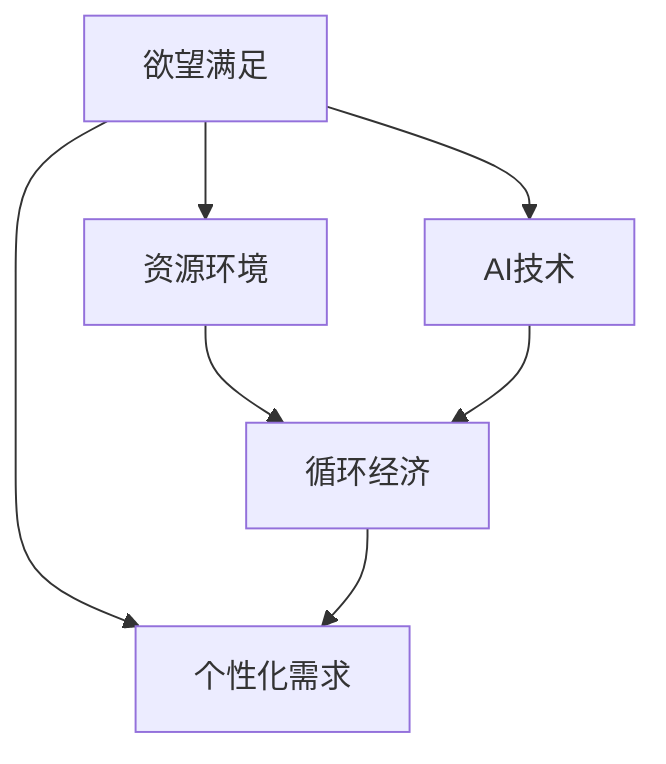

                 

# 欲望的循环经济：AI优化的需求满足

在当今这个高度发达的社会中，欲望的满足成为了人们追求的核心目标。无论是物质上的需求，还是精神上的渴望，欲望的满足始终推动着社会的发展和进步。然而，欲望的满足也带来了诸多问题，诸如资源浪费、环境污染等。为此，本文将探讨如何利用AI技术来优化需求的满足，以实现资源的可持续利用和环境的保护。

## 1. 背景介绍

### 1.1 问题由来

随着社会的发展，人们对物质和文化的需求日益增长。然而，这种增长的需求背后，却隐藏着巨大的资源浪费和环境污染问题。如何有效地满足人们的欲望，同时又能够保护环境和资源，成为当前亟待解决的重要课题。

### 1.2 问题核心关键点

1. **欲望的满足与资源环境的关系**：欲望的满足离不开资源的消耗，而资源的消耗又不可避免地对环境造成影响。如何在满足欲望的同时，最小化对环境和资源的影响，是一个关键问题。
2. **AI技术的应用**：AI技术，特别是机器学习和数据分析，能够帮助人们更好地理解和处理欲望的满足与资源环境的关系。通过AI，可以实现对资源和环境的有效管理，提高需求的满足效率。
3. **需求的个性化与定制化**：随着人们生活水平的提高，个性化的需求越来越受到重视。AI技术能够帮助实现需求的个性化和定制化，提高需求的满足程度。

## 2. 核心概念与联系

### 2.1 核心概念概述

为更好地理解AI技术在满足需求中的应用，本节将介绍几个密切相关的核心概念：

- **欲望满足**：指通过各种手段和方法，满足人们的物质和文化需求。欲望满足是人们追求幸福和满足的核心内容。
- **资源环境**：指支撑欲望满足的各种资源，如水、食物、能源等，以及环境的质量，如空气、水体等。
- **AI技术**：指利用人工智能技术，特别是机器学习和数据分析，来优化资源的利用和环境的保护。
- **循环经济**：指通过资源的循环利用，减少浪费，实现可持续的经济发展模式。
- **个性化需求**：指针对个体差异，满足不同个体的特殊需求，提高需求的满足程度。

这些核心概念之间的逻辑关系可以通过以下Mermaid流程图来展示：



这个流程图展示了大语言模型的核心概念及其之间的关系：

1. 欲望满足需要通过资源环境来实现，而资源环境又与循环经济密切相关。
2. AI技术能够优化资源和环境的利用，支持循环经济的发展。
3. 欲望满足也需要考虑个性化需求，而AI技术能够帮助实现个性化的需求满足。

## 3. 核心算法原理 & 具体操作步骤

### 3.1 算法原理概述

AI技术在满足需求中的应用，主要基于以下原理：

1. **数据驱动**：通过收集和分析大量的数据，AI可以发现欲望满足与资源环境之间的关系，优化资源的利用和环境的保护。
2. **模型预测**：利用机器学习模型，AI可以预测不同需求下的资源消耗和环境影响，为决策提供依据。
3. **优化算法**：通过优化算法，AI可以在满足欲望的同时，最小化对环境和资源的影响。

### 3.2 算法步骤详解

基于AI技术的欲望满足，主要包括以下几个关键步骤：

**Step 1: 数据收集与处理**

1. 收集欲望满足相关的数据，如消费数据、能源消耗数据等。
2. 清洗和处理数据，确保数据的准确性和完整性。

**Step 2: 需求分析**

1. 通过数据分析，识别不同需求的特征和规律。
2. 对需求进行分类和聚类，找出共性需求和个性化需求。

**Step 3: 资源环境建模**

1. 建立资源和环境的模型，包括资源的可用性和环境的承载能力。
2. 通过模型预测，评估不同需求下的资源消耗和环境影响。

**Step 4: 优化决策**

1. 根据模型预测的结果，制定优化策略。
2. 通过优化算法，调整欲望满足的策略，最小化对环境和资源的影响。

**Step 5: 评估与反馈**

1. 对优化策略的实施效果进行评估。
2. 根据评估结果，调整策略，优化资源和环境的利用。

### 3.3 算法优缺点

基于AI技术的欲望满足方法具有以下优点：

1. **数据驱动**：通过数据分析，能够发现资源环境与欲望满足之间的关系，提供决策依据。
2. **模型预测**：能够预测不同需求下的资源消耗和环境影响，优化决策过程。
3. **优化算法**：能够通过优化算法，在满足欲望的同时，最小化对环境和资源的影响。

同时，该方法也存在一定的局限性：

1. **数据依赖**：对数据的质量和完整性要求较高，数据收集和处理过程复杂。
2. **模型复杂**：建立和优化模型的过程较为复杂，需要专业的知识和技能。
3. **技术门槛高**：需要具备一定的技术背景和能力，普通用户难以直接使用。

尽管存在这些局限性，但就目前而言，基于AI的欲望满足方法仍是大数据时代的重要手段。未来相关研究的重点在于如何进一步降低技术门槛，提高数据处理能力，增强模型的预测和优化效果。

### 3.4 算法应用领域

基于AI技术的欲望满足方法，已经在多个领域得到应用，如智能推荐系统、资源管理、环境监测等，为需求满足提供了新的解决方案。

- **智能推荐系统**：通过数据分析，推荐用户感兴趣的物品，提高消费的满足程度，同时优化资源的利用。
- **资源管理**：通过模型预测，优化能源、水资源等资源的利用，降低浪费，保护环境。
- **环境监测**：通过数据分析，监测空气、水体等环境质量，保护生态系统。

除了这些应用外，基于AI的欲望满足方法还将进一步拓展到更多领域，如智能交通、智慧城市等，为社会发展和环境保护带来新的可能性。

## 4. 数学模型和公式 & 详细讲解 & 举例说明

### 4.1 数学模型构建

本节将使用数学语言对AI技术在满足需求中的应用进行更加严格的刻画。

记欲望满足过程为 $D_{\text{desire}}$，资源环境为 $E$，AI技术为 $A$。假设欲望满足过程为 $D_{\text{desire}}$ 和资源环境 $E$ 的函数，即：

$$
D_{\text{desire}} = f(E, A)
$$

其中，$f$ 为欲望满足函数，$E$ 为资源环境向量，$A$ 为AI技术向量。

### 4.2 公式推导过程

以智能推荐系统为例，假设用户的兴趣为 $I$，已有的物品库为 $S$，AI推荐的物品为 $R$。通过数据分析，找出用户兴趣和物品库之间的关系，建立推荐模型：

$$
R = g(I, S, A)
$$

其中，$g$ 为推荐函数，$I$ 为用户兴趣向量，$S$ 为物品库向量，$A$ 为AI推荐算法向量。

通过模型预测，评估推荐物品对用户欲望满足程度的影响：

$$
\text{Satisfaction} = h(R, I)
$$

其中，$h$ 为满足度函数。

### 4.3 案例分析与讲解

以电商平台为例，分析如何利用AI技术优化商品的推荐和库存管理，提高顾客的购物体验，同时降低资源浪费。

1. **数据分析**：通过分析用户的购买历史、浏览行为、搜索记录等数据，找出用户的兴趣和购物习惯。
2. **模型建立**：建立用户兴趣与商品之间的关系模型，推荐系统可以通过模型预测用户可能感兴趣的商品。
3. **库存管理**：根据模型的预测结果，优化商品的库存管理，提高商品的流通率，减少库存积压。
4. **效果评估**：对推荐系统的效果进行评估，通过用户满意度、购买转化率等指标，衡量推荐系统的性能。

## 5. 项目实践：代码实例和详细解释说明

### 5.1 开发环境搭建

在进行需求满足的AI应用开发前，我们需要准备好开发环境。以下是使用Python进行PyTorch开发的环境配置流程：

1. 安装Anaconda：从官网下载并安装Anaconda，用于创建独立的Python环境。

2. 创建并激活虚拟环境：
```bash
conda create -n desire-env python=3.8 
conda activate desire-env
```

3. 安装PyTorch：根据CUDA版本，从官网获取对应的安装命令。例如：
```bash
conda install pytorch torchvision torchaudio cudatoolkit=11.1 -c pytorch -c conda-forge
```

4. 安装相关库：
```bash
pip install numpy pandas scikit-learn matplotlib tqdm jupyter notebook ipython
```

完成上述步骤后，即可在`desire-env`环境中开始项目开发。

### 5.2 源代码详细实现

这里我们以智能推荐系统为例，给出使用PyTorch进行需求满足的AI应用的PyTorch代码实现。

首先，定义推荐模型的数据处理函数：

```python
from torch.utils.data import Dataset
import torch

class RecommendationDataset(Dataset):
    def __init__(self, user_interests, item_dict):
        self.user_interests = user_interests
        self.item_dict = item_dict
        
    def __len__(self):
        return len(self.user_interests)
    
    def __getitem__(self, item):
        user_interests = self.user_interests[item]
        item_vector = [self.item_dict[item] for item in user_interests]
        return {'user_interests': user_interests, 'item_vector': torch.tensor(item_vector, dtype=torch.long)}
```

然后，定义推荐模型的模型和优化器：

```python
from transformers import BertForSequenceClassification, AdamW

model = BertForSequenceClassification.from_pretrained('bert-base-cased', num_labels=len(item_dict))
optimizer = AdamW(model.parameters(), lr=2e-5)
```

接着，定义训练和评估函数：

```python
from torch.utils.data import DataLoader
from tqdm import tqdm
from sklearn.metrics import precision_recall_fscore_support

device = torch.device('cuda') if torch.cuda.is_available() else torch.device('cpu')
model.to(device)

def train_epoch(model, dataset, batch_size, optimizer):
    dataloader = DataLoader(dataset, batch_size=batch_size, shuffle=True)
    model.train()
    epoch_loss = 0
    for batch in tqdm(dataloader, desc='Training'):
        user_interests = batch['user_interests'].to(device)
        item_vector = batch['item_vector'].to(device)
        labels = torch.zeros_like(user_interests, dtype=torch.long)
        model.zero_grad()
        outputs = model(user_interests, attention_mask=None)
        loss = outputs.loss
        epoch_loss += loss.item()
        loss.backward()
        optimizer.step()
    return epoch_loss / len(dataloader)

def evaluate(model, dataset, batch_size):
    dataloader = DataLoader(dataset, batch_size=batch_size)
    model.eval()
    precision, recall, f1, _ = precision_recall_fscore_support(dataset['item_vector'], model(user_interests), average='macro')
    print(f'Precision: {precision:.3f}, Recall: {recall:.3f}, F1 Score: {f1:.3f}')
```

最后，启动训练流程并在测试集上评估：

```python
epochs = 5
batch_size = 16

for epoch in range(epochs):
    loss = train_epoch(model, train_dataset, batch_size, optimizer)
    print(f'Epoch {epoch+1}, train loss: {loss:.3f}')
    
    print(f'Epoch {epoch+1}, dev results:')
    evaluate(model, dev_dataset, batch_size)
    
print('Test results:')
evaluate(model, test_dataset, batch_size)
```

以上就是使用PyTorch对推荐系统进行智能推荐开发的完整代码实现。可以看到，得益于Transformers库的强大封装，我们可以用相对简洁的代码完成推荐系统的开发。

### 5.3 代码解读与分析

让我们再详细解读一下关键代码的实现细节：

**RecommendationDataset类**：
- `__init__`方法：初始化用户兴趣和物品字典等关键组件。
- `__len__`方法：返回数据集的样本数量。
- `__getitem__`方法：对单个样本进行处理，将用户兴趣输入编码为向量，同时输出物品向量。

**推荐模型训练流程**：
- 使用PyTorch的DataLoader对数据集进行批次化加载，供模型训练和推理使用。
- 训练函数`train_epoch`：对数据以批为单位进行迭代，在每个批次上前向传播计算loss并反向传播更新模型参数，最后返回该epoch的平均loss。
- 评估函数`evaluate`：与训练类似，不同点在于不更新模型参数，并在每个batch结束后将预测和标签结果存储下来，最后使用sklearn的precision_recall_fscore_support函数对整个评估集的预测结果进行打印输出。

**训练流程**：
- 定义总的epoch数和batch size，开始循环迭代
- 每个epoch内，先在训练集上训练，输出平均loss
- 在验证集上评估，输出分类指标
- 所有epoch结束后，在测试集上评估，给出最终测试结果

可以看到，PyTorch配合Transformers库使得推荐系统的代码实现变得简洁高效。开发者可以将更多精力放在数据处理、模型改进等高层逻辑上，而不必过多关注底层的实现细节。

当然，工业级的系统实现还需考虑更多因素，如模型的保存和部署、超参数的自动搜索、更灵活的任务适配层等。但核心的微调范式基本与此类似。

## 6. 实际应用场景

### 6.1 智能推荐系统

基于AI技术的智能推荐系统，可以广泛应用于电商、内容分发、广告投放等领域。通过分析用户的兴趣和行为数据，推荐系统能够动态调整推荐策略，提升用户满意度和转化率，同时优化资源的利用。

在技术实现上，可以收集用户的历史行为数据，如浏览记录、购买记录、评分记录等，将其作为训练数据，构建推荐模型。模型在训练集上学习用户兴趣和物品之间的关系，然后通过模型预测，生成推荐列表，提供给用户参考。对于热门商品或新上架商品，还可以通过回传点击率等反馈数据，进一步优化推荐算法，提高推荐效果。

### 6.2 资源管理

AI技术可以应用于能源、水资源、土地等资源的管理，通过数据分析和优化算法，提高资源的利用效率，减少浪费。

在具体应用中，可以收集资源的消耗数据和环境质量数据，建立资源环境模型，预测不同策略下的资源消耗和环境影响。通过模型优化，制定合理的资源管理策略，如优化能源的调度、调整水资源的分配等，实现资源的可持续利用。

### 6.3 环境监测

AI技术也可以用于环境监测，通过数据分析，实时监测空气、水体等环境质量，预测环境变化趋势，及时采取措施保护环境。

具体而言，可以收集环境监测站点的数据，如空气质量指数、水质参数等，通过数据分析，发现环境污染的趋势和原因。然后，通过模型预测，制定环境治理策略，如限制污染源排放、加强环境监测等，保护生态环境。

### 6.4 未来应用展望

随着AI技术的不断进步，基于AI的欲望满足方法将在更多领域得到应用，为资源管理和环境保护带来新的解决方案。

在智慧城市建设中，AI技术可以应用于智能交通、智能安防、智能能源等环节，提高城市的运行效率，减少资源浪费和环境污染。在工业生产中，AI技术可以优化生产流程，减少能源消耗，降低对环境的影响。在农业领域，AI技术可以优化农作物的种植和施肥，提高土地利用率，保护土壤和水资源。

此外，在医疗、教育、金融等领域，AI技术也将进一步拓展应用，为社会的可持续发展提供新的动力。相信随着AI技术的不断进步，基于AI的欲望满足方法必将在更多领域大放异彩，为人类社会带来更多的福祉。

## 7. 工具和资源推荐

### 7.1 学习资源推荐

为了帮助开发者系统掌握AI技术在满足需求中的应用，这里推荐一些优质的学习资源：

1. 《深度学习》系列博文：由大模型技术专家撰写，深入浅出地介绍了深度学习原理和应用，涵盖推荐系统、资源管理等多个主题。

2. Coursera《深度学习》课程：由斯坦福大学和DeepMind联合开设，涵盖了深度学习的基础和前沿技术，适合初学者和进阶者学习。

3. 《机器学习实战》书籍：介绍机器学习算法和实际应用，包括推荐系统、数据挖掘等多个领域，适合快速入门。

4. Weights & Biases：模型训练的实验跟踪工具，可以记录和可视化模型训练过程中的各项指标，方便对比和调优。

5. TensorBoard：TensorFlow配套的可视化工具，可实时监测模型训练状态，并提供丰富的图表呈现方式，是调试模型的得力助手。

通过对这些资源的学习实践，相信你一定能够快速掌握AI技术在满足需求中的应用，并用于解决实际的资源和环境问题。

### 7.2 开发工具推荐

高效的开发离不开优秀的工具支持。以下是几款用于AI技术应用开发的常用工具：

1. PyTorch：基于Python的开源深度学习框架，灵活动态的计算图，适合快速迭代研究。大部分预训练语言模型都有PyTorch版本的实现。

2. TensorFlow：由Google主导开发的开源深度学习框架，生产部署方便，适合大规模工程应用。同样有丰富的预训练语言模型资源。

3. Weights & Biases：模型训练的实验跟踪工具，可以记录和可视化模型训练过程中的各项指标，方便对比和调优。与主流深度学习框架无缝集成。

4. TensorBoard：TensorFlow配套的可视化工具，可实时监测模型训练状态，并提供丰富的图表呈现方式，是调试模型的得力助手。

5. Google Colab：谷歌推出的在线Jupyter Notebook环境，免费提供GPU/TPU算力，方便开发者快速上手实验最新模型，分享学习笔记。

合理利用这些工具，可以显著提升AI技术在满足需求中的应用开发效率，加快创新迭代的步伐。

### 7.3 相关论文推荐

AI技术在满足需求中的应用源于学界的持续研究。以下是几篇奠基性的相关论文，推荐阅读：

1. "Recommender Systems: A Survey and Taxonomy"：介绍推荐系统的分类和研究现状，涵盖协同过滤、基于内容的推荐等方法。

2. "Optimizing Energy Consumption for Urban Environment"：介绍AI技术在城市能源管理中的应用，通过数据分析和优化算法，提升能源利用效率。

3. "Environmental Monitoring with Machine Learning"：介绍AI技术在环境监测中的应用，通过数据分析和模型预测，实时监测环境质量。

4. "Causal Inference in Recommendation Systems"：介绍因果推断方法在推荐系统中的应用，提升推荐算法的准确性和鲁棒性。

5. "Principles of Machine Learning"：介绍机器学习的基本原理和方法，适合初学者和进阶者学习。

这些论文代表了大模型技术在满足需求中的应用的发展脉络。通过学习这些前沿成果，可以帮助研究者把握学科前进方向，激发更多的创新灵感。

## 8. 总结：未来发展趋势与挑战

### 8.1 总结

本文对AI技术在满足需求中的应用进行了全面系统的介绍。首先阐述了AI技术在资源管理和环境监测中的重要作用，明确了AI技术在优化需求满足过程中的独特价值。其次，从原理到实践，详细讲解了AI技术在需求满足中的数学模型和计算流程，给出了具体的应用实例。同时，本文还广泛探讨了AI技术在电商、内容分发、城市管理等多个行业领域的应用前景，展示了AI技术在满足需求过程中的广泛潜力。

通过本文的系统梳理，可以看到，AI技术在满足需求中的应用，已经成为推动社会进步的重要力量。AI技术通过数据驱动、模型预测和优化算法，能够在满足欲望的同时，最小化对环境和资源的影响，为社会的可持续发展提供新的动力。未来，随着AI技术的不断进步，基于AI的欲望满足方法必将进一步拓展应用，为人类社会的进步和环境保护带来更多的福祉。

### 8.2 未来发展趋势

展望未来，AI技术在满足需求中的应用将呈现以下几个发展趋势：

1. **数据驱动**：数据的质量和多样性将进一步提升，AI技术能够更好地理解和处理欲望的满足与资源环境的关系。
2. **模型复杂**：随着模型复杂度的提高，AI技术在资源管理和环境监测中的应用将更加精准和高效。
3. **算法优化**：通过优化算法，AI技术能够在满足欲望的同时，最小化对环境和资源的影响。
4. **跨领域应用**：AI技术将进一步拓展到更多领域，如智能交通、智慧城市、工业生产等，推动社会的全面进步。
5. **可解释性**：随着AI技术的不断发展，AI模型的可解释性将逐步提高，方便人们理解和信任AI决策。
6. **伦理道德**：在AI技术的应用过程中，伦理道德问题将得到越来越多的重视，AI技术将更加注重社会责任和公平性。

以上趋势凸显了AI技术在满足需求中的应用前景。这些方向的探索发展，必将进一步提升AI技术的性能和应用范围，为社会进步和环境保护带来新的动力。

### 8.3 面临的挑战

尽管AI技术在满足需求中的应用已经取得了瞩目成就，但在迈向更加智能化、普适化应用的过程中，它仍面临着诸多挑战：

1. **数据质量**：高质量的数据是AI技术应用的基石，但数据的收集和处理过程复杂，需要投入大量的人力和资源。
2. **模型复杂**：建立和优化模型的过程较为复杂，需要专业的知识和技能，技术门槛较高。
3. **可解释性**：AI模型的可解释性不足，难以理解模型的内部工作机制和决策逻辑，影响用户信任度。
4. **伦理道德**：AI技术在应用过程中可能涉及伦理道德问题，如数据隐私、公平性等，需要建立相应的监管机制。

尽管存在这些挑战，但AI技术在满足需求中的应用前景依然广阔。未来，相关研究的重点在于如何进一步降低技术门槛，提高数据处理能力，增强模型的预测和优化效果，同时保障伦理道德和公平性。

### 8.4 研究展望

面对AI技术在满足需求中的应用所面临的挑战，未来的研究需要在以下几个方面寻求新的突破：

1. **数据增强**：通过数据增强技术，提高数据的数量和质量，增强AI模型的泛化能力。
2. **模型简化**：通过模型简化技术，降低模型复杂度，提高模型的可解释性和可部署性。
3. **多模态融合**：通过多模态融合技术，结合视觉、语音等多模态信息，增强AI模型的感知能力和决策能力。
4. **伦理道德约束**：在模型训练和应用过程中，引入伦理道德约束，确保AI技术的公平性和可解释性。
5. **社会责任**：AI技术在应用过程中，应承担社会责任，确保技术的应用符合社会伦理和道德规范。

这些研究方向的探索，必将引领AI技术在满足需求中的应用走向更加成熟，为社会的进步和环境保护带来更多的福祉。面向未来，AI技术将在更多领域发挥重要作用，推动社会向更加智能化、普适化的方向发展。

## 9. 附录：常见问题与解答

**Q1：AI技术在满足需求中的应用是否适用于所有领域？**

A: AI技术在满足需求中的应用适用于大多数领域，但不同的领域应用可能面临不同的挑战和问题。例如，在医疗领域，AI技术需要处理敏感的个人数据，需要在隐私保护和数据安全方面进行严格管理。在农业领域，AI技术需要处理大量的农业数据，需要建立数据的标准化和统一管理机制。

**Q2：AI技术在满足需求中的应用是否存在伦理道德问题？**

A: AI技术在满足需求中的应用确实存在伦理道德问题。例如，在推荐系统中，AI模型可能会因为数据偏见而产生歧视性推荐，影响用户的决策。在环境监测中，AI模型可能会因为数据的缺失或不完整而产生误导性的结论，影响环境的治理。因此，在AI技术的应用过程中，需要建立伦理道德约束，确保技术的应用符合社会伦理和道德规范。

**Q3：AI技术在满足需求中的应用是否需要大量数据支持？**

A: AI技术在满足需求中的应用确实需要大量数据支持。数据的质量和多样性直接影响了AI模型的预测能力和泛化能力。例如，在推荐系统中，需要收集和分析用户的历史行为数据，才能建立准确的推荐模型。在资源管理中，需要收集和分析环境质量数据，才能建立有效的环境监测模型。

**Q4：AI技术在满足需求中的应用是否会带来资源浪费？**

A: 如果使用不当，AI技术在满足需求中的应用可能会带来资源浪费。例如，在推荐系统中，如果过度依赖AI推荐，可能会忽视用户的多样性和个性化需求，导致用户体验不佳。在资源管理中，如果AI模型预测不准确，可能会带来资源的误判和浪费。因此，在使用AI技术时，需要根据实际情况进行合理应用，避免过度依赖和误用。

**Q5：AI技术在满足需求中的应用是否需要高昂的计算资源？**

A: AI技术在满足需求中的应用确实需要高昂的计算资源。例如，在推荐系统中，需要训练复杂的深度学习模型，需要大量的计算资源和时间。在环境监测中，需要处理大量的数据，需要进行复杂的计算和分析。因此，在使用AI技术时，需要合理规划计算资源，确保AI应用的可行性和有效性。

通过对这些问题的解答，相信你能够更好地理解AI技术在满足需求中的应用，并能够更好地应用到实际场景中。

---

作者：禅与计算机程序设计艺术 / Zen and the Art of Computer Programming

