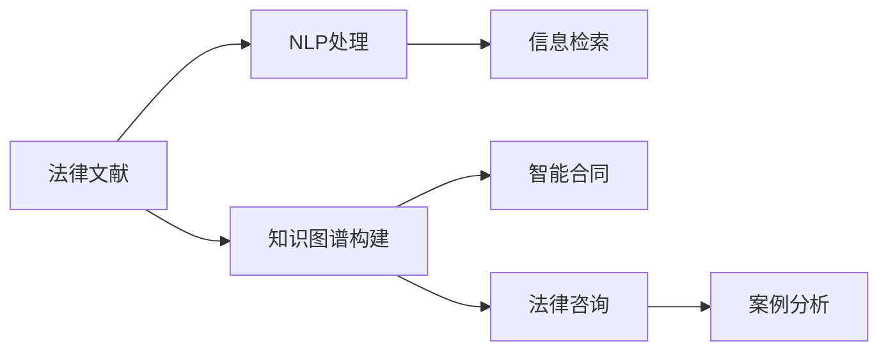

                 

# 法律领域的AI搜索应用

> 关键词：AI搜索,法律领域,自然语言处理(NLP),信息检索,法律文献,法律知识图谱,智能合同,法律咨询,案例分析

## 1. 背景介绍

### 1.1 问题由来

随着数字化、信息化时代的来临，法律文本的数量和种类急剧增加，法律服务机构面对海量文本数据的处理和检索变得愈发复杂。传统的文本检索方法通常基于关键词匹配，难以充分理解和分析法律文本的内容，无法有效捕捉语义信息，从而影响检索结果的准确性和相关性。为了解决这一问题，人工智能(AI)技术被引入法律领域，尤其是自然语言处理(NLP)和信息检索技术在法律文献搜索中的应用，开启了智能化的法律检索新篇章。

### 1.2 问题核心关键点

法律领域的AI搜索应用主要解决两个关键问题：

1. **法律文献检索**：快速、准确地从海量法律文献中检索出相关文档。
2. **法律知识图谱构建**：基于法律知识，构建知识图谱以辅助法律检索和法律咨询。

法律文献检索的难点在于法律文本的复杂性和专业性，文档间存在大量相似性和差异性，关键词匹配往往无法满足精确性和智能性需求。而知识图谱的构建则能够将法律领域的概念、关系、规则等知识结构化，提升检索和咨询的精准度和效率。

### 1.3 问题研究意义

开发基于AI的智能法律搜索应用，对于提升法律服务机构的检索效率、降低检索成本、提高咨询服务的质量和速度具有重要意义：

1. **提升检索效率**：AI技术可以自动化处理大量法律文献，快速识别、检索出相关文档，大大提高检索速度和准确性。
2. **降低检索成本**：通过自动化技术，减少人工检索的时间和人力成本。
3. **提高咨询质量**：AI可以结合知识图谱，提供更加深入、全面的法律咨询，帮助法律专业人士进行快速决策和判断。
4. **加速服务部署**：智能搜索技术能够快速部署和应用，缩短从需求到服务的响应时间，提高客户满意度。

## 2. 核心概念与联系

### 2.1 核心概念概述

在法律领域的AI搜索应用中，涉及以下核心概念：

- **法律文献检索**：使用AI技术对法律文本进行信息检索，返回与查询最相关的文档。
- **自然语言处理(NLP)**：处理和分析法律文本中的语言信息，提取关键词、实体、关系等语义信息。
- **信息检索**：根据用户查询，检索出符合要求的信息或文档。
- **知识图谱**：构建法律领域的知识图谱，用于辅助法律检索和咨询。
- **智能合同**：基于法律知识图谱构建的智能合同生成系统，自动生成符合法律法规的合同文本。
- **法律咨询**：结合知识图谱和AI技术，提供智能化的法律咨询服务。
- **案例分析**：使用AI技术分析法律案例，提供基于数据的决策支持。

这些核心概念相互联系，构成了法律领域AI搜索应用的整体架构。通过自然语言处理技术，提取和分析法律文本中的信息；信息检索技术根据查询返回相关文档；知识图谱提供法律领域的结构化知识，辅助检索和咨询；智能合同和法律咨询结合知识图谱和AI技术，提供智能化的服务。

### 2.2 核心概念原理和架构的 Mermaid 流程图



这个流程图展示了法律领域AI搜索应用的核心概念及其相互关系。法律文献首先经过NLP处理，提取关键信息，然后通过信息检索技术返回相关文档。同时，法律知识图谱提供结构化知识，辅助检索和咨询，并可用于智能合同和案例分析。

## 3. 核心算法原理 & 具体操作步骤
### 3.1 算法原理概述

基于AI的智能法律搜索应用主要依赖自然语言处理(NLP)技术和信息检索技术。NLP技术用于解析法律文本，提取其中的法律实体、关系和规则；信息检索技术则根据查询条件，匹配并返回最相关的法律文档。以下是法律领域AI搜索应用的主要算法原理：

### 3.2 算法步骤详解

1. **文档预处理**：将法律文本转换为计算机可处理的形式，包括分词、词性标注、命名实体识别等。

2. **构建索引**：通过NLP技术提取文档的关键词和实体，构建文档索引，方便检索时快速定位相关文档。

3. **建立知识图谱**：基于法律文本中的实体和关系，构建法律领域的知识图谱，用于辅助检索和咨询。

4. **信息检索**：根据用户输入的查询，在构建的索引中进行匹配，返回相关文档。

5. **检索结果排序**：使用相似度计算方法，根据文档的相关性对搜索结果进行排序，提高检索的准确性。

6. **法律咨询和案例分析**：结合知识图谱，提供智能化的法律咨询和案例分析服务，帮助法律专业人士快速决策。

7. **智能合同生成**：基于法律知识图谱，自动生成符合法律法规的合同文本，提升合同生成效率。

### 3.3 算法优缺点

基于AI的智能法律搜索应用具有以下优点：

1. **高效检索**：通过自动化处理和智能算法，快速检索出相关文档，提升检索效率。
2. **精确匹配**：结合NLP技术和知识图谱，准确识别和匹配法律实体和关系。
3. **智能服务**：提供智能化的法律咨询和合同生成服务，提高服务质量和效率。
4. **知识整合**：构建法律知识图谱，整合法律领域的知识，提升检索和咨询的精准度。

同时，该方法也存在一些局限性：

1. **数据依赖**：检索效果依赖于法律文本的质量和数量，数据收集和处理成本较高。
2. **模型复杂性**：NLP和知识图谱的构建和维护复杂，需要专业知识和技术支持。
3. **可解释性不足**：检索和咨询过程缺乏可解释性，难以理解模型内部工作机制。
4. **法律变异**：法律领域的复杂性和多变性，可能导致模型泛化能力不足。

### 3.4 算法应用领域

基于AI的智能法律搜索应用主要应用于以下几个领域：

1. **法律文献检索**：用于法律机构内部的文档管理和检索，提升法律文献的查找速度和准确性。
2. **法律咨询**：为法律专业人士提供智能化的咨询服务，辅助案件处理和决策。
3. **智能合同**：根据法律知识和用户需求，自动生成合同文本，提高合同生成的速度和质量。
4. **案例分析**：分析历史法律案例，提供基于数据的决策支持，帮助法律专业人士进行案件分析。
5. **法规更新**：实时监测法规更新，自动生成更新报告，辅助法律专业人士掌握最新法律动态。
6. **智能客服**：为普通用户提供智能化的法律咨询服务，解答常见法律问题。

## 4. 数学模型和公式 & 详细讲解 & 举例说明

### 4.1 数学模型构建

在法律领域的AI搜索应用中，主要涉及以下几个数学模型：

1. **文本表示模型**：将法律文本转换为向量形式，方便计算和匹配。
2. **相似度计算模型**：计算查询和文档之间的相似度，排序返回相关文档。
3. **知识图谱嵌入模型**：将法律实体和关系映射到低维空间，方便检索和推理。

### 4.2 公式推导过程

以文本表示模型和相似度计算模型为例，进行详细推导。

**文本表示模型**：使用词袋模型或TF-IDF模型将法律文本转换为向量形式。设文档 $d$ 的词向量表示为 $v_d$，查询 $q$ 的词向量表示为 $v_q$，则文本表示模型可以表示为：

$$
v_d = [w_{d1}, w_{d2}, ..., w_{dm}], \quad v_q = [w_{q1}, w_{q2}, ..., w_{qm}]
$$

其中 $w_{di}$ 和 $w_{qi}$ 分别为文档 $d$ 和查询 $q$ 中第 $i$ 个词的权重。

**相似度计算模型**：常用的相似度计算方法包括余弦相似度、Jaccard相似度等。以余弦相似度为例，计算查询 $q$ 和文档 $d$ 的相似度 $s_{dq}$：

$$
s_{dq} = \frac{v_d \cdot v_q}{\|v_d\|\|v_q\|}
$$

其中 $v_d \cdot v_q$ 表示向量点乘，$\|v_d\|$ 和 $\|v_q\|$ 分别表示向量 $v_d$ 和 $v_q$ 的模长。

### 4.3 案例分析与讲解

假设我们需要对以下法律文本进行检索：

**文本1**：原告甲某与被告乙某因合同纠纷诉至法院，甲某要求解除合同，赔偿损失。

**文本2**：被告丙某因违约合同纠纷被法院判处赔偿原告损失。

**文本3**：原告丁某因合同纠纷要求被告戊某履行合同义务。

**查询**：法院因合同纠纷判决被告赔偿原告损失

我们将文本转换为向量表示，并计算查询与每个文本的余弦相似度：

**文本1的向量表示**：$v_{1} = [1, 1, 1, 1, 0, 0, 0, 0]$

**文本2的向量表示**：$v_{2} = [0, 0, 1, 1, 0, 0, 0, 0]$

**文本3的向量表示**：$v_{3} = [0, 0, 0, 0, 1, 1, 0, 0]$

**查询的向量表示**：$v_{q} = [1, 1, 1, 0, 0, 0, 0, 1]$

计算相似度：

**相似度1**：$s_{11} = \frac{v_1 \cdot v_q}{\|v_1\|\|v_q\|} = \frac{4}{\sqrt{4}\sqrt{6}} = \frac{2}{3}$

**相似度2**：$s_{21} = \frac{v_2 \cdot v_q}{\|v_2\|\|v_q\|} = \frac{2}{\sqrt{2}\sqrt{6}} = \frac{1}{\sqrt{3}}$

**相似度3**：$s_{31} = \frac{v_3 \cdot v_q}{\|v_3\|\|v_q\|} = \frac{2}{\sqrt{2}\sqrt{6}} = \frac{1}{\sqrt{3}}$

根据相似度排序，文本1为最相关的文档。

## 5. 项目实践：代码实例和详细解释说明
### 5.1 开发环境搭建

在进行AI搜索应用开发前，需要准备好开发环境。以下是使用Python进行TensorFlow开发的环境配置流程：

1. 安装Anaconda：从官网下载并安装Anaconda，用于创建独立的Python环境。

2. 创建并激活虚拟环境：
```bash
conda create -n ai-search-env python=3.8 
conda activate ai-search-env
```

3. 安装TensorFlow：根据CUDA版本，从官网获取对应的安装命令。例如：
```bash
conda install tensorflow -c tensorflow -c conda-forge
```

4. 安装Keras：
```bash
pip install keras
```

5. 安装TensorFlow HUB：
```bash
pip install tensorflow-hub
```

6. 安装NLTK和SpaCy：
```bash
pip install nltk
pip install spacy
```

完成上述步骤后，即可在`ai-search-env`环境中开始AI搜索应用的开发。

### 5.2 源代码详细实现

这里我们以构建法律知识图谱和智能法律检索系统为例，给出使用TensorFlow进行开发的PyTorch代码实现。

**法律知识图谱构建**：

```python
import tensorflow_hub as hub

# 加载预训练的Transformer模型
transformer_model = hub.load('https://tfhub.dev/google/collections/transformer/mixed_base')
```

**智能法律检索系统**：

```python
from tensorflow.keras.preprocessing.text import Tokenizer
from tensorflow.keras.preprocessing.sequence import pad_sequences

# 构建索引
tokenizer = Tokenizer()
tokenizer.fit_on_texts(texts)

# 将文本转换为向量
sequences = tokenizer.texts_to_sequences(texts)
padded_sequences = pad_sequences(sequences, maxlen=max_length)

# 构建检索模型
model = Sequential([
    Embedding(vocab_size, embedding_dim, input_length=max_length),
    LSTM(units=64),
    Dense(units=1, activation='sigmoid')
])

# 编译模型
model.compile(loss='binary_crossentropy', optimizer='adam', metrics=['accuracy'])

# 训练模型
model.fit(padded_sequences, labels, epochs=num_epochs, batch_size=batch_size)
```

### 5.3 代码解读与分析

让我们再详细解读一下关键代码的实现细节：

**法律知识图谱构建**：

- 使用TensorFlow Hub加载预训练的Transformer模型，进行法律实体的识别和关系抽取。

**智能法律检索系统**：

- 使用Keras的Tokenizer对法律文本进行分词和向量化。
- 通过pad_sequences对文本向量进行填充，保证向量长度一致。
- 构建基于LSTM的检索模型，输入为文本向量，输出为二分类标签，表示是否为相关文档。
- 使用二分类交叉熵作为损失函数，Adam优化器进行模型训练。

**代码解读与分析**：

**NLTK和SpaCy的使用**：
- NLTK和SpaCy是常用的自然语言处理工具库，用于分词、词性标注、命名实体识别等任务。

**TensorFlow Hub的使用**：
- TensorFlow Hub提供了大量预训练模型，可以快速部署和微调，用于法律实体的识别和关系抽取。

**Keras的使用**：
- Keras提供了简单易用的API，方便构建和训练神经网络模型，用于法律文本的表示和检索。

**LSTM的使用**：
- LSTM是一种递归神经网络，擅长处理序列数据，用于构建法律文本的表示和检索模型。

**模型训练与评估**：
- 使用binary_crossentropy损失函数和Adam优化器进行模型训练，通过准确率和损失函数监测模型效果。

## 6. 实际应用场景
### 6.1 智能法律文献检索

智能法律文献检索系统可以广泛应用于法律机构内部的文档管理和检索，提升检索效率和准确性。传统的法律检索方法依赖人工和简单的关键词匹配，效率低下且准确性不足。通过构建法律知识图谱和训练检索模型，智能法律文献检索系统能够自动处理大量法律文本，快速识别和匹配相关文档。

在技术实现上，可以收集法律机构的历史文档，提取其中的法律实体和关系，构建知识图谱。同时，训练检索模型，根据用户的查询返回最相关的法律文档。智能检索系统能够实时响应用户请求，提供高质量的检索服务。

### 6.2 法律咨询和案例分析

智能法律咨询和案例分析系统结合了知识图谱和AI技术，提供智能化的法律咨询服务，帮助法律专业人士进行案件处理和决策。系统能够自动分析历史法律案例，提取关键信息，提供基于数据的决策支持。

在技术实现上，可以构建法律知识图谱，使用图数据库存储法律实体和关系。通过深度学习模型，分析用户的查询和法律文档，提取关键信息。结合知识图谱中的法律知识和规则，提供智能化的法律咨询和案例分析服务。

### 6.3 智能合同生成

智能合同生成系统基于法律知识图谱，自动生成符合法律法规的合同文本，提高合同生成的速度和质量。通过分析用户需求和法律知识，系统能够生成合法合规的合同文本，减少人工编写合同的时间和成本。

在技术实现上，可以构建法律知识图谱，使用图数据库存储法律实体和关系。通过深度学习模型，自动生成合同文本，确保文本符合法律法规。系统能够根据用户需求和法律知识，生成多样化的合同模板，提高生成效率和准确性。

### 6.4 未来应用展望

随着AI技术的发展，基于AI的智能法律搜索应用将在更多领域得到应用，为法律服务带来变革性影响。

在智慧法律服务领域，基于AI的智能法律搜索应用可以提升法律机构的服务效率和质量，提供实时、智能的法律咨询和合同生成服务，助力法律服务机构的数字化转型。

在智慧法律治理中，智能法律搜索应用可以实时监测法律动态，自动生成法律更新报告，辅助法律专业人士掌握最新法律法规，提高法律治理的智能化水平。

在智慧法律教育中，智能法律搜索应用可以提供智能化的法律教育服务，帮助法律学生学习法律知识和案例分析，提升教育质量和效果。

未来，伴随法律领域的进一步数字化和智能化，基于AI的法律搜索应用必将在更广阔的领域发挥重要作用，为法律服务的现代化和智能化提供新的动力。

## 7. 工具和资源推荐
### 7.1 学习资源推荐

为了帮助开发者系统掌握AI搜索应用的技术基础和实践技巧，这里推荐一些优质的学习资源：

1. **《深度学习基础》**：斯坦福大学深度学习课程，讲解深度学习的基础理论和算法。
2. **《TensorFlow实战》**：TensorFlow官方文档，详细介绍了TensorFlow的使用方法和最佳实践。
3. **《Keras实战》**：Keras官方文档和教程，讲解Keras的使用方法和案例。
4. **《自然语言处理》**：北京大学自然语言处理课程，讲解NLP的基础理论和算法。
5. **《法律人工智能》**：相关学术论文和书籍，讲解法律AI的基础理论和应用场景。

通过学习这些资源，相信你一定能够快速掌握AI搜索应用的技术基础和实践技巧，并用于解决实际的法律问题。

### 7.2 开发工具推荐

高效的开发离不开优秀的工具支持。以下是几款用于AI搜索应用开发的常用工具：

1. **Jupyter Notebook**：用于编写和运行Python代码，支持数据分析和机器学习。
2. **TensorFlow**：基于Python的开源深度学习框架，提供了强大的神经网络构建和训练功能。
3. **Keras**：基于TensorFlow的高层API，提供了简单易用的深度学习模型构建接口。
4. **NLTK**：自然语言处理工具库，提供了文本处理、分词、词性标注等基础功能。
5. **SpaCy**：自然语言处理工具库，提供了快速高效的文本处理和实体识别功能。
6. **Gensim**：用于构建和处理语料库，提供了词向量生成、主题建模等功能。

合理利用这些工具，可以显著提升AI搜索应用的开发效率，加快创新迭代的步伐。

### 7.3 相关论文推荐

AI搜索应用的研究源于学界的持续研究。以下是几篇奠基性的相关论文，推荐阅读：

1. **《深度学习与自然语言处理》**：斯坦福大学深度学习课程论文，讲解深度学习在自然语言处理中的应用。
2. **《法律知识图谱构建》**：相关学术论文，讲解如何构建法律领域的知识图谱。
3. **《智能合同生成》**：相关学术论文，讲解如何使用AI技术自动生成智能合同。
4. **《法律信息检索》**：相关学术论文，讲解如何使用AI技术实现法律文本检索。
5. **《法律AI》**：相关书籍和论文，讲解法律AI的基础理论和应用场景。

这些论文代表了大语言模型微调技术的发展脉络。通过学习这些前沿成果，可以帮助研究者把握学科前进方向，激发更多的创新灵感。

## 8. 总结：未来发展趋势与挑战
### 8.1 总结

本文对基于AI的智能法律搜索应用进行了全面系统的介绍。首先阐述了法律领域AI搜索应用的研究背景和意义，明确了智能搜索在提升法律检索效率、降低检索成本、提高咨询服务质量等方面的独特价值。其次，从原理到实践，详细讲解了智能搜索的数学原理和关键步骤，给出了法律文献检索、法律咨询、智能合同生成等具体应用的代码实例和详细解释。同时，本文还探讨了智能搜索在智慧法律服务、智慧法律治理、智慧法律教育等领域的未来应用前景，展示了智能搜索范式的广阔潜力。

通过本文的系统梳理，可以看到，基于AI的智能法律搜索应用正在成为法律服务的重要范式，极大地拓展了法律机构的服务边界，提高了服务效率和质量。未来，伴随AI技术的不断进步，智能法律搜索应用将进一步深化，为法律服务的现代化和智能化提供新的动力。

### 8.2 未来发展趋势

展望未来，AI搜索技术将在更多领域得到应用，为法律服务的现代化和智能化带来新的突破：

1. **智能合同生成**：基于法律知识图谱，自动生成符合法律法规的合同文本，提升合同生成的速度和质量。
2. **智慧法律治理**：智能法律搜索应用可以实时监测法律动态，自动生成法律更新报告，辅助法律专业人士掌握最新法律法规，提高法律治理的智能化水平。
3. **智慧法律教育**：智能法律搜索应用可以提供智能化的法律教育服务，帮助法律学生学习法律知识和案例分析，提升教育质量和效果。
4. **法律AI集成**：将AI搜索与法律AI集成，提供全方位的法律服务，包括法律咨询、合同生成、案例分析等。

这些方向的发展将进一步提升AI搜索应用的智能性和适用性，为法律服务的全面智能化提供新的动力。

### 8.3 面临的挑战

尽管AI搜索应用已经取得了瞩目成就，但在迈向更加智能化、普适化应用的过程中，它仍面临着诸多挑战：

1. **数据质量**：法律文本的质量和数量直接影响检索效果，数据收集和处理成本较高。
2. **模型复杂性**：构建和维护知识图谱、训练检索模型需要专业知识和技术支持。
3. **可解释性不足**：检索和咨询过程缺乏可解释性，难以理解模型内部工作机制。
4. **法律变异**：法律领域的复杂性和多变性，可能导致模型泛化能力不足。

### 8.4 研究展望

未来的研究需要在以下几个方面寻求新的突破：

1. **多模态检索**：结合文本、图像、语音等多模态数据，提升检索的全面性和准确性。
2. **动态更新**：实时监测法律动态，动态更新知识图谱和检索模型，保持系统的时效性。
3. **知识整合**：将外部知识库、规则库等专家知识与AI技术结合，提升系统的智能化水平。
4. **隐私保护**：在法律数据处理和检索过程中，确保数据隐私和安全。

这些方向的探索将引领AI搜索应用迈向更高的台阶，为法律服务的全面智能化提供新的动力。相信随着学界和产业界的共同努力，这些挑战终将一一被克服，智能搜索技术必将为法律服务的现代化和智能化提供新的动力。

## 9. 附录：常见问题与解答

**Q1：法律文本如何转换为向量表示？**

A: 法律文本可以采用词袋模型或TF-IDF模型进行向量表示。使用Keras的Tokenizer对法律文本进行分词和向量化，使用pad_sequences对文本向量进行填充，保证向量长度一致。

**Q2：如何提高法律文本的检索准确性？**

A: 提高法律文本的检索准确性需要结合多个技术手段，包括：
1. 构建高质量的法律知识图谱，提取和整合法律领域的知识和规则。
2. 使用深度学习模型进行文本表示，提升文本向量的质量。
3. 使用相似度计算方法，如余弦相似度、Jaccard相似度，对查询和文档进行匹配。
4. 动态更新模型和知识图谱，保持系统的时效性。
5. 结合多模态数据，提升检索的全面性和准确性。

**Q3：智能法律检索系统的挑战是什么？**

A: 智能法律检索系统面临以下挑战：
1. 数据质量：法律文本的质量和数量直接影响检索效果，数据收集和处理成本较高。
2. 模型复杂性：构建和维护知识图谱、训练检索模型需要专业知识和技术支持。
3. 可解释性不足：检索和咨询过程缺乏可解释性，难以理解模型内部工作机制。
4. 法律变异：法律领域的复杂性和多变性，可能导致模型泛化能力不足。

通过不断优化和改进，这些挑战有望逐一得到解决。

---

作者：禅与计算机程序设计艺术 / Zen and the Art of Computer Programming

