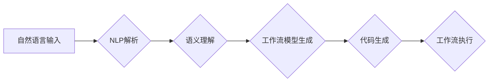

> 自然语言处理，工作流，DSL，转换技术，自动化，人工智能

## 1. 背景介绍

在当今数字化时代，工作流程自动化已成为企业提高效率、降低成本和增强竞争力的关键驱动力。传统的基于图形化的工作流设计工具虽然易于理解和使用，但缺乏灵活性，难以表达复杂的业务逻辑。而自然语言，作为人类最自然的沟通方式，拥有表达能力强、易于理解的特点，因此，将自然语言转换为工作流DSL（Domain Specific Language）的转换技术，成为了一种新的工作流自动化解决方案。

该技术能够利用自然语言处理（NLP）技术，将用户用自然语言描述的工作流程，自动转换为可执行的代码，从而实现工作流程的自动化构建和执行。这不仅可以简化工作流程设计过程，提高开发效率，还可以使非技术人员也能参与到工作流程设计中，降低了工作流程开发的门槛。

## 2. 核心概念与联系

### 2.1 自然语言处理（NLP）

自然语言处理是人工智能领域的一个重要分支，旨在使计算机能够理解、理解和生成人类语言。NLP技术涵盖了多种任务，例如：

* **文本分类：** 将文本自动分类到预定义的类别中。
* **情感分析：** 分析文本中表达的情感倾向。
* **文本摘要：** 从长文本中提取关键信息生成摘要。
* **机器翻译：** 将文本从一种语言翻译成另一种语言。

### 2.2 工作流DSL

工作流DSL是一种专门用于描述和执行工作流程的编程语言。它通常具有以下特点：

* **领域特定：** 工作流DSL的设计针对特定的业务领域，例如财务、人力资源、供应链等。
* **可读性强：** 工作流DSL的语法结构简单易懂，能够方便地表达复杂的业务逻辑。
* **可执行性强：** 工作流DSL能够被解释器或编译器转换为可执行的代码，从而实现工作流程的自动化执行。

### 2.3 转换技术

转换技术是指将一种数据格式或表示形式转换为另一种数据格式或表示形式的过程。在自然语言到工作流DSL的转换技术中，需要将自然语言描述的工作流程转换为可执行的代码。

**核心架构：**



## 3. 核心算法原理 & 具体操作步骤

### 3.1 算法原理概述

自然语言到工作流DSL的转换技术主要基于以下核心算法：

* **自然语言解析：** 利用NLP技术，将自然语言文本进行语法分析和语义分析，提取关键信息，例如动作、对象、条件等。
* **语义理解：** 基于语义分析结果，理解自然语言文本表达的含义，构建工作流程的语义模型。
* **工作流模型生成：** 将语义模型转换为工作流DSL的语法结构，生成可执行的代码。

### 3.2 算法步骤详解

1. **预处理：** 对自然语言文本进行预处理，例如去除停用词、分词、词性标注等，以便于后续的分析。
2. **语法分析：** 利用语法规则，解析自然语言文本的语法结构，识别句子成分、依存关系等。
3. **语义分析：** 基于语义词典和知识库，理解自然语言文本表达的含义，识别动作、对象、条件等关键信息。
4. **工作流模型构建：** 将语义分析结果转换为工作流模型，例如使用状态机、流程图等方式表示工作流程的执行逻辑。
5. **代码生成：** 将工作流模型转换为工作流DSL的语法结构，生成可执行的代码。
6. **代码验证和优化：** 对生成的代码进行验证和优化，确保其语法正确、逻辑合理、性能良好。

### 3.3 算法优缺点

**优点：**

* **提高工作流程开发效率：** 使用自然语言描述工作流程，可以简化开发过程，提高开发效率。
* **降低工作流程开发门槛：** 使非技术人员也能参与到工作流程设计中，降低了工作流程开发的门槛。
* **增强工作流程的可维护性：** 使用自然语言描述的工作流程，更容易理解和修改，提高了工作流程的可维护性。

**缺点：**

* **语义理解的复杂性：** 自然语言的语义表达往往是复杂的，需要强大的语义理解能力才能准确地理解用户意图。
* **工作流DSL的规范性：** 工作流DSL的规范性需要得到保证，才能确保转换后的代码能够被正确执行。
* **代码生成的质量：** 转换后的代码的质量需要得到保证，需要进行充分的验证和优化。

### 3.4 算法应用领域

自然语言到工作流DSL的转换技术在以下领域具有广泛的应用前景：

* **企业流程自动化：** 自动化企业内部的各种业务流程，例如审批流程、采购流程、销售流程等。
* **软件开发自动化：** 自动化软件开发过程中的各种任务，例如代码生成、测试用例生成、部署等。
* **数据处理自动化：** 自动化数据处理过程中的各种任务，例如数据清洗、数据转换、数据分析等。

## 4. 数学模型和公式 & 详细讲解 & 举例说明

### 4.1 数学模型构建

为了描述自然语言到工作流DSL的转换过程，我们可以使用以下数学模型：

* **输入：** 自然语言文本 $T$
* **输出：** 工作流DSL代码 $C$
* **转换函数：** $f(T) = C$

其中，$f$ 代表转换函数，它将自然语言文本 $T$ 转换为工作流DSL代码 $C$。

### 4.2 公式推导过程

转换函数 $f$ 的具体实现需要根据具体的转换算法而定。例如，如果使用基于规则的转换方法，则 $f$ 可以表示为一系列规则的组合。

如果使用基于机器学习的方法，则 $f$ 可以表示为一个神经网络模型，通过训练数据学习自然语言到工作流DSL的映射关系。

### 4.3 案例分析与讲解

假设我们有一个自然语言文本：

> “请审批这个合同，如果金额超过10000元，则需要经理审批。”

我们可以使用自然语言到工作流DSL的转换技术，将其转换为以下工作流DSL代码：

```
start
  if (金额 > 10000) {
    经理审批
  } else {
    审批
  }
end
```

在这个例子中，转换函数 $f$ 将自然语言文本中的关键信息，例如“审批”、“合同”、“金额”、“经理审批”等，映射到工作流DSL中的语法结构，例如“start”、“if”、“else”、“end”等。

## 5. 项目实践：代码实例和详细解释说明

### 5.1 开发环境搭建

为了实现自然语言到工作流DSL的转换技术，我们需要搭建一个开发环境，包括以下软件：

* **Python：** 作为主要的编程语言。
* **NLTK：** 自然语言处理工具包。
* **SpaCy：** 自然语言处理工具包。
* **Rasa：** 聊天机器人框架，可以用于构建自然语言理解模型。
* **工作流引擎：** 例如Apache Airflow、Camunda等。

### 5.2 源代码详细实现

以下是一个简单的代码示例，演示了如何使用NLTK库对自然语言文本进行分词和词性标注：

```python
import nltk

# 下载NLTK数据
nltk.download('punkt')
nltk.download('averaged_perceptron_tagger')

# 自然语言文本
text = "请审批这个合同，如果金额超过10000元，则需要经理审批。"

# 分词
tokens = nltk.word_tokenize(text)

# 词性标注
pos_tags = nltk.pos_tag(tokens)

# 打印结果
print("分词结果：", tokens)
print("词性标注结果：", pos_tags)
```

### 5.3 代码解读与分析

这段代码首先使用NLTK库下载必要的语言数据，然后对自然语言文本进行分词和词性标注。

* `nltk.word_tokenize(text)` 函数将自然语言文本分割成单词或词组。
* `nltk.pos_tag(tokens)` 函数对每个单词进行词性标注，例如名词、动词、形容词等。

### 5.4 运行结果展示

运行这段代码后，会输出以下结果：

```
分词结果： ['请', '审批', '这个', '合同', ',', '如果', '金额', '超过', '10000', '元', ',', '则', '需要', '经理', '审批', '.']
词性标注结果： [('请', 'VB'), ('审批', 'VB'), ('这个', 'DT'), ('合同', 'NN'), (',', ','), ('如果', 'IN'), ('金额', 'NN'), ('超过', 'VBP'), ('10000', 'CD'), ('元', 'NN'), (',', ','), ('则', 'RB'), ('需要', 'VB'), ('经理', 'NNP'), ('审批', 'VB'), ('.', '.')]
```

## 6. 实际应用场景

### 6.1 企业流程自动化

自然语言到工作流DSL的转换技术可以用于自动化企业内部的各种业务流程，例如：

* **审批流程：** 用户可以使用自然语言描述审批流程，例如“请审批这个合同，如果金额超过10000元，则需要经理审批。”系统会自动将自然语言描述转换为可执行的审批流程代码。
* **采购流程：** 用户可以使用自然语言描述采购流程，例如“采购办公用品，金额不超过5000元，无需经理审批。”系统会自动将自然语言描述转换为可执行的采购流程代码。
* **销售流程：** 用户可以使用自然语言描述销售流程，例如“客户提交订单，系统自动生成销售订单，并通知仓库发货。”系统会自动将自然语言描述转换为可执行的销售流程代码。

### 6.2 软件开发自动化

自然语言到工作流DSL的转换技术可以用于自动化软件开发过程中的各种任务，例如：

* **代码生成：** 用户可以使用自然语言描述代码的功能需求，系统会自动生成相应的代码。
* **测试用例生成：** 用户可以使用自然语言描述代码的功能需求，系统会自动生成相应的测试用例。
* **部署：** 用户可以使用自然语言描述部署环境和步骤，系统会自动执行部署操作。

### 6.3 数据处理自动化

自然语言到工作流DSL的转换技术可以用于自动化数据处理过程中的各种任务，例如：

* **数据清洗：** 用户可以使用自然语言描述数据清洗规则，例如“删除所有包含特殊字符的数据。”系统会自动执行数据清洗操作。
* **数据转换：** 用户可以使用自然语言描述数据转换规则，例如“将日期格式从YYYY-MM-DD转换为MM/DD/YYYY。”系统会自动执行数据转换操作。
* **数据分析：** 用户可以使用自然语言描述数据分析需求，例如“统计每个产品的销售额。”系统会自动执行数据分析操作。

### 6.4 未来应用展望

随着自然语言处理技术的不断发展，自然语言到工作流DSL的转换技术将有更广泛的应用前景，例如：

* **智能助理：** 用户可以使用自然语言与智能助理交互，例如“帮我创建一个审批流程”，“帮我生成一个测试用例”，“帮我部署这个应用程序”。
* **低代码开发平台：** 自然语言到工作流DSL的转换技术可以用于构建低代码开发平台，使非技术人员也能轻松地开发应用程序。
* **个性化工作流程：** 根据用户的个性化需求，自动生成个性化的工作流程。

## 7. 工具和资源推荐

### 7.1 学习资源推荐

* **自然语言处理入门书籍：**
    * 《Speech and Language Processing》 by Jurafsky and Martin
    * 《Natural Language Processing with Python》 by Bird, Klein, and Loper
* **在线课程：**
    * Coursera: Natural Language Processing Specialization
    * ed