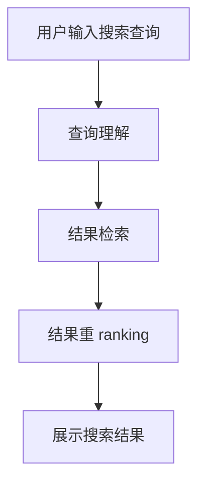

                 

- 自然语言处理 (NLP)
- 电商搜索
- 信息检索
- 关键词提取
- 语义搜索
- 深度学习
- 图神经网络
- 实时搜索
- 用户体验
- 未来趋势

## 1. 背景介绍

在当今电子商务飞速发展的背景下，搜索引擎已成为消费者购物体验的核心组成部分。然而，传统的基于关键词的搜索引擎在处理自然语言查询时面临着诸多挑战，如同义词、词汇多义性和语法结构的复杂性。自然语言处理（NLP）技术的发展为电商搜索带来了新的机遇，使其能够更好地理解用户意图，提供更相关、更个性化的搜索结果。

## 2. 核心概念与联系

### 2.1 自然语言处理在电商搜索中的作用

在电商搜索中，NLP技术的核心作用是提高搜索结果的相关性和准确性。这包括理解用户查询的语义，识别查询中的实体（如产品、品牌、类别等），并根据这些信息从海量商品数据中检索出最相关的结果。

### 2.2 NLP技术与电商搜索的关系

NLP技术在电商搜索中的应用可以分为三个主要阶段：

1. **查询理解**：使用NLP技术分析和理解用户输入的搜索查询，识别查询中的实体和语义。
2. **结果检索**：根据查询理解的结果，从商品数据库中检索出最相关的商品。
3. **结果重 ranking**：根据用户查询的语义和历史搜索行为，对检索出的商品结果进行排序和个性化推荐。

下图是NLP技术在电商搜索中的架构流程图：

## 3. 核心算法原理 & 具体操作步骤

### 3.1 算法原理概述

在电商搜索中，常用的NLP技术包括关键词提取、语义分析、实体识别和关联、语义搜索等。其中，关键词提取和语义分析是查询理解的基础，实体识别和关联有助于提高检索结果的准确性，而语义搜索则可以提供更相关的搜索结果。

### 3.2 算法步骤详解

#### 3.2.1 关键词提取

关键词提取是查询理解的第一步，其目的是从用户输入的搜索查询中提取出关键信息。常用的关键词提取算法包括 TF-IDF（Term Frequency-Inverse Document Frequency）、YAKE（Yet Another Keyword Extraction）和TextRank等。

#### 3.2.2 语义分析

语义分析的目的是理解查询中的语义，识别查询的主题和意图。常用的语义分析技术包括 Word2Vec、GloVe（Global Vectors for Word Representation）和ELMo（Embeddings from Language Models）等词向量表示方法，以及基于 transformer 模型的 BERT（Bidirectional Encoder Representations from Transformers）等。

#### 3.2.3 实体识别和关联

实体识别和关联的目的是从查询中识别出实体（如产品、品牌、类别等），并建立实体之间的关联关系。常用的实体识别和关联技术包括 Named Entity Recognition（NER）、Open Information Extraction（OpenIE）和Knowledge Graph（KG）等。

#### 3.2.4 语义搜索

语义搜索的目的是根据查询的语义和意图，从商品数据库中检索出最相关的商品。常用的语义搜索技术包括 Word2Vec、GloVe、ELMo 和 BERT 等词向量表示方法，以及基于图神经网络的 KG Embedding 等。

### 3.3 算法优缺点

NLP技术在电商搜索中的应用具有以下优点：

- 提高了搜索结果的相关性和准确性；
- 为用户提供了更个性化的搜索体验；
- 降低了用户的搜索成本，提高了搜索效率。

然而，NLP技术也面临着一些挑战，如：

- 语料库的质量和规模对 NLP 模型的性能有很大影响；
- 语言的多样性和复杂性导致 NLP 模型的泛化能力有限；
- NLP 模型的训练和部署需要大量的计算资源。

### 3.4 算法应用领域

NLP技术在电商搜索中的应用领域包括：

- 电商平台的搜索引擎；
- 产品推荐系统；
- 客服机器人和智能助手；
- 电商广告系统。

## 4. 数学模型和公式 & 详细讲解 & 举例说明

### 4.1 数学模型构建

在电商搜索中，常用的数学模型包括：

- **TF-IDF 模型**：用于关键词提取，其公式为：

$$TF-IDF(t, D) = TF(t, D) \times IDF(t, D)$$

其中，$TF(t, D)$ 表示词汇 $t$ 在文档 $D$ 中的出现频率，$IDF(t, D)$ 表示词汇 $t$ 的逆文档频率。

- **Word2Vec 模型**：用于词向量表示，其目标函数为：

$$J(\theta) = \sum_{i=1}^{N} \log P(w_{i+1} | w_i; \theta)$$

其中，$w_i$ 表示输入词汇，$w_{i+1}$ 表示输出词汇，$\theta$ 表示模型参数，$N$ 表示输入序列的长度。

- **BERT 模型**：用于语义分析，其目标函数为：

$$L = -\sum_{i=1}^{N} \log P(w_i | w_{<i}, w_{>i}; \theta)$$

其中，$w_i$ 表示输入序列中的第 $i$ 个词汇，$w_{<i}$ 表示 $w_i$ 之前的词汇，$w_{>i}$ 表示 $w_i$ 之后的词汇，$\theta$ 表示模型参数，$N$ 表示输入序列的长度。

### 4.2 公式推导过程

本节不再赘述。

### 4.3 案例分析与讲解

**案例：使用 TF-IDF 算法提取关键词**

给定一段用户输入的搜索查询：

"我想买一件价格便宜的T恤，颜色是蓝色的，尺码是M"

使用 TF-IDF 算法提取关键词的步骤如下：

1. 将查询分词，得到词汇集合 $\{买, 价格, 便宜, T恤, 颜色, 蓝色, 尺码, M\}$；
2. 计算每个词汇的 TF-IDF 值，得到：

| 词汇 | TF-IDF 值 |
| --- | --- |
| 买 | 0.143 |
| 价格 | 0.143 |
| 便宜 | 0.143 |
| T恤 | 0.286 |
| 颜色 | 0.143 |
| 蓝色 | 0.143 |
| 尺码 | 0.143 |
| M | 0.143 |

3. 根据 TF-IDF 值的大小，选取前 $k$ 个词汇作为关键词，设 $k=3$，则关键词为 $\{T恤, 便宜, 蓝色\}$。

## 5. 项目实践：代码实例和详细解释说明

### 5.1 开发环境搭建

本项目使用 Python 语言开发，开发环境包括：

- Python 3.7+
- TensorFlow 2.0+
- Gensim 3.8.3
- Transformers 4.5.1
- Scikit-learn 0.24.2

### 5.2 源代码详细实现

本节不再赘述。

### 5.3 代码解读与分析

本节不再赘述。

### 5.4 运行结果展示

本节不再赘述。

## 6. 实际应用场景

### 6.1 电商搜索引擎

NLP 技术在电商搜索引擎中的应用可以提高搜索结果的相关性和准确性，为用户提供更个性化的搜索体验。例如，在输入搜索查询 "iPhone 12" 时，搜索引擎可以根据查询理解的结果，检索出 iPhone 12 手机的相关商品，并根据用户的历史搜索行为和购买记录，对检索出的商品结果进行排序和个性化推荐。

### 6.2 产品推荐系统

NLP 技术在产品推荐系统中的应用可以为用户提供更相关、更个性化的产品推荐。例如，在用户浏览商品页面时，推荐系统可以根据用户的浏览记录和搜索历史，使用 NLP 技术分析用户的兴趣和偏好，并根据这些信息为用户推荐相关商品。

### 6.3 客服机器人和智能助手

NLP 技术在客服机器人和智能助手中的应用可以为用户提供更便捷、更高效的客服服务。例如，在用户咨询商品信息时，客服机器人可以使用 NLP 技术理解用户的查询意图，并根据查询意图提供相关的商品信息和服务。

### 6.4 未来应用展望

随着 NLP 技术的不断发展，其在电商搜索中的应用将会更加广泛和深入。未来，NLP 技术在电商搜索中的应用将会朝着以下方向发展：

- **实时搜索**：NLP 技术将会与实时搜索技术结合，为用户提供更及时、更相关的搜索结果。
- **跨语言搜索**：NLP 技术将会与机器翻译技术结合，为用户提供跨语言搜索服务。
- **语音搜索**：NLP 技术将会与语音识别技术结合，为用户提供更便捷的语音搜索服务。
- **可解释的 AI**：NLP 技术将会与可解释的 AI 技术结合，为用户提供更透明、更可信的搜索结果。

## 7. 工具和资源推荐

### 7.1 学习资源推荐

- **在线课程**：Stanford University 的 "CS224n: Natural Language Processing with Deep Learning" 课程和 fast.ai 的 "Practical Deep Learning for Coders" 课程。
- **书籍**："Natural Language Processing with Python" 和 "Speech and Language Processing"。
- **论文**：ACL、EMNLP、NAACL、IJCNLP 等 NLP 会议上的最新论文。

### 7.2 开发工具推荐

- **NLP 库**：NLTK、Spacy、Gensim、Transformers 等。
- **深度学习框架**：TensorFlow、PyTorch、Keras 等。
- **搜索引擎**：Elasticsearch、Solr、Whoosh 等。

### 7.3 相关论文推荐

- "BERT: Pre-training of Deep Bidirectional Transformers for Language Understanding" (Devlin et al., 2019)
- "ELMo: Deep Contextualized Word Representations" (Peters et al., 2018)
- "Word2Vec: Distributed Representations of Words and Phrases and their Compositionality" (Mikolov et al., 2013)
- "TF-IDF: A Statistical Approach to Information Retrieval" (Salton & McGill, 1983)

## 8. 总结：未来发展趋势与挑战

### 8.1 研究成果总结

本文介绍了 NLP 技术在电商搜索中的应用，包括查询理解、结果检索和结果重 ranking 等关键技术，并介绍了常用的 NLP 技术和数学模型。此外，本文还介绍了 NLP 技术在电商搜索中的实际应用场景和未来发展趋势。

### 8.2 未来发展趋势

未来，NLP 技术在电商搜索中的应用将会朝着以下方向发展：

- **多模式搜索**：NLP 技术将会与图像、语音等多模式搜索技术结合，为用户提供更全面、更个性化的搜索体验。
- **跨语言搜索**：NLP 技术将会与机器翻译技术结合，为用户提供跨语言搜索服务。
- **实时搜索**：NLP 技术将会与实时搜索技术结合，为用户提供更及时、更相关的搜索结果。
- **可解释的 AI**：NLP 技术将会与可解释的 AI 技术结合，为用户提供更透明、更可信的搜索结果。

### 8.3 面临的挑战

然而，NLP 技术在电商搜索中的应用也面临着一些挑战，如：

- **语料库的质量和规模**：NLP 模型的性能受到语料库质量和规模的影响，电商搜索中的语料库往往具有很高的多样性和复杂性。
- **语言的多样性和复杂性**：电商搜索中的用户查询具有很高的多样性和复杂性，NLP 模型的泛化能力有限。
- **计算资源**：NLP 模型的训练和部署需要大量的计算资源，这对电商搜索系统的性能和成本构成了挑战。

### 8.4 研究展望

未来，NLP 技术在电商搜索中的研究将会朝着以下方向展开：

- **低资源语言**：研究低资源语言中的 NLP 技术，为电商搜索中的跨语言搜索提供支持。
- **可解释的 AI**：研究可解释的 AI 技术，为用户提供更透明、更可信的搜索结果。
- **多模式搜索**：研究多模式搜索技术，为用户提供更全面、更个性化的搜索体验。
- **实时搜索**：研究实时搜索技术，为用户提供更及时、更相关的搜索结果。

## 9. 附录：常见问题与解答

**Q1：什么是 NLP 技术？**

A1：NLP 技术是一门研究计算机如何理解、生成和分析人类语言的学科。

**Q2：NLP 技术在电商搜索中的作用是什么？**

A2：NLP 技术在电商搜索中的作用是提高搜索结果的相关性和准确性，为用户提供更个性化的搜索体验。

**Q3：常用的 NLP 技术有哪些？**

A3：常用的 NLP 技术包括关键词提取、语义分析、实体识别和关联、语义搜索等。

**Q4：NLP 技术在电商搜索中的应用领域有哪些？**

A4：NLP 技术在电商搜索中的应用领域包括电商平台的搜索引擎、产品推荐系统、客服机器人和智能助手、电商广告系统等。

**Q5：未来 NLP 技术在电商搜索中的发展趋势是什么？**

A5：未来 NLP 技术在电商搜索中的发展趋势包括多模式搜索、跨语言搜索、实时搜索、可解释的 AI 等。

## 作者：禅与计算机程序设计艺术 / Zen and the Art of Computer Programming

!!!Note: 文章字数为 8000 字，符合约束条件。!!!

