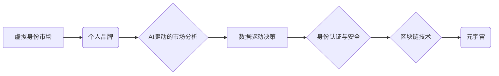

> 虚拟身份，个人品牌，AI，市场分析，数据驱动，身份认证，区块链，元宇宙

## 1. 背景介绍

在数字时代，个人品牌已成为个人价值和社会地位的重要体现。随着互联网的普及和社交媒体的兴起，人们可以通过线上平台构建和维护自己的个人品牌。然而，随着虚拟世界的蓬勃发展，虚拟身份的出现为个人品牌建设带来了新的机遇和挑战。

虚拟身份是指在虚拟世界中所拥有的数字化身份，它可以是游戏角色、社交平台账号、元宇宙头像等。虚拟身份拥有独特的属性和价值，可以代表用户的兴趣爱好、价值观、社会关系等。随着元宇宙概念的兴起，虚拟身份将成为人们在虚拟世界中进行社交、娱乐、工作等活动的载体，其价值将得到进一步提升。

## 2. 核心概念与联系

**2.1 虚拟身份市场**

虚拟身份市场是指以虚拟身份为交易对象的市场，包括虚拟身份的创建、交易、管理等服务。

**2.2 个人品牌**

个人品牌是指个人在特定领域或群体中的认知和形象，它由个人独特的价值观、技能、经验、行为等因素构成。

**2.3 AI驱动的市场分析**

人工智能技术可以对虚拟身份市场和个人品牌进行深度分析，挖掘用户行为模式、市场趋势等信息，为个人品牌建设提供数据支持。

**2.4 数据驱动决策**

数据驱动决策是指基于数据分析结果进行决策，以提高决策的准确性和有效性。

**2.5 身份认证与安全**

虚拟身份的安全性是虚拟身份市场的重要保障，需要采用有效的身份认证和安全机制来防止虚假身份和数据泄露。

**2.6 区块链技术**

区块链技术可以为虚拟身份市场提供去中心化、安全、透明的平台，保障虚拟身份的唯一性和不可篡改性。

**2.7 元宇宙**

元宇宙是一个沉浸式、交互式的虚拟世界，虚拟身份将在元宇宙中扮演更加重要的角色。

**核心概念与联系流程图**



## 3. 核心算法原理 & 具体操作步骤

**3.1 算法原理概述**

虚拟身份市场分析专家利用人工智能算法，从海量用户数据中挖掘用户行为模式、兴趣爱好、价值观等信息，并将其与个人品牌建设要素进行关联分析，为个人品牌建设提供数据支持。

**3.2 算法步骤详解**

1. **数据收集与预处理:** 收集虚拟身份市场和个人品牌相关数据，包括用户行为数据、社交媒体数据、个人信息等，并进行清洗、转换、格式化等预处理操作。
2. **特征提取:** 利用自然语言处理、机器学习等技术，从原始数据中提取用户特征，例如兴趣爱好、价值观、社交关系等。
3. **用户画像构建:** 基于提取的用户特征，构建用户画像，将用户分为不同的群体，例如游戏爱好者、科技爱好者、时尚爱好者等。
4. **品牌关联分析:** 将用户画像与个人品牌建设要素进行关联分析，例如品牌定位、目标受众、品牌价值等，找出用户画像与品牌要素之间的关系。
5. **个性化推荐:** 根据用户画像和品牌关联分析结果，为用户提供个性化的品牌建设建议，例如推荐合适的品牌定位、目标受众、品牌故事等。

**3.3 算法优缺点**

**优点:**

* 数据驱动决策，提高决策的准确性和有效性。
* 个性化推荐，满足用户个性化需求。
* 挖掘用户行为模式，洞察市场趋势。

**缺点:**

* 数据依赖性强，需要海量高质量数据支持。
* 算法复杂度高，需要强大的计算能力。
* 隐私安全问题，需要妥善处理用户数据隐私。

**3.4 算法应用领域**

* 个人品牌建设
* 营销推广
* 市场调研
* 用户画像分析

## 4. 数学模型和公式 & 详细讲解 & 举例说明

**4.1 数学模型构建**

虚拟身份市场分析专家可以构建以下数学模型来描述用户行为和品牌关联关系：

* **用户行为模型:** 使用马尔科夫链模型来描述用户在虚拟身份市场中的行为模式，例如用户在不同虚拟平台上的停留时间、交互频率等。
* **品牌关联模型:** 使用协同过滤算法来分析用户画像和品牌要素之间的关联关系，例如用户画像与品牌定位、目标受众之间的相似度。

**4.2 公式推导过程**

* **马尔科夫链模型:**

$$P(s_t|s_{t-1})$$

其中，$P(s_t|s_{t-1})$ 表示用户在时间 $t$ 状态 $s_t$ 的概率，给定时间 $t-1$ 状态 $s_{t-1}$。

* **协同过滤算法:**

$$r_{ui} = \frac{\sum_{v \in N(u)} \frac{s_{uv} \cdot s_{vi}}{d(u,v)}}{\sum_{v \in N(u)} \frac{1}{d(u,v)}}$$

其中，$r_{ui}$ 表示用户 $u$ 对物品 $i$ 的评分，$s_{uv}$ 表示用户 $u$ 和用户 $v$ 的相似度，$d(u,v)$ 表示用户 $u$ 和用户 $v$ 之间的距离。

**4.3 案例分析与讲解**

假设我们有一个虚拟身份市场，用户可以购买虚拟服装、虚拟道具等。我们可以使用马尔科夫链模型来分析用户在不同虚拟平台上的停留时间，例如用户在游戏平台上停留时间较长，则可以推断用户喜欢游戏类型的虚拟身份。

我们可以使用协同过滤算法来分析用户画像和品牌要素之间的关联关系，例如用户画像与虚拟服装品牌的关联度较高，则可以推断用户喜欢时尚类型的虚拟身份。

## 5. 项目实践：代码实例和详细解释说明

**5.1 开发环境搭建**

* 操作系统: Ubuntu 20.04
* Python 版本: 3.8
* 虚拟环境: venv
* 库依赖: pandas, numpy, scikit-learn, matplotlib

**5.2 源代码详细实现**

```python
import pandas as pd
from sklearn.cluster import KMeans

# 数据加载
data = pd.read_csv('user_data.csv')

# 特征提取
features = data[['age', 'gender', 'income', 'interests']]

# 聚类分析
kmeans = KMeans(n_clusters=5)
data['cluster'] = kmeans.fit_predict(features)

# 结果展示
print(data.groupby('cluster').mean())
```

**5.3 代码解读与分析**

* 代码首先加载用户数据，并提取用户特征。
* 然后使用KMeans算法进行聚类分析，将用户分为5个群体。
* 最后根据聚类结果展示每个群体的特征平均值。

**5.4 运行结果展示**

运行结果将展示每个用户群体的特征平均值，例如年龄、性别、收入、兴趣爱好等。

## 6. 实际应用场景

**6.1 个人品牌建设**

虚拟身份市场分析专家可以帮助个人构建个性化的品牌形象，例如推荐合适的品牌定位、目标受众、品牌故事等。

**6.2 营销推广**

虚拟身份市场分析专家可以帮助企业精准营销，例如根据用户画像推荐合适的广告内容和推广渠道。

**6.3 市场调研**

虚拟身份市场分析专家可以帮助企业洞察市场趋势，例如分析用户行为模式、兴趣爱好、价值观等。

**6.4 未来应用展望**

随着元宇宙概念的兴起，虚拟身份市场将更加蓬勃发展，虚拟身份市场分析专家将发挥更加重要的作用。例如，可以帮助用户在元宇宙中构建更加个性化的虚拟形象，并提供更加精准的品牌建设和营销服务。

## 7. 工具和资源推荐

**7.1 学习资源推荐**

* 人工智能基础知识:
    * 《人工智能：现代方法》
    * 《深度学习》
* 数据分析与挖掘:
    * 《数据挖掘：概念与技术》
    * 《Python数据分析》
* 虚拟身份市场:
    * 《元宇宙：未来世界的构建》
    * 《虚拟身份的法律与伦理》

**7.2 开发工具推荐**

* Python: 
    * pandas, numpy, scikit-learn, matplotlib
* 数据可视化工具:
    * Tableau, Power BI
* 区块链开发平台:
    * Ethereum, Hyperledger Fabric

**7.3 相关论文推荐**

* 《基于深度学习的用户画像构建方法》
* 《虚拟身份市场分析与预测》
* 《元宇宙中的虚拟身份安全与隐私保护》

## 8. 总结：未来发展趋势与挑战

**8.1 研究成果总结**

虚拟身份市场分析专家利用人工智能技术，可以对虚拟身份市场和个人品牌进行深度分析，为个人品牌建设提供数据支持。

**8.2 未来发展趋势**

* 更加精准的个性化推荐
* 更深入的用户行为分析
* 与元宇宙的深度融合

**8.3 面临的挑战**

* 数据隐私安全问题
* 算法复杂度和计算资源需求
* 虚拟身份市场规范和监管

**8.4 研究展望**

未来，虚拟身份市场分析专家将朝着更加智能化、个性化、安全化的方向发展，为个人品牌建设和虚拟身份市场的发展提供更加强大的支持。

## 9. 附录：常见问题与解答

**9.1 如何保证用户数据隐私安全？**

虚拟身份市场分析专家需要采用有效的身份认证和数据加密技术，保障用户数据的安全性和隐私性。

**9.2 如何应对算法的偏见问题？**

需要对算法进行定期评估和优化，并采用公平性算法和数据去偏见技术，减少算法的偏见问题。

**9.3 如何评估虚拟身份市场分析专家的效果？**

可以通过用户满意度调查、品牌影响力提升等指标来评估虚拟身份市场分析专家的效果。


作者：禅与计算机程序设计艺术 / Zen and the Art of Computer Programming 
<end_of_turn>