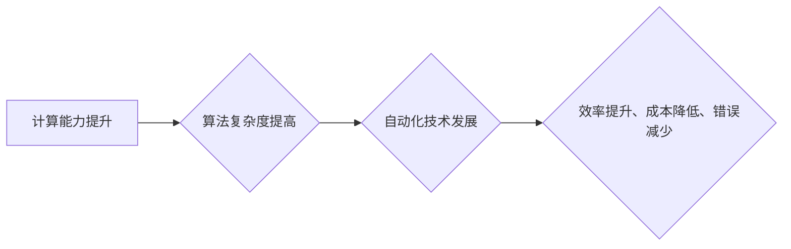

> 计算能力、自动化技术、机器学习、深度学习、人工智能、算法优化、数据驱动

## 1. 背景介绍

自动化技术在各个领域蓬勃发展，从制造业到金融，从医疗保健到交通运输，自动化正在改变着我们的生活方式和工作模式。而推动这种自动化技术飞速发展的关键力量，正是不断增长的计算能力。

从早期的机械计算器到如今的超级计算机，计算能力的提升是科技进步的基石。随着摩尔定律的持续演进，芯片的性能和密度不断提高，计算资源变得更加丰富和廉价。这为自动化技术的应用提供了坚实的基础。

## 2. 核心概念与联系

**2.1 自动化技术**

自动化技术是指利用机器、程序和算法来代替人工完成重复性、规则性或危险性任务的过程。它旨在提高效率、降低成本、减少错误，并释放人类的创造力和智力资源。

**2.2 计算能力**

计算能力是指计算机系统处理信息的速率和规模。它通常用FLOPS（每秒浮点运算次数）来衡量，反映了计算机处理数值计算的能力。

**2.3 联系**

计算能力的提升直接推动了自动化技术的进步。强大的计算能力使得我们可以开发更复杂的算法，处理更大的数据量，并实现更精细的控制和决策。

**Mermaid 流程图**



## 3. 核心算法原理 & 具体操作步骤

**3.1 算法原理概述**

自动化技术的核心是算法，它是一种解决特定问题的步骤或规则。常见的自动化算法包括：

* **规则引擎:** 基于预先定义的规则进行决策和执行。
* **机器学习:** 通过数据训练，使算法能够自动学习和改进。
* **深度学习:** 一种更高级的机器学习方法，利用多层神经网络模拟人类大脑的学习过程。

**3.2 算法步骤详解**

以机器学习为例，其基本步骤包括：

1. **数据收集:** 收集与目标任务相关的训练数据。
2. **数据预处理:** 清洗、转换和格式化数据，使其适合算法训练。
3. **模型选择:** 选择合适的机器学习算法模型。
4. **模型训练:** 使用训练数据训练模型，使其能够学习数据中的模式和规律。
5. **模型评估:** 使用测试数据评估模型的性能，并进行调整和优化。
6. **模型部署:** 将训练好的模型部署到实际应用场景中。

**3.3 算法优缺点**

不同的自动化算法具有不同的优缺点，需要根据具体任务选择合适的算法。

* **规则引擎:** 优点是易于理解和维护，缺点是难以处理复杂和变化的场景。
* **机器学习:** 优点是能够学习和适应数据变化，缺点是需要大量数据进行训练，且模型解释性较差。
* **深度学习:** 优点是能够处理更复杂的数据模式，缺点是训练成本高，且对数据质量要求更高。

**3.4 算法应用领域**

自动化算法广泛应用于各个领域，例如：

* **图像识别:** 自动识别和分类图像内容。
* **自然语言处理:** 理解和生成人类语言。
* **预测分析:** 基于历史数据预测未来趋势。
* **机器人控制:** 控制机器人的动作和行为。

## 4. 数学模型和公式 & 详细讲解 & 举例说明

**4.1 数学模型构建**

机器学习算法通常基于数学模型，例如线性回归、逻辑回归、支持向量机等。这些模型通过数学公式来描述数据之间的关系，并进行预测或分类。

**4.2 公式推导过程**

例如，线性回归模型的目标是找到一条直线，使得这条直线与数据点之间的误差最小。其数学公式如下：

$$
y = mx + c
$$

其中，$y$ 是预测值，$x$ 是输入特征，$m$ 是斜率，$c$ 是截距。

通过最小化误差函数，可以求解出最佳的$m$和$c$值。

**4.3 案例分析与讲解**

假设我们有一个数据集，包含房屋面积和房屋价格的信息。我们可以使用线性回归模型来预测房屋价格。

通过训练模型，我们可以得到一个最佳的线性回归方程，例如：

$$
y = 2000x + 50000
$$

其中，$y$ 是房屋价格，$x$ 是房屋面积。

这意味着，每增加1平方米的房屋面积，房屋价格将增加2000元。

## 5. 项目实践：代码实例和详细解释说明

**5.1 开发环境搭建**

可以使用Python语言和相关的机器学习库，例如Scikit-learn，来实现自动化项目。

**5.2 源代码详细实现**

```python
from sklearn.linear_model import LinearRegression

# 数据集
X = [[100], [150], [200], [250], [300]]  # 房屋面积
y = [60000, 80000, 100000, 120000, 140000]  # 房屋价格

# 创建线性回归模型
model = LinearRegression()

# 训练模型
model.fit(X, y)

# 预测新数据
new_area = [220]
predicted_price = model.predict(new_area)

# 打印预测结果
print(f"房屋面积为{new_area}平方米，预测价格为{predicted_price}")
```

**5.3 代码解读与分析**

这段代码首先定义了房屋面积和房屋价格的数据集。然后，创建了一个线性回归模型，并使用训练数据训练模型。最后，使用训练好的模型预测新数据的房屋价格。

**5.4 运行结果展示**

运行代码后，将输出预测结果，例如：

```
房屋面积为[220]平方米，预测价格为[110000.0]
```

## 6. 实际应用场景

**6.1 制造业**

自动化技术广泛应用于制造业，例如：

* **机器人焊接:** 机器人可以自动完成焊接任务，提高效率和精度。
* **自动化装配线:** 自动化装配线可以自动完成产品的组装过程，减少人工操作。
* **智能工厂:** 智能工厂利用传感器、数据分析和自动化技术，实现生产过程的智能化管理。

**6.2 金融业**

自动化技术在金融业的应用包括：

* **欺诈检测:** 利用机器学习算法识别和预防金融欺诈行为。
* **风险管理:** 利用数据分析和自动化技术评估和管理金融风险。
* **客户服务:** 利用聊天机器人和语音识别技术提供自动化的客户服务。

**6.3 医疗保健**

自动化技术在医疗保健领域应用于：

* **疾病诊断:** 利用机器学习算法分析患者数据，辅助医生进行疾病诊断。
* **药物研发:** 利用自动化技术加速药物研发过程。
* **手术机器人:** 利用机器人技术辅助医生进行手术操作，提高手术精度和安全性。

**6.4 未来应用展望**

随着计算能力的持续提升和自动化技术的不断发展，未来将有更多新的应用场景出现，例如：

* **个性化医疗:** 利用自动化技术提供个性化的医疗服务。
* **自动驾驶:** 利用自动化技术实现无人驾驶汽车。
* **智能家居:** 利用自动化技术打造智能家居环境。

## 7. 工具和资源推荐

**7.1 学习资源推荐**

* **在线课程:** Coursera、edX、Udacity等平台提供丰富的机器学习和深度学习课程。
* **书籍:** 《机器学习》、《深度学习》、《Python机器学习实战》等书籍。
* **博客和论坛:** Kaggle、Towards Data Science等平台提供大量的机器学习和深度学习相关博客和论坛。

**7.2 开发工具推荐**

* **Python:** 广泛用于机器学习和深度学习开发。
* **Scikit-learn:** Python机器学习库，提供各种机器学习算法和工具。
* **TensorFlow:** Google开发的开源深度学习框架。
* **PyTorch:** Facebook开发的开源深度学习框架。

**7.3 相关论文推荐**

* **《ImageNet Classification with Deep Convolutional Neural Networks》**
* **《Attention Is All You Need》**
* **《BERT: Pre-training of Deep Bidirectional Transformers for Language Understanding》**

## 8. 总结：未来发展趋势与挑战

**8.1 研究成果总结**

近年来，自动化技术取得了显著的进展，特别是机器学习和深度学习领域。这些技术已经应用于各个领域，并取得了令人瞩目的成果。

**8.2 未来发展趋势**

未来，自动化技术将继续朝着以下方向发展：

* **更强大的计算能力:** 随着芯片技术的进步，计算能力将继续提升，推动自动化技术的发展。
* **更复杂的算法:** 研究人员将开发更复杂的算法，能够处理更复杂的数据模式和任务。
* **更广泛的应用场景:** 自动化技术将应用于更多新的领域，例如医疗保健、教育、娱乐等。

**8.3 面临的挑战**

自动化技术的发展也面临着一些挑战：

* **数据安全和隐私:** 自动化技术依赖于大量数据，如何保护数据安全和隐私是一个重要问题。
* **算法偏见:** 机器学习算法可能会受到训练数据的影响，导致算法偏见，需要进行算法公平性评估和改进。
* **伦理问题:** 自动化技术可能会带来一些伦理问题，例如工作岗位替代、人工智能的责任等，需要进行深入的探讨和研究。

**8.4 研究展望**

未来，我们需要继续加强对自动化技术的研究，探索其潜力，并解决其带来的挑战。同时，也要关注自动化技术的社会影响，确保其能够造福人类。

## 9. 附录：常见问题与解答

**9.1 如何选择合适的自动化算法？**

选择合适的自动化算法需要根据具体任务的特点和数据情况进行选择。例如，对于分类任务，可以考虑使用支持向量机或决策树算法；对于回归任务，可以考虑使用线性回归或神经网络算法。

**9.2 如何评估自动化算法的性能？**

可以使用各种指标来评估自动化算法的性能，例如准确率、召回率、F1-score、AUC等。

**9.3 如何解决自动化算法的偏见问题？**

可以采用以下方法来解决自动化算法的偏见问题：

* 使用更公平的训练数据。
* 使用算法公平性评估工具。
* 对算法进行调整和改进。


作者：禅与计算机程序设计艺术 / Zen and the Art of Computer Programming 
<end_of_turn>