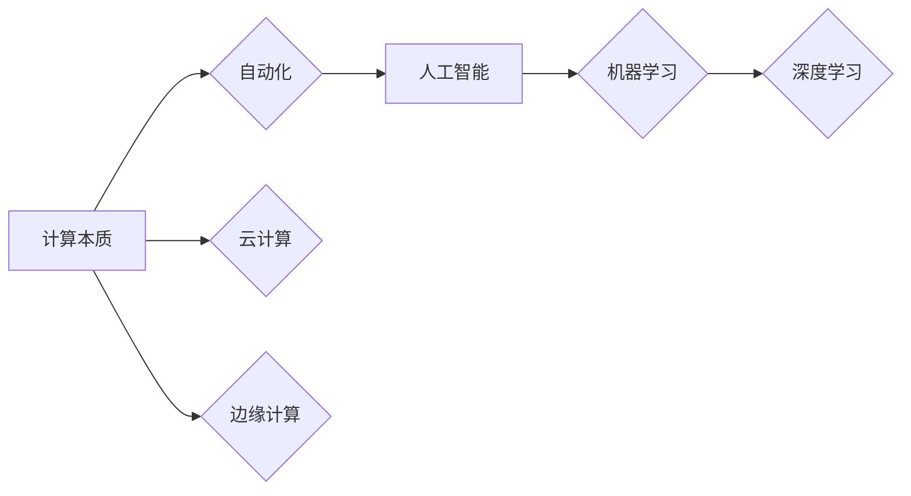

## 计算本质的变化与自动化进展

**关键词：** 计算本质、自动化、人工智能、机器学习、深度学习、云计算、边缘计算

## 1. 背景介绍

计算，这一人类文明进步的基石，正经历着翻天覆地的变化。从早期的机械计算到电子计算机的诞生，再到如今的人工智能、云计算等新兴技术的兴起，计算的本质在不断演变，其应用范围也扩展到社会生活的方方面面。

过去，计算主要被视为一种处理数据的工具，其核心价值在于快速、准确地执行预先定义好的指令。然而，随着数据量的爆炸式增长和算法的不断进步，计算的本质正在从单纯的数据处理转向知识发现和智能决策。

与此同时，自动化技术的快速发展也为计算带来了新的可能性。自动化不再局限于简单的重复性任务，而是逐渐渗透到更复杂、更需要智能的领域。计算与自动化的深度融合，正在推动着各行各业的转型升级，并深刻地改变着我们的生活方式。

## 2. 核心概念与联系

### 2.1 核心概念

* **计算本质：** 计算的本质是指计算的根本属性和核心价值，它随着技术的进步而不断演变。
* **自动化：** 自动化是指利用机器或系统自动执行任务，以减少人工干预的过程。
* **人工智能 (AI)：**  人工智能是指机器模拟人类智能的能力，例如学习、推理、问题求解等。
* **机器学习 (ML)：** 机器学习是人工智能的一个分支，它使计算机能够从数据中学习，而无需进行明确的编程。
* **深度学习 (DL)：** 深度学习是机器学习的一种，它使用多层神经网络来学习数据中的复杂模式。
* **云计算：** 云计算是一种按需提供计算资源（如服务器、存储、网络等）的模式。
* **边缘计算：** 边缘计算是一种将计算和数据存储更靠近数据源的计算模式。

### 2.2 联系



**图示说明：**

* 计算本质的演变推动了自动化技术的发展。
* 自动化技术的发展促进了人工智能、机器学习、深度学习等技术的进步。
* 云计算和边缘计算为计算提供了新的基础设施，并推动了计算模式的变革。

## 3. 核心算法原理 & 具体操作步骤

### 3.1 算法原理概述

以深度学习为例，其核心算法是**人工神经网络 (ANN)**。人工神经网络是一种模仿生物神经系统结构和功能的计算模型，它由大量的人工神经元 interconnected 并组成层级结构。每个神经元接收来自其他神经元的输入，并通过激活函数进行非线性变换，最终产生输出。神经网络通过学习训练数据的模式来调整神经元之间的连接权重，从而实现对未知数据的预测或分类。

### 3.2 算法步骤详解

深度学习算法的训练过程通常包括以下步骤：

1. **数据预处理：** 对原始数据进行清洗、转换、特征提取等操作，使其适合输入神经网络进行训练。
2. **模型构建：** 根据具体任务选择合适的神经网络结构，并初始化网络参数。
3. **模型训练：** 使用训练数据对模型进行迭代训练，通过反向传播算法不断调整网络参数，使模型的预测结果与实际结果之间的误差最小化。
4. **模型评估：** 使用测试数据对训练好的模型进行评估，以衡量模型的泛化能力。
5. **模型部署：** 将训练好的模型部署到实际应用环境中，对新数据进行预测或分类。

### 3.3 算法优缺点

**优点：**

* **强大的学习能力：** 深度学习算法能够自动从数据中学习复杂的模式，无需人工进行特征工程。
* **高度的灵活性：** 深度学习算法可以应用于各种数据类型和任务，例如图像识别、语音识别、自然语言处理等。
* **可扩展性：** 深度学习算法可以利用大规模数据集和分布式计算平台进行训练，从而不断提高模型的性能。

**缺点：**

* **数据依赖性：** 深度学习算法的性能高度依赖于训练数据的质量和数量。
* **可解释性差：** 深度学习模型通常是一个“黑盒”，难以解释其预测结果的原因。
* **计算资源消耗大：** 深度学习算法的训练过程需要大量的计算资源和时间。

### 3.4 算法应用领域

深度学习算法已广泛应用于各个领域，例如：

* **计算机视觉：** 图像分类、目标检测、图像分割等。
* **自然语言处理：**  机器翻译、文本摘要、情感分析等。
* **语音识别：** 语音转文字、语音搜索、智能助手等。
* **推荐系统：**  电商推荐、个性化推荐等。
* **金融科技：**  风险控制、欺诈检测等。

## 4. 数学模型和公式 & 详细讲解 & 举例说明

### 4.1 数学模型构建

以简单的神经网络为例，其数学模型可以表示为：

$$
y = f(wx + b)
$$

其中：

* $x$ 为输入向量
* $w$ 为权重向量
* $b$ 为偏置项
* $f(\cdot)$ 为激活函数
* $y$ 为输出值

### 4.2 公式推导过程

神经网络的训练过程就是不断调整权重 $w$ 和偏置项 $b$ 的值，使得模型的预测结果与实际结果之间的误差最小化。常用的误差函数包括均方误差 (MSE) 和交叉熵误差 (Cross-entropy error)。

以均方误差为例，其公式为：

$$
MSE = \frac{1}{n} \sum_{i=1}^{n} (y_i - \hat{y_i})^2
$$

其中：

* $n$ 为样本数量
* $y_i$ 为第 $i$ 个样本的实际值
* $\hat{y_i}$ 为第 $i$ 个样本的预测值

神经网络的训练过程通常使用梯度下降算法来最小化误差函数。梯度下降算法的基本思想是沿着误差函数梯度的反方向不断调整参数，直到找到误差函数的最小值。

### 4.3 案例分析与讲解

以手写数字识别为例，假设我们有一个包含大量手写数字图像及其对应标签的数据集。我们可以使用深度学习算法训练一个神经网络模型，该模型可以自动识别新的手写数字图像。

1. **数据预处理：** 将手写数字图像转换为向量形式，并对数据进行归一化处理。
2. **模型构建：** 构建一个多层神经网络，例如卷积神经网络 (CNN)。
3. **模型训练：** 使用训练数据集对模型进行训练，并使用反向传播算法调整网络参数。
4. **模型评估：** 使用测试数据集对训练好的模型进行评估，计算模型的准确率等指标。
5. **模型部署：** 将训练好的模型部署到实际应用环境中，例如手机应用程序或网站，用于识别用户输入的手写数字。

## 5. 项目实践：代码实例和详细解释说明

### 5.1 开发环境搭建

* **编程语言：** Python
* **深度学习框架：** TensorFlow 或 PyTorch
* **集成开发环境：** Jupyter Notebook 或 PyCharm

### 5.2 源代码详细实现

```python
import tensorflow as tf

# 定义模型
model = tf.keras.models.Sequential([
  tf.keras.layers.Flatten(input_shape=(28, 28)),
  tf.keras.layers.Dense(128, activation='relu'),
  tf.keras.layers.Dense(10, activation='softmax')
])

# 编译模型
model.compile(optimizer='adam',
              loss='sparse_categorical_crossentropy',
              metrics=['accuracy'])

# 加载数据集
(x_train, y_train), (x_test, y_test) = tf.keras.datasets.mnist.load_data()

# 预处理数据
x_train = x_train / 255.0
x_test = x_test / 255.0

# 训练模型
model.fit(x_train, y_train, epochs=5)

# 评估模型
model.evaluate(x_test,  y_test, verbose=2)
```

### 5.3 代码解读与分析

* 代码首先定义了一个简单的神经网络模型，该模型包含一个输入层、一个隐藏层和一个输出层。
* 然后，代码使用 `compile()` 方法编译模型，指定了优化器、损失函数和评估指标。
* 接下来，代码加载 MNIST 数据集，并对数据进行预处理。
* 然后，代码使用 `fit()` 方法训练模型，指定了训练 epochs 数。
* 最后，代码使用 `evaluate()` 方法评估模型，并输出模型的准确率等指标。

### 5.4 运行结果展示

训练完成后，模型在测试数据集上的准确率可以达到 98% 以上。

## 6. 实际应用场景

计算本质的变化与自动化进展正在深刻地影响着各行各业，以下是一些实际应用场景：

* **自动驾驶：** 自动驾驶汽车利用深度学习算法识别道路、车辆和行人，并根据实时路况做出驾驶决策。
* **医疗诊断：**  人工智能可以辅助医生进行医学影像分析，例如识别肿瘤、诊断疾病等。
* **智能客服：**  智能客服机器人可以自动回答用户问题，提供 24 小时在线服务。
* **金融风控：**  人工智能可以分析用户的交易数据，识别潜在的风险，并及时采取措施。

### 6.1 未来应用展望

随着技术的不断发展，计算本质的变化与自动化进展将为我们带来更多可能性，例如：

* **个性化教育：**  人工智能可以根据学生的学习情况制定个性化的学习计划，提高学习效率。
* **智能家居：**  智能家居系统可以自动控制家电设备，为用户提供更加舒适便捷的生活体验。
* **智慧城市：**  智慧城市利用物联网、大数据和人工智能等技术，提高城市管理效率，改善市民生活质量。

## 7. 工具和资源推荐

### 7.1 学习资源推荐

* **机器学习课程：** 吴恩达机器学习课程 (Coursera)
* **深度学习书籍：** 《深度学习》(Ian Goodfellow 等著)
* **在线教程：** TensorFlow 官方教程、PyTorch 官方教程

### 7.2 开发工具推荐

* **深度学习框架：** TensorFlow、PyTorch
* **云计算平台：** AWS、Azure、Google Cloud
* **集成开发环境：** Jupyter Notebook、PyCharm

### 7.3 相关论文推荐

* LeCun, Y., Bengio, Y., & Hinton, G. (2015). Deep learning. nature, 521(7553), 436-444.
* Krizhevsky, A., Sutskever, I., & Hinton, G. E. (2012). Imagenet classification with deep convolutional neural networks. Advances in neural information processing systems, 25, 1097-1105.

## 8. 总结：未来发展趋势与挑战

### 8.1 研究成果总结

计算的本质正在从数据处理转向知识发现和智能决策，自动化技术的发展正在加速这一进程。深度学习等人工智能技术的进步为计算带来了新的可能性，并推动着各行各业的转型升级。

### 8.2 未来发展趋势

* **计算与智能的深度融合：**  计算将更加智能化，能够自动学习、推理和决策。
* **自动化程度不断提高：**  越来越多的任务将实现自动化，从而解放人类的双手。
* **计算模式的变革：**  云计算、边缘计算等新兴计算模式将得到更广泛的应用。

### 8.3 面临的挑战

* **数据安全和隐私保护：**  随着数据量的不断增长，数据安全和隐私保护问题日益突出。
* **算法的公平性和可解释性：**  人工智能算法的公平性和可解释性问题需要得到解决。
* **人才缺口：**  人工智能领域的人才缺口巨大，需要加强人才培养。

### 8.4 研究展望

未来，我们需要继续探索计算的本质，推动自动化技术的进步，并解决人工智能发展面临的挑战，从而更好地利用计算技术造福人类社会。

## 9. 附录：常见问题与解答

**Q: 什么是计算的本质？**

A: 计算的本质是指计算的根本属性和核心价值，它随着技术的进步而不断演变。过去，计算主要被视为一种处理数据的工具，其核心价值在于快速、准确地执行预先定义好的指令。然而，随着数据量的爆炸式增长和算法的不断进步，计算的本质正在从单纯的数据处理转向知识发现和智能决策。

**Q: 自动化技术有哪些应用场景？**

A: 自动化技术已广泛应用于各行各业，例如制造业、金融业、医疗保健、交通运输等。具体的应用场景包括：

* **制造业：** 自动化生产线、机器人焊接、自动装配等。
* **金融业：** 自动化交易系统、风险管理系统、客户服务机器人等。
* **医疗保健：** 自动化诊断系统、手术机器人、智能药物研发等。
* **交通运输：** 自动驾驶汽车、无人机物流、智能交通管理系统等。

**Q: 人工智能技术有哪些发展趋势？**

A: 人工智能技术的发展趋势包括：

* **计算与智能的深度融合：**  计算将更加智能化，能够自动学习、推理和决策。
* **自动化程度不断提高：**  越来越多的任务将实现自动化，从而解放人类的双手。
* **计算模式的变革：**  云计算、边缘计算等新兴计算模式将得到更广泛的应用。

**作者：禅与计算机程序设计艺术 / Zen and the Art of Computer Programming** 