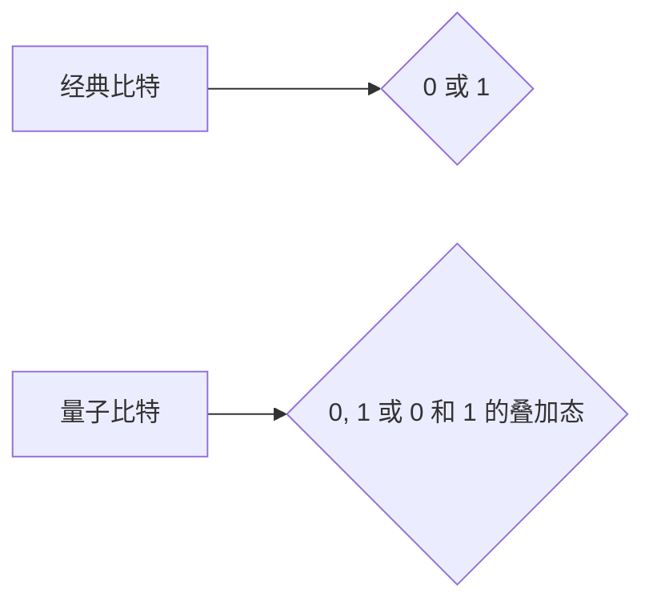
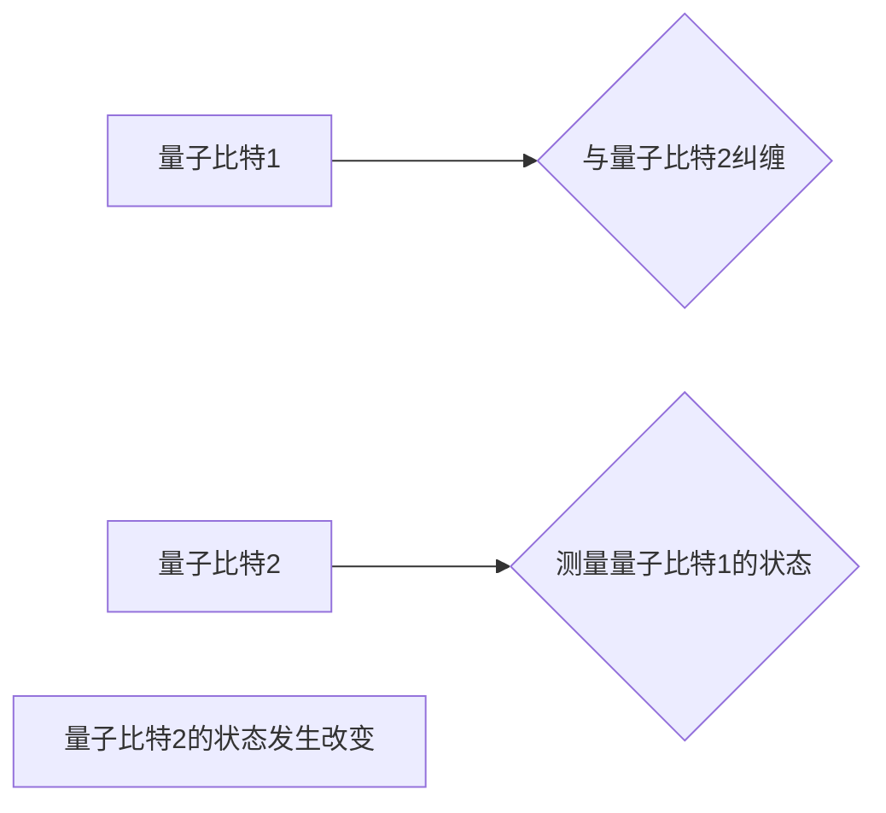

> 量子计算，量子比特，叠加态，纠缠态，量子算法，量子计算机

## 1. 背景介绍

随着摩尔定律的放缓，传统计算机的计算能力发展面临瓶颈。量子力学，作为描述微观世界行为的理论，为突破计算极限提供了新的思路。量子计算利用量子力学的奇异特性，如叠加态和纠缠态，构建了一种全新的计算模型，具有超越经典计算机的强大计算能力。

量子计算的出现，标志着计算领域进入了一个全新的时代。它不仅有可能解决目前经典计算机难以解决的复杂问题，例如药物研发、材料科学、人工智能等，也可能彻底改变我们对计算的理解和应用。

## 2. 核心概念与联系

### 2.1 量子比特

经典计算机的基本计算单元是比特，它只能处于0或1的两个状态。而量子比特（qubit）则可以利用量子力学的叠加原理，同时处于0和1的叠加态。

**经典比特与量子比特的比较:**

| 特性 | 经典比特 | 量子比特 |
|---|---|---|
| 状态 | 0 或 1 | 0、1 或 0 和 1 的叠加态 |
| 操作 | 逻辑门 | 量子门 |

**Mermaid 流程图:**



### 2.2 叠加态

叠加态是指量子比特可以同时处于多个状态的现象。例如，一个量子比特可以处于0和1的叠加态，其状态可以用一个复数的线性组合来表示。

### 2.3 纠缠态

纠缠态是指两个或多个量子比特之间存在一种特殊的关联关系，即使它们相隔很远，测量一个量子比特的状态也会瞬间影响另一个量子比特的状态。

**Mermaid 流程图:**



## 3. 核心算法原理 & 具体操作步骤

### 3.1 算法原理概述

量子算法利用量子比特的叠加态和纠缠态特性，通过量子门操作实现计算。与经典算法不同，量子算法可以并行处理多个计算路径，从而大大提高计算效率。

### 3.2 算法步骤详解

1. 将经典问题转换为量子问题，并将其编码为量子比特的状态。
2. 通过量子门操作，将量子比特进行叠加态和纠缠态的构建。
3. 利用量子算法的特定操作步骤，对量子比特进行计算。
4. 将计算结果从量子比特的状态中提取出来，并转换为经典形式。

### 3.3 算法优缺点

**优点:**

* 计算效率高，可以解决经典算法难以解决的复杂问题。
* 具有并行计算能力，可以大幅缩短计算时间。

**缺点:**

* 量子硬件技术尚不成熟，难以构建大型量子计算机。
* 量子算法的开发难度高，需要深入理解量子力学原理。
* 量子计算结果易受环境干扰，稳定性较差。

### 3.4 算法应用领域

* **药物研发:** 模拟分子结构和反应，加速药物设计和开发。
* **材料科学:** 研究新材料的性质和性能，设计新型材料。
* **人工智能:** 提高机器学习算法的效率和精度，开发更智能的 AI 系统。
* **密码学:** 构建更安全的加密算法，抵抗量子计算机的攻击。

## 4. 数学模型和公式 & 详细讲解 & 举例说明

### 4.1 数学模型构建

量子比特的状态可以用一个复数的线性组合来表示，称为量子态。

$$
| \psi \rangle = a | 0 \rangle + b | 1 \rangle
$$

其中，$|0\rangle$ 和 $|1\rangle$ 分别表示量子比特处于0和1状态的基态，$a$ 和 $b$ 是复数系数，满足 $|a|^2 + |b|^2 = 1$。

### 4.2 公式推导过程

量子门操作可以看作是线性变换，它将量子态从一个状态变换到另一个状态。例如，Hadamard 门可以将量子比特从 $|0\rangle$ 变换到 $\frac{1}{\sqrt{2}}(|0\rangle + |1\rangle)$。

### 4.3 案例分析与讲解

**例子：**

使用 Hadamard 门对量子比特进行操作，可以将量子比特从 $|0\rangle$ 变换到 $\frac{1}{\sqrt{2}}(|0\rangle + |1\rangle)$。

$$
H | 0 \rangle = \frac{1}{\sqrt{2}}(|0\rangle + |1\rangle)
$$

## 5. 项目实践：代码实例和详细解释说明

### 5.1 开发环境搭建

可以使用 Qiskit 或 Cirq 等量子计算框架进行开发。

### 5.2 源代码详细实现

```python
from qiskit import QuantumCircuit, Aer, execute

# 创建一个量子电路
qc = QuantumCircuit(1)

# 应用 Hadamard 门
qc.h(0)

# 模拟运行电路
simulator = Aer.get_backend('qasm_simulator')
job = execute(qc, simulator, shots=1024)
result = job.result()

# 获取测量结果
counts = result.get_counts(qc)
print(counts)
```

### 5.3 代码解读与分析

这段代码首先创建了一个量子电路，然后应用 Hadamard 门对量子比特进行操作。最后，使用模拟器运行电路并获取测量结果。

### 5.4 运行结果展示

运行结果显示，量子比特处于0和1的叠加态，测量结果呈现出接近 50% 的概率分布。

## 6. 实际应用场景

### 6.1 量子模拟

量子计算机可以模拟量子系统，例如分子和材料，从而帮助我们理解它们的性质和行为。

### 6.2 量子优化

量子算法可以用于解决优化问题，例如物流调度和金融投资。

### 6.3 量子密码学

量子密码学可以利用量子力学原理构建更安全的加密算法，抵抗量子计算机的攻击。

### 6.4 未来应用展望

量子计算技术还在发展阶段，但其未来应用潜力巨大。随着量子硬件技术的进步，量子计算将应用于更多领域，例如药物研发、人工智能、材料科学等。

## 7. 工具和资源推荐

### 7.1 学习资源推荐

* **Qiskit:** https://qiskit.org/
* **Cirq:** https://quantumai.google/cirq
* **IBM Quantum Experience:** https://quantum-computing.ibm.com/

### 7.2 开发工具推荐

* **Qiskit Aqua:** https://qiskit.org/aqua/
* **Cirq:** https://quantumai.google/cirq

### 7.3 相关论文推荐

* **Quantum Computation and Quantum Information:** https://www.amazon.com/Quantum-Computation-Information-Michael-Nielsen/dp/0521635039
* **Quantum Supremacy Using a Programmable Superconducting Processor:** https://arxiv.org/abs/1907.01293

## 8. 总结：未来发展趋势与挑战

### 8.1 研究成果总结

量子计算是一个新兴的领域，近年来取得了显著进展。量子算法的开发、量子硬件的构建以及量子软件的开发都取得了突破性进展。

### 8.2 未来发展趋势

* **量子硬件的规模化发展:** 构建更大规模、更稳定、更可靠的量子计算机。
* **量子算法的不断创新:** 开发更多高效的量子算法，解决更复杂的问题。
* **量子软件生态系统的构建:** 完善量子软件开发工具和平台，促进量子计算的应用。

### 8.3 面临的挑战

* **量子硬件的稳定性和可靠性:** 量子比特容易受到环境干扰，需要提高其稳定性和可靠性。
* **量子算法的开发难度:** 量子算法的开发需要深入理解量子力学原理，难度较高。
* **量子计算的成本:** 量子计算机的构建和运行成本较高，需要降低成本才能实现广泛应用。

### 8.4 研究展望

量子计算是一个充满挑战和机遇的领域，未来发展潜力巨大。随着研究的深入和技术的进步，量子计算将改变我们对计算的理解和应用，为人类社会带来革命性的变革。

## 9. 附录：常见问题与解答

### 9.1 量子计算机和经典计算机的区别是什么？

量子计算机利用量子力学原理，可以同时处于多个状态，从而实现并行计算，而经典计算机只能处理一个状态。

### 9.2 量子计算的应用领域有哪些？

量子计算的应用领域非常广泛，包括药物研发、材料科学、人工智能、密码学等。

### 9.3 量子计算技术目前处于什么阶段？

量子计算技术目前还处于发展阶段，但近年来取得了显著进展。

### 9.4 量子计算的未来发展趋势是什么？

量子计算的未来发展趋势是量子硬件的规模化发展、量子算法的不断创新以及量子软件生态系统的构建。

作者：禅与计算机程序设计艺术 / Zen and the Art of Computer Programming


<end_of_turn>