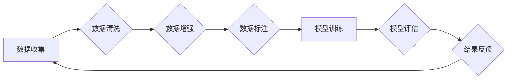

> 谷歌大模型，数据问题，模型训练，数据质量，偏见问题，公平性，可解释性，伦理问题

## 1. 背景介绍

近年来，深度学习技术取得了令人瞩目的成就，尤其是在自然语言处理领域。谷歌作为人工智能领域的领军者，开发了众多强大的大模型，例如BERT、LaMDA、PaLM等。这些模型在文本生成、翻译、问答等任务上表现出色，展现了人工智能的巨大潜力。然而，大模型的训练和应用也面临着诸多挑战，其中数据问题尤为突出。

## 2. 核心概念与联系

**2.1 大模型的概念**

大模型是指参数量巨大、训练数据海量的人工智能模型。这些模型通常拥有数十亿甚至数千亿个参数，需要大量的计算资源和时间进行训练。大模型的优势在于其强大的泛化能力和学习能力，能够处理复杂的任务并生成高质量的输出。

**2.2 数据问题**

数据是深度学习模型训练的基础，模型的性能直接取决于数据的质量和数量。然而，现实世界的数据往往存在以下问题：

* **数据不完整:** 数据可能缺失部分信息，导致模型训练不充分。
* **数据不准确:** 数据可能包含错误或不准确的信息，影响模型的学习效果。
* **数据不平衡:** 数据中某些类别可能比其他类别更少，导致模型对少数类别的预测能力不足。
* **数据偏见:** 数据可能反映社会中的偏见，导致模型生成带有偏见的输出。

**2.3 数据问题与大模型的关系**

大模型的训练需要海量数据，而数据问题会直接影响大模型的性能和可靠性。例如，如果训练数据中存在偏见，那么大模型也可能生成带有偏见的输出，导致不公平的结果。

**2.4 数据问题解决方案**

解决数据问题是一个复杂的任务，需要从多个方面入手：

* **数据清洗:** 识别和修复数据中的错误或不准确信息。
* **数据增强:** 通过人工或自动的方法增加数据的数量和多样性。
* **数据标注:** 为数据添加标签，以便模型进行训练和评估。
* **公平性算法:** 开发能够 mitigating 数据偏见的方法。

**2.5 Mermaid 流程图**



## 3. 核心算法原理 & 具体操作步骤

**3.1 算法原理概述**

大模型的训练通常使用深度学习算法，例如Transformer。Transformer是一种基于注意力机制的网络结构，能够有效地捕捉文本中的长距离依赖关系。

**3.2 算法步骤详解**

1. **数据预处理:** 将文本数据转换为模型可以理解的格式，例如词嵌入。
2. **模型训练:** 使用训练数据训练Transformer模型，调整模型参数以最小化预测误差。
3. **模型评估:** 使用测试数据评估模型的性能，例如准确率、困惑度等。
4. **模型调优:** 根据评估结果调整模型超参数，例如学习率、批处理大小等，以提高模型性能。

**3.3 算法优缺点**

**优点:**

* 强大的泛化能力和学习能力。
* 可以处理复杂的任务，例如文本生成、翻译、问答等。

**缺点:**

* 训练成本高，需要大量的计算资源和时间。
* 模型参数量大，难以解释和调试。
* 容易受到数据偏见的影响。

**3.4 算法应用领域**

* 自然语言处理：文本生成、翻译、问答、情感分析等。
* 图像识别：物体检测、图像分类、图像分割等。
* 语音识别：语音转文本、语音合成等。
* 机器翻译：将一种语言翻译成另一种语言。
* 自动驾驶：感知环境、规划路径、控制车辆等。

## 4. 数学模型和公式 & 详细讲解 & 举例说明

**4.1 数学模型构建**

Transformer模型的核心是注意力机制，它允许模型关注输入序列中不同位置的词语，并根据其重要性赋予不同的权重。注意力机制可以表示为以下公式：

$$
Attention(Q, K, V) = softmax(\frac{QK^T}{\sqrt{d_k}})V
$$

其中：

* $Q$：查询矩阵
* $K$：键矩阵
* $V$：值矩阵
* $d_k$：键向量的维度
* $softmax$：softmax函数

**4.2 公式推导过程**

注意力机制的公式可以理解为计算每个词语与其他词语之间的相关性，然后根据相关性调整每个词语的权重。

* 首先，计算查询矩阵 $Q$ 与键矩阵 $K$ 的点积，得到一个得分矩阵。
* 然后，对得分矩阵进行归一化，得到一个概率分布。
* 最后，将概率分布与值矩阵 $V$ 相乘，得到每个词语的加权和，即注意力输出。

**4.3 案例分析与讲解**

例如，在翻译句子“The cat sat on the mat”时，注意力机制可以帮助模型关注“cat”和“sat”之间的关系，并理解“on”表示的位置关系。

## 5. 项目实践：代码实例和详细解释说明

**5.1 开发环境搭建**

* Python 3.7+
* TensorFlow 2.0+
* PyTorch 1.0+
* CUDA 10.0+

**5.2 源代码详细实现**

```python
import tensorflow as tf

# 定义Transformer模型
class Transformer(tf.keras.Model):
    def __init__(self, vocab_size, embedding_dim, num_heads, num_layers):
        super(Transformer, self).__init__()
        self.embedding = tf.keras.layers.Embedding(vocab_size, embedding_dim)
        self.transformer_layers = tf.keras.layers.StackedRNNCells([
            tf.keras.layers.Attention(num_heads=num_heads)
            for _ in range(num_layers)
        ])

    def call(self, inputs):
        embeddings = self.embedding(inputs)
        outputs = self.transformer_layers(embeddings)
        return outputs

# 实例化模型
model = Transformer(vocab_size=10000, embedding_dim=128, num_heads=8, num_layers=6)

# 训练模型
model.compile(optimizer='adam', loss='mse')
model.fit(x_train, y_train, epochs=10)
```

**5.3 代码解读与分析**

* 代码定义了一个Transformer模型，包含嵌入层、多头注意力层和循环神经网络层。
* 嵌入层将词语转换为向量表示。
* 多头注意力层捕捉文本中的长距离依赖关系。
* 循环神经网络层处理序列数据。
* 模型使用Adam优化器和均方误差损失函数进行训练。

**5.4 运行结果展示**

训练完成后，可以使用测试数据评估模型的性能。

## 6. 实际应用场景

**6.1 文本生成**

大模型可以用于生成各种类型的文本，例如文章、故事、诗歌等。例如，OpenAI的GPT-3模型可以生成高质量的创意写作。

**6.2 机器翻译**

大模型可以用于将一种语言翻译成另一种语言。例如，谷歌翻译使用大模型进行机器翻译，提高了翻译的准确性和流畅度。

**6.3 问答系统**

大模型可以用于构建问答系统，能够回答用户的问题。例如，百度大脑的文心一言模型可以进行对话式问答。

**6.4 代码生成**

大模型可以用于生成代码，例如GitHub Copilot。

**6.5 未来应用展望**

大模型的应用场景还在不断扩展，未来可能应用于以下领域：

* 个性化教育
* 医疗诊断
* 法律服务
* 科学研究

## 7. 工具和资源推荐

**7.1 学习资源推荐**

* 深度学习课程：Coursera、edX、Udacity等平台提供深度学习课程。
* TensorFlow官方文档：https://www.tensorflow.org/
* PyTorch官方文档：https://pytorch.org/

**7.2 开发工具推荐**

* TensorFlow：开源深度学习框架。
* PyTorch：开源深度学习框架。
* JAX：高性能自动微分库。

**7.3 相关论文推荐**

* Attention Is All You Need (Vaswani et al., 2017)
* BERT: Pre-training of Deep Bidirectional Transformers for Language Understanding (Devlin et al., 2018)
* GPT-3: Language Models are Few-Shot Learners (Brown et al., 2020)

## 8. 总结：未来发展趋势与挑战

**8.1 研究成果总结**

近年来，大模型在自然语言处理等领域取得了显著进展，展现了人工智能的巨大潜力。

**8.2 未来发展趋势**

* 模型规模继续扩大，参数量达到万亿级甚至更高。
* 模型训练效率提高，使用更少的数据和计算资源进行训练。
* 模型可解释性增强，能够更好地理解模型的决策过程。
* 模型安全性提高，能够防止模型被恶意攻击或滥用。

**8.3 面临的挑战**

* 数据问题：大模型的训练需要海量数据，而现实世界的数据往往存在问题。
* 计算资源：大模型的训练需要大量的计算资源，成本高昂。
* 伦理问题：大模型可能被用于生成虚假信息、传播偏见等，需要考虑其伦理问题。

**8.4 研究展望**

未来研究将集中在解决上述挑战，开发更强大、更安全、更可解释的大模型。


## 9. 附录：常见问题与解答

**9.1 如何选择合适的模型架构？**

选择合适的模型架构取决于具体的应用场景和数据特点。例如，对于文本生成任务，GPT模型效果较好；对于机器翻译任务，Transformer模型效果较好。

**9.2 如何处理数据不平衡问题？**

可以使用数据增强、权重调整等方法处理数据不平衡问题。

**9.3 如何评估大模型的性能？**

可以使用准确率、困惑度、BLEU等指标评估大模型的性能。

作者：禅与计算机程序设计艺术 / Zen and the Art of Computer Programming


<end_of_turn>