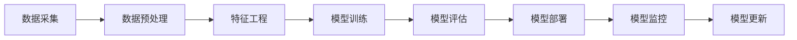

                 

**关键词：** AI理解、团队培养、业务应用、AI架构、算法原理、数学模型、项目实践、应用场景、工具资源、未来趋势

## 1. 背景介绍

随着人工智能（AI）技术的飞速发展，AI已然成为各行各业的关键驱动力。然而，如何有效地培养团队理解AI，并将AI应用于业务场景，仍然是一个挑战。本文将从AI理解、架构、算法、数学模型、项目实践、应用场景、工具资源等方面，提供一套系统的方法论，帮助读者培养团队理解AI，并将AI应用于业务场景。

## 2. 核心概念与联系

### 2.1 AI理解的关键维度

理解AI需要从以下几个维度入手：

- **算法原理：** AI算法的核心原理是什么？
- **数学模型：** AI背后的数学模型是什么？
- **架构设计：** AI系统的架构设计是怎样的？
- **应用场景：** AI在哪些业务场景中有应用价值？

### 2.2 AI架构设计

AI系统的架构设计通常遵循以下流程（如下图所示）：数据采集 -> 数据预处理 -> 特征工程 -> 模型训练 -> 模型评估 -> 模型部署 -> 模型监控 -> 模型更新。



## 3. 核心算法原理 & 具体操作步骤

### 3.1 算法原理概述

本节以机器学习算法为例，介绍线性回归算法的原理。

### 3.2 算法步骤详解

1. **数据准备：** 收集输入特征（X）和目标变量（y）的数据。
2. **模型假设：** 假设数据服从线性关系：y = wx + b。
3. **代价函数定义：** 定义代价函数：J(w, b) = (1/2m) * ∑(h(x(i)) - y(i))^2，其中h(x) = wx + b。
4. **梯度下降：** 使用梯度下降法最小化代价函数，更新参数w和b。
5. **预测：** 使用学习到的参数w和b，对新数据进行预测。

### 3.3 算法优缺点

**优点：** 简单易懂，计算效率高，适用于线性可分数据。

**缺点：** 只适用于线性可分数据，对特征要求高，不适合非线性数据。

### 3.4 算法应用领域

线性回归广泛应用于预测分析、回归分析、数据挖掘等领域。

## 4. 数学模型和公式 & 详细讲解 & 举例说明

### 4.1 数学模型构建

线性回归的数学模型为：y = wx + b，其中w和b为学习参数。

### 4.2 公式推导过程

代价函数J(w, b) = (1/2m) * ∑(h(x(i)) - y(i))^2，其梯度为：

$$\nabla J(w, b) = \begin{bmatrix} \frac{1}{m} \sum_{i=1}^{m} (h(x^{(i)}) - y^{(i)})x^{(i)} \\ \frac{1}{m} \sum_{i=1}^{m} (h(x^{(i)}) - y^{(i)}) \end{bmatrix}$$

### 4.3 案例分析与讲解

假设我们有以下数据：X = [1, 2, 3, 4, 5]，y = [2, 4, 6, 8, 10]。使用梯度下降法，我们可以学习到w = 2, b = 0，从而拟合出y = 2x的线性关系。

## 5. 项目实践：代码实例和详细解释说明

### 5.1 开发环境搭建

本项目使用Python、NumPy、Matplotlib等常用库。

### 5.2 源代码详细实现

```python
import numpy as np
import matplotlib.pyplot as plt

# 定义数据
X = 2 * np.random.rand(100, 1)
y = 4 + 3 * X + np.random.randn(100, 1)

# 定义线性回归函数
def linear_regression(X, y):
    # 代价函数
    def J(w, b):
        m = len(y)
        return (1 / (2 * m)) * np.sum((w * X + b - y) ** 2)

    # 梯度下降
    w, b = np.zeros((X.shape[1], 1)), 0
    learning_rate = 0.1
    for _ in range(1000):
        w -= learning_rate * (1 / m) * np.sum((w * X + b - y) * X)
        b -= learning_rate * (1 / m) * np.sum(w * X + b - y)
    return w, b

# 训练模型
w, b = linear_regression(X, y)

# 绘制结果
plt.scatter(X, y)
plt.plot(X, w * X + b, color='red')
plt.show()
```

### 5.3 代码解读与分析

代码实现了线性回归算法，使用梯度下降法最小化代价函数，学习参数w和b。

### 5.4 运行结果展示

运行结果为一条红色线性拟合曲线，与数据点一起绘制在同一图上。

## 6. 实际应用场景

### 6.1 业务场景分析

线性回归可以应用于预测销量、预测价格、预测需求等业务场景。

### 6.2 业务价值分析

通过预测，企业可以做出更准确的决策，提高业务效率。

### 6.3 未来应用展望

随着数据量的增加和算法的发展，线性回归将会有更广泛的应用。

## 7. 工具和资源推荐

### 7.1 学习资源推荐

- Andrew Ng的机器学习课程（Coursera）
- "机器学习"一书（由 Stuart Russell 和 Peter Norvig 合著）
- "统计学习方法"一书（由李航 编著）

### 7.2 开发工具推荐

- Python、NumPy、Matplotlib、Scikit-learn等库
- TensorFlow、PyTorch等深度学习框架

### 7.3 相关论文推荐

- Rumelhart, D. E., Hinton, G. E., & Williams, R. J. (1986). Learning representations by back-propagating errors. Nature, 323(6088), 533-536.
- LeCun, Y., Bengio, Y., & Hinton, G. (2015). Deep learning. Nature, 521(7553), 436-444.

## 8. 总结：未来发展趋势与挑战

### 8.1 研究成果总结

本文介绍了AI理解、架构、算法、数学模型、项目实践、应用场景、工具资源等方面的方法论。

### 8.2 未来发展趋势

AI技术将会继续发展，出现更先进的算法和工具。同时，AI与业务的结合也将更加紧密。

### 8.3 面临的挑战

AI技术面临的挑战包括数据安全、算法偏见、解释性等问题。

### 8.4 研究展望

未来的研究方向包括自监督学习、对抗生成网络、可解释AI等。

## 9. 附录：常见问题与解答

**Q1：什么是AI？**

**A1：AI是指模拟人类智能的计算机程序，能够通过学习、推理和经验来改进自身的性能。**

**Q2：如何培养团队理解AI？**

**A2：从AI理解的关键维度入手，结合项目实践，循序渐进地培养团队理解AI。**

**Q3：AI在哪些业务场景中有应用价值？**

**A3：AI在预测分析、回归分析、数据挖掘等领域有广泛应用。**

**Q4：如何将AI应用于业务场景？**

**A4：从业务需求出发，选择合适的AI算法，并结合工具资源进行开发和部署。**

**Q5：AI技术面临哪些挑战？**

**A5：AI技术面临的挑战包括数据安全、算法偏见、解释性等问题。**

---

**作者：禅与计算机程序设计艺术 / Zen and the Art of Computer Programming**

