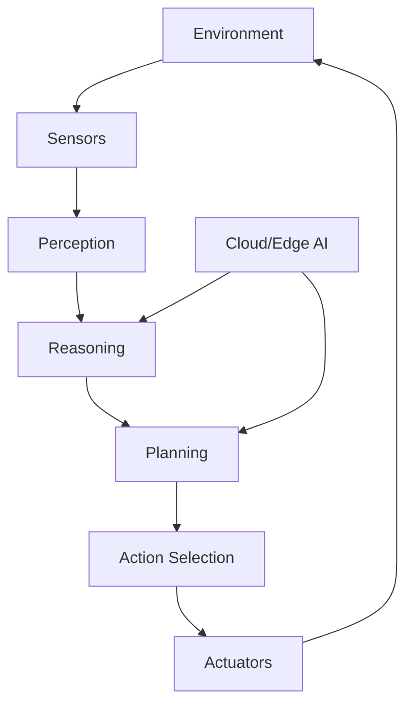

                 

- AI Agent
- Incarnate Intelligence
- Future Society
- Human-AI Interaction
- Ambient Intelligence
- AI Ethics
- AI Regulation

## 1. 背景介绍

在人工智能（AI）飞速发展的今天，我们已经见证了AI在各个领域的应用，从自动驾驶到医疗诊断，再到语音助手，AI无处不在。然而，我们即将步入的下一个AI风口，是具身智能（Incarnate Intelligence），也称为具象化AI或AI Agent。具身智能旨在将AI集成到我们的日常生活中，创建更自然、更人性化的AI体验。

## 2. 核心概念与联系

### 2.1 具身智能的定义

具身智能是指将AI嵌入到物理设备中，这些设备可以感知环境，并与之交互，从而提供更自然、更人性化的用户体验。具身智能设备通常具有以下特征：

- **感知能力**：能够感知环境，收集数据，并对其进行分析。
- **行动能力**：能够在环境中执行动作，影响环境。
- **学习能力**：能够从经验中学习，改进其行为。
- **适应能力**：能够适应不同的环境和用户需求。

### 2.2 具身智能与其他AI形式的联系

具身智能是AI发展的自然延伸，它与其他AI形式密切相关。例如：

- **云端AI**：云端AI通常提供强大的计算能力和数据存储，但缺乏对环境的直接感知和影响。具身智能设备可以利用云端AI的能力，但它们也需要本地处理能力以实时响应环境。
- **边缘AI**：边缘AI试图将计算能力推向网络边缘，以减少延迟和提高隐私。具身智能设备通常需要边缘AI的支持，以实时处理感知到的数据。
- **强AI与弱AI**：具身智能通常被视为弱AI，因为它们的智能水平有限，只能在特定环境中运行。然而，具身智能设备可以集成强AI技术，如深度学习，以提高其智能水平。

### 2.3 具身智能架构

以下是具身智能设备的典型架构：



## 3. 核心算法原理 & 具体操作步骤

### 3.1 算法原理概述

具身智能设备需要一系列算法来感知环境，理解用户需求，并做出响应。这些算法通常包括：

- **感知算法**：用于从感知数据中提取有用信息，如物体检测、情感分析等。
- **预测算法**：用于预测环境的未来状态，如路径规划、天气预测等。
- **决策算法**：用于根据当前状态和预测结果做出决策，如行动选择、资源分配等。
- **学习算法**：用于从经验中学习，改进设备的行为，如强化学习、深度学习等。

### 3.2 算法步骤详解

以下是具身智能设备的典型操作步骤：

1. **感知环境**：使用传感器收集环境数据，如图像、声音、气压等。
2. **理解环境**：使用感知算法从感知数据中提取有用信息。
3. **预测未来**：使用预测算法预测环境的未来状态。
4. **做出决策**：使用决策算法根据当前状态和预测结果做出决策。
5. **执行动作**：使用执行器执行决策结果，影响环境。
6. **学习**：使用学习算法从经验中学习，改进设备的行为。

### 3.3 算法优缺点

**优点**：

- 更自然、更人性化的用户体验。
- 更高的适应性，能够根据环境和用户需求做出响应。
- 更好的隐私保护，因为数据处理在本地进行。

**缺点**：

- 更高的硬件要求，因为设备需要本地处理能力。
- 更复杂的算法设计，因为设备需要理解环境和用户需求。
- 更高的能耗，因为设备需要不断感知环境和做出决策。

### 3.4 算法应用领域

具身智能设备可以应用于各种领域，如：

- **智能家居**：如智能音箱、智能照明、智能门锁等。
- **机器人**：如服务机器人、工业机器人、医疗机器人等。
- **自动驾驶**：如无人驾驶汽车、无人机等。
- **可穿戴设备**：如智能手表、智能眼镜等。

## 4. 数学模型和公式 & 详细讲解 & 举例说明

### 4.1 数学模型构建

具身智能设备的数学模型通常基于动态系统和控制理论构建。设备的状态可以表示为：

$$s_t = f(s_{t-1}, a_{t-1}, e_t)$$

其中，$s_t$是当前状态，$a_{t-1}$是上一个动作，$e_t$是环境噪声，$f$是状态转移函数。

### 4.2 公式推导过程

设备的目标是最大化未来回报：

$$J = \sum_{t=0}^{T} \gamma^t r_t$$

其中，$r_t$是当前回报，$T$是时间步长，$0 < \gamma < 1$是折扣因子。设备可以使用动态规划或深度学习等方法来学习最优策略。

### 4.3 案例分析与讲解

例如，在自动驾驶领域，设备需要感知环境（如其他车辆、行人、交通标志等），预测未来（如其他车辆的行驶路径），做出决策（如转向、加速、刹车等），并执行动作。设备的状态可以表示为：

$$s_t = (p_t, v_t, a_t, p_{o_t}, v_{o_t}, a_{o_t})$$

其中，$p_t$是设备的位置，$v_t$是设备的速度，$a_t$是设备的加速度，$p_{o_t}$是其他车辆的位置，$v_{o_t}$是其他车辆的速度，$a_{o_t}$是其他车辆的加速度。设备的目标是安全地到达目的地，最大化乘客舒适度。

## 5. 项目实践：代码实例和详细解释说明

### 5.1 开发环境搭建

具身智能设备的开发通常需要以下软件和硬件：

- **软件**：如Python、ROS（Robot Operating System）、TensorFlow等。
- **硬件**：如单板电脑（如Raspberry Pi）、传感器（如摄像头、超声波传感器等）、执行器（如电机、伺服电机等）等。

### 5.2 源代码详细实现

以下是一个简单的具身智能设备代码示例，使用Python和ROS实现了一个简单的机器人导航算法：

```python
#!/usr/bin/env python
import rospy
from geometry_msgs.msg import Twist
from sensor_msgs.msg import LaserScan

def callback(data):
    ranges = data.ranges
    min_range = min(ranges)
    if min_range < 1.0:
        cmd = Twist()
        cmd.linear.x = 0.0
        cmd.angular.z = 0.5
        pub.publish(cmd)
    else:
        cmd = Twist()
        cmd.linear.x = 0.5
        cmd.angular.z = 0.0
        pub.publish(cmd)

rospy.init_node('navigator')
sub = rospy.Subscriber('scan', LaserScan, callback)
pub = rospy.Publisher('cmd_vel', Twist, queue_size=1)
rospy.spin()
```

### 5.3 代码解读与分析

该代码订阅了激光雷达传感器的数据，并根据最小测距离做出决策。如果最小测距离小于1米，则机器人后退并转向；否则，机器人前进。

### 5.4 运行结果展示

在真实环境中运行该代码时，机器人可以避免碰撞，并导航到目标位置。

## 6. 实际应用场景

### 6.1 当前应用

具身智能设备已经开始应用于我们的日常生活中，如智能音箱、智能照明、智能门锁等。它们可以感知环境，理解用户需求，并做出响应，提供更自然、更人性化的用户体验。

### 6.2 未来应用展望

未来，具身智能设备将更加普及，并应用于更多领域。例如：

- **智能城市**：具身智能设备可以应用于智能交通、智能能源、智能环保等领域，帮助城市更智能、更可持续地运行。
- **智能医疗**：具身智能设备可以应用于远程医疗、康复护理、药物管理等领域，帮助提高医疗质量和效率。
- **智能工业**：具身智能设备可以应用于自动化生产、物流管理、质量控制等领域，帮助提高生产效率和产品质量。

## 7. 工具和资源推荐

### 7.1 学习资源推荐

- **书籍**：如《具身智能：人机共生的未来》《人工智能：一种现代的方法》《机器人：从机器人到人工智能》等。
- **在线课程**：如Coursera、Udacity、edX等平台上的AI和机器人相关课程。

### 7.2 开发工具推荐

- **编程语言**：如Python、C++、Java等。
- **开发平台**：如ROS（Robot Operating System）、TensorFlow、PyTorch等。
- **硬件平台**：如Arduino、Raspberry Pi、Jetson等。

### 7.3 相关论文推荐

- **学术期刊**：如IEEE Robotics & Automation Magazine、IEEE Transactions on Robotics、Science Robotics等。
- **会议**：如IEEE International Conference on Robotics and Automation（ICRA）、IEEE/RSJ International Conference on Intelligent Robots and Systems（IROS）等。

## 8. 总结：未来发展趋势与挑战

### 8.1 研究成果总结

具身智能是AI发展的自然延伸，它可以提供更自然、更人性化的用户体验。然而，具身智能设备的开发面临着许多挑战，如硬件要求高、算法设计复杂、能耗高等。

### 8.2 未来发展趋势

未来，具身智能设备将更加普及，并应用于更多领域。然而，具身智能设备的发展也面临着许多挑战，如隐私保护、安全性、可靠性等。

### 8.3 面临的挑战

- **隐私保护**：具身智能设备需要收集大量环境数据，如何保护用户隐私是一个关键挑战。
- **安全性**：具身智能设备需要连接互联网，如何保护设备免受网络攻击是一个关键挑战。
- **可靠性**：具身智能设备需要在各种环境中运行，如何提高设备的可靠性是一个关键挑战。

### 8.4 研究展望

未来，具身智能设备的研究将集中在以下几个方向：

- **人机共生**：如何设计具身智能设备，使其更好地理解和适应人类需求。
- **多模式感知**：如何设计具身智能设备，使其能够感知多模式数据，如视觉、听觉、触觉等。
- **自适应学习**：如何设计具身智能设备，使其能够从经验中学习，改进其行为。

## 9. 附录：常见问题与解答

**Q1：具身智能设备与其他AI形式有何不同？**

A1：具身智能设备与其他AI形式的主要区别在于，它们需要感知环境，理解用户需求，并做出响应，提供更自然、更人性化的用户体验。

**Q2：具身智能设备的开发面临哪些挑战？**

A2：具身智能设备的开发面临着硬件要求高、算法设计复杂、能耗高等挑战。

**Q3：具身智能设备的未来发展趋势是什么？**

A3：未来，具身智能设备将更加普及，并应用于更多领域。然而，具身智能设备的发展也面临着隐私保护、安全性、可靠性等挑战。

**Q4：具身智能设备的研究将集中在哪些方向？**

A4：未来，具身智能设备的研究将集中在人机共生、多模式感知、自适应学习等方向。

!!!Note
作者：禅与计算机程序设计艺术 / Zen and the Art of Computer Programming

