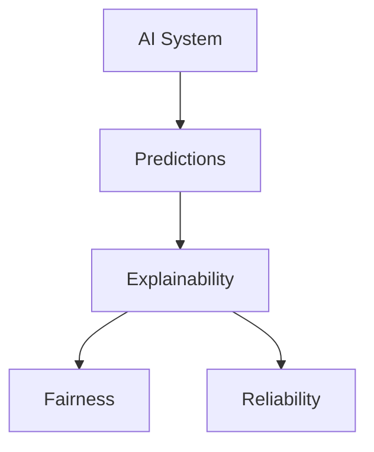

                 

## 1. 背景介绍

在当今的数字化世界中，人工智能（AI）无处不在，从自动驾驶汽车到医疗诊断，再到金融风险评估，AI系统正在各行各业发挥着关键作用。然而，随着AI技术的不断发展，人们对其决策过程的理解和信任变得越来越重要。AI可解释性（XAI）就是一种旨在提高AI系统透明度的方法，它有助于增强人类对AI决策的信任，并帮助我们理解和改进AI模型。

## 2. 核心概念与联系

### 2.1 可解释性的定义

可解释性是指能够帮助人类理解和解释AI系统决策的能力。它不是一个二元问题，而是一个连续的范围，从完全不透明的"黑箱"到完全可解释的"白箱"。

### 2.2 可解释性的类型

可解释性可以分为两种主要类型：

- **全局解释（Global Explanations）**：描述模型的一般行为，如模型的特征重要性。
- **局部解释（Local Explanations）**：解释单个预测的原因，如为什么某个特定输入被分类为某个类别。

### 2.3 可解释性与公平性、可靠性的联系

可解释性与公平性和可靠性密切相关。可解释的模型更容易被检测出偏见和错误，从而有助于改进模型的公平性和可靠性。



## 3. 核心算法原理 & 具体操作步骤

### 3.1 算法原理概述

可解释性算法旨在帮助人类理解AI模型的决策过程。这些算法可以分为两大类：后处理方法和内在方法。

- **后处理方法**：这些方法在模型训练之后应用，旨在解释模型的决策。
- **内在方法**：这些方法在模型训练过程中就考虑了可解释性，旨在创建更易于理解的模型。

### 3.2 算法步骤详解

#### 3.2.1 LIME（Local Interpretable Model-Agnostic Explanations）

LIME是一种后处理方法，它通过训练一个简单的模型（如决策树）来解释模型的决策。其步骤如下：

1. 选择一个待解释的预测。
2. 创建模型输入的局部区域。
3. 在该区域内生成新的样本。
4. 使用这些新样本训练一个简单的模型。
5. 解释简单模型的决策。

#### 3.2.2 SHAP（SHapley Additive exPlanations）

SHAP是另一种后处理方法，它使用 Shapley 值来解释模型的决策。其步骤如下：

1. 选择一个待解释的预测。
2. 为每个特征计算其对预测的贡献。
3. 使用 Shapley 值聚合这些贡献。
4. 解释每个特征的贡献。

### 3.3 算法优缺点

#### 3.3.1 LIME 的优缺点

**优点**：LIME 可以解释任何模型，并且速度很快。

**缺点**：LIME 只能解释局部决策，并且解释的准确性取决于简单模型的选择。

#### 3.3.2 SHAP 的优缺点

**优点**：SHAP 可以解释全局决策，并且其解释是唯一的和一致的。

**缺点**：SHAP 计算开销较大，并且解释的准确性取决于模型的复杂性。

### 3.4 算法应用领域

可解释性算法在各种领域都有应用，从医疗诊断到金融风险评估，再到自动驾驶汽车。它们有助于增强人类对AI决策的信任，并帮助我们理解和改进AI模型。

## 4. 数学模型和公式 & 详细讲解 & 举例说明

### 4.1 数学模型构建

#### 4.1.1 LIME 的数学模型

LIME 的数学模型是一个简单的模型，用于解释模型的决策。这个简单模型可以是任何可解释的模型，如决策树或线性回归模型。

#### 4.1.2 SHAP 的数学模型

SHAP 的数学模型基于 Shapley 值，这是一种用于分配资源的公平游戏理论。给定一个模型 $f(x)$ 和一个特征 $x_j$，Shapley 值 $φ_{j}(x)$ 表示特征 $x_j$ 对预测的贡献。

### 4.2 公式推导过程

#### 4.2.1 LIME 的公式推导

LIME 的公式推导过程涉及到简单模型的训练。给定一个简单模型 $g(z)$ 和一个待解释的预测 $f(x)$，LIME 的目标是最小化 $g(z)$ 和 $f(x)$ 之间的距离，其中 $z$ 是模型输入的局部区域。

#### 4.2.2 SHAP 的公式推导

SHAP 的公式推导过程涉及到 Shapley 值的计算。给定一个模型 $f(x)$ 和一个特征 $x_j$，Shapley 值 $φ_{j}(x)$ 可以表示为：

$$φ_{j}(x) = \sum_{S \subseteq N \setminus \{j\}} \frac{|S|!(|N|-|S|-1)!}{|N|!} [f(x_{S \cup \{j\}}) - f(x_{S})]$$

其中 $N$ 是所有特征的集合，$x_{S}$ 是特征集 $S$ 的值，$x_{S \cup \{j\}}$ 是特征集 $S$ 和特征 $j$ 的值。

### 4.3 案例分析与讲解

#### 4.3.1 LIME 的案例分析

假设我们有一个用于预测糖尿病的模型，我们想解释为什么某个特定的病人被诊断为糖尿病。我们可以使用 LIME 来解释这个决策。LIME 会创建模型输入的局部区域，并使用这些新样本训练一个简单的模型，如决策树。然后，我们可以解释决策树的决策，从而理解模型的决策。

#### 4.3.2 SHAP 的案例分析

假设我们有一个用于预测房价的模型，我们想解释为什么某个房子的价格高于平均水平。我们可以使用 SHAP 来解释这个决策。SHAP 会为每个特征计算其对预测的贡献，并使用 Shapley 值聚合这些贡献。然后，我们可以解释每个特征的贡献，从而理解模型的决策。

## 5. 项目实践：代码实例和详细解释说明

### 5.1 开发环境搭建

要使用 LIME 和 SHAP，我们需要安装 Python 和相关的库。我们可以使用以下命令安装所需的库：

```bash
pip install lime shap
```

### 5.2 源代码详细实现

#### 5.2.1 LIME 的实现

```python
from lime import lime_tabular
from sklearn.ensemble import RandomForestClassifier
from sklearn.datasets import load_breast_cancer

# Load data
data = load_breast_cancer()
X, y = data.data, data.target

# Train model
model = RandomForestClassifier()
model.fit(X, y)

# Initialize LIME explainer
explainer = lime_tabular.LimeTabularExplainer(X, feature_names=data.feature_names, class_names=data.target_names)

# Explain a prediction
explanation = explainer.explain_instance(X[0], model.predict_proba, num_features=5)

# Print explanation
print(explanation.as_list())
```

#### 5.2.2 SHAP 的实现

```python
import shap
from sklearn.ensemble import RandomForestClassifier
from sklearn.datasets import load_breast_cancer

# Load data
data = load_breast_cancer()
X, y = data.data, data.target

# Train model
model = RandomForestClassifier()
model.fit(X, y)

# Initialize SHAP explainer
explainer = shap.TreeExplainer(model)

# Explain a prediction
shap_values = explainer.shap_values(X)

# Print explanation
shap.summary_plot(shap_values, X, plot_type="bar")
```

### 5.3 代码解读与分析

在 LIME 的实现中，我们首先加载数据并训练一个模型。然后，我们初始化 LIME explainer，并使用它来解释模型的决策。在 SHAP 的实现中，我们首先加载数据并训练一个模型。然后，我们初始化 SHAP explainer，并使用它来解释模型的决策。

### 5.4 运行结果展示

运行 LIME 和 SHAP 的代码后，我们会得到模型决策的解释。这些解释可以帮助我们理解模型的决策过程，并增强我们对模型的信任。

## 6. 实际应用场景

可解释性算法在各种实际应用场景中都有广泛的应用，从医疗诊断到金融风险评估，再到自动驾驶汽车。它们有助于增强人类对AI决策的信任，并帮助我们理解和改进AI模型。

### 6.1 当前应用

#### 6.1.1 医疗诊断

可解释性算法可以帮助医生理解AI模型的决策，从而增强对AI辅助诊断的信任。

#### 6.1.2 金融风险评估

可解释性算法可以帮助金融从业者理解AI模型的决策，从而改进风险评估模型。

#### 6.1.3 自动驾驶汽车

可解释性算法可以帮助乘客和监管机构理解自动驾驶汽车的决策，从而增强对自动驾驶技术的信任。

### 6.2 未来应用展望

随着 AI 技术的不断发展，可解释性算法的应用将会变得越来越重要。未来，可解释性算法将会被广泛应用于各种领域，从智能城市到智能制造，再到智能医疗。它们将有助于增强人类对AI决策的信任，并帮助我们理解和改进AI模型。

## 7. 工具和资源推荐

### 7.1 学习资源推荐

- **文献**：[LIME: Explainable AI](https://arxiv.org/abs/1602.04938) 和 [A Unified Approach to Interpreting Model Predictions](https://arxiv.org/abs/1705.07874)
- **在线课程**：[Explainable AI](https://www.coursera.org/learn/explainable-artificial-intelligence) 和 [Interpretable Machine Learning](https://christophm.github.io/interpretable-ml-book/)

### 7.2 开发工具推荐

- **Python 库**：[LIME](https://github.com/marcotcr/lime) 和 [SHAP](https://github.com/slundberg/shap)
- **在线工具**：[Alibi](https://alibi.readthedocs.io/en/latest/) 和 [What-If Tool](https://what-if-tool.app/)

### 7.3 相关论文推荐

- [Why Should I Trust You?](https://arxiv.org/abs/1606.06565)
- [A Survey of Explainable Artificial Intelligence (XAI) Techniques](https://arxiv.org/abs/1906.02250)
- [Interpretable Machine Learning](https://christophm.github.io/interpretable-ml-book/)

## 8. 总结：未来发展趋势与挑战

### 8.1 研究成果总结

可解释性算法已经取得了显著的进展，它们有助于增强人类对AI决策的信任，并帮助我们理解和改进AI模型。然而，仍然存在许多挑战需要解决。

### 8.2 未来发展趋势

未来，可解释性算法的发展将会朝着以下方向前进：

- **可解释性与公平性的结合**：可解释性算法将会与公平性算法结合，以创建更公平的AI模型。
- **可解释性与可靠性的结合**：可解释性算法将会与可靠性算法结合，以创建更可靠的AI模型。
- **可解释性与可视化的结合**：可解释性算法将会与可视化技术结合，以创建更直观的解释。

### 8.3 面临的挑战

然而，可解释性算法仍然面临着许多挑战：

- **模型复杂性**：复杂的模型（如深度学习模型）很难解释。
- **可解释性与准确性的权衡**：提高可解释性可能会降低模型的准确性。
- **可解释性的评估**：缺乏统一的标准来评估可解释性算法的性能。

### 8.4 研究展望

未来的研究将会关注以下领域：

- **新的可解释性算法**：开发新的可解释性算法，以解释更复杂的模型。
- **可解释性与其他属性的结合**：结合可解释性与其他属性（如公平性和可靠性），以创建更全面的AI模型。
- **可解释性的评估标准**：开发统一的标准来评估可解释性算法的性能。

## 9. 附录：常见问题与解答

### 9.1 什么是可解释性？

可解释性是指能够帮助人类理解和解释AI系统决策的能力。

### 9.2 可解释性与可视化有什么区别？

可视化是一种帮助人类理解数据的方法，而可解释性是一种帮助人类理解AI系统决策的方法。可视化可以帮助我们理解数据的结构和模式，而可解释性可以帮助我们理解AI系统的决策过程。

### 9.3 可解释性算法有哪些优缺点？

可解释性算法的优点包括增强人类对AI决策的信任，帮助理解和改进AI模型。其缺点包括解释的准确性取决于简单模型的选择，计算开销较大等。

### 9.4 可解释性算法有哪些应用领域？

可解释性算法有广泛的应用领域，从医疗诊断到金融风险评估，再到自动驾驶汽车。

### 9.5 可解释性算法的未来发展趋势是什么？

未来，可解释性算法的发展将会朝着可解释性与公平性的结合，可解释性与可靠性的结合，可解释性与可视化的结合等方向前进。

---

作者：禅与计算机程序设计艺术 / Zen and the Art of Computer Programming

