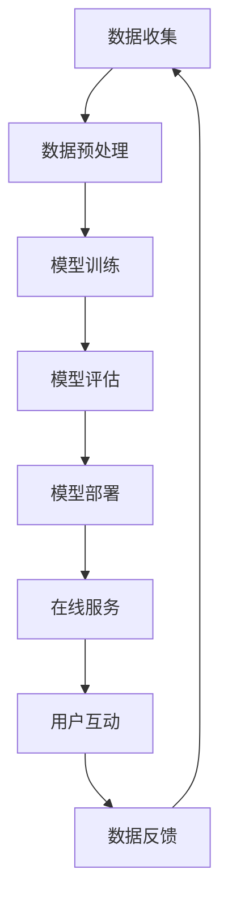

                 

## 1. 背景介绍

当前，人工智能（AI）技术正在各行各业迅速发展，其中大模型（Large Language Models）的应用尤为引人注目。大模型是一种通过学习大量文本数据而训练出来的模型，它能够理解、生成和翻译人类语言，并展现出惊人的学习和推理能力。然而，如何将大模型的商业优势转化为成功的创业项目，是当前AI创业者面临的重大挑战。

本文将从技术和商业两个角度，深入剖析大模型创业的关键要素，并提供实用的指南，帮助读者理解如何利用大模型的商业优势，成功开展AI创业。

## 2. 核心概念与联系

### 2.1 大模型的定义与特点

大模型是指通过学习大量数据而训练出来的模型，它具有以下特点：

- **规模庞大**：大模型需要大量的数据和计算资源进行训练，通常需要数百万甚至数十亿个参数。
- **泛化能力强**：大模型能够在未见过的数据上表现出良好的泛化能力，这使得它们可以应用于各种任务，如文本生成、翻译和问答系统。
- **学习和推理能力强**：大模型可以学习复杂的语言模式，并展现出惊人的推理和理解能力。

### 2.2 大模型与商业优势的联系

大模型的商业优势主要体现在以下几个方面：

- **提高效率**：大模型可以自动生成文本、翻译和回答问题，从而提高工作效率。
- **降低成本**：大模型可以替代人工劳动力，降低成本。
- **创造新的商业模式**：大模型可以创造新的产品和服务，如智能客服、内容生成平台和个性化推荐系统。

### 2.3 核心概念原理与架构的 Mermaid 流程图



## 3. 核心算法原理 & 具体操作步骤

### 3.1 算法原理概述

大模型的核心算法是Transformer模型，它基于自注意力机制（Self-Attention）和位置编码（Positional Encoding）工作。Transformer模型可以并行处理输入序列，从而大大提高了训练速度。

### 3.2 算法步骤详解

大模型的训练过程可以分为以下几个步骤：

1. **数据收集**：收集大量的文本数据，如维基百科、图书和新闻文章。
2. **数据预处理**：对收集到的数据进行清洗、分词和标记等预处理工作。
3. **模型训练**：使用预处理后的数据训练Transformer模型，调整模型参数以最小化损失函数。
4. **模型评估**：对训练好的模型进行评估，使用验证集和测试集评估模型的性能。
5. **模型部署**：将训练好的模型部署到生产环境，为用户提供在线服务。
6. **用户互动**：用户与模型进行互动，输入文本并获取模型的响应。
7. **数据反馈**：收集用户互动数据，并将其用于模型的进一步训练和优化。

### 3.3 算法优缺点

大模型的优点包括：

- **泛化能力强**：大模型可以在未见过的数据上表现出良好的泛化能力。
- **学习和推理能力强**：大模型可以学习复杂的语言模式，并展现出惊人的推理和理解能力。
- **可以并行处理**：Transformer模型可以并行处理输入序列，从而大大提高了训练速度。

大模型的缺点包括：

- **训练资源需求高**：大模型需要大量的数据和计算资源进行训练。
- **训练时间长**：大模型的训练时间长，通常需要数天甚至数周。
- **模型解释性差**：大模型的决策过程很难被解释，这限制了其在某些领域的应用。

### 3.4 算法应用领域

大模型的应用领域包括：

- **文本生成**：大模型可以生成各种文本，如新闻文章、小说和诗歌。
- **翻译**：大模型可以进行高质量的机器翻译。
- **问答系统**：大模型可以回答用户的问题，提供信息和建议。
- **内容推荐**：大模型可以根据用户的兴趣和偏好推荐内容。
- **客服和助手**：大模型可以提供智能客服和助手服务，帮助用户解决问题和完成任务。

## 4. 数学模型和公式 & 详细讲解 & 举例说明

### 4.1 数学模型构建

大模型的数学模型是基于Transformer模型构建的。Transformer模型由编码器和解码器组成，它们都由自注意力层和全连接层组成。

### 4.2 公式推导过程

自注意力机制的数学表达式如下：

$$Attention(Q, K, V) = softmax(\frac{QK^T}{\sqrt{d_k}})V$$

其中，$Q$, $K$和$V$分别是查询、键和值向量，$d_k$是键向量的维度。

位置编码的数学表达式如下：

$$PE_{(pos, 2i)} = sin(\frac{pos}{10000^{2i/d_{model}}})$$
$$PE_{(pos, 2i+1)} = cos(\frac{pos}{10000^{2i/d_{model}}})$$

其中，$pos$是位置，$i$是维度，$d_{model}$是模型的维度。

### 4.3 案例分析与讲解

例如，假设我们要构建一个文本生成模型，用于生成新闻标题。我们可以使用大模型来完成这个任务。首先，我们需要收集大量的新闻标题数据，并对其进行预处理。然后，我们使用Transformer模型来训练这个数据集。在训练过程中，我们需要调整模型参数，以最小化损失函数。一旦模型训练完成，我们就可以使用它来生成新闻标题了。

## 5. 项目实践：代码实例和详细解释说明

### 5.1 开发环境搭建

要开发大模型，我们需要以下软件和环境：

- Python 3.7或更高版本
- PyTorch或TensorFlow
- Hugging Face的Transformers库
- GPU（可选，但强烈推荐）

### 5.2 源代码详细实现

以下是使用Hugging Face的Transformers库训练大模型的示例代码：

```python
from transformers import AutoTokenizer, AutoModelForSeq2SeqLM, Trainer, TrainingArguments

# 加载预训练模型和分词器
model_name = "t5-base"
tokenizer = AutoTokenizer.from_pretrained(model_name)
model = AutoModelForSeq2SeqLM.from_pretrained(model_name)

# 加载数据集
datasets = load_dataset("path/to/dataset")

# 定义训练参数
training_args = TrainingArguments(
    output_dir="./results",
    num_train_epochs=3,
    per_device_train_batch_size=16,
    per_device_eval_batch_size=64,
    warmup_steps=500,
    weight_decay=0.01,
    logging_dir="./logs",
)

# 定义训练器
trainer = Trainer(
    model=model,
    args=training_args,
    train_dataset=datasets["train"],
    eval_dataset=datasets["validation"],
)

# 训练模型
trainer.train()

# 保存模型
model.save_pretrained("./saved_model")
```

### 5.3 代码解读与分析

在上述代码中，我们首先加载预训练模型和分词器。然后，我们加载数据集，并定义训练参数。接着，我们定义训练器，并使用它来训练模型。最后，我们保存训练好的模型。

### 5.4 运行结果展示

训练好的模型可以用于各种任务，如文本生成、翻译和问答系统。以下是使用训练好的模型生成新闻标题的示例：

输入：新闻文章
输出：新闻标题

## 6. 实际应用场景

### 6.1 当前应用场景

大模型当前的应用场景包括：

- **文本生成**：大模型可以生成各种文本，如新闻文章、小说和诗歌。
- **翻译**：大模型可以进行高质量的机器翻译。
- **问答系统**：大模型可以回答用户的问题，提供信息和建议。
- **内容推荐**：大模型可以根据用户的兴趣和偏好推荐内容。
- **客服和助手**：大模型可以提供智能客服和助手服务，帮助用户解决问题和完成任务。

### 6.2 未来应用展望

未来，大模型的应用场景将会进一步扩展，例如：

- **个性化推荐**：大模型可以根据用户的兴趣和偏好，为其推荐个性化的内容。
- **自动写作**：大模型可以自动生成高质量的文本，如新闻文章和小说。
- **智能对话**：大模型可以与用户进行智能对话，提供个性化的建议和帮助。
- **自动编程**：大模型可以自动生成代码，帮助程序员提高工作效率。

## 7. 工具和资源推荐

### 7.1 学习资源推荐

以下是学习大模型的推荐资源：

- **课程**：斯坦福大学的“深度学习”课程（CS224n）和“自然语言处理”课程（CS224u）
- **书籍**：“自然语言处理（第2版）”和“深度学习（第2版）”
- **论文**：Attention is All You Need、BERT: Pre-training of Deep Bidirectional Transformers for Language Understanding等

### 7.2 开发工具推荐

以下是开发大模型的推荐工具：

- **框架**：PyTorch和TensorFlow
- **库**：Hugging Face的Transformers库和TensorFlow Hub
- **硬件**：NVIDIA GPUs和TPUs

### 7.3 相关论文推荐

以下是相关论文推荐：

- Attention is All You Need（Vaswani et al., 2017）
- BERT: Pre-training of Deep Bidirectional Transformers for Language Understanding（Devlin et al., 2018）
- XLNet: Generalized Autoregressive Pretraining for Natural Language Processing（Yang et al., 2019）
- T5: Text-to-Text Transfer Transformer（Raffel et al., 2019）

## 8. 总结：未来发展趋势与挑战

### 8.1 研究成果总结

本文从技术和商业两个角度，剖析了大模型创业的关键要素，并提供了实用的指南，帮助读者理解如何利用大模型的商业优势，成功开展AI创业。

### 8.2 未来发展趋势

未来，大模型的发展趋势包括：

- **模型规模进一步扩大**：大模型的规模将进一步扩大，从而提高其泛化能力。
- **多模式学习**：大模型将能够学习多模式数据，如文本、图像和音频。
- **解释性模型**：大模型的解释性将得到改进，从而提高其在某些领域的应用。

### 8.3 面临的挑战

大模型面临的挑战包括：

- **训练资源需求高**：大模型需要大量的数据和计算资源进行训练。
- **模型解释性差**：大模型的决策过程很难被解释，这限制了其在某些领域的应用。
- **数据安全和隐私**：大模型需要大量的数据进行训练，这可能会导致数据安全和隐私问题。

### 8.4 研究展望

未来，大模型的研究将会集中在以下几个方向：

- **模型压缩**：开发新的技术，压缩大模型的规模，从而降低其训练和部署成本。
- **多模式学习**：开发新的技术，使大模型能够学习多模式数据。
- **解释性模型**：开发新的技术，改进大模型的解释性，从而提高其在某些领域的应用。

## 9. 附录：常见问题与解答

**Q1：大模型需要多少数据进行训练？**

A1：大模型需要大量的数据进行训练，通常需要数百万甚至数十亿个参数。例如，BERT需要2500万个参数，而T5需要110亿个参数。

**Q2：大模型的训练需要多长时间？**

A2：大模型的训练时间长，通常需要数天甚至数周。例如，T5需要数周的时间进行训练。

**Q3：大模型的决策过程很难被解释，这限制了其在某些领域的应用吗？**

A3：是的，大模型的决策过程很难被解释，这限制了其在某些领域的应用。例如，大模型很难在医疗领域得到应用，因为医生需要理解模型的决策过程。

!!!Note
作者：禅与计算机程序设计艺术 / Zen and the Art of Computer Programming

