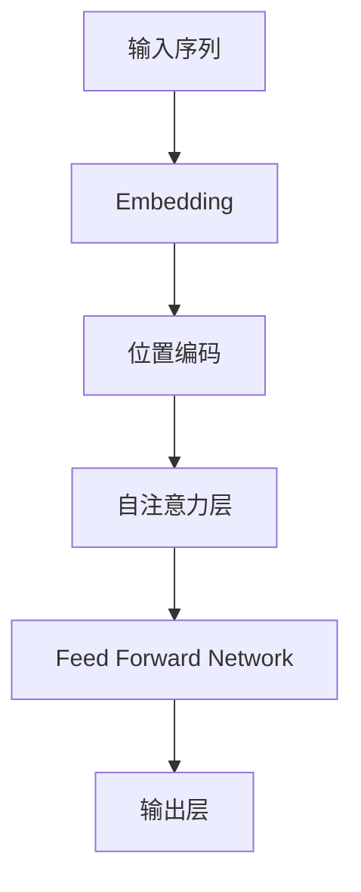

                 

## 1. 背景介绍

当前，人工智能（AI）领域正处于快速发展的时期，其中大模型（Large Language Models）的出现和应用引起了广泛的关注。大模型是一种通过学习大量文本数据而训练出来的模型，它可以理解、生成和翻译人类语言，并展示出惊人的学习和推理能力。然而，开发和部署大模型需要大量的资源和资本投入，这为创业者带来了机遇和挑战。本文将探讨如何利用资本优势进行AI大模型创业，并提供相关的技术细节和实践指南。

## 2. 核心概念与联系

在讨论如何利用资本优势进行AI大模型创业之前，我们需要先理解大模型的核心概念和架构。大模型通常基于Transformer架构（Vaswani et al., 2017）构建，它使用自注意力机制（Self-Attention）来处理输入序列。下面是大模型架构的Mermaid流程图：



在大模型创业中，资本优势可以转化为以下几个方面：

1. **数据收集**：大模型需要大量的数据来训练，资本可以用于收集和标注数据。
2. **硬件投资**：大模型的训练需要强大的计算资源，资本可以用于购买和维护这些硬件。
3. **人才引进**：大模型的开发需要顶尖的人才，资本可以用于吸引和留住优秀的研究人员和工程师。
4. **市场开拓**：资本可以用于开拓市场，推广大模型的应用和商业化。

## 3. 核心算法原理 & 具体操作步骤

### 3.1 算法原理概述

大模型的核心是Transformer架构，它使用自注意力机制来处理输入序列。自注意力机制允许模型在处理输入序列时考虑到序列中其他位置的信息。具体来说，自注意力机制计算每个位置的值与其他位置的值之间的注意力权重，并使用这些权重来生成输出。

### 3.2 算法步骤详解

下面是大模型训练的具体操作步骤：

1. **数据预处理**：收集和标注数据，并将其转换为模型可以接受的格式。
2. **模型初始化**：初始化模型参数，包括Embedding矩阵、位置编码矩阵和自注意力层参数。
3. **前向传播**：将输入序列通过模型的各个层，生成输出序列。
4. **损失计算**：计算模型输出和真实值之间的损失，通常使用交叉熵损失。
5. **反向传播**：计算模型参数的梯度，并使用梯度下降优化器更新参数。
6. **评估**：在验证集上评估模型的性能，并调整超参数以提高模型性能。
7. **部署**：将训练好的模型部署到生产环境中，并监控其性能。

### 3.3 算法优缺点

大模型的优点包括：

* 可以理解和生成人类语言，展示出惊人的学习和推理能力。
* 可以在各种NLP任务上取得state-of-the-art的性能。
* 可以通过微调快速适应新的任务和领域。

大模型的缺点包括：

* 需要大量的数据和计算资源来训练。
* 训练过程需要大量的时间和资源。
* 模型的解释性较差，难以理解模型的决策过程。

### 3.4 算法应用领域

大模型的应用领域包括：

* 自然语言理解（NLP）：大模型可以用于文本分类、命名实体识别、机器翻译等NLP任务。
* 信息检索：大模型可以用于改进搜索引擎的相关性和准确性。
* 对话系统：大模型可以用于构建智能对话系统，提供更自然和流畅的用户体验。
* 自动驾驶和机器人控制：大模型可以用于理解和生成控制指令，从而改进自动驾驶和机器人控制系统的性能。

## 4. 数学模型和公式 & 详细讲解 & 举例说明

### 4.1 数学模型构建

大模型的数学模型可以表示为：

$$h_t = \text{FFN}(x_t) + \text{MSA}(x_t, x_t, x_t)$$

其中，$h_t$是时间步长$t$的隐藏状态，$x_t$是时间步长$t$的输入，$FFN(\cdot)$是前向网络，$MSA(\cdot)$是多头自注意力机制。

### 4.2 公式推导过程

自注意力机制的推导过程如下：

1. **查询（Query）、键（Key）和值（Value）的生成**：对于每个位置，生成查询、键和值向量，并通过线性变换后得到查询矩阵$Q$, 键矩阵$K$和值矩阵$V$.
2. **注意力分数的计算**：计算查询矩阵$Q$和键矩阵$K$的点积，并除以缩放因子$\sqrt{d_k}$，得到注意力分数矩阵$A$.
3. **注意力权重的计算**：使用softmax函数对注意力分数矩阵$A$进行归一化，得到注意力权重矩阵$W$.
4. **输出的计算**：计算注意力权重矩阵$W$和值矩阵$V$的点积，得到输出矩阵$Z$.

### 4.3 案例分析与讲解

例如，假设我们要计算输入序列"Hello, how are you?"的自注意力机制。首先，我们需要将输入序列转换为Embedding向量，并添加位置编码。然后，我们生成查询、键和值向量，并通过线性变换后得到查询矩阵$Q$, 键矩阵$K$和值矩阵$V$. 计算查询矩阵$Q$和键矩阵$K$的点积，并除以缩放因子$\sqrt{d_k}$，得到注意力分数矩阵$A$. 使用softmax函数对注意力分数矩阵$A$进行归一化，得到注意力权重矩阵$W$. 最后，计算注意力权重矩阵$W$和值矩阵$V$的点积，得到输出矩阵$Z$.

## 5. 项目实践：代码实例和详细解释说明

### 5.1 开发环境搭建

要开发大模型，我们需要搭建一个强大的开发环境。推荐使用Python作为开发语言，并安装以下库：

* PyTorch：一个流行的深度学习框架。
* Transformers：一个开源的Transformer模型库，提供了预训练的大模型和微调工具。
* Datasets：一个开源的数据集库，提供了大量的NLP数据集。

### 5.2 源代码详细实现

下面是一个简单的大模型训练示例：

```python
from transformers import AutoTokenizer, AutoModelForMaskedLM, Trainer, TrainingArguments

# 加载预训练模型和分词器
model_name = "bert-base-uncased"
tokenizer = AutoTokenizer.from_pretrained(model_name)
model = AutoModelForMaskedLM.from_pretrained(model_name)

# 加载数据集
dataset = load_dataset("wikitext", "wikitext-103-raw-v1", split="train")

# 定义训练参数
training_args = TrainingArguments(
    output_dir="./results",
    num_train_epochs=3,
    per_device_train_batch_size=16,
    per_device_eval_batch_size=64,
    warmup_steps=500,
    weight_decay=0.01,
    logging_dir="./logs",
)

# 定义训练器
trainer = Trainer(
    model=model,
    args=training_args,
    train_dataset=dataset,
)

# 训练模型
trainer.train()
```

### 5.3 代码解读与分析

在上述代码中，我们首先加载预训练的BERT模型和分词器。然后，我们加载Wikitext数据集，并定义训练参数。我们使用Transformers库提供的Trainer类来训练模型，并指定训练数据集和训练参数。最后，我们调用trainer.train()方法来训练模型。

### 5.4 运行结果展示

训练完成后，我们可以在"results"目录中找到训练好的模型。我们可以使用这个模型来进行填充掩码（Masked Language Modeling）任务，并评估其性能。

## 6. 实际应用场景

大模型的实际应用场景包括：

* **搜索引擎**：大模型可以用于改进搜索引擎的相关性和准确性，提供更好的用户体验。
* **对话系统**：大模型可以用于构建智能对话系统，提供更自然和流畅的用户体验。
* **自动驾驶和机器人控制**：大模型可以用于理解和生成控制指令，从而改进自动驾驶和机器人控制系统的性能。
* **内容创作**：大模型可以用于自动生成文本，如新闻标题、摘要和推荐文本。

### 6.4 未来应用展望

未来，大模型的应用将会扩展到更多的领域，如医疗、金融和科学研究。大模型也将与其他技术结合，如物联网和区块链，从而创造出新的应用场景。

## 7. 工具和资源推荐

### 7.1 学习资源推荐

* "Attention is All You Need"：大模型的开创性论文（Vaswani et al., 2017）。
* "BERT: Pre-training of Deep Bidirectional Transformers for Language Understanding"：BERT模型的开创性论文（Devlin et al., 2018）。
* "Transformers: State-of-the-Art Natural Language Processing"：Transformers库的官方文档。

### 7.2 开发工具推荐

* PyTorch：一个流行的深度学习框架。
* Transformers：一个开源的Transformer模型库，提供了预训练的大模型和微调工具。
* Datasets：一个开源的数据集库，提供了大量的NLP数据集。

### 7.3 相关论文推荐

* "Language Models are Few-Shot Learners"：一种利用大模型进行少样本学习的方法（Brown et al., 2020）。
* "T5: Text-to-Text Transfer Transformer"：一种基于Transformer的文本到文本转换模型（Raffel et al., 2019）。
* "Longformer: The Long-Document Transformer"：一种处理长文档的大模型（Beltagy et al., 2020）。

## 8. 总结：未来发展趋势与挑战

### 8.1 研究成果总结

本文介绍了大模型的核心概念和架构，并提供了大模型训练的具体操作步骤。我们还讨论了大模型的优缺点和应用领域。此外，我们提供了大模型训练的数学模型和公式，并给出了一个简单的大模型训练示例。

### 8.2 未来发展趋势

未来，大模型的发展趋势包括：

* **模型规模的扩大**：大模型的规模将会进一步扩大，从而提高其性能和泛化能力。
* **多模式学习**：大模型将会结合其他模式的信息，如图像和音频，从而提高其理解和生成能力。
* **少样本学习**：大模型将会在少样本学习任务上取得更好的性能，从而扩展其应用领域。

### 8.3 面临的挑战

大模型面临的挑战包括：

* **计算资源**：大模型的训练需要大量的计算资源，这限制了其应用范围。
* **数据收集**：大模型需要大量的数据来训练，收集和标注这些数据需要大量的时间和资源。
* **模型解释性**：大模型的解释性较差，难以理解模型的决策过程。

### 8.4 研究展望

未来的研究方向包括：

* **模型压缩**：开发新的模型压缩技术，从而降低大模型的计算和存储需求。
* **数据增强**：开发新的数据增强技术，从而提高大模型的泛化能力。
* **多模式学习**：开发新的多模式学习技术，从而提高大模型的理解和生成能力。

## 9. 附录：常见问题与解答

**Q：大模型需要多少计算资源来训练？**

A：大模型的计算资源需求取决于模型的规模和训练数据的大小。通常，大模型需要数千个GPU小时来训练。

**Q：大模型的数据收集有哪些挑战？**

A：大模型的数据收集挑战包括数据的规模、质量和多样性。收集和标注大量高质量的数据需要大量的时间和资源。

**Q：大模型的解释性有哪些挑战？**

A：大模型的解释性挑战包括模型的复杂性和非线性特性。开发新的解释性技术是未来研究的一个方向。

## 作者：禅与计算机程序设计艺术 / Zen and the Art of Computer Programming

