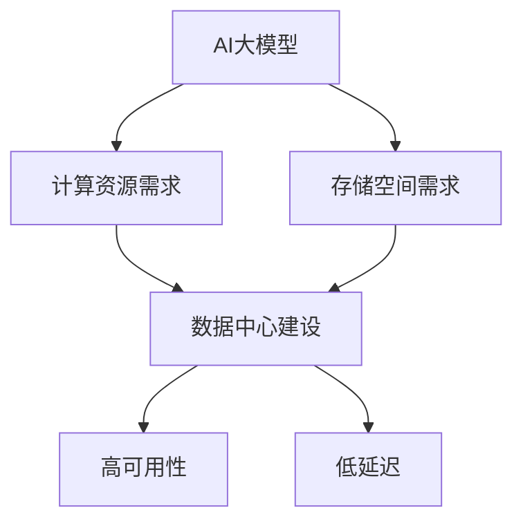

                 

**AI 大模型应用数据中心建设：数据中心产业发展**

## 1. 背景介绍

随着人工智能（AI）技术的飞速发展，大模型（Large Language Models）在各个领域的应用日益广泛。然而，大模型的训练和部署需要大量的计算资源和存储空间，这对数据中心的建设和运维提出了新的挑战。本文将从数据中心产业发展的角度，探讨AI大模型应用对数据中心建设的影响，并提供相关的解决方案和建议。

## 2. 核心概念与联系

### 2.1 AI大模型

AI大模型是指通过大规模数据集和计算资源训练出来的模型，具有强大的理解、生成和推理能力。常见的大模型包括Transformer、BERT、T5等。

### 2.2 数据中心

数据中心是提供计算、存储、处理和分发信息服务的物理设施，是云计算、大数据和人工智能等新兴技术的基础设施。

### 2.3 AI大模型与数据中心的联系

AI大模型的训练和部署需要大量的计算资源和存储空间，这对数据中心的建设和运维提出了新的挑战。数据中心需要提供足够的计算资源和存储空间，并保证高可用性和低延迟，以满足AI大模型的需求。



## 3. 核心算法原理 & 具体操作步骤

### 3.1 算法原理概述

AI大模型的核心算法是Transformer，其使用自注意力机制（Self-Attention）和位置编码（Positional Encoding）来处理序列数据。Transformer的优势在于可以并行处理输入序列，从而提高计算效率。

### 3.2 算法步骤详解

1. **输入嵌入（Input Embedding）**：将输入序列转换为向量表示。
2. **位置编码（Positional Encoding）**：为输入序列添加位置信息。
3. **自注意力层（Self-Attention Layer）**：使用自注意力机制处理输入序列。
4. **前向网络（Feed-Forward Network）**：对自注意力层的输出进行非线性变换。
5. **输出层（Output Layer）**：将前向网络的输出转换为输出序列。

### 3.3 算法优缺点

**优点**：Transformer可以并行处理输入序列，具有强大的理解和生成能力。

**缺点**：Transformer需要大量的计算资源和存储空间，对数据中心的建设和运维提出了新的挑战。

### 3.4 算法应用领域

AI大模型广泛应用于自然语言处理（NLP）、计算机视觉（CV）、推荐系统等领域。

## 4. 数学模型和公式 & 详细讲解 & 举例说明

### 4.1 数学模型构建

设输入序列为$x=(x_1, x_2,..., x_n)$, 则输入嵌入层的输出为$E=(e_1, e_2,..., e_n)$, 其中$e_i=Wx_i+b$, $W$是嵌入矩阵，$b$是偏置向量。

### 4.2 公式推导过程

自注意力机制的核心是缩放点积注意力（Scaled Dot-Product Attention），其公式为：

$$Attention(Q, K, V) = softmax(\frac{QK^T}{\sqrt{d_k}})V$$

其中，$Q$, $K$, $V$分别是查询（Query）、键（Key）和值（Value）矩阵，$d_k$是键矩阵的维度。

### 4.3 案例分析与讲解

例如，在NLP任务中，输入序列为一段文本，输出序列为文本的摘要。输入嵌入层将文本转换为向量表示，位置编码为向量添加位置信息，自注意力层处理输入序列，前向网络对自注意力层的输出进行非线性变换，输出层将前向网络的输出转换为文本的摘要。

## 5. 项目实践：代码实例和详细解释说明

### 5.1 开发环境搭建

本项目使用Python语言，并依赖于PyTorch框架。开发环境需要安装Python、PyTorch、Transformers等库。

### 5.2 源代码详细实现

```python
import torch
from transformers import BertTokenizer, BertForMaskedLM

# 加载预训练模型和分词器
model = BertForMaskedLM.from_pretrained('bert-base-uncased')
tokenizer = BertTokenizer.from_pretrained('bert-base-uncased')

# 将文本转换为输入序列
text = "Hello, I'm a masked language model."
inputs = tokenizer(text, return_tensors="pt")

# 进行预测
predictions = model(**inputs)

# 获取预测结果
predicted_token_id = torch.argmax(predictions.logits, dim=-1)
predicted_token = tokenizer.decode(predicted_token_id)
```

### 5.3 代码解读与分析

本项目使用了预训练的BERT模型进行掩码语言模型任务。首先，将文本转换为输入序列，然后使用BERT模型进行预测，最后获取预测结果。

### 5.4 运行结果展示

预测结果为"masked"，即BERT模型预测掩码词为"masked"。

## 6. 实际应用场景

### 6.1 当前应用

AI大模型广泛应用于搜索引擎、虚拟助手、推荐系统等领域。

### 6.2 未来应用展望

未来，AI大模型将会应用于更多的领域，如自动驾驶、医疗诊断等。数据中心需要提供更强大的计算资源和存储空间，以满足AI大模型的需求。

## 7. 工具和资源推荐

### 7.1 学习资源推荐

- "Attention is All You Need"论文：<https://arxiv.org/abs/1706.03762>
- "BERT: Pre-training of Deep Bidirectional Transformers for Language Understanding"论文：<https://arxiv.org/abs/1810.04805>
- Transformers库：<https://huggingface.co/transformers/>

### 7.2 开发工具推荐

- PyTorch：<https://pytorch.org/>
- TensorFlow：<https://www.tensorflow.org/>
- Jupyter Notebook：<https://jupyter.org/>

### 7.3 相关论文推荐

- "The Illustrated Transformer"：<http://jalammar.github.io/illustrated-transformer/>
- "A Survey of Attention Mechanisms in Deep Learning"：<https://arxiv.org/abs/1806.01269>

## 8. 总结：未来发展趋势与挑战

### 8.1 研究成果总结

本文从数据中心产业发展的角度，探讨了AI大模型应用对数据中心建设的影响，并提供了相关的解决方案和建议。

### 8.2 未来发展趋势

未来，AI大模型将会应用于更多的领域，数据中心需要提供更强大的计算资源和存储空间，并保证高可用性和低延迟。

### 8.3 面临的挑战

数据中心建设和运维成本高，需要大量的能源和资源，如何降低成本，提高能效是未来需要解决的问题。

### 8.4 研究展望

未来需要开发新的算法和架构，以提高AI大模型的训练和部署效率，并降低数据中心的建设和运维成本。

## 9. 附录：常见问题与解答

**Q：AI大模型需要多少计算资源？**

**A：这取决于大模型的规模和复杂度。通常，大模型需要数千甚至数万个GPU的计算资源。**

**Q：如何降低数据中心的建设和运维成本？**

**A：可以考虑使用边缘计算、云计算等技术，将计算和存储任务分布到多个节点，从而降低成本。**

**Q：如何提高数据中心的能效？**

**A：可以考虑使用节能技术，如液冷技术、高效率的电源等，并优化数据中心的布局和设计。**

---

作者：禅与计算机程序设计艺术 / Zen and the Art of Computer Programming

