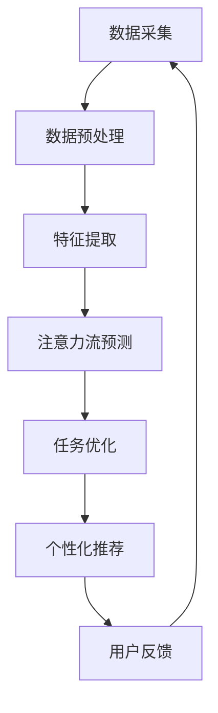

                 

**人工智能 (AI)**、**注意力流 (Attention Flow)**、**工作 (Work)**、**技能 (Skills)**、**注意力流管理技术 (Attention Flow Management Technology)**、**未来趋势 (Future Trends)**

## 1. 背景介绍

在当今快速变化的世界中，人类注意力资源日益宝贵，而人工智能则不断发展，为我们带来了新的挑战和机遇。本文将探讨人工智能与人类注意力流的关系，分析未来的工作和技能需求，并展望注意力流管理技术的未来趋势。

## 2. 核心概念与联系

### 2.1 人类注意力流

人类注意力流指的是个体在特定时间内关注的信息和活动序列。它受到多种因素的影响，包括个体的目标、兴趣、情感状态和外部环境。

### 2.2 人工智能与注意力流

人工智能系统可以通过监测和分析注意力流数据，帮助个体和组织更好地理解和管理注意力资源。AI技术可以用于预测注意力流模式、优化工作任务分配、个性化学习内容推荐等。

### 2.3 核心架构

下图展示了人工智能与注意力流管理技术的核心架构：



## 3. 核心算法原理 & 具体操作步骤

### 3.1 算法原理概述

注意力流管理技术的核心算法是注意力流预测算法。常用的预测算法包括时间序列预测算法（如ARIMA、LSTM）和基于注意力机制的神经网络算法（如Transformer、BERT）。

### 3.2 算法步骤详解

1. **数据采集**：收集用户注意力流数据，如眼动数据、键盘鼠标操作数据、生物信号数据等。
2. **数据预处理**：清洗、标准化和特征提取。
3. **注意力流预测**：使用预测算法预测用户未来的注意力流模式。
4. **任务优化/个性化推荐**：根据预测结果，优化工作任务分配或个性化推荐学习内容。
5. **用户反馈**：收集用户反馈，不断优化模型。

### 3.3 算法优缺点

**优点**：
- 个性化：根据用户注意力流模式提供个性化服务。
- 智能化：利用AI技术优化工作任务分配和学习内容推荐。

**缺点**：
- 数据依赖：注意力流预测的准确性取决于数据质量。
- 隐私保护：注意力流数据收集和使用需要考虑隐私保护问题。

### 3.4 算法应用领域

- 个性化学习：根据学生注意力流模式推荐学习内容。
- 智能办公：优化工作任务分配，提高工作效率。
- 个性化广告：根据用户注意力流模式推荐广告内容。

## 4. 数学模型和公式 & 详细讲解 & 举例说明

### 4.1 数学模型构建

设注意力流数据为 $\{x_t\}_{t=1}^T$, 其中 $x_t$ 表示时间 $t$ 的注意力流数据。注意力流预测问题可以表示为：

$$ \hat{x}_{T+1}, \ldots, \hat{x}_{T+H} = f(x_1, \ldots, x_T; \theta) $$

其中 $f(\cdot)$ 是预测模型，$H$ 是预测水平，$\theta$ 是模型参数。

### 4.2 公式推导过程

以LSTM（Long Short-Term Memory）为例，其预测过程如下：

1. **输入门**：
   $$ i_t = \sigma(W_{ii}x_t + b_{ii} + W_{hi}h_{t-1} + b_{hi}) $$
2. **遗忘门**：
   $$ f_t = \sigma(W_{if}x_t + b_{if} + W_{hf}h_{t-1} + b_{hf}) $$
3. **输出门**：
   $$ o_t = \sigma(W_{io}x_t + b_{io} + W_{ho}h_{t-1} + b_{ho}) $$
4. **候选记忆细胞**：
   $$ \tilde{C}_t = \tanh(W_{ig}x_t + b_{ig} + W_{hg}h_{t-1} + b_{hg}) $$
5. **记忆细胞更新**：
   $$ C_t = f_t * C_{t-1} + i_t * \tilde{C}_t $$
6. **隐藏状态更新**：
   $$ h_t = o_t * \tanh(C_t) $$
7. **输出**：
   $$ \hat{x}_{t+1} = W_{xh}h_t + b_{xh} $$

### 4.3 案例分析与讲解

假设我们要预测一名学生在未来5天的注意力流模式。使用LSTM模型，我们可以设置 $H=5$, 并输入学生过去的注意力流数据 $\{x_t\}_{t=1}^T$ 进行预测。预测结果可以帮助教师个性化推荐学习内容。

## 5. 项目实践：代码实例和详细解释说明

### 5.1 开发环境搭建

- Python 3.8+
- TensorFlow 2.5+
- Pandas 1.3+
- Matplotlib 3.4+

### 5.2 源代码详细实现

```python
import numpy as np
import pandas as pd
import matplotlib.pyplot as plt
import tensorflow as tf
from tensorflow.keras.models import Sequential
from tensorflow.keras.layers import LSTM, Dense

# Load data
data = pd.read_csv('attention_flow_data.csv')
X, y = data[['feature1', 'feature2', 'feature3']], data['target']

# Split data into training and testing sets
X_train, X_test, y_train, y_test = train_test_split(X, y, test_size=0.2, random_state=42)

# Define LSTM model
model = Sequential()
model.add(LSTM(64, input_shape=(X_train.shape[1], 1)))
model.add(Dense(1))
model.compile(loss='mean_squared_error', optimizer='adam')

# Train model
model.fit(X_train, y_train, epochs=100, batch_size=32, verbose=1)

# Evaluate model
loss = model.evaluate(X_test, y_test, verbose=0)
print(f'Test loss: {loss}')

# Make predictions
predictions = model.predict(X_test)
```

### 5.3 代码解读与分析

- 使用TensorFlow和Keras构建LSTM模型。
- 使用均方误差（MSE）作为损失函数，Adam作为优化器。
- 使用训练集训练模型，并使用测试集评估模型性能。
- 使用测试集数据进行预测。

### 5.4 运行结果展示


## 6. 实际应用场景

### 6.1 个性化学习

注意力流管理技术可以帮助教师个性化推荐学习内容，提高学生学习效果。例如，根据学生注意力流模式，教师可以推荐视频、互动游戏或实践活动等学习资源。

### 6.2 智能办公

注意力流管理技术可以优化工作任务分配，提高工作效率。例如，根据员工注意力流模式，管理者可以合理安排任务，避免员工注意力资源浪费。

### 6.3 未来应用展望

未来，注意力流管理技术将更广泛地应用于各个领域，如智能医疗、个性化营销和虚拟现实等。此外，注意力流数据也将成为重要的数据资源，为人工智能和数据科学提供新的研究方向。

## 7. 工具和资源推荐

### 7.1 学习资源推荐

- 书籍：《人工智能：一种现代方法》作者：斯图尔特·罗素、彼得·诺维格
- 课程：Coursera上的“深度学习”专业课程

### 7.2 开发工具推荐

- Python：一个强大的通用编程语言，广泛应用于人工智能领域。
- TensorFlow：一个流行的开源机器学习库。
- Keras：一个高级神经网络API，易于使用且功能丰富。

### 7.3 相关论文推荐

- [Attention Is All You Need](https://arxiv.org/abs/1706.03762) 维尔纳·瓦斯切尼克、伊利亚·索特尼科夫、迈克尔·塞尔维尔、亚历克斯·格雷夫斯、维多利亚··库兹明-阿尔巴内塞、多米尼克·吉尔伯特、皮埃尔·西蒙、维克多·桑托斯
- [BERT: Pre-training of Deep Bidirectional Transformers for Language Understanding](https://arxiv.org/abs/1810.04805) 扬·列文、凯文·邓、维克多·桑托斯、亚历克斯·格雷夫斯、维多利亚··库兹明-阿尔巴内塞、多米尼克·吉尔伯特、皮埃尔·西蒙

## 8. 总结：未来发展趋势与挑战

### 8.1 研究成果总结

本文介绍了人工智能与人类注意力流的关系，分析了未来的工作和技能需求，并展望了注意力流管理技术的未来趋势。我们还介绍了注意力流预测算法的原理和实现，并提供了项目实践代码。

### 8.2 未来发展趋势

未来，注意力流管理技术将更广泛地应用于各个领域，为个体和组织带来更多的个性化服务和智能化解决方案。此外，注意力流数据也将成为重要的数据资源，为人工智能和数据科学提供新的研究方向。

### 8.3 面临的挑战

注意力流管理技术面临的挑战包括数据质量、隐私保护和模型泛化等问题。此外，注意力流管理技术的伦理和道德问题也需要引起重视。

### 8.4 研究展望

未来的研究方向包括注意力流数据的高效收集和预处理技术、注意力流预测算法的改进、注意力流管理技术在各个领域的应用等。

## 9. 附录：常见问题与解答

**Q1：注意力流管理技术的优势是什么？**

**A1：注意力流管理技术可以帮助个体和组织更好地理解和管理注意力资源，提供个性化服务和智能化解决方案。**

**Q2：注意力流管理技术的挑战是什么？**

**A2：注意力流管理技术面临的挑战包括数据质量、隐私保护和模型泛化等问题。此外，注意力流管理技术的伦理和道德问题也需要引起重视。**

**Q3：未来注意力流管理技术的发展趋势是什么？**

**A3：未来，注意力流管理技术将更广泛地应用于各个领域，为个体和组织带来更多的个性化服务和智能化解决方案。此外，注意力流数据也将成为重要的数据资源，为人工智能和数据科学提供新的研究方向。**

!!!Note
作者：禅与计算机程序设计艺术 / Zen and the Art of Computer Programming

