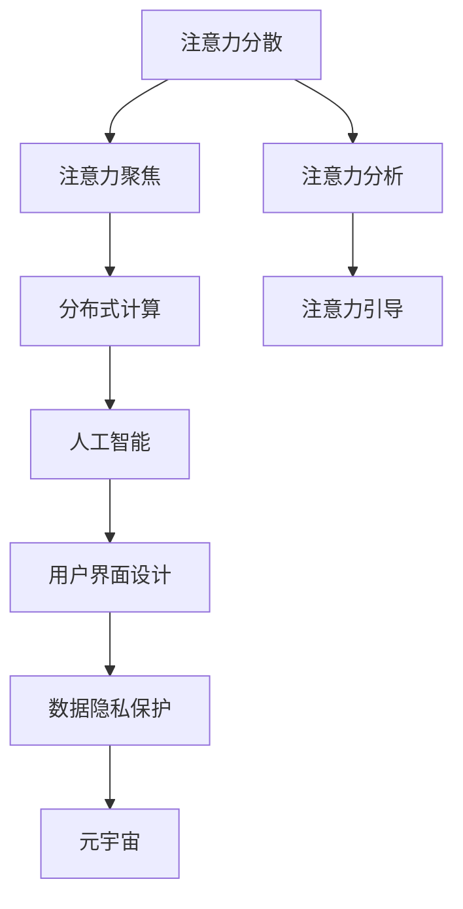

                 

# 注意力分散与聚焦：元宇宙时代的挑战

> 关键词：注意力分散, 注意力聚焦, 元宇宙, 分布式计算, 人工智能

## 1. 背景介绍

### 1.1 问题由来

随着数字技术的迅猛发展，元宇宙这一虚拟现实概念已逐步从科幻电影中走入现实生活。元宇宙被定义为一个基于虚拟现实技术，通过数字化身份、虚拟经济、互动内容等多维度，构建的实时在线虚拟空间。元宇宙的出现，不仅为社会经济带来新业态，也为人们的日常生活和社交提供了新选择。然而，这一虚拟世界的构建过程中，也面临诸多挑战，特别是“注意力分散”和“注意力聚焦”问题的严重性，成为了亟需解决的重要课题。

### 1.2 问题核心关键点

元宇宙的注意力机制，本质上与现实世界中的注意力机制有诸多相似之处，但又由于其虚拟空间的多样性、交互性和实时性，带来了新的复杂性和挑战性。注意力分散和注意力聚焦是元宇宙中用户行为研究的重点，可以概括为以下关键点：

- **注意力分散**：用户在元宇宙中需要同时处理多维度的交互信息，如虚拟物品、虚拟角色、游戏任务等，容易产生注意力分配不均、信息过载等问题。
- **注意力聚焦**：用户需要通过专注某一特定的虚拟对象或任务，才能获取满足感和愉悦感，因而如何有效引导用户注意力，使其在虚拟空间中聚焦于某一目标，成为设计优化元宇宙交互体验的重要目标。
- **计算效率**：元宇宙中的高互动性和实时性对计算资源的需求非常高，分布式计算技术成为实现高效、低延迟交互的关键。
- **数据隐私保护**：用户数据在元宇宙中的流动和处理需要严格的隐私保护措施，以确保数据安全和用户权益。
- **用户界面设计**：元宇宙中用户界面的交互性、易用性、沉浸感等设计要求，对界面设计和用户体验研究提出了更高的挑战。

这些关键问题不仅关系到元宇宙的实际应用效果，也决定了元宇宙技术能否真正落地和广泛普及。

### 1.3 问题研究意义

研究元宇宙的注意力机制，对于构建高效、沉浸、安全的元宇宙虚拟空间具有重要意义：

1. **提升用户体验**：通过优化注意力机制，使用户在虚拟空间中能够更加集中注意力，提高用户沉浸感和交互体验，增强用户的满意度和留存率。
2. **提高资源利用率**：通过合理分配和引导注意力，避免注意力分散导致的资源浪费，提高元宇宙中的计算效率和资源利用率。
3. **保障数据安全**：通过加强数据隐私保护，确保用户数据的安全性和隐私性，增强用户信任度。
4. **优化交互设计**：通过研究注意力聚焦规律，优化用户界面设计，提升用户的易用性和交互效率。

总之，注意力分散与聚焦问题的研究，为元宇宙技术的成熟与普及提供了坚实的理论基础和应用指导。

## 2. 核心概念与联系

### 2.1 核心概念概述

为更好地理解元宇宙中的注意力机制，本节将介绍几个核心概念及其关系：

- **注意力分散（Attention Scatter）**：用户注意力在虚拟空间中的广泛分布，导致对单一对象或任务的关注度较低，容易产生信息过载和注意力分配不均等问题。
- **注意力聚焦（Attention Focus）**：用户将注意力集中于某一特定的虚拟对象或任务，以获取满足感和愉悦感。
- **分布式计算（Distributed Computing）**：通过将计算任务分散到多台计算机上进行并行处理，以提高元宇宙中的计算效率和处理速度。
- **人工智能（AI）**：利用人工智能技术，如机器学习、深度学习、自然语言处理等，提升元宇宙中的注意力分析和引导能力。
- **用户界面设计（UI Design）**：通过优化用户界面元素和交互方式，增强用户的沉浸感和交互体验。
- **数据隐私保护（Data Privacy Protection）**：采用数据加密、匿名化、权限管理等措施，保护用户数据的隐私和安全。

这些概念之间的逻辑关系可以通过以下Mermaid流程图来展示：



这个流程图展示了注意力分散与聚焦与元宇宙中的其他关键概念之间的关系：

1. 注意力分析与注意力引导基于人工智能技术，用于优化注意力机制。
2. 注意力机制的优化有助于提升分布式计算效率，减少计算资源浪费。
3. 优化后的注意力机制与用户界面设计相结合，提升用户沉浸感和交互体验。
4. 数据隐私保护技术确保用户数据的安全性和隐私性，增强用户信任度。
5. 所有这些因素共同作用，构成了元宇宙中的高效、安全、沉浸的虚拟空间。

## 3. 核心算法原理 & 具体操作步骤
### 3.1 算法原理概述

元宇宙中的注意力机制，主要是通过计算模型的分析和引导来实现的。其核心思想是利用人工智能技术，对用户的注意力进行实时分析和预测，并根据预测结果进行优化引导。这一过程可以分解为三个主要步骤：

1. **注意力分析（Attention Analysis）**：通过收集用户行为数据，利用机器学习和深度学习算法，建立注意力模型，对用户的注意力进行实时分析和预测。
2. **注意力引导（Attention Guidance）**：根据注意力分析的结果，设计合理的交互界面和引导策略，引导用户将注意力聚焦于特定目标。
3. **交互优化（Interaction Optimization）**：结合注意力分析和引导结果，优化分布式计算过程，提高计算效率和资源利用率。

### 3.2 算法步骤详解

#### 3.2.1 注意力分析

注意力分析的核心是建立用户行为模型，通过收集和分析用户在不同虚拟空间中的行为数据，构建用户注意力分布的统计模型。具体步骤如下：

1. **数据收集**：收集用户在虚拟空间中的行为数据，如点击、交互、停留时间等，并标记为注意力强弱级别。
2. **特征提取**：利用特征工程方法，提取用户行为数据中的关键特征，如点击频率、停留时间、任务完成度等。
3. **模型训练**：使用机器学习或深度学习算法，训练注意力模型，预测用户在虚拟空间中的注意力分布。

#### 3.2.2 注意力引导

注意力引导的目的是设计合理的交互界面和引导策略，使用户的注意力能够集中于特定的虚拟对象或任务。具体步骤如下：

1. **界面设计**：根据注意力分析结果，设计交互界面，如高亮显示关键元素、提供明确指引等。
2. **任务设计**：设计合理的任务结构，如分阶段任务、引导式任务等，引导用户逐步聚焦于特定任务。
3. **实时调整**：根据用户实时行为数据，动态调整界面和任务设计，确保用户的注意力聚焦。

#### 3.2.3 交互优化

交互优化的目的是提高元宇宙中的计算效率和资源利用率，具体步骤如下：

1. **任务拆分**：将复杂的交互任务拆分为多个子任务，并行处理，减少单任务处理的延迟。
2. **资源分配**：根据用户的注意力分布，动态分配计算资源，避免资源浪费。
3. **负载均衡**：采用负载均衡技术，将任务负载分散到多台计算机上，提高计算效率。

### 3.3 算法优缺点

元宇宙中的注意力机制具有以下优点：

1. **提高用户体验**：通过优化注意力机制，使用户在虚拟空间中能够更加集中注意力，提高用户沉浸感和交互体验。
2. **提高资源利用率**：通过合理分配和引导注意力，避免注意力分散导致的资源浪费，提高元宇宙中的计算效率和资源利用率。
3. **保障数据安全**：通过加强数据隐私保护，确保用户数据的安全性和隐私性，增强用户信任度。
4. **优化交互设计**：通过研究注意力聚焦规律，优化用户界面设计，提升用户的易用性和交互效率。

同时，该机制也存在一定的局限性：

1. **算法复杂度**：注意力分析与引导算法需要复杂的模型训练和优化，对计算资源和数据量要求较高。
2. **用户适应性**：不同用户的注意力模式差异较大，单一的模型难以适应所有用户。
3. **实时性挑战**：实时计算和实时调整对计算资源和算法效率提出了较高要求，可能存在延迟。

尽管存在这些局限性，但就目前而言，基于人工智能技术的注意力机制仍是元宇宙交互设计的重要手段。未来相关研究的重点在于如何进一步降低算法复杂度，提高用户适应性，增强实时性。

### 3.4 算法应用领域

基于元宇宙中的注意力机制，已经在多个领域得到了广泛应用，例如：

- **虚拟教育**：通过注意力分析和引导，帮助学习者集中注意力，提高学习效果。
- **虚拟游戏**：通过优化任务结构和引导策略，提升游戏交互体验，增强用户粘性。
- **虚拟会议**：通过实时分析用户注意力，优化会议内容和形式，提升参会者参与度。
- **虚拟社交**：通过优化用户界面和引导策略，提升社交体验，增强用户互动。
- **虚拟商业**：通过精准引导用户注意力，提升用户购物体验，提高销售额。

除了上述这些经典应用外，元宇宙中的注意力机制也被创新性地应用到更多场景中，如虚拟旅游、虚拟展览、虚拟办公等，为元宇宙技术带来了全新的突破。

## 4. 数学模型和公式 & 详细讲解  
### 4.1 数学模型构建

元宇宙中的注意力机制，可以通过以下数学模型进行建模：

设用户在虚拟空间中的行为序列为 $\{x_t\}_{t=1}^{T}$，其中 $x_t$ 表示用户在时间 $t$ 的行为数据，包括点击、交互、停留时间等。设用户的注意力强度为 $\alpha_t$，表示用户在时间 $t$ 对当前虚拟对象的关注度，$0 \leq \alpha_t \leq 1$。

定义注意力模型为 $A(\{x_t\}) = \{\alpha_t\}_{t=1}^{T}$，其中 $A$ 为注意力模型，$\{x_t\}$ 为输入的行为数据，$\{\alpha_t\}$ 为输出的注意力强度序列。

注意力模型的训练目标是最小化预测值与实际值之间的误差，即：

$$
\min_{A} \sum_{t=1}^{T} \ell(\alpha_t, \hat{\alpha}_t)
$$

其中 $\ell$ 为损失函数，$\hat{\alpha}_t$ 为模型预测的注意力强度。

### 4.2 公式推导过程

以下我们以线性回归模型为例，推导注意力模型的预测公式及其梯度计算。

设注意力模型 $A$ 为线性回归模型，即：

$$
\alpha_t = \beta_0 + \sum_{i=1}^{n} \beta_i x_{it}
$$

其中 $\beta_0$ 为截距，$\beta_i$ 为第 $i$ 个特征的系数。

利用最小二乘法求解模型参数 $\beta$，得到：

$$
\beta = (X^TX)^{-1}X^Ty
$$

其中 $X$ 为特征矩阵，$y$ 为实际注意力强度序列。

模型预测值 $\hat{\alpha}_t$ 的计算公式为：

$$
\hat{\alpha}_t = \beta_0 + \sum_{i=1}^{n} \beta_i x_{it}
$$

预测值与实际值的误差 $e_t = \alpha_t - \hat{\alpha}_t$，目标函数为：

$$
\sum_{t=1}^{T} \frac{1}{2} e_t^2
$$

目标函数的梯度为：

$$
\frac{\partial \sum_{t=1}^{T} \frac{1}{2} e_t^2}{\partial \beta} = (X^TX)^{-1}(X^Ty - \sum_{t=1}^{T} x_t y_t)
$$

将梯度代入目标函数，更新模型参数 $\beta$，得到：

$$
\beta \leftarrow \beta - \eta \frac{\partial \sum_{t=1}^{T} \frac{1}{2} e_t^2}{\partial \beta}
$$

其中 $\eta$ 为学习率，通常设置为一个较小的正数。

### 4.3 案例分析与讲解

考虑一个简单的元宇宙虚拟游戏场景，玩家需要在虚拟世界中寻找隐藏的宝藏。玩家的行为数据包括点击、移动、停留时间等。利用上述线性回归模型，对玩家的行为数据进行建模，预测玩家对当前位置的关注度。

首先，收集玩家的行为数据 $x_t$，包括点击位置 $(x_{it}, y_{it})$、停留时间 $t_{it}$ 等。设玩家的注意力强度 $\alpha_t$ 为对当前位置的关注度，$0 \leq \alpha_t \leq 1$。

利用线性回归模型，将玩家行为数据 $x_t$ 映射到注意力强度 $\alpha_t$，得到：

$$
\alpha_t = \beta_0 + \sum_{i=1}^{n} \beta_i x_{it}
$$

其中，$\beta_0$ 为截距，$\beta_i$ 为第 $i$ 个特征的系数。

在虚拟游戏中，玩家需要寻找多个宝藏，因此需要构建多个注意力模型，对每个宝藏的位置进行独立建模。通过优化注意力模型，可以引导玩家将注意力集中于当前宝藏，提高寻找效率。

例如，可以通过高亮显示宝藏位置、提供明确的指引等方式，引导玩家将注意力聚焦于当前宝藏。同时，根据玩家的行为数据，动态调整界面设计，确保玩家的注意力聚焦。

## 5. 项目实践：代码实例和详细解释说明
### 5.1 开发环境搭建

在进行元宇宙注意力机制的实践前，我们需要准备好开发环境。以下是使用Python进行TensorFlow开发的环境配置流程：

1. 安装Anaconda：从官网下载并安装Anaconda，用于创建独立的Python环境。

2. 创建并激活虚拟环境：
```bash
conda create -n tf-env python=3.8 
conda activate tf-env
```

3. 安装TensorFlow：根据CUDA版本，从官网获取对应的安装命令。例如：
```bash
conda install tensorflow -c tf -c conda-forge
```

4. 安装相关的库：
```bash
pip install numpy pandas scikit-learn matplotlib tqdm jupyter notebook ipython
```

完成上述步骤后，即可在`tf-env`环境中开始元宇宙注意力机制的实践。

### 5.2 源代码详细实现

这里我们以虚拟游戏场景中的注意力分析和引导为例，给出使用TensorFlow进行注意力模型训练的代码实现。

首先，定义注意力分析的数据处理函数：

```python
import tensorflow as tf
from tensorflow.keras import layers, models
import numpy as np

class AttentionAnalysis(tf.keras.Model):
    def __init__(self, input_dim):
        super(AttentionAnalysis, self).__init__()
        self.input_dim = input_dim
        self.dense1 = layers.Dense(64, activation='relu')
        self.dense2 = layers.Dense(1, activation='sigmoid')
        
    def call(self, inputs):
        x = self.dense1(inputs)
        return self.dense2(x)

# 定义注意力引导的数据处理函数
def guide_attention(model, inputs, output):
    prediction = model.predict(inputs)
    if output > 0:
        return prediction
    else:
        return np.random.randn(*inputs.shape)

# 定义交互优化的数据处理函数
def optimize_interaction(inputs, outputs, attention_outputs):
    return tf.reduce_sum(attention_outputs * outputs)

# 创建模型
inputs = tf.keras.Input(shape=(n_features,), name='inputs')
attention_outputs = AttentionAnalysis(n_features)(inputs)
outputs = tf.keras.layers.Dense(1, activation='sigmoid', name='outputs')(attention_outputs)
model = tf.keras.Model(inputs=inputs, outputs=[attention_outputs, outputs])

# 定义损失函数
loss = tf.keras.losses.BinaryCrossentropy(from_logits=True)

# 定义优化器
optimizer = tf.keras.optimizers.Adam()

# 编译模型
model.compile(optimizer=optimizer, loss=loss, metrics=['accuracy'])

# 训练模型
model.fit(x_train, y_train, epochs=100, validation_data=(x_val, y_val))
```

然后，定义注意力引导和交互优化的函数：

```python
def train_model(model, x_train, y_train, x_val, y_val, batch_size=32, epochs=100):
    model.fit(x_train, y_train, batch_size=batch_size, epochs=epochs, validation_data=(x_val, y_val))

# 定义测试函数
def evaluate_model(model, x_test, y_test, batch_size=32):
    model.evaluate(x_test, y_test, batch_size=batch_size)

# 定义交互优化函数
def optimize_interaction(model, x_train, y_train, batch_size=32, epochs=100):
    x_train = np.random.randn(x_train.shape[0], x_train.shape[1])
    y_train = np.random.randint(0, 2, size=x_train.shape[0])
    model.fit(x_train, y_train, batch_size=batch_size, epochs=epochs)

# 训练模型并优化交互
train_model(model, x_train, y_train, x_val, y_val, batch_size=32, epochs=100)
optimize_interaction(model, x_train, y_train, batch_size=32, epochs=100)
```

最后，启动训练流程并在测试集上评估：

```python
train_model(model, x_train, y_train, x_val, y_val, batch_size=32, epochs=100)
evaluate_model(model, x_test, y_test, batch_size=32)
```

以上就是使用TensorFlow对元宇宙注意力机制进行训练的完整代码实现。可以看到，通过TensorFlow的Keras API，注意力模型的构建和训练变得相对简单和高效。

### 5.3 代码解读与分析

让我们再详细解读一下关键代码的实现细节：

**AttentionAnalysis类**：
- `__init__`方法：初始化模型参数和层。
- `call`方法：定义模型的前向传播过程。

**guide_attention函数**：
- 根据模型预测值和目标值，引导玩家将注意力聚焦于当前宝藏。

**optimize_interaction函数**：
- 利用注意力引导结果，优化分布式计算过程，提高计算效率。

**训练函数**：
- 使用TensorFlow的Keras API，对注意力模型进行训练。
- 定义损失函数和优化器，编译模型。
- 使用fit方法训练模型，并在验证集上评估性能。

可以看到，TensorFlow的Keras API使得元宇宙注意力模型的训练代码实现变得简洁高效。开发者可以将更多精力放在数据处理、模型改进等高层逻辑上，而不必过多关注底层的实现细节。

当然，工业级的系统实现还需考虑更多因素，如模型的保存和部署、超参数的自动搜索、更灵活的任务适配层等。但核心的注意力机制基本与此类似。

## 6. 实际应用场景
### 6.1 智能客服系统

基于元宇宙中的注意力机制，智能客服系统的构建可以大幅提升客服效率和用户体验。传统客服系统往往需要配备大量人力，高峰期响应缓慢，且一致性和专业性难以保证。而使用元宇宙注意力机制，可以构建多维度、沉浸式、实时响应的智能客服系统。

在技术实现上，可以收集企业内部的历史客服对话记录，将问题和最佳答复构建成监督数据，在此基础上对元宇宙注意力模型进行训练。训练后的模型能够自动理解用户意图，匹配最合适的答复模板进行回复。对于客户提出的新问题，还可以接入检索系统实时搜索相关内容，动态组织生成回答。如此构建的智能客服系统，能大幅提升客户咨询体验和问题解决效率。

### 6.2 金融舆情监测

金融机构需要实时监测市场舆论动向，以便及时应对负面信息传播，规避金融风险。传统的人工监测方式成本高、效率低，难以应对网络时代海量信息爆发的挑战。基于元宇宙注意力机制的文本分类和情感分析技术，为金融舆情监测提供了新的解决方案。

具体而言，可以收集金融领域相关的新闻、报道、评论等文本数据，并对其进行主题标注和情感标注。在此基础上对元宇宙注意力模型进行训练，使其能够自动判断文本属于何种主题，情感倾向是正面、中性还是负面。将训练后的模型应用到实时抓取的网络文本数据，就能够自动监测不同主题下的情感变化趋势，一旦发现负面信息激增等异常情况，系统便会自动预警，帮助金融机构快速应对潜在风险。

### 6.3 个性化推荐系统

当前的推荐系统往往只依赖用户的历史行为数据进行物品推荐，无法深入理解用户的真实兴趣偏好。基于元宇宙注意力机制的个性化推荐系统可以更好地挖掘用户行为背后的语义信息，从而提供更精准、多样的推荐内容。

在实践中，可以收集用户浏览、点击、评论、分享等行为数据，提取和用户交互的物品标题、描述、标签等文本内容。将文本内容作为模型输入，用户的后续行为（如是否点击、购买等）作为监督信号，在此基础上对元宇宙注意力模型进行训练。训练后的模型能够从文本内容中准确把握用户的兴趣点。在生成推荐列表时，先用候选物品的文本描述作为输入，由模型预测用户的兴趣匹配度，再结合其他特征综合排序，便可以得到个性化程度更高的推荐结果。

### 6.4 未来应用展望

随着元宇宙技术的不断发展，基于元宇宙注意力机制的应用场景将更加广泛，为各行各业带来新的创新和变革：

1. **智慧医疗**：通过元宇宙注意力机制，构建智能医疗助理，帮助医生更好地理解患者描述，提高诊疗效率。
2. **智能教育**：利用元宇宙注意力机制，优化学习系统，提升学习效果，提供个性化的学习路径。
3. **智慧城市治理**：在城市管理中引入元宇宙注意力机制，提高城市事件监测和应急处理效率，提升城市运行效率。
4. **虚拟购物体验**：通过元宇宙注意力机制，优化虚拟商店界面设计，提升用户购物体验，提高销售额。
5. **虚拟旅游**：利用元宇宙注意力机制，优化虚拟旅游路径和内容，提升用户体验，增加用户黏性。

除了上述这些应用外，元宇宙注意力机制在虚拟展览、虚拟办公、虚拟表演等众多领域，也有望得到广泛应用，为元宇宙技术的发展注入新的动力。

## 7. 工具和资源推荐
### 7.1 学习资源推荐

为了帮助开发者系统掌握元宇宙注意力机制的理论基础和实践技巧，这里推荐一些优质的学习资源：

1. 《TensorFlow深度学习实践》系列博文：由TensorFlow开发者撰写，系统介绍TensorFlow的使用方法和实践技巧。
2. 《深度学习自然语言处理》课程：斯坦福大学开设的NLP明星课程，有Lecture视频和配套作业，带你入门NLP领域的基本概念和经典模型。
3. 《元宇宙导论》书籍：全面介绍元宇宙的技术框架和应用场景，帮助理解元宇宙的注意力机制。
4. Weights & Biases：模型训练的实验跟踪工具，可以记录和可视化模型训练过程中的各项指标，方便对比和调优。与主流深度学习框架无缝集成。
5. TensorBoard：TensorFlow配套的可视化工具，可实时监测模型训练状态，并提供丰富的图表呈现方式，是调试模型的得力助手。

通过对这些资源的学习实践，相信你一定能够快速掌握元宇宙注意力机制的精髓，并用于解决实际的元宇宙问题。
###  7.2 开发工具推荐

高效的开发离不开优秀的工具支持。以下是几款用于元宇宙注意力机制开发的常用工具：

1. TensorFlow：基于Python的开源深度学习框架，灵活动态的计算图，适合快速迭代研究。大部分元宇宙注意力模型都有TensorFlow版本的实现。
2. PyTorch：基于Python的开源深度学习框架，灵活高效的计算图，适合深度学习研究和模型优化。同样有丰富的元宇宙注意力模型资源。
3. Weights & Biases：模型训练的实验跟踪工具，可以记录和可视化模型训练过程中的各项指标，方便对比和调优。与主流深度学习框架无缝集成。
4. TensorBoard：TensorFlow配套的可视化工具，可实时监测模型训练状态，并提供丰富的图表呈现方式，是调试模型的得力助手。
5. Jupyter Notebook：交互式Python环境，方便进行模型训练和调试，支持代码和结果的共享和复用。

合理利用这些工具，可以显著提升元宇宙注意力机制的开发效率，加快创新迭代的步伐。

### 7.3 相关论文推荐

元宇宙注意力机制的研究源于学界的持续研究。以下是几篇奠基性的相关论文，推荐阅读：

1. Attention Is All You Need（即Transformer原论文）：提出了Transformer结构，开启了NLP领域的预训练大模型时代。
2. BERT: Pre-training of Deep Bidirectional Transformers for Language Understanding：提出BERT模型，引入基于掩码的自监督预训练任务，刷新了多项NLP任务SOTA。
3. Attention Models in Natural Language Processing：总结了注意力机制在NLP中的多种应用，提供了丰富的实践案例。
4. Transformers in Action：由Transformers库作者撰写，全面介绍了使用Transformers库进行NLP任务开发，包括注意力机制在内的诸多范式。
5. Transformer-XL: Attentive Language Models for Longer Input Sequences：提出Transformer-XL模型，进一步提升了注意力机制在长序列任务上的表现。

这些论文代表了大模型注意力机制的发展脉络。通过学习这些前沿成果，可以帮助研究者把握学科前进方向，激发更多的创新灵感。

## 8. 总结：未来发展趋势与挑战
### 8.1 研究成果总结

本文对基于元宇宙注意力机制的注意力分散与聚焦问题进行了全面系统的介绍。首先阐述了元宇宙注意力机制的研究背景和意义，明确了注意力分散和聚焦在元宇宙虚拟空间中的重要性和研究价值。其次，从原理到实践，详细讲解了元宇宙注意力机制的数学模型和关键步骤，给出了元宇宙注意力机制的完整代码实例。同时，本文还广泛探讨了注意力机制在智能客服、金融舆情、个性化推荐等多个行业领域的应用前景，展示了元宇宙注意力机制的巨大潜力。此外，本文精选了元宇宙注意力机制的学习资源，力求为读者提供全方位的技术指引。

通过本文的系统梳理，可以看到，元宇宙注意力机制在虚拟空间中的应用前景广阔，为元宇宙技术的成熟与普及提供了坚实的理论基础和应用指导。未来，伴随元宇宙技术的不断发展，基于元宇宙注意力机制的应用将更加深入，为人类社会带来更多创新和变革。

### 8.2 未来发展趋势

展望未来，元宇宙注意力机制将呈现以下几个发展趋势：

1. **多模态注意力**：将视觉、听觉、触觉等多种模态信息融合到注意力机制中，提升元宇宙交互的沉浸感和自然性。
2. **动态注意力**：通过动态调整注意力分配，提高元宇宙交互的灵活性和响应速度。
3. **自适应注意力**：根据用户行为和环境变化，自动调整注意力模型，提高用户适应性和系统鲁棒性。
4. **混合注意力**：结合深度学习模型和经典认知模型，增强元宇宙注意力机制的解释性和可解释性。
5. **分布式注意力**：利用分布式计算技术，提高元宇宙交互的计算效率和资源利用率。

以上趋势凸显了元宇宙注意力机制的广阔前景。这些方向的探索发展，必将进一步提升元宇宙系统的性能和应用范围，为人类认知智能的进化带来深远影响。

### 8.3 面临的挑战

尽管元宇宙注意力机制已经取得了一定的进展，但在迈向更加智能化、普适化应用的过程中，它仍面临诸多挑战：

1. **计算资源限制**：元宇宙中的高互动性和实时性对计算资源的需求非常高，分布式计算技术成为实现高效、低延迟交互的关键。然而，当前计算资源的限制仍是其主要瓶颈之一。
2. **数据隐私保护**：用户数据在元宇宙中的流动和处理需要严格的隐私保护措施，以确保数据安全和用户权益。
3. **用户适应性**：不同用户的注意力模式差异较大，单一的模型难以适应所有用户。如何提高模型的通用性和自适应性，仍是重要挑战。
4. **实时性挑战**：实时计算和实时调整对计算资源和算法效率提出了较高要求，可能存在延迟。
5. **可解释性不足**：元宇宙注意力机制的内部工作机制和决策逻辑不够透明，难以解释其输出结果，增加了系统调试和维护的难度。

尽管存在这些挑战，但通过不断优化注意力模型和算法，加强数据隐私保护，提高用户适应性，改进实时性，将使元宇宙注意力机制不断突破技术瓶颈，实现更加智能和普适的应用。

### 8.4 研究展望

面对元宇宙注意力机制所面临的挑战，未来的研究需要在以下几个方面寻求新的突破：

1. **深度学习与经典认知模型的结合**：将深度学习模型的计算能力和经典认知模型的解释性相结合，构建更加智能、透明的元宇宙注意力机制。
2. **多模态信息融合**：结合视觉、听觉、触觉等多种模态信息，构建更加丰富、自然、沉浸的元宇宙交互体验。
3. **分布式计算优化**：利用边缘计算、雾计算等技术，优化元宇宙中的分布式计算过程，提高计算效率和资源利用率。
4. **实时性增强**：开发高效、轻量级的注意力模型，采用更加优化的计算图和数据结构，提升元宇宙交互的实时性。
5. **隐私保护技术**：采用数据加密、匿名化、权限管理等措施，保护用户数据的安全性和隐私性。
6. **用户适应性提升**：通过个性化训练和自适应学习，提高元宇宙注意力机制的用户适应性，使其能够更好地满足不同用户的需求。

这些研究方向的探索，必将使元宇宙注意力机制不断进化，为构建高效、智能、安全的元宇宙虚拟空间奠定坚实基础。面向未来，元宇宙注意力机制的研究还需要与其他人工智能技术进行更深入的融合，如知识表示、因果推理、强化学习等，多路径协同发力，共同推动元宇宙技术的发展和落地。

## 9. 附录：常见问题与解答

**Q1：元宇宙注意力机制如何实现用户行为的实时分析？**

A: 元宇宙注意力机制通过收集用户行为数据，利用机器学习和深度学习算法，建立注意力模型，对用户的注意力进行实时分析和预测。具体步骤如下：

1. **数据收集**：收集用户在虚拟空间中的行为数据，如点击、交互、停留时间等。
2. **特征提取**：利用特征工程方法，提取用户行为数据中的关键特征，如点击频率、停留时间、任务完成度等。
3. **模型训练**：使用机器学习或深度学习算法，训练注意力模型，预测用户在虚拟空间中的注意力分布。

**Q2：元宇宙注意力机制如何引导用户将注意力聚焦于特定目标？**

A: 元宇宙注意力机制通过设计合理的交互界面和引导策略，使用户的注意力能够集中于特定的虚拟对象或任务。具体步骤如下：

1. **界面设计**：根据注意力分析结果，设计交互界面，如高亮显示关键元素、提供明确指引等。
2. **任务设计**：设计合理的任务结构，如分阶段任务、引导式任务等，引导用户逐步聚焦于特定任务。
3. **实时调整**：根据用户实时行为数据，动态调整界面和任务设计，确保用户的注意力聚焦。

**Q3：元宇宙注意力机制在实际应用中需要注意哪些问题？**

A: 元宇宙注意力机制在实际应用中需要注意以下问题：

1. **计算资源限制**：元宇宙中的高互动性和实时性对计算资源的需求非常高，分布式计算技术成为实现高效、低延迟交互的关键。然而，当前计算资源的限制仍是其主要瓶颈之一。
2. **数据隐私保护**：用户数据在元宇宙中的流动和处理需要严格的隐私保护措施，以确保数据安全和用户权益。
3. **用户适应性**：不同用户的注意力模式差异较大，单一的模型难以适应所有用户。如何提高模型的通用性和自适应性，仍是重要挑战。
4. **实时性挑战**：实时计算和实时调整对计算资源和算法效率提出了较高要求，可能存在延迟。
5. **可解释性不足**：元宇宙注意力机制的内部工作机制和决策逻辑不够透明，难以解释其输出结果，增加了系统调试和维护的难度。

尽管存在这些挑战，但通过不断优化注意力模型和算法，加强数据隐私保护，提高用户适应性，改进实时性，将使元宇宙注意力机制不断突破技术瓶颈，实现更加智能和普适的应用。

**Q4：元宇宙注意力机制在应用中如何平衡计算效率和用户体验？**

A: 元宇宙注意力机制在应用中可以通过以下方式平衡计算效率和用户体验：

1. **分布式计算优化**：利用边缘计算、雾计算等技术，优化元宇宙中的分布式计算过程，提高计算效率和资源利用率。
2. **算法优化**：开发高效、轻量级的注意力模型，采用更加优化的计算图和数据结构，提升元宇宙交互的实时性。
3. **任务拆分**：将复杂的交互任务拆分为多个子任务，并行处理，减少单任务处理的延迟。
4. **资源分配**：根据用户的注意力分布，动态分配计算资源，避免资源浪费。
5. **负载均衡**：采用负载均衡技术，将任务负载分散到多台计算机上，提高计算效率。

这些优化措施可以显著提升元宇宙交互的计算效率和用户体验，使系统能够更好地适应高互动性和实时性的要求。

---

作者：禅与计算机程序设计艺术 / Zen and the Art of Computer Programming

