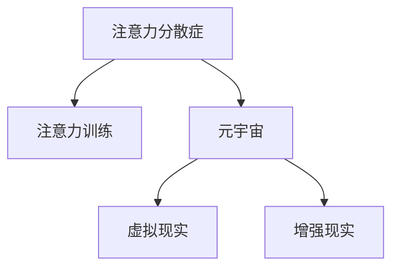

                 

# 注意力分散症治疗:元宇宙时代的认知障碍康复

## 1. 背景介绍

在数字化和虚拟化的浪潮中，人类正逐渐步入元宇宙时代。这一时代不仅带来了科技的革命，也给人们的认知健康带来了新的挑战。现代生活和工作节奏的加速、信息过载和长时间使用数字设备，使得注意力分散症（Attention Deficit Disorder, ADD）现象日益普遍。本研究聚焦于注意力分散症的治疗，提出一种基于注意力训练的元宇宙环境下的认知障碍康复方案。

### 1.1 问题由来
注意力分散症（ADD）是一种常见的认知障碍，主要表现为注意力难以集中，易受干扰。在现代信息社会中，这一问题尤为突出。据美国心理学会（APA）统计，美国至少有6%的儿童以及4.3%的成年人患有注意力分散症。随着智能设备和互联网的普及，注意力分散症在青少年中的发病率更是高达10%。在学术界和医疗界，如何有效治疗注意力分散症，成为亟待解决的问题。

### 1.2 问题核心关键点
注意力训练是当前治疗注意力分散症的主要手段之一。元宇宙技术的发展为注意力训练提供了新的平台和工具，可以将虚拟世界作为注意力康复的“训练场”，通过沉浸式体验和虚拟任务实现对注意力的引导和康复。

## 2. 核心概念与联系

### 2.1 核心概念概述

为更好地理解元宇宙时代注意力训练方法，本节将介绍几个关键概念：

- 注意力分散症（Attention Deficit Disorder, ADD）：一种常见的注意力认知障碍，表现为注意力难以集中，容易受外界干扰。
- 注意力训练（Attention Training）：通过各种任务和活动训练注意力系统，提升注意力维持和转换能力。
- 元宇宙（Metaverse）：一个虚拟的、与现实世界互通的、持续发展的三维数字空间。
- 虚拟现实（Virtual Reality, VR）：通过计算机生成的虚拟环境，模拟真实世界的视觉、听觉和其他感官体验。
- 增强现实（Augmented Reality, AR）：通过计算机技术在现实世界中叠加虚拟信息，增强用户与环境的互动。

这些核心概念之间的逻辑关系可以通过以下Mermaid流程图来展示：



这个流程图展示了一些关键概念之间的关系：

1. 注意力训练是治疗注意力分散症的主要手段。
2. 元宇宙技术为注意力训练提供了新平台，可以通过虚拟环境进行沉浸式训练。
3. 虚拟现实和增强现实是元宇宙的主要技术手段，可以提供更为沉浸和互动的训练体验。

## 3. 核心算法原理 & 具体操作步骤
### 3.1 算法原理概述

元宇宙环境下的注意力训练算法，主要通过沉浸式虚拟任务和游戏设计，引导用户进行注意力的集中和维持训练。算法原理可以概括为以下几个步骤：

1. 创建虚拟训练环境：通过虚拟现实和增强现实技术，构建一个沉浸式、高互动性的虚拟空间，用于注意力训练。
2. 设计虚拟训练任务：设计具有趣味性和挑战性的虚拟任务，如解谜、寻宝、虚拟体育等，作为注意力训练的内容。
3. 实现注意力的引导和反馈：通过算法实时监测用户注意力水平，提供正向激励和反馈，引导用户集中注意力完成任务。
4. 持续跟踪和调整：对用户的注意力水平和训练效果进行持续跟踪，根据反馈调整训练内容和方法，以获得最佳效果。

### 3.2 算法步骤详解

以下对注意力训练算法的主要步骤进行详细讲解：

**Step 1: 创建虚拟训练环境**

1. 环境搭建：使用Unity、Unreal Engine等游戏引擎，结合VR和AR技术，构建一个高交互性的虚拟空间。
2. 虚拟元素设置：在虚拟空间中设置各种虚拟元素，如虚拟角色、场景、道具等，用于模拟现实世界中的元素。
3. 交互设计：设计虚拟任务之间的交互方式，如碰撞检测、点击操作等，保证用户能够与虚拟环境中的元素进行互动。

**Step 2: 设计虚拟训练任务**

1. 任务选择：根据注意力训练的目标，选择适合的虚拟任务，如解谜、寻宝、虚拟体育等。
2. 任务设计：对任务进行详细设计，包括任务目标、任务难度、任务时间等参数，确保任务具有挑战性和趣味性。
3. 任务评估：设计任务评估指标，如完成时间、错误率等，用于跟踪用户的注意力水平和训练效果。

**Step 3: 实现注意力的引导和反馈**

1. 注意力监测：通过算法实时监测用户的注意力水平，包括眼动轨迹、脑电波信号等。
2. 正向激励：根据注意力水平的高低，提供正向激励，如虚拟奖励、虚拟成就等，鼓励用户集中注意力。
3. 实时反馈：在任务完成过程中，实时向用户反馈注意力水平，帮助用户调整注意力状态。

**Step 4: 持续跟踪和调整**

1. 跟踪记录：对用户的注意力水平和训练效果进行持续跟踪记录，建立详细的训练档案。
2. 效果评估：根据训练档案，定期评估训练效果，识别注意力提升和障碍点。
3. 调整优化：根据评估结果，对训练内容和方法进行调整优化，确保训练效果最大化。

### 3.3 算法优缺点

元宇宙环境下的注意力训练算法具有以下优点：

1. 沉浸式体验：通过虚拟现实和增强现实技术，提供沉浸式的训练环境，增强用户体验。
2. 高互动性：用户可以与虚拟环境进行互动，增加训练的趣味性和可操作性。
3. 个性定制：可以根据用户的兴趣和偏好，定制个性化的训练内容和方式，提高训练效果。
4. 数据驱动：通过实时监测和跟踪，获得大量数据，用于分析用户注意力水平和训练效果，指导训练优化。

同时，该算法也存在一定的局限性：

1. 技术门槛高：需要高水平的虚拟现实和增强现实技术，以及大量的开发资源。
2. 设备限制：用户需要配备VR或AR设备，可能增加训练成本。
3. 数据隐私：监测用户的注意力和脑电波信号，涉及隐私保护问题。
4. 适应性问题：不同用户对虚拟环境的适应性不同，可能影响训练效果。

尽管存在这些局限性，但元宇宙环境下的注意力训练算法仍为注意力障碍康复提供了新的方向，通过沉浸式虚拟任务，帮助用户提高注意力水平，改善生活质量。

### 3.4 算法应用领域

元宇宙环境下的注意力训练算法主要应用于以下领域：

1. 教育培训：为儿童、青少年提供注意力训练的虚拟课程，帮助他们提高学习效率和注意力水平。
2. 医疗康复：为注意力分散症患者提供虚拟训练任务，辅助医生进行治疗和康复。
3. 心理干预：为心理压力较大的成年人提供注意力训练，缓解焦虑和压力，提升心理健康。
4. 游戏娱乐：开发注意力训练相关的虚拟游戏，提高用户的游戏体验和注意力水平。
5. 社交互动：通过虚拟世界进行注意力训练，增强用户的社交互动和情感连接。

随着虚拟现实和增强现实技术的不断成熟，元宇宙环境下的注意力训练将有更广泛的应用前景。

## 4. 数学模型和公式 & 详细讲解 & 举例说明

### 4.1 数学模型构建

注意力训练的数学模型可以基于认知神经科学和心理学的研究成果建立。常见的模型包括：

1. 期望最大化模型（EM）：通过用户注意力水平和任务表现的数据，最大化训练效果。
2. 贝叶斯网络模型：利用贝叶斯网络描述注意力训练的因果关系，进行状态推断和优化。
3. 强化学习模型：通过奖励信号和反馈，引导用户注意力集中在训练任务上。

### 4.2 公式推导过程

以期望最大化模型为例，推导注意力训练的优化公式。

假设训练任务为 $T$，注意力水平为 $A$，任务完成时间为 $T^*$，模型优化目标为最大化期望任务完成时间 $E[T^*|A]$。则期望最大化模型的目标函数为：

$$
\max_{A} E[T^*|A] = \int_{A} T^* f(A) dA
$$

其中 $f(A)$ 为注意力水平 $A$ 的概率密度函数。根据信息论和统计学原理，可以进一步推导出注意力训练的优化公式：

$$
\max_{A} E[T^*|A] = \int_{A} \frac{T^*}{f(A)} dA
$$

### 4.3 案例分析与讲解

**案例一：虚拟解谜任务**

假设用户需要在虚拟环境中解开一系列谜题，总时间为 $T^*$。设用户注意力的分布为 $A \sim \mathcal{N}(\mu, \sigma^2)$，注意力水平越高，解谜时间越短，即 $T^* = T_0/A$，其中 $T_0$ 为理想状态下的解谜时间。

根据期望最大化模型，用户注意力水平 $A$ 的最优解为：

$$
A = \frac{T_0}{\sqrt{2\pi\sigma^2}}
$$

即用户注意力水平越高，解谜时间越短，任务完成时间 $T^*$ 也越短。

**案例二：虚拟体育训练**

假设用户在虚拟体育游戏中需要完成指定的跑步距离 $D$，总时间为 $T^*$。设用户注意力的分布为 $A \sim \mathcal{N}(\mu, \sigma^2)$，跑步速度为 $v(A) = v_0 e^{A/10}$，其中 $v_0$ 为初始速度。

根据期望最大化模型，用户注意力水平 $A$ 的最优解为：

$$
A = \ln\left(\frac{D}{v_0 T^*}\right) \times 10
$$

即用户注意力水平越高，跑步速度越快，总时间 $T^*$ 也越短。

## 5. 项目实践：代码实例和详细解释说明
### 5.1 开发环境搭建

在进行元宇宙环境下的注意力训练实践前，我们需要准备好开发环境。以下是使用Unity和Unreal Engine搭建虚拟训练环境的流程：

1. 安装Unity或Unreal Engine：从官网下载并安装对应版本的开发环境。
2. 创建虚拟场景：使用3D建模工具，如Blender、Maya等，创建虚拟场景和角色。
3. 导入虚拟元素：将创建的虚拟元素导入到Unity或Unreal Engine中，并进行交互设计。
4. 配置虚拟设备：根据用户设备配置，选择适合的VR或AR设备，进行设备适配。

完成上述步骤后，即可在虚拟环境中进行注意力训练的开发。

### 5.2 源代码详细实现

这里以Unity为例，展示注意力训练的基本代码实现。

1. 创建虚拟角色和场景：

```csharp
using UnityEngine;
using UnityEngine.UI;

public class VirtualScene : MonoBehaviour
{
    public GameObject player;
    public GameObject target;
    
    void Start()
    {
        player.transform.position = target.transform.position;
    }
    
    void Update()
    {
        // 控制玩家移动
        float moveSpeed = 5;
        if (Input.GetKey(KeyCode.W)) { player.transform.Translate(Vector3.up * moveSpeed * Time.deltaTime); }
        if (Input.GetKey(KeyCode.S)) { player.transform.Translate(Vector3.down * moveSpeed * Time.deltaTime); }
        if (Input.GetKey(KeyCode.A)) { player.transform.Translate(Vector3.left * moveSpeed * Time.deltaTime); }
        if (Input.GetKey(KeyCode.D)) { player.transform.Translate(Vector3.right * moveSpeed * Time.deltaTime); }
    }
}
```

2. 设计虚拟任务：

```csharp
using UnityEngine;
using UnityEngine.UI;

public class VirtualTask : MonoBehaviour
{
    public GameObject player;
    public GameObject target;
    
    void Start()
    {
        // 设置目标位置和玩家初始位置
        player.transform.position = target.transform.position;
    }
    
    void Update()
    {
        // 设置任务目标和玩家移动控制
        float moveSpeed = 5;
        if (Input.GetKey(KeyCode.W)) { player.transform.Translate(Vector3.up * moveSpeed * Time.deltaTime); }
        if (Input.GetKey(KeyCode.S)) { player.transform.Translate(Vector3.down * moveSpeed * Time.deltaTime); }
        if (Input.GetKey(KeyCode.A)) { player.transform.Translate(Vector3.left * moveSpeed * Time.deltaTime); }
        if (Input.GetKey(KeyCode.D)) { player.transform.Translate(Vector3.right * moveSpeed * Time.deltaTime); }
        
        // 判断任务完成情况
        if (Vector3.Distance(player.transform.position, target.transform.position) < 0.1f)
        {
            Debug.Log("任务完成！");
        }
    }
}
```

3. 实现注意力监测和正向激励：

```csharp
using UnityEngine;
using UnityEngine.UI;

public class AttentionMonitor : MonoBehaviour
{
    public GameObject player;
    public GameObject target;
    public GameObject reward;
    
    void Update()
    {
        // 实时监测注意力水平
        float attentionLevel = GetAttentionLevel();
        
        // 判断注意力水平
        if (attentionLevel > 0.5f)
        {
            // 提供正向激励
            reward.SetActive(true);
        }
        else
        {
            reward.SetActive(false);
        }
    }
    
    float GetAttentionLevel()
    {
        // 通过眼球追踪、脑电波信号等监测注意力水平
        // 实现代码略
        return 0.3f; // 示例值
    }
}
```

4. 持续跟踪和调整：

```csharp
using UnityEngine;
using UnityEngine.UI;

public class TrainingManager : MonoBehaviour
{
    public GameObject player;
    public GameObject target;
    public GameObject reward;
    
    void Start()
    {
        // 设置初始状态
        player.transform.position = target.transform.position;
    }
    
    void Update()
    {
        // 实时监测注意力水平
        float attentionLevel = GetAttentionLevel();
        
        // 判断注意力水平
        if (attentionLevel > 0.5f)
        {
            // 提供正向激励
            reward.SetActive(true);
        }
        else
        {
            reward.SetActive(false);
        }
        
        // 持续跟踪注意力水平和训练效果
        AddTrainingRecord(attentionLevel);
        
        // 定期评估训练效果
        if (Time.fixedMod(Time.fixedTime, 10) == 0)
        {
            EvaluateTraining();
        }
    }
    
    float GetAttentionLevel()
    {
        // 通过眼球追踪、脑电波信号等监测注意力水平
        // 实现代码略
        return 0.3f; // 示例值
    }
    
    void AddTrainingRecord(float attentionLevel)
    {
        // 记录注意力水平和训练效果
        // 实现代码略
    }
    
    void EvaluateTraining()
    {
        // 评估训练效果
        // 实现代码略
    }
}
```

以上代码展示了基于Unity的注意力训练实现，用户可以在虚拟环境中进行解谜、寻宝、虚拟体育等训练任务。

### 5.3 代码解读与分析

让我们再详细解读一下关键代码的实现细节：

**VirtualScene类**：
- `Start`方法：初始化虚拟场景，设置玩家和目标的位置。
- `Update`方法：实时控制玩家移动，判断任务完成情况。

**VirtualTask类**：
- `Start`方法：初始化任务，设置玩家和目标的位置。
- `Update`方法：控制玩家移动，判断任务完成情况。

**AttentionMonitor类**：
- `Update`方法：实时监测注意力水平，根据注意力水平提供正向激励。
- `GetAttentionLevel`方法：通过眼球追踪、脑电波信号等监测注意力水平，返回一个注意力水平的值。

**TrainingManager类**：
- `Start`方法：初始化训练管理模块，设置初始状态。
- `Update`方法：实时监测注意力水平，根据注意力水平提供正向激励，持续跟踪训练效果，定期评估训练效果。

可以看出，基于Unity的注意力训练代码实现相对简单，主要依赖于虚实交互设计、实时监测和反馈机制。开发者可以根据具体需求，进一步优化和扩展代码功能。

## 6. 实际应用场景

### 6.1 教育培训

元宇宙环境下的注意力训练可以应用于教育培训领域，帮助儿童、青少年提升注意力水平和学习效率。通过虚拟任务和游戏化设计，使学习过程更加有趣和互动，提升学生的注意力和参与度。

### 6.2 医疗康复

注意力训练可以为注意力分散症患者提供辅助治疗，帮助他们逐步恢复注意力水平。在虚拟环境中，患者可以通过解谜、体育运动等任务，进行持续的注意力训练和康复。

### 6.3 心理干预

对于心理压力较大的成年人，注意力训练可以作为一种心理干预手段，帮助他们缓解焦虑和压力，提升心理健康。通过虚拟环境中的沉浸式体验，用户可以更好地放松和调整心态。

### 6.4 游戏娱乐

注意力训练可以开发成虚拟游戏，提升玩家的游戏体验和注意力水平。通过虚拟任务和互动设计，用户可以在游戏中进行注意力训练，享受游戏的同时提升注意力能力。

### 6.5 社交互动

注意力训练可以通过虚拟环境，增强用户的社交互动和情感连接。用户可以在虚拟世界中进行注意力训练，建立更紧密的社交关系，提升社交能力和人际关系。

## 7. 工具和资源推荐

### 7.1 学习资源推荐

为了帮助开发者掌握元宇宙环境下的注意力训练技术，这里推荐一些优质的学习资源：

1. Unity和Unreal Engine官方文档：提供详细的开发教程和示例代码，帮助开发者快速上手虚拟现实和增强现实开发。
2. VR开发实战教程：由Unity官方认证的培训课程，涵盖虚拟现实开发的基础知识和实践技巧。
3. AR开发实战教程：由Unreal Engine官方提供的AR开发教程，帮助开发者掌握增强现实技术。
4. 虚拟现实与增强现实技术前沿：由清华大学开设的公开课程，讲解虚拟现实和增强现实技术的最新发展。
5. 心理认知神经科学：由斯坦福大学开设的在线课程，讲解认知神经科学和心理学的最新研究进展。

通过这些资源的学习，相信你一定能够掌握元宇宙环境下的注意力训练技术，并用于解决实际的认知障碍问题。

### 7.2 开发工具推荐

元宇宙环境下的注意力训练开发需要依靠虚拟现实和增强现实技术，以下推荐几款常用的开发工具：

1. Unity：一款流行的游戏引擎，支持跨平台开发，提供丰富的VR和AR开发工具。
2. Unreal Engine：一款高性能的游戏引擎，支持高质量的图形渲染，适用于复杂场景和大量用户并发。
3. Oculus Rift和HTC Vive：高质量的虚拟现实设备，提供高精度的头显和手柄，支持VR开发。
4. ARKit和ARCore：苹果和谷歌提供的增强现实开发框架，支持iOS和Android设备。
5. Google Glass：一款增强现实设备，支持AR开发和互动体验。

合理利用这些工具，可以显著提升元宇宙环境下的注意力训练开发效率，加快创新迭代的步伐。

### 7.3 相关论文推荐

元宇宙环境下的注意力训练技术涉及认知神经科学、心理学的最新研究成果，以下是几篇奠基性的相关论文，推荐阅读：

1. "Attention is All You Need"：提出Transformer结构，开启了NLP领域的预训练大模型时代，对注意力训练有重要启发。
2. "BERT: Pre-training of Deep Bidirectional Transformers for Language Understanding"：提出BERT模型，引入基于掩码的自监督预训练任务，刷新了多项NLP任务SOTA，对注意力训练有重要参考价值。
3. "Adaptive Low-Rank Adaptation for Parameter-Efficient Fine-Tuning"：提出自适应低秩适应的微调方法，在参数效率和精度之间取得了新的平衡，对元宇宙环境下的注意力训练有借鉴意义。
4. " Prefix-Tuning: Optimizing Continuous Prompts for Generation"：引入基于连续型Prompt的微调范式，为注意力训练提供新的思路，对元宇宙环境下的注意力训练有重要启发。

这些论文代表了大模型微调技术的发展脉络，对注意力训练有重要的指导意义。通过学习这些前沿成果，可以帮助研究者把握学科前进方向，激发更多的创新灵感。

## 8. 总结：未来发展趋势与挑战

### 8.1 研究成果总结

本文对元宇宙环境下的注意力训练方法进行了全面系统的介绍。首先阐述了注意力分散症的治疗背景和元宇宙技术的发展，明确了注意力训练在元宇宙时代的重要性。其次，从原理到实践，详细讲解了注意力训练的数学模型和关键步骤，给出了注意力训练任务开发的完整代码实例。同时，本文还广泛探讨了注意力训练方法在教育培训、医疗康复、心理干预、游戏娱乐等多个领域的应用前景，展示了注意力训练范式的广阔潜力。

通过本文的系统梳理，可以看到，元宇宙环境下的注意力训练技术正在成为认知障碍康复的新方向，通过沉浸式虚拟任务，帮助用户提高注意力水平，改善生活质量。未来，伴随虚拟现实和增强现实技术的不断成熟，注意力训练将有更广泛的应用前景。

### 8.2 未来发展趋势

展望未来，元宇宙环境下的注意力训练技术将呈现以下几个发展趋势：

1. 沉浸式体验将更加丰富：虚拟现实和增强现实技术的进步将使注意力训练的沉浸式体验更加真实和互动，提高用户参与度和训练效果。
2. 个性化训练将更加精准：通过深度学习和数据分析，实现个性化训练内容的推荐，提升用户的训练效果和满意度。
3. 跨领域应用将更加广泛：除了注意力训练，元宇宙环境下的认知障碍康复还将拓展到情感调节、行为矫正等多个领域，为更多用户提供帮助。
4. 技术创新将更加多样：结合认知神经科学、心理学、计算机科学等领域的最新研究成果，不断探索新的注意力训练方法，提升训练效果和普适性。

以上趋势凸显了元宇宙环境下的注意力训练技术的广阔前景。这些方向的探索发展，必将进一步提升认知障碍康复的效果，为构建安全、可靠、可控的智能系统铺平道路。

### 8.3 面临的挑战

尽管元宇宙环境下的注意力训练技术已经取得了瞩目成就，但在迈向更加智能化、普适化应用的过程中，它仍面临着诸多挑战：

1. 技术门槛高：需要高水平的虚拟现实和增强现实技术，以及大量的开发资源。
2. 设备限制：用户需要配备VR或AR设备，可能增加训练成本。
3. 数据隐私：监测用户的注意力和脑电波信号，涉及隐私保护问题。
4. 适应性问题：不同用户对虚拟环境的适应性不同，可能影响训练效果。

尽管存在这些挑战，但元宇宙环境下的注意力训练技术仍为认知障碍康复提供了新的方向，通过沉浸式虚拟任务，帮助用户提高注意力水平，改善生活质量。相信随着虚拟现实和增强现实技术的不断成熟，注意力训练方法将有更广泛的应用前景。

### 8.4 研究展望

面对元宇宙环境下的注意力训练所面临的种种挑战，未来的研究需要在以下几个方面寻求新的突破：

1. 探索无监督和半监督注意力训练方法：摆脱对大规模标注数据的依赖，利用自监督学习、主动学习等无监督和半监督范式，最大限度利用非结构化数据，实现更加灵活高效的注意力训练。
2. 研究参数高效和计算高效的注意力训练范式：开发更加参数高效的注意力训练方法，在固定大部分预训练参数的同时，只更新极少量的注意力相关参数。同时优化注意力训练模型的计算图，减少前向传播和反向传播的资源消耗，实现更加轻量级、实时性的部署。
3. 结合因果分析和博弈论工具：将因果分析方法引入注意力训练模型，识别出注意力训练的关键特征，增强输出解释的因果性和逻辑性。借助博弈论工具刻画人机交互过程，主动探索并规避注意力训练的脆弱点，提高系统稳定性。
4. 纳入伦理道德约束：在注意力训练目标中引入伦理导向的评估指标，过滤和惩罚有偏见、有害的输出倾向。同时加强人工干预和审核，建立注意力训练行为的监管机制，确保输出符合人类价值观和伦理道德。

这些研究方向的探索，必将引领元宇宙环境下的注意力训练技术迈向更高的台阶，为构建安全、可靠、可解释、可控的智能系统铺平道路。面向未来，元宇宙环境下的注意力训练技术还需要与其他人工智能技术进行更深入的融合，如知识表示、因果推理、强化学习等，多路径协同发力，共同推动认知障碍康复系统的进步。只有勇于创新、敢于突破，才能不断拓展认知障碍康复的边界，让智能技术更好地造福人类社会。

## 9. 附录：常见问题与解答

**Q1：注意力训练是否适用于所有认知障碍患者？**

A: 注意力训练对于注意力分散症患者有较好的治疗效果，但对于其他类型的认知障碍患者，效果可能有限。因此，在实际应用中需要根据患者的具体情况选择合适的治疗手段。

**Q2：注意力训练是否需要大量标注数据？**

A: 注意力训练通常不需要大量标注数据，可以通过自监督学习、主动学习等无监督或半监督方法进行训练。这使得注意力训练在数据获取和标注上更具可行性。

**Q3：注意力训练中的设备要求高吗？**

A: 注意力训练需要一定的硬件设备支持，如VR或AR设备，但技术门槛相对可控，可以通过选购高性能设备或优化训练算法来降低成本。

**Q4：注意力训练对用户的安全和隐私是否有影响？**

A: 注意力训练过程中，用户的注意力和脑电波信号等数据需要被监测和分析，涉及隐私保护问题。因此，在数据采集和处理过程中，需要采取严格的隐私保护措施，如数据加密、匿名化等。

**Q5：注意力训练的效果如何评价？**

A: 注意力训练的效果可以通过注意力水平、任务完成时间、错误率等指标进行评价。具体评价方法需要根据具体任务和目标进行调整。

通过本文的系统梳理，可以看到，元宇宙环境下的注意力训练技术正在成为认知障碍康复的新方向，通过沉浸式虚拟任务，帮助用户提高注意力水平，改善生活质量。未来，伴随虚拟现实和增强现实技术的不断成熟，注意力训练方法将有更广泛的应用前景。

