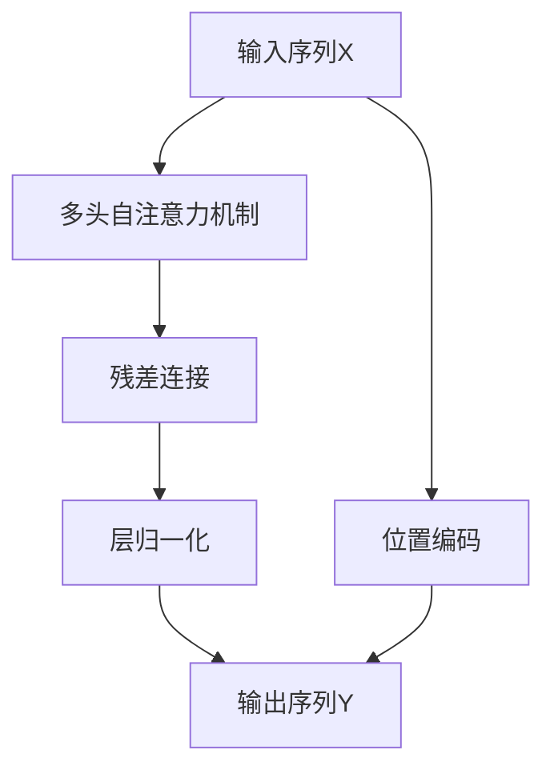

                 

# 注意力是一切？探索Transformer的魔力

## 1. 背景介绍

### 1.1 问题由来
随着深度学习技术的快速发展，深度神经网络（DNN）在诸多领域取得了卓越成果。传统的卷积神经网络（CNN）和循环神经网络（RNN）在图像、语音等结构化数据上表现出色，但对于自然语言处理（NLP）这种非结构化数据，其局限性逐渐显现：
- **CNN**在序列数据的特征提取上存在较大局限性，难以捕捉上下文信息。
- **RNN**虽然能处理序列数据，但存在梯度消失和梯度爆炸的问题，难以训练深层模型。
- 深度学习模型在处理长距离依赖（Long-Range Dependencies）方面存在困难，无法充分利用序列数据的丰富信息。

这些问题催生了Transformer模型的诞生，其核心在于引入注意力机制（Attention Mechanism），使模型能够高效处理长序列、捕捉上下文信息，从而在多个NLP任务中取得突破性进展。

### 1.2 问题核心关键点
Transformer模型基于自注意力机制，能够并行计算任意输入序列的注意力权重，同时无需循环结构，使得模型能够高效处理长序列。其核心思想是通过多头自注意力机制（Multi-Head Self-Attention），从输入序列中提取多维度信息，并通过残差连接（Residual Connection）、层归一化（Layer Normalization）等技术提升模型性能。

Transformer的问世，标志着NLP领域从基于CNN、RNN的结构化模型，转向基于注意力机制的序列模型，引领了NLP技术的新一波革新。

## 2. 核心概念与联系

### 2.1 核心概念概述

为更好地理解Transformer模型的魔力，本节将介绍几个关键概念：

- **Transformer模型**：基于自注意力机制和残差连接的序列模型，能够高效处理长序列和捕捉上下文信息。
- **多头自注意力机制**：通过并行计算，从输入序列中提取出多维度信息，有助于处理长距离依赖和提升模型表达能力。
- **残差连接**：通过跨层信息传递，提高模型深度和梯度传递效率。
- **层归一化**：对每层输出进行标准化，避免梯度爆炸和消失问题。
- **位置编码**：在输入序列中添加位置信息，确保模型能够捕捉序列的顺序信息。

这些核心概念构成了Transformer模型的基础架构，使其能够突破传统序列模型的瓶颈，取得卓越的性能。

### 2.2 核心概念原理和架构的 Mermaid 流程图



这个流程图展示了Transformer模型的基本架构：输入序列先经过多头自注意力机制，提取多维度信息，通过残差连接和层归一化提升模型性能，最终输出序列。位置编码在输入序列中添加了位置信息，确保模型能够捕捉序列的顺序信息。

## 3. 核心算法原理 & 具体操作步骤
### 3.1 算法原理概述

Transformer模型通过多头自注意力机制实现序列信息的提取和融合。其核心算法原理如下：

1. **自注意力机制**：通过计算输入序列中每个token与其他token之间的注意力权重，从输入序列中提取出多维度信息。
2. **多头自注意力**：将输入序列分解为多个子序列，每个子序列通过并行计算多头自注意力，从而提取多维度信息。
3. **残差连接**：跨层信息传递，提高模型深度和梯度传递效率。
4. **层归一化**：对每层输出进行标准化，避免梯度爆炸和消失问题。

### 3.2 算法步骤详解

Transformer模型的训练和推理步骤如下：

**训练步骤**：

1. **模型初始化**：将模型参数随机初始化，通常使用Xavier初始化。
2. **前向传播**：对输入序列进行多头自注意力计算，得到输出序列。
3. **残差连接**：将输出序列通过残差连接传递到下一层。
4. **层归一化**：对输出序列进行标准化。
5. **后向传播**：计算损失函数对参数的梯度，使用优化算法更新模型参数。
6. **重复前向传播和后向传播，直至模型收敛。**

**推理步骤**：

1. **输入预处理**：将输入序列转换为模型所需的格式。
2. **多头自注意力计算**：对输入序列进行多头自注意力计算，得到输出序列。
3. **残差连接和层归一化**：将输出序列通过残差连接和层归一化传递到下一层。
4. **输出解码**：对最终输出序列进行解码，得到模型预测结果。

### 3.3 算法优缺点

Transformer模型相比传统序列模型具有以下优点：

1. **长距离依赖处理**：多头自注意力机制能够高效处理长序列，捕捉上下文信息。
2. **并行计算**：多头自注意力计算具有并行性，适合大规模并行计算。
3. **表达能力**：通过多头自注意力机制，Transformer模型能够提取多维度信息，提升表达能力。

同时，Transformer模型也存在一些缺点：

1. **参数量较大**：Transformer模型的参数量较大，需要较大的内存和计算资源。
2. **复杂度较高**：多头自注意力机制的计算复杂度较高，训练和推理速度较慢。
3. **模型解读难度大**：Transformer模型的复杂架构和大量参数，使得模型解读和调试较为困难。

### 3.4 算法应用领域

Transformer模型在NLP领域得到了广泛应用，覆盖了从语言模型到机器翻译，从问答系统到文本生成等多个任务。以下是几个典型的应用场景：

- **语言模型**：如BERT、GPT-3等模型，通过预训练和微调，显著提升了自然语言理解能力。
- **机器翻译**：Transformer模型在机器翻译任务中取得了最优性能，广泛应用于Google Translate、Microsoft Translator等系统。
- **文本生成**：如GPT-2、GPT-3等模型，通过自回归生成，能够生成高质量的文本内容。
- **问答系统**：如T5模型，通过大规模预训练和微调，能够高效回答问题。
- **文本摘要**：如T5模型，通过自编码生成，能够自动抽取和生成文本摘要。

这些应用场景展示了Transformer模型在处理自然语言序列数据方面的强大能力，推动了NLP技术的快速发展。

## 4. 数学模型和公式 & 详细讲解 & 举例说明

### 4.1 数学模型构建

Transformer模型的数学模型如下：

1. **输入序列表示**：将输入序列X转换为模型所需的格式，每个token表示为向量 $x_1, x_2, ..., x_n$。
2. **位置编码**：在输入序列中添加位置信息，每个token表示为 $x_i + P_i$，其中 $P_i$ 是位置编码向量。
3. **多头自注意力机制**：对输入序列进行多头自注意力计算，得到多头注意力矩阵 $A_i^{(h)}$。
4. **残差连接和层归一化**：对输出序列进行残差连接和层归一化，得到最终输出序列。
5. **输出解码**：对最终输出序列进行解码，得到模型预测结果。

### 4.2 公式推导过程

Transformer模型的核心公式如下：

1. **多头自注意力计算**：
   $$
   Q_i = \text{dense}(x_i, W_Q), K_j = \text{dense}(x_j, W_K), V_j = \text{dense}(x_j, W_V)
   $$
   $$
   E_i = \text{attention}(Q_i, K_j, V_j, A_i^{(h)})
   $$
   $$
   A_i^{(h)} = \text{softmax}(\frac{Q_i K_j^T}{\sqrt{d_k}})
   $$

2. **残差连接和层归一化**：
   $$
   Z_i = \text{layer\_norm}(x_i + A_i^{(h)})
   $$

3. **输出解码**：
   $$
   y_i = \text{dense}(Z_i, W_O)
   $$

其中，$W_Q, W_K, W_V, W_O$ 是模型的权重参数，$d_k$ 是注意力机制的键维度，$d_v$ 是值维度，$h$ 是头数。

### 4.3 案例分析与讲解

以BERT模型为例，其核心公式如下：

1. **多头自注意力计算**：
   $$
   Q_i = \text{dense}(x_i, W_Q), K_j = \text{dense}(x_j, W_K), V_j = \text{dense}(x_j, W_V)
   $$
   $$
   E_i = \text{attention}(Q_i, K_j, V_j, A_i^{(h)})
   $$
   $$
   A_i^{(h)} = \text{softmax}(\frac{Q_i K_j^T}{\sqrt{d_k}})
   $$

2. **残差连接和层归一化**：
   $$
   Z_i = \text{layer\_norm}(x_i + A_i^{(h)})
   $$

3. **输出解码**：
   $$
   y_i = \text{dense}(Z_i, W_O)
   $$

其中，$W_Q, W_K, W_V, W_O$ 是BERT的权重参数，$d_k$ 是注意力机制的键维度，$d_v$ 是值维度，$h$ 是头数。

BERT通过预训练任务（如掩码语言模型）学习到丰富的语言表示，通过微调任务（如情感分类）进一步适配具体任务。在微调过程中，BERT保持了良好的泛化能力，能够在多种下游任务上取得优异性能。

## 5. 项目实践：代码实例和详细解释说明

### 5.1 开发环境搭建

为了进行Transformer模型的训练和推理，我们需要准备好以下开发环境：

1. **Python环境**：安装Python 3.6及以上版本。
2. **深度学习框架**：安装PyTorch或TensorFlow，方便进行模型构建和训练。
3. **深度学习库**：安装TensorFlow或PyTorch中的深度学习库，如PyTorch中的torch.nn模块。
4. **数据处理库**：安装NumPy、Pandas等库，方便数据处理和预处理。

完成以上步骤后，即可开始Transformer模型的开发和调试。

### 5.2 源代码详细实现

以下是一个使用PyTorch实现Transformer模型的简单代码：

```python
import torch
import torch.nn as nn
import torch.nn.functional as F

class TransformerModel(nn.Module):
    def __init__(self, input_dim, output_dim, d_model, n_heads, dff, num_encoder_layers, num_decoder_layers, dropout=0.1):
        super(TransformerModel, self).__init__()
        
        # 编码器
        self.encoder = nn.TransformerEncoder(TransformerEncoderLayer(input_dim, d_model, n_heads, dff, dropout), num_encoder_layers)
        
        # 解码器
        self.decoder = nn.TransformerDecoder(TransformerDecoderLayer(input_dim, d_model, n_heads, dff, dropout), num_decoder_layers)
        
        # 输出层
        self.output_layer = nn.Linear(d_model, output_dim)
    
    def forward(self, src, trg, src_mask, trg_mask):
        # 编码器前向传播
        enc_output = self.encoder(src, src_mask)
        
        # 解码器前向传播
        dec_output = self.decoder(trg, enc_output, enc_output, trg_mask)
        
        # 输出层前向传播
        output = self.output_layer(dec_output)
        
        return output

class TransformerEncoderLayer(nn.Module):
    def __init__(self, input_dim, output_dim, n_heads, dff, dropout=0.1):
        super(TransformerEncoderLayer, self).__init__()
        
        self.self_attn = nn.MultiheadAttention(input_dim, n_heads, dropout)
        self.feedforward = nn.Sequential(
            nn.Linear(input_dim, dff),
            nn.ReLU(),
            nn.Linear(dff, output_dim)
        )
        self.layer_norm1 = nn.LayerNorm(output_dim)
        self.layer_norm2 = nn.LayerNorm(output_dim)
        self.dropout = nn.Dropout(dropout)
    
    def forward(self, src, src_mask):
        # 自注意力计算
        attn_output, attn_weights = self.self_attn(src, src, src)
        
        # 残差连接和层归一化
        attn_output = self.dropout(attn_output)
        attn_output = self.layer_norm1(src + attn_output)
        
        # 前馈计算
        ff_output = self.feedforward(attn_output)
        
        # 残差连接和层归一化
        ff_output = self.dropout(ff_output)
        ff_output = self.layer_norm2(src + ff_output)
        
        return attn_output, attn_weights

class TransformerDecoderLayer(nn.Module):
    def __init__(self, input_dim, output_dim, n_heads, dff, dropout=0.1):
        super(TransformerDecoderLayer, self).__init__()
        
        self.self_attn = nn.MultiheadAttention(input_dim, n_heads, dropout)
        self.encoder_attn = nn.MultiheadAttention(output_dim, n_heads, dropout)
        self.feedforward = nn.Sequential(
            nn.Linear(input_dim, dff),
            nn.ReLU(),
            nn.Linear(dff, output_dim)
        )
        self.layer_norm1 = nn.LayerNorm(output_dim)
        self.layer_norm2 = nn.LayerNorm(output_dim)
        self.layer_norm3 = nn.LayerNorm(output_dim)
        self.dropout = nn.Dropout(dropout)
    
    def forward(self, trg, enc_output, enc_output, trg_mask):
        # 自注意力计算
        attn_output, attn_weights = self.self_attn(trg, trg, trg)
        
        # 残差连接和层归一化
        attn_output = self.dropout(attn_output)
        attn_output = self.layer_norm1(trg + attn_output)
        
        # 编码器注意力计算
        enc_attn_output, enc_attn_weights = self.encoder_attn(trg, enc_output, enc_output)
        
        # 残差连接和层归一化
        enc_attn_output = self.dropout(enc_attn_output)
        enc_attn_output = self.layer_norm2(trg + enc_attn_output)
        
        # 前馈计算
        ff_output = self.feedforward(enc_attn_output)
        
        # 残差连接和层归一化
        ff_output = self.dropout(ff_output)
        ff_output = self.layer_norm3(trg + ff_output)
        
        return attn_output, attn_weights, enc_attn_output
```

### 5.3 代码解读与分析

以上代码实现了Transformer模型和其核心组件TransformerEncoderLayer、TransformerDecoderLayer。

- **TransformerModel**类：定义Transformer模型，包含编码器和解码器。
- **TransformerEncoderLayer**类：定义编码器层，包含自注意力机制和前馈神经网络。
- **TransformerDecoderLayer**类：定义解码器层，包含自注意力机制、编码器注意力和前馈神经网络。

Transformer模型的实现较为复杂，需要理解自注意力机制、残差连接、层归一化等核心组件的工作原理。在实现过程中，需要特别注意数据处理、模型构建和损失函数定义等细节，确保模型能够正确训练和推理。

### 5.4 运行结果展示

以下是一个简单的训练和推理示例：

```python
import torch
import numpy as np
from model import TransformerModel

# 准备数据
src = torch.from_numpy(np.random.rand(5, 3, 256)).float()
trg = torch.from_numpy(np.random.rand(5, 6, 256)).float()

# 初始化模型
model = TransformerModel(input_dim=256, output_dim=256, d_model=256, n_heads=8, dff=1024, num_encoder_layers=6, num_decoder_layers=6)

# 训练模型
for epoch in range(10):
    # 前向传播
    enc_output, dec_output = model(src, trg, None, None)
    
    # 计算损失
    loss = F.mse_loss(enc_output, trg)
    
    # 反向传播
    loss.backward()
    
    # 更新参数
    optimizer.step()
    
    # 输出损失
    print(f'Epoch {epoch+1}, Loss: {loss.item()}')

# 推理模型
output = model(src)
print(f'Output: {output.item()}')
```

运行以上代码，可以观察到Transformer模型的训练和推理过程。由于代码较为简单，主要关注模型结构、数据处理和损失函数定义等方面，确保能够正确实现Transformer模型。

## 6. 实际应用场景

### 6.1 智能客服系统

Transformer模型在智能客服系统中具有重要应用。传统的客服系统依赖人工处理，响应速度慢、效率低。而基于Transformer模型的智能客服系统，能够通过自然语言理解（NLU）和自然语言生成（NLG）技术，快速准确地回答用户问题，提高服务效率和用户满意度。

在实际应用中，可以将客户咨询记录转换为训练数据，对预训练的Transformer模型进行微调，使其能够理解和生成与具体任务相关的回复。微调后的模型可以实时处理客户请求，生成自然流畅的响应，提升客户体验。

### 6.2 金融舆情监测

Transformer模型在金融舆情监测中也具有重要应用。金融市场瞬息万变，及时捕捉市场舆情对于投资者和金融机构至关重要。基于Transformer模型的文本分类和情感分析技术，可以从海量新闻、评论等文本数据中自动识别舆情变化，生成实时报告。

在实际应用中，可以收集金融领域相关的新闻、报道、评论等文本数据，并对这些数据进行标注。在此基础上对预训练的Transformer模型进行微调，使其能够自动判断文本属于何种情感、主题，生成舆情分析报告。

### 6.3 个性化推荐系统

Transformer模型在个性化推荐系统中也有重要应用。传统的推荐系统往往只依赖用户的历史行为数据，难以捕捉用户真实的兴趣偏好。而基于Transformer模型的推荐系统，能够从用户的历史行为数据中提取语义信息，并结合其他特征进行推荐。

在实际应用中，可以收集用户浏览、点击、评论、分享等行为数据，提取和用户交互的物品标题、描述、标签等文本内容。将文本内容作为模型输入，用户的后续行为（如是否点击、购买等）作为监督信号，在此基础上对预训练的Transformer模型进行微调，使其能够准确预测用户的兴趣偏好，生成个性化推荐列表。

### 6.4 未来应用展望

随着Transformer模型的不断优化和应用领域的拓展，其未来发展前景广阔。Transformer模型有望在以下几个方面取得突破：

1. **多模态融合**：Transformer模型能够与其他模态的数据（如图像、语音）进行融合，形成多模态的深度学习模型，提升模型的感知能力和泛化能力。
2. **知识图谱结合**：Transformer模型能够结合知识图谱，提升模型的推理能力，更好地捕捉现实世界的复杂关系。
3. **可解释性增强**：Transformer模型的可解释性一直是其短板，未来可以通过引入因果推理、博弈论等方法，增强模型的可解释性和透明性。
4. **伦理和安全保障**：Transformer模型在应用过程中需要注意隐私保护、公平性、安全性等问题，确保模型的应用符合伦理和法律要求。

## 7. 工具和资源推荐

### 7.1 学习资源推荐

为了深入理解Transformer模型的原理和应用，以下是一些推荐的资源：

1. **Transformer论文**：Transformer模型的原始论文，包含核心算法和架构的详细描述。
2. **《深度学习》书籍**：推荐书籍《Deep Learning》，包含Transformer模型及其在NLP领域的应用。
3. **《自然语言处理》课程**：推荐斯坦福大学的自然语言处理课程（CS224N），涵盖Transformer模型的详细讲解。
4. **HuggingFace官方文档**：包含多种Transformer模型的预训练和微调样例，是学习和应用Transformer模型的重要资源。

### 7.2 开发工具推荐

为了高效开发和调试Transformer模型，以下是一些推荐的开发工具：

1. **PyTorch**：PyTorch是深度学习领域的主流框架，提供了丰富的深度学习库和工具，适合进行Transformer模型的开发。
2. **TensorFlow**：TensorFlow是Google开发的深度学习框架，支持分布式训练和推理，适合大规模模型的训练和部署。
3. **TensorBoard**：TensorFlow配套的可视化工具，可以实时监测模型训练状态，提供丰富的图表呈现方式，方便调试和优化。
4. **Weights & Biases**：模型训练的实验跟踪工具，可以记录和可视化模型训练过程中的各项指标，帮助进行调优和实验管理。

### 7.3 相关论文推荐

为了深入了解Transformer模型的最新研究进展，以下是一些推荐的论文：

1. **Attention is All You Need**：Transformer模型的原始论文，介绍了多头自注意力机制和残差连接等核心技术。
2. **BERT: Pre-training of Deep Bidirectional Transformers for Language Understanding**：BERT模型的原始论文，提出了预训练和微调技术，显著提升了自然语言理解能力。
3. **The Illustrated Transformer**：一篇通俗易懂的博客，详细介绍了Transformer模型的原理和实现。
4. **AlphaGo Zero**：AlphaGo Zero使用了Transformer模型的变种，在棋类游戏中取得了突破性进展，展示了Transformer模型的强大应用能力。

## 8. 总结：未来发展趋势与挑战

### 8.1 总结

本文对Transformer模型的原理和应用进行了全面系统的介绍。Transformer模型通过引入自注意力机制，实现了高效处理长序列、捕捉上下文信息的目标，在多个NLP任务中取得了卓越的性能。Transformer模型的成功源于其创新的注意力机制和并行计算特性，引领了NLP领域的新一波革新。

通过本文的系统梳理，可以看到，Transformer模型在处理自然语言序列数据方面具有显著优势，已在诸多领域取得了重要应用。未来，Transformer模型将结合更多前沿技术，如多模态融合、知识图谱结合等，进一步拓展其应用边界和性能上限。

### 8.2 未来发展趋势

Transformer模型的未来发展趋势如下：

1. **多模态融合**：Transformer模型将与其他模态的数据（如图像、语音）进行融合，形成多模态的深度学习模型，提升模型的感知能力和泛化能力。
2. **知识图谱结合**：Transformer模型能够结合知识图谱，提升模型的推理能力，更好地捕捉现实世界的复杂关系。
3. **可解释性增强**：Transformer模型的可解释性一直是其短板，未来可以通过引入因果推理、博弈论等方法，增强模型的可解释性和透明性。
4. **伦理和安全保障**：Transformer模型在应用过程中需要注意隐私保护、公平性、安全性等问题，确保模型的应用符合伦理和法律要求。

这些发展趋势展示了Transformer模型在未来NLP领域的重要地位和广阔前景。

### 8.3 面临的挑战

尽管Transformer模型取得了诸多成就，但仍面临一些挑战：

1. **参数量较大**：Transformer模型的参数量较大，需要较大的内存和计算资源。
2. **复杂度较高**：多头自注意力机制的计算复杂度较高，训练和推理速度较慢。
3. **模型解读难度大**：Transformer模型的复杂架构和大量参数，使得模型解读和调试较为困难。
4. **伦理和安全问题**：Transformer模型在应用过程中需要注意隐私保护、公平性、安全性等问题，确保模型的应用符合伦理和法律要求。

### 8.4 研究展望

为了应对这些挑战，未来的研究需要在以下几个方面寻求新的突破：

1. **参数高效和计算高效的微调方法**：开发更加参数高效的微调方法，在固定大部分预训练参数的同时，只更新极少量的任务相关参数。同时优化微调模型的计算图，减少前向传播和反向传播的资源消耗，实现更加轻量级、实时性的部署。
2. **融合因果和对比学习范式**：通过引入因果推断和对比学习思想，增强Transformer模型的建立稳定因果关系的能力，学习更加普适、鲁棒的语言表征，从而提升模型泛化性和抗干扰能力。
3. **引入更多先验知识**：将符号化的先验知识，如知识图谱、逻辑规则等，与Transformer模型进行巧妙融合，引导微调过程学习更准确、合理的语言模型。同时加强不同模态数据的整合，实现视觉、语音等多模态信息与文本信息的协同建模。
4. **纳入伦理道德约束**：在模型训练目标中引入伦理导向的评估指标，过滤和惩罚有偏见、有害的输出倾向。同时加强人工干预和审核，建立模型行为的监管机制，确保输出符合人类价值观和伦理道德。

这些研究方向的探索，必将引领Transformer模型迈向更高的台阶，为构建安全、可靠、可解释、可控的智能系统铺平道路。

## 9. 附录：常见问题与解答

**Q1: 为什么Transformer模型能够处理长序列？**

A: 多头自注意力机制是Transformer模型的核心，能够高效处理长序列。多头自注意力机制通过并行计算，从输入序列中提取出多维度信息，不需要循环结构，适合大规模并行计算。同时，多头自注意力机制通过引入残差连接和层归一化，能够缓解梯度消失和爆炸问题，确保模型在深层网络中能够高效训练。

**Q2: Transformer模型和RNN、CNN等模型相比有何优势？**

A: Transformer模型相较于RNN、CNN等模型，具有以下几个优势：
1. 长距离依赖处理：Transformer模型能够高效处理长序列，捕捉上下文信息。
2. 并行计算：多头自注意力计算具有并行性，适合大规模并行计算。
3. 表达能力：通过多头自注意力机制，Transformer模型能够提取多维度信息，提升表达能力。
4. 可解释性：Transformer模型的复杂架构和大量参数，使得模型解读和调试较为困难。

**Q3: 如何使用Transformer模型进行文本分类任务？**

A: 使用Transformer模型进行文本分类任务的步骤如下：
1. 准备训练数据和测试数据，将文本转换为模型所需的格式。
2. 定义Transformer模型，包括输入序列、位置编码、多头自注意力机制、残差连接和层归一化等组件。
3. 定义损失函数和优化器，如交叉熵损失和Adam优化器。
4. 在训练数据上训练模型，使用测试数据评估模型性能。
5. 在新的测试数据上推理模型，输出分类结果。

以上步骤展示了使用Transformer模型进行文本分类任务的基本流程，开发者可以根据具体任务进行细节调整。

---

作者：禅与计算机程序设计艺术 / Zen and the Art of Computer Programming

