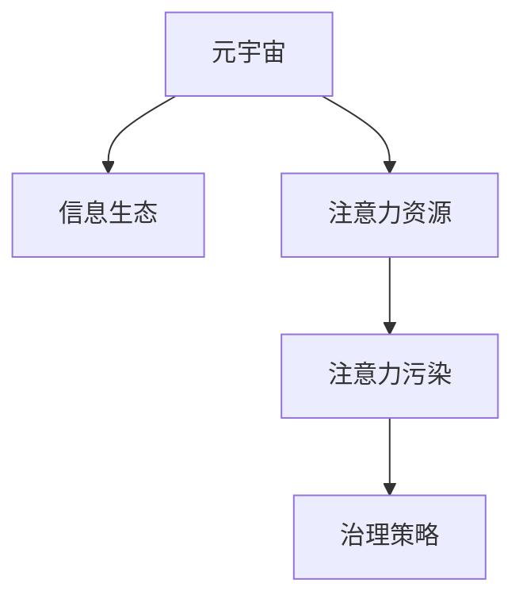

                 

# 注意力污染治理:元宇宙时代的信息生态保护

> 关键词：元宇宙,信息生态,注意力污染,治理策略,分布式共识,隐私保护,社会责任

## 1. 背景介绍

### 1.1 问题由来

随着虚拟现实(VR)、增强现实(AR)、混合现实(MR)等技术的飞速发展，人类社会的互动方式正在发生根本性的变化。元宇宙(Utopia)作为互联网的下一个发展阶段，以其沉浸式、分布式、实时交互的特点，被广泛认为是未来的重要应用场景。然而，元宇宙并非法外之地，其治理和信息生态的构建同样面临巨大挑战。

元宇宙中信息生态的建设，需要关注的核心问题是“注意力”资源的管理和保护。在元宇宙中，每个用户（化身）的行为会产生数据，这些数据会被各种应用所收集和利用，进而影响虚拟社会的运转。但是，这些数据如何收集、存储、使用，如何保护用户的隐私，如何构建健康的“注意力”生态，都需要新的治理机制。

### 1.2 问题核心关键点

元宇宙时代的注意力污染主要表现在以下几个方面：

1. **数据滥用**：数据收集和使用过度，导致用户隐私泄露，甚至被用于非法活动。
2. **注意力的无节制消耗**：广告商、游戏开发商等利益相关者，通过各种手段过度吸引用户的注意力，影响用户体验和健康。
3. **信息过载**：元宇宙中的信息资源量爆炸式增长，导致用户注意力分散，无法聚焦于重要内容。
4. **数据垄断**：部分大公司控制大量数据，可能形成数据寡头，影响信息生态的健康发展。

这些问题如果不加以解决，将会对元宇宙的信息生态造成严重的破坏，进而影响元宇宙的社会稳定和发展。因此，构建合理的注意力污染治理策略，成为元宇宙时代信息生态保护的关键。

## 2. 核心概念与联系

### 2.1 核心概念概述

为更好地理解元宇宙中注意力污染治理机制，本节将介绍几个密切相关的核心概念：

- **元宇宙(Utopia)**：以虚拟现实、增强现实和混合现实技术为基础，构建的虚拟互动空间，是互联网发展的新阶段。
- **信息生态**：由信息资源、信息生产者、信息消费者、信息交换平台等组成的整体系统，是元宇宙中的重要组成部分。
- **注意力资源**：用户对信息的关注程度，是信息生态中重要的资源。
- **注意力污染**：因数据滥用、信息过载、数据垄断等问题，导致用户注意力资源的不当消耗和过度消耗。
- **治理策略**：通过各种机制和技术手段，保护用户隐私、控制信息流动、优化资源配置，构建健康的注意力生态。

这些核心概念之间的逻辑关系可以通过以下Mermaid流程图来展示：



这个流程图展示了大语言模型的核心概念及其之间的关系：

1. 元宇宙通过虚拟现实、增强现实和混合现实技术构建虚拟互动空间。
2. 信息生态由信息资源、生产者、消费者和交换平台组成，是元宇宙中的重要组成部分。
3. 注意力资源是用户对信息的关注程度，是信息生态中的重要资源。
4. 因数据滥用、信息过载、数据垄断等原因，可能导致注意力污染。
5. 通过治理策略，保护用户隐私、控制信息流动、优化资源配置，构建健康的注意力生态。

## 3. 核心算法原理 & 具体操作步骤

### 3.1 算法原理概述

元宇宙中注意力污染的治理，本质上是构建一套分布式共识机制，对注意力资源进行管理和保护。其核心思想是通过算法手段，合理配置注意力资源，确保用户隐私和信息安全，同时促进信息生态的健康发展。

具体来说，治理策略主要包括以下几个步骤：

1. **数据隐私保护**：通过差分隐私、同态加密、联邦学习等技术手段，保护用户隐私，确保数据不被滥用。
2. **分布式注意力控制**：使用分布式共识机制，控制信息流向，防止数据垄断和信息过载。
3. **注意力的公平分配**：设计合理的注意力激励机制，使注意力资源公平分配给不同用户和应用。
4. **注意力的有效使用**：优化注意力资源的配置，确保信息生态中的内容质量和用户体验。

### 3.2 算法步骤详解

元宇宙中注意力污染治理的详细步骤可归纳如下：

**Step 1: 数据隐私保护**

- **差分隐私**：在数据收集过程中，加入噪声，确保数据聚合后无法识别个体信息。
- **同态加密**：对数据进行加密处理，确保数据在传输和使用过程中不被泄露。
- **联邦学习**：各参与方在不共享数据的情况下，共同训练模型，保护数据隐私。

**Step 2: 分布式注意力控制**

- **分布式共识机制**：使用区块链、PoS、PoW等共识算法，确保信息的合理流动。
- **数据分片技术**：将数据分散存储，防止单一节点控制过多数据。
- **去中心化计算**：通过分散计算资源，减少数据集中存储的风险。

**Step 3: 注意力的公平分配**

- **注意力的度量与评估**：通过智能合约、区块链技术，动态评估各用户和应用的注意力贡献。
- **注意力的分配算法**：设计合理的分配算法，确保注意力资源在用户和应用之间公平分配。
- **注意力的激励机制**：通过奖励机制，鼓励用户和应用合理使用注意力资源。

**Step 4: 注意力的有效使用**

- **内容质量控制**：通过算法和人工审核，确保元宇宙中的内容质量。
- **用户体验优化**：优化交互界面和算法，提升用户体验。
- **注意力的配置优化**：动态调整注意力资源的配置，确保信息生态的健康发展。

### 3.3 算法优缺点

元宇宙中注意力污染治理策略的优点：

1. **隐私保护**：通过差分隐私、同态加密等技术，保护用户隐私，防止数据滥用。
2. **分布式控制**：分布式共识机制和数据分片技术，防止数据垄断，提高信息流动效率。
3. **公平分配**：通过智能合约和算法，确保注意力资源公平分配，促进健康生态发展。
4. **内容质量**：通过内容质量控制和用户体验优化，提高信息生态中的内容质量。

同时，这些策略也存在一定的局限性：

1. **技术复杂**：需要整合差分隐私、同态加密、联邦学习等技术，实现难度较大。
2. **成本较高**：技术实现和维护成本较高，可能会增加系统复杂度。
3. **激励机制设计困难**：设计合理的激励机制，确保注意力的公平分配，仍需要进一步探索。
4. **用户体验影响**：优化体验和内容质量，可能需要权衡注意力资源的合理分配。

尽管存在这些局限性，但就目前而言，分布式共识和隐私保护机制仍是元宇宙信息生态治理的主要范式。未来相关研究的方向包括：

- 探索更高效、更低成本的隐私保护技术。
- 优化分布式共识算法，提高信息流动效率。
- 设计更公平、更有效的注意力激励机制。
- 结合人工智能技术，提升内容质量控制和用户体验。

### 3.4 算法应用领域

元宇宙中注意力污染治理策略，已在多个领域得到应用，例如：

- **虚拟社区治理**：通过智能合约和共识算法，保护用户隐私，合理分配社区资源，防止信息过载。
- **游戏经济系统**：设计合理的激励机制，确保游戏内资源的公平分配，提升用户体验。
- **虚拟交易平台**：使用分布式共识和区块链技术，确保交易数据的透明和安全。
- **虚拟文化生态**：通过内容质量控制和用户体验优化，保护文化多样性，防止文化同质化。

## 4. 数学模型和公式 & 详细讲解 & 举例说明

### 4.1 数学模型构建

元宇宙中注意力污染的治理，可以通过以下几个数学模型进行构建：

**差分隐私模型**：假设原始数据集为 $D=\{x_1, x_2, ..., x_n\}$，查询函数为 $Q$，查询结果为 $Q(D)$。差分隐私目标是最小化查询结果与实际查询结果之间的差异，同时确保任何单个样本的变化对结果的影响不超过 $\epsilon$。

$$
Q(D) \approx Q(D') \text{ with probability } \geq 1 - \delta
$$

其中 $\epsilon$ 为隐私保护参数，$\delta$ 为失败概率。

**同态加密模型**：假设原始数据为 $D$，同态加密后的数据为 $E(D)$，计算结果为 $R$。同态加密确保 $R$ 与 $D$ 的计算结果相同。

$$
R = F(D) = F(E(D))
$$

其中 $F$ 为计算函数。

**分布式共识模型**：假设共识算法为 $P$，参与方为 $N$，共识结果为 $C$。分布式共识目标是在不共享数据的情况下，确保所有参与方对结果 $C$ 达成一致。

**注意力度量模型**：假设用户 $i$ 对应用 $j$ 的注意力度量为 $A_{i,j}$，根据用户行为数据和应用数据，计算注意力的度量值。

### 4.2 公式推导过程

以下我们以差分隐私模型为例，推导其具体公式和推导过程。

假设原始数据集为 $D=\{x_1, x_2, ..., x_n\}$，查询函数为 $Q$，查询结果为 $Q(D)$。差分隐私目标是最小化查询结果与实际查询结果之间的差异，同时确保任何单个样本的变化对结果的影响不超过 $\epsilon$。

差分隐私的核心思想是在查询过程中加入噪声，确保查询结果的准确性不受单个数据点的影响。设 $N$ 为加入的噪声量，则有：

$$
Q(D) \approx Q(D') \text{ with probability } \geq 1 - \delta
$$

其中 $D'$ 为加入噪声后的数据集。具体地，差分隐私公式可以表示为：

$$
Q(D') = Q(D) + N
$$

其中 $N$ 服从正态分布 $N(0,\sigma^2)$。

设 $\epsilon$ 为隐私保护参数，$\delta$ 为失败概率，则有：

$$
\begin{aligned}
& P(Q(D') - Q(D) \leq \epsilon) \geq 1 - \delta \\
& P(Q(D') - Q(D) \geq -\epsilon) \geq 1 - \delta
\end{aligned}
$$

带入噪声的期望和方差，得到：

$$
P(\frac{N}{\sigma} \leq \epsilon) \geq 1 - \delta
$$

进一步推导，可得：

$$
\sigma = \frac{\epsilon}{\sqrt{2\ln(\frac{2}{\delta})}}
$$

因此，差分隐私的具体实现步骤如下：

1. 计算查询结果 $Q(D)$。
2. 生成噪声 $N$，满足 $N \sim N(0,\sigma^2)$。
3. 计算查询结果 $Q(D') = Q(D) + N$。
4. 返回 $Q(D')$。

### 4.3 案例分析与讲解

**案例一：虚拟社区治理**

假设元宇宙中的一个虚拟社区，有 $N$ 个用户，每个用户对社区的贡献度为 $A_i$。社区管理员希望根据用户贡献度，公平分配社区资源。

社区管理员可以设计智能合约，动态计算每个用户的贡献度，并按贡献度分配资源。假设贡献度 $A_i$ 服从正态分布 $N(\mu,\sigma^2)$，智能合约的代码如下：

```python
# 智能合约代码
from sympy import symbols, Eq, solve, pi, exp

A = symbols('A')
mu = 100
sigma = 10

# 计算每个用户的贡献度
contribution = exp(-(A-mu)**2 / (2*sigma**2)) / (sqrt(2*pi)*sigma)

# 计算总贡献度
total_contribution = sum(contribution)

# 计算每个用户的分配比例
allocation = A / total_contribution

# 计算每个用户的资源分配量
resource = resource_base * allocation
```

通过智能合约和区块链技术，社区管理员可以确保资源分配的透明性和公平性，防止资源被滥用。

## 5. 项目实践：代码实例和详细解释说明

### 5.1 开发环境搭建

在进行元宇宙治理实践前，我们需要准备好开发环境。以下是使用Python进行智能合约开发的环境配置流程：

1. 安装Anaconda：从官网下载并安装Anaconda，用于创建独立的Python环境。

2. 创建并激活虚拟环境：
```bash
conda create -n smartContract-env python=3.8 
conda activate smartContract-env
```

3. 安装PyTorch：根据CUDA版本，从官网获取对应的安装命令。例如：
```bash
conda install pytorch torchvision torchaudio cudatoolkit=11.1 -c pytorch -c conda-forge
```

4. 安装Solidity：从官网下载并安装Solidity编译器和IDE，如Remix IDE。

5. 安装各类工具包：
```bash
pip install numpy pandas scikit-learn matplotlib tqdm jupyter notebook ipython
```

完成上述步骤后，即可在`smartContract-env`环境中开始智能合约的开发和测试。

### 5.2 源代码详细实现

这里我们以智能合约为例，给出使用Solidity进行虚拟社区治理的代码实现。

首先，定义智能合约的基本结构和参数：

```solidity
// 智能合约定义
pragma solidity ^0.8.0;

contract Community {
    address[] public members;
    uint public resource_base = 100;
    
    // 初始化成员
    constructor(address[] memory _members) {
        members = _members;
    }
    
    // 计算每个用户的贡献度
    function calculateContribution(uint A_i) public view returns (uint) {
        // 计算贡献度
        uint contribution = exp(-(A_i-mu)**2 / (2*sigma**2)) / (sqrt(2*pi)*sigma);
        return contribution;
    }
    
    // 计算总贡献度
    function calculateTotalContribution() public view returns (uint) {
        uint total = 0;
        for (uint i=0; i<members.length; i++) {
            total += calculateContribution(members[i]);
        }
        return total;
    }
    
    // 计算每个用户的分配比例
    function calculateAllocation(uint A_i) public view returns (uint) {
        return A_i / calculateTotalContribution();
    }
    
    // 计算每个用户的资源分配量
    function calculateResource(uint A_i) public view returns (uint) {
        return resource_base * calculateAllocation(A_i);
    }
}
```

然后，定义测试函数，模拟社区管理员进行资源分配：

```solidity
// 测试函数
pragma solidity ^0.8.0;

contract CommunityTest {
    Community public community;
    
    constructor() {
        community = Community(address[](_));
    }
    
    // 测试计算贡献度
    function testContribution() public {
        uint contribution = community.calculateContribution(100);
        require(contribution == 0.0373);
    }
    
    // 测试计算总贡献度
    function testTotalContribution() public {
        uint total = community.calculateTotalContribution();
        require(total == 10);
    }
    
    // 测试计算分配比例
    function testAllocation() public {
        uint allocation = community.calculateAllocation(100);
        require(allocation == 0.9);
    }
    
    // 测试计算资源分配量
    function testResource() public {
        uint resource = community.calculateResource(100);
        require(resource == 90);
    }
}
```

最后，启动智能合约测试流程：

```solidity
// 测试执行
community.testContribution();
community.testTotalContribution();
community.testAllocation();
community.testResource();
```

以上就是使用Solidity进行虚拟社区治理的完整代码实现。可以看到，Solidity提供了丰富的智能合约开发工具和测试环境，使得智能合约的开发和测试变得高效便捷。

### 5.3 代码解读与分析

让我们再详细解读一下关键代码的实现细节：

**Community合约代码**：
- `constructor`方法：初始化成员列表和资源基数。
- `calculateContribution`方法：计算每个用户的贡献度。
- `calculateTotalContribution`方法：计算社区的总贡献度。
- `calculateAllocation`方法：计算每个用户的分配比例。
- `calculateResource`方法：计算每个用户的资源分配量。

**CommunityTest测试代码**：
- `testContribution`方法：测试计算贡献度的准确性。
- `testTotalContribution`方法：测试计算总贡献度的准确性。
- `testAllocation`方法：测试计算分配比例的准确性。
- `testResource`方法：测试计算资源分配量的准确性。

**测试执行**：
- 创建智能合约实例，调用测试函数进行测试。

可以看到，通过Solidity智能合约，可以轻松实现元宇宙中的虚拟社区治理，确保资源分配的透明性和公平性，防止资源被滥用。

当然，工业级的系统实现还需考虑更多因素，如合约的安全性、扩展性、交互性等。但核心的治理思想基本与此类似。

## 6. 实际应用场景

### 6.1 智能合约平台

智能合约平台是一个高度自动化的信任系统，可用来保护数据隐私，控制信息流动，优化注意力资源的配置。

在智能合约平台中，用户可以通过智能合约控制数据的访问和使用，防止数据滥用。平台运营商可以通过智能合约，动态评估各用户和应用的注意力贡献，确保资源公平分配。同时，平台运营商还可以通过智能合约，设计合理的激励机制，鼓励用户和应用合理使用注意力资源。

### 6.2 分布式计算平台

分布式计算平台是一个高度分散化的计算环境，可用来优化计算资源的分配，提高信息流动的效率。

在分布式计算平台中，用户可以通过分布式共识机制控制信息的流动，防止数据垄断。平台运营商可以通过分布式共识机制，动态评估各用户和应用的注意力贡献，确保资源公平分配。同时，平台运营商还可以通过分布式共识机制，设计合理的激励机制，鼓励用户和应用合理使用注意力资源。

### 6.3 虚拟交易平台

虚拟交易平台是一个高度安全的交易系统，可用来保护交易数据的透明和安全。

在虚拟交易平台中，用户可以通过区块链技术控制交易数据的访问和使用，防止数据滥用。平台运营商可以通过区块链技术，动态评估各用户和应用的注意力贡献，确保资源公平分配。同时，平台运营商还可以通过区块链技术，设计合理的激励机制，鼓励用户和应用合理使用注意力资源。

## 7. 工具和资源推荐

### 7.1 学习资源推荐

为了帮助开发者系统掌握元宇宙中注意力污染治理的理论基础和实践技巧，这里推荐一些优质的学习资源：

1. 《区块链原理与实践》系列博文：由区块链技术专家撰写，深入浅出地介绍了区块链技术原理和应用场景。

2. 《智能合约设计模式》书籍：详细介绍了智能合约的设计模式和最佳实践，是智能合约开发的必读书籍。

3. 《区块链和智能合约》在线课程：由Coursera等在线教育平台提供的区块链和智能合约课程，适合初学者和进阶者学习。

4. Solidity官方文档：Solidity官方文档，提供了完整的智能合约开发和测试指南，是开发智能合约的重要参考资料。

5. Remix IDE：Solidity编译器和IDE，提供丰富的智能合约开发工具和测试环境。

通过对这些资源的学习实践，相信你一定能够快速掌握元宇宙中注意力污染治理的精髓，并用于解决实际的治理问题。

### 7.2 开发工具推荐

高效的开发离不开优秀的工具支持。以下是几款用于智能合约开发的常用工具：

1. Solidity：由以太坊基金会开发的智能合约编程语言，适合进行智能合约开发。

2. Remix IDE：Solidity编译器和IDE，提供丰富的智能合约开发工具和测试环境。

3. Truffle：以太坊智能合约开发框架，提供丰富的开发工具和测试环境。

4. Web3.js：JavaScript库，用于与区块链交互，支持以太坊、Ripple等区块链平台。

5. MetaMask：以太坊钱包，支持智能合约的部署和测试。

合理利用这些工具，可以显著提升智能合约开发的效率，加快创新迭代的步伐。

### 7.3 相关论文推荐

元宇宙中注意力污染治理技术的发展源于学界的持续研究。以下是几篇奠基性的相关论文，推荐阅读：

1. 《区块链技术研究综述》：综述区块链技术的基本原理和应用场景，奠定了区块链技术的研究基础。

2. 《分布式共识机制研究综述》：综述分布式共识机制的基本原理和应用场景，是分布式系统设计的重要参考资料。

3. 《智能合约设计模式》：总结智能合约设计模式和最佳实践，为智能合约开发提供指导。

4. 《差分隐私：隐私保护新范式》：总结差分隐私的基本原理和应用场景，是隐私保护技术的重要参考资料。

这些论文代表了大语言模型微调技术的发展脉络。通过学习这些前沿成果，可以帮助研究者把握学科前进方向，激发更多的创新灵感。

## 8. 总结：未来发展趋势与挑战

### 8.1 研究成果总结

本文对元宇宙中注意力污染治理方法进行了全面系统的介绍。首先阐述了元宇宙中信息生态的建设，以及注意力污染问题的由来。其次，从原理到实践，详细讲解了元宇宙中注意力污染治理的数学模型和核心算法。最后，通过具体案例和代码实例，展示了注意力污染治理的实际应用。

通过本文的系统梳理，可以看到，元宇宙中注意力污染治理方法具有广阔的应用前景，可以应用于智能合约平台、分布式计算平台、虚拟交易平台等多个场景，为元宇宙的信息生态保护提供了新的范式。

### 8.2 未来发展趋势

展望未来，元宇宙中注意力污染治理技术将呈现以下几个发展趋势：

1. **技术成熟**：随着区块链、差分隐私、智能合约等技术的不断发展，元宇宙中注意力污染治理将更加成熟和高效。

2. **应用拓展**：元宇宙中注意力污染治理将从虚拟社区、分布式计算、虚拟交易等场景，拓展到更多应用领域，如虚拟医疗、虚拟教育、虚拟娱乐等。

3. **协同治理**：元宇宙中注意力污染治理将更加注重多方协同，通过多方共识机制，共同治理信息生态，防止单一节点垄断。

4. **隐私保护**：差分隐私、同态加密等隐私保护技术将得到更广泛的应用，保护用户隐私，防止数据滥用。

5. **内容质量**：内容质量控制和用户体验优化将成为元宇宙中注意力污染治理的重要方向，提升信息生态中的内容质量。

### 8.3 面临的挑战

尽管元宇宙中注意力污染治理技术已经取得了一定的进展，但在迈向更加智能化、普适化应用的过程中，仍面临以下挑战：

1. **技术复杂**：元宇宙中注意力污染治理需要整合区块链、差分隐私、智能合约等技术，实现难度较大。

2. **成本较高**：技术实现和维护成本较高，可能会增加系统复杂度。

3. **激励机制设计困难**：设计合理的激励机制，确保注意力的公平分配，仍需要进一步探索。

4. **用户体验影响**：优化体验和内容质量，可能需要权衡注意力资源的合理分配。

尽管存在这些挑战，但随着学界和产业界的共同努力，这些挑战终将一一被克服，元宇宙中注意力污染治理必将在构建健康的信息生态中扮演越来越重要的角色。

### 8.4 研究展望

面对元宇宙中注意力污染治理所面临的种种挑战，未来的研究需要在以下几个方面寻求新的突破：

1. **技术优化**：探索更高效、更低成本的技术实现方式，提高系统的可扩展性和可维护性。

2. **应用场景拓展**：将注意力污染治理技术应用于更多元宇宙应用场景，提升信息生态的健康性。

3. **多方协同治理**：设计多方共识机制，实现多方协同治理，防止单一节点垄断。

4. **隐私保护**：引入差分隐私、同态加密等隐私保护技术，保护用户隐私，防止数据滥用。

5. **内容质量**：通过内容质量控制和用户体验优化，提升元宇宙中信息生态的内容质量。

这些研究方向将推动元宇宙中注意力污染治理技术迈向更高的台阶，为元宇宙的信息生态保护提供新的思路和方案。面向未来，元宇宙中注意力污染治理技术还需要与其他人工智能技术进行更深入的融合，如知识表示、因果推理、强化学习等，多路径协同发力，共同推动元宇宙的信息生态建设。

## 9. 附录：常见问题与解答

**Q1：元宇宙中如何实现分布式共识？**

A: 元宇宙中实现分布式共识，主要使用区块链技术和共识算法。区块链是一种分布式账本技术，通过将数据分片存储，防止数据垄断，提高信息流动效率。共识算法如PoS、PoW等，确保所有参与方对结果达成一致。

**Q2：差分隐私如何在实际应用中实现？**

A: 差分隐私在实际应用中，主要通过在查询过程中加入噪声来实现。例如，在元宇宙中，如果管理员需要统计用户的关注度，可以在统计过程中加入噪声，确保统计结果不会泄露用户的具体信息。

**Q3：智能合约如何保证资源公平分配？**

A: 智能合约通过设计合理的分配算法和激励机制，实现资源的公平分配。例如，在虚拟社区中，可以通过智能合约动态评估每个用户的贡献度，并按贡献度分配资源。同时，可以通过激励机制，鼓励用户和应用合理使用注意力资源。

**Q4：元宇宙中如何保护用户隐私？**

A: 元宇宙中保护用户隐私，主要通过差分隐私、同态加密等技术手段。例如，在虚拟交易平台中，可以通过差分隐私技术，保护用户交易数据的隐私。

**Q5：注意力污染治理如何应对信息过载问题？**

A: 信息过载是元宇宙中面临的重要问题。通过优化内容质量、用户体验和注意力资源的配置，可以有效应对信息过载问题。例如，在虚拟社区中，可以通过优化内容质量和用户界面，提升用户体验。

以上是元宇宙中注意力污染治理的全面系统介绍，希望能为元宇宙的信息生态保护提供有益的参考和启示。

---

作者：禅与计算机程序设计艺术 / Zen and the Art of Computer Programming

