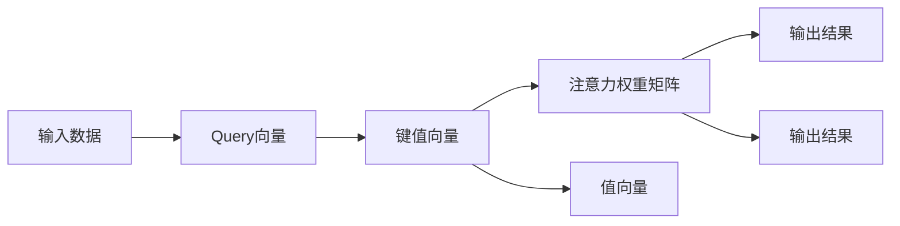
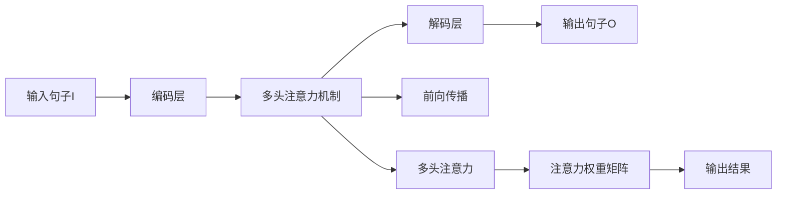

                 

# 注意力生态系统平衡：AI时代的认知资源管理

> 关键词：注意力机制,认知负荷,神经网络,资源管理,生态系统,平衡优化

## 1. 背景介绍

### 1.1 问题由来

随着人工智能(AI)技术在各个领域的广泛应用，神经网络在深度学习中扮演着越来越重要的角色。然而，神经网络模型的计算复杂度和资源需求不断攀升，使得认知资源管理成为了一个严峻的挑战。特别是对于大规模神经网络，如何在保持高精度的同时优化计算效率，避免资源浪费，成为了当前研究的重点。

本文旨在探讨如何在AI时代有效管理认知资源，构建一个高效、平衡、可持续的注意力生态系统，为深度学习模型和实际应用提供有力支持。我们将从注意力机制入手，逐步深入探讨其背后的原理和实际应用，最终提出一系列资源管理策略。

### 1.2 问题核心关键点

认知资源管理的核心在于平衡模型的计算复杂度与精度要求，同时有效利用有限的计算资源。特别地，注意力机制作为一种关键的模型组成部分，对资源的合理分配和管理尤为重要。

本文将围绕以下关键点展开讨论：
1. 注意力机制的工作原理与关键特性。
2. 计算过程中资源分配的优化策略。
3. 注意力生态系统在实际应用中的平衡与优化方法。

## 2. 核心概念与联系

### 2.1 核心概念概述

注意力机制（Attention Mechanism）是深度学习中一种重要的信息融合策略，用于从输入数据中提取出关键信息，增强模型对局部和全局信息的理解能力。它通过学习输入数据的关联关系，动态调整输入数据在不同任务或不同时间的关注点，从而优化计算资源分配。

### 2.2 核心概念联系与架构

注意力机制可以抽象为一个从输入数据到权重矩阵的映射过程，其核心计算图如图2-1所示：



其中，查询向量（Query向量）用于匹配输入数据中的关键信息，键值向量（Key和Value向量）用于表示输入数据的各个部分，注意力权重矩阵（Attention Weight Matrix）用于动态调整各个部分的权重，输出结果（Output）则是经过加权组合得到的最终表示。

这些组件通过计算关系，实现信息的有效融合，帮助深度学习模型提升性能，同时合理利用计算资源，优化生态系统的平衡。

## 3. 核心算法原理 & 具体操作步骤

### 3.1 算法原理概述

注意力机制的核心原理是通过动态计算权重矩阵来分配计算资源，从而在保持精度的同时优化计算效率。在深度学习模型中，注意力机制通常应用于RNN、CNN、Transformer等多种架构中，作为不同层次的信息融合策略。

其关键算法流程如下：
1. 对输入数据进行编码，得到隐含表示。
2. 计算注意力权重矩阵，表示不同部分的关注度。
3. 通过权重矩阵对输入数据进行加权组合，得到输出表示。

注意力机制的计算复杂度较低，但其优化计算资源分配的效果显著，因此在深度学习中得到了广泛应用。

### 3.2 算法步骤详解

以Transformer架构为例，展示注意力机制的详细步骤：

1. 计算查询向量（Q）和键值向量（K和V）的线性变换和前向传播。
2. 计算注意力权重矩阵（A），通过点积计算查询向量和键值向量的相似度，得到注意力权重。
3. 将注意力权重与值向量（V）进行加权组合，得到输出结果。

具体步骤如下：
1. 使用线性变换计算查询向量 $Q = XW_Q$，键值向量 $K = XW_K$，值向量 $V = XW_V$。
2. 计算注意力权重 $A = QK^T$。
3. 计算输出结果 $O = AV$。

通过上述步骤，Transformer模型能够动态调整计算资源，合理地分配注意力权重，优化计算效率。

### 3.3 算法优缺点

注意力机制的主要优点包括：
1. 动态性：可以根据输入数据的不同部分动态调整权重，适应各种复杂问题。
2. 信息融合：能够融合不同层次和不同尺度的信息，提高模型的泛化能力。
3. 计算效率：相比于全连接等结构，计算复杂度较低，优化了资源分配。

其缺点主要体现在：
1. 复杂度：虽然计算复杂度较低，但其需要存储大量的权重矩阵，增加了模型的内存消耗。
2. 稳定性：计算过程中的数值稳定性问题可能影响模型的精度。
3. 训练复杂度：由于涉及多次线性变换和矩阵计算，训练过程中需要更多的计算资源和时间。

### 3.4 算法应用领域

注意力机制广泛应用于深度学习中的各种模型架构，包括：
1. 自然语言处理：如Transformer模型，用于翻译、摘要、情感分析等任务。
2. 计算机视觉：如卷积注意力机制，用于图像识别、目标检测等任务。
3. 语音识别：如CTC（Connectionist Temporal Classification）注意力机制，用于音频特征的分析和识别。
4. 推荐系统：如协同过滤中的注意力机制，用于处理用户和物品之间的关系。

## 4. 数学模型和公式 & 详细讲解 & 举例说明

### 4.1 数学模型构建

注意力机制的数学模型可以描述为：
$$
A = \frac{QK^T}{\sqrt{d_k}} = \frac{QW_K^T}{\sqrt{d_k}} \\
O = AV
$$
其中 $A$ 为注意力权重矩阵，$Q$ 为查询向量，$K$ 为键值向量，$V$ 为值向量，$d_k$ 为键值向量的维度。

### 4.2 公式推导过程

以Transformer中的多头注意力机制为例，推导其计算过程：

1. 计算查询向量 $Q = XW_Q$，键值向量 $K = XW_K$，值向量 $V = XW_V$。
2. 将查询向量 $Q$ 与键值向量 $K$ 计算点积，得到注意力权重矩阵 $A = QK^T$。
3. 将注意力权重矩阵 $A$ 与值向量 $V$ 进行加权组合，得到输出结果 $O = AV$。

具体计算过程如下：
1. $Q = XW_Q$
2. $K = XW_K$
3. $V = XW_V$
4. $A = \frac{QK^T}{\sqrt{d_k}}$
5. $O = AV$

### 4.3 案例分析与讲解

考虑一个简单的机器翻译任务，其输入为英文句子 $I$，输出为中文翻译 $O$。Transformer模型的计算过程如图4-1所示：



通过多头注意力机制，模型能够动态计算不同单词之间的权重，生成更加准确的翻译结果。

## 5. 项目实践：代码实例和详细解释说明

### 5.1 开发环境搭建

在开始实践之前，需要先搭建好深度学习开发环境。以下是使用Python和TensorFlow搭建Transformer模型的环境配置流程：

1. 安装Python：从官网下载并安装Python 3.x版本。
2. 安装TensorFlow：使用pip安装TensorFlow，确保版本与Python兼容。
3. 安装相关依赖库：安装TensorFlow的依赖库，如numpy、pandas、scikit-learn等。

### 5.2 源代码详细实现

以下是一个简单的Transformer模型代码实现，展示了多头注意力机制的应用：

```python
import tensorflow as tf

class Transformer(tf.keras.Model):
    def __init__(self, d_model, num_heads, dff, num_layers, rate=0.1):
        super(Transformer, self).__init__()
        self.encoder_layer = [EncoderLayer(d_model, num_heads, dff, rate) for _ in range(num_layers)]
        self.pos_encoding = positional_encoding(input_vocab_size, d_model)
        
    def call(self, x):
        for i in range(num_layers):
            x = self.encoder_layer[i](x, mask)
        return x

class EncoderLayer(tf.keras.layers.Layer):
    def __init__(self, d_model, num_heads, dff, rate=0.1):
        super(EncoderLayer, self).__init__()
        self.attention = MultiHeadAttention(d_model, num_heads)
        self.ffn = PositionwiseFeedForward(d_model, dff)
        self.layer_norm1 = LayerNormalization(d_model)
        self.layer_norm2 = LayerNormalization(d_model)
        self.dropout1 = tf.keras.layers.Dropout(rate)
        self.dropout2 = tf.keras.layers.Dropout(rate)
        
    def call(self, x, mask):
        attn_output, attn_weights = self.attention(x, x, x, mask)
        x = self.dropout1(attn_output) + x
        x = self.layer_norm1(x)
        ffn_output = self.ffn(x)
        x = self.dropout2(ffn_output) + x
        x = self.layer_norm2(x)
        return x

class MultiHeadAttention(tf.keras.layers.Layer):
    def __init__(self, d_model, num_heads):
        super(MultiHeadAttention, self).__init__()
        self.num_heads = num_heads
        self.d_model = d_model
        
    def split_heads(self, x, batch_size):
        x = tf.reshape(x, (batch_size, -1, self.num_heads, self.d_model//self.num_heads))
        return tf.transpose(x, perm=[0, 2, 1, 3])
        
    def call(self, query, key, value, mask):
        batch_size = tf.shape(query)[0]
        query = self.split_heads(query, batch_size)
        key = self.split_heads(key, batch_size)
        value = self.split_heads(value, batch_size)
        scaled_attention_logits = tf.matmul(query, key, transpose_b=True)
        scaled_attention_logits = scaled_attention_logits / tf.math.sqrt(tf.cast(self.d_model, tf.float32))
        attention_weights = tf.nn.softmax(scaled_attention_logits, axis=-1)
        attention_output = tf.matmul(attention_weights, value)
        attention_output = tf.transpose(attention_output, perm=[0, 2, 1, 3])
        attention_output = tf.reshape(attention_output, (batch_size, -1, self.d_model))
        return attention_output, attention_weights

class PositionalEncoding(tf.keras.layers.Layer):
    def __init__(self, input_vocab_size, d_model):
        super(PositionalEncoding, self).__init__()
        position = tf.range(input_vocab_size)
        position[:, tf.newaxis] += tf.range(input_vocab_size)[tf.newaxis, :]
        positional = d_model * tf.math.sin(position * tf.cast(10000 ** (2 * (position // 100) % 100) / tf.cast(tf.math.pow(10000, tf.range(0, d_model, 2)), tf.float32))
        position = d_model * tf.math.cos(position * tf.cast(10000 ** (2 * (position // 100) % 100) / tf.cast(tf.math.pow(10000, tf.range(0, d_model, 2)), tf.float32))
        position = tf.concat([position, position], axis=1)
        self.positional_encoding = position / tf.math.sqrt(tf.cast(d_model, tf.float32))
```

### 5.3 代码解读与分析

以上代码展示了Transformer模型的基本结构，包括编码层和多头注意力机制。其中，`EncoderLayer` 用于实现每个编码层的计算过程，`MultiHeadAttention` 用于实现多头注意力机制的计算，`PositionalEncoding` 用于在输入序列中加入位置编码，避免信息损失。

在实际应用中，还需进行数据预处理、模型训练、评估等步骤，以确保模型在实际任务中能够稳定运行。

## 6. 实际应用场景

### 6.1 机器翻译

Transformer模型通过多头注意力机制，可以有效处理长序列，减少计算复杂度，提升翻译精度。在实际应用中，可应用于谷歌翻译、百度翻译等在线翻译系统。

### 6.2 文本生成

基于Transformer的生成模型可以生成高质量的文本，如文章、对话等。通过自回归或自编码生成策略，可以在保证多样性和连贯性的同时，生成符合语法规则和语义逻辑的文本。

### 6.3 图像识别

Transformer模型通过卷积注意力机制，可以有效融合空间和通道信息，提升图像识别的准确度。在实际应用中，可应用于图像分类、目标检测等任务。

## 7. 工具和资源推荐

### 7.1 学习资源推荐

为了系统掌握注意力机制及其应用，推荐以下学习资源：

1. 《Attention is All You Need》论文：原Transformer论文，详细阐述了注意力机制的工作原理和计算过程。
2. TensorFlow官方文档：提供了TensorFlow的详细使用方法和代码示例。
3. Deep Learning Specialization：由Coursera提供的深度学习专项课程，包含注意力机制的讲解。
4. Stanford CS224N课程：自然语言处理经典课程，讲解了注意力机制在NLP中的应用。

### 7.2 开发工具推荐

以下是几个常用的深度学习开发工具，推荐使用：

1. Jupyter Notebook：用于编写、测试和分享深度学习代码。
2. PyTorch：灵活易用的深度学习框架，适合快速迭代研究。
3. TensorFlow：强大的深度学习框架，支持GPU加速。
4. Keras：高层次的深度学习框架，易于上手。

### 7.3 相关论文推荐

为了深入理解注意力机制的最新研究进展，推荐以下几篇重要论文：

1. VIT：通过Vision Transformer提出视觉领域的注意力机制。
2. Transformer-XL：通过长距离依赖的Transformer架构解决长序列问题。
3. MoCA：基于掩码自监督学习的注意力机制学习。
4. Transformer-XL和XLM：通过深度和宽度的拓展优化Transformer架构。

## 8. 总结：未来发展趋势与挑战

### 8.1 研究成果总结

本文介绍了注意力机制的工作原理和应用场景，通过理论分析和实际代码实现，展示了其在深度学习中的应用。注意力机制通过动态计算权重，优化计算资源分配，实现了计算效率与模型精度的平衡。然而，注意力机制仍存在计算复杂度、数值稳定性、训练复杂度等问题，需要进一步研究解决。

### 8.2 未来发展趋势

未来，注意力机制的发展趋势主要体现在以下几个方面：

1. 计算效率提升：通过改进计算架构，如量子计算、光子计算等，实现更高的计算效率。
2. 模型精度提升：通过优化注意力权重计算，提高模型的准确性和泛化能力。
3. 多模态融合：将视觉、听觉等多模态信息与注意力机制结合，提升信息融合的全面性。
4. 实时性增强：通过硬件加速、模型裁剪等技术，提升模型的实时性，适应各种实时应用场景。

### 8.3 面临的挑战

尽管注意力机制在深度学习中取得了显著成果，但仍面临以下挑战：

1. 计算资源消耗：高参数、大模型在计算资源消耗上存在瓶颈，需要进一步优化。
2. 训练时间过长：大规模模型的训练时间较长，需要更高效的训练算法。
3. 数值稳定性问题：计算过程中的数值稳定性问题可能影响模型的精度。
4. 模型泛化能力不足：过度依赖特定任务的数据，泛化能力有限。

### 8.4 研究展望

为了应对这些挑战，未来的研究需要在以下几个方向进行突破：

1. 模型压缩与裁剪：通过模型压缩、稀疏化等方法，减少模型参数量，提高计算效率。
2. 分布式训练：通过分布式计算，加速模型训练，减少训练时间。
3. 泛化能力提升：通过迁移学习、零样本学习等技术，提升模型的泛化能力。
4. 多模态融合：将视觉、听觉等多模态信息与注意力机制结合，提升信息融合的全面性。

## 9. 附录：常见问题与解答

**Q1: 注意力机制如何优化计算资源分配？**

A: 注意力机制通过动态计算权重矩阵，实现对输入数据的不同部分进行加权组合。在深度学习模型中，注意力机制可以根据任务需求动态调整权重，优化计算资源分配。

**Q2: 如何平衡注意力机制的计算效率与模型精度？**

A: 可以通过优化注意力权重计算方法，如采用自注意力、多头注意力等策略，减少计算复杂度，同时提高模型的准确性和泛化能力。

**Q3: 注意力机制在实际应用中面临哪些挑战？**

A: 计算资源消耗大、训练时间较长、数值稳定性问题、模型泛化能力不足等是注意力机制面临的主要挑战。需要进一步研究解决这些问题，才能更好地应用于实际场景。

**Q4: 注意力机制的未来发展方向有哪些？**

A: 计算效率提升、模型精度提升、多模态融合、实时性增强等是注意力机制的未来发展方向。通过不断改进和优化，相信注意力机制将在大规模深度学习模型中发挥更大的作用。

---

作者：禅与计算机程序设计艺术 / Zen and the Art of Computer Programming

