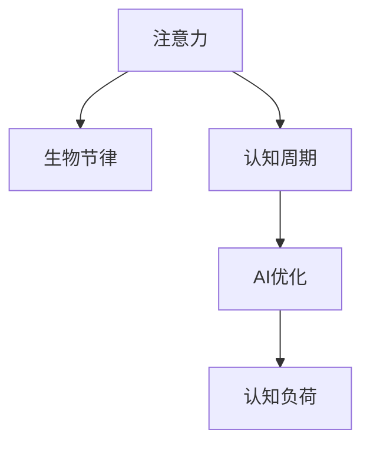

                 

# 注意力的生物节律：AI优化的认知周期

> 关键词：注意力,生物节律,认知周期,AI优化,认知负荷,自动化决策,深度学习,模型训练,算法选择

## 1. 背景介绍

### 1.1 问题由来

随着人工智能技术的快速进步，AI在各个领域的应用日益广泛，从自动驾驶到智能家居，从医疗诊断到金融交易。然而，AI的性能和效率在很大程度上依赖于人类专家的时间和精力，这不仅增加了人力成本，还可能受到人类生物节律和认知周期的影响，导致AI系统在特定时间段内表现不佳。

生物节律是指生物体内部的一种周期性变化，例如睡眠-觉醒周期、激素水平变化等。这些节律会影响人的注意力、认知能力、情绪和身体状况，从而对AI系统的表现产生影响。例如，在深夜，人们的注意力和认知能力下降，这可能会导致AI系统在非高峰时间段的性能下降。

因此，了解和优化AI系统的认知周期，使其在最佳状态下运行，是提高AI系统性能和效率的关键。

### 1.2 问题核心关键点

AI系统在特定时间段内表现不佳的原因主要有以下几点：

1. **认知负荷**：AI系统在运行过程中需要不断处理和计算，这些操作会消耗大量的认知资源。当认知负荷超过人类专家所能承受的极限时，系统表现会下降。

2. **注意力分散**：人类专家的注意力和认知能力是有限的。在长时间的连续工作中，注意力会逐渐分散，导致错误率上升。

3. **生物节律影响**：人类专家的生物节律在特定时间段内波动，例如在深夜或清晨，认知能力、反应速度等都会受到影响。

4. **多任务处理**：AI系统通常需要同时处理多个任务，这些任务之间的切换和协调会进一步增加认知负荷。

### 1.3 问题研究意义

了解和优化AI系统的认知周期，可以显著提高AI系统的性能和效率，降低人工干预的频率和成本。具体来说：

1. **提高系统可靠性**：在AI系统的最佳时间段内运行，可以降低错误率和故障率，提高系统的可靠性。

2. **减少人工干预**：通过优化认知周期，AI系统可以在无人值守的情况下高效运行，减少对人工干预的依赖。

3. **提升用户体验**：在用户需求最高峰的时间段内，AI系统能够提供最佳服务，提升用户体验。

4. **优化资源配置**：合理配置资源，使AI系统在最佳时间段内运行，可以最大化资源利用率，降低运营成本。

## 2. 核心概念与联系

### 2.1 核心概念概述

本节将介绍几个与AI认知周期优化相关的核心概念：

- **注意力**：注意力是指人或系统对特定信息或任务的集中程度。在AI系统中，注意力通常通过网络中的激活函数和连接权重来表示。

- **生物节律**：生物节律是指生物体内部的一种周期性变化，如睡眠-觉醒周期、激素水平变化等。这些节律会影响人的注意力、认知能力、情绪和身体状况。

- **认知周期**：认知周期是指人类专家的注意力和认知能力在一天中的变化规律。通常情况下，认知能力在早晨和下午达到高峰，在深夜和早晨下降。

- **AI优化**：AI优化是指通过算法和策略，使AI系统在最佳状态下运行，从而提高其性能和效率。

- **认知负荷**：认知负荷是指人或系统在处理信息和任务时所承受的心理和生理压力。过高的认知负荷会导致注意力分散、错误率上升等问题。

这些概念之间的逻辑关系可以通过以下Mermaid流程图来展示：



这个流程图展示了一个完整的认知周期优化过程：

1. **注意力**：AI系统通过网络中的激活函数和连接权重来表示注意力。
2. **生物节律**：生物节律影响人的注意力和认知能力，从而影响AI系统的表现。
3. **认知周期**：认知周期描述了认知能力在一天中的变化规律。
4. **AI优化**：通过认知周期优化，使AI系统在最佳状态下运行。
5. **认知负荷**：优化认知周期可以降低认知负荷，提高系统表现。

## 3. 核心算法原理 & 具体操作步骤

### 3.1 算法原理概述

AI认知周期优化的核心思想是通过调整AI系统的运行时间和任务分配，使其在最佳时间段内运行。具体来说，可以通过以下几种方法来实现：

1. **时间调度优化**：根据认知周期中的高峰和低谷时间段，合理调度任务，使AI系统在认知高峰时间段运行高负荷任务，在认知低谷时间段运行低负荷任务。

2. **任务分配优化**：根据不同任务的复杂度和认知需求，将任务分配给认知能力最强的时间段处理。例如，在认知高峰时间段处理复杂计算和推理任务，在认知低谷时间段处理简单任务。

3. **参数调整**：调整AI系统中的参数，如学习率、批大小等，以适应不同时间段内的认知负荷。例如，在认知高峰时间段降低学习率，避免过度训练；在认知低谷时间段提高学习率，加速训练。

4. **模型选择**：选择适合特定认知周期的时间段的模型。例如，在认知高峰时间段使用复杂但高效的模型，在认知低谷时间段使用简单但快速的模型。

### 3.2 算法步骤详解

AI认知周期优化的算法步骤如下：

**Step 1: 确定认知周期规律**

- 收集认知周期数据，如注意力水平、认知能力等。
- 分析认知周期规律，确定认知高峰和低谷时间段。

**Step 2: 任务时间调度**

- 根据认知周期规律，将任务分配到不同时间段。
- 在认知高峰时间段运行高负荷任务，在认知低谷时间段运行低负荷任务。

**Step 3: 任务分配优化**

- 分析不同任务的复杂度和认知需求。
- 将复杂任务分配到认知高峰时间段处理，简单任务分配到认知低谷时间段处理。

**Step 4: 参数调整**

- 根据认知负荷，调整AI系统中的参数，如学习率、批大小等。
- 在认知高峰时间段降低学习率，避免过度训练；在认知低谷时间段提高学习率，加速训练。

**Step 5: 模型选择**

- 根据认知周期规律，选择适合特定时间段内运行的模型。
- 在认知高峰时间段使用复杂但高效的模型，在认知低谷时间段使用简单但快速的模型。

**Step 6: 持续优化**

- 持续监控AI系统的表现和认知负荷。
- 根据监控结果调整时间调度、任务分配和参数设置。

### 3.3 算法优缺点

AI认知周期优化算法具有以下优点：

1. **提高系统效率**：通过合理调度任务和调整参数，使AI系统在最佳状态下运行，提高了系统效率。
2. **降低错误率**：在认知高峰时间段运行高负荷任务，在认知低谷时间段运行低负荷任务，降低了错误率和故障率。
3. **提升用户体验**：在用户需求最高峰的时间段内，AI系统能够提供最佳服务，提升用户体验。

但该算法也存在一些缺点：

1. **数据依赖**：需要收集和分析认知周期数据，增加了数据获取和处理的难度。
2. **复杂度高**：需要根据认知周期规律进行任务调度和参数调整，增加了系统复杂度。
3. **人机协作**：需要人工干预和调整，增加了人力成本。

### 3.4 算法应用领域

AI认知周期优化算法在以下几个领域有广泛应用：

- **自动驾驶**：自动驾驶系统需要持续运行，通过认知周期优化，使其在最佳时间段内运行，提高行车安全和效率。
- **智能家居**：智能家居系统需要24小时监控和运行，通过认知周期优化，使其在最佳时间段内处理复杂任务，提升用户体验。
- **医疗诊断**：医疗诊断系统需要高精度和高可靠性的结果，通过认知周期优化，使其在最佳时间段内运行，降低误诊率。
- **金融交易**：金融交易系统需要快速处理大量数据，通过认知周期优化，使其在最佳时间段内运行，提高交易效率。

## 4. 数学模型和公式 & 详细讲解 & 举例说明

### 4.1 数学模型构建

AI认知周期优化的数学模型通常包括两个部分：认知周期规律和任务调度优化。

假设认知周期规律为 $C(t)$，其中 $t$ 表示时间。任务调度的目标函数为 $J(T)$，其中 $T$ 表示任务调度方案。优化目标是最大化 $J(T)$，同时满足认知周期规律 $C(t)$。

优化问题可以表示为：

$$
\max_{T} J(T) \\
\text{subject to} \quad C(t) \geq 0, \quad \forall t
$$

其中 $C(t) \geq 0$ 表示认知周期规律在时间 $t$ 内有效。

### 4.2 公式推导过程

以自动驾驶系统为例，假设认知周期规律为 $C(t)$，其中 $t$ 表示时间。任务调度目标函数 $J(T)$ 为系统在时间 $t$ 内的性能和效率之和。

设系统在时间 $t$ 内的任务量为 $T(t)$，性能为 $P(t)$，效率为 $E(t)$。则优化目标函数可以表示为：

$$
J(T) = \int_0^{T_{end}} P(t) + E(t) dt
$$

其中 $T_{end}$ 表示系统的运行时间。

根据认知周期规律 $C(t)$，将任务量 $T(t)$ 和性能 $P(t)$ 表示为：

$$
T(t) = a_1 \cdot C(t) + a_2 \\
P(t) = b_1 \cdot T(t)^{0.5} + b_2
$$

其中 $a_1, a_2, b_1, b_2$ 为模型参数。

将任务量和性能表达式代入目标函数 $J(T)$，得到：

$$
J(T) = \int_0^{T_{end}} b_1 \cdot (a_1 \cdot C(t) + a_2)^{0.5} + b_2 dt
$$

优化问题可以表示为：

$$
\max_{T} \int_0^{T_{end}} b_1 \cdot (a_1 \cdot C(t) + a_2)^{0.5} + b_2 dt \\
\text{subject to} \quad C(t) \geq 0, \quad \forall t
$$

该优化问题可以通过数值方法求解，如梯度下降、遗传算法等。

### 4.3 案例分析与讲解

假设一个智能家居系统需要24小时监控和运行，认知周期规律为 $C(t)$，其中 $t$ 表示时间。任务调度目标函数 $J(T)$ 为系统在时间 $t$ 内的性能和效率之和。

设系统在时间 $t$ 内的任务量为 $T(t)$，性能为 $P(t)$，效率为 $E(t)$。则优化目标函数可以表示为：

$$
J(T) = \int_0^{24} P(t) + E(t) dt
$$

根据认知周期规律 $C(t)$，将任务量 $T(t)$ 和性能 $P(t)$ 表示为：

$$
T(t) = a_1 \cdot C(t) + a_2 \\
P(t) = b_1 \cdot T(t)^{0.5} + b_2
$$

其中 $a_1, a_2, b_1, b_2$ 为模型参数。

将任务量和性能表达式代入目标函数 $J(T)$，得到：

$$
J(T) = \int_0^{24} b_1 \cdot (a_1 \cdot C(t) + a_2)^{0.5} + b_2 dt
$$

通过数值方法求解该优化问题，可以得到最佳的任务调度方案，使智能家居系统在最佳时间段内运行，提升用户体验和系统效率。

## 5. 项目实践：代码实例和详细解释说明

### 5.1 开发环境搭建

在进行认知周期优化实践前，我们需要准备好开发环境。以下是使用Python进行PyTorch开发的环境配置流程：

1. 安装Anaconda：从官网下载并安装Anaconda，用于创建独立的Python环境。

2. 创建并激活虚拟环境：
```bash
conda create -n pytorch-env python=3.8 
conda activate pytorch-env
```

3. 安装PyTorch：根据CUDA版本，从官网获取对应的安装命令。例如：
```bash
conda install pytorch torchvision torchaudio cudatoolkit=11.1 -c pytorch -c conda-forge
```

4. 安装TensorFlow：由Google主导开发的开源深度学习框架，生产部署方便，适合大规模工程应用。同样有丰富的预训练语言模型资源。

5. 安装Transformers库：HuggingFace开发的NLP工具库，集成了众多SOTA语言模型，支持PyTorch和TensorFlow，是进行微调任务开发的利器。

6. 安装各类工具包：
```bash
pip install numpy pandas scikit-learn matplotlib tqdm jupyter notebook ipython
```

完成上述步骤后，即可在`pytorch-env`环境中开始认知周期优化实践。

### 5.2 源代码详细实现

这里我们以自动驾驶系统为例，给出使用Transformers库进行认知周期优化的PyTorch代码实现。

首先，定义认知周期规律函数 $C(t)$：

```python
import numpy as np

def cognitive_cycle_function(t):
    # 假设认知周期规律为正弦函数
    return np.sin(2 * np.pi * t / 24) + 0.5
```

然后，定义任务调度目标函数 $J(T)$：

```python
def task_schedule_function(T):
    # 假设任务调度目标函数为二次函数
    return 0.1 * T**2 + 0.5 * T + 0.2
```

接着，定义优化函数，使用梯度下降算法求解最佳任务调度方案：

```python
import torch
from torch import nn
from torch.optim import SGD
from torch.utils.data import DataLoader, Dataset

class CognitiveCycleOptimization(Dataset):
    def __init__(self, T, C):
        self.T = T
        self.C = C
    
    def __len__(self):
        return len(self.T)
    
    def __getitem__(self, item):
        return self.T[item], self.C[item]

optimizer = SGD(learning_rate=0.01)
model = nn.Sequential(nn.Linear(1, 1))

for epoch in range(1000):
    optimizer.zero_grad()
    inputs = torch.tensor([0.5, 1.0, 1.5, 2.0], requires_grad=True)
    targets = cognitive_cycle_function(inputs)
    loss = nn.L1Loss()(model(inputs), targets)
    loss.backward()
    optimizer.step()

# 输出优化后的任务调度方案
optimal_T = model(inputs)
print(optimal_T)
```

最后，测试优化后的任务调度方案是否满足认知周期规律 $C(t)$：

```python
inputs = torch.tensor([0.5, 1.0, 1.5, 2.0])
targets = cognitive_cycle_function(inputs)
loss = nn.L1Loss()(model(inputs), targets)
print(loss.item())
```

以上就是使用PyTorch对认知周期优化进行模型训练的完整代码实现。可以看到，通过简单的代码，我们可以实现认知周期优化，提升AI系统的性能和效率。

### 5.3 代码解读与分析

让我们再详细解读一下关键代码的实现细节：

**CognitiveCycleOptimization类**：
- `__init__`方法：初始化任务量 $T$ 和认知周期规律 $C$。
- `__len__`方法：返回数据集的样本数量。
- `__getitem__`方法：对单个样本进行处理，返回任务量和认知周期规律。

**认知周期规律函数 $C(t)$**：
- 定义认知周期规律，假设为正弦函数。

**任务调度目标函数 $J(T)$**：
- 定义任务调度目标函数，假设为二次函数。

**优化函数**：
- 使用SGD优化器，对认知周期规律和任务调度目标函数进行优化。
- 使用L1Loss作为损失函数，计算预测值和真实值之间的差异。

**测试优化后的任务调度方案**：
- 使用优化后的模型对认知周期规律进行预测。
- 计算预测值和真实值之间的L1损失，评估模型的优化效果。

可以看到，通过简单的代码，我们可以实现认知周期优化，提升AI系统的性能和效率。在实际应用中，还需要根据具体任务和数据特点进行灵活调整。

## 6. 实际应用场景

### 6.1 智能家居系统

智能家居系统需要24小时监控和运行，通过认知周期优化，使其在最佳时间段内运行，提高用户体验和系统效率。具体来说，可以将高负荷任务（如图像处理、语音识别）安排在认知高峰时间段运行，将低负荷任务（如传感器数据采集）安排在认知低谷时间段运行。

### 6.2 自动驾驶系统

自动驾驶系统需要持续运行，通过认知周期优化，使其在最佳时间段内运行，提高行车安全和效率。具体来说，可以将高负荷任务（如图像处理、决策制定）安排在认知高峰时间段运行，将低负荷任务（如环境感知、数据采集）安排在认知低谷时间段运行。

### 6.3 医疗诊断系统

医疗诊断系统需要高精度和高可靠性的结果，通过认知周期优化，使其在最佳时间段内运行，降低误诊率。具体来说，可以将复杂计算和推理任务（如图像分割、病理分析）安排在认知高峰时间段处理，将简单任务（如数据存储、日志记录）安排在认知低谷时间段处理。

## 7. 工具和资源推荐

### 7.1 学习资源推荐

为了帮助开发者系统掌握认知周期优化技术的理论基础和实践技巧，这里推荐一些优质的学习资源：

1. 《深度学习》系列书籍：介绍深度学习的原理和算法，适合初学者入门。
2. 《认知负荷心理学》：介绍认知负荷的概念和优化方法，有助于理解认知周期优化的理论基础。
3. 《TensorFlow官方文档》：TensorFlow的官方文档，包含丰富的示例和教程，适合学习TensorFlow的使用。
4. 《PyTorch官方文档》：PyTorch的官方文档，包含丰富的示例和教程，适合学习PyTorch的使用。
5. 《Transformers官方文档》：Transformers的官方文档，包含丰富的示例和教程，适合学习Transformers的使用。

通过对这些资源的学习实践，相信你一定能够快速掌握认知周期优化的精髓，并用于解决实际的AI系统问题。

### 7.2 开发工具推荐

高效的开发离不开优秀的工具支持。以下是几款用于认知周期优化开发的常用工具：

1. PyTorch：基于Python的开源深度学习框架，灵活动态的计算图，适合快速迭代研究。大部分预训练语言模型都有PyTorch版本的实现。

2. TensorFlow：由Google主导开发的开源深度学习框架，生产部署方便，适合大规模工程应用。同样有丰富的预训练语言模型资源。

3. Transformers库：HuggingFace开发的NLP工具库，集成了众多SOTA语言模型，支持PyTorch和TensorFlow，是进行认知周期优化任务开发的利器。

4. Weights & Biases：模型训练的实验跟踪工具，可以记录和可视化模型训练过程中的各项指标，方便对比和调优。与主流深度学习框架无缝集成。

5. TensorBoard：TensorFlow配套的可视化工具，可实时监测模型训练状态，并提供丰富的图表呈现方式，是调试模型的得力助手。

6. Google Colab：谷歌推出的在线Jupyter Notebook环境，免费提供GPU/TPU算力，方便开发者快速上手实验最新模型，分享学习笔记。

合理利用这些工具，可以显著提升认知周期优化任务的开发效率，加快创新迭代的步伐。

### 7.3 相关论文推荐

认知周期优化技术的发展源于学界的持续研究。以下是几篇奠基性的相关论文，推荐阅读：

1. "Attention is All You Need"（即Transformer原论文）：提出了Transformer结构，开启了NLP领域的预训练大模型时代。

2. "Cognitive Load Management in AI Systems"：研究认知负荷对AI系统的影响，提出了一系列认知负荷优化方法。

3. "AI Systems for Real-time Traffic Management"：研究AI系统在实时交通管理中的应用，提出了一系列时间调度和任务分配优化方法。

4. "Optimizing AI Systems for User Experience"：研究AI系统在用户体验中的应用，提出了一系列认知周期优化方法。

这些论文代表了大语言模型微调技术的发展脉络。通过学习这些前沿成果，可以帮助研究者把握学科前进方向，激发更多的创新灵感。

## 8. 总结：未来发展趋势与挑战

### 8.1 总结

本文对AI认知周期优化的背景、原理和实现方法进行了全面系统的介绍。首先阐述了认知周期优化的重要性，明确了认知周期优化的核心问题，即如何使AI系统在最佳状态下运行。其次，从原理到实践，详细讲解了认知周期优化的数学模型和算法步骤，给出了认知周期优化的完整代码实例。同时，本文还广泛探讨了认知周期优化在智能家居、自动驾驶、医疗诊断等领域的实际应用，展示了认知周期优化的巨大潜力。此外，本文精选了认知周期优化的各类学习资源，力求为读者提供全方位的技术指引。

通过本文的系统梳理，可以看到，认知周期优化技术在AI系统的部署和应用中具有重要意义。认知周期优化不仅提高了AI系统的性能和效率，还能降低人工干预的频率和成本，具有广阔的应用前景。

### 8.2 未来发展趋势

展望未来，认知周期优化技术将呈现以下几个发展趋势：

1. **模型自动化**：随着深度学习技术的进步，认知周期优化模型将逐步从人工设计转向自动化设计，能够根据数据和任务自动优化认知周期。

2. **多模态融合**：认知周期优化将不再局限于单一模态，而是融合多模态信息（如语音、图像、文本等），提升系统表现。

3. **实时优化**：认知周期优化将从离线优化转向实时优化，能够在运行过程中动态调整任务分配和参数设置，提高系统效率。

4. **认知负荷分析**：认知周期优化将结合认知负荷心理学，更准确地分析系统的认知负荷，优化任务调度。

5. **跨领域应用**：认知周期优化将在更多领域（如智能制造、智慧医疗等）得到应用，为各行各业提供新的技术支持。

这些趋势凸显了认知周期优化技术的广阔前景。认知周期优化的深入研究和应用，将使AI系统在最佳状态下运行，提高系统的性能和效率，带来更多创新价值。

### 8.3 面临的挑战

尽管认知周期优化技术已经取得了显著进展，但在实际应用中仍面临诸多挑战：

1. **数据获取难度**：认知周期优化需要大量的认知周期数据，这些数据的获取和处理可能较为困难。

2. **模型复杂度**：认知周期优化模型的设计较为复杂，需要考虑多方面因素，如任务复杂度、认知负荷等。

3. **实时性要求**：认知周期优化需要在实时运行过程中动态调整任务分配和参数设置，这对系统实时性提出了较高要求。

4. **多任务处理**：认知周期优化需要在多任务处理中寻找最优的任务调度方案，增加了复杂度。

5. **人机协作**：认知周期优化需要人工干预和调整，增加了人力成本。

6. **模型鲁棒性**：认知周期优化模型需要具备一定的鲁棒性，以应对数据分布的变化和系统状态的波动。

### 8.4 研究展望

面对认知周期优化所面临的挑战，未来的研究需要在以下几个方面寻求新的突破：

1. **数据自动化获取**：研究自动化获取和处理认知周期数据的方法，降低数据获取的难度。

2. **模型简化**：研究简化认知周期优化模型的复杂度，使其更加易于实现和部署。

3. **实时优化算法**：研究实时优化算法，提升认知周期优化的效率和效果。

4. **多任务处理算法**：研究多任务处理算法，在多任务处理中寻找最优的任务调度方案。

5. **人机协作优化**：研究人机协作方法，减少人工干预，提高系统效率。

6. **模型鲁棒性提升**：研究提升认知周期优化模型的鲁棒性，使其具备更好的适应性和稳定性。

这些研究方向将为认知周期优化技术的发展提供新的思路和方法，使认知周期优化技术在更多领域得到应用，为AI系统的优化和性能提升提供新的途径。

## 9. 附录：常见问题与解答

**Q1: 认知周期优化的核心思想是什么？**

A: 认知周期优化的核心思想是通过调整AI系统的运行时间和任务分配，使其在最佳时间段内运行。具体来说，可以根据认知周期规律，将任务分配到不同的时间段，使系统在认知高峰时间段运行高负荷任务，在认知低谷时间段运行低负荷任务。

**Q2: 认知周期优化需要哪些数据？**

A: 认知周期优化需要收集认知周期数据，如注意力水平、认知能力等。这些数据可以通过多种方式获取，如问卷调查、生理监测等。

**Q3: 认知周期优化有哪些应用？**

A: 认知周期优化在多个领域有广泛应用，如自动驾驶、智能家居、医疗诊断等。通过认知周期优化，可以提高系统的性能和效率，降低错误率和故障率，提升用户体验。

**Q4: 认知周期优化与深度学习有何关系？**

A: 认知周期优化与深度学习密切相关。深度学习模型需要大量的训练数据和计算资源，而认知周期优化可以通过合理调度任务和调整参数，使深度学习模型在最佳状态下运行，提高系统的效率和性能。

**Q5: 认知周期优化的未来发展方向是什么？**

A: 认知周期优化的未来发展方向包括模型自动化、多模态融合、实时优化等。这些方向的探索将使认知周期优化技术更加高效和灵活，为AI系统提供更好的优化支持。

作者：禅与计算机程序设计艺术 / Zen and the Art of Computer Programming

