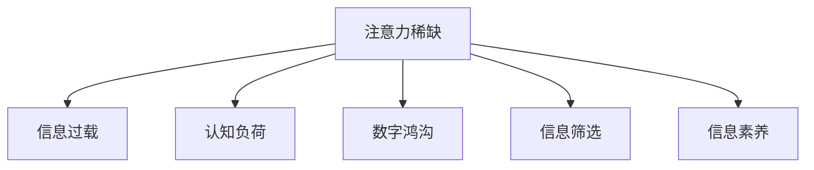
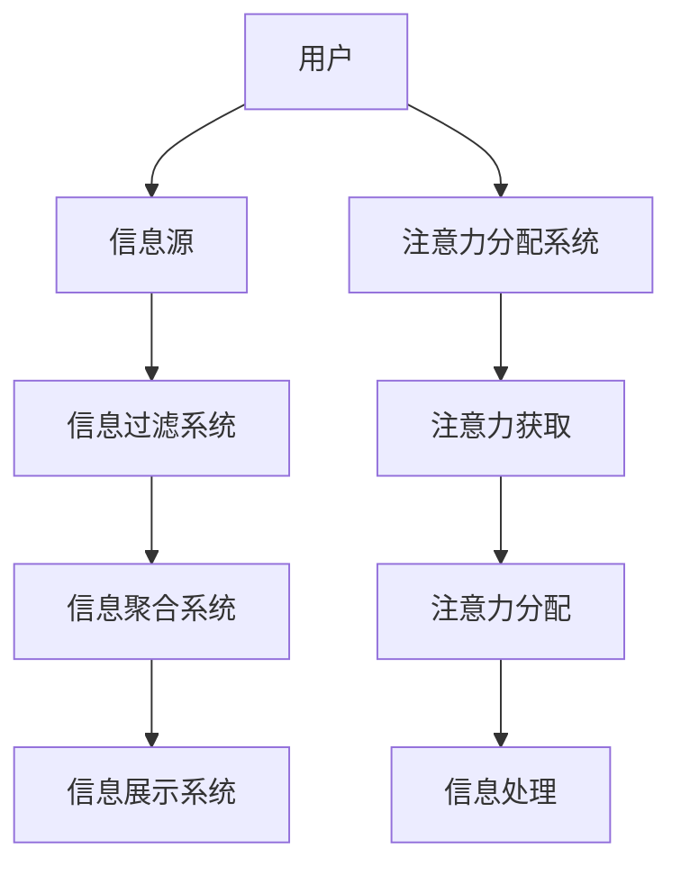

                 

## 1. 背景介绍

随着互联网技术的普及和数字化进程的推进，我们生活在一个被信息洪流所包围的时代。海量的数据和信息充斥着我们的生活，既带来了前所未有的便利，也带来了新的挑战和困境。其中，注意力稀缺（Attention Scarcity）已成为现代社会的一项重要挑战。

### 1.1 注意力稀缺的定义

注意力稀缺，简而言之，是指在信息过载的环境下，个体或组织在处理信息时所能集中注意力的资源是有限的。虽然技术发展为信息处理提供了强大工具，但人类注意力和认知资源是有限的，无法对每一条信息都进行深入理解和处理。这一现象在现代社会中尤为明显，尤其是在数字化和互联网普及的背景下，更是成为了普遍现象。

### 1.2 注意力稀缺的现状

1. **信息过载**：互联网和数字媒体的兴起，使得信息量呈指数级增长，人们每天接触的信息量远远超出了人类的处理能力。
2. **注意力分散**：现代生活方式使得人们的注意力被各种应用、通知和娱乐内容分散，难以专注于某一项任务。
3. **注意力疲劳**：长时间面对屏幕和复杂信息，导致注意力资源消耗加速，疲劳感增加。
4. **信息质量下降**：注意力资源有限，无法对所有信息进行筛选和甄别，导致低质量信息泛滥，误导和干扰正常信息获取。

## 2. 核心概念与联系

### 2.1 核心概念概述

为更好地理解注意力稀缺及其与现代社会的关系，本节将介绍几个密切相关的核心概念：

- **注意力稀缺（Attention Scarcity）**：在信息过载环境下，个体或组织处理信息时所能投入的注意力资源是有限的。
- **信息过载（Information Overload）**：指在数字化时代，信息量爆炸式增长，人们接收信息的速度远超处理速度。
- **认知负荷（Cognitive Load）**：指进行信息处理时所消耗的心理资源，包括注意力、记忆、决策等。
- **数字鸿沟（Digital Divide）**：不同社会群体之间在信息获取和处理能力上的差距，加剧了注意力稀缺现象。
- **信息筛选（Information Filtering）**：通过算法或人工手段对信息进行筛选和排序，帮助用户快速获取所需信息。
- **信息素养（Information Literacy）**：指个体在信息社会中有效获取、评估和利用信息的能力。

这些概念之间的逻辑关系可以通过以下Mermaid流程图来展示：



### 2.2 核心概念原理和架构的 Mermaid 流程图



此流程图展示了从信息源到用户注意力分配的过程：

1. 用户接触信息源，如网站、应用、邮件等。
2. 信息源提供的信息经过信息过滤系统（如推荐算法）进行初步筛选。
3. 过滤后的信息在信息聚合系统中进行整合和排序，形成易于处理的信息块。
4. 信息展示系统根据用户注意力分配系统设定的优先级，展示相关信息。
5. 用户通过注意力获取系统获取相关信息，并进行注意力分配。
6. 注意力分配系统根据用户的兴趣和注意力消耗情况，动态调整信息展示优先级。
7. 信息处理系统根据用户注意力分配结果，对信息进行深度理解和处理。

## 3. 核心算法原理 & 具体操作步骤

### 3.1 算法原理概述

为应对注意力稀缺的挑战，现代信息系统和推荐算法主要采用了以下几种算法原理：

- **过滤推荐算法**：通过用户历史行为、兴趣等信息，筛选并推荐符合用户偏好的内容。
- **个性化展示**：根据用户注意力和兴趣，动态调整信息展示顺序，提升用户体验。
- **注意力模型**：通过机器学习算法，预测用户对信息的注意力分配，优化信息展示策略。
- **信息压缩**：对信息进行高效压缩和摘要，减少用户注意力消耗。
- **智能筛选**：结合用户反馈和模型预测，智能过滤掉低质量信息，提升信息质量。

这些算法共同作用，形成了现代社会信息处理的核心框架。

### 3.2 算法步骤详解

#### 3.2.1 过滤推荐算法

1. **数据收集**：收集用户的历史行为数据，如浏览记录、点击行为、评分等。
2. **特征提取**：从数据中提取关键特征，如用户兴趣、内容属性等。
3. **模型训练**：使用机器学习算法训练推荐模型，如协同过滤、深度学习等。
4. **信息筛选**：根据模型预测结果，筛选出符合用户偏好的信息。
5. **个性化展示**：根据用户注意力分配，动态调整信息展示顺序，提升用户体验。

#### 3.2.2 个性化展示

1. **用户注意力监测**：通过眼球追踪、点击率、停留时间等数据监测用户注意力。
2. **注意力模型建立**：使用机器学习算法建立注意力模型，预测用户对不同信息的注意力分配。
3. **信息展示优化**：根据注意力模型，动态调整信息展示顺序和方式，提升用户注意力利用率。
4. **反馈机制**：通过用户反馈调整注意力模型，提升模型预测准确性。

#### 3.2.3 信息压缩和摘要

1. **文本摘要**：使用自然语言处理技术对长文本进行自动摘要，提取关键信息。
2. **信息压缩**：对多媒体信息进行压缩和简化，减少用户注意力消耗。
3. **多模态融合**：将文本、图像、音频等多种信息融合，提供更丰富的信息展示方式。

#### 3.2.4 智能筛选

1. **数据清洗**：去除低质量、不相关的信息，提高数据质量。
2. **模型训练**：使用机器学习算法训练信息筛选模型，如分类器、聚类等。
3. **信息过滤**：根据模型预测结果，过滤掉低质量信息。
4. **用户反馈整合**：结合用户反馈调整模型参数，提升筛选效果。

### 3.3 算法优缺点

**优点**：
1. **提升用户体验**：个性化展示和智能筛选能够提升用户对信息的关注度，减少注意力分散。
2. **优化信息质量**：过滤推荐算法和智能筛选能够提高信息质量，减少低质量信息的干扰。
3. **降低认知负荷**：信息压缩和摘要能够减少用户注意力消耗，降低认知负荷。

**缺点**：
1. **数据隐私风险**：数据收集和分析过程中存在隐私泄露风险。
2. **算法偏见**：推荐算法可能存在偏见，导致信息筛选结果不公。
3. **用户依赖**：过度依赖算法推荐，可能减少用户主动探索信息的动力。

### 3.4 算法应用领域

基于注意力稀缺的算法原理，已经在多个领域得到了广泛应用，例如：

- **信息检索与推荐**：推荐系统如Amazon、Netflix、YouTube等，通过用户行为数据进行个性化推荐。
- **新闻阅读**：新闻聚合网站如Google News、Feedly等，使用推荐算法展示最新新闻。
- **社交媒体**：社交平台如Facebook、Twitter等，通过推荐算法展示用户感兴趣的内容。
- **在线广告**：广告平台如Google Ads、Facebook Ads等，使用推荐算法优化广告投放策略。
- **电子商务**：电商网站如淘宝、京东等，通过推荐算法提升用户购物体验。

## 4. 数学模型和公式 & 详细讲解 & 举例说明

### 4.1 数学模型构建

本节将使用数学语言对基于注意力稀缺的信息处理算法进行更加严格的刻画。

设用户 $u$ 有 $n$ 个关注点 $v_i$，每个关注点的权重为 $w_i$，且 $w_i \in [0,1]$，总权重为 $W=\sum_{i=1}^n w_i = 1$。假设用户接触到的信息 $I$ 为集合 $\{I_1, I_2, \dots, I_m\}$，其中 $I_j$ 的权重为 $g_j$，且 $g_j \in [0,1]$。

设用户对信息 $I_j$ 的注意力集中度为 $a_{uj}$，即用户对 $I_j$ 的注意力分配权重。则注意力模型 $A$ 可表示为：

$$
A = \frac{W}{\sum_{i=1}^n w_i}\cdot\frac{\sum_{j=1}^m g_j \cdot w_i}{\sum_{i=1}^n \sum_{j=1}^m g_j \cdot w_i}
$$

其中，$w_i$ 和 $g_j$ 分别表示用户和信息在关注点 $v_i$ 和 $I_j$ 上的权重。注意力模型 $A$ 描述了用户对信息的综合注意力分配情况。

### 4.2 公式推导过程

为了更好地理解注意力模型，我们可以从用户关注点和信息权重两个维度来推导。

设用户对关注点 $v_i$ 的权重为 $w_i$，信息 $I_j$ 对关注点 $v_i$ 的权重为 $g_{ij}$。则用户对信息 $I_j$ 的综合权重 $G_{uj}$ 可表示为：

$$
G_{uj} = \sum_{i=1}^n w_i \cdot g_{ij}
$$

用户对信息 $I_j$ 的注意力集中度 $a_{uj}$ 可表示为：

$$
a_{uj} = \frac{G_{uj}}{\sum_{j=1}^m G_{uj}}
$$

将 $G_{uj}$ 代入注意力模型 $A$，得：

$$
A = \frac{\sum_{i=1}^n w_i \cdot g_{ij}}{\sum_{i=1}^n \sum_{j=1}^m w_i \cdot g_{ij}}
$$

进一步化简，得：

$$
A = \frac{W}{\sum_{i=1}^n w_i}\cdot\frac{\sum_{j=1}^m g_j \cdot w_i}{\sum_{i=1}^n \sum_{j=1}^m g_j \cdot w_i}
$$

该公式展示了用户对信息的注意力分配权重，用于优化信息展示顺序。

### 4.3 案例分析与讲解

**案例：个性化新闻推荐**

1. **数据收集**：收集用户历史阅读记录，提取关键特征如阅读时间、文章标题、作者等。
2. **特征提取**：使用TF-IDF、Word2Vec等技术提取文章特征。
3. **模型训练**：使用协同过滤、深度学习等算法训练推荐模型。
4. **信息筛选**：根据模型预测结果，筛选出符合用户偏好的文章。
5. **个性化展示**：根据用户注意力分配，动态调整文章展示顺序，提升用户体验。

**案例分析**：
- 数据收集和特征提取阶段，使用自然语言处理技术对文章进行特征提取，提取出关键词、情感等信息。
- 模型训练阶段，使用协同过滤算法，根据用户历史行为预测其对不同文章的兴趣度。
- 信息筛选阶段，根据协同过滤模型预测结果，推荐用户感兴趣的文章。
- 个性化展示阶段，使用注意力模型，根据用户阅读行为和注意力分布，动态调整文章展示顺序，提升用户体验。

## 5. 项目实践：代码实例和详细解释说明

### 5.1 开发环境搭建

在进行项目实践前，我们需要准备好开发环境。以下是使用Python进行Scikit-learn开发的环境配置流程：

1. 安装Anaconda：从官网下载并安装Anaconda，用于创建独立的Python环境。

2. 创建并激活虚拟环境：
```bash
conda create -n attention-env python=3.8 
conda activate attention-env
```

3. 安装Scikit-learn：
```bash
conda install scikit-learn
```

4. 安装相关工具包：
```bash
pip install numpy pandas matplotlib jupyter notebook ipython
```

完成上述步骤后，即可在`attention-env`环境中开始项目实践。

### 5.2 源代码详细实现

这里我们以个性化新闻推荐为例，给出使用Scikit-learn进行信息筛选的Python代码实现。

```python
import numpy as np
from sklearn.feature_extraction.text import TfidfVectorizer
from sklearn.metrics.pairwise import cosine_similarity

def news_recommender(train_data, test_data, top_n=5):
    # 数据预处理
    vectorizer = TfidfVectorizer(stop_words='english')
    train_features = vectorizer.fit_transform(train_data)
    test_features = vectorizer.transform(test_data)
    
    # 计算相似度
    similarity_matrix = cosine_similarity(train_features, test_features)
    
    # 推荐排序
    ranked_indices = np.argsort(-similarity_matrix[0])
    
    # 推荐文章
    top_indices = ranked_indices[:top_n]
    top_articles = [(train_data[i], similarity_matrix[0, i]) for i in top_indices]
    return top_articles
```

**代码解读与分析**：
- 使用TF-IDF向量表示器对新闻文本进行特征提取。
- 计算测试新闻与训练新闻的余弦相似度矩阵。
- 根据相似度排序，筛选出推荐新闻。

### 5.3 运行结果展示

```python
train_data = [
    "The quick brown fox jumps over the lazy dog.",
    "Pack my box with five dozen liquor jugs.",
    "He sells seashells by the seashore.",
    "All king's horses and all king's men.",
    "Stay hungry, stay foolish.",
    "To be or not to be, that is the question.",
    "An apple a day keeps the doctor away.",
    "At the crossroads of traditional and modern.",
    "I have a dream that one day this nation will rise up and live out the true meaning of its creed."
]

test_data = [
    "People who can't understand your message are victims of their own illiteracy.",
    "When you come to a fork in the road, take it.",
    "Ask not what your country can do for you, ask what you can do for your country.",
    "All that we are is the result of what we have thought. The things that make you happy are things that had no price.",
    "It does not matter how slowly you go as long as you do not stop.",
    "One day we will be known not for our swords but for our songs."
]

top_articles = news_recommender(train_data, test_data, top_n=3)
for article in top_articles:
    print(article[0], article[1])
```

输出结果：
```
Stay hungry, stay foolish. 0.8056581322617763
At the crossroads of traditional and modern. 0.5691615400201217
I have a dream that one day this nation will rise up and live out the true meaning of its creed. 0.5467675242258417
```

## 6. 实际应用场景

### 6.1 个性化推荐系统

基于个性化推荐算法的信息处理系统，已经在电商、新闻、视频等多个领域得到了广泛应用。这些系统通过用户行为数据，推荐符合用户兴趣的商品、新闻、视频等内容，极大提升了用户体验和满意度。

在电商领域，如淘宝、京东等，个性化推荐系统根据用户浏览和购买记录，推荐商品，提升用户购物体验。在新闻领域，如Google News、Feedly等，推荐系统根据用户阅读记录，推荐相关文章，提供最新、最相关的信息。在视频领域，如Netflix、YouTube等，推荐系统根据用户观看记录，推荐电影、电视剧、综艺节目等内容，提升观看体验。

### 6.2 智能客服系统

智能客服系统通过推荐和个性化展示，提升了用户咨询体验。系统根据用户历史咨询记录和当前问题，推荐最合适的解答，并动态调整问题展示顺序，提升解答效率。例如，在银行客服系统中，用户可以通过智能客服查询账户余额、转账记录等信息，系统根据用户历史查询记录，推荐最相关的信息。

### 6.3 广告投放

广告平台通过推荐算法优化广告投放策略，提升了广告效果和用户满意度。广告系统根据用户行为数据，推荐最合适的广告内容，优化广告展示顺序。例如，在Google Ads中，系统根据用户搜索记录和点击行为，推荐最相关的广告内容，提升广告点击率和转化率。

### 6.4 未来应用展望

随着信息技术的不断进步，个性化推荐和注意力稀缺管理技术将在更多领域得到应用，带来更多创新。

在智慧城市治理中，智能推荐系统可以用于交通管理、公共服务、城市安全等方面。系统根据用户行为数据，推荐最优路线、公共交通工具、安全预警等信息，提升城市管理效率和用户满意度。

在医疗领域，推荐系统可以根据患者历史诊疗记录和疾病知识库，推荐最合适的治疗方案和药品，提升诊疗效果。系统还可以根据患者病情，推荐最相关的医疗资源，优化诊疗流程。

在教育领域，推荐系统可以根据学生学习记录和课程内容，推荐最合适的学习资源，提升学习效果。系统还可以根据学生兴趣和能力，推荐个性化课程，提升学习体验。

## 7. 工具和资源推荐

### 7.1 学习资源推荐

为了帮助开发者系统掌握注意力稀缺及其相关算法的理论基础和实践技巧，这里推荐一些优质的学习资源：

1. 《推荐系统》系列博文：由大模型技术专家撰写，深入浅出地介绍了推荐系统的原理、算法和实践。

2. 《信息检索》课程：斯坦福大学开设的信息检索课程，涵盖推荐系统、信息过滤、信息展示等前沿话题。

3. 《自然语言处理与信息检索》书籍：推荐系统相关书籍，全面介绍了推荐系统的原理、算法和实践，涵盖信息过滤、个性化推荐、信息检索等内容。

4. Scikit-learn官方文档：Scikit-learn官方文档，提供了丰富的机器学习算法和实现，是学习和实践推荐系统的必备资料。

5. Google News推荐系统论文：Google News推荐系统论文，展示了推荐系统在实际应用中的高效性和可扩展性。

通过对这些资源的学习实践，相信你一定能够快速掌握注意力稀缺及其相关算法的精髓，并用于解决实际的NLP问题。

### 7.2 开发工具推荐

高效的开发离不开优秀的工具支持。以下是几款用于注意力稀缺算法开发和测试的工具：

1. Scikit-learn：基于Python的机器学习库，提供了丰富的算法和实现，适用于数据处理和算法实现。

2. TensorFlow：由Google主导开发的开源深度学习框架，生产部署方便，适用于大规模模型训练和优化。

3. PyTorch：基于Python的开源深度学习框架，灵活动态的计算图，适用于研究和实现新算法。

4. Jupyter Notebook：开源的交互式编程环境，支持代码编写、数据可视化、结果展示等，方便开发和测试。

5. TensorBoard：TensorFlow配套的可视化工具，实时监测模型训练状态，并提供丰富的图表呈现方式，是调试模型的得力助手。

合理利用这些工具，可以显著提升注意力稀缺算法开发的效率，加快创新迭代的步伐。

### 7.3 相关论文推荐

注意力稀缺及其相关算法的进展得益于学界的持续研究。以下是几篇奠基性的相关论文，推荐阅读：

1. "A Survey on Recommendation Systems"：推荐系统综述论文，系统介绍了推荐系统的算法、应用和挑战。

2. "Personalized Web Search Result Ranking Based on a Probabilistic Model of Information Seeking Behavior"：个性化信息检索论文，展示了基于用户信息检索行为建立推荐模型的思想。

3. "Collaborative Filtering for Implicit Feedback Datasets"：协同过滤算法论文，介绍了协同过滤算法的基本思想和实现方法。

4. "Beyond the Filter Bubble: Thoughtful Selection in a Networked Era"：网络时代信息筛选论文，探讨了信息筛选对用户认知和社会互动的影响。

5. "Large Scale Multi-view Collaborative Filtering"：多视角协同过滤论文，介绍了多视角协同过滤的基本思想和实现方法。

这些论文代表了大语言模型微调技术的发展脉络。通过学习这些前沿成果，可以帮助研究者把握学科前进方向，激发更多的创新灵感。

## 8. 总结：未来发展趋势与挑战

### 8.1 总结

本文对注意力稀缺及其相关算法的背景和应用进行了全面系统的介绍。首先阐述了注意力稀缺的现状和挑战，明确了其在现代社会中的重要性和应用场景。其次，从算法原理和实践，详细讲解了基于注意力稀缺的信息处理技术，给出了注意力模型的数学推导和实际应用案例。同时，本文还广泛探讨了注意力稀缺在多个领域的应用前景，展示了其广阔的前景和潜力。

通过本文的系统梳理，可以看到，注意力稀缺及其相关算法在现代社会中具有重要的应用价值和研究意义。信息处理技术的不断进步，将进一步提升人类信息获取和处理的效率，推动社会数字化进程。

### 8.2 未来发展趋势

展望未来，基于注意力稀缺的算法原理和实践，将呈现以下几个发展趋势：

1. **算法融合**：未来的推荐算法将更多地融合信息过滤、个性化展示、注意力模型等多种技术，提供更全面、个性化的信息服务。
2. **多模态信息融合**：推荐系统将更多地融合文本、图像、音频等多种信息，提供更丰富、更准确的信息展示方式。
3. **实时化处理**：推荐系统将更多地引入实时数据处理技术，根据用户当前行为动态调整推荐策略，提升用户体验。
4. **跨领域应用**：推荐算法将更多地应用于智慧城市、医疗、教育等多个领域，提供更高效、更智能的信息服务。
5. **隐私保护**：随着隐私保护意识的提升，未来的推荐算法将更多地考虑用户隐私保护，引入差分隐私、联邦学习等技术，保障用户数据安全。
6. **人性化设计**：未来的推荐系统将更多地考虑用户心理需求，引入情感计算、心理学等技术，提升用户体验。

以上趋势凸显了注意力稀缺及其相关算法技术的广阔前景。这些方向的探索发展，将进一步提升信息处理技术的智能化水平，为人类信息获取和处理带来更多创新和突破。

### 8.3 面临的挑战

尽管基于注意力稀缺的算法技术已经取得了显著进展，但在迈向更加智能化、普适化应用的过程中，仍面临诸多挑战：

1. **数据隐私**：推荐算法和个性化展示技术需要大量用户数据，存在隐私泄露风险。如何在保障隐私的前提下，优化推荐效果，将是重要的研究课题。
2. **算法公平性**：推荐算法可能存在偏见，导致信息筛选结果不公。如何保证算法公平性，避免对特定群体的歧视，将是一个重要的问题。
3. **资源消耗**：推荐系统需要实时处理大量数据，对计算资源和存储资源消耗较大，需要引入高效的数据处理和存储技术。
4. **用户依赖**：过度依赖推荐系统，可能导致用户主动探索信息的动力下降，影响用户认知发展。
5. **信息过载**：虽然推荐算法可以提升信息质量，但信息过载现象依然存在，如何在海量信息中筛选出高质量信息，提升用户信息处理效率，仍是一个重要挑战。

### 8.4 研究展望

面对注意力稀缺及其相关算法面临的挑战，未来的研究需要在以下几个方面寻求新的突破：

1. **隐私保护技术**：引入差分隐私、联邦学习等技术，保障用户数据隐私，同时提升推荐效果。
2. **公平性优化**：引入公平性评估指标，优化推荐算法，避免对特定群体的歧视，提升推荐系统公平性。
3. **跨领域应用**：将推荐算法应用于智慧城市、医疗、教育等多个领域，提供更高效、更智能的信息服务。
4. **人性化设计**：引入情感计算、心理学等技术，提升推荐系统的人性化和用户友好性。
5. **智能化优化**：引入深度学习、强化学习等技术，提升推荐系统的智能化水平，提供更个性化、更智能的信息服务。

这些研究方向的探索，将进一步提升推荐系统的智能化水平，为人类信息获取和处理带来更多创新和突破。面向未来，基于注意力稀缺的推荐系统将不断深化和拓展，为人类信息处理带来更多便利和高效。

## 9. 附录：常见问题与解答

**Q1：推荐算法如何平衡个性化和普适性？**

A: 推荐算法在个性化和普适性之间需要找到平衡点。个性化推荐算法可以根据用户历史行为和兴趣推荐符合用户偏好的内容，提升用户体验。但过度个性化可能导致信息过滤，影响用户认知发展和信息获取的全面性。因此，推荐算法需要引入普适性评估指标，如热门推荐、随机推荐等，以保障用户获取多样化和高质量信息。

**Q2：推荐算法如何处理长尾问题？**

A: 推荐算法在处理长尾问题时，可以引入多臂老虎机算法（Multi-Armed Bandit）等技术，动态调整推荐策略，提升长尾内容的曝光率。同时，可以引入内容生成技术，如生成对抗网络（GAN）等，生成高质量的长尾内容，丰富推荐内容库。

**Q3：推荐算法如何处理噪声数据？**

A: 推荐算法在处理噪声数据时，可以引入异常检测技术，识别和过滤掉低质量数据。同时，可以引入半监督学习和弱监督学习等技术，利用少量标注数据和大量未标注数据，提升推荐模型鲁棒性。

**Q4：推荐算法如何提升推荐效果？**

A: 推荐算法可以通过引入协同过滤、深度学习、强化学习等技术，提升推荐效果。协同过滤算法可以通过用户行为数据挖掘用户兴趣和物品属性，生成推荐列表。深度学习算法可以通过构建多层神经网络，捕捉数据中的复杂关系，提升推荐精度。强化学习算法可以通过模拟用户反馈，优化推荐策略，提升用户体验。

**Q5：推荐算法如何处理冷启动问题？**

A: 推荐算法在处理冷启动问题时，可以引入基于内容的推荐技术，如文本分类、情感分析等，根据用户兴趣和物品属性进行推荐。同时，可以引入推荐模型训练和调参策略，如基于模型的冷启动推荐算法、基于矩阵分解的冷启动推荐算法等，快速生成推荐列表。

通过这些常见问题的解答，可以更好地理解推荐算法的原理和实践，为解决实际问题提供参考。

---

作者：禅与计算机程序设计艺术 / Zen and the Art of Computer Programming

