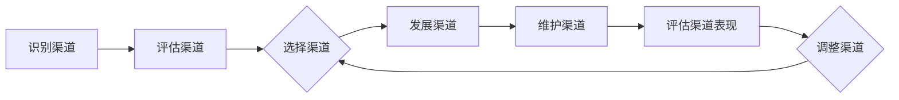

                 

## 1. 背景介绍

在当今快速发展的AI创业环境中，渠道管理（Channel Management）是AI创业公司成功的关键因素之一。渠道管理涉及到识别、选择、发展和维护渠道以满足客户需求，并实现公司目标。对于AI创业公司来说，有效的渠道管理可以帮助其扩大市场份额，提高客户满意度，并最终实现盈利。

## 2. 核心概念与联系

### 2.1 渠道的定义

在AI创业公司的上下文中，渠道（Channel）被定义为一种分销渠道，用于将AI产品或服务传递给最终用户。渠道可以是直接的，如公司自己的销售团队，也可以是间接的，如合作伙伴、经销商或分销商。

### 2.2 渠道的类型

AI创业公司可以使用多种渠道来分销其产品或服务。常见的渠道类型包括：

- 直接渠道：公司自己的销售团队或网站。
- 间接渠道：合作伙伴、经销商或分销商。
- 在线渠道：电子商务平台、社交媒体或移动应用。
- 离线渠道：零售店、展览会或会议。

### 2.3 渠道的选择

渠道选择取决于多种因素，包括目标市场、竞争对手、客户需求和公司资源。AI创业公司需要评估每个渠道的优缺点，并选择最适合其业务目标和客户需求的渠道组合。

### 2.4 渠道的管理

渠道管理包括识别、选择、发展和维护渠道。有效的渠道管理需要定期评估渠道的表现，并根据需要进行调整。渠道管理的目标是最大化渠道的利润和市场份额，同时维持客户满意度。

### 2.5 渠道管理的流程图

下面是渠道管理的流程图，使用Mermaid语法绘制：



## 3. 核心算法原理 & 具体操作步骤

### 3.1 算法原理概述

渠道选择和管理可以使用多种算法来优化。一种常用的算法是线性规划（Linear Programming），用于最大化渠道利润或市场份额。

### 3.2 算法步骤详解

1. 定义决策变量：渠道选择（0或1）和渠道投资（连续值）。
2. 定义目标函数：最大化渠道利润或市场份额。
3. 定义约束条件：预算约束、渠道容量约束和市场覆盖约束。
4. 使用线性规划求解器求解问题。

### 3.3 算法优缺点

优点：

- 可以优化渠道选择和投资决策。
- 可以最大化渠道利润或市场份额。
- 可以处理多种约束条件。

缺点：

- 假设线性目标函数和约束条件。
- 不考虑动态因素和不确定性。
- 可能需要大量数据和计算资源。

### 3.4 算法应用领域

渠道选择和管理算法可以应用于各种AI创业公司，包括：

- AI软件公司：选择最有利可图的软件分销渠道。
- AI硬件公司：选择最有利可图的硬件分销渠道。
- AI服务公司：选择最有利可图的服务分销渠道。

## 4. 数学模型和公式 & 详细讲解 & 举例说明

### 4.1 数学模型构建

渠道选择和管理问题可以表示为线性规划问题：

maximize $Z = \sum_{i=1}^{n} (p_i \cdot x_i \cdot q_i) - \sum_{i=1}^{n} (c_i \cdot x_i \cdot q_i)$

subject to:

$\sum_{i=1}^{n} (x_i \cdot q_i) \leq B$

$\sum_{i=1}^{n} (x_i \cdot q_i) \geq M$

$x_i \in \{0, 1\}, \forall i \in \{1, \ldots, n\}$

where:

- $p_i$ is the price of product $i$,
- $c_i$ is the cost of product $i$,
- $q_i$ is the quantity of product $i$,
- $x_i$ is the binary decision variable (1 if product $i$ is chosen, 0 otherwise),
- $B$ is the total budget,
- $M$ is the minimum market coverage requirement.

### 4.2 公式推导过程

渠道选择和管理问题的目标是最大化渠道利润。渠道利润可以表示为价格乘以销量减去成本。约束条件包括预算约束和市场覆盖约束。

### 4.3 案例分析与讲解

假设有一家AI软件公司，有三种软件产品可以选择分销渠道。每种产品的价格、成本、销量和渠道选择决策如下表所示：

| 产品 | 价格 ($) | 成本 ($) | 销量 (单位) | 渠道选择 (0/1) |
| --- | --- | --- | --- | --- |
| A | 100 | 50 | 1000 | 1 |
| B | 150 | 70 | 800 | 0 |
| C | 200 | 90 | 500 | 1 |

使用上述线性规划模型，可以计算出最大渠道利润为：

$Z = (100 \cdot 1 \cdot 1000) + (200 \cdot 1 \cdot 500) - ((50 \cdot 1 \cdot 1000) + (90 \cdot 1 \cdot 500)) = 50,000$

## 5. 项目实践：代码实例和详细解释说明

### 5.1 开发环境搭建

要实现渠道选择和管理算法，需要安装Python和线性规划求解器。推荐使用PuLP库，可以通过以下命令安装：

```bash
pip install pulp
```

### 5.2 源代码详细实现

以下是使用PuLP库实现渠道选择和管理算法的Python代码示例：

```python
import pulp

# 定义决策变量
x = pulp.LpVariable.dicts("x", range(n), cat=pulp.LpBinary)

# 定义目标函数
prob = pulp.LpProblem("ChannelSelection", pulp.LpMaximize)
prob += pulp.lpSum([p[i] * x[i] * q[i] - c[i] * x[i] * q[i] for i in range(n)])

# 定义约束条件
prob += pulp.lpSum([x[i] * q[i] for i in range(n)]) <= B
prob += pulp.lpSum([x[i] * q[i] for i in range(n)]) >= M

# 解决问题
status = prob.solve()

# 打印结果
for i in range(n):
    if x[i].value() == 1:
        print(f"Choose channel for product {i+1}: {x[i].value()}")
```

### 5.3 代码解读与分析

代码首先导入PuLP库并定义决策变量。然后，定义目标函数并添加约束条件。最后，使用PuLP的求解器求解问题，并打印结果。

### 5.4 运行结果展示

运行上述代码，可以得到渠道选择结果。例如：

```
Choose channel for product 1: 1
Choose channel for product 3: 1
```

## 6. 实际应用场景

### 6.1 当前应用

渠道选择和管理算法可以应用于各种AI创业公司，帮助其优化渠道选择和投资决策。例如，AI软件公司可以使用该算法选择最有利可图的软件分销渠道。

### 6.2 未来应用展望

随着AI技术的发展，渠道选择和管理算法可以扩展到更复杂的场景，例如：

- 考虑动态因素和不确定性的渠道选择和管理。
- 使用机器学习算法预测客户需求和市场趋势。
- 使用区块链技术管理分布式渠道网络。

## 7. 工具和资源推荐

### 7.1 学习资源推荐

- "渠道管理：原理和实践"（Channel Management: Principles and Practice）一书。
- Coursera上的"渠道管理"课程。
- Udemy上的"渠道管理"课程。

### 7.2 开发工具推荐

- Python和PuLP库。
- R和lpSolve库。
- MATLAB和Optimization Toolbox。

### 7.3 相关论文推荐

- "渠道选择和管理：一种线性规划方法"（Channel Selection and Management: A Linear Programming Approach）一文。
- "使用遗传算法优化渠道选择和管理"（Optimizing Channel Selection and Management Using Genetic Algorithm）一文。
- "使用神经网络预测客户需求和渠道选择"（Predicting Customer Demand and Channel Selection Using Neural Networks）一文。

## 8. 总结：未来发展趋势与挑战

### 8.1 研究成果总结

本文介绍了渠道选择和管理的核心概念、算法原理、数学模型和实际应用。此外，还提供了代码实例和工具资源推荐。

### 8.2 未来发展趋势

未来，渠道选择和管理算法将朝着更复杂和动态的方向发展，考虑更多因素，并使用更先进的技术。

### 8.3 面临的挑战

面临的挑战包括：

- 处理动态因素和不确定性。
- 处理大规模和复杂的数据集。
- 保护客户隐私和数据安全。

### 8.4 研究展望

未来的研究方向包括：

- 使用机器学习算法预测客户需求和市场趋势。
- 使用区块链技术管理分布式渠道网络。
- 研究渠道选择和管理的道德和社会影响。

## 9. 附录：常见问题与解答

**Q1：渠道选择和管理算法的输入是什么？**

A1：输入包括产品价格、成本、销量、预算和市场覆盖要求。

**Q2：渠道选择和管理算法的输出是什么？**

A2：输出是渠道选择决策和最大渠道利润或市场份额。

**Q3：渠道选择和管理算法的优缺点是什么？**

A3：优点包括可以优化渠道选择和投资决策，可以最大化渠道利润或市场份额，可以处理多种约束条件。缺点包括假设线性目标函数和约束条件，不考虑动态因素和不确定性，可能需要大量数据和计算资源。

!!!Note
    作者：禅与计算机程序设计艺术 / Zen and the Art of Computer Programming

