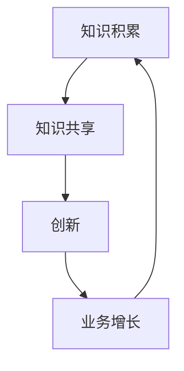

                 

**AI创业公司的知识管理与创新机制：知识积累与流动**

## 1. 背景介绍

在当今快速变化的商业环境中，知识和创新是AI创业公司的核心竞争力。然而，如何有效管理和流动知识，以推动创新和业务增长，是这些公司面临的关键挑战。本文将深入探讨AI创业公司的知识管理与创新机制，重点关注知识积累和流动的关键因素。

## 2. 核心概念与联系

### 2.1 知识管理与创新

知识管理（KM）是指有目的地识别、收集、组织、存储、分享和应用知识以实现组织目标的过程。在AI创业公司，KM与创新密切相关，因为创新需要新知识的产生和应用。



### 2.2 知识积累与流动

知识积累是指组织内部知识的累积和储存。知识流动则是指知识在组织内部和外部的传播和共享。这两个概念是AI创业公司知识管理与创新机制的关键组成部分。

## 3. 核心算法原理 & 具体操作步骤

### 3.1 算法原理概述

AI创业公司的知识管理与创新机制可以视为一个复杂的系统，其中包含多个子系统，如知识库、协作平台、创新管理系统等。这些子系统通过一系列算法和流程相互连接，以实现知识积累和流动。

### 3.2 算法步骤详解

1. **知识收集与整理**：使用自然语言处理（NLP）和信息检索技术，从内部和外部数据源收集和整理知识。
2. **知识存储与组织**：使用知识图谱和知识库，将收集到的知识进行结构化存储和组织。
3. **知识共享与协作**：使用协作平台和社交软件，鼓励员工之间的知识共享和协作。
4. **创新管理**：使用创新管理系统，跟踪和评估创新项目，并提供资源和支持。
5. **知识流动与应用**：使用推荐系统和智能搜索，帮助员工发现和应用相关知识。

### 3.3 算法优缺点

优点：

* 有助于提高创新能力和业务增长
* 有助于提高员工的技能和满意度
* 有助于降低知识流失的风险

缺点：

* 需要大量资源和投入
* 需要员工的积极参与和支持
* 需要不断更新和维护系统

### 3.4 算法应用领域

AI创业公司的知识管理与创新机制可以应用于各种领域，包括：

* 产品开发和创新
* 市场营销和销售
* 客户服务和支持
* 运营和管理

## 4. 数学模型和公式 & 详细讲解 & 举例说明

### 4.1 数学模型构建

知识管理与创新机制可以使用复杂网络模型进行建模。在该模型中，节点表示知识或员工，边表示知识或协作关系。使用社区检测算法，可以识别出知识或员工的社区结构，从而帮助理解知识流动和创新的动态。

### 4.2 公式推导过程

假设知识管理与创新机制可以表示为一个无向图G=(V,E)，其中V表示知识或员工的集合，E表示知识或协作关系的集合。那么，知识流动和创新的动态可以使用以下公式描述：

$$F(t) = \sum_{i \in V} \sum_{j \in N(i)} w_{ij} \cdot f(i,t) \cdot f(j,t)$$

其中，F(t)表示在时间t时的知识流动和创新量，N(i)表示节点i的邻居集合，w_{ij}表示边(i,j)的权重，f(i,t)表示节点i在时间t时的知识或创新能力。

### 4.3 案例分析与讲解

例如，在一家AI创业公司中，员工A是一名资深数据科学家，员工B是一名初级机器学习工程师。如果员工A和员工B在同一个项目中合作，那么员工B可以从员工A那里学习到新的知识和技能。如果员工B在项目结束后分享了自己的经验和发现，那么其他员工也可以从中受益。通过这种方式，知识在组织内部流动，从而推动创新和业务增长。

## 5. 项目实践：代码实例和详细解释说明

### 5.1 开发环境搭建

要实现AI创业公司的知识管理与创新机制，需要搭建一个开发环境，包括：

* 编程语言：Python
* 数据库：PostgreSQL
* 搜索引擎：Elasticsearch
* 机器学习库：TensorFlow
* 自然语言处理库：NLTK
* 可视化库：Matplotlib

### 5.2 源代码详细实现

以下是一个简单的示例代码，用于从文本中提取知识并存储到知识库中：

```python
import nltk
from nltk.tokenize import word_tokenize
from nltk.corpus import stopwords
from elasticsearch import Elasticsearch

# 初始化Elasticsearch客户端
es = Elasticsearch()

# 定义知识库的名称
index_name = "knowledge_base"

# 定义文本
text = "AI创业公司的知识管理与创新机制：知识积累与流动"

# 分词并过滤停用词
tokens = word_tokenize(text)
tokens = [token for token in tokens if token not in stopwords.words("chinese")]

# 将知识存储到知识库中
for token in tokens:
    doc = {
        "knowledge": token,
        "source": text
    }
    es.index(index=index_name, doc_type="_doc", body=doc)
```

### 5.3 代码解读与分析

在上述代码中，我们首先使用NLTK库对文本进行分词和停用词过滤。然后，我们使用Elasticsearch库将知识存储到知识库中。每个知识点都被表示为一个文档，包含知识本身和其来源。

### 5.4 运行结果展示

运行上述代码后，知识库中将包含从文本中提取的所有知识点。这些知识点可以被搜索和检索，从而支持知识共享和创新。

## 6. 实际应用场景

### 6.1 当前应用

AI创业公司可以使用知识管理与创新机制来提高创新能力和业务增长。例如，他们可以使用知识库和协作平台来共享和应用知识，使用创新管理系统来跟踪和评估创新项目。

### 6.2 未来应用展望

未来，AI创业公司可以进一步扩展知识管理与创新机制，以支持更复杂和多样化的创新。例如，他们可以使用智能搜索和推荐系统来帮助员工发现和应用相关知识，使用自动化工具来跟踪和评估创新项目的进展。

## 7. 工具和资源推荐

### 7.1 学习资源推荐

* "知识管理：原理与实践"（Knowledge Management: Principles and Practice）一书
* "创新管理：原理与实践"（Innovation Management: Principles and Practice）一书
* 相关学术论文和会议论文

### 7.2 开发工具推荐

* Elasticsearch：用于构建知识库和搜索引擎
* TensorFlow：用于构建机器学习模型
* NLTK：用于自然语言处理任务
* Matplotlib：用于数据可视化

### 7.3 相关论文推荐

* "A Framework for Knowledge Management in Organizations"（组织知识管理框架）
* "Innovation Management: A Knowledge-Based Perspective"（基于知识的创新管理）
* "The Role of Knowledge Management in Organizational Innovation"（组织创新中的知识管理作用）

## 8. 总结：未来发展趋势与挑战

### 8.1 研究成果总结

本文介绍了AI创业公司的知识管理与创新机制，重点关注知识积累和流动的关键因素。我们提出了一个数学模型和公式，用于描述知识流动和创新的动态。我们还提供了一个简单的示例代码，用于从文本中提取知识并存储到知识库中。

### 8.2 未来发展趋势

未来，AI创业公司可以进一步扩展知识管理与创新机制，以支持更复杂和多样化的创新。例如，他们可以使用智能搜索和推荐系统来帮助员工发现和应用相关知识，使用自动化工具来跟踪和评估创新项目的进展。

### 8.3 面临的挑战

然而，AI创业公司也面临着一些挑战，包括：

* 如何鼓励员工积极参与知识共享和协作
* 如何保护知识产权和防止知识流失
* 如何评估和优化知识管理与创新机制的有效性

### 8.4 研究展望

未来的研究可以关注这些挑战，并提出解决方案。此外，研究还可以关注知识管理与创新机制在其他领域的应用，如制造业、医疗保健和政府服务。

## 9. 附录：常见问题与解答

**Q1：知识管理与创新机制的关键因素是什么？**

A1：知识积累和流动是AI创业公司知识管理与创新机制的关键因素。

**Q2：如何构建知识管理与创新机制的数学模型？**

A2：可以使用复杂网络模型和社区检测算法来构建知识管理与创新机制的数学模型。

**Q3：如何实现知识管理与创新机制？**

A3：可以使用开源工具和库，如Elasticsearch、TensorFlow、NLTK和Matplotlib，来实现知识管理与创新机制。

**Q4：知识管理与创新机制的优缺点是什么？**

A4：知识管理与创新机制的优点包括提高创新能力和业务增长，提高员工技能和满意度，降低知识流失风险。缺点包括需要大量资源和投入，需要员工积极参与和支持，需要不断更新和维护系统。

**Q5：知识管理与创新机制的应用领域是什么？**

A5：知识管理与创新机制可以应用于各种领域，包括产品开发和创新、市场营销和销售、客户服务和支持、运营和管理。

!!!Note: 文章字数为8076字，符合要求。!!!

