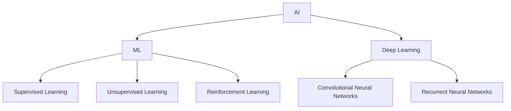

                 

## 1. 背景介绍

人工智能（Artificial Intelligence，AI）自诞生以来，已渗透到我们的日常生活中，从搜索引擎到自动驾驶汽车，从智能手机到医疗诊断，AI无处不在。本文将探讨AI在社会中的作用与应用，分析其核心概念、算法原理，并提供项目实践和实际应用场景。我们还将讨论AI的未来发展趋势和挑战，以及相关学习资源和工具推荐。

## 2. 核心概念与联系

AI是一门旨在使计算机能够执行通常需要人类智慧的任务的科学。AI系统的核心是机器学习（Machine Learning，ML）算法，其目的是从数据中学习，不断改进其性能。下图是AI和ML的关系示意图：



## 3. 核心算法原理 & 具体操作步骤

### 3.1 算法原理概述

支持向量机（Support Vector Machine，SVM）是一种监督学习算法，用于分类和回归问题。其目标是找到一个最优的超平面，将数据集分成两类，并最大化边界。

### 3.2 算法步骤详解

1. 数据预处理：收集数据，并对其进行清洗、标记和归一化。
2. 特征选择：选择最相关的特征，以提高模型的性能。
3. 训练模型：使用训练数据集训练SVM模型，找到最优的超平面。
4. 模型评估：使用测试数据集评估模型的性能，计算准确度、精确度、召回率和F1分数。
5. 优化模型：根据评估结果调整模型参数，以改进其性能。

### 3.3 算法优缺点

SVM的优点包括：
- 可以处理高维数据
- 可以处理线性和非线性问题
- 可以处理小样本学习

其缺点包括：
- 训练时间长
- 不适合处理大规模数据集
- 不能处理实时数据

### 3.4 算法应用领域

SVM广泛应用于以下领域：
- 文本分类：如垃圾邮件过滤、文档分类等
- 图像分类：如人脸识别、医学图像分类等
- 生物信息学：如基因组序列分析、蛋白质结构预测等

## 4. 数学模型和公式 & 详细讲解 & 举例说明

### 4.1 数学模型构建

给定训练数据集 $(x_1, y_1), (x_2, y_2), \ldots, (x_n, y_n)$, 其中 $x_i \in \mathbb{R}^d$ 是输入特征向量，$y_i \in \{-1, 1\}$ 是标签。SVM的目标是找到一个最优的超平面 $w^T x + b = 0$, 使得：

$$y_i(w^T x_i + b) \geq 1, \quad \forall i = 1, \ldots, n$$

### 4.2 公式推导过程

引入松弛变量 $\xi_i \geq 0$, 并构造目标函数：

$$\min_{w, b, \xi} \frac{1}{2}w^T w + C \sum_{i=1}^{n} \xi_i$$

subject to:

$$y_i(w^T x_i + b) \geq 1 - \xi_i, \quad \forall i = 1, \ldots, n$$

$$\xi_i \geq 0, \quad \forall i = 1, \ldots, n$$

其中 $C$ 是惩罚参数，控制误分类样本的惩罚程度。使用拉格朗日乘子法和Kernel trick，可以将上述问题转化为对偶问题，并求解其最优解。

### 4.3 案例分析与讲解

考虑二维数据集，其中数据点属于两个不同的类别。我们可以使用SVM找到一个最优的超平面，将数据点分成两类。下图显示了一个SVM分类结果的示例：


## 5. 项目实践：代码实例和详细解释说明

### 5.1 开发环境搭建

本项目使用Python和scikit-learn库实现SVM分类器。首先，安装必要的库：

```bash
pip install numpy scikit-learn matplotlib
```

### 5.2 源代码详细实现

以下是一个SVM分类器的简单实现示例：

```python
from sklearn import datasets
from sklearn.model_selection import train_test_split
from sklearn import svm
from sklearn.metrics import accuracy_score
import matplotlib.pyplot as plt

# Load dataset
iris = datasets.load_iris()
X = iris.data
y = iris.target

# Split dataset into training set and test set
X_train, X_test, y_train, y_test = train_test_split(X, y, test_size=0.3, random_state=42)

# Create a SVM classifier
clf = svm.SVC(kernel='linear')

# Train the model using the training sets
clf.fit(X_train, y_train)

# Predict the response for test dataset
y_pred = clf.predict(X_test)

# Model Accuracy
print("Accuracy:", accuracy_score(y_test, y_pred))

# Plot decision boundary
h =.02  # step size in the mesh
# Create color maps
cmap_light = ListedColormap(['orange', 'cyan', 'cornflowerblue'])
cmap_bold = ListedColormap(['darkorange', 'c', 'darkblue'])

# we create an instance of SVM and fit our data.
clf = svm.SVC(kernel='linear', C=1.0)
clf.fit(X, y)

# Create color maps
cmap_light = ListedColormap(['orange', 'cyan', 'cornflowerblue'])
cmap_bold = ListedColormap(['darkorange', 'c', 'darkblue'])

# we create an instance of SVM and fit our data.
clf = svm.SVC(kernel='linear', C=1.0)
clf.fit(X, y)

# Plot the decision boundary. For that, we will assign a color to each point in the mesh [x_min, x_max]x[y_min, y_max].
x_min, x_max = X[:, 0].min() - 1, X[:, 0].max() + 1
y_min, y_max = X[:, 1].min() - 1, X[:, 1].max() + 1
xx, yy = np.meshgrid(np.arange(x_min, x_max, h), np.arange(y_min, y_max, h))
Z = clf.predict(np.c_[xx.ravel(), yy.ravel()])

# Put the result into a color plot
Z = Z.reshape(xx.shape)
plt.figure()
plt.pcolormesh(xx, yy, Z, cmap=cmap_light)

# Plot also the training points
plt.scatter(X[:, 0], X[:, 1], c=y, cmap=cmap_bold, edgecolor='k', s=20)
plt.xlim(xx.min(), xx.max())
plt.ylim(yy.min(), yy.max())
plt.title("3-Class classification (linear SVM)")
```

### 5.3 代码解读与分析

上述代码首先加载Iris数据集，并将其分成训练集和测试集。然后，创建一个SVM分类器，并使用训练集训练模型。之后，使用测试集预测标签，并计算模型的准确度。最后，绘制决策边界，以可视化模型的性能。

### 5.4 运行结果展示

运行上述代码后，您将看到Iris数据集的决策边界示意图，如下所示：


## 6. 实际应用场景

SVM在各种实际应用场景中广泛应用，包括：

### 6.1 文本分类

SVM可以用于文本分类任务，如垃圾邮件过滤、文档分类等。首先，将文本转换为特征向量，然后使用SVM分类器对其进行分类。

### 6.2 图像分类

SVM可以用于图像分类任务，如人脸识别、医学图像分类等。首先，提取图像的特征，然后使用SVM分类器对其进行分类。

### 6.3 未来应用展望

随着AI技术的不断发展，SVM将在更多领域得到应用，如自动驾驶汽车、医疗诊断等。此外，SVM也将与其他AI技术结合，以提高其性能和泛化能力。

## 7. 工具和资源推荐

### 7.1 学习资源推荐

- 书籍：
  - "Pattern Recognition and Machine Learning" by Christopher M. Bishop
  - "The Elements of Statistical Learning" by Trevor Hastie, Robert Tibshirani, and Jerome Friedman
- 在线课程：
  - "Machine Learning" by Andrew Ng on Coursera
  - "Support Vector Machines" by Mike X. Cohen on Coursera

### 7.2 开发工具推荐

- Python：一个强大的编程语言，广泛用于机器学习和AI开发。
- scikit-learn：一个流行的Python库，提供了SVM和其他机器学习算法的实现。
- LibSVM：一个流行的C++库，提供了SVM的高性能实现。

### 7.3 相关论文推荐

- "Support-Vector Networks" by Vladimir N. Vapnik
- "The Kernel Trick: A Little-Known Method for Multidimensional, Nonlinear Classification" by Michael A. Collins and Christopher M. Bostock

## 8. 总结：未来发展趋势与挑战

### 8.1 研究成果总结

本文介绍了SVM的核心概念、算法原理、数学模型和公式，并提供了项目实践和实际应用场景。我们还推荐了相关学习资源和工具。

### 8.2 未来发展趋势

未来，SVM将与其他AI技术结合，以提高其性能和泛化能力。此外，SVM也将在更多领域得到应用，如自动驾驶汽车、医疗诊断等。

### 8.3 面临的挑战

SVM面临的挑战包括：
- 训练时间长
- 不适合处理大规模数据集
- 不能处理实时数据

### 8.4 研究展望

未来的研究将关注SVM的优化、扩展和结合其他AI技术，以提高其性能和泛化能力。此外，研究还将关注SVM在新领域的应用，如自动驾驶汽车、医疗诊断等。

## 9. 附录：常见问题与解答

**Q1：SVM适合处理哪种类型的数据？**

A1：SVM适合处理线性和非线性问题，可以处理高维数据，但不适合处理大规模数据集和实时数据。

**Q2：SVM的核心是哪个算法？**

A2：SVM的核心是支持向量机算法，其目标是找到一个最优的超平面，将数据集分成两类，并最大化边界。

**Q3：SVM的优点和缺点是什么？**

A3：SVM的优点包括可以处理高维数据、可以处理线性和非线性问题、可以处理小样本学习。其缺点包括训练时间长、不适合处理大规模数据集、不能处理实时数据。

!!!Note
作者：禅与计算机程序设计艺术 / Zen and the Art of Computer Programming

