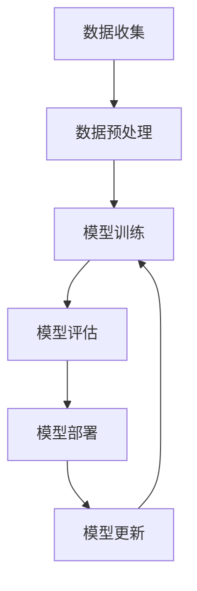

                 

## 1. 背景介绍

当前，人工智能（AI）技术正在迅速发展，大模型（Large Language Models）已经成为AI领域的热门话题之一。这些模型具有强大的理解和生成文本的能力，在自然语言处理（NLP）、机器翻译、文本摘要等领域取得了显著的成就。然而，随着大模型的不断发展，市场竞争也日益激烈，创业者面临着严峻的挑战。本文将探讨大模型创业的未来市场挑战，并提供一些应对策略。

## 2. 核心概念与联系

### 2.1 大模型的定义

大模型是指具有数十亿甚至数千亿参数的神经网络模型，这些模型通过大量的数据训练，能够学习并理解复杂的数据结构和模式。大模型的优势在于它们可以处理大规模的数据，并从中提取有用的信息。

### 2.2 大模型与传统模型的区别

与传统的小模型相比，大模型具有更强的泛化能力，可以处理更复杂的任务。然而，大模型也存在一些挑战，例如训练成本高、计算资源需求大、模型解释性差等。

### 2.3 大模型创业的机遇与挑战

大模型创业的机遇在于其强大的能力可以带来新的商业模式和应用场景。然而，创业者也面临着来自大型科技公司的激烈竞争，以及模型训练和部署的高成本等挑战。

### 2.4 核心概念原理与架构的 Mermaid 流程图



## 3. 核心算法原理 & 具体操作步骤

### 3.1 算法原理概述

大模型的核心算法是Transformer模型，它使用自注意力机制（Self-Attention）和位置编码（Positional Encoding）来处理序列数据。Transformer模型的优势在于它可以并行处理序列数据，并捕捉到数据之间的长程依赖关系。

### 3.2 算法步骤详解

1. 数据预处理：收集并预处理数据，包括文本清洗、分词、标记等步骤。
2. 模型训练：使用预处理后的数据训练Transformer模型，优化模型参数以最小化损失函数。
3. 模型评估：评估模型的性能，使用指标如准确率、精确度、召回率等。
4. 模型部署：部署模型到生产环境，为用户提供服务。
5. 模型更新：根据用户反馈和新数据，更新模型参数，提高模型性能。

### 3.3 算法优缺点

优点：

* 可以并行处理序列数据
* 可以捕捉到数据之间的长程依赖关系
* 具有强大的泛化能力

缺点：

* 训练成本高
* 计算资源需求大
* 模型解释性差

### 3.4 算法应用领域

大模型的应用领域包括自然语言处理（NLP）、机器翻译、文本摘要、问答系统等。此外，大模型还可以应用于图像、视频等多模态数据的处理。

## 4. 数学模型和公式 & 详细讲解 & 举例说明

### 4.1 数学模型构建

大模型的数学模型是基于Transformer模型构建的。Transformer模型使用自注意力机制和位置编码来处理序列数据。自注意力机制可以捕捉到数据之间的长程依赖关系，位置编码则为模型提供了序列数据的位置信息。

### 4.2 公式推导过程

自注意力机制的公式如下：

$$Attention(Q, K, V) = softmax(\frac{QK^T}{\sqrt{d_k}})V$$

其中，Q、K、V分别表示查询、键、值向量，d\_k表示键向量的维度。

位置编码的公式如下：

$$PE_{(pos, 2i)} = sin(\frac{pos}{10000^{2i/d_{model}}})$$
$$PE_{(pos, 2i+1)} = cos(\frac{pos}{10000^{2i/d_{model}}})$$

其中，pos表示位置，i表示维度，d\_model表示模型的维度。

### 4.3 案例分析与讲解

例如，在机器翻译任务中，大模型可以将输入的源语言文本转换为目标语言文本。自注意力机制可以帮助模型理解源语言文本的上下文，位置编码则提供了文本的位置信息。通过训练，模型学习到源语言文本与目标语言文本之间的映射关系，从而实现机器翻译。

## 5. 项目实践：代码实例和详细解释说明

### 5.1 开发环境搭建

大模型的开发需要强大的计算资源，包括GPU、内存等。推荐使用NVIDIA A100 GPU，内存不低于128GB。开发环境可以使用PyTorch或TensorFlow框架搭建。

### 5.2 源代码详细实现

大模型的源代码可以参考开源项目，如Hugging Face的Transformers库。以下是一个简单的大模型训练示例：

```python
from transformers import AutoTokenizer, AutoModelForSeq2SeqLM, Trainer, TrainingArguments

tokenizer = AutoTokenizer.from_pretrained("t5-base")
model = AutoModelForSeq2SeqLM.from_pretrained("t5-base")

training_args = TrainingArguments(
    output_dir="./results",
    num_train_epochs=3,
    per_device_train_batch_size=16,
    per_device_eval_batch_size=64,
    warmup_steps=500,
    weight_decay=0.01,
    logging_dir="./logs",
)

trainer = Trainer(
    model=model,
    args=training_args,
    train_dataset=train_dataset,
    eval_dataset=eval_dataset,
)

trainer.train()
```

### 5.3 代码解读与分析

上述代码首先导入了Transformers库中的分词器和模型，然后设置了训练参数，并创建了Trainer对象。Trainer对象负责模型的训练过程，包括数据加载、模型优化等。

### 5.4 运行结果展示

训练完成后，模型的性能可以通过评估集的指标来衡量。例如，在机器翻译任务中，可以使用BLEU指标来评估模型的性能。

## 6. 实际应用场景

### 6.1 当前应用场景

大模型当前的应用场景包括自然语言处理（NLP）、机器翻译、文本摘要、问答系统等。此外，大模型还可以应用于图像、视频等多模态数据的处理。

### 6.2 未来应用展望

未来，大模型的应用将会扩展到更多领域，包括自动驾驶、医疗诊断、金融风控等。大模型还将与物联网、边缘计算等技术结合，实现更智能化的应用。

## 7. 工具和资源推荐

### 7.1 学习资源推荐

* "Attention is All You Need"论文：<https://arxiv.org/abs/1706.03762>
* Hugging Face Transformers库：<https://huggingface.co/transformers/>
* Stanford CS224n Natural Language Processing with Deep Learning课程：<https://online.stanford.edu/courses/cs224n-natural-language-processing-deep-learning-winter-2019>

### 7.2 开发工具推荐

* PyTorch：<https://pytorch.org/>
* TensorFlow：<https://www.tensorflow.org/>
* NVIDIA A100 GPU：<https://www.nvidia.com/en-us/data-center/a100/>

### 7.3 相关论文推荐

* "BERT: Pre-training of Deep Bidirectional Transformers for Language Understanding"：<https://arxiv.org/abs/1810.04805>
* "T5: Text-to-Text Transfer Transformer"：<https://arxiv.org/abs/1910.10683>

## 8. 总结：未来发展趋势与挑战

### 8.1 研究成果总结

大模型在自然语言处理、机器翻译等领域取得了显著的成就。然而，大模型也存在一些挑战，包括训练成本高、计算资源需求大、模型解释性差等。

### 8.2 未来发展趋势

未来，大模型的发展趋势包括模型规模的不断扩大、多模态数据的处理、模型解释性的提高等。此外，大模型还将与物联网、边缘计算等技术结合，实现更智能化的应用。

### 8.3 面临的挑战

大模型创业面临的挑战包括来自大型科技公司的激烈竞争、模型训练和部署的高成本等。创业者需要不断创新，寻找新的商业模式和应用场景。

### 8.4 研究展望

未来的研究方向包括模型压缩、模型解释性提高、多模态数据处理等。此外，大模型还将与物联网、边缘计算等技术结合，实现更智能化的应用。

## 9. 附录：常见问题与解答

### 9.1 什么是大模型？

大模型是指具有数十亿甚至数千亿参数的神经网络模型，这些模型通过大量的数据训练，能够学习并理解复杂的数据结构和模式。

### 9.2 大模型与传统模型的区别是什么？

与传统的小模型相比，大模型具有更强的泛化能力，可以处理更复杂的任务。然而，大模型也存在一些挑战，例如训练成本高、计算资源需求大、模型解释性差等。

### 9.3 大模型创业的机遇和挑战是什么？

大模型创业的机遇在于其强大的能力可以带来新的商业模式和应用场景。然而，创业者也面临着来自大型科技公司的激烈竞争，以及模型训练和部署的高成本等挑战。

---

作者：禅与计算机程序设计艺术 / Zen and the Art of Computer Programming

