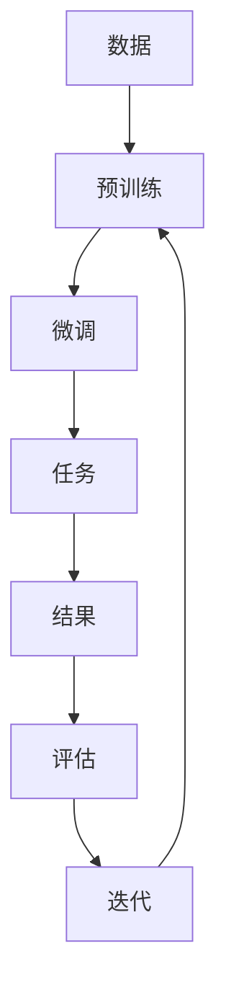

                 

## 1. 背景介绍

在当今快速发展的AI时代，大模型已成为各行业竞争的关键。这些模型的能力和规模正在迅速增长，为企业带来了前所未有的机遇和挑战。本文将探讨AI大模型创业的关键因素，并提供策略以应对未来的竞争对手。

## 2. 核心概念与联系

### 2.1 AI大模型的定义

AI大模型是指具有数十亿甚至数千亿参数的模型，能够处理大量数据并从中学习复杂的模式。它们通常基于Transformer架构，可以执行各种任务，如自然语言处理、图像识别和预测等。

### 2.2 关键概念

- **模型规模（Scale）**：大模型的关键特征之一是其规模。更大的模型通常能够学习更复杂的模式，但也需要更多的计算资源。
- **预训练（Pre-training）**：大模型通常首先在大量数据上进行预训练，然后在特定任务上进行微调。这使得它们可以在各种任务上表现出色。
- **指数级增长（Exponential Growth）**：AI大模型的性能和规模每年都在以指数级速度增长。这为企业带来了巨大的机遇和挑战。

### 2.3 核心概念联系 Mermaid 流程图



## 3. 核心算法原理 & 具体操作步骤

### 3.1 算法原理概述

大模型的核心是Transformer架构，它使用自注意力机制来处理序列数据。自注意力机制允许模型在处理输入时考虑其上下文，从而捕获长期依赖关系。

### 3.2 算法步骤详解

1. **输入表示**：将输入数据（如文本或图像）转换为模型可以处理的表示形式。
2. **位置编码**：为序列数据添加位置信息，以帮助模型理解数据的顺序。
3. **自注意力**：使用自注意力机制处理输入序列，生成上下文相关的表示。
4. **Feed Forward Network（FFN）**：对自注意力输出进行非线性变换，以学习更复杂的表示。
5. **堆叠**：重复步骤3和4，以构建多层模型。
6. **输出**：将模型输出转换为最终结果（如文本或分类标签）。

### 3.3 算法优缺点

**优点**：
- 可以学习长期依赖关系
- 在各种任务上表现出色
- 可以通过微调适应新任务

**缺点**：
- 计算资源需求高
- 训练时间长
- 存在过拟合和泄漏问题

### 3.4 算法应用领域

大模型在自然语言处理、图像识别、推荐系统、生成式模型等领域都有广泛应用。它们还可以用于科学研究、自动驾驶、医疗保健等领域。

## 4. 数学模型和公式 & 详细讲解 & 举例说明

### 4.1 数学模型构建

大模型的数学模型可以表示为：

$$M(\theta) = f(x, \theta)$$

其中，$M(\theta)$表示模型，$f$表示模型的函数，$x$表示输入数据，$\theta$表示模型参数。

### 4.2 公式推导过程

大模型的训练目标是最小化损失函数：

$$\mathcal{L}(\theta) = -\frac{1}{N}\sum_{i=1}^{N}\log p(y_i|x_i;\theta)$$

其中，$N$表示数据集大小，$y_i$表示第$i$个样本的标签，$p(y_i|x_i;\theta)$表示模型预测第$i$个样本标签的概率。

### 4.3 案例分析与讲解

例如，在文本分类任务中，输入$x$是一段文本，输出$y$是文本的类别。模型的目标是学习文本表示，并预测其类别。通过最小化损失函数，模型可以学习到有用的表示，从而提高分类准确性。

## 5. 项目实践：代码实例和详细解释说明

### 5.1 开发环境搭建

要训练大模型，需要一个强大的开发环境。推荐使用GPU加速的计算机，并安装必要的软件库，如PyTorch或TensorFlow。

### 5.2 源代码详细实现

以下是一个简单的Transformer模型实现的示例：

```python
import torch
import torch.nn as nn

class Transformer(nn.Module):
    def __init__(self, d_model, n_head, n_layers, ff_dim):
        super(Transformer, self).__init__()
        self.encoder_layers = nn.ModuleList([
            nn.TransformerEncoderLayer(d_model, n_head, ff_dim)
            for _ in range(n_layers)
        ])
        self.encoder = nn.TransformerEncoder(self.encoder_layers, n_layers)

    def forward(self, src):
        output = self.encoder(src)
        return output
```

### 5.3 代码解读与分析

这个模型定义了一个Transformer编码器，它由多个Transformer编码器层组成。每个层都包含自注意力机制和Feed Forward Network。模型的前向传播方法接受输入序列，并通过编码器生成输出。

### 5.4 运行结果展示

在训练和评估模型后，可以使用以下代码生成示例输出：

```python
model = Transformer(d_model=512, n_head=8, n_layers=6, ff_dim=2048)
input = torch.randn(10, 20, 512)  # 10 sequences, 20 tokens each, 512 dimensions
output = model(input)
print(output.shape)  # (10, 20, 512)
```

## 6. 实际应用场景

### 6.1 当前应用

大模型已在各行业得到广泛应用，如搜索引擎、虚拟助手、推荐系统等。它们还被用于科学研究，如物理模拟和药物发现。

### 6.2 未来应用展望

未来，大模型将继续在更多领域得到应用，如自动驾驶、医疗保健和人工智能安全。它们还将帮助我们理解和解决复杂的全球性挑战，如气候变化和疾病预防。

## 7. 工具和资源推荐

### 7.1 学习资源推荐

- **书籍**："Attention is All You Need"（Vaswani et al., 2017）
- **课程**：Stanford CS224n Natural Language Processing with Deep Learning
- **博客**：Hugging Face Blog（https://blog.huggingface.co/）

### 7.2 开发工具推荐

- **框架**：PyTorch、TensorFlow
- **库**：Hugging Face Transformers、Fairseq
- **硬件**：NVIDIA GPUs、TPUs

### 7.3 相关论文推荐

- "Language Models are Few-Shot Learners"（Brown et al., 2020）
- "T5: Text-to-Text Transfer Transformer"（Raffel et al., 2019）
- "DALL-E: Generating Images from Textual Descriptions"（Ramesh et al., 2021）

## 8. 总结：未来发展趋势与挑战

### 8.1 研究成果总结

本文介绍了AI大模型的关键概念、算法原理、数学模型和应用场景。我们还提供了一个简单的Transformer模型实现示例。

### 8.2 未来发展趋势

未来，大模型的规模和能力将继续增长。我们将看到更大、更智能的模型，能够处理更复杂的任务。此外，大模型将更加通用，可以在各种任务上表现出色。

### 8.3 面临的挑战

然而，大模型也面临着挑战，如计算资源需求高、训练时间长、存在过拟合和泄漏问题。此外，大模型的解释性和可靠性也需要进一步提高。

### 8.4 研究展望

未来的研究将关注于提高大模型的效率和可靠性，开发新的训练策略和模型架构。我们还将看到大模型在更多领域的应用，如医疗保健和人工智能安全。

## 9. 附录：常见问题与解答

**Q：大模型需要多少计算资源？**

**A**：大模型需要大量的计算资源，通常需要数百甚至数千个GPU来训练。此外，大模型还需要大量的数据来预训练。

**Q：大模型的训练时间有多长？**

**A**：大模型的训练时间取决于模型规模和数据量。通常，训练大模型需要数天甚至数周的时间。

**Q：大模型存在哪些挑战？**

**A**：大模型存在的挑战包括计算资源需求高、训练时间长、存在过拟合和泄漏问题。此外，大模型的解释性和可靠性也需要进一步提高。

---

作者：禅与计算机程序设计艺术 / Zen and the Art of Computer Programming

