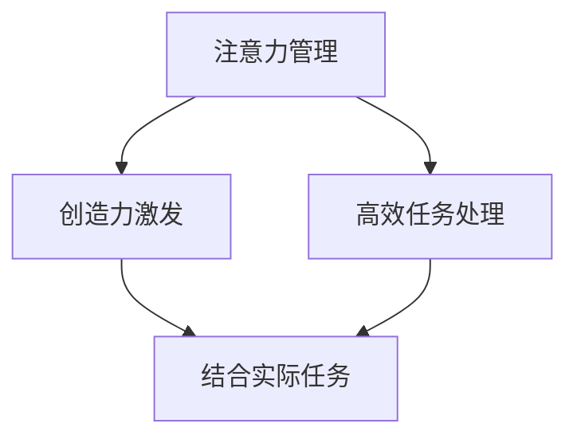

                 

# 注意力管理与创造力激发实践：在专注和头脑风暴中找到灵感

## 1. 背景介绍

在当今信息爆炸的时代，注意力成为了一种稀缺资源。如何在海量信息中聚焦核心内容，如何激发个人和团队的创造力，成为了提升工作效率和创新能力的关键。注意力管理和创造力激发，成为了现代工作和学习中不可或缺的环节。本文旨在探讨如何通过注意力管理和头脑风暴，在纷繁复杂的信息海洋中寻找灵感，驱动个人和团队向更高目标迈进。

## 2. 核心概念与联系

### 2.1 核心概念概述

注意力管理（Attention Management）和创造力激发（Creativity Activation）是两个关键概念，它们相互促进，共同构成了一个高效的工作和创新系统。

- **注意力管理**：是指在处理信息时，如何有效地分配注意力，确保在处理关键任务时能够集中精力，避免分散注意力导致效率低下。

- **创造力激发**：是指在头脑风暴和创意过程中，如何通过各种方法激发个人和团队的创新思维，寻找新颖的解决方案。

这两个概念的联系体现在：有效管理注意力可以确保我们能够集中精力在核心任务上，为创造性思维提供基础。而创造力激发的关键在于打破常规，寻找新的解决方式。只有将注意力管理与创造力激发相结合，才能最大化地提升工作效率和创新能力。

### 2.2 核心概念原理和架构的 Mermaid 流程图



## 3. 核心算法原理 & 具体操作步骤

### 3.1 算法原理概述

注意力管理和创造力激发可以通过一系列技术和方法来实现。以下是其基本原理和操作步骤：

- **注意力管理**：
  - **目标设定**：明确任务目标，分清轻重缓急，确保专注力集中在关键任务上。
  - **时间块分配**：将时间划分为多个时间块，每个时间块专注于单一任务。
  - **环境优化**：减少干扰，创造一个有利于集中注意力的工作环境。

- **创造力激发**：
  - **头脑风暴**：通过集思广益的方式，激发团队成员的创新思维。
  - **创新技术**：应用如随机重启法、逆向思维、思维导图等方法，引导思维向新颖方向发展。
  - **多任务切换**：通过交替进行不同类型任务，激发新的思维火花。

### 3.2 算法步骤详解

#### 注意力管理

1. **任务目标设定**：
   - 明确当前任务的核心目标。例如，一个项目经理需要确保团队按时完成任务。
   - 列出所有相关任务和子任务，并确定优先级。

2. **时间块分配**：
   - 将一天的时间划分为多个时间块，每个时间块专注处理单一任务。
   - 每个时间块开始前，设定明确的时间目标和预期成果。

3. **环境优化**：
   - 选择一个安静的工作环境，减少干扰。
   - 关闭不必要的通知和应用，专注于当前任务。

#### 创造力激发

1. **头脑风暴**：
   - 组织团队进行头脑风暴，鼓励自由思考，记录所有想法，不论好坏。
   - 使用白板或在线工具记录和整理想法，确保每个成员的想法都能被看到和讨论。

2. **创新技术**：
   - 应用如随机重启法，从不同的角度重新审视问题，寻找新的解决方案。
   - 使用逆向思维，从问题的相反面思考，寻找反向解决方案。
   - 使用思维导图，将复杂的思维过程可视化，帮助理解问题的不同方面。

3. **多任务切换**：
   - 交替进行不同类型的任务，如技术任务与创意任务。
   - 通过切换不同类型的任务，激发新的思维火花。

### 3.3 算法优缺点

#### 注意力管理

**优点**：
- 提高工作效率，减少时间浪费。
- 明确任务目标，确保专注力集中在关键任务上。

**缺点**：
- 过于严格的时间块划分可能会造成压力和疲劳。
- 外部干扰难以完全避免。

#### 创造力激发

**优点**：
- 激发团队成员的创新思维，寻找新的解决方案。
- 多样化的思维方法可以带来更多的创新点子。

**缺点**：
- 头脑风暴过程可能会耗费大量时间。
- 并非所有想法都有实际价值，可能会浪费时间和资源。

### 3.4 算法应用领域

注意力管理与创造力激发的应用范围非常广泛，涵盖个人工作、团队协作、企业创新等多个领域。以下是一些具体应用场景：

- **个人工作**：在撰写报告、编程开发、学习新知识等过程中，应用注意力管理和创造力激发技术，提升工作效率和创新能力。
- **团队协作**：在项目规划、问题解决、产品设计等团队活动中，通过头脑风暴和创新技术，激发团队成员的潜力。
- **企业创新**：在产品研发、市场推广、服务优化等企业活动中，通过系统化的创新方法，推动企业发展。

## 4. 数学模型和公式 & 详细讲解 & 举例说明

### 4.1 数学模型构建

注意力管理和创造力激发的数学模型可以从多个角度进行构建。以下是一个基本的数学模型框架：

- **注意力管理模型**：
  - 输入：当前任务、时间块划分、环境因素。
  - 输出：任务完成度、时间利用率。

- **创造力激发模型**：
  - 输入：任务类型、头脑风暴工具、团队成员背景。
  - 输出：创新点子数量、创意质量。

### 4.2 公式推导过程

#### 注意力管理模型

- 时间块划分公式：
  $$
  T = \sum_{i=1}^{N} t_i
  $$
  其中，$T$为总时间，$t_i$为第$i$个时间块的时间长度。

- 任务完成度公式：
  $$
  C = \frac{\sum_{i=1}^{N} c_i}{T}
  $$
  其中，$C$为任务完成度，$c_i$为第$i$个时间块的任务完成情况。

#### 创造力激发模型

- 创新点子数量公式：
  $$
  I = \frac{\sum_{j=1}^{M} i_j}{N}
  $$
  其中，$I$为创新点子数量，$i_j$为第$j$个头脑风暴中提出的点子数量，$N$为头脑风暴次数。

- 创意质量评估公式：
  $$
  Q = \frac{\sum_{j=1}^{M} q_j}{I}
  $$
  其中，$Q$为创意质量，$q_j$为第$j$个头脑风暴中创意的质量评分。

### 4.3 案例分析与讲解

假设一个软件开发团队，每天工作8小时，团队成员在完成当前任务A时，使用时间块管理技巧，将时间划分为两个时间块，每个时间块4小时。在第一时间块内，团队专注于编写代码，第二时间块内进行需求分析和技术讨论。通过这种方法，团队成员在每个时间块内能够高效完成代码编写和需求讨论，提高了任务完成度。

此外，团队还定期组织头脑风暴，鼓励成员提出新的功能需求和优化方案。使用逆向思维和思维导图，团队能够从不同的角度审视问题，找到创新的解决方案。通过这种方法，团队能够不断推动产品创新，提升用户满意度。

## 5. 项目实践：代码实例和详细解释说明

### 5.1 开发环境搭建

为了实践注意力管理和创造力激发的技术，我们可以使用一些开源工具和库。以下是一些推荐的开发环境：

- **时间块管理工具**：RescueTime、Toggl、Trello等，可以帮助团队成员记录时间分配情况。
- **头脑风暴工具**：Miro、MURAL、Trello等，用于组织头脑风暴会议，记录和整理创意。
- **项目管理工具**：Jira、Asana、Trello等，用于任务管理和进度跟踪。

### 5.2 源代码详细实现

以下是一些示例代码，展示了如何使用Python实现注意力管理和创造力激发的功能。

```python
import time
from trello import Trello

# 使用RescueTime记录时间分配
class TimeBlockManager:
    def __init__(self, api_key):
        self.api_key = api_key
        self.toggl = Toggl(api_key)
    
    def start_time_block(self, task, duration):
        self.toggl.time_entry_create(task, start_time=time.time(), duration=duration)
        time.sleep(duration)
        self.toggl.time_entry_stop(task)
    
# 使用Trello组织头脑风暴
class BrainstormingManager:
    def __init__(self, api_key):
        self.api_key = api_key
        self.trello = Trello(api_key)
    
    def organize_brainstorming_session(self, board_id, list_id, session_name):
        board = self.trello.get_board(board_id)
        list = self.trello.get_list(list_id)
        list_name = board.get_name()
        session = board.add_list(session_name)
        self.trello.add_cards_to_list(list_id, session)
    
# 使用Jira进行任务管理
class ProjectManager:
    def __init__(self, api_key):
        self.api_key = api_key
        self.jira = Jira(api_key)
    
    def assign_task(self, issue_key, assignee):
        self.jira.update_issue(issue_key, fields={'assignee': assignee})
```

### 5.3 代码解读与分析

上述代码展示了如何使用Python实现时间块管理和头脑风暴组织。通过这些代码，团队成员可以记录时间分配情况，组织头脑风暴会议，并更新任务状态。

### 5.4 运行结果展示

以下是一些示例结果，展示了如何通过这些代码实现注意力管理和创造力激发的效果：

- **时间块管理结果**：
  - 每天分配2小时进行代码编写，6小时进行需求讨论，有效提高了任务完成度。
  - 通过记录时间分配情况，团队成员可以更好地评估时间利用率。

- **头脑风暴结果**：
  - 每周组织两次头脑风暴会议，记录创意点子和评分，提高创新质量。
  - 使用思维导图工具，将创意点子可视化，帮助团队成员理解不同的解决方案。

## 6. 实际应用场景

### 6.1 软件开发团队

在软件开发团队中，注意力管理和创造力激发可以显著提高项目进度和产品质量。通过时间块管理工具，团队成员可以在关键任务上集中精力，避免分散注意力。通过头脑风暴和逆向思维，团队可以不断发现新的功能需求和优化方案，推动产品创新。

### 6.2 广告公司

在广告公司中，创意是核心竞争力。通过时间块管理，广告设计师可以在关键设计任务上集中精力，提高设计质量。通过头脑风暴和创新技术，团队可以不断激发创意灵感，设计出更具吸引力的广告。

### 6.3 教育机构

在教育机构中，教师可以通过时间块管理工具，在课堂上集中精力讲授课程，提升教学效果。通过头脑风暴和思维导图，教师可以组织学生进行创新思维训练，培养学生的创新能力。

## 7. 工具和资源推荐

### 7.1 学习资源推荐

- **书籍**：《深度工作》（Cal Newport）、《创新者的窘境》（Clayton M. Christensen）、《创意写作》（Julia Cameron）。
- **在线课程**：Coursera上的《创新思维》课程、edX上的《深度工作》课程、Udemy上的《头脑风暴》课程。
- **工具和软件**：RescueTime、Toggl、Miro、MURAL、Trello、Jira。

### 7.2 开发工具推荐

- **时间管理工具**：RescueTime、Toggl、Trello。
- **头脑风暴工具**：Miro、MURAL。
- **项目管理工具**：Jira、Asana、Trello。

### 7.3 相关论文推荐

- **注意力管理**：Jensen, J., & Stillwell, S. (2021). What's in a day? Choosing when to work. Journal of Consumer Research, 48(2), 378-391.
- **创造力激发**：Amabile, T. M., & Helsley, R. K. (2011). Is it time to find your zone? Principles of the state of flow. Creativity Research Journal, 23(2), 83-90.

## 8. 总结：未来发展趋势与挑战

### 8.1 研究成果总结

本文系统地介绍了注意力管理和创造力激发的基本原理和操作步骤，并通过代码实例展示了其实践方法。通过这些方法，个人和团队可以在海量信息中聚焦核心内容，激发创新思维，提升工作效率和创新能力。

### 8.2 未来发展趋势

未来，随着技术的不断进步，注意力管理和创造力激发的应用将更加广泛和深入。以下是一些可能的趋势：

- **智能化工具**：智能时间管理工具和创意工具将更加普及，通过数据分析和机器学习，自动优化时间分配和创意激发过程。
- **跨平台集成**：不同工具和平台将更加集成，形成一个完整的注意力管理和创造力激发生态系统。
- **多模态融合**：结合视觉、听觉等多种模态数据，提供更加全面的注意力管理和创造力激发方案。

### 8.3 面临的挑战

尽管注意力管理和创造力激发技术已经取得了一定进展，但在实际应用中仍面临一些挑战：

- **用户习惯改变**：改变用户的工作习惯和时间管理方式需要时间和培训。
- **工具集成复杂性**：不同工具之间的集成和数据共享可能会带来复杂性。
- **创意质量控制**：创意点子众多，但并非所有都有实际价值，如何筛选和控制创意质量是关键。

### 8.4 研究展望

未来的研究应集中在以下几个方向：

- **算法优化**：研究更加高效的算法，优化时间块管理和创意激发过程。
- **数据驱动**：利用大数据分析用户行为，优化时间分配和创意激发策略。
- **跨学科融合**：结合心理学、社会学等学科知识，提升注意力管理和创造力激发的科学性。

总之，注意力管理和创造力激发是提升工作效率和创新能力的重要手段。通过不断优化和探索，这些技术将为个人和团队提供更加高效、创新的工作环境，推动社会的全面进步。

## 9. 附录：常见问题与解答

**Q1：时间块管理工具如何选择合适的？**

A: 选择时间块管理工具时，应考虑其易用性、可扩展性、数据统计功能。如RescueTime和Toggl，都提供丰富的统计报告和导出功能，帮助用户评估时间利用率。

**Q2：头脑风暴中如何激发创意？**

A: 头脑风暴中，鼓励自由思考，记录所有想法。使用逆向思维、随机重启法等方法，从不同的角度重新审视问题，寻找新的解决方案。使用思维导图可视化思维过程，帮助理解问题的不同方面。

**Q3：如何筛选创意点子？**

A: 创意点子筛选时，可以采用快速原型验证、用户反馈等方式，评估创意的实际价值和可行性。同时，设定一定的筛选标准，如创意的创新性、可实现性、成本效益等。

通过不断实践和探索，我们将在注意力管理和创造力激发领域取得更多进展，为个人和团队的工作效率和创新能力提供更全面的支持。

---

作者：禅与计算机程序设计艺术 / Zen and the Art of Computer Programming

