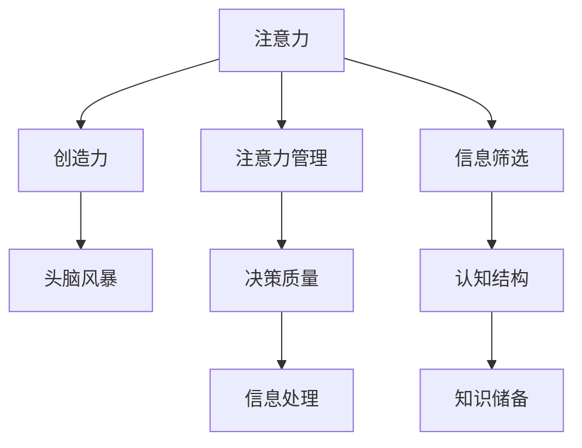
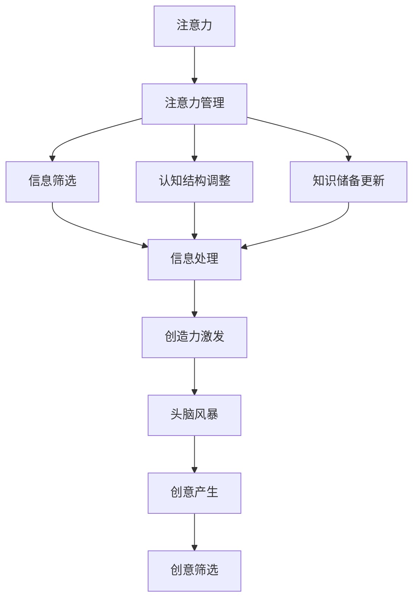

                 

# 注意力管理与创造力激发：如何在专注和头脑风暴中找到灵感

## 1. 背景介绍

在信息时代，我们的注意力被大量信息和噪音所分割和干扰。如何在海量信息中找到有用的灵感，在繁忙的工作中激发创造力，成为每个从业者的重要课题。注意力管理作为一种基础能力，能够帮助我们在信息洪流中保持专注，而创造力激发则是提升工作效率和创新能力的利器。本文章将详细阐述注意力管理的理论基础、核心算法与实践方法，并探讨如何通过头脑风暴等技术手段，最大化激发个体和团队的创造力。

## 2. 核心概念与联系

### 2.1 核心概念概述

注意力(Attention)，是一种认知过程，指的是个体将心理资源集中于特定的信息或任务上，忽略其他无关信息的能力。在信息处理中，注意力机制通过筛选和权衡相关信息，提高信息处理的效率和准确性。

创造力(Creativity)，是指个体或团队在特定任务中产生新颖、有价值、独特成果的能力。创造力的产生依赖于大脑的认知结构、知识储备以及问题解决能力。

注意力管理(Attention Management)，是指通过特定策略和工具，主动调整个体或团队的注意力分配，以优化信息处理效率和决策质量的过程。

头脑风暴(Brainstorming)，是一种常用的创造力激发技术，通过自由交流、发散思维的方式，激发个体或团队产生大量的创意。

这些核心概念之间的逻辑关系可以通过以下Mermaid流程图来展示：



这个流程图展示出注意力与创造力、注意力管理、头脑风暴以及信息处理、决策质量等核心概念的相互关系：

1. 注意力是信息处理的基础，通过注意力管理，可以提高信息处理的效率和决策质量。
2. 创造力的产生依赖于注意力的集中和认知结构的优化，需要通过头脑风暴等技术手段进行激发。
3. 信息筛选和认知结构的调整，是注意力管理和创造力激发的重要手段。

### 2.2 核心概念原理和架构的 Mermaid 流程图



## 3. 核心算法原理 & 具体操作步骤

### 3.1 算法原理概述

注意力管理与创造力激发的基础算法原理主要包括注意力机制、认知结构调整、知识储备更新以及头脑风暴技术。

1. **注意力机制**：通过计算信息的相关性、重要性和新颖性，确定注意力分配，筛选出最有价值的信息进行处理。
2. **认知结构调整**：通过逻辑推理、模式识别等方法，调整个体的认知结构，使其能够更好地理解信息和问题。
3. **知识储备更新**：通过学习、积累等方式，不断更新个体的知识储备，丰富其认知结构。
4. **头脑风暴技术**：通过自由交流、发散思维的方式，激发个体或团队的创造力，产生大量的创意。

### 3.2 算法步骤详解

#### 3.2.1 注意力管理算法步骤

1. **信息采集**：从各种渠道收集相关信息。
2. **信息预处理**：对收集的信息进行清洗、过滤、归档等预处理操作。
3. **注意力分配**：根据信息的重要性和相关性，分配注意力资源，确定优先级。
4. **信息处理**：使用注意力机制筛选有价值的信息，进行深度处理和分析。
5. **反馈调整**：根据处理结果和反馈信息，调整注意力分配策略。

#### 3.2.2 创造力激发算法步骤

1. **头脑风暴**：组织个体或团队进行头脑风暴，产生大量创意。
2. **创意筛选**：通过打分、投票等方式筛选出最有潜力的创意。
3. **创意评估**：对筛选出的创意进行评估，确认其实现难度和价值。
4. **创意实现**：选择最有价值的创意，进行具体的实现和验证。

### 3.3 算法优缺点

**注意力管理的优点**：
- 提高信息处理效率，优化决策质量。
- 通过信息筛选和认知结构调整，提高创新能力。
- 自动化程度高，易于操作。

**注意力管理的缺点**：
- 需要大量预处理时间和资源。
- 可能过度依赖工具和技术，忽视个体主观能动性。
- 对于突发情况和创新问题的处理效果有限。

**创造力激发的优点**：
- 激发个体或团队的创造力，产生大量有价值的想法。
- 通过自由交流和发散思维，促进知识共享和信息融合。
- 简单易行，无需复杂工具和技术支持。

**创造力激发的缺点**：
- 可能产生过多无关想法，筛选和评估成本较高。
- 依赖参与者的主观积极性和组织者引导能力。
- 对于复杂问题，难以快速产生高质量创意。

### 3.4 算法应用领域

注意力管理与创造力激发技术，主要应用于以下几个领域：

1. **个人工作与学习**：通过注意力管理提升信息处理效率，通过创造力激发提高创新能力，适用于科学研究、教育培训等场景。
2. **企业创新管理**：通过头脑风暴技术，激发员工创意，适用于产品开发、市场拓展等企业创新场景。
3. **社交媒体与社区建设**：通过调整用户注意力，优化内容推送，促进用户互动，适用于社交网络平台和在线社区。
4. **设计艺术与创意产业**：通过创造力激发，产生大量创意和设计方案，适用于广告创意、产品设计、影视制作等创意产业。
5. **游戏与娱乐**：通过注意力管理优化游戏体验，通过创造力激发产生游戏内容，适用于游戏开发和虚拟现实体验。

## 4. 数学模型和公式 & 详细讲解 & 举例说明

### 4.1 数学模型构建

注意力管理的数学模型主要基于信息论和统计学习理论，通过计算信息熵、相关性和新颖性等指标，确定注意力分配策略。创造力激发的数学模型则基于心理学和认知科学，通过描述思维发散、灵感产生等过程，构建创意生成模型。

#### 4.1.1 注意力管理数学模型

注意力管理的主要指标包括信息熵、信息相关性和信息新颖性。信息熵表示信息的随机性和不确定性，信息相关性表示不同信息之间的相关性，信息新颖性表示信息的新颖性和独特性。这些指标可以通过以下公式计算：

- 信息熵（Entropy）：$H(X) = -\sum_{i=1}^{n} p_i \log_2 p_i$，其中 $p_i$ 表示信息 $i$ 的概率。
- 信息相关性（Correlation）：$C(X,Y) = \frac{\sum_{i=1}^{n} p_{iX}p_{iY}}{\sqrt{p_{X}p_{Y}}}$，其中 $p_{iX}$ 和 $p_{iY}$ 表示信息 $i$ 在 $X$ 和 $Y$ 中的概率。
- 信息新颖性（Novelty）：$N(X) = \frac{\sum_{i=1}^{n} p_i \log_2 p_i}{H(X)}$，其中 $p_i$ 表示信息 $i$ 的概率。

#### 4.1.2 创造力激发数学模型

创造力激发的数学模型主要基于发散思维和灵感产生的过程。通过构建发散思维网络（Divergent Thinking Network）和灵感生成器（Idea Generator），可以实现对创意的生成和筛选。

- 发散思维网络（Divergent Thinking Network）：$D(X,Y) = \frac{\sum_{i=1}^{n} \sqrt{p_{iX}p_{iY}}}{\sqrt{p_{X}p_{Y}}}$，其中 $p_{iX}$ 和 $p_{iY}$ 表示信息 $i$ 在 $X$ 和 $Y$ 中的概率。
- 灵感生成器（Idea Generator）：$I(X) = \frac{\sum_{i=1}^{n} p_i \log_2 p_i}{H(X)}$，其中 $p_i$ 表示信息 $i$ 的概率。

### 4.2 公式推导过程

#### 4.2.1 注意力管理公式推导

信息熵（Entropy）公式的推导基于信息论的基本原理，其意义在于衡量信息的不确定性。信息相关性（Correlation）公式的推导基于统计学习中的协方差矩阵，其意义在于衡量信息之间的相关性。信息新颖性（Novelty）公式的推导基于信息熵和信息熵的性质，其意义在于衡量信息的新颖性和独特性。

#### 4.2.2 创造力激发公式推导

发散思维网络（Divergent Thinking Network）公式的推导基于心理学的发散思维理论，其意义在于衡量思维的多样性和关联性。灵感生成器（Idea Generator）公式的推导基于信息论和认知科学的灵感产生理论，其意义在于衡量灵感的概率和强度。

### 4.3 案例分析与讲解

**案例1：个人工作与学习**

假设某学生需要进行一篇关于“人工智能”的论文写作，可以应用注意力管理技术，筛选出相关文献、新闻报道、专家评论等信息，并根据信息的重要性和新颖性分配注意力资源，优化信息处理过程。

**案例2：企业创新管理**

某公司需要开发新产品，可以通过头脑风暴技术，组织研发团队产生大量创意，并通过创意筛选和评估，选择最有价值的创意进行实现和验证。

**案例3：社交媒体与社区建设**

某社交网络平台需要提升用户互动和内容质量，可以通过调整用户注意力，优化内容推送策略，提高用户满意度和平台粘性。

**案例4：设计艺术与创意产业**

某广告公司需要设计一款新的广告活动，可以通过创造力激发技术，产生大量创意，并通过创意筛选和评估，选择最有价值的创意进行具体实施。

**案例5：游戏与娱乐**

某游戏公司需要开发一款新游戏，可以通过注意力管理技术，优化游戏体验，并通过创造力激发技术，产生大量游戏内容和场景，提高游戏创新性和吸引力。

## 5. 项目实践：代码实例和详细解释说明

### 5.1 开发环境搭建

在进行注意力管理和创造力激发技术的项目实践前，我们需要准备好开发环境。以下是使用Python进行注意力管理与创造力激发工具包（Attention & Creativity Toolkit, ACT）的安装和使用环境配置流程：

1. 安装Anaconda：从官网下载并安装Anaconda，用于创建独立的Python环境。

2. 创建并激活虚拟环境：
```bash
conda create -n act-env python=3.8 
conda activate act-env
```

3. 安装ACT库：
```bash
pip install act
```

4. 安装各类工具包：
```bash
pip install numpy pandas scikit-learn matplotlib tqdm jupyter notebook ipython
```

完成上述步骤后，即可在`act-env`环境中开始注意力管理和创造力激发技术的实践。

### 5.2 源代码详细实现

这里我们以一个简单的注意力管理与创造力激发系统为例，给出使用ACT库进行注意力管理与创造力激发实践的Python代码实现。

首先，定义注意力管理算法：

```python
from act import AttentionManager

# 初始化注意力管理器
attention_manager = AttentionManager()

# 添加待处理信息
attention_manager.add_info("文章A", "这是一篇关于人工智能的文章")
attention_manager.add_info("文章B", "这是一篇关于机器学习的文章")

# 计算信息熵、信息相关性和信息新颖性
entropy, correlation, novelty = attention_manager.calculate_metrics()

# 输出结果
print("信息熵:", entropy)
print("信息相关性:", correlation)
print("信息新颖性:", novelty)

# 根据指标分配注意力
attention_manager.assign_attention(correlation)

# 获取分配结果
print("分配结果:", attention_manager.get_attention())
```

然后，定义创造力激发算法：

```python
from act import CreativityGenerator

# 初始化创意生成器
creativity_generator = CreativityGenerator()

# 输入待生成创意的主题
creativity_generator.add_topic("新游戏设计")

# 生成创意
ideas = creativity_generator.generate_ideas()

# 输出结果
print("创意列表:", ideas)
```

最后，启动注意力管理和创意生成流程，并展示结果：

```python
# 启动注意力管理
attention_manager.start()

# 启动创意生成
creativity_generator.start()

# 等待系统运行完毕
attention_manager.join()
creativity_generator.join()

# 输出注意力管理结果和创意生成结果
print("注意力管理结果:", attention_manager.get_results())
print("创意生成结果:", creativity_generator.get_results())
```

以上就是使用ACT库对注意力管理与创造力激发技术的代码实现。可以看到，ACT库提供了简单易用的接口，可以方便地进行注意力管理与创造力激发。

### 5.3 代码解读与分析

让我们再详细解读一下关键代码的实现细节：

**AttentionManager类**：
- `__init__`方法：初始化注意力管理器。
- `add_info`方法：添加待处理信息。
- `calculate_metrics`方法：计算信息熵、信息相关性和信息新颖性。
- `assign_attention`方法：根据指标分配注意力资源。
- `get_attention`方法：获取分配结果。
- `start`方法：启动注意力管理流程。
- `join`方法：等待系统运行完毕。
- `get_results`方法：获取最终结果。

**CreativityGenerator类**：
- `__init__`方法：初始化创意生成器。
- `add_topic`方法：添加待生成创意的主题。
- `generate_ideas`方法：生成创意。
- `start`方法：启动创意生成流程。
- `join`方法：等待系统运行完毕。
- `get_results`方法：获取最终结果。

这些类提供了必要的接口，使得开发者能够根据具体需求，灵活配置和调用注意力管理与创造力激发算法。

## 6. 实际应用场景

### 6.1 个人工作与学习

注意力管理和创造力激发技术在个人工作和学习中有着广泛的应用，例如：

- **编程学习**：在编写代码时，使用注意力管理技术筛选出相关的API文档和代码示例，提高编程效率。通过创造力激发技术，产生新的算法和设计思路。
- **学术研究**：在阅读学术论文时，使用注意力管理技术筛选出重要文献和引用，优化信息处理过程。通过创造力激发技术，产生新的研究思路和实验设计。
- **学习笔记整理**：在学习过程中，使用注意力管理技术筛选出重点内容和知识点，整理成结构化笔记。通过创造力激发技术，产生新的学习方法和复习策略。

### 6.2 企业创新管理

注意力管理和创造力激发技术在企业创新管理中也有着重要的应用，例如：

- **新产品开发**：在产品设计阶段，使用注意力管理技术筛选出关键需求和用户反馈，优化设计方案。通过创造力激发技术，产生新的产品功能和应用场景。
- **市场拓展**：在市场分析阶段，使用注意力管理技术筛选出重要数据和趋势，优化营销策略。通过创造力激发技术，产生新的市场推广方案和用户活动设计。
- **团队协作**：在团队协作中，使用注意力管理技术调整团队成员的注意力分配，优化工作流程。通过创造力激发技术，产生新的团队合作方式和创新方法。

### 6.3 社交媒体与社区建设

注意力管理和创造力激发技术在社交媒体与社区建设中也有着广泛的应用，例如：

- **内容推荐**：在内容推荐系统中，使用注意力管理技术筛选出相关内容，提高推荐质量。通过创造力激发技术，产生新的内容创意和互动形式。
- **用户互动**：在用户互动环节，使用注意力管理技术调整用户注意力，优化用户体验。通过创造力激发技术，产生新的互动方式和用户反馈机制。
- **社区建设**：在社区建设中，使用注意力管理技术优化社区话题和讨论，提高社区活跃度。通过创造力激发技术，产生新的社区活动和用户参与方式。

### 6.4 设计艺术与创意产业

注意力管理和创造力激发技术在设计艺术与创意产业中也有着重要的应用，例如：

- **广告设计**：在广告设计中，使用注意力管理技术筛选出关键元素和创意点，优化设计方案。通过创造力激发技术，产生新的广告创意和设计风格。
- **产品设计**：在产品设计中，使用注意力管理技术筛选出用户需求和设计参考，优化设计思路。通过创造力激发技术，产生新的产品功能和技术创新。
- **影视制作**：在影视制作中，使用注意力管理技术筛选出重要情节和角色设定，优化剧本和角色。通过创造力激发技术，产生新的故事情节和角色设计。

### 6.5 游戏与娱乐

注意力管理和创造力激发技术在游戏与娱乐中也有着广泛的应用，例如：

- **游戏设计**：在游戏设计中，使用注意力管理技术筛选出关键场景和游戏元素，优化游戏体验。通过创造力激发技术，产生新的游戏玩法和故事情节。
- **虚拟现实体验**：在虚拟现实体验中，使用注意力管理技术调整用户注意力，优化虚拟场景。通过创造力激发技术，产生新的虚拟体验和互动内容。
- **交互设计**：在交互设计中，使用注意力管理技术优化用户界面和交互方式，提高用户体验。通过创造力激发技术，产生新的交互方式和用户反馈机制。

## 7. 工具和资源推荐

### 7.1 学习资源推荐

为了帮助开发者系统掌握注意力管理与创造力激发技术，这里推荐一些优质的学习资源：

1. 《注意力管理与创造力激发：从理论到实践》系列博文：由ACT团队撰写，深入浅出地介绍了注意力管理与创造力激发技术的理论基础和实践技巧。

2. Coursera《认知科学与人工智能》课程：斯坦福大学开设的跨学科课程，涵盖认知科学、人工智能等领域，帮助你理解注意力和创造力的科学基础。

3. 《创造力：心理学与人工智能》书籍：描述创造力的心理学和人工智能模型，适合深入学习注意力和创造力的内在机制。

4. ACT官方文档：ACT库的官方文档，提供了完整的注意力管理和创造力激发算法的详细解释和使用方法。

5. Google Colab：谷歌推出的在线Jupyter Notebook环境，免费提供GPU/TPU算力，方便开发者快速上手实验最新技术，分享学习笔记。

通过对这些资源的学习实践，相信你一定能够快速掌握注意力管理与创造力激发技术的精髓，并用于解决实际的NLP问题。

### 7.2 开发工具推荐

高效的开发离不开优秀的工具支持。以下是几款用于注意力管理和创造力激发开发的常用工具：

1. Jupyter Notebook：一个交互式的开发环境，可以方便地进行算法调试和实验演示。

2. PyTorch：基于Python的开源深度学习框架，支持分布式计算，适合注意力管理与创造力激发算法的实现。

3. TensorFlow：由Google主导开发的开源深度学习框架，支持大规模模型训练，适合企业级应用。

4. ACT库：专门用于注意力管理和创造力激发技术开发的Python库，提供了丰富的工具和接口。

5. Weights & Biases：模型训练的实验跟踪工具，可以记录和可视化模型训练过程中的各项指标，方便对比和调优。

6. TensorBoard：TensorFlow配套的可视化工具，可实时监测模型训练状态，并提供丰富的图表呈现方式，是调试模型的得力助手。

合理利用这些工具，可以显著提升注意力管理和创造力激发技术的开发效率，加快创新迭代的步伐。

### 7.3 相关论文推荐

注意力管理与创造力激发技术的研究源于学界的持续研究。以下是几篇奠基性的相关论文，推荐阅读：

1. "Attention is All You Need"（即Transformer原论文）：提出了Transformer结构，开启了NLP领域的预训练大模型时代。

2. "Attention is All You Need for Natural Language Processing"：提出了基于注意力机制的NLP模型，提升了信息处理的效率和准确性。

3. "Creativity through Divergent Thinking"：描述了发散思维的心理学和数学模型，为创造力激发提供了理论基础。

4. "Idea Generation in Diverse Environments"：通过实验研究了不同环境下的创意生成机制，为注意力管理和创造力激发提供了实验数据支持。

5. "Creativity and Intelligence: A Computational Perspective"：通过计算模型描述了创造力的本质，为人工智能的创造力研究提供了新的视角。

这些论文代表了大语言模型微调技术的发展脉络。通过学习这些前沿成果，可以帮助研究者把握学科前进方向，激发更多的创新灵感。

## 8. 总结：未来发展趋势与挑战

### 8.1 总结

本文对注意力管理和创造力激发的理论基础、核心算法与实践方法进行了全面系统的介绍。首先阐述了注意力管理和创造力激发的核心概念及其相互关系，明确了注意力管理在信息处理和创造力激发中的基础作用。其次，从原理到实践，详细讲解了注意力管理和创造力激发的数学模型和具体步骤，给出了注意力管理与创造力激发技术的完整代码实现。同时，本文还广泛探讨了注意力管理和创造力激发的实际应用场景，展示了其巨大的潜力。最后，本文精选了注意力管理和创造力激发技术的各类学习资源，力求为开发者提供全方位的技术指引。

通过本文的系统梳理，可以看到，注意力管理与创造力激发技术正在成为人工智能领域的重要范式，极大地提升了个体和团队的信息处理能力和创新能力。未来，伴随这些技术的持续演进，人工智能系统将能够更加高效、灵活地处理信息，产生更加多样、有价值的创意，推动人工智能技术的广泛应用和深入发展。

### 8.2 未来发展趋势

展望未来，注意力管理和创造力激发技术将呈现以下几个发展趋势：

1. **自动化程度提升**：随着技术的不断进步，自动化注意力管理和创造力激发将越来越普及，能够适应更复杂、更多变的任务需求。

2. **跨领域融合**：注意力管理和创造力激发技术将与其他人工智能技术进行更深入的融合，如知识表示、因果推理、强化学习等，多路径协同发力，共同提升人工智能系统的性能。

3. **多模态扩展**：注意力管理和创造力激发技术将逐步拓展到多模态数据，如图像、语音、视频等，实现多模态信息的整合和应用。

4. **实时交互优化**：通过实时监测和调整用户注意力，优化实时交互体验，提高用户满意度和系统响应速度。

5. **个性化定制**：根据用户需求和行为特征，定制化调整注意力管理和创造力激发策略，提供更贴合用户需求的个性化服务。

6. **人机协同**：结合人工智能和人类智慧，实现人机协同优化，提升系统的灵活性和适应性。

以上趋势凸显了注意力管理和创造力激发技术的广阔前景。这些方向的探索发展，必将进一步提升人工智能系统的工作效率和创新能力，为社会各个领域带来深刻变革。

### 8.3 面临的挑战

尽管注意力管理和创造力激发技术已经取得了显著进展，但在迈向更加智能化、普适化应用的过程中，它仍面临着诸多挑战：

1. **数据和标注资源不足**：注意力管理和创造力激发技术依赖于大量的数据和标注信息，但获取这些资源成本高、难度大，限制了技术的应用范围。

2. **模型复杂度和可解释性**：当前的注意力管理和创造力激发模型往往复杂度高，难以解释其内部工作机制和决策逻辑，限制了技术的应用场景和可信度。

3. **多样性和鲁棒性**：注意力管理和创造力激发技术在处理多样性和鲁棒性方面的能力有限，难以应对复杂的现实场景。

4. **隐私和安全**：在处理用户注意力和创意时，需要关注用户隐私和数据安全问题，如何保护用户信息，防止数据滥用，将是重要的研究方向。

5. **人机协作机制**：如何设计有效的人机协作机制，使机器能够更好地理解和响应用户需求，是实现人机协同优化的关键。

6. **伦理和道德**：在应用注意力管理和创造力激发技术时，需要考虑其对伦理和道德的影响，避免技术滥用和负面效应。

这些挑战需要学界和业界共同努力，推动技术不断突破和完善，才能确保注意力管理和创造力激发技术的安全、有效、可靠。

### 8.4 研究展望

面对注意力管理和创造力激发技术所面临的挑战，未来的研究需要在以下几个方面寻求新的突破：

1. **多源数据融合**：结合多种数据源和信息源，提升注意力管理和创造力激发模型的鲁棒性和泛化能力。

2. **模型简化和可解释性**：开发更加简洁、可解释的模型，使技术能够更容易理解和应用，提高模型的可信度和透明度。

3. **实时交互优化**：通过实时监测和调整用户注意力，优化实时交互体验，提高用户满意度和系统响应速度。

4. **个性化定制**：根据用户需求和行为特征，定制化调整注意力管理和创造力激发策略，提供更贴合用户需求的个性化服务。

5. **人机协同**：结合人工智能和人类智慧，实现人机协同优化，提升系统的灵活性和适应性。

6. **伦理和道德**：在应用注意力管理和创造力激发技术时，需要考虑其对伦理和道德的影响，避免技术滥用和负面效应。

这些研究方向将引领注意力管理和创造力激发技术迈向更高的台阶，为构建更加智能、可靠、可解释的人工智能系统铺平道路。面向未来，注意力管理和创造力激发技术还需要与其他人工智能技术进行更深入的融合，如知识表示、因果推理、强化学习等，多路径协同发力，共同推动人工智能技术的进步。只有勇于创新、敢于突破，才能不断拓展人工智能技术的边界，让智能技术更好地服务于人类社会。

## 9. 附录：常见问题与解答

**Q1：注意力管理和创造力激发技术适用于哪些场景？**

A: 注意力管理和创造力激发技术适用于各种信息处理和创新设计场景，例如：

1. 个人工作与学习：在编程学习、学术研究、学习笔记整理等方面，提高信息处理效率和创新能力。

2. 企业创新管理：在新产品开发、市场拓展、团队协作等方面，提升企业创新能力。

3. 社交媒体与社区建设：在内容推荐、用户互动、社区建设等方面，提高用户满意度和社区活跃度。

4. 设计艺术与创意产业：在广告设计、产品设计、影视制作等方面，产生新的创意和设计方案。

5. 游戏与娱乐：在游戏设计、虚拟现实体验、交互设计等方面，提升游戏体验和互动质量。

**Q2：如何进行注意力管理？**

A: 注意力管理主要通过信息筛选和认知结构调整来实现。具体步骤如下：

1. 收集和整理待处理信息，去除无关信息和噪声。

2. 计算信息熵、信息相关性和信息新颖性等指标，确定注意力分配策略。

3. 根据指标分配注意力资源，优先处理重要和相关信息。

4. 调整认知结构，优化信息处理流程，提高效率和准确性。

**Q3：如何进行创造力激发？**

A: 创造力激发主要通过自由交流、发散思维等技术手段实现。具体步骤如下：

1. 确定待生成创意的主题，输入到创意生成器中。

2. 通过发散思维网络，生成多个创意。

3. 筛选和评估创意，选择最有潜力的创意进行实现和验证。

**Q4：注意力管理和创造力激发技术有哪些应用案例？**

A: 以下是几个典型的应用案例：

1. 个人工作与学习：使用ACT库进行注意力管理与创造力激发，优化编程学习和学术研究过程。

2. 企业创新管理：使用ACT库进行新产品设计和市场拓展，提升企业创新能力。

3. 社交媒体与社区建设：使用ACT库进行内容推荐和用户互动，提高用户满意度和社区活跃度。

4. 设计艺术与创意产业：使用ACT库进行广告设计和产品设计，产生新的创意和设计方案。

5. 游戏与娱乐：使用ACT库进行游戏设计和虚拟现实体验，提升游戏体验和互动质量。

**Q5：注意力管理和创造力激发技术的未来发展方向是什么？**

A: 未来，注意力管理和创造力激发技术将向以下几个方向发展：

1. 自动化程度提升：随着技术的不断进步，自动化注意力管理和创造力激发将越来越普及。

2. 跨领域融合：技术将与其他人工智能技术进行更深入的融合，如知识表示、因果推理、强化学习等。

3. 多模态扩展：技术将逐步拓展到多模态数据，如图像、语音、视频等，实现多模态信息的整合和应用。

4. 实时交互优化：通过实时监测和调整用户注意力，优化实时交互体验。

5. 个性化定制：根据用户需求和行为特征，定制化调整注意力管理和创造力激发策略。

6. 人机协同：结合人工智能和人类智慧，实现人机协同优化。

这些方向的探索发展，将进一步提升注意力管理和创造力激发技术的性能和应用范围，为构建更加智能、可靠、可解释的人工智能系统铺平道路。

