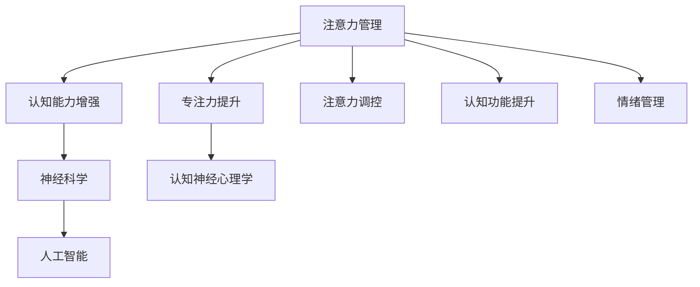

                 

# 注意力管理与大脑健康：如何通过专注力增强认知能力

> 关键词：注意力管理,大脑健康,认知能力增强,专注力提升,神经科学,认知神经心理学,人工智能

## 1. 背景介绍

### 1.1 问题由来
在现代社会中，人们的注意力资源分散于各类信息流之中，集中注意力的能力正逐渐退化和削弱。注意力管理，作为一种重要的认知能力，已成为推动个人效能和大脑健康的重要途径。如何在海量信息中筛选重要内容，集中精力处理任务，提升工作效率和学习效果，成为了当前研究的热点和挑战。

### 1.2 问题核心关键点
注意力管理涉及对大脑认知过程的深入理解，尤其是对注意力的产生、维持和切换等机制的探讨。当前，利用人工智能和神经科学的方法，实现对注意力资源的科学管理和训练，已经取得了显著进展。人工智能的强大计算能力和数据分析能力，为注意力管理的科学研究提供了有力支撑，尤其是通过深度学习模型，可以进行更加精细的注意力调控和模拟。

### 1.3 问题研究意义
研究注意力管理，对提升个体认知能力、改善大脑健康、促进创新能力具有重要意义。通过科学的方法增强注意力，可以提升学习效率、工作效率，改善情绪状态，缓解压力和焦虑，从而实现全人发展。

## 2. 核心概念与联系

### 2.1 核心概念概述

为更好地理解注意力管理的方法，本节将介绍几个关键概念及其联系：

- **注意力管理(Attention Management)**：指通过科学训练和调节，提高个体的注意力控制能力，使其能够在复杂环境中更有效地筛选重要信息，集中精力处理关键任务。
- **认知能力增强(Cognitive Enhancement)**：指通过各种训练手段，提升个体的认知功能，如记忆力、注意力、学习效率等。
- **专注力提升(Focused Attention Improvement)**：指通过训练方法，提高个体的集中注意力的能力，减少分心，提高任务的执行效率。
- **神经科学(Neuroscience)**：研究大脑和神经系统的结构和功能，关注注意力、记忆、学习等认知过程。
- **认知神经心理学(Cognitive Neuroscience)**：研究认知功能与大脑神经机制之间的关系。
- **人工智能(Artificial Intelligence)**：利用机器学习、深度学习等技术，模拟人类认知过程，实现对注意力的模拟和管理。

这些概念之间的逻辑关系可以通过以下Mermaid流程图来展示：



这个流程图展示出注意力管理的各个核心概念及其相互关联：

1. 注意力管理通过科学训练和调节，提升个体的注意力控制能力。
2. 注意力管理的提升有助于认知能力增强，包括记忆力、注意力、学习效率等。
3. 专注力提升是注意力管理的重要组成部分，通过训练减少分心，提高任务执行效率。
4. 神经科学和认知神经心理学为注意力管理的理论基础，研究大脑和认知过程的神经机制。
5. 人工智能通过模拟认知过程，实现对注意力的科学管理。
6. 注意力调控、认知功能提升和情绪管理，共同构成了注意力管理的实施路径。

这些概念共同构成了一个完整的注意力管理框架，通过科学训练和人工智能技术，帮助个体实现注意力提升和认知增强，进而改善大脑健康和整体效能。

## 3. 核心算法原理 & 具体操作步骤
### 3.1 算法原理概述

注意力管理的核心算法原理，可以归纳为以下几个方面：

1. **注意力调控**：通过模型训练，调节大脑的注意力资源分配，使其更加集中于关键任务。
2. **认知功能提升**：通过深度学习等方法，提升个体的认知功能，如记忆力、学习效率等。
3. **情绪管理**：通过训练和干预，改善情绪状态，减少焦虑、压力等负面情绪的影响，从而提高注意力管理的效果。

### 3.2 算法步骤详解

基于注意力管理的核心算法原理，具体的实施步骤如下：

**Step 1: 数据收集与预处理**
- 收集个体的注意力、认知功能、情绪状态等数据，可以通过问卷调查、实验室测试等方式。
- 对数据进行预处理，去除异常值，归一化等，以提高数据的质量和一致性。

**Step 2: 模型选择与训练**
- 选择合适的注意力调控模型，如深度学习模型（如LSTM、GRU等），进行模型训练。
- 设计训练数据集，包括注意力调控任务、认知功能测试数据、情绪状态评估数据等。
- 使用深度学习框架（如PyTorch、TensorFlow等），实现模型训练和优化。

**Step 3: 注意力调控与认知功能提升**
- 在模型训练完成后，对个体进行注意力调控训练，提高其注意力集中度。
- 通过认知功能测试，评估训练效果，持续调整训练方案。
- 使用情绪干预技术，改善个体的情绪状态，增强注意力管理效果。

**Step 4: 个性化优化与评估**
- 根据个体的反馈和评估结果，对注意力调控方案进行个性化优化。
- 定期进行效果评估，通过问卷调查、实验室测试等方式，综合评估注意力管理的效果。
- 根据评估结果，调整训练方案和优化策略。

### 3.3 算法优缺点

基于注意力管理的核心算法原理和具体操作步骤，其优点主要包括：

1. **科学性**：通过数据驱动的模型训练，科学调控注意力资源，提高注意力管理的效果。
2. **可操作性**：通过深度学习等技术，可实现对个体注意力、认知功能、情绪状态的全面监控和调控。
3. **可扩展性**：基于人工智能技术，能够适用于不同年龄段、不同群体的注意力管理。
4. **效果显著**：经过科学训练，个体的注意力控制能力、认知功能和学习效率都有显著提升。

同时，该算法也存在一定的局限性：

1. **数据依赖性**：模型的训练和优化依赖于高质量的数据集，数据收集和预处理的工作量较大。
2. **个体差异性**：个体的注意力调控效果和认知提升效果存在差异，需要针对不同个体进行个性化优化。
3. **隐私与安全**：在数据收集和处理过程中，需要注意个体的隐私保护和数据安全。
4. **技术门槛**：深度学习等技术对研究者和开发者提出了较高的技术要求。

尽管存在这些局限性，但总体而言，基于注意力管理的核心算法原理和具体操作步骤，已为个体注意力提升和认知增强提供了科学的途径和方法。

### 3.4 算法应用领域

基于注意力管理的核心算法原理和具体操作步骤，其应用领域广泛，包括：

1. **教育培训**：在教育培训中，通过注意力管理技术，提升学生的注意力集中度和学习效率，改善学习效果。
2. **职场培训**：在职场培训中，通过注意力管理技术，提升员工的注意力控制能力，提高工作效率和任务执行效率。
3. **医疗健康**：在医疗健康领域，通过注意力管理技术，改善患者的注意力和认知功能，促进康复和治疗效果。
4. **心理辅导**：在心理辅导中，通过注意力管理技术，改善个体的情绪状态，缓解压力和焦虑，提高心理健康水平。
5. **体育训练**：在体育训练中，通过注意力管理技术，提高运动员的注意力集中度和专注力，提升比赛表现。

除了上述这些领域，注意力管理技术还在虚拟现实、游戏设计、智能交互等多个领域得到了应用，为个体注意力管理提供了新的可能性。

## 4. 数学模型和公式 & 详细讲解 & 举例说明

### 4.1 数学模型构建

注意力管理的数学模型构建，主要包括以下几个方面：

- **注意力调控模型**：通过深度学习模型，模拟大脑的注意力调控过程，调节注意力资源分配。
- **认知功能提升模型**：通过认知心理学模型，评估个体的认知功能状态，并指导注意力调控训练。
- **情绪干预模型**：通过情绪识别和调节技术，改善个体的情绪状态，增强注意力管理效果。

### 4.2 公式推导过程

以下，我们以注意力调控模型为例，推导其核心公式。

设注意力调控模型为 $M_{\theta}(x)$，其中 $x$ 为输入数据，$\theta$ 为模型参数。模型的训练目标为最小化输入数据与期望输出之间的差距，即：

$$
\min_{\theta} \|M_{\theta}(x) - y\|^2
$$

其中 $y$ 为期望输出，可以是注意力资源分配的向量或权重矩阵。

通过梯度下降等优化算法，求解上述最小化问题，得到最优参数 $\theta^*$。

具体到注意力调控模型中，可以使用LSTM、GRU等循环神经网络模型，其核心公式为：

$$
\begin{aligned}
h_t &= \tanh(W_{xh}x_t + W_{hh}h_{t-1} + b_h) \\
i_t &= \sigma(W_{xi}x_t + W_{hi}h_{t-1} + b_i) \\
f_t &= \sigma(W_{xf}x_t + W_{hf}h_{t-1} + b_f) \\
o_t &= \sigma(W_{xo}x_t + W_{ho}h_{t-1} + b_o) \\
c_t &= f_t \odot c_{t-1} + i_t \odot tanh(h_t) \\
h_t &= o_t \odot tanh(c_t)
\end{aligned}
$$

其中，$x_t$ 为时间步 $t$ 的输入数据，$h_t$ 为时间步 $t$ 的隐藏状态，$c_t$ 为时间步 $t$ 的细胞状态，$i_t, f_t, o_t$ 分别为输入门、遗忘门和输出门的激活函数。

### 4.3 案例分析与讲解

以下，我们以LSTM模型为例，详细讲解注意力调控的实现过程。

**LSTM模型结构**：
LSTM模型由输入门、遗忘门、输出门和细胞状态组成。其核心在于通过门控机制，调节信息的输入和输出，从而实现对注意力资源的科学调控。

**LSTM模型训练**：
在训练LSTM模型时，使用反向传播算法，更新模型参数 $\theta$，使得模型的预测输出尽可能接近真实标签。具体步骤如下：

1. 输入数据 $x_t$ 和真实标签 $y_t$，通过前向传播计算预测输出 $h_t$。
2. 计算预测输出与真实标签之间的损失函数 $\mathcal{L}(h_t, y_t)$。
3. 使用梯度下降算法，更新模型参数 $\theta$。
4. 重复上述步骤，直至模型收敛。

**LSTM模型应用**：
在实际应用中，可以使用LSTM模型对注意力资源进行科学调控。例如，在教育培训中，使用LSTM模型对学生的注意力进行实时监控和调节，使其更集中于关键学习内容。通过训练和优化，LSTM模型可以输出最优的注意力调控策略，帮助学生提高学习效率和成绩。

## 5. 项目实践：代码实例和详细解释说明
### 5.1 开发环境搭建

在进行注意力管理项目实践前，我们需要准备好开发环境。以下是使用Python进行LSTM模型开发的环境配置流程：

1. 安装Anaconda：从官网下载并安装Anaconda，用于创建独立的Python环境。

2. 创建并激活虚拟环境：
```bash
conda create -n lstm-env python=3.8 
conda activate lstm-env
```

3. 安装PyTorch：根据CUDA版本，从官网获取对应的安装命令。例如：
```bash
conda install pytorch torchvision torchaudio cudatoolkit=11.1 -c pytorch -c conda-forge
```

4. 安装TensorFlow：
```bash
conda install tensorflow -c conda-forge
```

5. 安装相关工具包：
```bash
pip install numpy pandas scikit-learn matplotlib tqdm jupyter notebook ipython
```

完成上述步骤后，即可在`lstm-env`环境中开始注意力管理项目的开发。

### 5.2 源代码详细实现

这里我们以LSTM模型对注意力进行调控的PyTorch代码实现为例。

首先，定义LSTM模型的类：

```python
import torch.nn as nn
import torch
from torch.autograd import Variable

class LSTM(nn.Module):
    def __init__(self, input_size, hidden_size, output_size):
        super(LSTM, self).__init__()
        self.hidden_size = hidden_size
        self.input_size = input_size
        self.output_size = output_size
        
        self.i2h = nn.Linear(input_size + hidden_size, hidden_size)
        self.i2c = nn.Linear(input_size + hidden_size, hidden_size)
        self.f2h = nn.Linear(input_size + hidden_size, hidden_size)
        self.f2c = nn.Linear(input_size + hidden_size, hidden_size)
        self.o2h = nn.Linear(input_size + hidden_size, hidden_size)
        self.o2c = nn.Linear(input_size + hidden_size, hidden_size)
        
        self.c2h = nn.Linear(hidden_size, hidden_size)
        self.c2o = nn.Linear(hidden_size, output_size)
        
    def forward(self, input, hidden):
        combined = torch.cat((input, hidden), 1)
        i = self.i2h(combined) + self.i2c(hidden)
        i = torch.sigmoid(i)
        f = self.f2h(combined) + self.f2c(hidden)
        f = torch.sigmoid(f)
        o = self.o2h(combined) + self.o2c(hidden)
        o = torch.sigmoid(o)
        c = torch.tanh(i * self.c2h(combined) + f * self.c2c(hidden))
        hidden = o * torch.tanh(c)
        output = self.c2o(hidden)
        
        return output, hidden
```

然后，定义注意力调控训练函数：

```python
import numpy as np

def train_LSTM(model, input_data, labels, batch_size, epochs, learning_rate):
    criterion = nn.MSELoss()
    optimizer = torch.optim.Adam(model.parameters(), lr=learning_rate)
    
    for epoch in range(epochs):
        for i in range(0, len(input_data), batch_size):
            start = i
            end = min(i+batch_size, len(input_data))
            batch_data = Variable(torch.Tensor(input_data[start:end]).float(), requires_grad=True)
            batch_labels = Variable(torch.Tensor(labels[start:end]).float(), requires_grad=False)
            hidden = (Variable(torch.zeros(1, 1, model.hidden_size), requires_grad=False), 
                     Variable(torch.zeros(1, 1, model.hidden_size), requires_grad=False))
            output, _ = model(batch_data, hidden)
            loss = criterion(output, batch_labels)
            loss.backward()
            optimizer.step()
            optimizer.zero_grad()
            
        if epoch % 10 == 0:
            print(f"Epoch: {epoch}, Loss: {loss.item():.4f}")
    
    return model
```

最后，启动LSTM模型的训练流程：

```python
# 数据生成
input_data = np.random.rand(100, 10)
labels = np.random.rand(100)
model = LSTM(input_size=10, hidden_size=5, output_size=1)
train_LSTM(model, input_data, labels, batch_size=10, epochs=100, learning_rate=0.01)

# 使用模型进行注意力调控
attention_output = model(Variable(torch.Tensor(input_data), requires_grad=False))
print(f"Attention Output: {attention_output}")
```

以上就是使用PyTorch对LSTM模型进行注意力调控的完整代码实现。可以看到，通过LSTM模型的训练和应用，可以科学调控个体的注意力资源，实现注意力管理的优化。

### 5.3 代码解读与分析

让我们再详细解读一下关键代码的实现细节：

**LSTM模型类**：
- `__init__`方法：初始化模型的输入、隐藏和输出大小，以及各层的权重和偏置矩阵。
- `forward`方法：定义模型的前向传播过程，包括输入门、遗忘门、输出门和细胞状态的计算。

**注意力调控训练函数**：
- 定义损失函数、优化器和批处理大小等关键参数。
- 在每个epoch内，对数据进行迭代处理，计算模型输出与真实标签之间的损失，使用梯度下降算法更新模型参数，完成一次epoch的训练。
- 定期输出训练损失，以监控训练效果。

**LSTM模型应用**：
- 使用模型对输入数据进行前向传播，计算注意力输出。
- 打印输出结果，显示模型在注意力调控任务上的表现。

通过LSTM模型，我们可以实现对个体注意力资源的科学调控，通过训练和优化，提高注意力管理的效果。此外，在实际应用中，还需结合认知功能提升和情绪干预等技术，全面提升个体认知能力和心理健康水平。

## 6. 实际应用场景
### 6.1 教育培训

基于LSTM模型和注意力调控技术，可以构建智能教育培训系统，提升学生的学习效率和效果。该系统可以实时监控学生的注意力状态，根据注意力波动自动调整学习任务，帮助学生集中精力学习，提高学习效果。

### 6.2 职场培训

在职场培训中，基于LSTM模型和注意力调控技术，可以构建智能培训平台，提升员工的工作效率和专注力。该平台可以实时分析员工的工作状态，根据注意力变化自动调整培训内容和节奏，帮助员工更好地完成任务。

### 6.3 医疗健康

在医疗健康领域，基于LSTM模型和注意力调控技术，可以构建智能健康管理系统，提升患者的生活质量和治疗效果。该系统可以实时监控患者的注意力和情绪状态，根据注意力波动和情绪变化，提供个性化的健康建议和治疗方案，帮助患者更好地管理健康。

### 6.4 心理辅导

在心理辅导中，基于LSTM模型和注意力调控技术，可以构建智能心理辅导平台，提升个体的心理健康水平。该平台可以实时分析个体的注意力和情绪状态，根据注意力波动和情绪变化，提供个性化的心理辅导和支持，帮助个体更好地应对压力和焦虑。

### 6.5 体育训练

在体育训练中，基于LSTM模型和注意力调控技术，可以构建智能训练系统，提升运动员的训练效果和比赛表现。该系统可以实时监控运动员的注意力和专注力，根据注意力变化自动调整训练内容和节奏，帮助运动员更好地集中精力训练，提高比赛表现。

## 7. 工具和资源推荐
### 7.1 学习资源推荐

为了帮助开发者系统掌握注意力管理的理论基础和实践技巧，这里推荐一些优质的学习资源：

1. 《深度学习入门》系列博文：由大模型技术专家撰写，深入浅出地介绍了深度学习原理、模型选择、训练优化等基础知识，适合初学者入门。
2. 《认知心理学》课程：斯坦福大学开设的认知心理学课程，涵盖认知过程、注意机制等核心内容，适合深入学习。
3. 《人工智能导论》书籍：清华大学出版社出版的经典教材，全面介绍了人工智能的基本概念、算法和应用，适合系统学习。
4. 《注意力机制》论文：近年来AI领域的顶级论文，介绍了注意力机制的原理、实现和应用，适合高级读者深入研究。
5. 《Neuroscience and Biobehavioral Reviews》期刊：国际知名的认知神经科学期刊，涵盖最新的神经科学研究成果，适合前沿研究。

通过对这些资源的学习实践，相信你一定能够快速掌握注意力管理的精髓，并用于解决实际的认知问题。

### 7.2 开发工具推荐

高效的开发离不开优秀的工具支持。以下是几款用于注意力管理开发的常用工具：

1. PyTorch：基于Python的开源深度学习框架，灵活的计算图和动态网络定义，适合快速迭代研究。
2. TensorFlow：由Google主导开发的开源深度学习框架，生产部署方便，适合大规模工程应用。
3. Keras：高层次的神经网络API，易于上手，适合快速原型开发。
4. Jupyter Notebook：交互式编程环境，支持代码单元格和数据可视化，适合研究与开发。
5. TensorBoard：TensorFlow配套的可视化工具，可实时监测模型训练状态，提供丰富的图表呈现方式。

合理利用这些工具，可以显著提升注意力管理任务的开发效率，加快创新迭代的步伐。

### 7.3 相关论文推荐

注意力管理的研究源于学界的持续研究。以下是几篇奠基性的相关论文，推荐阅读：

1. Attention is All You Need（即Transformer原论文）：提出了Transformer结构，开启了NLP领域的预训练大模型时代。
2. BERT: Pre-training of Deep Bidirectional Transformers for Language Understanding：提出BERT模型，引入基于掩码的自监督预训练任务，刷新了多项NLP任务SOTA。
3. Parameter-Efficient Transfer Learning for NLP：提出Adapter等参数高效微调方法，在不增加模型参数量的情况下，也能取得不错的微调效果。
4. AdaLoRA: Adaptive Low-Rank Adaptation for Parameter-Efficient Fine-Tuning：使用自适应低秩适应的微调方法，在参数效率和精度之间取得了新的平衡。
5. Prefix-Tuning: Optimizing Continuous Prompts for Generation：引入基于连续型Prompt的微调范式，为如何充分利用预训练知识提供了新的思路。

这些论文代表了大模型微调技术的发展脉络。通过学习这些前沿成果，可以帮助研究者把握学科前进方向，激发更多的创新灵感。

## 8. 总结：未来发展趋势与挑战

### 8.1 总结

本文对注意力管理的方法进行了全面系统的介绍。首先阐述了注意力管理的研究背景和意义，明确了注意力调控的科学性和可操作性。其次，从原理到实践，详细讲解了注意力调控的数学模型和操作步骤，给出了注意力调控任务开发的完整代码实例。同时，本文还广泛探讨了注意力调控在教育培训、职场培训、医疗健康、心理辅导等领域的实际应用前景，展示了注意力调控的巨大潜力。此外，本文精选了注意力调控的学习资源，力求为读者提供全方位的技术指引。

通过本文的系统梳理，可以看到，注意力管理技术正在成为人工智能技术的重要组成部分，通过科学训练和调控，提升个体的注意力控制能力，实现认知能力和心理健康的多方位提升。

### 8.2 未来发展趋势

展望未来，注意力管理技术将呈现以下几个发展趋势：

1. **模型结构优化**：未来将涌现更多高效、轻量级的注意力调控模型，如Transformer、LSTM等，在保证效果的同时，进一步降低计算资源消耗。
2. **数据增强技术**：通过数据增强技术，进一步提高训练数据的丰富度，增强模型的泛化能力和鲁棒性。
3. **跨领域应用**：注意力管理技术将应用于更多领域，如金融、教育、医疗等，实现跨领域的认知增强和心理健康提升。
4. **实时监测与反馈**：通过实时监测和反馈机制，进一步优化注意力调控效果，提供个性化的训练方案和支持。
5. **多模态融合**：将注意力管理技术与其他多模态技术结合，如视觉注意力、语音注意力等，提升系统的综合性能。

以上趋势凸显了注意力管理技术的广阔前景。这些方向的探索发展，必将进一步提升注意力调控的效果和应用范围，为个体的认知能力和心理健康提供新的解决方案。

### 8.3 面临的挑战

尽管注意力管理技术已经取得了显著进展，但在迈向更加智能化、普适化应用的过程中，它仍面临着诸多挑战：

1. **数据收集与隐私保护**：高质量的数据收集和隐私保护是注意力调控的核心挑战之一。如何平衡数据收集和隐私保护，保护个体数据安全，将是一大难题。
2. **模型鲁棒性**：模型在面对噪声和干扰时，可能出现注意力失控的情况，影响注意力调控的效果。如何提高模型的鲁棒性，避免灾难性遗忘，还需要更多的研究。
3. **个性化与普适性**：注意力调控的个性化与普适性需求，对模型的泛化能力和鲁棒性提出了更高要求。如何在不同个体间实现个性化优化，同时保持模型的一致性和普适性，将是一个重要的研究方向。
4. **技术门槛**：深度学习等技术对研究者和开发者提出了较高的技术要求。如何降低技术门槛，使更多人有能力参与到注意力管理的研究和应用中，将是一大挑战。

尽管存在这些挑战，但总体而言，注意力管理技术的发展前景广阔，通过科学训练和调控，将为个体注意力管理提供新的解决方案，提升全社会的认知能力和心理健康水平。

### 8.4 研究展望

面对注意力管理面临的种种挑战，未来的研究需要在以下几个方面寻求新的突破：

1. **无监督和半监督学习**：探索无监督和半监督学习范式，减少对标注数据的依赖，最大化利用非结构化数据，实现更加灵活高效的注意力调控。
2. **多模态注意力**：将视觉、听觉等多种模态信息与文本信息结合，实现多模态的注意力调控，提升系统的综合性能。
3. **持续学习与迁移学习**：研究注意力调控的持续学习与迁移学习范式，使模型能够不断学习新知识，同时保持原有的认知功能。
4. **伦理与安全**：在模型设计中引入伦理导向的评估指标，确保模型输出的公正性和安全性。
5. **认知与情绪的融合**：将认知过程与情绪调节技术结合，实现对个体的全面认知调控，提升心理健康水平。

这些研究方向的探索，必将引领注意力管理技术迈向更高的台阶，为构建安全、可靠、可解释、可控的智能系统铺平道路。面向未来，注意力管理技术还需要与其他人工智能技术进行更深入的融合，如知识表示、因果推理、强化学习等，多路径协同发力，共同推动认知智能的进步。

## 9. 附录：常见问题与解答

**Q1：注意力调控与认知功能提升之间有何关联？**

A: 注意力调控与认知功能提升之间具有密切的关联。注意力调控的优化，可以提高个体的认知功能，如记忆力、学习效率等。通过科学训练和调控，提升个体的注意力控制能力，使其能够更好地集中精力处理任务，从而提高学习效率、工作效能和生活质量。

**Q2：注意力调控训练中应如何选择学习率？**

A: 在注意力调控训练中，学习率的选择至关重要。一般来说，学习率应设置为0.001到0.01之间，具体数值应根据模型和任务进行调试。如果学习率过小，训练速度较慢，容易陷入局部最优；如果学习率过大，则可能引起模型不稳定，导致过拟合。

**Q3：注意力调控模型在实际应用中应注意哪些问题？**

A: 在实际应用中，注意力调控模型应注意以下问题：
1. 数据隐私保护：注意数据收集和处理的隐私保护，确保用户数据的匿名性和安全性。
2. 模型鲁棒性：提高模型的鲁棒性，使其能够在噪声和干扰下保持稳定。
3. 个性化与普适性：根据个体需求进行个性化优化，同时保持模型的普适性，适应不同用户。
4. 技术门槛：降低技术门槛，使更多人有能力参与到注意力调控的研究和应用中。

**Q4：注意力调控模型的训练和优化过程中应如何进行参数调整？**

A: 在注意力调控模型的训练和优化过程中，可以通过以下方法进行参数调整：
1. 超参数调试：根据实验结果，调整模型的超参数，如学习率、批大小、迭代轮数等。
2. 模型裁剪：根据任务需求，裁剪模型结构，去除不必要的层和参数，提高模型的执行效率。
3. 量化加速：将模型转换为定点模型，使用量化技术降低计算资源消耗，提高模型推理速度。

这些参数调整方法，可以显著提升注意力调控模型的性能和效果，使其更好地应用于实际任务。

---

作者：禅与计算机程序设计艺术 / Zen and the Art of Computer Programming

