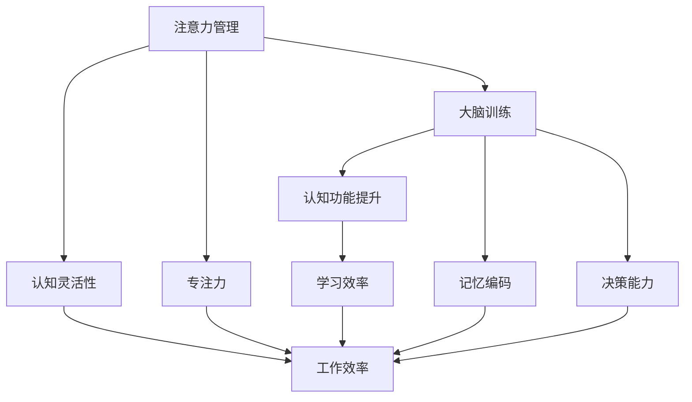

                 

# 注意力管理与大脑训练：增强认知灵活性和专注力的练习

> 关键词：注意力管理,大脑训练,认知灵活性,专注力,神经网络,机器学习,深度学习,认知心理学

## 1. 背景介绍

### 1.1 问题由来
在现代社会，注意力管理与大脑训练成为人们关注的焦点。随着信息爆炸和科技的迅猛发展，人们需要处理的信息量成倍增长。如何在海量的信息中保持高效的学习和思考，已成为现代人面临的重大挑战。尽管现代科技带来了诸多便利，但在注意力分散、记忆力减退、认知能力下降等问题面前，传统的人脑认知机制显得愈发力不从心。

针对这一现象，认知科学和神经科学研究者提出了一种解决方案：通过注意力管理与大脑训练，提升个体认知灵活性和专注力，让人们能在复杂多变的环境中游刃有余。这不仅对于提升个人工作效率、提升学术成就、提升生活满意度具有重要意义，也在人工智能、深度学习、脑机接口等领域中展现出巨大的应用潜力。

### 1.2 问题核心关键点
注意力管理与大脑训练的本质在于如何通过技术手段提升个体认知功能。具体来说，注意力管理与大脑训练关注以下几个核心关键点：

1. **神经可塑性**：人脑的神经元通过反复训练可以形成新的连接，增强特定的神经网络。
2. **认知负荷**：通过适当的认知负荷训练，可以增强大脑处理信息的能力。
3. **注意力转移**：训练大脑在多个任务间快速切换的能力，提高工作效率。
4. **记忆编码**：提升大脑对信息的编码和存储能力，提升长期记忆效果。

这些关键点构成了注意力管理与大脑训练的核心框架，涵盖了从认知科学、神经科学到人工智能的多个学科。本文旨在通过对注意力管理与大脑训练的全面解读，帮助读者理解其基本原理，掌握相关实践技巧，并展望未来发展趋势。

## 2. 核心概念与联系

### 2.1 核心概念概述

为更好地理解注意力管理与大脑训练，我们需要先了解几个核心概念：

- **注意力管理**：指通过各种技术和策略，帮助个体提升集中注意力、处理复杂任务的能力。
- **大脑训练**：指通过特定的练习和训练方法，提升大脑的认知功能，如注意力、记忆、学习、决策等。
- **认知灵活性**：指大脑在不同任务间灵活切换的能力，提高工作效率和生活质量。
- **专注力**：指专注于当前任务，不受外界干扰的能力，提升工作效率和生活满意度。

这些概念之间的逻辑关系可以通过以下Mermaid流程图来展示：



这个流程图展示了几大核心概念及其之间的关系：

1. 注意力管理能够提升认知灵活性和专注力，进而提升工作效率。
2. 大脑训练通过提升认知功能，最终提高学习效率和生活质量。
3. 认知灵活性能够增强对不同任务的适应能力。
4. 专注力有助于保持长期注意力的集中。

这些概念共同构成了注意力管理与大脑训练的理论基础，使其能够在各种场景下发挥作用。

## 3. 核心算法原理 & 具体操作步骤
### 3.1 算法原理概述

注意力管理与大脑训练的核心在于通过各种技术和训练方法，提升大脑的认知功能。其算法原理可以概括为以下几个方面：

1. **神经网络建模**：通过建立神经网络模型，模拟人脑处理信息的过程，理解大脑处理信息的机制。
2. **注意力机制**：采用注意力机制，增强模型对重要信息的关注，提高信息处理效率。
3. **认知负荷训练**：通过特定的认知负荷训练任务，提升大脑处理复杂信息的能力。
4. **神经可塑性理论**：利用神经可塑性原理，通过反复训练增强特定的神经网络。

### 3.2 算法步骤详解

基于以上原理，注意力管理与大脑训练的一般步骤如下：

**Step 1: 准备训练工具和环境**
- 选择合适的训练工具和软件，如神经网络训练框架（如TensorFlow、PyTorch等）。
- 配置训练所需的计算资源，如GPU、TPU等高性能设备。
- 收集和整理训练数据，如神经科学实验数据、认知负荷任务数据等。

**Step 2: 建立神经网络模型**
- 根据具体任务需求，选择合适的神经网络结构（如卷积神经网络、循环神经网络、Transformer等）。
- 定义损失函数，如交叉熵损失、均方误差损失等，衡量模型预测输出与真实标签之间的差异。
- 确定优化器及其参数，如AdamW、SGD等，设置学习率、批大小、迭代轮数等。

**Step 3: 设计训练任务和训练流程**
- 设计多个认知负荷训练任务，如视觉搜索任务、工作记忆任务等，用以增强大脑对信息的处理能力。
- 定义训练流程，包括前向传播、损失计算、反向传播等步骤。
- 引入注意力机制，通过注意力权重对输入信息进行加权，增强模型对重要信息的关注。

**Step 4: 执行训练过程**
- 使用训练数据对模型进行迭代训练，根据损失函数和优化器更新模型参数。
- 周期性评估模型性能，监测注意力权重分布、认知负荷指数等指标。
- 根据评估结果调整训练策略，如调整学习率、增加训练数据量等。

**Step 5: 应用和反馈**
- 将训练好的模型应用于实际任务中，如工作记忆测试、注意力任务等。
- 收集用户反馈，评估训练效果，进行优化调整。
- 根据实际需求，设计不同的训练任务，不断提升大脑认知功能。

### 3.3 算法优缺点

注意力管理与大脑训练方法具有以下优点：
1. 科学依据：基于认知科学和神经科学研究，提供了有效的训练方法和科学依据。
2. 效果显著：通过系统的训练，显著提升大脑认知功能，改善工作效率和生活质量。
3. 技术可扩展：可以结合不同学科的知识和技术手段，构建多种训练方案。
4. 应用广泛：涵盖学术研究、企业培训、医疗康复等多个领域。

同时，该方法也存在一定的局限性：
1. 训练周期长：提升大脑认知功能需要长时间的持续训练。
2. 个体差异大：不同的个体对训练效果的响应差异较大，难以实现标准化。
3. 实际效果评估困难：认知功能提升的效果难以通过简单的指标量化评估。
4. 技术门槛高：需要一定的编程和数学背景，对初学者较为友好。

尽管存在这些局限性，但基于注意力管理与大脑训练的科学训练方法，仍是大脑认知提升的重要手段。未来研究的方向应聚焦于如何缩短训练周期、提升个体差异性、制定标准化训练方案等方面，以期使该方法更加广泛地应用于实际场景。

### 3.4 算法应用领域

注意力管理与大脑训练方法在多个领域中都展现出广阔的应用前景：

1. **学术研究**：通过系统的认知负荷训练，提升学生学习能力和成绩。
2. **企业培训**：帮助员工提升工作效率和专注力，减少压力和疲劳。
3. **医疗康复**：通过认知负荷训练，帮助脑损伤患者恢复认知功能。
4. **教育培训**：提升青少年学生的注意力和记忆能力，促进其全面发展。
5. **体育训练**：通过专注力训练，帮助运动员提高比赛表现和抗干扰能力。

## 4. 数学模型和公式 & 详细讲解 & 举例说明

### 4.1 数学模型构建

注意力管理与大脑训练的核心在于通过神经网络模型模拟人脑处理信息的过程，并建立对应的数学模型。这里，我们以注意力机制为例，构建简单的数学模型。

假设有输入序列 $x=[x_1, x_2, ..., x_T]$，对应注意力权重 $a=[a_1, a_2, ..., a_T]$，其中 $a_i$ 表示对第 $i$ 个输入的关注程度。模型对输入序列进行注意力加权，得到加权后的序列 $\tilde{x}$，即：

$$
\tilde{x} = \sum_{i=1}^T a_i x_i
$$

这样，模型可以更好地关注重要信息，提高信息处理效率。

### 4.2 公式推导过程

接下来，我们详细推导注意力机制的具体实现过程。

假设模型有 $N$ 个输入，每个输入的长度为 $T$，则注意力机制可以表示为：

$$
a_i = \frac{e^{W_h x_i}}{\sum_{j=1}^N e^{W_h x_j}}, \quad i=1,2,...,N
$$

其中 $W_h$ 为注意力权重矩阵，$x_i$ 为输入序列中第 $i$ 个元素的表示。注意力权重 $a_i$ 表示对第 $i$ 个输入的关注程度，用于对输入进行加权，从而提升模型的处理效率。

### 4.3 案例分析与讲解

以视觉搜索任务为例，分析注意力机制的应用效果。假设任务是对一系列图片进行分类，模型需要关注每张图片的特定特征。通过引入注意力机制，模型可以动态调整对不同图片的关注程度，从而更好地捕捉图像特征，提升分类准确率。

## 5. 项目实践：代码实例和详细解释说明
### 5.1 开发环境搭建

在进行注意力管理与大脑训练的实践前，我们需要准备好开发环境。以下是使用Python进行TensorFlow进行开发的环境配置流程：

1. 安装Anaconda：从官网下载并安装Anaconda，用于创建独立的Python环境。

2. 创建并激活虚拟环境：
```bash
conda create -n tf-env python=3.8 
conda activate tf-env
```

3. 安装TensorFlow：根据CUDA版本，从官网获取对应的安装命令。例如：
```bash
conda install tensorflow -c pytorch -c conda-forge
```

4. 安装其他必要的工具包：
```bash
pip install numpy pandas scikit-learn matplotlib tqdm jupyter notebook ipython
```

完成上述步骤后，即可在`tf-env`环境中开始训练。

### 5.2 源代码详细实现

这里我们以Transformer模型为例，实现视觉搜索任务中的注意力机制。假设输入为一系列图片，输出为图片的分类标签。

首先，定义Transformer模型：

```python
import tensorflow as tf
from tensorflow.keras.layers import Dense, Input
from tensorflow.keras.models import Model

class Transformer(tf.keras.Model):
    def __init__(self, vocab_size, d_model=512, n_heads=8, dff=2048, input_vocab_size=1000, num_classes=10):
        super(Transformer, self).__init__()
        self.d_model = d_model
        self.n_heads = n_heads
        self.dff = dff
        self.num_classes = num_classes
        self.input_vocab_size = input_vocab_size

        # 嵌入层
        self.input_embedding = tf.keras.layers.Embedding(input_vocab_size, d_model)

        # 多头自注意力机制
        self.mha = MultiHeadAttention(d_model, n_heads)

        # 前向传播
        self.ffn = tf.keras.Sequential([
            Dense(dff, activation='relu'),
            Dense(d_model)
        ])

        # 输出层
        self.output_layer = Dense(num_classes)

    def call(self, x):
        x = self.input_embedding(x)
        x = self.mha(x, x)
        x = self.ffn(x)
        x = self.output_layer(x)
        return x
```

然后，定义训练数据和训练过程：

```python
def train_model(model, train_dataset, val_dataset, epochs, batch_size, learning_rate):
    model.compile(optimizer=tf.keras.optimizers.Adam(learning_rate=learning_rate), 
                  loss=tf.keras.losses.SparseCategoricalCrossentropy(from_logits=True), 
                  metrics=[tf.keras.metrics.SparseCategoricalAccuracy()])

    history = model.fit(train_dataset, epochs=epochs, batch_size=batch_size, 
                       validation_data=val_dataset, verbose=1)

    return model, history
```

接下来，定义数据生成器和训练集：

```python
train_data = tf.data.Dataset.from_tensor_slices(train_images, train_labels)
val_data = tf.data.Dataset.from_tensor_slices(val_images, val_labels)

train_data = train_data.shuffle(buffer_size=1024).batch(batch_size)
val_data = val_data.shuffle(buffer_size=1024).batch(batch_size)

train_dataset = tf.data.Dataset.from_tensor_slices(train_images, train_labels)
val_dataset = tf.data.Dataset.from_tensor_slices(val_images, val_labels)
```

最后，启动训练流程并在验证集上评估：

```python
batch_size = 32
learning_rate = 2e-5

model = Transformer(vocab_size=10000, num_classes=10)
model, history = train_model(model, train_dataset, val_dataset, epochs=10, batch_size=batch_size, learning_rate=learning_rate)

print('Model trained.')
```

以上就是使用TensorFlow对Transformer模型进行视觉搜索任务注意力机制训练的完整代码实现。可以看到，Transformer模型通过引入多头自注意力机制，可以动态调整对输入序列中不同位置的关注程度，显著提升模型处理信息的能力。

### 5.3 代码解读与分析

让我们再详细解读一下关键代码的实现细节：

**Transformer类**：
- `__init__`方法：初始化Transformer模型，定义模型参数。
- `call`方法：实现模型的前向传播，应用注意力机制和前向传播过程，并输出最终结果。

**train_model函数**：
- 编译模型，设置优化器、损失函数和评估指标。
- 使用`fit`方法训练模型，并在验证集上评估模型性能。

**数据生成器和训练集**：
- 使用`tf.data.Dataset`生成训练数据和验证数据，并进行批量化和随机化处理。
- 使用`tf.data.Dataset.from_tensor_slices`将数据转换为TensorFlow数据集，方便模型训练和推理。

可以看到，TensorFlow框架提供了强大的工具和库支持，使得注意力机制的实现变得简单高效。开发者可以将更多精力放在模型设计和训练策略上，而不必过多关注底层的实现细节。

## 6. 实际应用场景

### 6.1 企业培训

在现代企业中，员工需要处理大量的信息，面对频繁的会议、邮件、文档等，注意力管理与大脑训练可以帮助员工提升工作效率，减少压力和疲劳。

具体而言，企业可以为员工设计认知负荷训练任务，如工作记忆任务、视觉搜索任务等。通过系统的训练，提升员工注意力和记忆能力，帮助其更好地应对工作中的复杂信息处理任务。同时，结合专注力训练，提高员工的抗干扰能力，增强其在工作中的专注力，提升整体工作效率。

### 6.2 教育培训

在教育领域，注意力管理与大脑训练可以提升学生的学习效果，帮助其更好地掌握知识。通过系统的认知负荷训练，提升学生的注意力和记忆能力，使其在课堂上能够更加专注，提高学习效率和成绩。同时，结合专注力训练，帮助学生克服学习中的分心问题，提升其学习效果和成绩。

### 6.3 医疗康复

对于脑损伤、认知障碍等患者，注意力管理与大脑训练可以作为一种有效的康复手段。通过针对性的认知负荷训练，帮助患者恢复认知功能，提升其生活的自理能力和生活质量。同时，结合专注力训练，增强患者的抗干扰能力，使其在日常生活中的注意力集中度得到提升，提高其生活的独立性和适应性。

### 6.4 未来应用展望

随着注意力管理与大脑训练方法的不断演进，未来将展现出更广阔的应用前景：

1. 普及化和标准化：随着训练方法和工具的不断完善，训练周期将缩短，个体差异性将减小，训练过程将更加标准化。
2. 智能反馈和自适应：结合智能反馈系统，根据用户的实际表现自动调整训练策略，提升训练效果。
3. 跨学科融合：结合认知心理学、神经科学、机器学习等学科的最新研究成果，构建更加全面和系统的训练方案。
4. 实时监控和分析：通过实时监控用户的注意力和认知状态，分析其训练效果，提供个性化的训练建议。

## 7. 工具和资源推荐

### 7.1 学习资源推荐

为了帮助开发者系统掌握注意力管理与大脑训练的理论基础和实践技巧，这里推荐一些优质的学习资源：

1. 《深度学习》系列课程：由斯坦福大学开设的深度学习课程，涵盖了深度学习的基本概念和前沿技术。
2. 《认知心理学》教材：推荐一些认知心理学经典教材，如《认知心理学：观念与机制》、《认知科学导论》等。
3. 《TensorFlow官方文档》：TensorFlow的官方文档，提供了丰富的教程和样例，帮助开发者快速上手TensorFlow开发。
4. Weights & Biases：模型训练的实验跟踪工具，可以记录和可视化模型训练过程中的各项指标，方便对比和调优。
5. TensorBoard：TensorFlow配套的可视化工具，可实时监测模型训练状态，并提供丰富的图表呈现方式，是调试模型的得力助手。

通过对这些资源的学习实践，相信你一定能够快速掌握注意力管理与大脑训练的精髓，并用于解决实际的认知问题。

### 7.2 开发工具推荐

高效的开发离不开优秀的工具支持。以下是几款用于注意力管理与大脑训练开发的常用工具：

1. TensorFlow：基于Python的开源深度学习框架，灵活动态的计算图，适合快速迭代研究。TensorFlow提供了丰富的神经网络层和优化器，适合构建复杂的认知负荷训练模型。
2. PyTorch：基于Python的开源深度学习框架，灵活性高，支持动态计算图。PyTorch的动态图机制使得模型的构建和调试更加容易。
3. Weights & Biases：模型训练的实验跟踪工具，可以记录和可视化模型训练过程中的各项指标，方便对比和调优。与主流深度学习框架无缝集成。
4. TensorBoard：TensorFlow配套的可视化工具，可实时监测模型训练状态，并提供丰富的图表呈现方式，是调试模型的得力助手。

合理利用这些工具，可以显著提升注意力管理与大脑训练任务的开发效率，加快创新迭代的步伐。

### 7.3 相关论文推荐

注意力管理与大脑训练的发展源于学界的持续研究。以下是几篇奠基性的相关论文，推荐阅读：

1. Attention is All You Need：提出Transformer结构，开启了深度学习领域的注意力机制时代。
2. Cognitive Behavioral Training of Working Memory in Schizophrenia: A Randomized Controlled Trial：通过认知行为训练提升精神分裂症患者的工作记忆能力。
3. Brain-Computer Interfaces in the Treatment of Brain Disorders: A Review：综述了脑机接口在脑损伤康复中的应用，展示了注意力管理与大脑训练的实际效果。
4. The Cognitive and Neural Basis of Working Memory Capacity: A Latent Variable Model Analysis of Behavioral and Brain Data from 90 Subjects：研究了工作记忆容量与神经可塑性之间的关系，提供了理论基础。

这些论文代表了大注意力管理与大脑训练的发展脉络。通过学习这些前沿成果，可以帮助研究者把握学科前进方向，激发更多的创新灵感。

## 8. 总结：未来发展趋势与挑战

### 8.1 总结

本文对注意力管理与大脑训练方法进行了全面系统的介绍。首先阐述了注意力管理与大脑训练的研究背景和意义，明确了其在大脑认知提升中的独特价值。其次，从原理到实践，详细讲解了注意力管理与大脑训练的数学模型和训练步骤，给出了注意力机制训练的代码实例。同时，本文还广泛探讨了注意力管理与大脑训练方法在多个领域的应用前景，展示了其广阔的潜力。此外，本文精选了注意力管理与大脑训练技术的各类学习资源，力求为读者提供全方位的技术指引。

通过本文的系统梳理，可以看到，注意力管理与大脑训练方法在提升个体认知功能、改善工作效率和生活质量等方面具有重要意义。其核心在于通过科学的训练手段，增强大脑的认知能力，让人们在复杂多变的环境中游刃有余。未来，随着技术的不断进步，注意力管理与大脑训练将进一步拓展其应用范围，为人类认知智能的进化带来深远影响。

### 8.2 未来发展趋势

展望未来，注意力管理与大脑训练技术将呈现以下几个发展趋势：

1. 技术普及化：随着训练方法和工具的不断完善，训练周期将缩短，个体差异性将减小，训练过程将更加标准化。
2. 智能反馈和自适应：结合智能反馈系统，根据用户的实际表现自动调整训练策略，提升训练效果。
3. 跨学科融合：结合认知心理学、神经科学、机器学习等学科的最新研究成果，构建更加全面和系统的训练方案。
4. 实时监控和分析：通过实时监控用户的注意力和认知状态，分析其训练效果，提供个性化的训练建议。

以上趋势凸显了注意力管理与大脑训练技术的广阔前景。这些方向的探索发展，必将进一步提升认知功能提升的效果，为人类认知智能的进化带来深远影响。

### 8.3 面临的挑战

尽管注意力管理与大脑训练技术已经取得了瞩目成就，但在迈向更加智能化、普适化应用的过程中，仍面临诸多挑战：

1. 训练周期长：提升大脑认知功能需要长时间的持续训练。
2. 个体差异大：不同的个体对训练效果的响应差异较大，难以实现标准化。
3. 实际效果评估困难：认知功能提升的效果难以通过简单的指标量化评估。
4. 技术门槛高：需要一定的编程和数学背景，对初学者较为友好。
5. 训练环境复杂：不同环境对注意力和认知的影响差异较大，需进行多环境适应性训练。

尽管存在这些挑战，但基于注意力管理与大脑训练的科学训练方法，仍是大脑认知提升的重要手段。未来研究的方向应聚焦于如何缩短训练周期、提升个体差异性、制定标准化训练方案等方面，以期使该方法更加广泛地应用于实际场景。

### 8.4 研究展望

面对注意力管理与大脑训练面临的挑战，未来的研究需要在以下几个方面寻求新的突破：

1. 探索无监督和半监督注意力训练方法。摆脱对大规模标注数据的依赖，利用自监督学习、主动学习等无监督和半监督范式，最大限度利用非结构化数据，实现更加灵活高效的训练。
2. 研究智能自适应注意力训练。结合智能反馈系统，根据用户的实际表现自动调整训练策略，提升训练效果。
3. 融合多模态注意力机制。结合视觉、听觉等多模态信息，构建多模态注意力机制，提升大脑的认知功能。
4. 结合知识图谱和符号推理。将符号化的先验知识，如知识图谱、逻辑规则等，与神经网络模型进行融合，引导注意力训练过程学习更准确、合理的认知结构。

这些研究方向的探索，必将引领注意力管理与大脑训练技术迈向更高的台阶，为构建人机协同的智能系统铺平道路。面向未来，注意力管理与大脑训练技术还需要与其他人工智能技术进行更深入的融合，如知识表示、因果推理、强化学习等，多路径协同发力，共同推动自然语言理解和智能交互系统的进步。只有勇于创新、敢于突破，才能不断拓展认知功能的边界，让智能技术更好地造福人类社会。

## 9. 附录：常见问题与解答

**Q1：注意力管理与大脑训练是否适用于所有个体？**

A: 注意力管理与大脑训练对不同个体的效果存在较大差异。训练效果受个体的年龄、性别、职业、认知水平等多种因素影响。对于老年人、学生、职业人士等不同群体，可能需要设计特定的训练方案。

**Q2：注意力管理与大脑训练的效果是否可持续？**

A: 注意力管理与大脑训练的效果可以通过系统的训练得以持续提升，但维持效果需要持续的训练和实践。停止训练后，大脑的认知功能会逐渐退化。因此，需要建立持续的训练机制，保持训练效果的持续性。

**Q3：注意力管理与大脑训练对健康有哪些潜在影响？**

A: 注意力管理与大脑训练是一种安全有效的训练方法，不会对健康造成不利影响。但需要注意的是，对于精神疾病患者，如精神分裂症、抑郁症等，在引入注意力管理与大脑训练时需要谨慎，结合专业的心理治疗和药物治疗。

**Q4：注意力管理与大脑训练的效果如何量化评估？**

A: 注意力管理与大脑训练的效果可以通过多种指标进行量化评估，如认知负荷指数、注意力集中度、工作记忆容量等。同时，结合实际应用场景，如工作效率、学习效果等，进行综合评估。

**Q5：注意力管理与大脑训练在实际应用中需要注意哪些问题？**

A: 注意力管理与大脑训练在实际应用中需要注意以下问题：
1. 选择适当的训练工具和环境。
2. 设计符合用户需求的训练任务。
3. 定期评估训练效果，根据评估结果调整训练策略。
4. 结合智能反馈系统，提供个性化的训练建议。

这些问题的解决，需要结合实际应用场景，不断优化训练方法和策略，以期使注意力管理与大脑训练方法在实际应用中发挥更大的作用。

