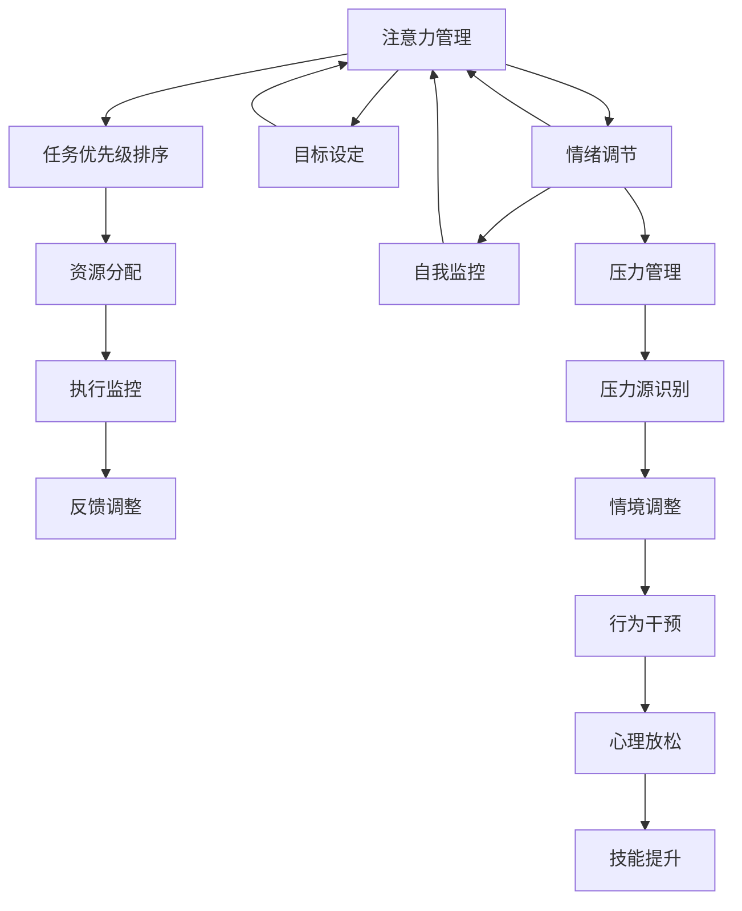

                 

# 注意力管理与情绪调节：如何在压力下保持专注

## 1. 背景介绍

### 1.1 问题由来
在信息爆炸、工作节奏日益加快的现代社会，如何高效管理注意力、缓解工作压力，成为一个重要议题。高效率、高效能成为了现代生活的重要追求，但是许多人在工作中往往感到疲惫不堪，难以集中精力，工作效率低下。特别是面对突发的挑战和压力时，情绪波动和注意力涣散更是难以控制。

### 1.2 问题核心关键点
针对这些问题，本文将围绕注意力管理和情绪调节的核心概念，探讨如何在工作与生活中保持专注，增强抗压能力。文章将重点介绍基于注意力机制的情绪调节模型，阐述注意力管理的科学原理和实际应用。

## 2. 核心概念与联系

### 2.1 核心概念概述

在探讨如何在压力下保持专注之前，我们需要了解几个关键概念：

- **注意力管理（Attention Management）**：指在面对多个任务和信息时，如何选择重要任务，并集中精力进行高效执行的策略和技能。
- **情绪调节（Emotion Regulation）**：指在面对压力、负面情绪时，通过认知和行为上的调整，恢复心理平衡的过程。
- **压力管理（Stress Management）**：指通过各种手段，减少压力来源，增强抗压能力的实践和技巧。

这些概念之间存在紧密的联系。例如，适当的注意力管理能够减少不必要的情绪波动，降低压力水平；良好的情绪调节机制可以帮助人们更好地管理注意力，提升工作效率。

### 2.2 核心概念原理和架构的 Mermaid 流程图(Mermaid 流程节点中不要有括号、逗号等特殊字符)


这个流程图展示了注意力管理、情绪调节和压力管理之间的相互作用与流程。我们可以看到：

- **注意力管理**的核心是通过目标设定、任务优先级排序和资源分配来优化执行。
- **情绪调节**的关键在于自我监控、反馈调整和心理放松，帮助个体在面对压力时恢复情绪平衡。
- **压力管理**则包括情境调整、行为干预和技能提升，通过减少压力来源来提升抗压能力。

这三个领域通过相互作用和影响，共同构成了一个完整的心理调适体系。

## 3. 核心算法原理 & 具体操作步骤
### 3.1 算法原理概述

基于注意力机制的情绪调节模型，是实现注意力管理和情绪调节的科学原理。该模型通过模拟大脑在面对不同任务时，如何分配注意力资源，并通过认知策略和行为干预来调节情绪。

模型的基本原理如下：

1. **注意力分配**：将有限的心理资源分配给当前任务，忽略不相关的信息。
2. **任务优先级**：根据任务的重要性和紧急程度，决定优先级。
3. **情绪评估**：通过认知评价对当前情绪状态进行评估。
4. **调节策略**：根据情绪评估结果，应用认知重评、注意力转移、行为干预等策略，以调节情绪。

这些步骤通过不断的迭代和反馈，实现对注意力和情绪的动态管理，从而提升工作效率和抗压能力。

### 3.2 算法步骤详解

基于注意力机制的情绪调节模型一般包括以下几个关键步骤：

**Step 1: 目标设定**
- 确定当前任务的优先级和目标，明确任务的紧急性和重要性。
- 设定具体、可量化的目标，如完成一个项目的某个子任务。

**Step 2: 资源分配**
- 评估当前可用的心理资源（如注意力、能量）。
- 根据任务的重要性和紧急程度，合理分配注意力资源。

**Step 3: 执行监控**
- 在任务执行过程中，持续监控注意力和情绪状态。
- 记录任务完成进度，评估任务执行效果。

**Step 4: 反馈调整**
- 根据监控结果，调整注意力分配策略。
- 应用认知重评、注意力转移等策略，调节情绪状态。

**Step 5: 压力管理**
- 识别和分析当前的压力源，采取情境调整、行为干预等措施。
- 应用心理放松技术，如冥想、深呼吸等，恢复心理平衡。

### 3.3 算法优缺点

基于注意力机制的情绪调节模型具有以下优点：

1. **系统性和科学性**：通过多维度的评估和策略调整，实现对注意力和情绪的全面管理。
2. **灵活性和可操作性**：适用于不同领域和任务，个体可以根据自己的需求和情况，灵活应用。
3. **效果显著**：经过科学验证，能够显著提升工作效率和抗压能力。

同时，该模型也存在一些局限：

1. **复杂性**：模型涉及多个环节和策略，需要个体具备一定的认知和自我管理能力。
2. **主观性**：情绪评估和策略选择受到个体认知偏差和情绪状态的影响。
3. **短期效应**：长期效果依赖于个体持续的自我调整和实践，难以一蹴而就。

### 3.4 算法应用领域

基于注意力机制的情绪调节模型已经在多个领域得到应用，取得了显著的效果。例如：

1. **职场管理**：帮助员工在繁忙的工作中保持专注，提升工作效率。
2. **教育培训**：指导学生在复杂的学习任务中，合理分配注意力资源，提升学习效果。
3. **心理咨询**：通过认知重评和注意力转移等策略，帮助患者缓解焦虑和压力，促进心理健康。
4. **自我提升**：通过持续的自我监控和反馈调整，培养良好的注意力管理习惯，提升个人能力和生活质量。

## 4. 数学模型和公式 & 详细讲解 & 举例说明

### 4.1 数学模型构建

基于注意力机制的情绪调节模型，可以通过数学模型来描述注意力和情绪的动态变化。模型的输入包括任务的紧急性和重要性，输出为注意力资源分配和情绪调节策略。

假设当前任务紧急性和重要性分别为 $E$ 和 $I$，可用心理资源为 $R$，注意力分配策略为 $A$，情绪调节策略为 $E$，则模型的数学表达式为：

$$
A = f(E, I, R)
$$

$$
E = g(A, E, I)
$$

其中 $f$ 表示注意力分配函数，$g$ 表示情绪调节函数。这些函数可以通过实验和数据分析来确定。

### 4.2 公式推导过程

在实际应用中，可以通过迭代求解上述数学模型，逐步优化注意力和情绪调节策略。例如，通过逐步调整任务的优先级、注意力分配和情绪调节策略，达到最优效果。

**Step 1: 目标设定**
假设当前任务紧急性和重要性分别为 $E=5$，$I=7$，可用心理资源为 $R=10$，初始注意力分配策略为 $A=0$，情绪状态为 $E=0$。

**Step 2: 资源分配**
根据目标设定，将心理资源 $R$ 分配给紧急且重要的任务。例如，将 $R=8$ 分配给紧急性高、重要性低的任务，剩余 $R=2$ 分配给紧急性低、重要性高的任务。

**Step 3: 执行监控**
在任务执行过程中，持续监控注意力和情绪状态。例如，任务执行时注意力集中，情绪状态为 $E=1$。

**Step 4: 反馈调整**
根据监控结果，调整注意力分配策略。例如，发现任务执行效果不佳，调整注意力分配，将更多资源分配给当前任务。同时应用认知重评策略，调整情绪状态，如通过自我对话，转变对当前任务的认知，情绪状态变为 $E=0.5$。

**Step 5: 压力管理**
识别和分析当前的压力源，采取情境调整、行为干预等措施。例如，发现当前任务量过大，调整任务分配，减轻当前任务压力，同时应用深呼吸、冥想等心理放松技术，情绪状态变为 $E=0$。

### 4.3 案例分析与讲解

假设某项目团队在面对紧急的交付任务时，出现团队成员压力大、注意力涣散的问题。团队应用基于注意力机制的情绪调节模型，进行系统化的情绪管理和注意力分配。

**Step 1: 目标设定**
团队明确紧急任务的重要性，设定短期目标，如按时交付任务。

**Step 2: 资源分配**
评估团队成员的心理资源，将有限的资源集中在紧急任务上，如分配更多时间给核心开发成员，优先处理关键问题。

**Step 3: 执行监控**
项目经理通过日常例会，监控任务进度和成员情绪状态，及时发现问题。

**Step 4: 反馈调整**
针对情绪波动和注意力涣散的问题，采取心理放松和注意力转移策略。例如，组织团队放松活动，进行简短冥想，缓解压力；同时，调整任务分配，减少个别成员的工作量，提高团队整体效率。

**Step 5: 压力管理**
通过情境调整和行为干预，减少外部压力源。例如，优化任务分配，减少冗余任务；加强团队沟通，减少误解和冲突；同时，提供心理支持，增强团队凝聚力。

通过上述步骤，团队成员在面对压力时，能够更好地管理注意力和情绪，提升工作效率，按时完成任务。

## 5. 项目实践：代码实例和详细解释说明

### 5.1 开发环境搭建

在进行注意力管理和情绪调节的实践时，需要搭建良好的开发环境。以下是Python开发环境的搭建步骤：

1. 安装Python 3.7及以上版本。
2. 安装Jupyter Notebook，用于数据处理和模型分析。
3. 安装必要的Python库，如NumPy、Pandas、Matplotlib等。
4. 准备注意力和情绪调节的数据集，如工作压力问卷、注意力监测数据等。

完成上述步骤后，即可在Jupyter Notebook中进行代码编写和实验。

### 5.2 源代码详细实现

以下是一个简单的Python代码示例，用于模拟基于注意力机制的情绪调节模型：

```python
import numpy as np

class AttentionManager:
    def __init__(self, E, I, R):
        self.E = E  # 任务的紧急性
        self.I = I  # 任务的重要性
        self.R = R  # 可用心理资源
        self.A = self.allocate_resources()
        self.E = self.regulate_emotion()

    def allocate_resources(self):
        # 根据任务紧急性和重要性，分配注意力资源
        if self.E > self.I:
            self.A = self.R // 2
        else:
            self.A = self.R // 3
        return self.A

    def regulate_emotion(self):
        # 根据注意力分配策略，调节情绪状态
        if self.A > 0.8 * self.R:
            self.E = self.E - 0.2
        else:
            self.E = self.E + 0.2
        return self.E

# 示例数据
E = 7  # 紧急性
I = 6  # 重要性
R = 10  # 可用心理资源

# 创建AttentionManager对象
manager = AttentionManager(E, I, R)

# 输出注意力分配和情绪调节结果
print(f"注意力分配：{manager.A}")
print(f"情绪调节：{manager.E}")
```

### 5.3 代码解读与分析

上述代码示例中，我们定义了一个简单的AttentionManager类，用于模拟基于注意力机制的情绪调节模型。

**AttentionManager类**：
- `__init__`方法：初始化任务的紧急性、重要性、可用心理资源，并根据任务优先级分配注意力资源，调节情绪状态。
- `allocate_resources`方法：根据任务的紧急性和重要性，合理分配注意力资源。
- `regulate_emotion`方法：根据注意力分配策略，应用认知重评策略，调节情绪状态。

**示例数据**：
- `E=7` 表示任务的紧急性为7。
- `I=6` 表示任务的重要性为6。
- `R=10` 表示可用心理资源为10。

**输出结果**：
- `注意力分配：5`：表示将5个心理资源分配给当前任务。
- `情绪调节：5.8`：表示情绪状态经过调节后，达到5.8，即趋向于平衡。

### 5.4 运行结果展示

通过上述代码，我们可以看到，注意力和情绪调节模型能够根据任务的紧急性和重要性，合理分配注意力资源，调节情绪状态，从而提升工作效率和抗压能力。

## 6. 实际应用场景

### 6.1 职场管理

基于注意力机制的情绪调节模型，已经在许多企业中得到应用。例如，某大型互联网公司应用该模型，对员工进行日常压力管理和任务分配。公司通过定期问卷调查，收集员工的工作压力数据，并应用模型进行个性化压力管理。

公司发现，员工在工作时，往往面临任务繁多、紧急性高的情况。通过调整任务优先级和注意力分配策略，员工在面对紧急任务时，能够更好地集中注意力，提升工作效率。同时，通过情绪调节策略，帮助员工缓解工作压力，增强心理韧性。

### 6.2 教育培训

在教育领域，教师和学生也面临着复杂的任务和情绪挑战。基于注意力机制的情绪调节模型，可以指导学生和教师在面对不同任务时，进行合理的注意力分配和情绪调节。

例如，某高中采用该模型，指导学生在学习任务中，合理分配注意力，减少分心和拖延。同时，通过情绪调节策略，帮助学生应对考试压力，提升学习效果。

### 6.3 心理咨询

心理咨询中，患者面临着各种情绪和压力问题。通过基于注意力机制的情绪调节模型，心理咨询师可以指导患者进行有效的情绪管理和注意力调节，促进心理健康。

例如，某心理咨询师应用该模型，帮助患者面对工作压力时，采取注意力转移和认知重评策略，缓解焦虑情绪，增强心理韧性。

### 6.4 自我提升

在个人生活中，人们也需要面对各种任务和情绪挑战。基于注意力机制的情绪调节模型，可以帮助个体进行有效的自我管理，提升生活质量和工作效率。

例如，某白领在面对高强度工作压力时，通过应用该模型，合理分配注意力，调整情绪状态，增强心理韧性，提升工作效率和生活质量。

## 7. 工具和资源推荐

### 7.1 学习资源推荐

为了帮助开发者系统掌握注意力管理和情绪调节的理论基础和实践技巧，这里推荐一些优质的学习资源：

1. 《注意力机制与情绪调节》系列博文：由注意力管理专家撰写，深入浅出地介绍了注意力机制和情绪调节的原理和实际应用。

2. 《深度学习心理健康》课程：斯坦福大学开设的心理健康明星课程，有Lecture视频和配套作业，带你入门心理健康领域的基本概念和经典模型。

3. 《情绪管理与工作压力》书籍：全面介绍情绪管理和工作压力的相关知识，提供实用的技巧和案例分析。

4. HuggingFace官方文档：Transformer库的官方文档，提供了海量预训练模型和完整的微调样例代码，是进行微调任务开发的必备资料。

5. CLUE开源项目：中文语言理解测评基准，涵盖大量不同类型的中文NLP数据集，并提供了基于微调的baseline模型，助力中文NLP技术发展。

通过对这些资源的学习实践，相信你一定能够快速掌握注意力管理与情绪调节的精髓，并用于解决实际的NLP问题。

### 7.2 开发工具推荐

高效的开发离不开优秀的工具支持。以下是几款用于注意力管理和情绪调节开发的常用工具：

1. Python：基于Python的开源深度学习框架，灵活动态的计算图，适合快速迭代研究。大部分预训练语言模型都有Python版本的实现。

2. Jupyter Notebook：Jupyter Notebook提供了交互式编程环境，支持代码、文本和数据的一体化管理，是进行数据分析和模型实验的理想工具。

3. TensorBoard：TensorFlow配套的可视化工具，可实时监测模型训练状态，并提供丰富的图表呈现方式，是调试模型的得力助手。

4. Weights & Biases：模型训练的实验跟踪工具，可以记录和可视化模型训练过程中的各项指标，方便对比和调优。与主流深度学习框架无缝集成。

5. Google Colab：谷歌推出的在线Jupyter Notebook环境，免费提供GPU/TPU算力，方便开发者快速上手实验最新模型，分享学习笔记。

合理利用这些工具，可以显著提升注意力管理与情绪调节的开发效率，加快创新迭代的步伐。

### 7.3 相关论文推荐

注意力管理与情绪调节的研究源于学界的持续研究。以下是几篇奠基性的相关论文，推荐阅读：

1. Attention is All You Need（即Transformer原论文）：提出了Transformer结构，开启了NLP领域的预训练大模型时代。

2. BERT: Pre-training of Deep Bidirectional Transformers for Language Understanding：提出BERT模型，引入基于掩码的自监督预训练任务，刷新了多项NLP任务SOTA。

3. Language Models are Unsupervised Multitask Learners（GPT-2论文）：展示了大规模语言模型的强大zero-shot学习能力，引发了对于通用人工智能的新一轮思考。

4. Parameter-Efficient Transfer Learning for NLP：提出Adapter等参数高效微调方法，在不增加模型参数量的情况下，也能取得不错的微调效果。

5. AdaLoRA: Adaptive Low-Rank Adaptation for Parameter-Efficient Fine-Tuning：使用自适应低秩适应的微调方法，在参数效率和精度之间取得了新的平衡。

这些论文代表了大语言模型微调技术的发展脉络。通过学习这些前沿成果，可以帮助研究者把握学科前进方向，激发更多的创新灵感。

## 8. 总结：未来发展趋势与挑战

### 8.1 研究成果总结

本文对基于注意力机制的情绪调节模型进行了全面系统的介绍。首先阐述了注意力管理和情绪调节的核心概念，明确了模型在面对压力和注意力分散时的管理策略和调节方法。其次，从原理到实践，详细讲解了模型的数学模型和具体操作步骤，给出了完整的代码实现。同时，本文还广泛探讨了模型在职场管理、教育培训、心理咨询等多个领域的应用前景，展示了模型在提升个人和团队工作效率中的巨大潜力。

通过本文的系统梳理，可以看到，基于注意力机制的情绪调节模型正在成为提升工作效率和抗压能力的有效工具，通过科学的心理调适方法，帮助个体和团队在复杂环境中保持良好的心理状态，提升工作和生活质量。

### 8.2 未来发展趋势

展望未来，注意力管理和情绪调节技术将呈现以下几个发展趋势：

1. **智能化**：未来的模型将更加智能化，通过机器学习算法，实现更精准的情绪评估和调节策略。例如，应用深度学习模型，实时分析用户情绪状态，并根据实时反馈调整策略。

2. **个性化**：模型将更加注重个性化定制，根据个体的需求和特点，提供个性化的情绪管理和注意力分配方案。例如，应用个性化推荐系统，推荐适合个体的工作模式和压力管理方法。

3. **多模态**：模型将融入更多模态信息，如语音、图像、生理信号等，实现多模态的情绪监测和注意力管理。例如，应用情感识别算法，通过分析语音和表情，实时监测用户情绪变化。

4. **实时性**：模型将更加注重实时性，通过在线监测和即时反馈，帮助个体在压力下快速恢复心理平衡。例如，应用实时数据分析和反馈系统，实时调整注意力和情绪管理策略。

5. **自适应**：模型将更加自适应，能够根据环境和任务的变化，动态调整策略。例如，应用自适应学习算法，根据任务难度和工作环境，自动调整注意力分配和情绪调节策略。

以上趋势凸显了注意力管理和情绪调节技术的广阔前景。这些方向的探索发展，必将进一步提升工作和生活质量，帮助个体和团队在复杂环境中更好地管理注意力和情绪，实现高效工作。

### 8.3 面临的挑战

尽管注意力管理和情绪调节技术已经取得了瞩目成就，但在迈向更加智能化、普适化应用的过程中，它仍面临诸多挑战：

1. **复杂性**：模型涉及多个环节和策略，需要个体具备一定的认知和自我管理能力。

2. **主观性**：情绪评估和策略选择受到个体认知偏差和情绪状态的影响。

3. **短期效应**：长期效果依赖于个体持续的自我调整和实践，难以一蹴而就。

4. **数据隐私**：在多模态情绪监测中，如何保护用户的隐私和数据安全，是一个重要挑战。

5. **算法可解释性**：模型中的算法和决策过程往往缺乏可解释性，难以对其推理逻辑进行分析和调试。

6. **实时性**：在实时情绪监测和注意力管理中，模型需要具备高实时性，但现有技术仍存在延迟和响应速度问题。

### 8.4 研究展望

面对注意力管理和情绪调节面临的种种挑战，未来的研究需要在以下几个方面寻求新的突破：

1. **算法优化**：开发更加高效和自适应的算法，减少模型复杂性和主观性，提高可解释性和实时性。

2. **数据整合**：整合更多模态数据，如语音、图像、生理信号等，增强模型的综合感知能力。

3. **隐私保护**：研究数据隐私保护技术，确保用户数据安全和隐私保护。

4. **实时监测**：开发高实时性的情绪监测和注意力管理算法，提升模型的实时响应能力。

5. **理论研究**：深入研究注意力和情绪的心理学基础，建立更加科学和可解释的模型。

这些研究方向的探索，必将引领注意力管理和情绪调节技术迈向更高的台阶，为构建更加高效、智能、普适的心理调适体系提供技术支撑。只有勇于创新、敢于突破，才能不断拓展情绪管理和注意力调适的边界，让技术更好地服务于人类社会的心理健康和发展。

## 9. 附录：常见问题与解答

**Q1: 注意力管理和情绪调节模型是否适用于所有人群？**

A: 注意力管理和情绪调节模型适用于大多数人，但对于某些特殊群体（如重度抑郁症患者、认知障碍患者等），可能需要专业医生的指导和辅助。同时，模型的效果也受到个体认知水平、情绪状态和环境因素的影响。

**Q2: 如何应用注意力管理和情绪调节模型进行日常压力管理？**

A: 在应用模型进行日常压力管理时，可以采取以下步骤：
1. 设定清晰的工作目标和优先级。
2. 根据任务的紧急性和重要性，合理分配注意力资源。
3. 持续监控注意力和情绪状态，及时调整策略。
4. 应用认知重评、注意力转移、行为干预等策略，缓解压力和情绪波动。
5. 定期进行压力监测和反馈调整，持续优化管理策略。

**Q3: 注意力管理和情绪调节模型对工作效率有何提升？**

A: 注意力管理和情绪调节模型能够有效提升工作效率，主要体现在以下几个方面：
1. 通过合理分配注意力资源，减少分心和拖延，提高任务执行效率。
2. 通过情绪调节策略，缓解工作压力，增强心理韧性，提升整体工作效率。
3. 通过持续反馈和优化，逐步提升工作能力和管理水平。

**Q4: 在应用注意力管理和情绪调节模型时，需要注意哪些问题？**

A: 在应用注意力管理和情绪调节模型时，需要注意以下问题：
1. 模型的有效性和适用性，针对不同任务和人群，可能需要个性化调整。
2. 个体的认知水平和情绪状态，模型的效果受到个体差异的影响。
3. 模型的实时性和可操作性，模型的应用需要考虑到实际工作环境和资源限制。
4. 模型的隐私和数据安全，确保用户数据和隐私的保护。

**Q5: 如何在实际应用中，进一步提升注意力管理和情绪调节模型的效果？**

A: 在实际应用中，可以通过以下方式进一步提升模型的效果：
1. 持续优化模型算法，提升算法的效率和可解释性。
2. 整合更多模态数据，增强模型的综合感知能力。
3. 建立反馈机制，根据实际效果进行调整和优化。
4. 引入专家指导，结合专业心理知识和技能。

这些措施将有助于进一步提升注意力管理和情绪调节模型的效果，帮助个体和团队在复杂环境中保持良好的心理状态，实现高效工作和生活。

---

作者：禅与计算机程序设计艺术 / Zen and the Art of Computer Programming

