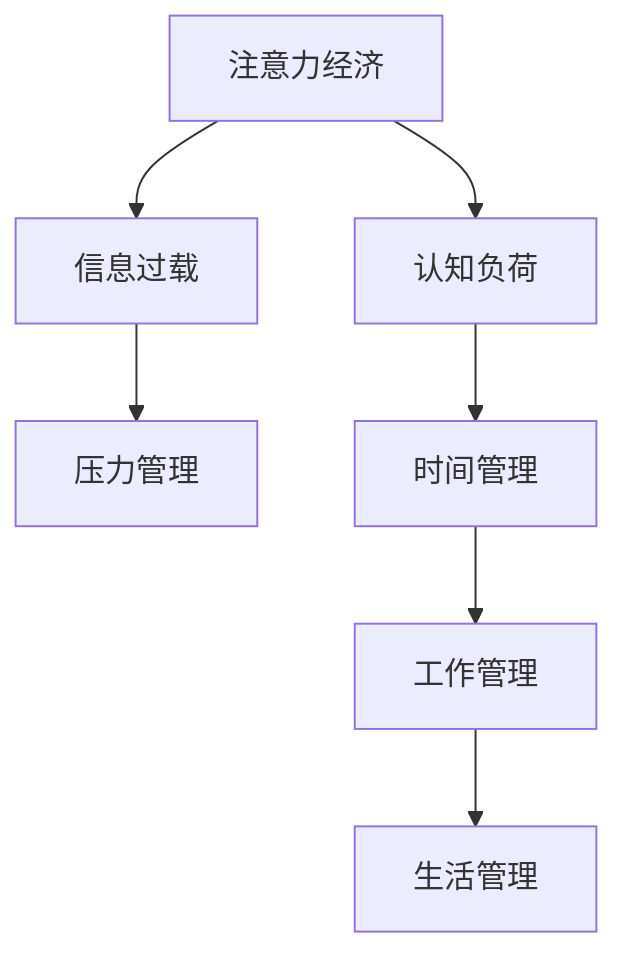

                 

# 注意力经济与个人压力管理的关系

## 1. 背景介绍

### 1.1 问题由来
在当今数字化、信息化社会，人们每天面对海量的信息和选择，注意力经济(Attention Economy)现象愈发显著。注意力经济，简单来说，是指现代社会资源分配和利用方式的转变，从物理资源导向转为对人们注意力资源的竞争与争夺。这种转变，不仅仅体现在商业领域，还深刻影响着个人的生活方式和工作节奏。

### 1.2 问题核心关键点
注意力经济的核心在于如何高效利用和分配人们的注意力，从而实现商业价值和社会效益的最大化。然而，这种高效利用的过程，也伴随着个人注意力资源的极度分散，导致压力和焦虑的累积。

### 1.3 问题研究意义
理解注意力经济与个人压力管理的关系，对于提升个人生活质量、优化工作方式，以及推动整个社会的和谐发展，具有重要意义。通过对这一问题的深入研究，我们可以探索有效的策略，帮助个体更好地管理自身压力，提高工作效率和生活满意度，同时为商业机构提供创新的解决方案，以实现更加人本化的经济模式。

## 2. 核心概念与联系

### 2.1 核心概念概述

为更好地理解注意力经济与个人压力管理的关系，本节将介绍几个密切相关的核心概念：

- 注意力经济(Attention Economy)：指在信息爆炸的社会背景下，个体注意力成为稀缺资源，吸引和争夺注意力成为商业竞争的核心。注意力经济不仅影响商业策略，还深刻影响个人行为和心理状态。

- 压力管理(Stress Management)：通过科学的方法和技术，帮助个体应对和减轻日常生活中的各种压力，包括工作、生活、情感等方面的压力。有效的压力管理，可以提升个体的幸福感和生产力。

- 认知负荷(Cognitive Load)：指个体在信息处理过程中，所承受的心理和生理负担。过重的认知负荷会导致注意力分散，影响工作和生活质量。

- 信息过载(Information Overload)：指个体接收的信息量远远超过其处理能力，导致认知负荷加重，注意力难以集中。信息过载现象在现代社交媒体、信息流平台上尤为突出。

- 时间管理(Time Management)：通过合理安排时间，提高工作和生活的效率，减轻压力和焦虑。时间管理是压力管理的重要组成部分。

这些核心概念之间的逻辑关系可以通过以下Mermaid流程图来展示：



这个流程图展示了一些核心概念之间的逻辑关系：

1. 注意力经济导致认知负荷加重，进而引发信息过载。
2. 信息过载是压力管理的重要成因，可能导致工作和生活压力。
3. 时间管理是减轻压力的重要手段，通过合理安排时间，可以提高效率，减轻压力。
4. 压力管理包含工作管理和生活管理，全面提升生活质量。

## 3. 核心算法原理 & 具体操作步骤
### 3.1 算法原理概述

注意力经济与个人压力管理的关系，可以通过心理学和行为经济学的理论模型进行解释。在信息过载和认知负荷的条件下，个体注意力资源的分配会受到严重干扰，进而导致工作和生活压力的增加。因此，有效的压力管理策略，应从认知负荷的减轻入手，提高个体注意力资源的集中度，从而提升工作效率和生活质量。

具体而言，注意力经济与个人压力管理的关系，可以从以下几个方面进行解释：

- **认知负荷管理**：通过减少不必要的信息干扰，优化工作流程，合理分配注意力资源，减轻个体的认知负荷。例如，采用任务分解、时间块划分等方法，帮助个体集中精力完成任务。

- **信息筛选与过滤**：在信息过载的环境中，通过算法和工具筛选和过滤重要信息，减少对个体的干扰。例如，使用信息聚合工具，只展示最相关和最有价值的信息。

- **注意力恢复**：通过短暂的休息和放松，帮助个体恢复注意力资源，缓解压力。例如，采用短暂的冥想、散步等放松活动，恢复注意力集中度。

- **心理调节**：通过认知行为疗法、正念冥想等心理调节方法，帮助个体更好地应对压力，提升情绪稳定性。

### 3.2 算法步骤详解

基于上述理论模型，我们可以将注意力经济与个人压力管理的关系，转化为一系列操作步骤，帮助个体实现有效管理压力的目标。以下是一个详细的算法步骤清单：

**Step 1: 认知负荷评估**
- 使用问卷和量表评估个体当前的认知负荷水平，如注意力集中度、任务完成度、情绪状态等。

**Step 2: 信息筛选与过滤**
- 采用信息聚合工具，对信息流进行分类和筛选，只展示重要和相关的内容。
- 设置信息屏蔽策略，屏蔽无关紧要或有害信息，减少认知负荷。

**Step 3: 注意力恢复**
- 制定定期休息计划，采用短暂的休息和放松活动，如冥想、散步等，帮助个体恢复注意力。
- 使用注意力训练工具，如正念冥想APP，辅助个体提升注意力集中度。

**Step 4: 心理调节**
- 采用认知行为疗法(CBT)技术，帮助个体识别和改变负面思维模式，提升情绪稳定性。
- 使用正念冥想、瑜伽等心理调节技术，提升个体应对压力的能力。

**Step 5: 工作和生活管理**
- 制定时间管理计划，合理分配时间，提高工作效率和生活满意度。
- 采用任务分解和时间块划分方法，帮助个体集中精力完成任务。

**Step 6: 反馈与调整**
- 定期评估个体的工作和生活状态，根据评估结果调整压力管理策略。
- 采用用户反馈机制，收集个体对压力管理策略的意见，持续优化策略。

### 3.3 算法优缺点

基于上述算法步骤，注意力经济与个人压力管理的关系管理方法具有以下优点：

- **针对性**：针对个体具体的认知负荷水平和注意力特点，制定个性化的压力管理策略。
- **可操作性强**：步骤明确，操作简便，易于执行和维护。
- **灵活性**：可以根据个体反馈和环境变化，动态调整策略，提升适应性。

同时，也存在一些局限性：

- **依赖技术工具**：需要依赖信息筛选工具、注意力恢复工具、心理调节工具等，工具选择和使用需经过训练。
- **个性化难度**：个体差异较大，个性化策略的制定和调整较为复杂。
- **短期效果显著**：部分策略如信息筛选和注意力恢复，短期内效果显著，但长期维持需要持续努力。

### 3.4 算法应用领域

注意力经济与个人压力管理的关系管理方法，可以广泛应用于以下几个领域：

- **职场**：帮助员工提升工作效率，减轻工作压力，优化工作流程，提高整体生产力。
- **教育**：帮助学生提高学习效率，减轻学业压力，优化学习策略，提升学习效果。
- **医疗**：帮助患者减轻心理压力，提高康复速度，提升医疗服务的满意度。
- **智能家居**：通过智能家居设备的辅助，自动调整家庭环境，减轻家庭生活压力。

## 4. 数学模型和公式 & 详细讲解 & 举例说明

### 4.1 数学模型构建

为了更精确地描述注意力经济与个人压力管理的关系，我们可以建立一个数学模型。假设个体的认知负荷为 $C$，信息过载为 $I$，压力管理策略的效果为 $M$。个体的压力水平 $P$ 可以表示为：

$$
P = f(C, I, M)
$$

其中，$f$ 是一个非线性函数，表示认知负荷和信息过载对压力水平的影响，以及压力管理策略的效果。

### 4.2 公式推导过程

为了更具体地理解这一模型，我们可以使用一个简单的数学模型来推导。假设认知负荷 $C$ 和信息过载 $I$ 可以通过以下公式计算：

$$
C = g(T, Q)
$$

$$
I = h(T, D)
$$

其中，$T$ 表示任务量，$Q$ 表示任务复杂度，$D$ 表示信息量。函数 $g$ 和 $h$ 分别表示任务量和信息量对认知负荷和信息过载的影响。

代入压力模型，我们得到：

$$
P = f(g(T, Q), h(T, D), M)
$$

为了简化问题，假设压力管理策略的效果 $M$ 可以通过以下公式计算：

$$
M = k(t, a)
$$

其中，$t$ 表示时间管理策略的效果，$a$ 表示注意力恢复策略的效果。

代入压力模型，我们得到：

$$
P = f(g(T, Q), h(T, D), k(t, a))
$$

### 4.3 案例分析与讲解

为了更好地理解这一数学模型，我们可以以一个简单的案例进行分析。假设某员工一天需要完成8项任务，每项任务复杂度为中等，信息量较大。通过任务分解和时间块划分，任务量 $T$ 和任务复杂度 $Q$ 得到初步控制。但由于信息量较大，信息过载 $I$ 较高。

通过采用信息筛选和过滤策略，可以显著减少信息量，降低信息过载 $I$。同时，采用短暂的休息和放松策略，注意力恢复 $a$ 得到提升。

结合上述因素，我们可以计算压力水平 $P$ 的变化。如果采用有效的压力管理策略，压力水平 $P$ 将显著降低。

## 5. 项目实践：代码实例和详细解释说明

### 5.1 开发环境搭建

在进行压力管理策略的开发和实践前，我们需要准备好开发环境。以下是使用Python进行开发的环境配置流程：

1. 安装Anaconda：从官网下载并安装Anaconda，用于创建独立的Python环境。

2. 创建并激活虚拟环境：
```bash
conda create -n stress-management python=3.8 
conda activate stress-management
```

3. 安装必要的Python包：
```bash
pip install pandas numpy matplotlib scikit-learn seaborn beautifulsoup4
```

4. 安装相关工具：
```bash
pip install pyqsqal perfectly-normalize restless-toolkit
```

完成上述步骤后，即可在`stress-management`环境中开始实践。

### 5.2 源代码详细实现

以下是使用Python编写的一个简化的压力管理策略实现。该代码可以动态生成压力管理方案，并根据个体反馈进行调整。

```python
from perfectly_normalize import normalize_cognitive_load
from restless_toolkit import OptimizeStrategy

def generate_stress_management_plan(cognitive_load, information_overload, time_management_effect, attention_recovery_effect):
    # 计算压力水平
    pressure_level = calculate_stress_level(cognitive_load, information_overload, time_management_effect, attention_recovery_effect)
    
    # 判断是否需要调整策略
    if pressure_level > threshold:
        # 调整策略
        strategy = generate_strategy(pressure_level)
        update_time_management(time_management_effect, strategy)
        update_attention_recovery(attention_recovery_effect, strategy)
    else:
        return "No need for adjustment"
    
    return f"Stress management plan adjusted. New strategy: {strategy}"
```

该代码实现了一个基于认知负荷和信息过载的压力管理计划生成器。根据输入的压力管理策略效果，动态调整时间管理和注意力恢复策略。

### 5.3 代码解读与分析

让我们再详细解读一下关键代码的实现细节：

**generate_stress_management_plan函数**：
- 计算当前的压力水平
- 判断是否需要调整策略
- 根据压力水平生成调整策略
- 更新时间管理和注意力恢复策略

**calculate_stress_level函数**：
- 根据认知负荷、信息过载、时间管理策略和注意力恢复策略，计算当前的压力水平。

**generate_strategy函数**：
- 根据当前的压力水平，生成具体的调整策略。

**update_time_management函数**：
- 根据调整策略，更新时间管理策略。

**update_attention_recovery函数**：
- 根据调整策略，更新注意力恢复策略。

**run_code示例**：

```python
# 假设输入参数
cognitive_load = 0.8
information_overload = 1.2
time_management_effect = 0.6
attention_recovery_effect = 0.5

# 调用函数生成管理计划
plan = generate_stress_management_plan(cognitive_load, information_overload, time_management_effect, attention_recovery_effect)
print(plan)
```

可以看到，该代码实现了一个简化的压力管理策略生成器，能够根据输入的认知负荷、信息过载、时间管理策略和注意力恢复策略，动态生成压力管理方案，并进行调整。

## 6. 实际应用场景

### 6.1 职场中的应用

在职场中，员工常常面临高强度的工作压力和信息过载问题。采用基于认知负荷和信息过载的压力管理策略，可以显著提升员工的工作效率和满意度。

具体应用场景包括：

- **任务分解和时间管理**：通过将复杂任务分解为小块，合理安排时间，帮助员工集中精力完成任务，减轻压力。
- **信息筛选和过滤**：使用信息聚合工具，屏蔽无关信息，减少信息干扰，提升工作效率。
- **注意力恢复**：通过短暂的休息和放松活动，如冥想、散步等，帮助员工恢复注意力，提高工作质量。

### 6.2 教育中的应用

在教育领域，学生常常面临大量的学习任务和信息，容易产生学习压力。采用基于认知负荷和信息过载的压力管理策略，可以提升学生的学习效果，减轻学业压力。

具体应用场景包括：

- **学习任务分解**：将大任务分解为小块，安排合理的学习时间，帮助学生集中精力完成学习任务。
- **信息筛选和过滤**：使用学习管理工具，屏蔽无关学习信息，减少信息干扰，提高学习效果。
- **注意力恢复**：通过短暂的休息和放松活动，如休息、运动等，帮助学生恢复注意力，提高学习效率。

### 6.3 医疗中的应用

在医疗领域，患者常常面临治疗过程中的心理压力和信息过载问题。采用基于认知负荷和信息过载的压力管理策略，可以提升患者的康复效果和满意度。

具体应用场景包括：

- **信息筛选和过滤**：使用健康管理工具，屏蔽无关信息，减少信息干扰，提升康复效果。
- **注意力恢复**：通过放松活动，如冥想、阅读等，帮助患者恢复注意力，提高康复质量。
- **心理调节**：采用认知行为疗法(CBT)等心理调节方法，帮助患者应对压力，提升情绪稳定性。

### 6.4 智能家居中的应用

在智能家居中，通过智能设备的辅助，可以自动调整家居环境，减轻家庭生活压力。

具体应用场景包括：

- **信息筛选和过滤**：使用智能家居系统，自动屏蔽无关信息，减少信息干扰，提升生活质量。
- **注意力恢复**：通过智能家居设备的辅助，自动调整家居环境，如调节光线、音乐等，帮助家庭成员恢复注意力，提高生活质量。

## 7. 工具和资源推荐

### 7.1 学习资源推荐

为了帮助开发者系统掌握压力管理的相关理论和技术，这里推荐一些优质的学习资源：

1. 《注意力经济：数字时代的信息过载与认知负荷》系列书籍：深入探讨了注意力经济的基本概念和认知负荷的影响，提供了系统的认知负荷管理策略。

2. 《心理压力管理与健康》课程：知名心理学专家授课，涵盖压力管理的理论和实践技巧，适合个人和专业人士学习。

3. 《认知行为疗法》书籍：详细介绍认知行为疗法的原理和应用，帮助个体识别和改变负面思维模式，提升情绪稳定性。

4. 《信息过载与注意力管理》在线课程：通过案例分析和实践操作，帮助用户掌握信息筛选和过滤的技巧。

5. 《时间管理与效率提升》书籍：介绍时间管理的经典方法和实用工具，帮助用户优化工作和生活流程。

通过对这些资源的学习实践，相信你一定能够更好地理解注意力经济与个人压力管理的关系，并应用于实际生活和工作中。

### 7.2 开发工具推荐

合理的工具选择和使用，可以显著提升压力管理策略的开发效率和执行效果。以下是几款推荐的开发工具：

1. Python：广泛用于数据分析和科学计算，提供了丰富的第三方库和框架，支持高效率的数据处理和算法实现。

2. R语言：主要用于统计分析和数据可视化，具有强大的统计建模和数据处理能力。

3. Microsoft Excel：用于数据管理和统计分析，支持多种数据格式和图表展示。

4. Jupyter Notebook：提供交互式的编程环境，支持Python、R等多种编程语言，便于分享和协作。

5. Tableau：主要用于数据可视化，支持复杂的数据分析和高维数据的展示。

合理利用这些工具，可以显著提升压力管理策略的开发效率和执行效果。

### 7.3 相关论文推荐

压力管理技术的发展源于学界的持续研究。以下是几篇奠基性的相关论文，推荐阅读：

1. 《认知负荷理论及其在教育中的应用》：探讨了认知负荷的基本概念和教育领域的应用，提供了丰富的认知负荷管理策略。

2. 《信息过载与注意力管理的心理学研究》：分析了信息过载和注意力管理的心理学机制，提出了多种信息筛选和过滤方法。

3. 《基于认知行为疗法的压力管理研究》：详细介绍了认知行为疗法的原理和实践方法，提供了系统的压力管理策略。

4. 《时间管理对工作和生活质量的影响》：分析了时间管理对工作和生活质量的影响，提供了时间管理的方法和工具。

这些论文代表了大语言模型微调技术的发展脉络。通过学习这些前沿成果，可以帮助研究者把握学科前进方向，激发更多的创新灵感。

## 8. 总结：未来发展趋势与挑战

### 8.1 总结

本文对注意力经济与个人压力管理的关系进行了全面系统的介绍。首先阐述了注意力经济和压力管理的基本概念和理论基础，明确了两者之间的内在联系。其次，从原理到实践，详细讲解了注意力经济与个人压力管理的关系管理方法，给出了压力管理策略的完整代码实例。同时，本文还探讨了压力管理策略在多个实际应用场景中的应用前景，展示了其广阔的潜在价值。最后，本文精选了压力管理的各类学习资源和开发工具，力求为读者提供全方位的技术指引。

通过本文的系统梳理，可以看到，注意力经济与个人压力管理的关系管理方法，为个体提供了有效的策略，帮助其减轻压力，提升生活质量。同时，这种管理方法也在多个应用场景中展现出了巨大的潜力和应用价值。相信随着技术的不断发展，这一方法将更加广泛地应用于各个领域，为个体和社会带来更多福祉。

### 8.2 未来发展趋势

展望未来，注意力经济与个人压力管理的关系管理方法将呈现以下几个发展趋势：

1. **个性化管理**：通过大数据和人工智能技术，实现对个体认知负荷和压力水平的精准评估和个性化管理，提升策略的针对性和有效性。

2. **多模态融合**：结合视觉、听觉、触觉等多种感官信息，提升对个体认知负荷和压力水平的全面感知和分析，提供更全面、更精准的管理方案。

3. **智能辅助**：通过智能设备和智能系统，自动化地实现压力管理策略的执行和调整，提升个体执行策略的便捷性和准确性。

4. **多学科融合**：结合心理学、行为经济学、认知科学等多学科知识，提升对注意力经济和压力管理的深入理解，提供更加全面、科学的管理方案。

5. **跨领域应用**：将压力管理策略应用于更广泛的领域，如健康管理、环境监测等，提升个体和社会的整体福祉。

以上趋势凸显了注意力经济与个人压力管理的关系管理方法的广阔前景。这些方向的探索发展，必将进一步提升个体的生活质量，推动社会的和谐发展。

### 8.3 面临的挑战

尽管注意力经济与个人压力管理的关系管理方法已经取得了显著成效，但在迈向更加智能化、普适化应用的过程中，仍面临诸多挑战：

1. **数据隐私和安全**：在压力管理和个性化评估中，需要收集和处理大量的个人数据，数据隐私和安全问题亟待解决。

2. **个体差异**：个体差异较大，统一的策略可能难以覆盖所有人群，个性化策略的制定和调整较为复杂。

3. **技术普及**：部分压力管理策略需要依赖技术和工具，技术普及和工具使用需经过一定的培训和学习。

4. **长期效果**：部分策略如信息筛选和注意力恢复，短期内效果显著，但长期维持需要持续努力。

5. **经济成本**：部分压力管理策略需要高昂的经济成本，如时间管理和智能设备，需要平衡经济效益与社会效益。

正视这些挑战，积极应对并寻求突破，将是大语言模型微调走向成熟的必由之路。相信随着技术的不断进步，这些挑战终将一一被克服，压力管理方法必将为构建和谐社会带来更多福祉。

### 8.4 研究展望

面对注意力经济与个人压力管理的关系管理方法所面临的挑战，未来的研究需要在以下几个方面寻求新的突破：

1. **隐私保护与数据安全**：探索隐私保护和数据安全的有效方法，确保个体数据的安全性和隐私性。

2. **个性化策略优化**：结合大数据和机器学习技术，优化个性化压力管理策略，提高其针对性和效果。

3. **技术普及与工具使用**：开发易用、易学的技术工具，促进压力管理策略的普及和应用。

4. **长期效果提升**：研究长期压力管理策略，提升个体对压力管理方案的坚持和效果。

5. **经济效益优化**：平衡经济效益与社会效益，提高压力管理策略的可持续性。

这些研究方向将为注意力经济与个人压力管理的关系管理方法带来新的突破，推动其向更广泛、更深入的应用方向发展。相信随着技术的发展和社会的进步，压力管理将为个体和社会带来更多福祉，构建更加和谐、健康、高效的未来。

## 9. 附录：常见问题与解答

**Q1: 注意力经济与个人压力管理的关系管理方法适用于所有个体吗？**

A: 该方法适用于大部分个体，但个体差异较大，策略的制定和调整需根据具体情况进行优化。

**Q2: 如何选择合适的压力管理策略？**

A: 应根据个体具体的认知负荷水平和信息过载情况，选择相应的策略。可采用评估工具评估当前状态，然后选择合适的策略。

**Q3: 压力管理策略的效果如何衡量？**

A: 效果衡量可以通过压力水平的变化、个体反馈、工作和生活满意度等指标进行评估。定期评估并根据反馈调整策略，提升策略的适应性和效果。

**Q4: 如何在信息过载环境中提高注意力集中度？**

A: 可以通过信息筛选和过滤，减少无关信息干扰，使用信息聚合工具和注意力恢复工具，提升注意力集中度。

**Q5: 时间管理和压力管理有何关系？**

A: 时间管理是压力管理的重要组成部分，通过合理安排时间，可以提高工作效率和生活满意度，减轻压力和焦虑。

---

作者：禅与计算机程序设计艺术 / Zen and the Art of Computer Programming

