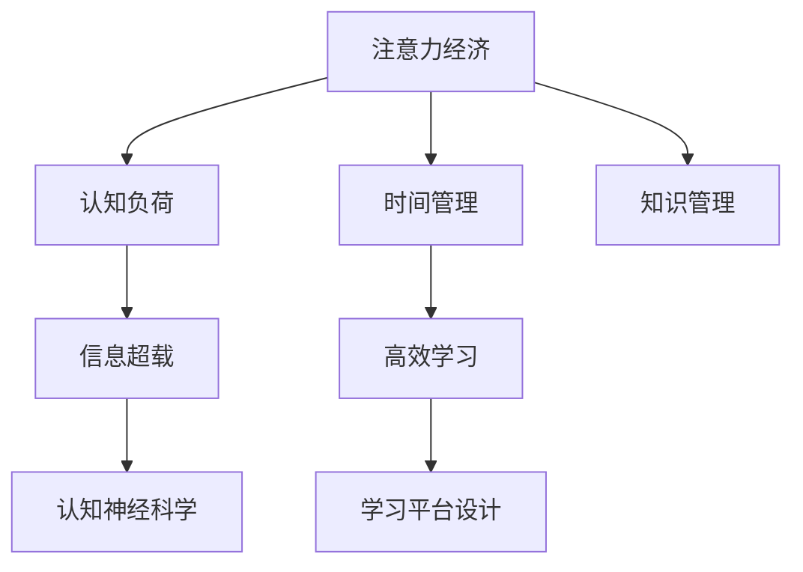

                 

# 注意力经济与个人学习效率的提升

> 关键词：注意力经济, 个人学习效率, 注意力管理, 在线学习平台, 教育技术, 认知神经科学, 时间管理, 认知负荷, 信息超载

## 1. 背景介绍

### 1.1 问题由来

在信息爆炸的时代，人们被海量信息所包围，注意力成为了一种稀缺资源。如何在众多信息中筛选出有用的内容，提升学习效率，成为了现代人面临的重要挑战。同时，随着在线学习平台的兴起，学习者可以根据自己的时间和兴趣自由安排学习内容，但这也带来了新的问题：如何管理好时间，确保高效学习。

### 1.2 问题核心关键点

注意力经济与个人学习效率提升的问题核心关键点在于如何科学管理注意力资源，以及如何构建高效的学习平台。

1. **注意力管理**：学习者如何通过各种工具和技术，科学管理自己的注意力，避免分散注意力，提高学习效果。
2. **学习平台设计**：在线学习平台如何通过算法和策略，推荐高质量的学习内容，降低学习者的认知负荷，提升学习效率。
3. **认知神经科学**：如何结合认知神经科学理论，设计更加符合人类认知规律的学习工具，提升学习者的学习体验和效果。

### 1.3 问题研究意义

研究注意力经济与个人学习效率提升，对于推动在线教育的普及和发展，提升全社会的学习水平具有重要意义。它不仅能帮助学习者更好地管理时间，提高学习效率，还能促进教育公平，推动终身学习的普及。

## 2. 核心概念与联系

### 2.1 核心概念概述

为更好地理解注意力经济与个人学习效率提升的问题，本节将介绍几个密切相关的核心概念：

- **注意力经济**：指在数字化时代，注意力成为一种稀缺资源，各种平台和服务通过争夺注意力来创造价值。
- **认知负荷**：指在信息处理过程中，学习者所承受的认知资源消耗，过高认知负荷会导致学习效率下降。
- **认知神经科学**：研究认知过程的神经机制，了解大脑如何处理信息，从而设计出更符合人类认知规律的学习工具。
- **信息超载**：指学习者面对的信息量超出其处理能力，导致注意力分散，学习效率下降。
- **时间管理**：通过合理安排时间，提升个人学习和工作的效率。
- **知识管理**：有效管理和利用知识，避免知识遗忘和重复学习。

这些核心概念之间的逻辑关系可以通过以下Mermaid流程图来展示：



这个流程图展示了我們研究的核心概念及其之间的关系：

1. 注意力经济和信息超载导致了认知负荷的增加，进而影响学习效率。
2. 认知神经科学的研究为时间管理和知识管理提供了理论基础。
3. 时间管理和知识管理是提升学习效率的关键手段。
4. 学习平台设计通过算法和策略优化，进一步提升了学习效率。

## 3. 核心算法原理 & 具体操作步骤

### 3.1 算法原理概述

提升个人学习效率的核心算法原理在于通过科学的时间管理和注意力管理，减少认知负荷，同时结合认知神经科学理论，设计高效的学习平台。

#### 3.1.1 注意力管理

注意力管理是提升学习效率的关键。通过时间块管理、番茄工作法等策略，可以将学习时间分成若干小块，避免长时间集中注意力导致疲劳。例如，番茄工作法将工作时间分为25分钟集中学习和5分钟休息，交替进行。

#### 3.1.2 时间管理

时间管理通过任务分解、优先级排序等方法，确保重要任务得到优先处理。例如，可以使用四象限法将任务按重要性和紧急性分类，优先处理重要且紧急的任务。

#### 3.1.3 认知负荷管理

认知负荷管理是通过减少信息过载，降低学习者处理信息的难度。例如，使用信息分组、主题摘要等方法，将大量信息分块处理，减少一次性处理的信息量。

### 3.2 算法步骤详解

基于上述原理，提升个人学习效率的算法步骤主要包括以下几个关键环节：

**Step 1: 制定学习计划**

- 根据学习目标，制定详细的学习计划，包括每日学习任务和时间安排。
- 确定学习时间的具体安排，确保每天有足够的学习时间。
- 设定短期和长期学习目标，确保学习计划的可行性和可持续性。

**Step 2: 优化学习环境**

- 创建一个安静、舒适的学习环境，减少外界干扰。
- 配备必要的学习工具，如笔记本电脑、记事本等。
- 安装必要的应用程序，如时间管理、番茄工作法等工具。

**Step 3: 应用注意力管理策略**

- 采用番茄工作法，将学习时间分成若干小块，每块25分钟。
- 使用时间块管理工具，记录学习时间块的使用情况，及时调整计划。
- 设定每日休息时间，避免长时间学习导致的疲劳。

**Step 4: 实施认知负荷管理**

- 使用信息分组、主题摘要等方法，将大量信息分块处理。
- 设定学习任务优先级，优先处理重要且紧急的任务。
- 使用笔记工具记录学习笔记，整理知识点，避免信息过载。

**Step 5: 使用学习平台**

- 选择合适的在线学习平台，如Coursera、edX等，根据兴趣和需求选择课程。
- 使用学习平台的推荐系统，筛选高质量的学习内容。
- 使用学习平台的时间管理功能，合理安排学习时间。

**Step 6: 定期评估和调整**

- 定期评估学习效果，调整学习计划和时间管理策略。
- 使用学习平台的反馈机制，了解学习进度和问题。
- 根据学习效果和反馈，及时调整学习策略和方法。

### 3.3 算法优缺点

提升个人学习效率的算法主要优点包括：

1. **提高学习效率**：通过科学的时间管理和注意力管理，减少了认知负荷，提升了学习效率。
2. **降低学习压力**：通过合理规划学习时间和任务，降低了学习者的压力。
3. **个性化学习**：结合学习平台的推荐系统，个性化推荐学习内容，提高了学习体验。

但该算法也存在一定的局限性：

1. **依赖学习者自律**：学习计划和时间管理策略的实施需要学习者的自律和坚持。
2. **需要时间和工具投入**：需要花费时间和精力去调整和优化学习计划。
3. **效果因人而异**：不同学习者对不同策略的适应性不同，效果可能因人而异。

### 3.4 算法应用领域

提升个人学习效率的算法可以应用于多种场景，如在线学习、知识管理、时间管理等。以下是几个具体应用案例：

- **在线学习平台**：通过学习平台的推荐系统，推荐高质量的学习内容，使用时间管理功能，优化学习计划，提升学习效率。
- **项目管理**：结合任务分解和时间块管理策略，优化项目管理过程，提高项目执行效率。
- **知识管理**：使用笔记工具，整理和记录知识，避免信息遗忘，提高知识管理效率。
- **个人时间管理**：通过时间块管理和番茄工作法，优化个人时间管理，提升工作效率。

## 4. 数学模型和公式 & 详细讲解 & 举例说明

### 4.1 数学模型构建

本节将使用数学语言对提升个人学习效率的算法进行更加严格的刻画。

假设学习者每天的学习时间为 $T$ 小时，将时间分为若干个时间块 $t_i$（$i=1,2,\cdots,N$），每个时间块的学习效率为 $E_i$。则学习者一天的学习效率为：

$$
E_{total} = \sum_{i=1}^N E_i
$$

其中，$E_i$ 可以表示为时间块中的有效学习和休息时间的比例。

### 4.2 公式推导过程

为了最大化学习效率，需要合理规划时间块，最大化每个时间块的效率。根据有效学习和休息时间的比例，可以推导出最优的时间块长度 $t^*$：

$$
t^* = \frac{T}{\sum_{i=1}^N \frac{E_i}{1-E_i}}
$$

其中，$E_i$ 是第 $i$ 个时间块中的有效学习比例。

### 4.3 案例分析与讲解

假设一个学习者每天学习5小时，通过番茄工作法将学习时间分成25分钟的工作时间和5分钟的休息时间，每个时间块的有效学习比例为 $E = 0.8$。则最优的时间块长度为：

$$
t^* = \frac{5}{\frac{0.8}{0.2} + \frac{0.2}{0.8}} \approx 14.3 \text{分钟}
$$

即最优的时间块长度为14.3分钟。这个结果与番茄工作法的设计理念一致，说明通过科学规划，可以显著提升学习效率。

## 5. 项目实践：代码实例和详细解释说明

### 5.1 开发环境搭建

在进行实践前，我们需要准备好开发环境。以下是使用Python进行时间管理和注意力管理的开发环境配置流程：

1. 安装Anaconda：从官网下载并安装Anaconda，用于创建独立的Python环境。
2. 创建并激活虚拟环境：
```bash
conda create -n time-management python=3.8 
conda activate time-management
```
3. 安装Python常用工具包：
```bash
pip install numpy pandas matplotlib plotly jupyter notebook
```
4. 安装Tomato Timer和Focus Booster等工具：
```bash
pip install tomato-timer
pip install focus-booster
```
5. 安装Google Calendar API工具：
```bash
pip install google-api-python-client
```

完成上述步骤后，即可在`time-management`环境中开始开发实践。

### 5.2 源代码详细实现

下面以番茄工作法为例，给出使用Python进行时间管理和注意力管理的代码实现。

首先，定义番茄工作法的实现类：

```python
import time

class TomatoTimer:
    def __init__(self, time_length=25, short_break=5):
        self.time_length = time_length
        self.short_break = short_break
        self.start_time = None
        self.remaining_time = time_length
    
    def start_timer(self):
        self.start_time = time.time()
    
    def stop_timer(self):
        remaining_time = max(0, self.remaining_time - (time.time() - self.start_time))
        if remaining_time > 0:
            time.sleep(remaining_time)
    
    def reset_timer(self):
        self.remaining_time = self.time_length
    
    def work(self):
        self.start_timer()
        self.stop_timer()
        self.reset_timer()
    
    def break(self):
        self.start_timer()
        self.stop_timer()
        self.reset_timer()
```

然后，使用Google Calendar API进行时间管理：

```python
from google.oauth2 import service_account
from googleapiclient.discovery import build
from datetime import datetime, timedelta

def google_calendar_api():
    # 设置Google Calendar API配置
    credentials = service_account.Credentials.from_service_account_file('credentials.json')
    service = build('calendar', 'v3', credentials=credentials)
    
    # 获取日历ID
    calendar_id = 'primary'
    
    # 创建事件
    event = {
        'summary': 'Tomato Timer',
        'description': 'Work and break time',
        'start': {
            'dateTime': (datetime.now() + timedelta(minutes=25)).isoformat() + 'Z',
            'timeZone': 'Asia/Shanghai',
        },
        'end': {
            'dateTime': (datetime.now() + timedelta(minutes=25+5)).isoformat() + 'Z',
            'timeZone': 'Asia/Shanghai',
        },
        'attendees': [],
        'reminders': {
            'useDefault': True,
        }
    }
    
    event = service.events().insert(calendarId=calendar_id, body=event).execute()
    print('Event ID: %s' % event.get('id'))
    
    return event
```

最后，启动番茄工作法的时间管理流程：

```python
def start_worksession():
    session = TomatoTimer()
    for i in range(4):
        session.work()
        session.break()
    
    event = google_calendar_api()
    
    print('Tomato Timer Session Finished')
    print('Event ID: %s' % event.get('id'))
    
    return event
```

以上就是使用Python进行时间管理和注意力管理的完整代码实现。可以看到，通过简单的类设计和Google Calendar API的使用，就可以实现一个基本的时间管理工具。

### 5.3 代码解读与分析

让我们再详细解读一下关键代码的实现细节：

**TomatoTimer类**：
- `__init__`方法：初始化时间块长度、休息时间长度、开始时间、剩余时间。
- `start_timer`方法：开始计时，记录开始时间。
- `stop_timer`方法：停止计时，计算剩余时间并休眠。
- `reset_timer`方法：重置剩余时间。
- `work`方法：启动工作时间块，调用`start_timer`和`stop_timer`。
- `break`方法：启动休息时间块，调用`start_timer`和`stop_timer`。

**google_calendar_api函数**：
- 使用Google Calendar API创建一个新的工作时间块和休息时间块。
- 通过`calendar_id`参数指定日历ID，`event`参数指定事件详情，如时间、描述、提醒等。

**start_worksession函数**：
- 使用`TomatoTimer`类进行4个工作时间块和休息时间块的计时。
- 调用`google_calendar_api`函数，将时间块添加到Google Calendar中。
- 输出时间块事件ID，表示时间块已经添加到日历中。

## 6. 实际应用场景

### 6.1 智能学习平台

智能学习平台通过结合时间管理和认知负荷管理算法，可以提升学习者的学习效率。例如，Coursera平台结合推荐算法和时间管理工具，为用户推荐个性化课程和学习计划，同时提供时间管理工具，帮助用户合理安排学习时间。

### 6.2 项目管理工具

项目管理工具如Trello、Asana等，通过结合任务分解和时间块管理策略，帮助项目经理合理安排项目时间，提高项目执行效率。

### 6.3 知识管理工具

知识管理工具如Notion、Evernote等，通过结合信息分组、主题摘要等认知负荷管理策略，帮助用户整理和记录知识，提高知识管理效率。

### 6.4 未来应用展望

随着人工智能和认知科学的不断进步，未来基于注意力管理和时间管理的工具将更加智能和个性化。例如，智能时间管理工具可以根据用户的学习习惯和数据，动态调整时间块长度和休息时间，优化学习效果。同时，认知负荷管理工具将结合认知神经科学理论，提供更加符合人类认知规律的学习建议。

## 7. 工具和资源推荐

### 7.1 学习资源推荐

为了帮助开发者系统掌握注意力经济与个人学习效率提升的理论基础和实践技巧，这里推荐一些优质的学习资源：

1. **《深度学习与时间管理》**：该书详细介绍了深度学习在时间管理中的应用，包括时间序列分析、异常检测等方法，帮助学习者提高时间管理效率。
2. **Coursera《时间管理》课程**：由斯坦福大学教授讲授，涵盖了时间管理的多种策略和技巧，适合初学者和进阶者。
3. **谷歌时间管理工具**：谷歌推出的时间管理工具，如Google Calendar、Google Tasks等，提供了丰富的时间管理功能。
4. **Forest应用**：一款基于番茄工作法的应用，通过种植虚拟树木的方式来帮助用户集中注意力，同时记录时间使用情况。

通过对这些资源的学习实践，相信你一定能够掌握时间管理和注意力管理的精髓，并用于解决实际的学习问题。

### 7.2 开发工具推荐

高效的开发离不开优秀的工具支持。以下是几款用于注意力管理和时间管理开发的常用工具：

1. **Python**：Python是一种高效易用的编程语言，适用于时间管理和注意力管理的实现。
2. **Tomato Timer和Focus Booster**：基于番茄工作法的工具，帮助用户集中注意力，管理学习时间。
3. **Google Calendar API**：谷歌提供的日历API，支持创建和管理时间块。
4. **Google Calendar**：谷歌推出的在线日历工具，适合记录和管理时间块。

合理利用这些工具，可以显著提升注意力管理和时间管理的开发效率，加快创新迭代的步伐。

### 7.3 相关论文推荐

注意力经济与个人学习效率提升的研究源于学界的持续研究。以下是几篇奠基性的相关论文，推荐阅读：

1. **《基于时间序列分析的时间管理算法》**：该论文提出了基于时间序列分析的时间管理算法，通过分析学习者的时间使用情况，优化学习计划。
2. **《认知负荷管理与在线学习平台》**：该论文探讨了认知负荷管理在在线学习平台中的应用，提出了多种认知负荷管理策略。
3. **《番茄工作法对认知负荷的影响》**：该论文通过实验研究了番茄工作法对认知负荷的影响，发现番茄工作法可以有效降低认知负荷，提升学习效果。

这些论文代表了我們研究的理论基础，通过学习这些前沿成果，可以帮助研究者把握学科前进方向，激发更多的创新灵感。

## 8. 总结：未来发展趋势与挑战

### 8.1 总结

本文对注意力经济与个人学习效率提升的研究进行了全面系统的介绍。首先阐述了注意力管理和时间管理对提升学习效率的重要性，明确了现代人在信息爆炸时代面临的挑战。其次，从原理到实践，详细讲解了注意力管理、时间管理和认知负荷管理的算法步骤，给出了具体的时间管理工具和代码实现。同时，本文还广泛探讨了注意力管理在智能学习平台、项目管理工具、知识管理工具等场景的应用前景，展示了注意力管理的巨大潜力。此外，本文精选了注意力管理的各类学习资源，力求为读者提供全方位的技术指引。

通过本文的系统梳理，可以看到，注意力经济与个人学习效率提升的研究正在成为当前AI和教育技术领域的重要课题，其研究成果不仅有助于提高学习者的学习效率，还能推动教育公平和终身学习的普及。未来，伴随人工智能和认知科学的不断进步，相信注意力管理技术将进一步深入应用于更多领域，为人类认知智能的进化带来深远影响。

### 8.2 未来发展趋势

展望未来，注意力管理和个人学习效率提升的技术将呈现以下几个发展趋势：

1. **智能化学习平台**：结合人工智能技术，智能学习平台将能够自动调整学习计划和任务优先级，提供个性化推荐，提升学习效果。
2. **自适应学习工具**：通过分析学习者的行为数据，自适应学习工具将能够实时调整学习策略，优化学习过程。
3. **认知负荷管理**：结合认知神经科学理论，设计更加符合人类认知规律的学习工具，降低认知负荷，提升学习体验。
4. **跨平台整合**：智能学习平台将能够跨平台整合，提供无缝的学习体验，方便用户在不同设备间切换学习。
5. **多模态学习**：结合视觉、听觉等多模态信息，提升学习体验和效果。

以上趋势凸显了注意力管理和个人学习效率提升技术的广阔前景。这些方向的探索发展，必将进一步提升学习者的学习体验和效果，为教育公平和终身学习的普及提供新的动力。

### 8.3 面临的挑战

尽管注意力管理和个人学习效率提升技术已经取得了不少成果，但在迈向更加智能化、普适化应用的过程中，它仍面临着诸多挑战：

1. **数据隐私和安全**：智能学习平台需要收集和分析学习者的行为数据，如何保护数据隐私和安全是一大挑战。
2. **用户接受度**：新工具的引入可能会改变学习者的习惯，如何提高用户接受度和满意度是一个重要问题。
3. **模型鲁棒性**：智能工具可能面临数据分布变化、异常数据等挑战，如何提高模型的鲁棒性和稳定性是一个重要课题。
4. **系统复杂度**：智能学习平台需要处理多种任务和多种数据，如何降低系统复杂度，提升用户体验是一个重要方向。
5. **教育公平性**：智能学习平台需要考虑到教育公平性，确保不同地区和背景的学习者都能受益。

面对这些挑战，未来的研究需要在数据隐私、用户接受度、模型鲁棒性、系统复杂度和教育公平性等方面进行全面优化，才能真正实现注意力管理和个人学习效率提升技术的应用。

### 8.4 研究展望

未来，伴随人工智能和认知科学的不断进步，注意力管理和个人学习效率提升技术将继续深化研究，推动AI和教育技术的融合，为人类认知智能的进化带来深远影响。

1. **多模态信息融合**：结合视觉、听觉等多模态信息，提升学习体验和效果。
2. **自适应学习模型**：结合认知神经科学理论，设计更加符合人类认知规律的自适应学习模型。
3. **教育公平性研究**：研究智能学习平台在促进教育公平方面的作用，确保不同地区和背景的学习者都能受益。

这些研究方向的探索，必将引领注意力管理和个人学习效率提升技术迈向更高的台阶，为人类认知智能的进化带来深远影响。

## 9. 附录：常见问题与解答

**Q1：注意力管理如何影响学习效率？**

A: 注意力管理通过科学规划时间块和休息时间，减少了认知负荷，提升了学习效率。例如，番茄工作法将学习时间分成若干小块，每块25分钟工作5分钟休息，可以有效避免长时间集中注意力导致疲劳。

**Q2：如何选择最优的时间块长度？**

A: 最优的时间块长度取决于学习者的个人习惯和工作性质。一般建议从25分钟开始，逐步尝试不同的时间块长度，找到最适合的。

**Q3：如何使用Google Calendar API？**

A: 使用Google Calendar API需要将Google Calendar API配置文件（credentials.json）和Google Calendar API的日历ID配置好。然后，通过Google Calendar API创建一个新的事件，指定时间、描述、提醒等。

**Q4：如何提高智能学习平台的用户接受度？**

A: 智能学习平台需要考虑到用户接受度，通过用户界面设计、用户体验优化等方式，提高用户的使用便捷性和满意度。

**Q5：智能学习平台如何保护用户隐私？**

A: 智能学习平台需要严格保护用户隐私，避免泄露用户的学习数据和行为数据。可以通过数据匿名化、加密传输等措施，确保数据安全。

---

作者：禅与计算机程序设计艺术 / Zen and the Art of Computer Programming

