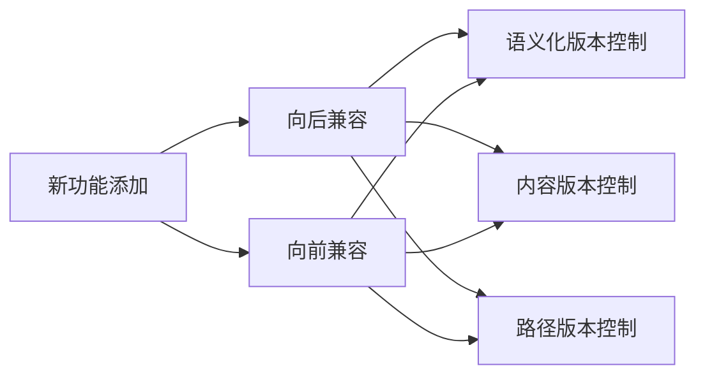

                 

## API 版本控制的最佳实践

> 关键词：API 版本控制，向后兼容，向前兼容，语义化版本控制，API 设计，API 维护

## 1. 背景介绍

随着软件开发的不断演进，API（Application Programming Interface，应用程序编程接口）已经成为软件系统之间通信的标准方式。然而，API 的版本控制却是一个长期存在的挑战。如何有效地管理 API 的版本，平衡新功能的添加和现有客户端的兼容性，是 API 设计和维护中的一项关键任务。

## 2. 核心概念与联系

### 2.1 API 版本控制的目标

API 版本控制的目标是平衡新功能的添加和现有客户端的兼容性。这包括：

- **向后兼容（Backward Compatibility）**：新版本的 API 应该能够兼容旧版本的客户端。
- **向前兼容（Forward Compatibility）**：旧版本的客户端应该能够兼容新版本的 API。

### 2.2 API 版本控制的策略

常见的 API 版本控制策略包括：

- **语义化版本控制（Semantic Versioning）**：使用语义化的版本号（如 1.0.0）来表示 API 的版本，并遵循严格的版本号规则。
- **内容版本控制（Content Negotiation）**：使用 HTTP 头部信息（如 Accept、Content-Type）来指定客户端支持的 API 版本。
- **路径版本控制（Path Prefix）**：在 API 的路径中包含版本号，如 /v1/resource。

### 2.3 API 版本控制的关系图



## 3. 核心算法原理 & 具体操作步骤

### 3.1 算法原理概述

API 版本控制的核心原理是平衡新功能的添加和现有客户端的兼容性。这涉及到对 API 的版本号、路径、请求头等元素的管理。

### 3.2 算法步骤详解

1. **确定版本号**：使用语义化版本号（如 1.0.0）来表示 API 的版本。
2. **添加新功能**：在新版本中添加新功能，并确保新功能不影响旧版本的客户端。
3. **更新路径或请求头**：如果使用路径版本控制或内容版本控制，则需要更新 API 的路径或请求头。
4. **测试兼容性**：测试新版本的 API 是否与旧版本的客户端兼容。
5. **发布新版本**：如果兼容性测试通过，则发布新版本的 API。

### 3.3 算法优缺点

**优点**：

- 语义化版本控制使得版本号更易于理解和管理。
- 内容版本控制和路径版本控制使得客户端能够请求特定版本的 API。

**缺点**：

- 语义化版本控制要求开发人员严格遵循版本号规则。
- 内容版本控制和路径版本控制可能会增加客户端的复杂性。

### 3.4 算法应用领域

API 版本控制适用于任何需要与外部系统通信的软件系统，包括 Web 应用、移动应用、企业应用等。

## 4. 数学模型和公式 & 详细讲解 & 举例说明

### 4.1 数学模型构建

API 版本控制的数学模型可以表示为：

$$V = \{v_1, v_2,..., v_n\}$$

其中，$V$ 是 API 的版本集合，$v_i$ 是 API 的第 $i$ 个版本。

### 4.2 公式推导过程

API 的版本号可以表示为：

$$v_i = \{major, minor, patch\}$$

其中，$major$ 是主版本号，$minor$ 是次版本号，$patch$ 是修订版本号。语义化版本号的规则是：

- 如果新版本添加了向后兼容的功能，则只增加 $patch$。
- 如果新版本添加了向后兼容的功能，但破坏了向前兼容性，则增加 $minor$。
- 如果新版本添加了不兼容的功能，则增加 $major$。

### 4.3 案例分析与讲解

例如，考虑一个 API，其版本号为 1.0.0。如果开发人员添加了一个向后兼容的功能，则版本号变为 1.0.1。如果开发人员添加了一个向后兼容但破坏向前兼容性的功能，则版本号变为 1.1.0。如果开发人员添加了一个不兼容的功能，则版本号变为 2.0.0。

## 5. 项目实践：代码实例和详细解释说明

### 5.1 开发环境搭建

本示例使用 Node.js 和 Express.js 来构建 API，并使用语义化版本控制来管理 API 的版本。

### 5.2 源代码详细实现

```javascript
const express = require('express');
const app = express();
const version = require('./package.json').version;

app.get('/api/:version/user', (req, res) => {
  const requestedVersion = req.params.version;
  if (requestedVersion!== version) {
    return res.status(400).send('Invalid API version');
  }
  // 处理请求并返回响应
  res.send('User data');
});

app.listen(3000, () => {
  console.log(`API listening on port 3000, version ${version}`);
});
```

### 5.3 代码解读与分析

在上述代码中，我们使用 Express.js 来构建 API，并从 `package.json` 文件中读取 API 的版本号。当客户端请求特定版本的 API 时，我们比较请求的版本号和当前 API 的版本号。如果请求的版本号与当前 API 的版本号不匹配，则返回错误响应。

### 5.4 运行结果展示

当客户端请求 `/api/1.0.0/user` 时，API 会返回用户数据。如果客户端请求 `/api/1.0.1/user`，则 API 会返回错误响应。

## 6. 实际应用场景

### 6.1 当前应用

API 版本控制已经广泛应用于各种 API，包括 Web API、移动 API、企业 API 等。例如，Facebook Graph API、Twitter API、Google Maps API 等都使用了语义化版本控制来管理 API 的版本。

### 6.2 未来应用展望

随着 API 的不断发展，API 版本控制也将面临新的挑战。未来，API 版本控制可能会涉及到更复杂的版本控制策略，如基于特性的版本控制、基于生命周期的版本控制等。

## 7. 工具和资源推荐

### 7.1 学习资源推荐

- [Semantic Versioning](https://semver.org/)
- [API Versioning](https://apiversioning.org/)
- [Versioning API](https://martinfowler.com/articles/versioning-api.html)

### 7.2 开发工具推荐

- [Express.js](http://expressjs.com/)
- [Postman](https://www.postman.com/)
- [Swagger](https://swagger.io/)

### 7.3 相关论文推荐

- [API Versioning: A Survey](https://arxiv.org/abs/1807.09377)
- [Versioning REST APIs](https://www.infoq.com/articles/versioning-rest-apis/)

## 8. 总结：未来发展趋势与挑战

### 8.1 研究成果总结

本文介绍了 API 版本控制的最佳实践，包括核心概念、算法原理、数学模型、项目实践等。我们讨论了语义化版本控制、内容版本控制和路径版本控制等策略，并提供了一个使用 Express.js 构建 API 的示例。

### 8.2 未来发展趋势

未来，API 版本控制将面临更复杂的挑战，如基于特性的版本控制、基于生命周期的版本控制等。此外，API 版本控制也将与其他领域的版本控制（如软件版本控制）结合，以提供更完整的解决方案。

### 8.3 面临的挑战

API 版本控制的挑战包括：

- **版本号管理**：如何有效地管理版本号，平衡新功能的添加和现有客户端的兼容性。
- **客户端兼容性**：如何确保新版本的 API 与旧版本的客户端兼容。
- **版本控制策略**：如何选择合适的版本控制策略，平衡新功能的添加和客户端的兼容性。

### 8.4 研究展望

未来的研究方向包括：

- **基于特性的版本控制**：如何基于 API 的特性而不是版本号来管理 API 的版本。
- **基于生命周期的版本控制**：如何基于 API 的生命周期而不是版本号来管理 API 的版本。
- **跨领域的版本控制**：如何将 API 版本控制与其他领域的版本控制结合，提供更完整的解决方案。

## 9. 附录：常见问题与解答

**Q：什么是向后兼容？**

A：向后兼容（Backward Compatibility）是指新版本的 API 应该能够兼容旧版本的客户端。

**Q：什么是向前兼容？**

A：向前兼容（Forward Compatibility）是指旧版本的客户端应该能够兼容新版本的 API。

**Q：什么是语义化版本控制？**

A：语义化版本控制（Semantic Versioning）是一种使用语义化的版本号（如 1.0.0）来表示 API 版本的策略，并遵循严格的版本号规则。

!!!Note
作者：禅与计算机程序设计艺术 / Zen and the Art of Computer Programming

