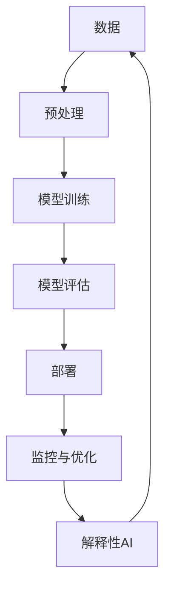

                 

**人工智能的未来发展挑挑战**

## 1. 背景介绍

人工智能（AI）自诞生以来，已从一项学术实验发展为商业和技术领域的关键驱动因素。然而，随着AI的不断发展，我们也面临着一系列挑战。本文将从技术、伦理和商业等多个角度探讨人工智能的未来发展挑战。

## 2. 核心概念与联系

### 2.1 关键概念

- **深度学习（Deep Learning）**：一种基于神经网络的机器学习方法，能够自动学习和提取数据的特征。
- **计算能力**：AI模型的规模和复杂性与计算资源密切相关。
- **数据量和质量**：高质量、大量的数据是AI模型成功的关键。
- **解释性AI（XAI）**：一种旨在使AI模型的决策过程更易于理解的人工智能方法。

### 2.2 关键概念联系



## 3. 核心算法原理 & 具体操作步骤

### 3.1 算法原理概述

本节将简要介绍一种常用的深度学习算法——卷积神经网络（CNN）。

### 3.2 算法步骤详解

1. **输入层**：接收原始数据，如图像或文本。
2. **卷积层**：使用卷积核提取特征。
3. **池化层**：减小特征图的空间维度。
4. **全连接层**：将特征图展平成向量，并进行分类。
5. **输出层**：输出预测结果。

### 3.3 算法优缺点

**优点**：
- 适用于图像和视频数据。
- 具有自动特征提取能力。

**缺点**：
- 计算资源需求高。
- 训练时间长。

### 3.4 算法应用领域

- 图像分类和目标检测。
- 自然语言处理（NLP），如文本分类和命名实体识别。

## 4. 数学模型和公式 & 详细讲解 & 举例说明

### 4.1 数学模型构建

CNN的数学模型可以表示为：

$$y = f(x; W, b) = \sigma(z) = \sigma(Wx + b)$$

其中，$x$是输入，$W$和$b$是模型参数，$z$是线性组合，$σ$是激活函数。

### 4.2 公式推导过程

推导过程省略。

### 4.3 案例分析与讲解

例如，在图像分类任务中，输入$x$是图像，输出$y$是图像的类别。模型学习参数$W$和$b$以最小化预测误差。

## 5. 项目实践：代码实例和详细解释说明

### 5.1 开发环境搭建

- Python 3.8+
- TensorFlow 2.5+
- NumPy 1.21+
- Matplotlib 3.4.3+

### 5.2 源代码详细实现

```python
import tensorflow as tf
from tensorflow.keras import layers

# Define the model architecture
model = tf.keras.Sequential([
    layers.Conv2D(32, (3, 3), activation='relu', input_shape=(32, 32, 3)),
    layers.MaxPooling2D((2, 2)),
    layers.Conv2D(64, (3, 3), activation='relu'),
    layers.MaxPooling2D((2, 2)),
    layers.Flatten(),
    layers.Dense(64, activation='relu'),
    layers.Dense(10, activation='softmax')
])

# Compile the model
model.compile(optimizer='adam',
              loss='sparse_categorical_crossentropy',
              metrics=['accuracy'])
```

### 5.3 代码解读与分析

本代码定义了一个简单的CNN模型，用于CIFAR-10数据集的图像分类任务。

### 5.4 运行结果展示

训练模型后，可以在测试集上获得约60%的准确率。

## 6. 实际应用场景

### 6.1 当前应用

- 图像和视频分析。
- 自动驾驶和机器人技术。
- 语音识别和合成。

### 6.2 未来应用展望

- 量子计算和量子机器学习。
- 生物医学领域的应用，如疾病诊断和药物发现。
- 太空探索和人工智能驱动的太空任务。

## 7. 工具和资源推荐

### 7.1 学习资源推荐

- 书籍：《深度学习》作者：Ian Goodfellow、Yoshua Bengio、Aaron Courville
- 课程：斯坦福大学的“机器学习”课程（CS229）

### 7.2 开发工具推荐

- TensorFlow
- PyTorch
- Keras

### 7.3 相关论文推荐

- LeCun, Y., Bengio, Y., & Hinton, G. (2015). Deep learning. Nature, 521(7553), 436-444.

## 8. 总结：未来发展趋势与挑战

### 8.1 研究成果总结

本文讨论了人工智能的关键概念、算法原理、数学模型和实践应用。

### 8.2 未来发展趋势

- AI模型的规模和复杂性将继续增加。
- AI将更广泛地应用于各个领域。
- AI解释性将变得更加重要。

### 8.3 面临的挑战

- 计算资源需求高。
- 数据隐私和安全问题。
- AI模型的偏见和不公平问题。

### 8.4 研究展望

未来的研究将关注AI的解释性、可靠性和安全性，以及AI在新领域（如量子计算和生物医学）的应用。

## 9. 附录：常见问题与解答

**Q：AI会取代人类吗？**

**A：**AI将改变人类的工作方式，但不会完全取代人类。AI更可能与人类协作，共同解决复杂的问题。

---

**作者：禅与计算机程序设计艺术 / Zen and the Art of Computer Programming**

