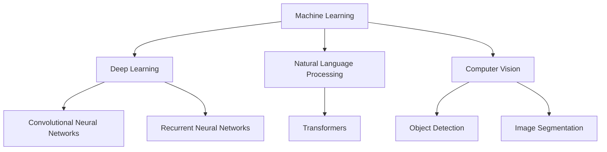

                 

**人工智能的未来发展方向**

**作者：禅与计算机程序设计艺术 / Zen and the Art of Computer Programming**

## 1. 背景介绍

人工智能（AI）自诞生以来，已从一项学术实验发展为商业和技术领域的关键驱动因素。随着计算能力的提高和数据的丰富，AI正在各行各业产生重大影响。本文将探讨人工智能的未来发展方向，关注其核心概念、算法、数学模型，并提供实践项目和工具资源的指南。

## 2. 核心概念与联系

人工智能的核心概念包括机器学习（ML）、深度学习（DL）、自然语言处理（NLP）、计算机视觉（CV）等。这些概念密切相关，共同构成了AI的基础。



## 3. 核心算法原理 & 具体操作步骤

### 3.1 算法原理概述

人工智能的核心是机器学习算法，其目标是从数据中学习模式，并利用这些模式对新数据进行预测。深度学习是机器学习的一个子集，它使用神经网络模型来学习数据的表示。

### 3.2 算法步骤详解

1. **数据收集**：收集与问题相关的数据。
2. **数据预处理**：清洗、标记和格式化数据。
3. **模型选择**：选择适合问题的机器学习算法或深度学习模型。
4. **训练**：使用训练数据调整模型的参数。
5. **评估**：使用验证数据评估模型的性能。
6. **部署**：将模型部署到生产环境中，用于对新数据进行预测。

### 3.3 算法优缺点

**优点**：自动学习、高准确性、广泛应用。

**缺点**：数据饥渴、计算资源需求高、解释性差。

### 3.4 算法应用领域

人工智能广泛应用于图像和语音识别、自动驾驶、医疗诊断、金融风险管理等领域。

## 4. 数学模型和公式 & 详细讲解 & 举例说明

### 4.1 数学模型构建

机器学习模型通常基于线性回归、逻辑回归、支持向量机（SVM）或决策树等数学模型构建。深度学习模型则基于神经网络模型构建。

### 4.2 公式推导过程

例如，线性回归模型的目标函数为：

$$J(\theta) = \frac{1}{2m} \sum_{i=1}^{m} (h_\theta(x^{(i)}) - y^{(i)})^2$$

其中，$h_\theta(x^{(i)})$是模型的预测，$y^{(i)}$是真实值，$m$是训练样本数。

### 4.3 案例分析与讲解

例如，在图像分类任务中，深度学习模型（如卷积神经网络）可以学习图像的表示，并将其映射到类别标签上。

## 5. 项目实践：代码实例和详细解释说明

### 5.1 开发环境搭建

建议使用Python作为编程语言，并安装必要的库，如TensorFlow、PyTorch、Keras、Scikit-learn等。

### 5.2 源代码详细实现

以下是一个简单的线性回归示例：

```python
import numpy as np
from sklearn.linear_model import LinearRegression

# 训练数据
X = 2 * np.random.rand(100, 1)
y = 4 + 3 * X + np.random.randn(100, 1)

# 训练模型
model = LinearRegression().fit(X, y)

# 预测
X_test = np.array([[6.8]])
print("Predicted:", model.predict(X_test))
```

### 5.3 代码解读与分析

该代码使用Scikit-learn库训练了一个线性回归模型，并对新数据进行了预测。

### 5.4 运行结果展示

预测结果将是一个数值，表示新数据点的预测值。

## 6. 实际应用场景

人工智能正在各行各业产生重大影响，例如：

- **自动驾驶**：使用计算机视觉和深度学习模型感知环境，并进行决策。
- **医疗诊断**：使用深度学习模型分析医学图像，协助医生进行诊断。

### 6.4 未来应用展望

未来，人工智能将继续渗透到更多领域，如生物医学、量子计算等。此外，AI也将更加注重解释性、可靠性和安全性。

## 7. 工具和资源推荐

### 7.1 学习资源推荐

- **书籍**："深度学习"（Goodfellow, Bengio, & Courville, 2016）、"机器学习"（Mitchell, 1997）
- **在线课程**：Coursera、Udacity、fast.ai

### 7.2 开发工具推荐

- **编程语言**：Python
- **库**：TensorFlow、PyTorch、Keras、Scikit-learn
- **开发环境**：Jupyter Notebook、Google Colab

### 7.3 相关论文推荐

- "Attention Is All You Need"（Vaswani et al., 2017）
- "ImageNet Classification with Deep Convolutional Neural Networks"（Krizhevsky et al., 2012）

## 8. 总结：未来发展趋势与挑战

### 8.1 研究成果总结

人工智能取得了显著进展，在各种任务上超越了人类水平。

### 8.2 未来发展趋势

未来，人工智能将更加注重解释性、可靠性和安全性。此外，AI也将更加多样化，涉及更多领域。

### 8.3 面临的挑战

人工智能面临的挑战包括数据隐私、算法偏见、计算资源需求等。

### 8.4 研究展望

未来的研究将关注AI的解释性、可靠性和安全性，以及AI在更多领域的应用。

## 9. 附录：常见问题与解答

**Q：人工智能是否会取代人类？**

**A：**人工智能将改变工作方式，但不会取代人类。AI更多的是辅助人类工作，而不是取代人类。

**Q：人工智能是否需要伦理指南？**

**A：**是的，人工智能需要伦理指南，以确保其应用是公平、透明和负责任的。

**Q：人工智能是否需要监管？**

**A：**是的，人工智能需要监管，以确保其安全、可靠和有利于公众利益。

**作者：禅与计算机程序设计艺术 / Zen and the Art of Computer Programming**

