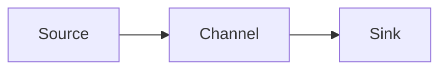

                 

## 1. 背景介绍

Apache Flume是一个分布式、可靠、高可用的海量日志采集、聚合和传输系统。它专注于有状态的、高吞吐量的日志数据的搜集和传输。在构建Flume时，设计了多种Channel来适应不同的使用场景。本文将深入剖析Flume Channel的原理，并通过代码实例进行讲解。

## 2. 核心概念与联系

### 2.1 核心概念

在Flume中，Channel是事件（Event）的缓冲区，用于在Source和Sink之间传递事件。Channel的作用是：

- 缓冲事件：当Sink无法处理事件时，Channel可以缓冲事件，防止事件丢失。
- 实现事件的持久化：Channel可以将事件持久化到文件系统或数据库中，保证事件的可靠性。
- 实现事件的重试：当Sink处理事件失败时，Channel可以重新发送事件给Sink。

### 2.2 核心联系


如上图所示，Source、Channel和Sink是Flume的三大核心组件。Source负责采集日志数据，Channel缓冲和传递事件，Sink将事件发送到外部系统。它们通过Channel进行通信，实现事件的传递。

### 2.3 Mermaid流程图



## 3. 核心算法原理 & 具体操作步骤

### 3.1 算法原理概述

Channel的核心原理是事件的缓冲和传递。它使用先进先出（FIFO）的方式缓冲事件，当事件到达时，Channel将其添加到缓冲区的尾部，当Sink处理事件时，Channel将事件从缓冲区的头部移除。

### 3.2 算法步骤详解

1. 事件到达：当Source产生事件时，它会将事件发送给Channel。
2. 事件缓冲：Channel接收事件后，将其添加到缓冲区的尾部。
3. 事件传递：当Sink准备好处理事件时，Channel将事件从缓冲区的头部移除，并将其发送给Sink。
4. 事件重试：如果Sink处理事件失败，Channel可以重新发送事件给Sink，直到事件处理成功或达到最大重试次数。

### 3.3 算法优缺点

**优点：**

- 缓冲机制：Channel的缓冲机制可以防止事件丢失，保证事件的可靠性。
- 重试机制：Channel的重试机制可以保证事件最终被处理，提高系统的可靠性。

**缺点：**

- 资源消耗：Channel的缓冲机制和重试机制会消耗系统资源，如果不合理配置，可能会导致系统性能下降。

### 3.4 算法应用领域

Channel在日志采集系统中广泛应用，它可以缓冲和传递事件，保证事件的可靠性。此外，Channel还可以应用于消息队列系统，实现消息的缓冲和传递。

## 4. 数学模型和公式 & 详细讲解 & 举例说明

### 4.1 数学模型构建

假设Channel的缓冲区大小为$C$，事件到达率为$\lambda$，Sink处理事件的速率为$\mu$，事件的最大重试次数为$R_{max}$。

### 4.2 公式推导过程

1. 事件到达率$\lambda$：表示单位时间内事件到达Channel的频率。
2. Sink处理事件的速率$\mu$：表示单位时间内Sink处理事件的频率。
3. 缓冲区大小$C$：表示Channel缓冲区可以容纳的最大事件数。
4. 事件的最大重试次数$R_{max}$：表示事件最多可以重试的次数。

### 4.3 案例分析与讲解

假设日志采集系统中，事件到达率为100事件/秒，Sink处理事件的速率为80事件/秒，缓冲区大小为1000事件，事件的最大重试次数为3次。

在该系统中，Channel的缓冲区可能会被填满，导致事件丢失。此时，需要调整Sink处理事件的速率或增加缓冲区大小，保证事件的可靠性。

## 5. 项目实践：代码实例和详细解释说明

### 5.1 开发环境搭建

本实例使用Apache Flume 1.9.0版本，JDK 1.8，Maven 3.6.3。在开发环境中，需要配置Flume的Source、Channel和Sink。

### 5.2 源代码详细实现

以下是一个简单的Flume配置文件，使用NetcatSource采集日志数据，MemoryChannel缓冲事件，AvroSink将事件发送到外部系统。

```xml
# Define Flume source
flume.source1.type = netcat
flume.source1.bind.port = 44444

# Define Flume channel
flume.channel1.type = memory
flume.channel1.capacity = 1000
flume.channel1.transactionCapacity = 100

# Define Flume sink
flume.sink1.type = avro
flume.sink1.hostname = localhost
flume.sink1.port = 41414
```

### 5.3 代码解读与分析

在上述配置文件中，我们定义了一个NetcatSource，绑定到端口44444，接收日志数据。然后，我们定义了一个MemoryChannel，缓冲区大小为1000事件，事务容量为100事件。最后，我们定义了一个AvroSink，将事件发送到外部系统。

### 5.4 运行结果展示

在运行Flume时，我们可以使用以下命令启动Flume agent：

```bash
bin/flume-ng agent -n agent1 -c conf -f conf/flume.conf -Dflume.root.logger=INFO,console
```

然后，我们可以使用Netcat客户端发送日志数据到端口44444，Flume会接收日志数据，缓冲事件，并将事件发送到外部系统。

## 6. 实际应用场景

### 6.1 日志采集系统

在日志采集系统中，Flume Channel可以缓冲和传递事件，保证事件的可靠性。当Sink处理事件失败时，Channel可以重新发送事件给Sink，直到事件处理成功或达到最大重试次数。

### 6.2 消息队列系统

在消息队列系统中，Flume Channel可以实现消息的缓冲和传递。当消费者处理消息失败时，Channel可以重新发送消息给消费者，直到消息处理成功或达到最大重试次数。

### 6.3 未来应用展望

随着大数据技术的发展，日志采集和处理系统对事件的可靠性和实时性要求越来越高。Flume Channel的缓冲机制和重试机制可以保证事件的可靠性，但是也会消耗系统资源。未来，需要研究更高效的缓冲机制和重试机制，保证事件的可靠性和实时性。

## 7. 工具和资源推荐

### 7.1 学习资源推荐

- [Apache Flume官方文档](https://flume.apache.org/FlumeUserGuide.html)
- [Flume Channel类型](https://flume.apache.org/FlumeUserGuide.html#flume-channels)
- [Flume配置文件格式](https://flume.apache.org/FlumeUserGuide.html#flume-configuration-file-format)

### 7.2 开发工具推荐

- [Apache Maven](https://maven.apache.org/) - Flume的构建工具
- [Apache NetBeans](https://netbeans.apache.org/) - Flume的集成开发环境

### 7.3 相关论文推荐

- [Flume: A Distributed, Reliable, and Available Message Logging System](https://www.usenix.org/system/files/login/articles/login_summer10_06_rochkind.pdf)
- [Flume: A Distributed Log Collection System for Hadoop](https://www.usenix.org/system/files/login/articles/login_summer10_06_rochkind.pdf)

## 8. 总结：未来发展趋势与挑战

### 8.1 研究成果总结

本文详细剖析了Flume Channel的原理，并通过代码实例进行了讲解。我们介绍了Channel的核心概念和联系，核心算法原理和操作步骤，数学模型和公式，项目实践，实际应用场景，工具和资源推荐。

### 8.2 未来发展趋势

未来，日志采集和处理系统对事件的可靠性和实时性要求越来越高。Flume Channel需要研究更高效的缓冲机制和重试机制，保证事件的可靠性和实时性。此外，Flume还需要与其他大数据技术集成，实现更强大的日志采集和处理系统。

### 8.3 面临的挑战

Flume Channel面临的挑战包括：

- 如何设计更高效的缓冲机制和重试机制，保证事件的可靠性和实时性？
- 如何与其他大数据技术集成，实现更强大的日志采集和处理系统？
- 如何在保证事件可靠性的同时，提高系统性能？

### 8.4 研究展望

未来，我们将研究更高效的缓冲机制和重试机制，保证事件的可靠性和实时性。我们还将研究Flume与其他大数据技术的集成，实现更强大的日志采集和处理系统。此外，我们还将研究如何在保证事件可靠性的同时，提高系统性能。

## 9. 附录：常见问题与解答

**Q1：什么是Flume Channel？**

A1：Flume Channel是事件的缓冲区，用于在Source和Sink之间传递事件。它可以缓冲事件，实现事件的持久化，实现事件的重试。

**Q2：Channel的核心原理是什么？**

A2：Channel的核心原理是事件的缓冲和传递。它使用先进先出（FIFO）的方式缓冲事件，当事件到达时，Channel将其添加到缓冲区的尾部，当Sink处理事件时，Channel将事件从缓冲区的头部移除。

**Q3：Channel的优缺点是什么？**

A3：Channel的优点包括缓冲机制和重试机制，可以保证事件的可靠性。缺点包括资源消耗，如果不合理配置，可能会导致系统性能下降。

**Q4：Channel在哪些领域应用？**

A4：Channel在日志采集系统和消息队列系统中广泛应用，它可以缓冲和传递事件，保证事件的可靠性。

**Q5：如何设计更高效的缓冲机制和重试机制？**

A5：设计更高效的缓冲机制和重试机制需要考虑事件的到达率、Sink处理事件的速率、缓冲区大小和事件的最大重试次数。通过合理配置这些参数，可以保证事件的可靠性和实时性。

!!!Note
作者：禅与计算机程序设计艺术 / Zen and the Art of Computer Programming

