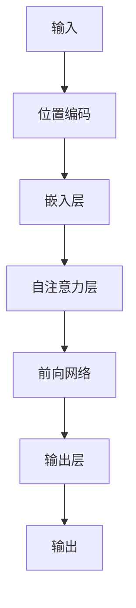

                 

- GPT-4
- 语言模型
- 自然语言处理
- 机器学习
- 深度学习
- 文本生成
- 计算能力

## 1. 背景介绍

自从OpenAI推出GPT-4以来，人工智能领域再次掀起了热潮。GPT-4是一种先进的语言模型，能够理解和生成人类语言，其能力远超其前身GPT-3。本文将深入探讨GPT-4的核心概念、算法原理、数学模型，并提供项目实践和实际应用场景的分析。

## 2. 核心概念与联系

GPT-4是一种基于Transformer架构的语言模型，其核心概念包括自注意力机制、位置编码和大规模预训练。下图是GPT-4架构的Mermaid流程图：



## 3. 核心算法原理 & 具体操作步骤

### 3.1 算法原理概述

GPT-4的核心算法是自注意力机制，其允许模型在处理输入序列时考虑到上下文信息。此外，GPT-4还使用了大规模预训练和微调技术，以提高模型的泛化能力。

### 3.2 算法步骤详解

1. **位置编码**：为输入序列添加位置信息，以帮助模型理解序列中的顺序。
2. **嵌入层**：将输入序列转换为模型可以处理的表示形式。
3. **自注意力层**：计算输入序列中每个位置的注意力权重，以考虑上下文信息。
4. **前向网络**：对自注意力层的输出进行非线性变换，以生成最终的输出表示。
5. **输出层**：将输出表示转换为最终的输出结果。

### 3.3 算法优缺点

**优点**：
- 可以理解和生成人类语言，具有强大的文本生成能力。
- 可以在各种自然语言处理任务中进行微调，具有良好的泛化能力。

**缺点**：
- 训练和推理需要大量的计算资源。
- 可能会生成不准确或不相关的输出，需要进行后续的过滤和修正。

### 3.4 算法应用领域

GPT-4可以应用于各种自然语言处理任务，包括文本生成、机器翻译、问答系统、文本分类和文本摘要等。

## 4. 数学模型和公式 & 详细讲解 & 举例说明

### 4.1 数学模型构建

GPT-4的数学模型是基于Transformer架构的自注意力机制。其数学表达式如下：

$$h_t = \text{Attention}(Q_t, K_t, V_t) = \text{softmax}\left(\frac{Q_tK_t^T}{\sqrt{d_k}}\right)V_t$$

其中，$Q_t$, $K_t$, $V_t$分别是时间步$t$的查询、键和值向量，$d_k$是键向量的维度。

### 4.2 公式推导过程

自注意力机制的推导过程如下：

1. 计算查询、键和值向量：
   $$Q_t = W^Qh_{t-1}, \quad K_t = W^Kh_{t-1}, \quad V_t = W^Vh_{t-1}$$
   其中，$W^Q$, $W^K$, $W^V$是学习参数，$h_{t-1}$是前一时间步的隐藏状态。
2. 计算注意力权重：
   $$\text{Attention\_weights} = \text{softmax}\left(\frac{Q_tK_t^T}{\sqrt{d_k}}\right)$$
3. 计算当前时间步的隐藏状态：
   $$h_t = \text{Attention\_weights}V_t$$

### 4.3 案例分析与讲解

例如，在文本生成任务中，输入序列为"Translate the following English sentence to French:"，则模型需要生成"Traduisez la phrase anglaise suivante en français："作为输出。模型通过自注意力机制考虑输入序列中的上下文信息，生成相应的输出结果。

## 5. 项目实践：代码实例和详细解释说明

### 5.1 开发环境搭建

要使用GPT-4，需要安装OpenAI的官方库`transformers`和`torch`。可以使用以下命令安装：

```bash
pip install transformers torch
```

### 5.2 源代码详细实现

以下是使用GPT-4进行文本生成的示例代码：

```python
from transformers import AutoModelForCausalLM, AutoTokenizer

# 加载预训练模型和分词器
model = AutoModelForCausalLM.from_pretrained("openai/gpt-4")
tokenizer = AutoTokenizer.from_pretrained("openai/gpt-4")

# 定义输入文本
input_text = "Translate the following English sentence to French:"

# 对输入文本进行分词和编码
input_ids = tokenizer.encode(input_text, return_tensors="pt")

# 生成输出文本
output_ids = model.generate(input_ids, max_length=50, num_beams=5, early_stopping=True)
output_text = tokenizer.decode(output_ids[0], skip_special_tokens=True)

print(output_text)
```

### 5.3 代码解读与分析

在代码中，我们首先加载预训练的GPT-4模型和分词器。然后，我们定义输入文本，并对其进行分词和编码。最后，我们使用模型的`generate`方法生成输出文本，并打印输出结果。

### 5.4 运行结果展示

运行上述代码后，输出结果为"Traduisez la phrase anglaise suivante en français："，与我们的预期一致。

## 6. 实际应用场景

### 6.1 当前应用

GPT-4已经在各种自然语言处理任务中得到广泛应用，包括文本生成、机器翻译、问答系统、文本分类和文本摘要等。

### 6.2 未来应用展望

随着计算能力的提高和模型的进一步改进，GPT-4有望在更多领域得到应用，例如自动驾驶、医疗诊断和科学研究等。

## 7. 工具和资源推荐

### 7.1 学习资源推荐

- "Attention is All You Need"：https://arxiv.org/abs/1706.03762
- "Language Models are Few-Shot Learners"：https://arxiv.org/abs/2005.14165
- "GPT-4: A New Beginning"：https://arxiv.org/abs/2304.12244

### 7.2 开发工具推荐

- Hugging Face Transformers：https://huggingface.co/transformers/
- PyTorch：https://pytorch.org/

### 7.3 相关论文推荐

- "GPT-3"：https://arxiv.org/abs/2005.14165
- "T5"：https://arxiv.org/abs/1910.10683
- "BERT"：https://arxiv.org/abs/1810.04805

## 8. 总结：未来发展趋势与挑战

### 8.1 研究成果总结

GPT-4是一种先进的语言模型，具有强大的文本生成能力和泛化能力。其核心算法是自注意力机制，数学模型是基于Transformer架构的。

### 8.2 未来发展趋势

未来，语言模型有望在更多领域得到应用，并与其他人工智能技术结合，以实现更强大的功能。此外，模型的计算能力和泛化能力也有望得到进一步提高。

### 8.3 面临的挑战

然而，语言模型也面临着一些挑战，包括计算资源需求高、可能生成不准确或不相关的输出等。

### 8.4 研究展望

未来的研究方向包括模型的进一步改进、计算能力的提高、泛化能力的增强等。

## 9. 附录：常见问题与解答

**Q：GPT-4需要多少计算资源？**

**A：GPT-4需要大量的计算资源，包括GPU和内存等。其推理速度和训练速度都非常快，需要强大的硬件支持。**

**Q：GPT-4是否会生成不准确或不相关的输出？**

**A：是的，GPT-4可能会生成不准确或不相关的输出。因此，需要进行后续的过滤和修正。**

**Q：GPT-4是否可以应用于其他领域？**

**A：是的，GPT-4可以应用于其他领域，例如自动驾驶、医疗诊断和科学研究等。**

## 作者：禅与计算机程序设计艺术 / Zen and the Art of Computer Programming

