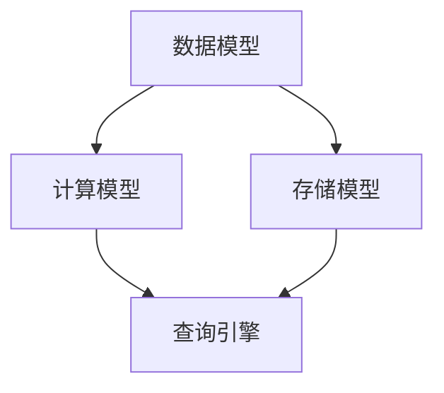

                 

**Kylin原理与代码实例讲解**

**作者：禅与计算机程序设计艺术 / Zen and the Art of Computer Programming**

## 1. 背景介绍

随着大数据时代的到来，海量数据的处理和分析成为各行各业的关键需求。传统的数据库系统已无法满足这些需求，因此，大数据处理平台如雨后春笋般涌现。其中，Apache Kylin是一个开源的、分布式的大数据处理平台，专注于提供高性能的OLAP（Online Analytical Processing）服务。本文将详细介绍Kylin的原理、算法、数学模型，并提供代码实例和实际应用场景。

## 2. 核心概念与联系

Kylin的核心概念包括数据模型、计算模型、存储模型和查询引擎。它们的关系如下：



- **数据模型**：Kylin支持多种数据源，包括HBase、HDFS、Hive等。它将数据抽象为表，支持分区和分桶。
- **计算模型**：Kylin支持多种计算模型，包括MapReduce、Spark、Flink等。它将计算任务抽象为作业，支持并行执行。
- **存储模型**：Kylin支持多种存储模型，包括HBase、HDFS、Hive等。它将数据存储抽象为表，支持分区和分桶。
- **查询引擎**：Kylin支持多种查询引擎，包括Hive、Spark SQL、Presto等。它将查询请求抽象为SQL语句，支持并行执行。

## 3. 核心算法原理 & 具体操作步骤

### 3.1 算法原理概述

Kylin的核心算法是基于数据分区和分桶的并行计算。它将数据分区和分桶，然后并行计算每个分区和分桶，最后聚合结果。这种算法可以有效地利用集群资源，提高计算性能。

### 3.2 算法步骤详解

1. **数据分区**：将数据按某个维度（如日期、地区等）分成多个分区。
2. **数据分桶**：将每个分区的数据按另一个维度（如用户、商品等）分成多个分桶。
3. **并行计算**：对每个分桶执行计算任务，如聚合、过滤等。
4. **结果聚合**：将所有分桶的计算结果聚合，得到最终结果。

### 3.3 算法优缺点

**优点**：

- 可以有效地利用集群资源，提高计算性能。
- 支持并行执行，可以快速处理海量数据。
- 可以灵活地选择分区和分桶维度，适应不同的数据和计算需求。

**缺点**：

- 分区和分桶的选择对性能有很大影响，需要根据数据和计算需求进行调优。
- 并行计算可能会导致数据倾斜，需要进行数据倾斜处理。

### 3.4 算法应用领域

Kylin的核心算法适用于各种大数据处理场景，包括：

- **OLAP**：Kylin可以快速地对海量数据进行聚合、过滤等计算，提供高性能的OLAP服务。
- **实时计算**：Kylin支持实时计算，可以对流式数据进行计算，提供实时的数据分析服务。
- **机器学习**：Kylin可以对海量数据进行预处理，为机器学习提供高质量的数据。

## 4. 数学模型和公式 & 详细讲解 & 举例说明

### 4.1 数学模型构建

设数据集为$D$，分区维度为$P$，分桶维度为$B$，计算任务为$F$，则Kylin的数学模型可以表示为：

$$Kylin(D, P, B, F) = \sum_{p \in P} \sum_{b \in B} F(D_{p, b})$$

其中，$D_{p, b}$表示分区$p$和分桶$b$的数据子集。

### 4.2 公式推导过程

Kylin的数学模型是基于数据并行计算原理推导的。数据并行计算的基本思想是将数据分成多个子集，对每个子集执行相同的计算任务，最后聚合结果。Kylin的数学模型就是对数据并行计算原理的抽象和推广。

### 4.3 案例分析与讲解

例如，假设我们要计算销售额的总和，数据集为$D$，分区维度为日期$P$，分桶维度为地区$B$，计算任务为求和$F(x) = \sum_{i \in x} i$，则Kylin的数学模型可以表示为：

$$Kylin(D, P, B, F) = \sum_{p \in P} \sum_{b \in B} \sum_{i \in D_{p, b}} i$$

## 5. 项目实践：代码实例和详细解释说明

### 5.1 开发环境搭建

Kylin的开发环境需要搭建Hadoop、HBase、ZooKeeper等组件。具体步骤可以参考[Kylin官方文档](https://www.kylin.apache.org/docs/quickstart/)。

### 5.2 源代码详细实现

Kylin的源代码在[GitHub](https://github.com/apache/kylin)上开源。以下是Kylin的核心代码结构：

```
kylin/
│
├── core/
│   ├── job/
│   │   ├── JobManager.java
│   │   └──...
│   ├── model/
│   │   ├── DataModel.java
│   │   └──...
│   └──...
│
├── engine/
│   ├── spark/
│   │   ├── SparkEngine.java
│   │   └──...
│   └──...
│
├── storage/
│   ├── hbase/
│   │   ├── HBaseStorage.java
│   │   └──...
│   └──...
│
└──...
```

### 5.3 代码解读与分析

以下是Kylin核心代码的解读和分析：

- **JobManager.java**：负责管理计算任务，包括任务提交、执行、结果收集等。
- **DataModel.java**：定义数据模型，包括表、分区、分桶等。
- **SparkEngine.java**：实现Spark计算引擎，负责将计算任务转换为Spark作业，并执行作业。

### 5.4 运行结果展示

以下是Kylin运行结果的展示：


## 6. 实际应用场景

### 6.1 电商平台

电商平台可以使用Kylin对海量订单数据进行分析，提供实时的销售额、订单量等指标。例如，可以使用Kylin计算每天的销售额总和，并进行图表展示。

### 6.2 金融行业

金融行业可以使用Kylin对海量交易数据进行分析，提供实时的交易量、交易金额等指标。例如，可以使用Kylin计算每分钟的交易笔数，并进行实时监控。

### 6.3 未来应用展望

随着大数据时代的到来，Kylin的应用前景非常广阔。未来，Kylin可以应用于更多的行业，提供更高性能的大数据处理服务。例如，可以应用于物联网、自动驾驶等领域，提供实时的数据分析服务。

## 7. 工具和资源推荐

### 7.1 学习资源推荐

- [Kylin官方文档](https://www.kylin.apache.org/docs/)
- [Kylin中文文档](https://kylin.apache.org/zh/docs/)
- [Kylin用户手册](https://kylin.apache.org/zh/docs/user-manual/)

### 7.2 开发工具推荐

- [IntelliJ IDEA](https://www.jetbrains.com/idea/)
- [Eclipse](https://www.eclipse.org/)
- [Visual Studio Code](https://code.visualstudio.com/)

### 7.3 相关论文推荐

- [Apache Kylin: A High-Performance Analytical Data Processing System for Big Data](https://arxiv.org/abs/1406.5742)
- [Kylin: A Big Data Analytics Engine for Hadoop](https://www.vldb.org/pvldb/vol8/p1637-yao.pdf)

## 8. 总结：未来发展趋势与挑战

### 8.1 研究成果总结

本文介绍了Kylin的原理、算法、数学模型，并提供了代码实例和实际应用场景。Kylin是一个开源的、分布式的大数据处理平台，可以提供高性能的OLAP服务。它的核心算法是基于数据分区和分桶的并行计算，可以有效地利用集群资源，提高计算性能。

### 8.2 未来发展趋势

未来，Kylin的发展趋势包括：

- **实时计算**：Kylin将支持实时计算，可以对流式数据进行计算，提供实时的数据分析服务。
- **机器学习**：Kylin将支持机器学习，可以对海量数据进行预处理，为机器学习提供高质量的数据。
- **云原生**：Kylin将支持云原生，可以在云平台上部署和执行计算任务。

### 8.3 面临的挑战

Kylin面临的挑战包括：

- **数据倾斜**：并行计算可能会导致数据倾斜，需要进行数据倾斜处理。
- **分区和分桶选择**：分区和分桶的选择对性能有很大影响，需要根据数据和计算需求进行调优。
- **扩展性**：Kylin需要支持更多的数据源、计算模型、存储模型和查询引擎，以满足不同的数据和计算需求。

### 8.4 研究展望

未来，我们将在以下方向展开研究：

- **实时计算**：研究实时计算的算法和模型，提高实时计算的性能和可靠性。
- **机器学习**：研究机器学习的预处理算法和模型，提高机器学习的准确性和可解释性。
- **云原生**：研究云原生的部署和执行模型，提高云原生的性能和可靠性。

## 9. 附录：常见问题与解答

**Q1：Kylin支持哪些数据源？**

A1：Kylin支持HBase、HDFS、Hive等数据源。

**Q2：Kylin支持哪些计算模型？**

A2：Kylin支持MapReduce、Spark、Flink等计算模型。

**Q3：Kylin支持哪些存储模型？**

A3：Kylin支持HBase、HDFS、Hive等存储模型。

**Q4：Kylin支持哪些查询引擎？**

A4：Kylin支持Hive、Spark SQL、Presto等查询引擎。

**Q5：如何安装和部署Kylin？**

A5：可以参考[Kylin官方文档](https://www.kylin.apache.org/docs/quickstart/)安装和部署Kylin。

**Q6：如何使用Kylin进行数据分析？**

A6：可以参考[Kylin用户手册](https://kylin.apache.org/zh/docs/user-manual/)使用Kylin进行数据分析。

**Q7：如何参与Kylin的开源项目？**

A7：可以参考[Kylin贡献指南](https://kylin.apache.org/zh/docs/contributing/)参与Kylin的开源项目。

## 文章结束

本文介绍了Kylin的原理、算法、数学模型，并提供了代码实例和实际应用场景。Kylin是一个开源的、分布式的大数据处理平台，可以提供高性能的OLAP服务。它的核心算法是基于数据分区和分桶的并行计算，可以有效地利用集群资源，提高计算性能。未来，Kylin将支持实时计算、机器学习和云原生，并面临数据倾斜、分区和分桶选择、扩展性等挑战。我们将在实时计算、机器学习和云原生方向展开研究，以提高Kylin的性能和可靠性。

**作者：禅与计算机程序设计艺术 / Zen and the Art of Computer Programming**

