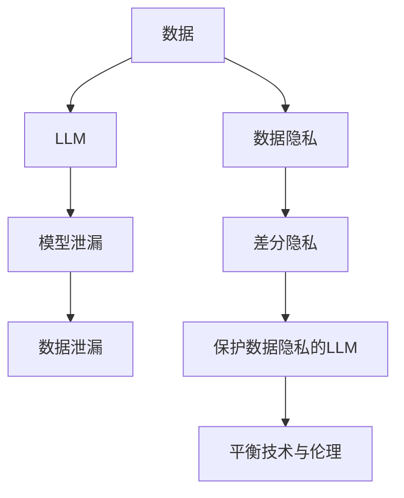

                 

**大语言模型（LLM）与数据隐私：技术与伦理的平衡之道**

## 1. 背景介绍

在当今数据驱动的世界中，大语言模型（LLM）已成为人工智能领域的关键组成部分。然而，随着LLM在各种应用中的广泛采用，数据隐私和安全问题变得越来越突出。本文将探讨LLM与数据隐私之间的复杂关系，并提供技术和伦理解决方案，以平衡模型的有效性和数据主体的隐私权。

## 2. 核心概念与联系

### 2.1 关键概念

- **大语言模型（LLM）**：一种深度学习模型，旨在理解、生成或翻译人类语言，如BERT、RoBERTa和T5。
- **数据隐私**：个人或组织的信息不被未经授权的访问、使用或披露。
- **差分隐私（DP）**：一种保护隐私的技术，通过引入噪声来限制模型对单个数据点的影响。
- **模型泄漏（Model Inversion Attacks）**：一种攻击模型的方法，旨在恢复或推断模型训练期间使用的数据。

### 2.2 核心概念联系




## 3. 核心算法原理 & 具体操作步骤

### 3.1 算法原理概述

差分隐私是一种保护数据隐私的技术，它通过引入噪声来限制模型对单个数据点的影响。差分隐私算法的目标是保护数据主体的隐私，同时允许模型学习有用的信息。

### 3.2 算法步骤详解

1. **数据预处理**：收集和预处理数据，并将其表示为向量。
2. **噪声添加**：为每个数据点添加高斯噪声或拉普拉斯噪声，以满足差分隐私约束。
3. **模型训练**：使用添加了噪声的数据训练LLM。
4. **模型评估**：评估模型的性能和隐私保护水平。

### 3.3 算法优缺点

**优点**：

- 有效保护数据主体的隐私。
- 可以在保护隐私的同时学习有用的信息。

**缺点**：

- 添加的噪声可能会降低模型的准确性。
- 保护隐私的成本可能会随着数据规模的增加而增加。

### 3.4 算法应用领域

差分隐私技术适用于各种需要保护数据隐私的场景，如医疗保健、金融和社交媒体等领域。

## 4. 数学模型和公式 & 详细讲解 & 举例说明

### 4.1 数学模型构建

差分隐私的数学模型基于以下定义：

> 定义：一个机制$\mathcal{M}$在$\epsilon$-差分隐私下运行，如果对于任何一对输入$x$和$x'$，以及任何可能的输出集$S \subseteq \text{Range}(\mathcal{M})$，
>
> $$Pr[\mathcal{M}(x) \in S] \leq e^{\epsilon} \cdot Pr[\mathcal{M}(x') \in S] + \delta$$
>
> 其中$\epsilon$是隐私预算，$\delta$是失败概率。

### 4.2 公式推导过程

差分隐私的数学基础是信息论和概率论。要推导差分隐私机制，需要证明添加的噪声足以满足上述定义。

### 4.3 案例分析与讲解

考虑一个简单的例子，假设我们想要计算数据集中某个属性的平均值，并使用差分隐私保护数据隐私。我们可以使用拉普拉斯机制添加噪声：

$$Z = \frac{1}{n}\sum_{i=1}^{n}x_i + \text{Lap}(\frac{\Delta f}{\epsilon})$$

其中$\Delta f$是函数$f$的敏感度，$\epsilon$是隐私预算。添加了噪声的平均值$Z$就是差分隐私保护的结果。

## 5. 项目实践：代码实例和详细解释说明

### 5.1 开发环境搭建

要实现差分隐私保护的LLM，您需要安装以下软件包：

- Python 3.8+
- PyTorch 1.8+
- DiffPrivLib（一个差分隐私库）

### 5.2 源代码详细实现

以下是使用DiffPrivLib添加噪声的示例代码：

```python
from diffprivlib.mechanisms import Laplace

# 设置隐私预算和敏感度
epsilon = 1.0
delta = 0.01
sensitivity = 1.0

# 创建拉普拉斯机制
mech = Laplace(epsilon=epsilon, delta=delta, sensitivity=sensitivity)

# 添加噪声
noisy_data = mech.randomize(data)
```

### 5.3 代码解读与分析

在上述代码中，我们首先导入Laplace机制，并设置隐私预算$\epsilon$、失败概率$\delta$和敏感度。然后，我们创建一个Laplace机制实例，并使用`randomize`方法添加噪声到数据中。

### 5.4 运行结果展示

添加了噪声的数据可以用于训练LLM，从而保护数据隐私。模型的性能可能会受到噪声的影响，但差分隐私机制可以在保护隐私的同时学习有用的信息。

## 6. 实际应用场景

### 6.1 当前应用

差分隐私技术已被应用于各种场景，如：

- **医疗保健**：保护患者数据，如电子病历和基因组数据。
- **金融**：保护客户数据，如交易记录和信用评分。
- **社交媒体**：保护用户数据，如帖子和评论。

### 6.2 未来应用展望

随着LLM在更多领域的应用，差分隐私技术将变得越来越重要。未来，我们可能会看到差分隐私技术在自动驾驶、物联网和其他领域的应用。

## 7. 工具和资源推荐

### 7.1 学习资源推荐

- **书籍**："Privacy Preserving Machine Learning" by Peter Kairouz, et al.
- **在线课程**：Coursera上的"Privacy in Machine Learning"课程。

### 7.2 开发工具推荐

- **DiffPrivLib**：一个差分隐私库，支持Python。
- **Apache Flink with DiffPrivLib**：一个分布式流处理框架，集成了DiffPrivLib。

### 7.3 相关论文推荐

- "Differential Privacy: A Survey of Results" by Cynthia Dwork and Aaron Roth.
- "Privacy-Preserving Machine Learning" by Peter Kairouz, et al.

## 8. 总结：未来发展趋势与挑战

### 8.1 研究成果总结

差分隐私技术已被证明是一种有效的保护数据隐私的方法。它可以在保护隐私的同时学习有用的信息，并已成功应用于各种领域。

### 8.2 未来发展趋势

未来，我们可能会看到差分隐私技术的进一步发展，以适应更复杂的场景和模型。此外，差分隐私与其他隐私保护技术的集成也将变得越来越重要。

### 8.3 面临的挑战

差分隐私技术面临的挑战包括：

- **性能折中**：添加的噪声可能会降低模型的性能。
- **实用性**：差分隐私技术的实现和部署可能会面临挑战。

### 8.4 研究展望

未来的研究方向包括：

- **差分隐私与联邦学习的集成**：研究如何在联邦学习场景中应用差分隐私技术。
- **差分隐私与模型泄漏的对抗**：研究如何在保护隐私的同时抵御模型泄漏攻击。

## 9. 附录：常见问题与解答

**Q：差分隐私与其他隐私保护技术有何不同？**

A：差分隐私是一种保护数据隐私的技术，它通过添加噪声来限制模型对单个数据点的影响。其他隐私保护技术，如模型泄漏攻击，则旨在恢复或推断模型训练期间使用的数据。

**Q：如何选择合适的隐私预算$\epsilon$？**

A：隐私预算$\epsilon$取决于您愿意牺牲多少隐私来换取模型的性能。通常，较小的$\epsilon$提供更好的隐私保护，但可能会降低模型的性能。

**Q：差分隐私技术是否可以防止所有类型的隐私泄漏？**

A：差分隐私技术可以防止某些类型的隐私泄漏，但它不能防止所有类型的隐私泄漏。例如，差分隐私不能防止模型泄漏攻击。

---

作者：禅与计算机程序设计艺术 / Zen and the Art of Computer Programming

