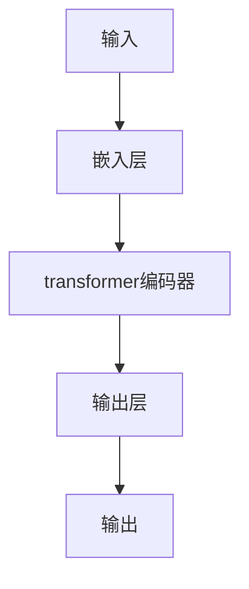

                 

## 1. 背景介绍

在当今信息爆炸的时代，个人助理软件已成为提高生产力和管理日常任务的必需品。然而，传统的个人助理软件在处理复杂请求和理解上下文时往往力不从心。大语言模型（LLM）的出现为个人助理领域带来了颠覆性的变化，使其能够更好地理解用户意图，并提供更有针对性的帮助。

## 2. 核心概念与联系

### 2.1 大语言模型（LLM）简介

大语言模型是一种深度学习模型，旨在理解和生成人类语言。它通过处理大量文本数据来学习语言规则和上下文，从而能够理解用户的意图并生成相关的回复。

### 2.2 LLM在个人助理中的应用

在个人助理领域，LLM可以帮助理解用户的请求，并提供更准确和有针对性的回复。例如，LLM可以帮助个人助理理解用户的自然语言输入，并根据上下文提供相关的建议和提示。

### 2.3 LLM架构原理

LLM通常基于transformer架构，该架构由自注意力机制组成，能够处理长序列数据。下图是LLM架构的Mermaid流程图：



## 3. 核心算法原理 & 具体操作步骤

### 3.1 算法原理概述

LLM的核心算法是transformer编码器，它由多个自注意力层组成。自注意力机制允许模型在处理序列数据时考虑上下文，从而更好地理解用户的意图。

### 3.2 算法步骤详解

1. **输入嵌入**：将输入文本转换为模型可以处理的数值表示。
2. **transformer编码**：使用transformer编码器处理输入嵌入，生成上下文相关的表示。
3. **输出**：根据上下文生成相关的回复。

### 3.3 算法优缺点

**优点**：
- 可以理解上下文，从而提供更准确的回复。
- 可以处理长序列数据，从而处理更复杂的请求。

**缺点**：
- 计算开销大，需要大量的计算资源。
- 可能会生成不准确或无关的回复。

### 3.4 算法应用领域

LLM在个人助理领域的应用包括：

- 理解用户的自然语言输入。
- 提供相关的建议和提示。
- 处理复杂的请求和任务。

## 4. 数学模型和公式 & 详细讲解 & 举例说明

### 4.1 数学模型构建

LLM的数学模型可以表示为：

$$P(w_{1:T}) = \prod_{t=1}^{T}P(w_t|w_{<t})$$

其中，$w_{1:T}$表示输入序列，$w_{<t}$表示序列$w_{1:T}$的前$t-1$个单词，$P(w_t|w_{<t})$表示模型预测单词$w_t$的概率。

### 4.2 公式推导过程

LLM的推导过程基于最大似然估计，目标是最大化输入序列的概率。具体地，模型学习参数$\theta$以最大化：

$$\theta^* = \arg\max_{\theta}\sum_{i=1}^{N}\log P(w_{i,1:T}^{(i)}|\theta)$$

其中，$N$表示训练数据集中的序列数，$w_{i,1:T}^{(i)}$表示第$i$个序列。

### 4.3 案例分析与讲解

例如，假设用户输入“明天天气怎么样”，LLM需要预测下一个单词。根据数学模型，LLM需要计算每个可能的单词的概率，并选择概率最高的单词作为预测结果。在本例中，LLM可能会预测单词“明天”或“天气”。

## 5. 项目实践：代码实例和详细解释说明

### 5.1 开发环境搭建

要开发基于LLM的个人助理，需要安装以下软件和库：

- Python 3.8或更高版本
- Transformers库（Hugging Face）
- torch库（PyTorch）
- numpy库

### 5.2 源代码详细实现

以下是一个简单的LLM个人助理示例代码：

```python
from transformers import pipeline

# 初始化LLM模型
nlp = pipeline('text-generation', model='t5-base', tokenizer='t5-base')

# 定义个人助理函数
def personal_assistant(query):
    # 生成LLM的回复
    response = nlp(query)[0]['generated_text']
    return response

# 测试个人助理
query = "明天天气怎么样"
response = personal_assistant(query)
print(response)
```

### 5.3 代码解读与分析

在代码中，我们首先初始化LLM模型，然后定义个人助理函数。该函数接受用户的查询，并使用LLM生成回复。最后，我们测试个人助理，并打印回复。

### 5.4 运行结果展示

运行上述代码后，LLM可能会生成以下回复：

“明天天气晴朗，最高气温25度，最低气温15度。请注意，气象条件可能会有变化，请关注最新天气预报。”

## 6. 实际应用场景

### 6.1 当前应用

LLM已经在许多个人助理软件中得到应用，例如：

- Siri（Apple）
- Google Assistant（Google）
- Alexa（Amazon）
- Cortana（Microsoft）

### 6.2 未来应用展望

随着LLM技术的不断发展，我们可以期待更智能和更人性化的个人助理。例如，LLM可以帮助个人助理理解用户的情感状态，并提供相应的建议和帮助。此外，LLM还可以帮助个人助理处理更复杂的任务，例如预订机票、订餐等。

## 7. 工具和资源推荐

### 7.1 学习资源推荐

- "Attention is All You Need"（Vaswani et al., 2017）
- "T5: Text-to-Text Transfer Transformer"（Raffel et al., 2019）
- Hugging Face Transformers库文档（<https://huggingface.co/transformers/>）

### 7.2 开发工具推荐

- Jupyter Notebook
- Google Colab
- PyCharm

### 7.3 相关论文推荐

- "BERT: Pre-training of Deep Bidirectional Transformers for Language Understanding"（Devlin et al., 2018）
- "RoBERTa: A Robustly Optimized BERT Pretraining Approach"（Liu et al., 2019）
- "ALBERT: A Lite BERT for Self-supervised Learning of Language Representations"（Lan et al., 2019）

## 8. 总结：未来发展趋势与挑战

### 8.1 研究成果总结

LLM在个人助理领域取得了显著的成果，使其能够更好地理解用户的意图，并提供更准确和有针对性的回复。

### 8.2 未来发展趋势

未来，LLM技术将继续发展，并可能会出现以下趋势：

- 更大的模型规模，从而提高模型的理解和生成能力。
- 更好的训练技术，从而提高模型的泛化能力。
- 更多的预训练模型，从而扩展LLM的应用领域。

### 8.3 面临的挑战

然而，LLM技术也面临着一些挑战，包括：

- 计算资源需求大，从而限制了模型的规模和应用。
- 模型可能会生成不准确或无关的回复，从而影响用户体验。
- 模型可能会受到数据偏见的影响，从而导致不公平的结果。

### 8.4 研究展望

未来的研究将关注于解决上述挑战，并开发更智能和更可靠的LLM。此外，研究还将关注于开发新的LLM架构和训练技术，从而提高模型的性能和泛化能力。

## 9. 附录：常见问题与解答

**Q：LLM如何理解用户的意图？**

A：LLM通过处理大量文本数据来学习语言规则和上下文，从而能够理解用户的意图。在处理用户的查询时，LLM会考虑上下文，并根据上下文生成相关的回复。

**Q：LLM是否会泄露用户的隐私？**

A：LLM本身不会泄露用户的隐私。然而，开发人员需要注意保护用户的隐私，并遵循相关的隐私保护法规。

**Q：LLM是否会取代人工助理？**

A：LLM不会取代人工助理。相反，LLM将与人工助理协同工作，帮助其更好地理解用户的意图，并提供更准确和有针对性的回复。

## 作者：禅与计算机程序设计艺术 / Zen and the Art of Computer Programming

