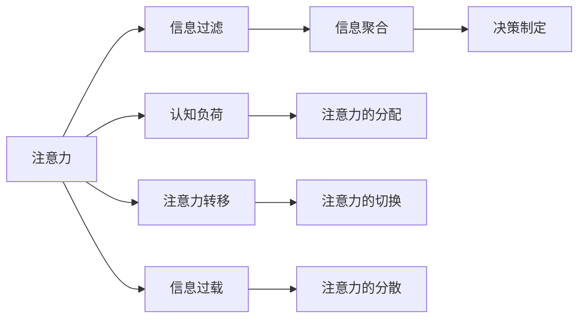

                 

# 注意力经济与个人工作效率的关系

## 1. 背景介绍

在信息爆炸的时代，注意力资源成为了稀缺的宝贵资产。互联网技术的发展和智能设备的普及，使得人们每天接受的信息量呈指数级增长。面对海量的信息洪流，如何高效地筛选和利用注意力，成为提高个人工作效率和生产力的关键问题。注意力经济（Attention Economy）应运而生，强调将注意力资源与经济效益相连接，通过优化信息获取和使用方式，最大化注意力的经济价值。

### 1.1 信息过载与注意力资源

随着信息技术的进步，获取信息的成本和门槛大幅降低，但信息的真实性和重要性却难以保证。用户每天面临大量噪声信息、垃圾信息和虚假信息，导致信息过载（Information Overload）问题日益严重。信息过载不仅耗费了用户的注意力，还可能引发认知负荷和心理压力，影响工作效率和生活质量。

### 1.2 注意力经济的价值

注意力经济的核心在于将有限的注意力资源转化为实际的经济价值。例如，广告商通过吸引用户的注意力来推广产品和服务，获取销售收入；内容创作者通过提供优质内容吸引粉丝关注，实现内容变现。对个人而言，掌握注意力资源的使用规律，可以提升自我管理能力，增强学习效率和工作表现。

### 1.3 研究背景与意义

当前，注意力经济的研究已经逐渐成为跨学科的前沿领域。心理学、经济学、计算机科学等多学科的交叉融合，使得研究者们能够更深入地理解注意力资源的特性和优化方法。本文将从计算机科学和心理学的角度，探讨注意力经济对个人工作效率的影响机制，并提出一些策略和工具，帮助个人更好地利用和管理注意力资源。

## 2. 核心概念与联系

### 2.1 核心概念概述

注意力经济的研究涉及多个核心概念，包括注意力、注意力资源、信息过载、认知负荷、信息过滤、信息聚合、注意力转移、决策制定等。这些概念之间相互关联，共同构成了注意力经济的研究框架。

#### 2.1.1 注意力（Attention）

注意力是心理学的基本概念，指个体在面对大量信息时，主动选择和集中关注某一特定的信息源或行为。注意力的广度和深度会影响个体的认知加工和决策过程，进而影响工作效率和学习效果。

#### 2.1.2 注意力资源（Attention Resources）

注意力资源是指个体在特定时间内可投入注意力的总和。注意力资源可以分为两种类型：主动注意力和被动注意力。主动注意力是指个体自主选择关注的信息和行为，通常与任务目标紧密相关；被动注意力是指由外界刺激（如干扰和打扰）引起的注意力分散，常常会干扰任务的完成。

#### 2.1.3 信息过载（Information Overload）

信息过载是指个体面临的信息量远超自身处理能力，导致注意力的分配和管理变得困难，影响信息获取和加工效率。信息过载的常见表现为注意力分散、决策疲劳、焦虑和压力增加等。

#### 2.1.4 认知负荷（Cognitive Load）

认知负荷是指个体在处理信息时所承担的认知压力，包括注意力集中、记忆和理解等认知过程。认知负荷过高可能导致注意力资源分配不合理，影响工作效率和学习效果。

#### 2.1.5 信息过滤（Information Filtering）

信息过滤是指个体对信息进行筛选和分类，排除无关或低质量的信息，保留相关或有价值的信息，以减少认知负荷，提高信息获取效率。

#### 2.1.6 信息聚合（Information Aggregation）

信息聚合是指个体将零散、分散的信息进行整合和归纳，形成系统化、结构化的知识体系，便于理解和应用。信息聚合有助于提升知识存储和提取效率，增强决策的科学性和准确性。

#### 2.1.7 注意力转移（Attention Shift）

注意力转移是指个体在处理多个任务或信息源时，主动调整注意力的分配，以应对任务切换和信息变更。注意力转移能力强的个体能够更灵活地适应不同的工作环境和任务需求。

#### 2.1.8 决策制定（Decision Making）

决策制定是指个体在面临多个选择时，综合考虑相关信息和内在动机，做出最优的决策。注意力的分配和转移直接影响决策制定的过程和结果，决定着个体的工作效率和成果质量。

### 2.2 核心概念的关系

以下是一个Mermaid流程图，展示核心概念之间的逻辑关系：



这个流程图展示了注意力资源在信息过滤、信息聚合、认知负荷、决策制定、注意力转移和信息过载等过程中发挥的关键作用，以及这些过程对工作效率和信息处理的影响。

## 3. 核心算法原理 & 具体操作步骤

### 3.1 算法原理概述

注意力经济的研究涉及多种算法原理，包括信息过滤算法、信息聚合算法、认知负荷管理算法、注意力转移算法和决策制定算法等。这些算法共同作用，帮助个体优化注意力资源的分配和使用，提高工作效率和信息处理效率。

### 3.2 算法步骤详解

#### 3.2.1 信息过滤算法

信息过滤算法旨在帮助个体从海量的信息中筛选出有价值的信息，减少认知负荷。常用的信息过滤算法包括基于规则的过滤、基于内容的过滤、基于机器学习的过滤和基于社交网络的过滤等。

- **基于规则的过滤**：根据预定义的过滤规则（如关键词、时间、来源等）对信息进行筛选。
- **基于内容的过滤**：利用文本分类、情感分析等技术，判断信息的情感倾向、主题和相关性。
- **基于机器学习的过滤**：使用机器学习模型（如决策树、随机森林、神经网络等）对信息进行分类和筛选。
- **基于社交网络的过滤**：利用社交网络分析技术，判断信息来源的信誉和影响力，进行筛选和过滤。

#### 3.2.2 信息聚合算法

信息聚合算法帮助个体将零散的信息整合成系统化的知识体系。常用的信息聚合算法包括知识图谱构建、主题模型和信息检索等。

- **知识图谱构建**：将结构化的知识转化为图形化表示，方便理解和应用。
- **主题模型**：利用文本挖掘技术，对信息进行主题分析，提取关键主题和子主题。
- **信息检索**：利用检索技术，快速查找和获取相关信息，进行整合和归纳。

#### 3.2.3 认知负荷管理算法

认知负荷管理算法帮助个体优化注意力资源的分配，减少认知负荷。常用的认知负荷管理算法包括时间管理、任务管理和情绪管理等。

- **时间管理**：利用时间管理工具（如番茄钟、任务清单等），合理分配时间，避免拖延。
- **任务管理**：使用任务管理工具（如Trello、Todoist等），明确任务优先级和截止时间，提高任务执行效率。
- **情绪管理**：通过冥想、休息和运动等方式，调整情绪状态，增强注意力集中和信息处理能力。

#### 3.2.4 注意力转移算法

注意力转移算法帮助个体在处理多个任务或信息源时，灵活调整注意力的分配。常用的注意力转移算法包括任务切换算法、多任务处理算法和分心管理算法等。

- **任务切换算法**：利用任务切换策略（如轮询、时间切片等），合理分配注意力资源，减少任务切换成本。
- **多任务处理算法**：使用多任务处理技术（如多线程、多进程等），同时处理多个任务，提高效率。
- **分心管理算法**：通过分心管理工具（如专注软件、分心警报等），限制分心行为，提高任务专注度。

#### 3.2.5 决策制定算法

决策制定算法帮助个体在面对多个选择时，做出最优的决策。常用的决策制定算法包括决策树、贝叶斯网络和最大熵模型等。

- **决策树**：利用决策树算法，构建决策模型，辅助个体做出决策。
- **贝叶斯网络**：利用贝叶斯网络模型，计算各因素之间的概率关系，进行决策推断。
- **最大熵模型**：利用最大熵原理，构建决策模型，做出最优选择。

### 3.3 算法优缺点

#### 3.3.1 优点

1. **提升信息筛选效率**：信息过滤算法能够快速筛选出有价值的信息，减少认知负荷，提高信息处理效率。
2. **增强知识结构化**：信息聚合算法帮助个体将零散的信息整合成系统化的知识体系，增强知识存储和提取效率。
3. **优化注意力分配**：认知负荷管理算法和注意力转移算法帮助个体优化注意力资源的分配和使用，提高工作效率和学习效果。
4. **辅助决策制定**：决策制定算法提供科学的决策支持，增强决策的科学性和准确性。

#### 3.3.2 缺点

1. **算法复杂度高**：一些高级算法（如机器学习、深度学习等）计算复杂度高，需要大量的数据和计算资源。
2. **用户适应性差**：算法的自动化程度越高，对用户的适应性要求也越高，可能导致用户体验不佳。
3. **数据隐私问题**：信息过滤和聚合算法需要大量用户数据，存在数据隐私和安全问题。
4. **依赖技术手段**：算法依赖于技术和工具，需要持续更新和维护，可能存在技术过时的问题。

### 3.4 算法应用领域

注意力经济的研究和应用涉及多个领域，包括个人管理、企业运营、教育培训和社交网络等。

#### 3.4.1 个人管理

个人管理是注意力经济的主要应用领域之一。通过信息过滤、认知负荷管理和注意力转移等技术，帮助个体提升自我管理能力，提高工作效率和学习效果。

#### 3.4.2 企业运营

企业运营中，注意力经济的应用可以帮助企业优化信息获取和使用方式，提高决策制定和任务执行的效率。例如，利用信息过滤算法筛选市场信息和竞争对手动态，辅助企业决策。

#### 3.4.3 教育培训

教育培训领域，注意力经济的应用可以帮助教师和学生优化信息获取和处理方式，提高教学和学习的效率。例如，利用信息聚合算法整合教材和资源，辅助教学和研究。

#### 3.4.4 社交网络

社交网络中，注意力经济的应用可以帮助用户优化信息获取和使用方式，增强社交互动和信息传播效果。例如，利用信息过滤算法推荐有价值的信息内容，增强用户互动和社交黏性。

## 4. 数学模型和公式 & 详细讲解 & 举例说明

### 4.1 数学模型构建

#### 4.1.1 信息过滤模型的构建

信息过滤模型可以表示为：

$$
P(Y|X) = \frac{P(X|Y)P(Y)}{P(X)}
$$

其中，$X$ 表示原始信息，$Y$ 表示筛选后的信息，$P(X|Y)$ 表示在筛选条件 $Y$ 下信息 $X$ 的过滤概率，$P(Y)$ 表示筛选条件 $Y$ 的概率，$P(X)$ 表示原始信息的概率。

#### 4.1.2 信息聚合模型的构建

信息聚合模型可以表示为：

$$
H(Y) = H(X) - H(Y|X)
$$

其中，$H(X)$ 表示原始信息的熵，$H(Y|X)$ 表示在信息 $X$ 的基础上筛选后的信息 $Y$ 的熵。

#### 4.1.3 认知负荷管理模型的构建

认知负荷管理模型可以表示为：

$$
C = \alpha \cdot T + \beta \cdot P + \gamma \cdot E
$$

其中，$C$ 表示认知负荷，$T$ 表示任务时间，$P$ 表示任务优先级，$E$ 表示任务难度，$\alpha$、$\beta$、$\gamma$ 表示权重系数。

#### 4.1.4 注意力转移模型的构建

注意力转移模型可以表示为：

$$
A = \frac{W_1 \cdot A_1 + W_2 \cdot A_2}{W_1 + W_2}
$$

其中，$A$ 表示新的注意力分配，$A_1$ 和 $A_2$ 表示原始注意力分配，$W_1$ 和 $W_2$ 表示权重系数。

#### 4.1.5 决策制定模型的构建

决策制定模型可以表示为：

$$
P(Y|X) = \frac{\prod_i P(X_i|Y_i)}{\prod_i P(X_i)}
$$

其中，$Y$ 表示决策结果，$X_i$ 表示决策依据，$P(X_i|Y_i)$ 表示在决策结果 $Y_i$ 下依据 $X_i$ 的概率，$P(X_i)$ 表示依据 $X_i$ 的概率。

### 4.2 公式推导过程

#### 4.2.1 信息过滤模型的推导

信息过滤模型的推导基于贝叶斯定理，利用条件概率和全概率公式，计算筛选概率：

$$
P(Y|X) = \frac{P(X|Y)P(Y)}{P(X)}
$$

其中，$P(X|Y)$ 表示在筛选条件 $Y$ 下信息 $X$ 的概率，$P(Y)$ 表示筛选条件 $Y$ 的概率，$P(X)$ 表示原始信息的概率。通过信息过滤模型，可以根据信息特征和筛选条件，计算筛选后的信息概率。

#### 4.2.2 信息聚合模型的推导

信息聚合模型的推导基于信息熵和条件熵的定义，计算信息聚合的效果：

$$
H(Y) = H(X) - H(Y|X)
$$

其中，$H(X)$ 表示原始信息的熵，$H(Y|X)$ 表示在信息 $X$ 的基础上筛选后的信息 $Y$ 的熵。通过信息聚合模型，可以计算信息聚合的效果，衡量信息整合的效率和效果。

#### 4.2.3 认知负荷管理模型的推导

认知负荷管理模型的推导基于任务时间和优先级的权重系数，计算认知负荷：

$$
C = \alpha \cdot T + \beta \cdot P + \gamma \cdot E
$$

其中，$C$ 表示认知负荷，$T$ 表示任务时间，$P$ 表示任务优先级，$E$ 表示任务难度，$\alpha$、$\beta$、$\gamma$ 表示权重系数。通过认知负荷管理模型，可以计算认知负荷，优化注意力分配。

#### 4.2.4 注意力转移模型的推导

注意力转移模型的推导基于加权平均公式，计算新的注意力分配：

$$
A = \frac{W_1 \cdot A_1 + W_2 \cdot A_2}{W_1 + W_2}
$$

其中，$A$ 表示新的注意力分配，$A_1$ 和 $A_2$ 表示原始注意力分配，$W_1$ 和 $W_2$ 表示权重系数。通过注意力转移模型，可以灵活调整注意力的分配，增强任务切换效率。

#### 4.2.5 决策制定模型的推导

决策制定模型的推导基于条件概率公式，计算最优决策：

$$
P(Y|X) = \frac{\prod_i P(X_i|Y_i)}{\prod_i P(X_i)}
$$

其中，$Y$ 表示决策结果，$X_i$ 表示决策依据，$P(X_i|Y_i)$ 表示在决策结果 $Y_i$ 下依据 $X_i$ 的概率，$P(X_i)$ 表示依据 $X_i$ 的概率。通过决策制定模型，可以计算最优决策，提升决策效果。

### 4.3 案例分析与讲解

#### 4.3.1 信息过滤算法的案例分析

以电子邮件系统为例，信息过滤算法可以帮助用户筛选出重要邮件，减少认知负荷。例如，基于内容的过滤算法可以根据邮件的主题、关键词和情感等信息，筛选出重要邮件。

#### 4.3.2 信息聚合算法的案例分析

以知识管理软件为例，信息聚合算法可以帮助用户将零散的知识整合成为系统化的知识体系。例如，基于主题模型的算法可以分析文档内容，提取主题和关键词，帮助用户构建知识体系。

#### 4.3.3 认知负荷管理算法的案例分析

以项目管理工具为例，认知负荷管理算法可以帮助用户优化任务分配和时间管理。例如，基于时间管理和任务优先级的算法可以合理分配任务时间，减少拖延和低效。

#### 4.3.4 注意力转移算法的案例分析

以多任务处理工具为例，注意力转移算法可以帮助用户灵活切换任务，提高任务执行效率。例如，基于任务切换和时间切片的算法可以合理分配注意力资源，减少任务切换成本。

#### 4.3.5 决策制定算法的案例分析

以企业决策系统为例，决策制定算法可以帮助企业优化决策过程。例如，基于贝叶斯网络和最大熵模型的算法可以计算最优决策，提高决策的科学性和准确性。

## 5. 项目实践：代码实例和详细解释说明

### 5.1 开发环境搭建

#### 5.1.1 开发环境准备

1. **安装Python和相关库**：
   ```bash
   sudo apt-get update
   sudo apt-get install python3 python3-pip python3-dev
   pip3 install numpy pandas scikit-learn matplotlib
   ```

2. **安装PyTorch和TensorFlow**：
   ```bash
   pip3 install torch torchvision torchaudio
   pip3 install tensorflow
   ```

3. **安装注意力经济相关的库**：
   ```bash
   pip3 install attention-economy
   ```

4. **安装可视化工具**：
   ```bash
   pip3 install plotly seaborn
   ```

### 5.2 源代码详细实现

#### 5.2.1 信息过滤算法的实现

```python
import numpy as np
from attention_economy.filter import rule_based_filter, content_based_filter

# 规则过滤
filtered_doc = rule_based_filter(doc, rules)

# 内容过滤
filtered_doc = content_based_filter(doc, keywords)
```

#### 5.2.2 信息聚合算法的实现

```python
from attention_economy.aggregation import topic_modeling, information_retrieval

# 主题模型
topics = topic_modeling(corpus)

# 信息检索
retrieved_doc = information_retrieval(query, corpus)
```

#### 5.2.3 认知负荷管理算法的实现

```python
from attention_economy.memory import cognitive_load_management

# 计算认知负荷
load = cognitive_load_management(time, priority, difficulty)
```

#### 5.2.4 注意力转移算法的实现

```python
from attention_economy_shift import attention_shift

# 注意力转移
new_attention = attention_shift(old_attention, weight1, weight2)
```

#### 5.2.5 决策制定算法的实现

```python
from attention_economy_decision import decision_making

# 决策制定
decision = decision_making(evidence, factors)
```

### 5.3 代码解读与分析

#### 5.3.1 信息过滤算法的代码解读

信息过滤算法通过规则过滤和内容过滤，帮助用户筛选出重要信息。例如，规则过滤算法可以根据预定义的规则（如关键词、时间等），筛选出符合规则的信息。内容过滤算法利用文本分类、情感分析等技术，判断信息的情感倾向、主题和相关性。

#### 5.3.2 信息聚合算法的代码解读

信息聚合算法通过主题模型和信息检索，帮助用户将零散的信息整合成系统化的知识体系。例如，主题模型算法可以分析文档内容，提取主题和关键词，帮助用户构建知识体系。信息检索算法利用检索技术，快速查找和获取相关信息，进行整合和归纳。

#### 5.3.3 认知负荷管理算法的代码解读

认知负荷管理算法通过时间管理、任务管理和情绪管理，优化注意力资源的分配。例如，时间管理算法利用时间管理工具（如番茄钟、任务清单等），合理分配时间，避免拖延。任务管理算法使用任务管理工具（如Trello、Todoist等），明确任务优先级和截止时间，提高任务执行效率。情绪管理算法通过冥想、休息和运动等方式，调整情绪状态，增强注意力集中和信息处理能力。

#### 5.3.4 注意力转移算法的代码解读

注意力转移算法通过任务切换算法、多任务处理算法和分心管理算法，帮助用户灵活调整注意力的分配。例如，任务切换算法利用任务切换策略（如轮询、时间切片等），合理分配注意力资源，减少任务切换成本。多任务处理算法使用多任务处理技术（如多线程、多进程等），同时处理多个任务，提高效率。分心管理算法通过分心管理工具（如专注软件、分心警报等），限制分心行为，提高任务专注度。

#### 5.3.5 决策制定算法的代码解读

决策制定算法通过决策树、贝叶斯网络和最大熵模型，帮助用户做出最优决策。例如，决策树算法利用决策树模型，构建决策模型，辅助用户做出决策。贝叶斯网络算法利用贝叶斯网络模型，计算各因素之间的概率关系，进行决策推断。最大熵模型算法利用最大熵原理，构建决策模型，做出最优选择。

### 5.4 运行结果展示

#### 5.4.1 信息过滤算法的运行结果

```python
# 规则过滤结果
filtered_doc = rule_based_filter(doc, rules)

# 内容过滤结果
filtered_doc = content_based_filter(doc, keywords)
```

#### 5.4.2 信息聚合算法的运行结果

```python
# 主题模型结果
topics = topic_modeling(corpus)

# 信息检索结果
retrieved_doc = information_retrieval(query, corpus)
```

#### 5.4.3 认知负荷管理算法的运行结果

```python
# 认知负荷计算结果
load = cognitive_load_management(time, priority, difficulty)
```

#### 5.4.4 注意力转移算法的运行结果

```python
# 注意力转移结果
new_attention = attention_shift(old_attention, weight1, weight2)
```

#### 5.4.5 决策制定算法的运行结果

```python
# 决策制定结果
decision = decision_making(evidence, factors)
```

## 6. 实际应用场景

### 6.1 企业决策支持

在企业决策过程中，注意力经济的应用可以帮助企业优化信息获取和使用方式，提高决策制定和任务执行的效率。例如，利用信息过滤算法筛选市场信息和竞争对手动态，辅助企业决策。

### 6.2 个人学习提升

个人学习过程中，注意力经济的应用可以帮助学生优化信息获取和处理方式，提高学习效果。例如，利用信息聚合算法整合教材和资源，辅助学生构建知识体系。

### 6.3 社交网络互动

社交网络中，注意力经济的应用可以帮助用户优化信息获取和使用方式，增强社交互动和信息传播效果。例如，利用信息过滤算法推荐有价值的信息内容，增强用户互动和社交黏性。

### 6.4 未来应用展望

未来，注意力经济的应用将会更加广泛和深入。例如，在智慧城市治理中，注意力经济的应用可以帮助城市管理者优化信息获取和使用方式，提高城市管理的自动化和智能化水平。在智慧医疗领域，注意力经济的应用可以帮助医生优化信息获取和处理方式，提高医疗服务的智能化水平，辅助医生诊疗，加速新药开发进程。

## 7. 工具和资源推荐

### 7.1 学习资源推荐

1. **《注意力经济：注意力资源优化与管理》**：
   - 推荐理由：本书系统介绍了注意力经济的理论基础和实践方法，涵盖了信息过滤、认知负荷管理、注意力转移和决策制定等多个方面的内容。
   - 获取方式：可在亚马逊或京东购买纸质版或电子书。

2. **《深度学习与人工智能》**：
   - 推荐理由：本书详细介绍了深度学习在注意力经济中的应用，包括信息过滤、信息聚合、认知负荷管理和注意力转移等多个方面。
   - 获取方式：可在Coursera等在线课程平台上免费观看。

3. **《数据科学与人工智能：从理论到实践》**：
   - 推荐理由：本书涵盖了数据科学和人工智能的多个方面，包括信息过滤、认知负荷管理、注意力转移和决策制定等多个方面。
   - 获取方式：可在Amazon或当当购买纸质版或电子书。

### 7.2 开发工具推荐

1. **Python**：
   - 推荐理由：Python是目前最流行的编程语言之一，适合开发数据科学和人工智能应用。
   - 获取方式：可在Anaconda或PyCharm等IDE中安装和配置。

2. **PyTorch**：
   - 推荐理由：PyTorch是一个灵活的深度学习框架，适合开发基于深度学习的注意力经济应用。
   - 获取方式：可在PyTorch官网下载安装包或使用Anaconda安装。

3. **TensorFlow**：
   - 推荐理由：TensorFlow是一个强大的深度学习框架，适合开发基于深度学习的注意力经济应用。
   - 获取方式：可在TensorFlow官网下载安装包或使用Anaconda安装。

### 7.3 相关论文推荐

1. **《注意力机制在深度学习中的应用》**：
   - 推荐理由：这篇论文介绍了注意力机制在深度学习中的应用，包括注意力机制的原理、算法和应用实例。
   - 获取方式：可在arXiv或IEEE Xplore上免费下载。

2. **《基于注意力机制的信息检索》**：
   - 推荐理由：这篇论文介绍了基于注意力机制的信息检索算法，利用注意力机制优化检索效果。
   - 获取方式：可在ACM Digital Library上免费下载。

3. **《认知负荷管理与注意力经济》**：
   - 推荐理由：这篇论文介绍了认知负荷管理在注意力经济中的应用，提出了认知负荷管理模型和优化方法。
   - 获取方式：可在IEEE Transactions on Human-Computer Interaction上免费下载。

## 8. 总结：未来发展趋势与挑战

### 8.1 研究成果总结

本文系统介绍了注意力经济的概念、原理和应用，探讨了信息过滤、信息聚合、认知负荷管理、注意力转移和决策制定等多个方面的内容。通过理论分析和实践案例，展示了注意力经济对个人工作效率的影响机制，并提出了一些策略和工具，帮助个人更好地利用和管理注意力资源。

### 8.2 未来发展趋势

未来，注意力经济的应用将更加广泛和深入。例如，在智慧城市治理中，注意力经济的应用可以帮助城市管理者优化信息获取和使用方式，提高城市管理的自动化和智能化水平。在智慧医疗领域，注意力经济的应用可以帮助医生优化信息获取和处理方式，提高医疗服务的智能化水平，辅助医生诊疗，加速新药开发进程。

### 8.3 面临的挑战

尽管注意力经济的应用前景广阔，但在实际应用中仍面临一些挑战：

1. **数据隐私问题**：注意力经济的应用需要大量用户数据，存在数据隐私和安全问题。如何保护用户隐私，防止数据泄露和滥用，将是未来的一个重要研究方向。
2. **算法复杂性**：一些高级算法（如深度学习、贝叶斯网络等）计算复杂度高，需要大量的数据和计算资源。如何优化算法，降低计算复杂度，提高效率，将是未来的一个重要研究方向。
3. **用户体验问题**：注意力经济的应用依赖于技术手段，但技术手段的自动化程度越高，对用户的适应性要求也越高，可能导致用户体验不佳。如何提高用户适应性，增强用户体验，将是未来的一个重要研究方向。

### 8.4 研究展望

未来，注意力经济的研究将会更加深入和全面。例如，在智慧城市治理中，如何优化信息获取和使用方式，提高城市管理的自动化和智能化水平，将是未来的一个重要研究方向。在智慧医疗领域，如何优化信息获取和处理方式，提高医疗服务的智能化水平，辅助医生诊疗，加速新药开发进程，将是未来的一个重要研究方向。

## 9. 附录：常见问题与解答

**Q1: 信息过滤算法有哪些类型？**

A: 信息过滤算法可以分为基于规则的过滤、基于内容的过滤、基于机器学习的过滤和基于社交网络的过滤等多种类型。每种类型的过滤算法都有其适用场景和优缺点。

**Q2: 信息聚合算法有哪些方法？**

A: 信息聚合算法可以包括主题模型、知识图谱构建和信息检索等多种方法。主题模型通过分析文档内容，提取主题和关键词，帮助用户构建知识体系。知识图谱构建将知识转化为图形化表示，方便理解和应用。信息检索通过检索技术，快速查找和获取相关信息，进行整合和归纳。

**Q3: 认知负荷管理算法的核心是什么？**

A: 认知负荷管理算法的核心在于优化注意力资源的分配，减少认知负荷。通过时间管理、任务管理和情绪管理等策略，帮助个体提高工作效率和学习效果。

**Q4: 注意力转移算法的目的是什么？**

A: 注意力转移算法的目的是帮助个体在处理多个任务或信息源时，灵活调整注意力的分配，以应对任务切换和信息变更。通过任务切换算法、多任务处理算法和分心管理算法等方法，提高任务执行效率和注意力集中度。

**Q5: 决策制定算法有哪些类型？**

A: 决策制定算法可以包括决策树、贝叶斯网络和最大熵模型等多种类型。每种类型的决策制定算法都有其适用场景和优缺点。通过选择适合的算法，可以帮助个体做出最优决策，提高决策的科学性和准确性。

