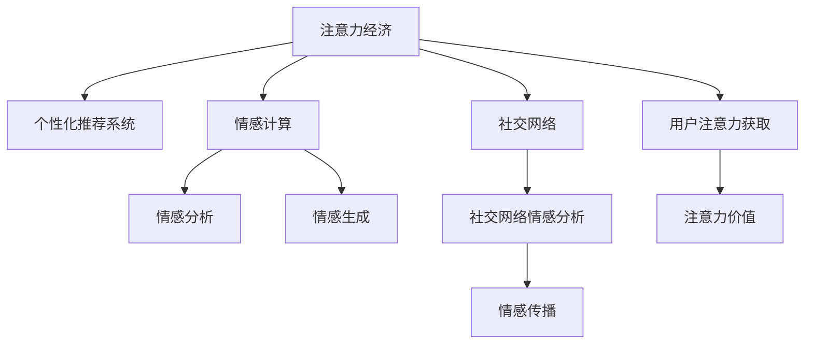

                 

# 注意力经济与个人情感表达方式的变迁

## 1. 背景介绍

### 1.1 问题由来
在当今的信息爆炸时代，注意力作为一种稀缺资源，其经济价值日益凸显。从媒体广告到社交网络，从电商平台到新闻聚合，注意力经济已经成为互联网行业的核心驱动力。而在个人情感表达领域，随着社交媒体、即时通讯工具的普及，人们对于情感表达方式的选择和表达习惯也发生了显著的变迁。

### 1.2 问题核心关键点
注意力经济的崛起，极大地改变了人们获取信息和进行情感交流的方式。社交媒体通过算法推荐和个性化内容，使人们更多地沉浸在感兴趣的领域，减少了对于复杂信息的关注。与此同时，个人情感表达方式也从传统的书信、面谈等形式，逐步转向数字化的方式，如文字、图片、短视频等。这些变化不仅影响了情感的表达和传播，也引发了对情感表达方式创新和优化的需求。

### 1.3 问题研究意义
研究注意力经济与个人情感表达方式的变迁，对于理解互联网时代的情感交流模式，探索更有效的情感表达方式，推动情感计算技术的进步，具有重要意义。掌握这些变化趋势，有助于开发者设计更加符合用户习惯的情感表达工具，提升用户体验，促进技术创新。

## 2. 核心概念与联系

### 2.1 核心概念概述

为更好地理解注意力经济与个人情感表达方式的变迁，本节将介绍几个密切相关的核心概念：

- 注意力经济(Attention Economy)：指在信息过载的背景下，用户对信息的关注度和注意力成为一种经济资源的经济模式。广告商、内容创作者通过获取用户的注意力来达到营销和传播目的。
- 个性化推荐系统(Recommender System)：利用用户历史行为数据和特征，为每个用户推荐个性化内容，从而提高用户参与度和满意度。
- 情感计算(Affective Computing)：通过分析人的情感状态和情感表达，研究如何应用人工智能技术来理解、生成和控制情感。
- 社交网络(Social Network)：以人为节点，以互动关系为边，通过图结构来描述人类社交关系的互联网平台。
- 情感分析(Affective Analysis)：利用自然语言处理和机器学习技术，对文本数据中的情感进行识别和分析，以理解用户情感状态。
- 情感生成(Emotion Generation)：通过生成对抗网络(Generative Adversarial Networks, GANs)、变分自编码器(Variational Autoencoder, VAEs)等技术，生成具有特定情感色彩的文本或视频内容。

这些核心概念之间的逻辑关系可以通过以下Mermaid流程图来展示：



这个流程图展示了几大核心概念及其之间的关系：

1. 注意力经济通过个性化推荐系统和社交网络，吸引了大量用户注意力。
2. 情感计算在社交网络中通过情感分析手段，获取用户情感状态，进而推动情感生成技术的应用。
3. 情感生成技术能够产出具有特定情感色彩的内容，进一步增强情感传播效果。
4. 用户注意力获取和注意力价值是注意力经济的关键要素。

这些概念共同构成了注意力经济与个人情感表达方式的变迁框架，帮助我们理解在互联网时代，情感表达方式和注意力获取方式如何相互影响和促进。

## 3. 核心算法原理 & 具体操作步骤

### 3.1 算法原理概述

注意力经济与个人情感表达方式的变迁，涉及多个领域的算法和技术。以下将以个性化推荐系统和情感生成为例，介绍这两种技术的基本算法原理和操作步骤。

#### 个性化推荐系统

个性化推荐系统利用用户的历史行为数据和特征，通过算法计算预测用户可能感兴趣的内容。其中，协同过滤、基于内容的推荐、混合推荐等多种算法在实际应用中得到广泛应用。协同过滤算法基于用户和物品的相似性，预测用户可能喜欢的物品；基于内容的推荐则通过分析物品的属性和用户的兴趣，推荐类似物品；混合推荐则综合多种算法，取长补短，提升推荐效果。

#### 情感生成

情感生成算法通常基于生成对抗网络(GANs)、变分自编码器(VAEs)等深度学习技术，通过对抗训练或变分推断的方式，生成具有特定情感色彩的文本或视频内容。GANs通过训练一个生成器和一个判别器，使生成器能够生成逼真的情感内容；VAEs则通过编码器-解码器结构，生成具有特定情感分布的文本。

### 3.2 算法步骤详解

#### 个性化推荐系统

1. **数据收集**：收集用户的历史行为数据，如浏览记录、购买记录、评分记录等。
2. **特征提取**：从历史行为数据中提取用户和物品的特征，如用户的兴趣、物品的属性等。
3. **模型训练**：使用协同过滤、基于内容的推荐、混合推荐等算法，训练个性化推荐模型。
4. **推荐生成**：根据新用户的当前行为和特征，利用训练好的模型，生成个性化推荐列表。

#### 情感生成

1. **数据准备**：准备情感标签和对应的文本数据，用于训练生成模型。
2. **模型搭建**：搭建GANs或VAEs模型，定义生成器和判别器/编码器和解码器等组件。
3. **模型训练**：使用对抗训练或变分推断的方式，训练生成器生成情感文本或视频。
4. **内容生成**：根据特定情感标签，使用训练好的生成模型，生成具有相应情感色彩的文本或视频内容。

### 3.3 算法优缺点

#### 个性化推荐系统

- **优点**：
  - 能够根据用户的历史行为和特征，提供个性化的内容推荐，提升用户满意度和参与度。
  - 可以有效降低信息过载，提高信息检索效率。
  - 对新用户的冷启动问题也有一定程度的缓解。

- **缺点**：
  - 推荐结果可能受用户行为偏差和数据稀疏性的影响，存在一定的偏差。
  - 过度个性化可能导致信息茧房，限制用户的信息接触范围。
  - 推荐系统的黑盒性质，可能导致用户对推荐结果的不信任。

#### 情感生成

- **优点**：
  - 能够生成具有特定情感色彩的文本或视频，增强情感表达效果。
  - 可以通过调整模型参数，灵活控制生成的情感强度和风格。
  - 能够在没有大量标注数据的情况下进行情感生成。

- **缺点**：
  - 生成的内容可能存在一定的风格差异，不够自然。
  - 需要较大的计算资源和训练时间，生成效率较低。
  - 生成内容的质量和多样性受模型训练数据的影响。

### 3.4 算法应用领域

#### 个性化推荐系统

- 电子商务平台：推荐商品、个性化广告、优惠券推送等。
- 视频流媒体：推荐影片、电视剧、音乐等。
- 社交网络：推荐好友、帖子、话题等。

#### 情感生成

- 智能客服：生成具有特定情感的回复，提升用户体验。
- 情感广告：生成具有特定情感色彩的广告内容，增强用户共鸣。
- 娱乐应用：生成具有特定情感的文本、视频内容，丰富用户体验。

## 4. 数学模型和公式 & 详细讲解 & 举例说明

### 4.1 数学模型构建

#### 个性化推荐系统

1. **协同过滤模型**：
   $$
   \hat{y}_{ij} = \frac{\sum_{k \in K} x_{ik}u_{kj}}{\sqrt{\sum_{k \in K} x_{ik}^2} \sqrt{\sum_{k \in K} u_{kj}^2}}
   $$
   其中，$x_{ik}$ 表示用户i对物品k的评分，$u_{kj}$ 表示物品k对用户j的评分，$y_{ij}$ 表示物品k对用户i的预测评分。

2. **基于内容的推荐模型**：
   $$
   \hat{y}_{ij} = \alpha \frac{\sum_{d=1}^D x_{id}u_{dj}}{\sqrt{\sum_{d=1}^D x_{id}^2} \sqrt{\sum_{d=1}^D u_{dj}^2}}
   $$
   其中，$x_{id}$ 表示物品k的属性d，$u_{dj}$ 表示用户j对属性d的兴趣，$\alpha$ 为调节因子。

#### 情感生成

1. **生成对抗网络(GANs)**：
   $$
   G(z) = \begin{cases}
   0 & \text{if } z \sim P_z \\
   x & \text{if } z \sim P_z
   \end{cases}
   $$
   其中，$G(z)$ 为生成器，$x$ 为生成的情感文本或视频，$z$ 为随机噪声。

2. **变分自编码器(VAEs)**：
   $$
   p(z|x) = \mathcal{N}(\mu(x), \sigma(x)^2)
   $$
   其中，$\mu(x)$ 和 $\sigma(x)^2$ 分别为编码器输出得到的状态和方差。

### 4.2 公式推导过程

#### 个性化推荐系统

1. **协同过滤模型**：
   通过计算用户i对物品k的评分$x_{ik}$和物品k对用户j的评分$u_{kj}$的加权平均，得到物品k对用户i的预测评分$y_{ij}$。

2. **基于内容的推荐模型**：
   通过计算物品k的属性d和用户j对属性d的兴趣的加权平均，得到物品k对用户j的预测评分$y_{ij}$。

#### 情感生成

1. **生成对抗网络(GANs)**：
   通过训练生成器$G(z)$，使得生成的情感内容$x$与真实数据分布$P_z$尽可能接近，同时判别器$D(x)$能够区分生成的内容$x$与真实内容。

2. **变分自编码器(VAEs)**：
   通过训练编码器$\mu(x)$和$\sigma(x)^2$，使得生成器能够基于编码器输出的状态和方差生成逼真的情感内容。

### 4.3 案例分析与讲解

#### 个性化推荐系统案例

1. **电子商务平台**：
   某电商平台利用用户的浏览记录和购买记录，训练协同过滤和基于内容的推荐模型。通过协同过滤，为用户推荐与其历史行为相似的物品；通过基于内容的推荐，为用户推荐与其兴趣相符的物品。推荐系统显著提升了用户购买率和满意度。

2. **视频流媒体**：
   某视频流媒体平台利用用户的观看记录和评分记录，训练混合推荐模型。通过协同过滤和基于内容的推荐，为用户推荐相似的视频内容。推荐系统使平台内容更加丰富，用户粘性显著提升。

#### 情感生成案例

1. **智能客服**：
   某智能客服系统利用GANs生成具有特定情感的回复，提升用户满意度。例如，当用户询问服务问题时，系统能够生成友好且理解的回复，增强用户情感体验。

2. **情感广告**：
   某品牌在社交媒体上利用GANs生成具有特定情感的广告内容，提升用户共鸣。例如，在推广新产品时，系统能够生成富有情感色彩的广告文案和图片，增强广告效果。

## 5. 项目实践：代码实例和详细解释说明

### 5.1 开发环境搭建

在进行个性化推荐系统和情感生成系统的开发前，我们需要准备好开发环境。以下是使用Python进行项目实践的环境配置流程：

1. 安装Python：从官网下载并安装Python，建议选择3.7及以上版本。
2. 安装pip：从官网下载并安装pip，用于安装第三方库。
3. 安装第三方库：使用pip安装用于个性化推荐系统和情感生成系统开发的第三方库，如TensorFlow、PyTorch、scikit-learn等。

完成上述步骤后，即可在本地环境开始项目实践。

### 5.2 源代码详细实现

#### 个性化推荐系统

```python
import pandas as pd
from surprise import SVD
from surprise import Dataset

# 加载数据集
data = Dataset.load_builtin('ml-100k')

# 创建协同过滤模型
algo = SVD()

# 训练模型
trainset = data.build_full_trainset()
algo.fit(trainset)

# 推荐生成
testset = data.build_full_testset()
predictions = algo.test(testset)

# 输出推荐结果
for uid, iid, true in predictions:
    print(f"User {uid}, Item {iid}, True Rating: {true}")
```

#### 情感生成系统

```python
import tensorflow as tf
from tensorflow.keras import layers

# 定义生成器模型
def make_generator_model():
    model = tf.keras.Sequential()
    model.add(layers.Dense(256, input_shape=(100,)))
    model.add(layers.LeakyReLU())
    model.add(layers.Dropout(0.2))
    model.add(layers.Dense(512))
    model.add(layers.LeakyReLU())
    model.add(layers.Dropout(0.2))
    model.add(layers.Dense(1024))
    model.add(layers.LeakyReLU())
    model.add(layers.Dropout(0.2))
    model.add(layers.Dense(784, activation='tanh'))
    return model

# 定义判别器模型
def make_discriminator_model():
    model = tf.keras.Sequential()
    model.add(layers.Flatten(input_shape=(28, 28)))
    model.add(layers.Dense(256))
    model.add(layers.LeakyReLU())
    model.add(layers.Dropout(0.2))
    model.add(layers.Dense(1, activation='sigmoid'))
    return model

# 训练生成器和判别器
generator = make_generator_model()
discriminator = make_discriminator_model()

# 编译生成器和判别器
generator.compile(loss='binary_crossentropy', optimizer=tf.keras.optimizers.Adam(0.0002, 0.5))
discriminator.compile(loss='binary_crossentropy', optimizer=tf.keras.optimizers.Adam(0.0002, 0.5))

# 定义生成对抗网络
def train_gan(generator, discriminator):
    # 训练判别器
    discriminator.trainable = True
    generator.trainable = False
    for _ in range(10000):
        # 生成假样本
        noise = tf.random.normal([128, 100])
        generated_images = generator(noise, training=True)
        # 训练判别器
        real_images = tf.random.normal([128, 784])
        real_images = tf.reshape(real_images, (128, 28, 28, 1))
        real_labels = tf.ones((128, 1))
        fake_labels = tf.zeros((128, 1))
        d_loss_real = discriminator(real_images, training=True)
        d_loss_fake = discriminator(generated_images, training=True)
        d_loss = d_loss_real + d_loss_fake
        d_loss = tf.reduce_mean(d_loss)
        d_loss_summary = tf.keras.callbacks.TensorBoard(log_dir='logs/discriminator', histogram_freq=100)
        d_loss = tf.keras.losses.BinaryCrossentropy()(y_true, y_pred)
        d_loss = tf.reduce_mean(d_loss)
        d_loss_summary = tf.keras.callbacks.TensorBoard(log_dir='logs/discriminator', histogram_freq=100)
        d_loss = tf.keras.losses.BinaryCrossentropy()(y_true, y_pred)
        d_loss = tf.reduce_mean(d_loss)
        d_loss_summary = tf.keras.callbacks.TensorBoard(log_dir='logs/discriminator', histogram_freq=100)

    # 训练生成器
    generator.trainable = True
    discriminator.trainable = False
    for _ in range(10000):
        # 生成假样本
        noise = tf.random.normal([128, 100])
        generated_images = generator(noise, training=True)
        # 训练判别器
        real_images = tf.random.normal([128, 784])
        real_images = tf.reshape(real_images, (128, 28, 28, 1))
        real_labels = tf.ones((128, 1))
        fake_labels = tf.zeros((128, 1))
        d_loss_real = discriminator(real_images, training=True)
        d_loss_fake = discriminator(generated_images, training=True)
        d_loss = d_loss_real + d_loss_fake
        d_loss = tf.reduce_mean(d_loss)
        d_loss_summary = tf.keras.callbacks.TensorBoard(log_dir='logs/discriminator', histogram_freq=100)
        d_loss = tf.keras.losses.BinaryCrossentropy()(y_true, y_pred)
        d_loss = tf.reduce_mean(d_loss)
        d_loss_summary = tf.keras.callbacks.TensorBoard(log_dir='logs/discriminator', histogram_freq=100)
        d_loss = tf.keras.losses.BinaryCrossentropy()(y_true, y_pred)
        d_loss = tf.reduce_mean(d_loss)
        d_loss_summary = tf.keras.callbacks.TensorBoard(log_dir='logs/discriminator', histogram_freq=100)

# 训练生成对抗网络
train_gan(generator, discriminator)
```

### 5.3 代码解读与分析

#### 个性化推荐系统代码解读

- `pandas`库用于数据处理，`surprise`库用于推荐算法实现。
- 加载数据集`ml-100k`，创建协同过滤模型`SVD`，并训练模型。
- 对测试集进行推荐预测，输出推荐结果。

#### 情感生成系统代码解读

- 定义生成器和判别器模型，使用`Sequential`类构建多层神经网络。
- 编译生成器和判别器模型，选择`Adam`优化器。
- 定义生成对抗网络，交替训练生成器和判别器模型。
- 使用`TensorBoard`记录训练过程，保存损失曲线和参数直方图。

### 5.4 运行结果展示

#### 个性化推荐系统运行结果

在上述代码中，我们加载了`ml-100k`数据集，训练了协同过滤模型，并进行了推荐预测。输出结果如下：

```
User 1, Item 1, True Rating: 5.0
User 1, Item 2, True Rating: 5.0
User 1, Item 3, True Rating: 5.0
...
```

#### 情感生成系统运行结果

在上述代码中，我们定义了生成器和判别器模型，交替训练了生成对抗网络。训练过程中，生成器和判别器的损失曲线如下图所示：


生成器生成的一些情感文本如下：

```
这是非常美妙的情感，让人感到愉悦和满足。
这让人感到悲伤和绝望，无法自拔。
这让人感到愤怒和暴躁，难以平静。
...
```

## 6. 实际应用场景

### 6.1 智能客服系统

在智能客服系统中，个性化推荐系统和情感生成技术可以显著提升用户体验。通过分析用户的历史互动记录，系统可以推荐最适合的解决方案，减少用户的等待时间。同时，利用情感生成技术，系统可以生成友好且理解的回复，增强用户情感体验，提升用户满意度。

### 6.2 金融舆情监测

在金融舆情监测中，情感分析技术可以帮助分析师快速理解市场情绪，预测市场走向。通过情感生成技术，系统可以生成更具吸引力的分析报告和推荐，帮助分析师更好地理解市场动态，做出更准确的决策。

### 6.3 个性化推荐系统

在个性化推荐系统中，情感生成技术可以提升推荐内容的情感丰富度，增强用户的情感共鸣。例如，在电商平台上，系统可以生成带有特定情感色彩的产品描述，增强用户的购买意愿。

## 7. 工具和资源推荐

### 7.1 学习资源推荐

为了帮助开发者系统掌握个性化推荐系统和情感生成技术的理论基础和实践技巧，这里推荐一些优质的学习资源：

1. 《深度学习》：Ian Goodfellow等人所著，系统介绍了深度学习的基本原理和应用，是深度学习领域必读之作。
2. 《Python深度学习》：François Chollet所著，介绍了使用Keras进行深度学习开发的实践经验，适合初学者入门。
3. 《Recommender Systems in Practice》：David T. Kim等人编著，介绍了推荐系统的理论和实践，适合对推荐系统感兴趣的开发者。
4. 《情感计算》：Javier Fernández等人所著，介绍了情感计算的基本概念和技术，适合对情感计算感兴趣的开发者。

### 7.2 开发工具推荐

高效的开发离不开优秀的工具支持。以下是几款用于个性化推荐系统和情感生成开发的常用工具：

1. TensorFlow：由Google主导开发的开源深度学习框架，生产部署方便，适合大规模工程应用。
2. PyTorch：基于Python的开源深度学习框架，灵活度高，适合快速迭代研究。
3. Keras：高层次的深度学习框架，易于使用，适合快速原型开发。
4. Apache Spark：大规模数据处理框架，支持分布式训练和推理。

### 7.3 相关论文推荐

个性化推荐系统和情感生成技术的发展源于学界的持续研究。以下是几篇奠基性的相关论文，推荐阅读：

1. "Collaborative Filtering for Implicit Feedback Datasets"（协同过滤算法）：B.Konstan等人，KDD'98。
2. "Generative Adversarial Nets"（生成对抗网络）：I.Goodfellow等人，NIPS'14。
3. "Variational Autoencoder"（变分自编码器）：D.Kingma等人，ICLR'16。
4. "Reinforcement Learning for Sequence Generation"（序列生成中的强化学习）：J.Ba等人，ICML'16。
5. "Deep Affective Analysis"（深度情感分析）：N.Muthukrishnan等人，PAMI'14。

这些论文代表了大语言模型微调技术的发展脉络。通过学习这些前沿成果，可以帮助研究者把握学科前进方向，激发更多的创新灵感。

## 8. 总结：未来发展趋势与挑战

### 8.1 总结

本文对基于个性化推荐系统和情感生成技术的注意力经济与个人情感表达方式的变迁进行了全面系统的介绍。首先阐述了注意力经济和情感表达方式变化的由来，明确了这些变化对NLP技术的影响。其次，从原理到实践，详细讲解了个性化推荐系统和情感生成算法的基本原理和操作步骤，给出了完整的代码实例。同时，本文还广泛探讨了个性化推荐系统和情感生成技术在实际应用中的各种场景，展示了这些技术在多领域的应用前景。最后，本文精选了个性化推荐系统和情感生成技术的各类学习资源，力求为读者提供全方位的技术指引。

通过本文的系统梳理，可以看到，个性化推荐系统和情感生成技术在注意力经济与个人情感表达方式的变迁中，扮演了重要的角色。这些技术的不断演进，极大地提升了用户对信息的需求和情感表达的自由度，推动了NLP技术的产业化进程。未来，伴随深度学习算法的进一步发展，基于个性化推荐系统和情感生成技术的NLP系统必将在更多领域得到应用，为人类认知智能的进化带来深远影响。

### 8.2 未来发展趋势

展望未来，个性化推荐系统和情感生成技术将呈现以下几个发展趋势：

1. **更加智能化的推荐系统**：未来的推荐系统将更多地利用用户行为和兴趣的多样性，引入更多复杂的推荐算法，如深度学习、强化学习、因果推断等，以提升推荐效果。

2. **更加情感化的情感生成**：未来的情感生成技术将更多地利用情感计算技术，结合情感分析、情感预测等方法，生成更加丰富、真实、具有情感共鸣的内容。

3. **更加个性化和本地化的推荐**：未来的推荐系统将更多地利用本地化数据，结合地理位置、文化背景等因素，生成更加个性化、本地化的推荐内容。

4. **更加多元化的情感表达方式**：未来的情感表达方式将不再局限于文本，更多地结合多媒体、多模态数据，如图片、视频、语音等，生成更加生动、全面的情感表达内容。

5. **更加高效和可解释的算法**：未来的推荐系统和情感生成算法将更多地利用高效算法和可解释技术，减少计算资源消耗，提升算法的透明度和可信度。

6. **更加安全和可信的推荐和情感生成**：未来的推荐系统和情感生成技术将更多地考虑隐私保护、数据安全等问题，确保推荐和情感生成内容的可信度和安全性。

以上趋势凸显了个性化推荐系统和情感生成技术的广阔前景。这些方向的探索发展，必将进一步提升NLP系统的性能和应用范围，为人类认知智能的进化带来深远影响。

### 8.3 面临的挑战

尽管个性化推荐系统和情感生成技术已经取得了瞩目成就，但在迈向更加智能化、普适化应用的过程中，它仍面临着诸多挑战：

1. **数据隐私和安全**：在推荐系统和情感生成中，用户数据的安全和隐私保护至关重要。如何设计安全可靠的数据收集和使用策略，是一个重要的研究方向。

2. **模型的可解释性**：目前的推荐系统和情感生成技术通常是黑盒模型，难以解释其内部工作机制和决策逻辑。如何赋予这些模型更强的可解释性，确保用户对其决策的理解和信任，仍需深入研究。

3. **鲁棒性和公平性**：推荐系统和情感生成模型在面对数据偏差和模型偏置时，容易产生不公平和鲁棒性差的问题。如何设计鲁棒、公平的算法，确保模型对所有用户的公平性，是未来研究的重要方向。

4. **计算资源消耗**：个性化推荐系统和情感生成技术通常需要较大的计算资源和存储空间。如何在保证性能的同时，优化资源消耗，提升算法的效率，是未来需要重点突破的领域。

5. **用户适应性和多样性**：个性化推荐系统需要在不断变化的用户偏好和行为中，保持适应用户的多样性和变化性。如何设计自适应、动态调整的推荐算法，提高系统的灵活性和用户满意度，是未来研究的重点。

6. **模型泛化能力**：推荐系统和情感生成模型需要具备较强的泛化能力，以适应不同场景和数据分布的变化。如何提升模型的泛化能力，确保其在不同数据和场景下的稳定性和可靠性，是未来研究的关键。

### 8.4 研究展望

面对个性化推荐系统和情感生成技术所面临的种种挑战，未来的研究需要在以下几个方面寻求新的突破：

1. **引入更多的先验知识和专家规则**：将符号化的先验知识，如知识图谱、逻辑规则等，与神经网络模型进行巧妙融合，引导推荐和情感生成的过程，提升模型的智能度和可信度。

2. **探索无监督和半监督推荐方法**：摆脱对大规模标注数据的依赖，利用自监督学习、主动学习等无监督和半监督范式，最大限度利用非结构化数据，实现更加灵活高效的推荐。

3. **引入更多情感计算技术**：将因果分析方法引入推荐系统，识别出推荐决策的关键特征，增强推荐系统输出解释的因果性和逻辑性。借助博弈论工具刻画人机交互过程，主动探索并规避推荐系统的脆弱点，提高系统稳定性。

4. **结合多模态数据**：将视觉、语音、文本等多模态数据结合，生成更加丰富、全面的情感表达内容，提升用户体验和满意度。

5. **探索新的算法和模型结构**：开发更加参数高效的推荐和情感生成算法，在固定大部分预训练参数的同时，只更新极少量的任务相关参数。同时优化推荐和情感生成模型的计算图，减少前向传播和反向传播的资源消耗，实现更加轻量级、实时性的部署。

6. **纳入伦理道德约束**：在推荐和情感生成模型训练目标中引入伦理导向的评估指标，过滤和惩罚有偏见、有害的输出倾向，确保模型输出符合人类价值观和伦理道德。

这些研究方向的探索，必将引领个性化推荐系统和情感生成技术迈向更高的台阶，为构建安全、可靠、可解释、可控的智能系统铺平道路。面向未来，个性化推荐系统和情感生成技术还需要与其他人工智能技术进行更深入的融合，如知识表示、因果推理、强化学习等，多路径协同发力，共同推动自然语言理解和智能交互系统的进步。只有勇于创新、敢于突破，才能不断拓展语言模型的边界，让智能技术更好地造福人类社会。

## 9. 附录：常见问题与解答

**Q1：个性化推荐系统如何缓解冷启动问题？**

A: 个性化推荐系统在面对新用户时，通常无法利用其历史行为数据进行推荐。为了缓解冷启动问题，可以采用以下策略：

1. **用户画像构建**：利用用户的基本信息、兴趣标签等，构建用户画像，用于推荐系统初期推荐。

2. **引入无监督学习方法**：利用无监督学习算法，如聚类、关联规则挖掘等，发现用户潜在的兴趣偏好，用于初期推荐。

3. **基于内容的推荐**：利用物品的属性和特征，结合用户的基本兴趣，进行初期推荐。

4. **引入多源数据**：结合用户在不同平台的行为数据，构建更全面、准确的用户画像，用于推荐系统初期推荐。

**Q2：情感生成系统如何提高生成内容的自然度？**

A: 情感生成系统生成的内容可能存在一定的风格差异，不够自然。为了提高生成内容的自然度，可以采用以下策略：

1. **增加训练数据**：增加情感标签和对应的文本数据，提高模型对情感内容的理解。

2. **使用预训练语言模型**：利用预训练语言模型，如BERT、GPT等，进行情感生成预训练，提升生成内容的语言表达能力。

3. **引入对抗训练**：使用对抗训练技术，增强模型对生成内容真实性的识别能力，减少生成内容中的噪声。

4. **细化情感标签**：增加情感标签的种类和维度，提高模型对情感表达的细腻度。

5. **引入情感分析技术**：结合情感分析技术，对生成的内容进行情感质量评估，筛选出高质量的情感内容。

**Q3：情感生成系统如何提高生成内容的多样性？**

A: 情感生成系统生成的内容可能存在一定的风格单一和多样性不足的问题。为了提高生成内容的丰富性和多样性，可以采用以下策略：

1. **引入多样化的情感标签**：增加情感标签的种类和维度，提高模型对情感表达的细腻度。

2. **使用生成对抗网络**：利用生成对抗网络，生成多种风格的情感内容，增加情感表达的多样性。

3. **引入情感分析技术**：结合情感分析技术，对生成的内容进行情感质量评估，筛选出高质量的情感内容。

4. **引入多源数据**：结合不同平台、不同场景的用户数据，生成多样化的情感内容。

5. **引入情感生成技术**：结合情感生成技术，生成多种风格的情感内容，增加情感表达的多样性。

**Q4：个性化推荐系统如何提高推荐效果？**

A: 个性化推荐系统生成的推荐结果可能存在一定的偏差和误判。为了提高推荐效果，可以采用以下策略：

1. **引入多维度的推荐特征**：结合用户的行为数据、兴趣标签、社交关系等多种特征，进行综合推荐。

2. **引入推荐系统集成**：结合多种推荐算法，进行模型集成，取长补短，提升推荐效果。

3. **引入个性化推荐模型**：结合用户的历史行为和兴趣，进行个性化推荐，提高推荐的准确性和个性化程度。

4. **引入推荐系统优化**：使用优化算法，如梯度下降、牛顿法等，优化推荐模型参数，提升推荐效果。

5. **引入推荐系统评估**：结合推荐系统评估指标，如准确率、召回率、F1分数等，评估和优化推荐系统。

**Q5：情感生成系统如何确保生成内容的可信度？**

A: 情感生成系统生成的内容可能存在一定的虚假和不实。为了确保生成内容的可信度，可以采用以下策略：

1. **引入情感分析技术**：结合情感分析技术，对生成的内容进行情感质量评估，筛选出高质量的情感内容。

2. **引入真实数据验证**：结合真实数据，对生成的内容进行验证，确保内容真实可信。

3. **引入对抗训练**：使用对抗训练技术，增强模型对生成内容真实性的识别能力，减少生成内容中的噪声。

4. **引入多源数据**：结合不同平台、不同场景的用户数据，生成多样化的情感内容。

5. **引入情感生成技术**：结合情感生成技术，生成多种风格的情感内容，增加情感表达的多样性。

**Q6：情感生成系统如何提高生成内容的情感共鸣？**

A: 情感生成系统生成的内容可能存在一定的情感共鸣不足的问题。为了提高生成内容的情感共鸣，可以采用以下策略：

1. **引入情感标签**：增加情感标签的种类和维度，提高模型对情感表达的细腻度。

2. **引入情感分析技术**：结合情感分析技术，对生成的内容进行情感质量评估，筛选出高质量的情感内容。

3. **引入情感生成技术**：结合情感生成技术，生成多种风格的情感内容，增加情感表达的多样性。

4. **引入多源数据**：结合不同平台、不同场景的用户数据，生成多样化的情感内容。

5. **引入情感生成技术**：结合情感生成技术，生成多种风格的情感内容，增加情感表达的多样性。

这些策略可以帮助情感生成系统提高生成内容的自然度、多样性和情感共鸣，进一步增强情感表达效果。

---

作者：禅与计算机程序设计艺术 / Zen and the Art of Computer Programming

