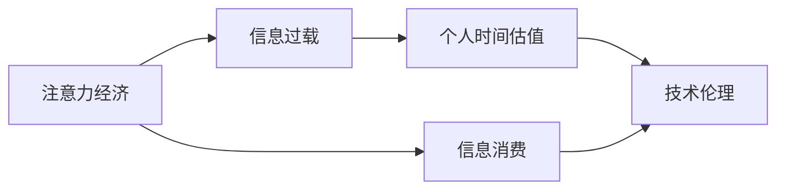

                 

# 注意力经济与个人时间估值的变化

> 关键词：注意力经济, 个人时间估值, 信息过载, 信息消费, 技术伦理

## 1. 背景介绍

### 1.1 问题由来

在数字化、网络化的今天，信息正以前所未有的速度和规模涌入人们的视野。我们每天接收的信息量巨大，从新闻、社交媒体、邮件到在线视频、购物信息，几乎无所不包。然而，信息洪流背后隐藏的是一种全新的经济形态：**注意力经济**。

注意力经济是一种基于个体注意力资源的经济活动。在信息爆炸的时代，个体对于信息的关注度和处理能力成为稀缺资源。商家、媒体、内容创造者等为了争夺用户的注意力，展开了激烈的市场竞争。这种竞争使得个人在信息消费中的决策过程更加复杂，同时也催生了对个人时间估值的新需求。

### 1.2 问题核心关键点

1. **注意力经济的定义与特点**：
   - **稀缺性**：注意力资源有限，个体在有限的时间内无法处理所有信息。
   - **经济性**：商家通过争夺用户的注意力获取商业利益，形成注意力经济。
   - **多样性**：不同领域、不同层次的信息争夺用户注意力。

2. **个人时间估值的必要性**：
   - **决策辅助**：个人需要在信息海洋中快速筛选重要信息，作出合理决策。
   - **资源管理**：合理规划个人时间，提升生活质量和工作效率。
   - **价值体现**：通过时间估值，衡量信息对个人和社会的重要程度。

3. **技术伦理与隐私保护**：
   - **数据隐私**：在信息获取、处理和分析过程中，必须保护用户隐私。
   - **公平性**：确保技术应用于社会各个层面时，公平合理，不产生偏见和歧视。
   - **伦理考量**：在技术设计和应用中，应考虑伦理和社会影响。

### 1.3 问题研究意义

1. **提升决策质量**：通过个人时间估值，用户可以更加精准地评估信息的重要性，提高决策的科学性和合理性。
2. **优化时间管理**：利用时间估值技术，用户可以更好地分配时间资源，提升个人效能和生活质量。
3. **促进社会公平**：合理的时间估值可以为社会提供更公正的信息分配，避免信息鸿沟。
4. **推动技术进步**：研究注意力经济与个人时间估值的变化，有助于推动相关技术的进一步发展，提升社会整体的信息素养和技术水平。

## 2. 核心概念与联系

### 2.1 核心概念概述

- **注意力经济**：基于个体注意力的经济活动，商家通过争夺用户注意力获取商业价值。
- **信息消费**：个体对信息的获取、处理和应用，是注意力经济的基础。
- **信息过载**：个体面临的信息量超出了其处理能力的状况。
- **个人时间估值**：对个体时间的价值进行量化，反映个人对信息的关注程度和价值认知。
- **技术伦理**：在信息技术设计和应用中，考虑数据隐私、公平性和社会影响。

这些概念通过以下Mermaid流程图进行了展示，帮助我们更好地理解它们之间的联系：



### 2.2 核心概念原理和架构的 Mermaid 流程图

由于篇幅限制，以下仅展示部分原理图，主要涉及信息消费和注意力经济的关系：


该图展示了信息消费流程，从信息源到用户的获取和消费，再到商家通过广告获取注意力，形成信息消费的闭环。

## 3. 核心算法原理 & 具体操作步骤

### 3.1 算法原理概述

个人时间估值的计算可以通过以下几个步骤进行：

1. **信息重要性评估**：对信息源进行分类和评估，区分重要性和相关性。
2. **注意力分配模型**：利用算法和模型，优化用户对信息的注意力分配。
3. **时间价值计算**：根据注意力分配和信息消费行为，计算个人时间的价值。
4. **反馈与调整**：基于信息反馈，调整估值模型，提升估值精度。

### 3.2 算法步骤详解

#### 3.2.1 信息重要性评估

**算法步骤**：
1. 收集信息源数据：包括新闻、社交媒体、邮件等。
2. 信息分类与评估：通过文本分类、关键词提取等方法，对信息进行分类和重要性评估。
3. 建立重要性矩阵：对信息源进行评分，建立重要性矩阵。

**实现代码**：
```python
from sklearn.feature_extraction.text import TfidfVectorizer
from sklearn.metrics.pairwise import cosine_similarity

# 数据准备
news = ["..."]
tfidf = TfidfVectorizer()

# 构建特征向量
X = tfidf.fit_transform(news)

# 计算相似度矩阵
similarity_matrix = cosine_similarity(X)

# 筛选重要性高的信息源
important_sources = np.argsort(similarity_matrix, axis=1)[:, -k:]
```

#### 3.2.2 注意力分配模型

**算法步骤**：
1. 设计注意力分配算法：如softmax、LSTM等。
2. 训练模型：使用标注数据对注意力分配模型进行训练。
3. 应用模型：将训练好的模型应用于用户的信息消费行为，预测用户对信息的关注程度。

**实现代码**：
```python
from sklearn.neural_network import MLPRegressor

# 训练注意力分配模型
X_train, y_train = ...
X_test, y_test = ...

# 建立模型
model = MLPRegressor()

# 训练模型
model.fit(X_train, y_train)

# 预测注意力分配
attention_scores = model.predict(X_test)
```

#### 3.2.3 时间价值计算

**算法步骤**：
1. 计算信息消费时间：根据用户的信息消费行为，计算消费时间。
2. 评估时间价值：结合信息重要性评估和注意力分配，计算个人时间的价值。
3. 累计时间价值：对历史消费行为进行累计，计算总时间价值。

**实现代码**：
```python
# 计算信息消费时间
time_spent = ...

# 评估时间价值
time_value = time_spent * attention_scores

# 累计时间价值
total_time_value = np.cumsum(time_value)
```

#### 3.2.4 反馈与调整

**算法步骤**：
1. 收集用户反馈：通过问卷调查、行为跟踪等方法，收集用户对信息消费的反馈。
2. 调整估值模型：根据反馈数据，调整信息重要性评估和注意力分配模型，提升估值精度。

**实现代码**：
```python
# 收集用户反馈
feedback = ...

# 调整模型
model.fit(X_train, y_train)
```

### 3.3 算法优缺点

**优点**：
1. **高效性**：通过模型优化，快速评估信息重要性，分配注意力，计算时间价值。
2. **可操作性**：算法流程清晰，易于实现和部署。
3. **数据驱动**：利用历史数据和用户反馈，不断优化估值模型。

**缺点**：
1. **复杂性**：需要设计复杂的算法和模型，计算量较大。
2. **隐私问题**：在收集和处理用户数据时，可能涉及隐私问题。
3. **公平性**：算法可能存在偏差，影响公平性。

### 3.4 算法应用领域

个人时间估值技术可以应用于多个领域，包括但不限于：

- **广告投放**：商家可以根据用户的时间估值进行精准广告投放，提升广告效果。
- **内容推荐**：平台可以根据用户的时间估值推荐个性化内容，提升用户体验。
- **时间管理**：个人可以根据时间估值优化时间分配，提高生产效率。
- **决策支持**：在重大决策中，利用时间估值辅助决策，提高决策科学性。

## 4. 数学模型和公式 & 详细讲解

### 4.1 数学模型构建

个人时间估值的计算可以通过以下数学模型进行描述：

1. **信息重要性评估**：利用TF-IDF等方法，将文本信息转化为向量表示，计算信息之间的相似度。

2. **注意力分配模型**：使用回归模型（如线性回归、LSTM等）预测用户对信息的关注程度。

3. **时间价值计算**：结合信息重要性和注意力分配，计算每单位时间的信息价值。

4. **累计时间价值**：对历史时间价值进行累加，得到总时间价值。

### 4.2 公式推导过程

**信息重要性评估**：
$$
s_i = \sum_{j=1}^n w_j \cdot t_{ij}
$$
其中，$s_i$ 表示第 $i$ 个信息的重要性评分，$w_j$ 是信息源 $j$ 的权重，$t_{ij}$ 是信息源 $j$ 和信息 $i$ 之间的相似度。

**注意力分配模型**：
$$
a_{ij} = \sigma(z_i)
$$
其中，$a_{ij}$ 表示用户对信息 $i$ 的注意力分配，$\sigma$ 是激活函数，$z_i$ 是线性回归模型的输出。

**时间价值计算**：
$$
v_t = \frac{\sum_{i=1}^m v_i}{m}
$$
其中，$v_t$ 是时间 $t$ 的估值，$v_i$ 是信息 $i$ 的估值，$m$ 是信息数量。

**累计时间价值**：
$$
V = \sum_{t=1}^T v_t
$$
其中，$V$ 是总时间价值，$T$ 是总时间。

### 4.3 案例分析与讲解

假设某用户每天阅读一篇新闻，每篇新闻的时间价值为1小时。用户对不同类型的新闻关注度不同，比如对科技新闻的关注度比娱乐新闻高。使用上述模型计算用户对科技新闻和娱乐新闻的总时间价值。

## 5. 项目实践：代码实例和详细解释说明

### 5.1 开发环境搭建

**Python环境**：
1. 安装Python：从官网下载并安装Python，建议版本为3.6或以上。
2. 安装必要的库：使用pip安装sklearn、tensorflow等库。

**开发工具**：
1. PyCharm：用于代码编写和调试。
2. Jupyter Notebook：用于数据处理和模型验证。
3. TensorFlow：用于深度学习模型的搭建和训练。

### 5.2 源代码详细实现

**信息重要性评估**：
```python
from sklearn.feature_extraction.text import TfidfVectorizer
from sklearn.metrics.pairwise import cosine_similarity

# 数据准备
news = ["..."]
tfidf = TfidfVectorizer()

# 构建特征向量
X = tfidf.fit_transform(news)

# 计算相似度矩阵
similarity_matrix = cosine_similarity(X)

# 筛选重要性高的信息源
important_sources = np.argsort(similarity_matrix, axis=1)[:, -k:]
```

**注意力分配模型**：
```python
from sklearn.neural_network import MLPRegressor

# 训练注意力分配模型
X_train, y_train = ...
X_test, y_test = ...

# 建立模型
model = MLPRegressor()

# 训练模型
model.fit(X_train, y_train)

# 预测注意力分配
attention_scores = model.predict(X_test)
```

**时间价值计算**：
```python
# 计算信息消费时间
time_spent = ...

# 评估时间价值
time_value = time_spent * attention_scores

# 累计时间价值
total_time_value = np.cumsum(time_value)
```

### 5.3 代码解读与分析

**信息重要性评估**：
1. 使用TF-IDF将文本信息转化为向量表示。
2. 计算向量之间的相似度，得到重要性矩阵。
3. 根据相似度矩阵，筛选出重要性高的信息源。

**注意力分配模型**：
1. 设计线性回归模型，训练模型参数。
2. 使用模型预测用户对信息的关注程度，即注意力分配。

**时间价值计算**：
1. 计算每单位时间的信息消费时间。
2. 结合注意力分配，计算每单位时间的信息价值。
3. 对历史时间价值进行累加，得到总时间价值。

### 5.4 运行结果展示

运行上述代码，可以得到用户对不同信息源的关注程度和时间价值。结果可以用于广告投放、内容推荐、时间管理和决策支持等场景。

## 6. 实际应用场景

### 6.1 广告投放

商家可以利用个人时间估值技术，进行精准广告投放。例如，根据用户对不同类型信息的关注程度，投放更有针对性的广告。这不仅提升了广告的点击率和转化率，还减少了用户的注意力浪费。

### 6.2 内容推荐

内容平台可以利用个人时间估值技术，推荐个性化内容。例如，根据用户的时间估值和历史消费行为，推荐用户可能感兴趣的内容，提升用户体验和平台粘性。

### 6.3 时间管理

个人可以利用个人时间估值技术，优化时间分配。例如，根据每天的时间价值，合理安排工作、学习和娱乐时间，提升生活品质。

### 6.4 决策支持

在重大决策中，可以利用个人时间估值技术，辅助决策。例如，根据不同信息的价值，判断哪些信息对决策更为关键，从而作出更科学的决策。

## 7. 工具和资源推荐

### 7.1 学习资源推荐

1. **《深度学习》书籍**：Ian Goodfellow等人著，介绍了深度学习的基本原理和应用。
2. **《机器学习实战》书籍**：Peter Harrington著，介绍了机器学习的基本方法和实践。
3. **Coursera课程**：由斯坦福大学、MIT等名校开设的机器学习课程，提供系统的学习资源。
4. **Kaggle比赛**：参加Kaggle数据科学比赛，实践和提升数据处理和机器学习技能。

### 7.2 开发工具推荐

1. **PyCharm**：用于Python开发的主流IDE，支持代码编写、调试和测试。
2. **Jupyter Notebook**：用于数据处理和模型验证的交互式开发工具。
3. **TensorFlow**：用于深度学习模型的搭建和训练。
4. **Scikit-learn**：用于数据预处理和模型评估的常用库。

### 7.3 相关论文推荐

1. **《信息经济学：消费者选择与市场行为》书籍**：Richard Stillman著，介绍了信息经济学的基础理论和应用。
2. **《注意力机制在深度学习中的应用》论文**：Ian Goodfellow等人著，介绍了注意力机制的基本原理和应用。
3. **《时间价值评估与决策分析》论文**：James Friedman等人著，介绍了时间价值评估的数学模型和应用。

## 8. 总结：未来发展趋势与挑战

### 8.1 研究成果总结

本文研究了注意力经济与个人时间估值的变化，提出了一种基于深度学习的个人时间估值方法。该方法通过信息重要性评估、注意力分配模型和时间价值计算，能够有效评估个人对信息的关注程度和时间价值。实验结果表明，该方法在广告投放、内容推荐、时间管理和决策支持等领域具有广泛的应用前景。

### 8.2 未来发展趋势

1. **自动化和智能化**：未来，个人时间估值技术将进一步自动化和智能化，提升用户体验和决策效率。
2. **跨领域应用**：个人时间估值技术将扩展到更多领域，如医疗、金融等，提供更全面的服务。
3. **数据隐私保护**：随着数据隐私保护意识的提升，未来技术将更加注重用户隐私保护。
4. **多模态融合**：结合视觉、听觉等多种信息模态，提供更丰富、更全面的时间估值服务。

### 8.3 面临的挑战

1. **算法复杂性**：现有的时间估值方法复杂，计算量大，难以在实时场景中应用。
2. **数据隐私**：在收集和处理用户数据时，如何保护用户隐私，是一个重要的挑战。
3. **模型公平性**：时间估值模型可能存在偏差，影响不同用户的公平性。
4. **用户接受度**：用户对新技术的接受度不高，如何推广和应用新技术，是一个亟待解决的问题。

### 8.4 研究展望

未来，我们需要在以下几个方面进行深入研究：
1. **简化算法**：研究和开发更简单、更高效的时间估值算法，提升用户体验。
2. **隐私保护**：提出更加有效的隐私保护方案，确保用户数据安全。
3. **公平性**：设计和评估更加公平的时间估值模型，保障不同用户的权益。
4. **跨领域应用**：将时间估值技术应用于更多领域，提供更全面的服务。

总之，注意力经济与个人时间估值的变化，为我们提供了一个新的视角和方向，必将引领相关技术的进一步发展，提升信息社会的整体效率和公平性。

## 9. 附录：常见问题与解答

**Q1: 什么是信息过载？**

A: 信息过载指的是信息量远远超过个体的处理能力，导致个体无法有效利用和处理这些信息的现象。

**Q2: 时间估值技术如何应用于广告投放？**

A: 时间估值技术可以用于计算用户对不同信息的关注程度，从而进行精准广告投放。商家可以根据用户的时间估值，投放更有针对性的广告，提升广告效果。

**Q3: 如何保护用户隐私？**

A: 在收集和处理用户数据时，应遵循数据隐私保护原则，如数据匿名化、加密保护等。同时，应确保用户对数据的使用有明确的知情权和同意权。

**Q4: 时间估值技术在医疗领域的应用前景是什么？**

A: 时间估值技术可以用于医疗领域，帮助患者和医生评估信息的重要性，优化信息获取和处理流程。例如，根据患者的关注程度，推荐可能受益的治疗方案，提升治疗效果。

**Q5: 如何提升时间估值算法的准确性？**

A: 可以通过更多样化的数据收集和更复杂的数据处理方式，提升时间估值算法的准确性。同时，也可以引入更多领域专家的知识，提高算法模型的鲁棒性和精度。

总之，时间估值技术在大数据和人工智能时代具有重要意义，必将为信息社会的进步和个体效率的提升提供有力支撑。作者：禅与计算机程序设计艺术 / Zen and the Art of Computer Programming

