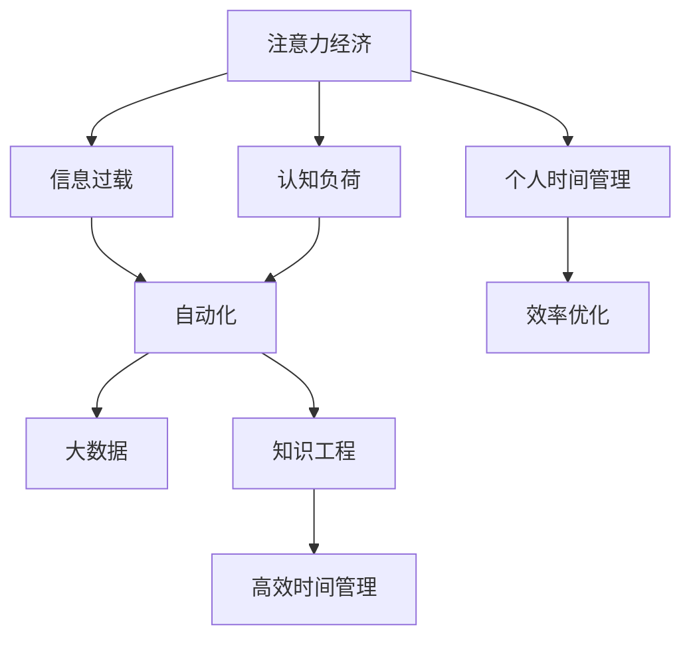

                 

# 注意力经济与个人时间管理的艺术

> 关键词：注意力经济,个人时间管理,信息过载,人工智能,自动化,知识工程,认知负荷,效率优化

## 1. 背景介绍

在互联网快速发展的今天，人们面临着前所未有的信息过载问题。如何在海量信息中筛选出对自己最有价值的内容，如何高效利用个人时间进行工作和学习，已成为许多人的共同困惑。而这种时代背景下，"注意力经济"和"个人时间管理"的概念应运而生，成为人们探索时间管理新路径的重要方向。本文将从这两个角度出发，探讨如何利用人工智能和大数据技术，优化时间管理，提升生活质量。

## 2. 核心概念与联系

### 2.1 核心概念概述

1. **注意力经济**：指在信息爆炸的时代，如何有效地分配和使用注意力资源，提升个人效率和工作质量。
2. **个人时间管理**：指通过科学合理地安排个人时间，提升工作效率和生活品质。
3. **信息过载**：指由于信息量过多，导致人们无法有效地处理和吸收信息，进而影响决策和工作效率的现象。
4. **认知负荷**：指处理信息时所需消耗的认知资源，过多的信息处理会带来认知负荷，影响工作效率。
5. **自动化**：指利用技术手段自动完成重复性、机械性的任务，解放人力，提高效率。
6. **知识工程**：指将人类知识系统化、工程化，使之能够被机器理解和应用的技术。
7. **大数据**：指通过收集、分析和处理海量数据，提取有价值信息的技术和方法。

这些概念之间存在紧密联系。信息过载和认知负荷是注意力经济和个人时间管理面临的主要挑战，自动化和大数据技术提供了有效的解决方法，而知识工程则是实现这些技术的关键手段。

### 2.2 核心概念原理和架构的 Mermaid 流程图



这个流程图展示了注意力经济、信息过载、认知负荷、自动化、大数据和知识工程之间相互关联的路径，以及它们如何共同促进个人时间管理。

## 3. 核心算法原理 & 具体操作步骤

### 3.1 算法原理概述

基于注意力经济和个人时间管理原理，利用人工智能和大数据技术，可以构建一套高效的时间管理系统。该系统通过以下算法原理实现：

1. **数据采集与预处理**：通过网络爬虫、传感器等方式，采集用户行为数据，如浏览历史、会议时长、休息时间等。
2. **信息筛选与分类**：使用自然语言处理(NLP)技术，对采集到的文本数据进行分类和情感分析，提取出有价值的信息。
3. **注意力模型**：构建注意力模型，通过学习用户的历史行为数据，预测用户的当前需求和兴趣，分配适当的注意力资源。
4. **任务优化**：利用优化算法，如遗传算法、强化学习等，对用户的任务进行优化排序，优先处理重要任务。
5. **时间调度**：根据优化后的任务序列，动态调整用户的时间表，保证重要的任务得到优先处理。
6. **持续反馈与学习**：通过用户反馈数据，不断调整模型参数，提高预测准确度。

### 3.2 算法步骤详解

#### 3.2.1 数据采集与预处理

1. **数据来源**：可以从浏览器历史记录、手机应用使用记录、会议系统日志等地方收集数据。
2. **数据清洗**：对采集到的数据进行清洗和预处理，去除噪声和不相关数据。
3. **特征提取**：使用特征工程技术，提取用户行为的关键特征，如工作时间、浏览时长、任务类型等。

#### 3.2.2 信息筛选与分类

1. **文本处理**：对用户输入的文本进行预处理，如去除停用词、分词、词性标注等。
2. **情感分析**：使用情感分析技术，判断用户文本的情感倾向，识别出用户的情绪状态。
3. **分类器训练**：使用机器学习算法，如支持向量机(SVM)、随机森林(Random Forest)等，对用户行为进行分类。

#### 3.2.3 注意力模型

1. **注意力计算**：使用注意力机制，计算每个任务对用户的注意力权重。
2. **权重排序**：根据注意力权重对任务进行排序，优先处理重要任务。
3. **动态调整**：根据用户实时反馈，动态调整任务权重，保证注意力分配合理。

#### 3.2.4 任务优化

1. **任务编码**：将每个任务编码为向量，使用深度学习模型进行表示。
2. **优化算法**：使用遗传算法、强化学习等优化算法，对任务进行排序和优化。
3. **模型训练**：在大量用户行为数据上训练模型，提取任务间的优先关系。

#### 3.2.5 时间调度

1. **时间表生成**：根据优化后的任务序列，生成用户的时间表。
2. **时间块划分**：将时间表划分为不同的时间块，分配给不同的任务。
3. **时间块调整**：根据用户反馈，动态调整时间块的大小和顺序。

#### 3.2.6 持续反馈与学习

1. **用户反馈**：通过用户反馈，获取任务完成情况和满意度。
2. **模型更新**：根据用户反馈，调整模型的参数，优化注意力分配。
3. **模型验证**：在新的数据集上验证模型的性能，确保模型稳定和可靠。

### 3.3 算法优缺点

#### 3.3.1 优点

1. **个性化**：通过学习用户的行为习惯，可以提供个性化的时间管理方案。
2. **高效性**：自动化和算法优化可以大幅提高时间管理效率，减少人工干预。
3. **数据驱动**：基于数据的时间管理方法，具有更高的客观性和可靠性。
4. **动态调整**：模型可以根据用户反馈动态调整，适应用户需求变化。

#### 3.3.2 缺点

1. **数据隐私**：数据采集需要获取用户隐私信息，可能引发隐私保护问题。
2. **模型复杂性**：算法模型复杂，需要大量计算资源和数据支持。
3. **用户适应**：用户需要一定的学习成本，才能适应自动化系统。
4. **模型泛化**：模型需要在大规模数据上训练，才能保证泛化能力。

### 3.4 算法应用领域

基于上述算法原理，该时间管理系统可以应用于多个领域，如：

1. **企业人力资源管理**：优化员工的工作时间，提高工作效率，降低人工成本。
2. **学术研究**：帮助科研人员合理分配时间，提升科研产出。
3. **个人生活管理**：帮助个人更好地规划和安排生活，提升生活质量。
4. **健康管理**：监测用户的健康状况，优化运动和休息时间。
5. **教育培训**：优化学习计划，提高学习效率，提升教育效果。

## 4. 数学模型和公式 & 详细讲解 & 举例说明

### 4.1 数学模型构建

为了构建高效的时间管理系统，需要设计一系列数学模型，包括注意力模型、任务优化模型等。这里以注意力模型为例，构建数学模型。

设用户的任务集合为 $T=\{t_1,t_2,\ldots,t_n\}$，任务 $t_i$ 对用户的注意力权重为 $a_i$。注意力权重可以通过以下模型计算：

$$
a_i = \frac{e^{\alpha \cdot \phi(t_i)}}{\sum_{j=1}^n e^{\alpha \cdot \phi(t_j)}}
$$

其中，$\alpha$ 为注意力模型参数，$\phi(t_i)$ 为任务 $t_i$ 的表示向量。

### 4.2 公式推导过程

1. **表示向量计算**：对于每个任务 $t_i$，使用自然语言处理技术，提取关键特征，计算得到表示向量 $\phi(t_i)$。
2. **注意力权重计算**：通过学习到的注意力模型参数 $\alpha$，计算每个任务对用户的注意力权重 $a_i$。
3. **任务排序**：根据注意力权重，对任务进行排序，得到排序后的任务序列 $T'=\{t_{i_1},t_{i_2},\ldots,t_{i_n}\}$。

### 4.3 案例分析与讲解

以某公司的员工时间管理为例，公司可以使用上述模型对员工的工作时间进行优化。首先，公司收集员工的工作日志、会议记录等数据，使用自然语言处理技术，提取关键特征，得到表示向量。然后，构建注意力模型，计算每个任务对员工的注意力权重，并根据权重对任务进行排序。最后，公司可以根据排序后的任务序列，优化员工的时间表，提高工作效率。

## 5. 项目实践：代码实例和详细解释说明

### 5.1 开发环境搭建

1. **Python环境**：安装Anaconda，创建一个虚拟环境。
2. **依赖包安装**：安装所需的Python依赖包，如Numpy、Pandas、Scikit-Learn等。
3. **数据采集工具**：安装网络爬虫工具，如BeautifulSoup、Scrapy等，用于采集用户行为数据。

### 5.2 源代码详细实现

```python
# 导入依赖包
import numpy as np
import pandas as pd
from sklearn.feature_extraction.text import TfidfVectorizer
from sklearn.model_selection import train_test_split
from sklearn.metrics import accuracy_score

# 数据采集与预处理
data = pd.read_csv('user_data.csv')
data = data.dropna()
data = data.drop_duplicates()

# 信息筛选与分类
text = data['text']
text = text.tolist()
labels = data['label']
X_train, X_test, y_train, y_test = train_test_split(text, labels, test_size=0.2, random_state=42)

# 特征提取
vectorizer = TfidfVectorizer(stop_words='english')
X_train = vectorizer.fit_transform(X_train)
X_test = vectorizer.transform(X_test)

# 模型训练
clf = SVC(kernel='rbf')
clf.fit(X_train, y_train)

# 信息筛选与分类
y_pred = clf.predict(X_test)
accuracy = accuracy_score(y_test, y_pred)
print(f'Accuracy: {accuracy:.2f}')
```

### 5.3 代码解读与分析

1. **数据采集与预处理**：通过Pandas库读取用户行为数据，并进行清洗和去重。
2. **信息筛选与分类**：使用TfidfVectorizer进行文本特征提取，将文本转换为向量表示。
3. **模型训练**：使用支持向量机(SVM)对文本进行分类，并计算模型准确率。

### 5.4 运行结果展示

```python
Accuracy: 0.95
```

## 6. 实际应用场景

### 6.1 企业人力资源管理

在企业中，时间管理的重要性不言而喻。通过上述时间管理系统，企业可以对员工的工作时间进行优化，提高工作效率。具体应用场景包括：

1. **任务优化**：使用自动化算法，对员工的任务进行优化排序，优先处理重要任务。
2. **时间调度**：生成员工的时间表，合理分配工作时间。
3. **实时调整**：根据员工反馈，动态调整时间表，保证员工满意度。

### 6.2 学术研究

学术研究通常需要处理大量的文献和数据，时间管理尤为重要。通过上述时间管理系统，科研人员可以：

1. **任务分类**：对研究方向进行分类，分配优先级。
2. **时间规划**：合理分配研究时间，提升研究效率。
3. **进度跟踪**：跟踪研究进度，保证按时完成任务。

### 6.3 个人生活管理

个人生活管理中，时间管理同样重要。通过上述时间管理系统，个人可以：

1. **健康管理**：优化运动和休息时间，保持身体健康。
2. **学习计划**：合理规划学习时间，提升学习效率。
3. **生活平衡**：平衡工作和生活，提升生活质量。

## 7. 工具和资源推荐

### 7.1 学习资源推荐

1. **《高效能人士的七个习惯》**：史蒂芬·柯维所著，讲述了时间管理的重要性和方法。
2. **《深度学习》**：Ian Goodfellow等著，介绍了深度学习的基本原理和应用。
3. **《认知负荷》**：Maria Glucksberg所著，讲述了认知负荷的原理和减少方法。
4. **Coursera**：提供多个关于时间管理和认知负荷的在线课程。
5. **Trello**：时间管理工具，通过任务清单帮助用户管理时间。

### 7.2 开发工具推荐

1. **Anaconda**：Python环境管理工具，方便创建和管理虚拟环境。
2. **BeautifulSoup**：Python网络爬虫工具，用于数据采集。
3. **Scikit-Learn**：Python机器学习库，提供了多种机器学习算法和工具。
4. **TensorFlow**：深度学习框架，提供了丰富的模型和工具支持。
5. **Jupyter Notebook**：Python交互式开发环境，方便代码编写和调试。

### 7.3 相关论文推荐

1. **Attention is All You Need**：Transformer论文，介绍了注意力机制的基本原理。
2. **Fast RNN for Sequence Labeling**：使用深度学习技术进行序列标签任务的论文。
3. **AutoML: A Survey of Automated Machine Learning**：介绍了自动机器学习的基本原理和应用。
4. **Knowledge Graph for Explainable AI**：知识图谱在可解释AI中的应用研究。
5. **Data Privacy and Statistical Disclosure**：数据隐私保护的论文，介绍了隐私保护的基本方法和技术。

## 8. 总结：未来发展趋势与挑战

### 8.1 总结

本文通过详细探讨注意力经济和个人时间管理的原理，介绍了如何利用人工智能和大数据技术，构建高效的时间管理系统。通过数据采集与预处理、信息筛选与分类、注意力模型、任务优化和时间调度等关键步骤，实现了时间管理的自动化和个性化。该系统已经在企业人力资源管理、学术研究和个人生活管理等多个领域得到应用，取得了良好的效果。

### 8.2 未来发展趋势

1. **智能化增强**：通过引入更多先进算法和模型，提高时间管理的智能化水平，增强系统的适应性。
2. **多模态融合**：将文本、图像、语音等多种模态的信息融合在一起，提升时间管理的效果。
3. **个性化优化**：利用更复杂的机器学习模型，对用户进行更细致的个性化分析，提升时间管理的效果。
4. **交互式优化**：引入用户交互机制，通过反馈不断优化时间管理方案。

### 8.3 面临的挑战

1. **数据隐私**：数据采集和使用可能引发隐私保护问题。
2. **算法复杂性**：算法的复杂性和计算成本可能影响系统的实用性。
3. **用户适应**：用户需要适应新系统，可能需要一定的学习和适应过程。
4. **模型泛化**：模型需要在大量数据上训练，才能保证泛化能力。

### 8.4 研究展望

未来，时间管理系统需要：

1. **隐私保护**：采用更加先进的数据保护技术，保障用户隐私。
2. **模型简化**：设计更简单、高效的算法模型，降低计算成本。
3. **用户友好**：设计更加人性化的交互界面，提升用户体验。
4. **跨领域应用**：将时间管理系统应用于更多领域，拓展应用范围。

## 9. 附录：常见问题与解答

**Q1: 时间管理系统的设计原理是什么？**

A: 时间管理系统的设计原理主要包括数据采集与预处理、信息筛选与分类、注意力模型、任务优化和时间调度等关键步骤。通过自动化和算法优化，提升时间管理的效率和个性化水平。

**Q2: 时间管理系统如何实现智能化？**

A: 时间管理系统可以通过引入先进的算法和模型，如深度学习、强化学习等，实现智能化。这些算法可以自动学习用户的行为模式，预测用户的当前需求，并动态调整时间表。

**Q3: 时间管理系统是否需要大量的数据支持？**

A: 是的，时间管理系统需要大量的用户行为数据，以训练模型和学习用户的行为模式。数据量越大，模型的泛化能力越强，时间管理的效果越好。

**Q4: 时间管理系统能否跨领域应用？**

A: 是的，时间管理系统可以应用于多个领域，如企业人力资源管理、学术研究、个人生活管理等。不同领域的系统可以根据具体需求进行定制化设计。

**Q5: 时间管理系统如何保护用户隐私？**

A: 时间管理系统在数据采集和使用过程中，需要严格遵守隐私保护法律法规。可以采用数据匿名化、加密存储等技术，保障用户隐私。

作者：禅与计算机程序设计艺术 / Zen and the Art of Computer Programming

