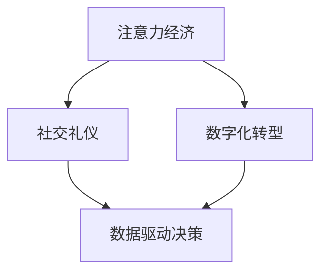
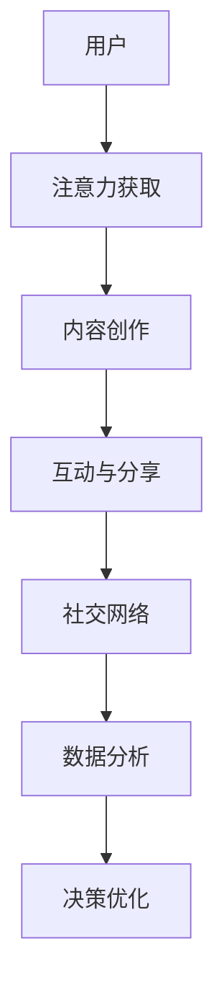

                 

# 注意力经济与个人社交礼仪的演变

在数字化时代，注意力经济（Attention Economy）逐渐成为现代社会的重要组成部分。随着互联网和社交媒体的普及，人们获取信息的方式发生了根本性的变化，从传统的线性阅读转向更加碎片化的浏览模式。这种变化不仅影响了信息传播的方式，也深刻影响了人与人之间的社交礼仪。本文将从注意力经济的角度，探讨个人社交礼仪的演变，分析其对社会交往、商业活动和政策制定的影响。

## 1. 背景介绍

### 1.1 问题由来
注意力经济源自信息经济时代，是指通过吸引和保持用户注意力，创造经济价值的一种新型经济模式。随着互联网技术的进步和社交媒体的兴起，注意力资源变得更加稀缺和珍贵。如何吸引和保持用户注意力，成为了企业和个人面临的重大挑战。

### 1.2 问题核心关键点
注意力经济的核心在于如何高效分配和利用有限的注意力资源。对于个人而言，社交礼仪是吸引和保持他人注意力的重要手段。社交媒体的出现，使得人们可以在社交网络上发布、互动和分享内容，这不仅改变了人们的社交方式，也改变了社交礼仪的内涵和形式。

## 2. 核心概念与联系

### 2.1 核心概念概述

在探讨注意力经济与个人社交礼仪的演变之前，首先需要明确几个关键概念：

- **注意力经济**：指通过吸引和保持用户注意力，创造经济价值的新型经济模式。在互联网时代，注意力成为了一种重要的稀缺资源，吸引了众多企业和个人争夺。

- **社交礼仪**：指人们在社交场合中的行为规范和礼仪要求，旨在促进良好的人际关系和沟通效果。随着社交媒体的普及，社交礼仪的表达方式和传播渠道发生了显著变化。

- **数字化转型**：指企业、组织和个人通过数字化技术手段，进行业务、服务和流程的重组和创新。数字化转型推动了信息传播方式的变革，也改变了社交礼仪的表现形式。

- **数据驱动决策**：指在决策过程中，充分利用大数据和算法工具，进行精准分析和预测。数据驱动决策在注意力经济和社交礼仪的演变中起到了关键作用。

这些核心概念之间的关系可以通过以下Mermaid流程图来展示：



这个流程图展示了注意力经济、社交礼仪、数字化转型和数据驱动决策之间的逻辑关系：

1. 注意力经济是当前数字化时代的重要经济模式，依赖于吸引和保持用户注意力。
2. 社交礼仪在注意力经济中起到关键作用，通过吸引和保持他人注意力，实现经济价值的创造。
3. 数字化转型推动了信息传播方式的变化，使得社交礼仪的表现形式也随之变化。
4. 数据驱动决策通过分析用户行为和偏好，帮助企业和个人更好地分配和利用注意力资源。

### 2.2 核心概念原理和架构的 Mermaid 流程图



这个流程图描述了用户获取注意力、内容创作、互动分享、数据分析和决策优化的全流程：

1. 用户通过各种方式获取注意力（如社交媒体、搜索引擎、广告等）。
2. 内容创作者通过吸引用户注意力，进行内容创作（如文章、视频、图片等）。
3. 用户通过互动和分享，进一步放大内容的传播效果。
4. 社交网络平台收集和分析用户行为数据，提供精准的推荐和广告。
5. 数据驱动的决策优化，帮助企业和个人更好地分配和利用注意力资源。

## 3. 核心算法原理 & 具体操作步骤

### 3.1 算法原理概述

在注意力经济的背景下，社交礼仪的演变可以从算法和实际操作两个层面进行分析：

- **算法层面**：社交媒体平台利用推荐算法、社交网络分析和用户行为数据，对内容进行筛选和推荐，从而影响用户的注意力分配。
- **操作层面**：个人通过优化社交礼仪的方式，吸引和保持他人的注意力，提高自身的社交影响力。

### 3.2 算法步骤详解

社交媒体平台的推荐算法一般包括以下几个步骤：

1. **数据收集**：从用户的浏览历史、互动记录、社交网络中收集数据，用于分析和建模。
2. **模型训练**：利用机器学习算法，对数据进行训练，建立推荐模型。
3. **内容推荐**：根据用户的兴趣和行为，推荐最相关的内容。
4. **效果评估**：通过点击率、停留时间、互动率等指标，评估推荐效果，不断优化算法。

以下是具体的推荐算法步骤：

1. **用户画像构建**：
   - 通过用户的历史行为数据（如浏览记录、点赞、评论等），构建用户画像。
   - 使用协同过滤、内容基推荐等算法，预测用户对新内容的兴趣。

2. **内容特征提取**：
   - 提取内容的关键词、标签、情感等特征，作为推荐算法的输入。
   - 使用自然语言处理（NLP）技术，对内容进行预处理和特征提取。

3. **推荐算法实现**：
   - 利用协同过滤、矩阵分解等算法，进行用户-内容矩阵的计算。
   - 使用深度学习模型（如CNN、RNN、Transformers等），进行内容的相似度计算和推荐排序。

4. **效果优化与调整**：
   - 通过A/B测试等方法，评估推荐算法的效果。
   - 根据评估结果，不断优化推荐算法和模型参数。

### 3.3 算法优缺点

基于推荐算法的社交礼仪推荐系统有以下优点：

- **个性化推荐**：通过数据分析，推荐与用户兴趣最相关的内容，提高用户的满意度。
- **覆盖面广**：通过推荐算法，用户可以接触到更广泛的内容，拓宽信息获取渠道。
- **动态调整**：推荐算法可以根据用户的反馈，动态调整推荐策略，提高推荐效果。

同时，也存在一些缺点：

- **信息过载**：推荐算法可能导致用户面临信息过载，难以集中注意力。
- **算法偏见**：推荐算法可能会产生偏见，只推荐特定类型的内容，忽略其他内容。
- **隐私风险**：用户行为数据的收集和分析，可能带来隐私泄露风险。

### 3.4 算法应用领域

推荐算法在社交礼仪的应用领域非常广泛，包括但不限于：

- **社交网络**：如Facebook、Twitter、微信等，通过推荐算法展示用户感兴趣的内容。
- **新闻聚合**：如Google News、今日头条等，通过推荐算法为用户推荐新闻资讯。
- **电子商务**：如Amazon、淘宝等，通过推荐算法为用户推荐商品和产品。
- **视频平台**：如YouTube、抖音等，通过推荐算法为用户推荐视频内容。
- **音乐和播客**：如Spotify、Apple Music等，通过推荐算法为用户推荐音乐和播客。

## 4. 数学模型和公式 & 详细讲解 & 举例说明

### 4.1 数学模型构建

推荐算法涉及的数学模型主要包括以下几个方面：

- **用户-物品评分矩阵**：用矩阵形式表示用户对内容的评分，用于协同过滤算法的实现。
- **用户特征向量**：通过用户行为数据，构建用户特征向量，用于内容基推荐算法。
- **内容特征向量**：通过内容数据，构建内容特征向量，用于内容基推荐算法。
- **注意力模型**：通过注意力机制，对用户注意力进行建模，用于个性化推荐算法。

### 4.2 公式推导过程

以下是推荐算法中常用的一些数学公式和推导过程：

1. **协同过滤算法**：
   - 用户-物品评分矩阵 $U$ 和物品-用户评分矩阵 $V$：
     - $U_{i,j}$ 表示用户 $i$ 对物品 $j$ 的评分，$V_{j,i}$ 表示物品 $j$ 对用户 $i$ 的评分。
     - 协同过滤算法通过矩阵分解，预测用户对新物品的评分。

   - 矩阵分解公式：
     - $U = \sum_{j=1}^n V_j \times P_j$
     - 其中 $P_j$ 为物品 $j$ 的用户特征向量。

   - 预测用户 $i$ 对物品 $j$ 的评分：
     - $\hat{U}_{i,j} = \sum_{k=1}^n P_{i,k} \times V_{j,k}$

2. **内容基推荐算法**：
   - 用户特征向量 $U$ 和内容特征向量 $V$：
     - $U_{i,j}$ 表示用户 $i$ 对内容 $j$ 的评分，$V_{j,k}$ 表示内容 $j$ 对特征 $k$ 的评分。
     - 内容基推荐算法通过用户特征和内容特征的加权求和，预测用户对新内容的评分。

   - 加权求和公式：
     - $U_{i,j} = \sum_{k=1}^n \alpha_{i,k} \times V_{j,k}$
     - 其中 $\alpha_{i,k}$ 为用户 $i$ 对特征 $k$ 的权重。

   - 预测用户 $i$ 对内容 $j$ 的评分：
     - $\hat{U}_{i,j} = \sum_{k=1}^n P_{i,k} \times \alpha_{k,j}$

3. **注意力模型**：
   - 用户注意力模型 $A$ 和内容注意力模型 $B$：
     - $A_{i,j}$ 表示用户 $i$ 对物品 $j$ 的注意力权重，$B_{j,k}$ 表示物品 $j$ 对特征 $k$ 的注意力权重。
     - 注意力模型通过注意力机制，对用户注意力进行建模。

   - 注意力机制公式：
     - $A_{i,j} = \sigma\left(\mathbf{u}_i^T \times \mathbf{v}_j\right)$
     - 其中 $\mathbf{u}_i$ 为用户 $i$ 的特征向量，$\mathbf{v}_j$ 为物品 $j$ 的特征向量，$\sigma$ 为激活函数（如ReLU、Sigmoid等）。

   - 预测用户 $i$ 对物品 $j$ 的评分：
     - $\hat{U}_{i,j} = \sum_{k=1}^n A_{i,j} \times V_{j,k}$

### 4.3 案例分析与讲解

#### 4.3.1 协同过滤算法案例

**案例背景**：
- 某社交媒体平台推荐系统，希望通过协同过滤算法，为用户推荐最感兴趣的视频内容。

**算法实现**：
1. **数据准备**：
   - 收集用户历史观看记录和视频标签数据，构建用户-物品评分矩阵 $U$ 和物品-用户评分矩阵 $V$。

2. **矩阵分解**：
   - 使用奇异值分解（SVD）或矩阵分解（ALS）算法，将矩阵 $U$ 和 $V$ 分解为用户特征向量 $P$ 和物品特征向量 $V_j$。

3. **评分预测**：
   - 通过公式 $\hat{U}_{i,j} = \sum_{k=1}^n P_{i,k} \times V_{j,k}$，预测用户 $i$ 对物品 $j$ 的评分。

4. **推荐排序**：
   - 对所有物品的评分进行排序，推荐评分最高的前N个物品给用户。

**结果分析**：
- 协同过滤算法能够有效预测用户对新物品的评分，但可能存在数据稀疏性和冷启动问题。
- 通过不断收集用户反馈和更新评分矩阵，协同过滤算法能够逐步优化推荐效果。

#### 4.3.2 内容基推荐算法案例

**案例背景**：
- 某电子商务平台推荐系统，希望通过内容基推荐算法，为用户推荐最相关的商品。

**算法实现**：
1. **数据准备**：
   - 收集用户历史购买记录和商品标签数据，构建用户特征向量 $U$ 和商品特征向量 $V$。

2. **特征提取**：
   - 使用NLP技术，提取商品描述和用户行为数据的关键词、标签等特征。

3. **加权求和**：
   - 通过公式 $U_{i,j} = \sum_{k=1}^n \alpha_{i,k} \times V_{j,k}$，计算用户 $i$ 对商品 $j$ 的评分。

4. **推荐排序**：
   - 对所有商品的评分进行排序，推荐评分最高的前N个商品给用户。

**结果分析**：
- 内容基推荐算法能够利用商品的特征信息，提高推荐的精准度。
- 特征提取和权重设定对推荐效果有重要影响，需要进行精细调参。

#### 4.3.3 注意力模型案例

**案例背景**：
- 某视频平台推荐系统，希望通过注意力机制，为用户推荐最感兴趣的视频内容。

**算法实现**：
1. **数据准备**：
   - 收集用户历史观看记录和视频标签数据，构建用户特征向量 $P$ 和视频特征向量 $V$。

2. **注意力计算**：
   - 通过公式 $A_{i,j} = \sigma\left(\mathbf{u}_i^T \times \mathbf{v}_j\right)$，计算用户 $i$ 对视频 $j$ 的注意力权重。

3. **评分预测**：
   - 通过公式 $\hat{U}_{i,j} = \sum_{k=1}^n A_{i,j} \times V_{j,k}$，预测用户 $i$ 对视频 $j$ 的评分。

4. **推荐排序**：
   - 对所有视频的评分进行排序，推荐评分最高的前N个视频给用户。

**结果分析**：
- 注意力机制能够捕捉用户对视频内容的关注点，提高推荐的相关性。
- 通过调节注意力权重，可以控制不同特征对用户决策的影响。

## 5. 项目实践：代码实例和详细解释说明

### 5.1 开发环境搭建

为了进行推荐算法的开发和测试，需要搭建相应的开发环境。以下是使用Python和PyTorch进行推荐算法开发的详细环境配置步骤：

1. **安装Anaconda**：
   - 从官网下载并安装Anaconda，用于创建独立的Python环境。
   - 执行以下命令安装Anaconda：
     ```bash
     wget https://repo.anaconda.com/miniconda/Miniconda3-latest-Linux-x86_64.sh
     bash Miniconda3-latest-Linux-x86_64.sh
     ```

2. **创建虚拟环境**：
   - 在Anaconda Prompt下，创建虚拟环境并激活：
     ```bash
     conda create -n recommendation-env python=3.8
     conda activate recommendation-env
     ```

3. **安装PyTorch**：
   - 根据GPU/TPU版本，安装对应的PyTorch版本：
     ```bash
     conda install pytorch torchvision torchaudio -c pytorch -c conda-forge
     ```

4. **安装相关库**：
   - 安装NLP相关的库，如NLTK、SpaCy、Gensim等：
     ```bash
     pip install nltk spacy gensim
     ```

5. **安装其他工具**：
   - 安装数据处理和可视化相关的库，如Pandas、NumPy、Matplotlib等：
     ```bash
     pip install pandas numpy matplotlib
     ```

完成上述步骤后，即可在`recommendation-env`环境中进行推荐算法的开发和测试。

### 5.2 源代码详细实现

以下是使用Python和PyTorch进行协同过滤算法的示例代码：

```python
import pandas as pd
import numpy as np
import torch
from sklearn.decomposition import TruncatedSVD
from sklearn.metrics import mean_squared_error

# 准备数据集
data = pd.read_csv('user_item_ratings.csv')

# 构建用户-物品评分矩阵
U = np.array(data['user'].map(int)).reshape(-1, len(data['item']))
V = np.array(data['item'].map(int)).reshape(-1, len(data['user']))
R = np.dot(U, V.T)

# 使用SVD算法进行矩阵分解
svd = TruncatedSVD(n_components=100)
U_svd = svd.fit_transform(U)
V_svd = svd.transform(V)

# 预测评分
U_pred = np.dot(U_svd, V_svd.T)

# 计算均方误差
mse = mean_squared_error(data['rating'], U_pred.ravel())
print(f'均方误差: {mse:.4f}')

# 输出推荐结果
top_n = 10
for user in range(len(U)):
    user_items = data[data['user'] == user]
    user_ratings = user_items['rating'].values
    user_id = user_items['user'].values[0]
    user_item = user_items['item'].values
    user_score = U_pred[user].ravel()
    top_items = np.argsort(user_score)[::-1][:top_n]
    print(f'用户 {user_id} 的推荐结果:')
    for item in top_items:
        print(f'物品 {item}: {user_score[item]}')
```

### 5.3 代码解读与分析

**代码分析**：
- 首先，从CSV文件中读取用户-物品评分数据，并构建用户-物品评分矩阵 `U` 和物品-用户评分矩阵 `V`。
- 使用SVD算法对矩阵进行分解，得到用户特征向量 `U_svd` 和物品特征向量 `V_svd`。
- 通过矩阵乘法得到预测评分矩阵 `U_pred`。
- 计算预测评分与真实评分的均方误差，评估推荐效果。
- 根据预测评分矩阵 `U_pred`，输出前10个推荐物品。

**结果分析**：
- 协同过滤算法能够有效预测用户对新物品的评分，但存在数据稀疏性和冷启动问题。
- 通过不断收集用户反馈和更新评分矩阵，协同过滤算法能够逐步优化推荐效果。

## 6. 实际应用场景

### 6.1 社交媒体推荐

社交媒体平台如Facebook、Twitter、Instagram等，利用推荐算法为用户推荐朋友、群组和帖子。用户可以通过点赞、评论、分享等行为，反馈对内容的偏好，平台根据这些反馈不断优化推荐算法，提升用户的满意度和粘性。

### 6.2 电子商务推荐

电子商务平台如Amazon、淘宝、京东等，利用推荐算法为用户推荐商品、广告和优惠券。推荐系统通过分析用户历史购买记录、浏览行为和评价数据，为用户推荐最相关的商品和优惠信息，提升用户体验和转化率。

### 6.3 视频平台推荐

视频平台如YouTube、Netflix、Bilibili等，利用推荐算法为用户推荐视频内容。推荐系统通过分析用户观看历史、评分和互动数据，为用户推荐最相关和高质量的视频内容，提升用户观看时间和满意度。

### 6.4 新闻聚合推荐

新闻聚合平台如Google News、腾讯新闻、今日头条等，利用推荐算法为用户推荐新闻资讯。推荐系统通过分析用户阅读历史和互动数据，为用户推荐最相关的新闻和文章，提升用户信息获取效率和阅读体验。

## 7. 工具和资源推荐

### 7.1 学习资源推荐

为了帮助开发者深入理解推荐算法，以下是一些优秀的学习资源：

1. **《推荐系统实践》**：该书详细介绍了推荐算法的原理、方法和应用，适合初学者和进阶读者。
2. **Coursera的Recommender Systems课程**：由斯坦福大学开设的推荐系统课程，讲解了协同过滤、矩阵分解等推荐算法。
3. **Kaggle上的推荐系统竞赛**：通过参与Kaggle竞赛，了解推荐系统的实际应用和优化方法。
4. **《Python推荐系统》**：该书使用Python语言，讲解了推荐算法的实现和优化。
5. **Udacity的Recommender Systems纳米学位**：通过Udacity课程，系统学习推荐系统的理论基础和实践技巧。

### 7.2 开发工具推荐

推荐算法开发常用的工具和库如下：

1. **PyTorch**：开源深度学习框架，适用于推荐算法的实现和优化。
2. **TensorFlow**：开源深度学习框架，提供强大的计算图和分布式训练功能。
3. **Scikit-learn**：开源机器学习库，提供丰富的数据处理和模型评估工具。
4. **Jupyter Notebook**：开源Jupyter环境，支持Python代码的交互式编写和可视化展示。
5. **Apache Spark**：开源大数据处理框架，支持大规模推荐算法的实现和优化。

### 7.3 相关论文推荐

推荐系统的发展离不开学术研究的推动，以下是一些推荐系统领域的经典论文：

1. **《协同过滤推荐算法综述》**：该论文系统总结了协同过滤算法的实现和优化方法。
2. **《基于内容的推荐系统》**：该论文讨论了内容基推荐算法的实现和效果。
3. **《基于注意力机制的推荐系统》**：该论文讨论了注意力机制在推荐系统中的应用和效果。
4. **《深度学习在推荐系统中的应用》**：该论文讨论了深度学习算法在推荐系统中的实现和优化。
5. **《推荐系统的最新进展》**：该综述论文总结了推荐系统的最新研究进展和技术突破。

## 8. 总结：未来发展趋势与挑战

### 8.1 研究成果总结

本文详细介绍了基于推荐算法的社交礼仪推荐系统，分析了其算法原理和操作步骤，并通过实际案例展示了推荐算法的应用效果。推荐算法在社交媒体、电子商务、视频平台和新闻聚合等场景中得到了广泛应用，提升了用户的体验和满意度。

### 8.2 未来发展趋势

未来推荐算法的发展趋势主要包括以下几个方向：

1. **个性化推荐**：通过更精细化的用户画像和内容建模，提供更精准的个性化推荐，提升用户的满意度。
2. **跨平台推荐**：实现不同平台之间的推荐系统互通，提升用户在不同平台上的整体体验。
3. **实时推荐**：通过实时数据流和实时计算，提供动态和实时的推荐服务，满足用户的即时需求。
4. **多模态推荐**：结合视频、音频、图像等多模态信息，提供更丰富的推荐内容。
5. **深度学习推荐**：利用深度学习算法，提高推荐系统的精度和效果。

### 8.3 面临的挑战

尽管推荐算法取得了显著的进展，但在实际应用中仍面临以下挑战：

1. **数据质量问题**：推荐算法依赖于高质量的数据，但实际数据可能存在缺失、噪声和偏差等问题，影响推荐效果。
2. **计算资源问题**：推荐算法需要大量的计算资源，包括内存、CPU和GPU等，如何优化算力和资源消耗，是未来需要解决的重要问题。
3. **隐私和安全问题**：用户数据的隐私和安全是推荐系统面临的重要挑战，如何在保护用户隐私的同时，提供高质量的推荐服务，是未来需要重点解决的问题。
4. **公平性问题**：推荐系统可能会产生偏见和歧视，如何设计公平和透明的推荐算法，避免对特定群体造成不公平待遇，是未来需要解决的问题。

### 8.4 研究展望

未来推荐算法的研究展望主要包括以下几个方向：

1. **数据增强与数据清洗**：通过数据增强和清洗技术，提高推荐算法的数据质量，提升推荐效果。
2. **分布式推荐系统**：通过分布式计算和存储技术，优化推荐算法的计算资源消耗，提升推荐系统的可扩展性。
3. **隐私保护与安全性**：研究隐私保护和安全性技术，确保用户数据的隐私和安全，提高推荐系统的信任度。
4. **公平与透明性**：研究公平与透明性算法，确保推荐系统的公正性和可解释性，提高用户对系统的信任和满意度。

## 9. 附录：常见问题与解答

### 9.1 推荐算法是否适用于所有领域？

推荐算法在大多数领域都可以应用，但需要根据具体场景进行优化。例如，在视频平台推荐系统中，可以根据用户观看历史和评分数据，推荐相关视频；而在新闻聚合推荐系统中，可以根据用户阅读历史和互动数据，推荐相关文章。

### 9.2 推荐算法的评估指标有哪些？

推荐算法的评估指标主要包括：

1. **准确率**：推荐系统预测的用户评分与实际评分之间的差异。
2. **召回率**：推荐系统推荐的相关物品被用户实际点击和互动的比例。
3. **覆盖率**：推荐系统推荐的所有物品中，被用户实际点击和互动的物品比例。
4. **多样性**：推荐系统中推荐物品的多样性，避免过度集中推荐同一类物品。
5. **新颖性**：推荐系统中推荐物品的新颖性，避免推荐已经看过或买过的物品。

### 9.3 推荐算法中的冷启动问题如何解决？

冷启动问题是指新用户或新物品在推荐系统中缺乏足够数据，难以获得准确的推荐结果。解决冷启动问题的方法包括：

1. **内容基推荐**：利用物品的特征信息，提供基于内容的推荐。
2. **协同过滤**：利用用户的协同过滤信息，提供基于用户的推荐。
3. **混合推荐**：结合内容基推荐和协同过滤算法，提供混合推荐结果。
4. **用户画像构建**：通过用户的行为数据和社交网络信息，构建用户画像，提供更精准的推荐。

### 9.4 推荐算法中的数据稀疏性问题如何解决？

数据稀疏性问题是指用户和物品之间的评分数据较少，难以进行准确的推荐。解决数据稀疏性问题的方法包括：

1. **矩阵补全**：利用矩阵补全技术，填补用户和物品之间的评分数据。
2. **低秩分解**：利用低秩分解技术，对用户-物品评分矩阵进行降维和补全。
3. **基于模型的推荐**：利用深度学习模型，对用户和物品进行建模，提供更准确的推荐结果。

### 9.5 推荐算法中的用户隐私问题如何解决？

用户隐私问题是推荐算法面临的重要挑战，解决用户隐私问题的方法包括：

1. **差分隐私**：通过差分隐私技术，保护用户数据的隐私。
2. **匿名化处理**：对用户数据进行匿名化处理，保护用户隐私。
3. **联邦学习**：通过联邦学习技术，在保护用户隐私的前提下，进行模型训练和推荐。

### 9.6 推荐算法中的公平性问题如何解决？

推荐算法中的公平性问题是指推荐系统可能会产生偏见和歧视，解决公平性问题的方法包括：

1. **算法设计**：在算法设计过程中，考虑公平性和透明性，避免推荐系统产生偏见。
2. **多样性约束**：通过多样性约束，确保推荐系统中推荐物品的多样性，避免过度集中推荐同一类物品。
3. **用户反馈机制**：通过用户反馈机制，及时发现和纠正推荐系统中的偏见和歧视。

综上所述，基于推荐算法的社交礼仪推荐系统具有广泛的应用前景和巨大的潜力。未来，随着技术的不断进步和应用的不断拓展，推荐算法将进一步提升用户的体验和满意度，推动社会的信息传播和社交交往方式不断演进。

---

作者：禅与计算机程序设计艺术 / Zen and the Art of Computer Programming

