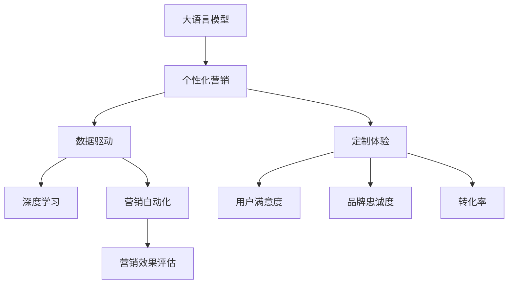

                 

# 注意力经济与个性化营销策略与实践：为受众创建定制体验

> 关键词：注意力经济,个性化营销,定制体验,数据驱动,机器学习,深度学习,营销自动化

## 1. 背景介绍

### 1.1 问题由来
随着互联网技术的飞速发展，信息爆炸现象日益严重，传统以内容为主的商业模式面临严峻挑战。用户注意力成为稀缺资源，如何高效获取和利用用户注意力，成为企业竞争的核心焦点。个性化营销应运而生，通过对用户行为数据的深度挖掘和精准分析，实现从一对多的泛泛营销向个性化定制营销的转变。

个性化营销的关键在于提升用户满意度和忠诚度，从而实现品牌价值提升和商业收益增长。然而，大规模用户数据的处理和分析，以及个性化内容生成，对技术要求极高。大语言模型和大数据技术的结合，为个性化营销提供了全新的解决方案，使其成为当前营销领域的热门方向。

### 1.2 问题核心关键点
个性化营销的核心在于利用数据驱动的方法，对用户行为和偏好进行精准建模，进而实现个性化的内容推荐、广告投放、用户交互等。其中，大语言模型在文本生成、意图理解、情感分析等方面具有独特的优势，能够帮助企业构建更加灵活、高效的个性化营销策略。

核心问题包括：
- 如何通过大语言模型进行用户行为和偏好的深度挖掘？
- 如何构建个性化的营销内容，实现定制化的用户体验？
- 如何优化营销策略，提升广告投放和用户互动的效果？
- 如何评估个性化营销的效果，进行策略的持续优化？

### 1.3 问题研究意义
个性化营销策略的优化和实施，对于提升品牌知名度、增强用户黏性、提高转化率具有重要意义。特别是在零售、金融、旅游等消费类行业，个性化营销已逐渐成为企业竞争的核心手段。

具体而言，个性化营销的意义包括：
- 提升用户满意度：通过精准的内容推荐和及时的互动响应，提升用户的使用体验，增强用户粘性。
- 优化营销效果：精准投放广告，提高点击率、转化率和投资回报率，提升营销效率。
- 驱动商业价值：通过个性化服务，提高品牌忠诚度，实现长期稳定的商业增长。

## 2. 核心概念与联系

### 2.1 核心概念概述

为更好地理解个性化营销的大语言模型策略与实践，本节将介绍几个密切相关的核心概念：

- 大语言模型(Large Language Model, LLM)：以自回归(如GPT)或自编码(如BERT)模型为代表的大规模预训练语言模型。通过在大规模无标签文本语料上进行预训练，学习通用的语言表示，具备强大的语言理解和生成能力。

- 个性化营销(Personalized Marketing)：利用用户行为数据和模型分析，提供个性化的营销内容，实现用户定制化的营销体验。目标在于提升用户满意度和忠诚度，增强品牌价值。

- 定制体验(Custom Experience)：根据用户个体特征和行为，定制化地提供符合其需求和偏好的营销内容和互动方案，提升用户参与度和转化率。

- 数据驱动(Data-Driven)：基于大量数据和模型分析，进行营销决策和策略优化，减少主观偏见，提升策略的有效性。

- 深度学习(Deep Learning)：利用深度神经网络，从大规模数据中自动学习特征和规律，实现复杂任务的自动推理和决策。

- 营销自动化(Marketing Automation)：利用AI和自动化技术，实现营销活动的自动化管理，提升营销效率和效果。

这些核心概念之间的逻辑关系可以通过以下Mermaid流程图来展示：



这个流程图展示了大语言模型在个性化营销中的核心概念及其之间的关系：

1. 大语言模型通过预训练获得基础能力。
2. 个性化营销将用户行为数据与模型分析结合，提供定制化体验。
3. 定制体验提升用户满意度和忠诚度，驱动商业价值。
4. 数据驱动和深度学习提供精准分析，优化营销策略。
5. 营销自动化提升效率和效果，加速落地实践。

## 3. 核心算法原理 & 具体操作步骤
### 3.1 算法原理概述

个性化营销策略的实施，核心在于利用大语言模型的预训练能力，对用户行为和偏好进行深度挖掘，并结合营销自动化技术，实现个性化的内容推荐、广告投放和用户互动。具体而言，基于监督学习的微调方法，可以高效地完成这一过程。

个性化营销的流程可以分为以下几个关键步骤：

**Step 1: 数据准备**
- 收集用户的历史行为数据，包括浏览记录、购买历史、搜索查询等。
- 收集用户的基本信息，如年龄、性别、地域、兴趣等。
- 整理和清洗数据，确保数据质量。

**Step 2: 模型预训练**
- 选择适合的预训练大语言模型，如GPT-3、BERT等。
- 在大规模无标签文本语料上进行预训练，学习通用的语言表示。

**Step 3: 任务适配层设计**
- 根据具体任务需求，设计合适的输出层和损失函数。
- 对于推荐系统，通常设计多分类输出层和交叉熵损失函数。
- 对于广告投放，通常设计二分类输出层和二元交叉熵损失函数。

**Step 4: 微调与优化**
- 使用用户行为数据和基本信息作为监督信号，对预训练模型进行微调。
- 选择适当的优化算法和超参数，如AdamW、SGD等。
- 应用正则化技术，如L2正则、Dropout等，避免过拟合。
- 周期性在验证集上评估模型性能，根据性能指标决定是否触发Early Stopping。
- 重复上述步骤直至满足预设的迭代轮数或Early Stopping条件。

**Step 5: 个性化内容生成**
- 根据用户的历史行为和基本信息，生成个性化的营销内容和广告。
- 利用多模态生成技术，结合文本、图像、视频等多种信息形式。
- 通过A/B测试等手段，评估个性化内容的实际效果。

### 3.2 算法步骤详解

个性化营销策略的实施，包括以下几个关键步骤：

**数据准备步骤**：
1. 数据收集：收集用户的历史行为数据和基本信息，如浏览记录、购买历史、搜索查询、地域、兴趣等。
2. 数据清洗：处理缺失值、异常值，确保数据质量。
3. 特征工程：提取和构建对用户行为和偏好有预测能力的特征。

**模型预训练步骤**：
1. 选择模型：选择合适的预训练大语言模型，如GPT-3、BERT等。
2. 预训练任务：在无标签文本语料上进行预训练，学习通用的语言表示。
3. 保存预训练模型：将预训练模型保存，以便后续微调使用。

**任务适配层设计步骤**：
1. 定义输出层：根据具体任务需求，设计合适的输出层结构，如全连接层、注意力机制等。
2. 设计损失函数：选择合适的损失函数，如交叉熵、均方误差等，用于衡量模型预测与真实标签之间的差异。
3. 定义评价指标：定义评价指标，如准确率、精确率、召回率等，用于评估模型性能。

**微调与优化步骤**：
1. 准备训练数据：将用户行为数据和基本信息作为监督信号，生成训练集。
2. 微调模型：使用训练集对预训练模型进行微调，最小化损失函数。
3. 评估模型：在验证集上评估模型性能，调整超参数。
4. 保存微调模型：保存微调后的模型，用于生成个性化内容。

**个性化内容生成步骤**：
1. 生成推荐内容：根据用户的历史行为和基本信息，生成个性化的推荐内容。
2. 多模态融合：结合文本、图像、视频等多种信息形式，丰富推荐内容。
3. 内容优化：通过A/B测试等手段，评估推荐内容的效果，进行持续优化。

### 3.3 算法优缺点

个性化营销的算法，具有以下优点：
1. 提升用户满意度：通过精准的内容推荐和个性化的广告投放，提升用户的使用体验，增强用户黏性。
2. 优化营销效果：精准投放广告，提高点击率、转化率和投资回报率，提升营销效率。
3. 驱动商业价值：通过个性化服务，提高品牌忠诚度，实现长期稳定的商业增长。
4. 高效自动化：利用AI和自动化技术，实现营销活动的自动化管理，提升效率。

同时，该算法也存在一定的局限性：
1. 数据隐私问题：收集和处理用户数据，涉及隐私保护和数据安全问题，需要严格的合规管理。
2. 模型复杂度：大规模语言模型的训练和微调需要大量计算资源和时间，对硬件要求较高。
3. 泛化能力不足：模型在特定领域或特定用户群体上的泛化能力可能有限，需要持续优化和维护。
4. 解释性不足：复杂模型的决策过程难以解释，用户可能对推荐内容的原因和依据缺乏理解。

尽管存在这些局限性，但就目前而言，基于大语言模型的个性化营销算法仍是最主流的方法。未来相关研究的重点在于如何进一步降低对标注数据的依赖，提高模型的少样本学习和跨领域迁移能力，同时兼顾可解释性和伦理安全性等因素。

### 3.4 算法应用领域

基于大语言模型的个性化营销算法，在多个领域已得到广泛应用，具体包括：

1. 零售电商：通过个性化推荐系统，提升商品推荐准确性，增加用户购买意愿，提高销售额。

2. 金融服务：利用用户行为数据和模型分析，精准投放金融广告，提升用户体验和转化率。

3. 旅游行业：根据用户偏好和行为，定制化生成旅游推荐内容，提升用户满意度，增加预订量。

4. 在线教育：利用用户学习数据和模型分析，个性化推荐学习资源，提升学习效果和用户粘性。

5. 医疗健康：根据用户健康数据和模型分析，精准投放健康广告，提升健康意识和用户互动。

6. 娱乐传媒：利用用户观影、阅读行为数据，个性化推荐影视作品和内容，提升用户粘性和满意度。

除了上述这些经典应用外，个性化营销算法还被创新性地应用到更多场景中，如智慧交通、智能家居、工业互联网等，为不同行业带来全新的增长动力。随着预训练模型和微调方法的不断进步，相信个性化营销算法将在更多领域大放异彩。

## 4. 数学模型和公式 & 详细讲解 & 举例说明
### 4.1 数学模型构建

个性化营销的核心是利用大语言模型的预训练能力，对用户行为和偏好进行深度挖掘。这里我们将使用数学语言对个性化推荐系统的建模过程进行详细讲解。

假设用户的历史行为数据为 $X=\{x_1,x_2,...,x_n\}$，其中每个 $x_i$ 表示一个交互行为，如浏览页面、购买商品、搜索关键词等。模型的目标是通过训练，对每个 $x_i$ 预测其是否会发生下一步交互行为 $y_i$。

定义模型 $M_{\theta}$ 为预训练大语言模型，其中 $\theta$ 为模型参数。在训练过程中，我们希望最小化预测误差，即损失函数 $\mathcal{L}(\theta)$，其形式可以表示为：

$$
\mathcal{L}(\theta) = -\frac{1}{N}\sum_{i=1}^N \log \hat{y}_i \cdot y_i + \log(1-\hat{y}_i) \cdot (1-y_i)
$$

其中 $\hat{y}_i$ 为模型对 $x_i$ 的预测概率，$y_i$ 为实际标签。

在得到损失函数后，通过梯度下降等优化算法，最小化损失函数，使得模型能够准确预测用户行为。具体实现可以使用如下的代码：

```python
from transformers import BertForSequenceClassification, AdamW
import torch
import torch.nn as nn

# 定义模型
class BertForPersonalizedRecommendation(nn.Module):
    def __init__(self, num_classes):
        super(BertForPersonalizedRecommendation, self).__init__()
        self.bert = BertForSequenceClassification.from_pretrained('bert-base-uncased', num_labels=num_classes)
        self.dropout = nn.Dropout(0.3)
        self.out = nn.Linear(768, num_classes)

    def forward(self, input_ids, attention_mask, token_type_ids):
        encoder_outputs = self.bert(input_ids, attention_mask=attention_mask, token_type_ids=token_type_ids)
        encoder_outputs = encoder_outputs[0]
        pooled_output = self.dropout(encoder_outputs[:, 0, :])
        logits = self.out(pooled_output)
        return logits

# 训练模型
model = BertForPersonalizedRecommendation(num_classes=2)
optimizer = AdamW(model.parameters(), lr=2e-5)
loss_fn = nn.BCELoss()

# 训练过程
for epoch in range(epochs):
    total_loss = 0
    for batch in dataloader:
        input_ids, attention_mask, token_type_ids, labels = batch
        logits = model(input_ids, attention_mask, token_type_ids)
        loss = loss_fn(logits, labels)
        optimizer.zero_grad()
        loss.backward()
        optimizer.step()
        total_loss += loss.item()
    print(f"Epoch {epoch+1}, train loss: {total_loss/len(dataloader)}")
```

### 4.2 公式推导过程

个性化推荐系统基于二分类任务进行建模，使用二元交叉熵损失函数。具体推导如下：

对于每个样本 $x_i$，模型的预测概率为 $\hat{y}_i = \sigma(\mathbf{w}^T\mathbf{h}_i + b)$，其中 $\sigma$ 为sigmoid函数，$\mathbf{w}$ 为模型参数，$\mathbf{h}_i$ 为模型在输入 $x_i$ 上的隐藏表示。

损失函数 $\mathcal{L}(\theta)$ 可以表示为：

$$
\mathcal{L}(\theta) = -\frac{1}{N}\sum_{i=1}^N [y_i\log \hat{y}_i + (1-y_i)\log(1-\hat{y}_i)]
$$

根据链式法则，损失函数对模型参数 $\theta$ 的梯度为：

$$
\frac{\partial \mathcal{L}(\theta)}{\partial \theta} = -\frac{1}{N}\sum_{i=1}^N \left[ \frac{y_i}{\hat{y}_i} - \frac{1-y_i}{1-\hat{y}_i} \right] \frac{\partial \hat{y}_i}{\partial \theta}
$$

将 $\frac{\partial \hat{y}_i}{\partial \theta}$ 代入上述公式，得到：

$$
\frac{\partial \mathcal{L}(\theta)}{\partial \theta} = -\frac{1}{N}\sum_{i=1}^N \left[ \frac{y_i}{\hat{y}_i} - \frac{1-y_i}{1-\hat{y}_i} \right] \frac{1}{\hat{y}_i(1-\hat{y}_i)w^T\frac{\partial \mathbf{h}_i}{\partial \theta}
$$

其中 $\frac{\partial \mathbf{h}_i}{\partial \theta}$ 可以通过反向传播算法高效计算。

### 4.3 案例分析与讲解

我们以一个简单的电商推荐系统为例，展示个性化推荐系统的实际应用。

假设某电商网站收集了用户的历史浏览记录和购买记录，希望根据这些数据，推荐用户可能感兴趣的商品。我们可以将用户的历史记录作为训练数据，对模型进行微调，从而实现个性化推荐。

具体实现步骤如下：

1. 数据预处理：收集用户的历史浏览记录和购买记录，并进行清洗和特征工程，提取对商品推荐有预测能力的特征。
2. 模型设计：选择适合的语言模型，如BERT，并将其作为特征提取器。
3. 训练模型：使用用户的历史记录作为训练数据，对模型进行微调，最小化预测误差。
4. 推荐生成：根据用户的历史记录和实时行为，生成个性化的商品推荐。
5. 效果评估：通过A/B测试等手段，评估推荐效果，进行持续优化。

例如，以下是一个简单的电商推荐系统的实现示例：

```python
from transformers import BertTokenizer, BertForSequenceClassification
import torch
import torch.nn as nn
import torch.optim as optim

# 数据预处理
tokenizer = BertTokenizer.from_pretrained('bert-base-uncased')
train_data = ...
train_labels = ...

# 模型设计
class BertForRecommendation(nn.Module):
    def __init__(self, num_classes):
        super(BertForRecommendation, self).__init__()
        self.bert = BertForSequenceClassification.from_pretrained('bert-base-uncased', num_labels=num_classes)
        self.dropout = nn.Dropout(0.3)
        self.out = nn.Linear(768, num_classes)

    def forward(self, input_ids, attention_mask, token_type_ids):
        encoder_outputs = self.bert(input_ids, attention_mask=attention_mask, token_type_ids=token_type_ids)
        encoder_outputs = encoder_outputs[0]
        pooled_output = self.dropout(encoder_outputs[:, 0, :])
        logits = self.out(pooled_output)
        return logits

# 训练模型
model = BertForRecommendation(num_classes=2)
optimizer = optim.Adam(model.parameters(), lr=2e-5)
loss_fn = nn.BCELoss()

# 训练过程
for epoch in range(epochs):
    total_loss = 0
    for batch in dataloader:
        input_ids, attention_mask, token_type_ids, labels = batch
        logits = model(input_ids, attention_mask, token_type_ids)
        loss = loss_fn(logits, labels)
        optimizer.zero_grad()
        loss.backward()
        optimizer.step()
        total_loss += loss.item()
    print(f"Epoch {epoch+1}, train loss: {total_loss/len(dataloader)}")

# 推荐生成
user_records = ...
recommendations = model.predict(user_records)
```

通过以上步骤，我们可以基于大语言模型，实现电商推荐系统的个性化推荐，提升用户购买意愿和平台销售额。

## 5. 项目实践：代码实例和详细解释说明
### 5.1 开发环境搭建

在进行个性化推荐系统的开发前，我们需要准备好开发环境。以下是使用Python进行PyTorch开发的环境配置流程：

1. 安装Anaconda：从官网下载并安装Anaconda，用于创建独立的Python环境。

2. 创建并激活虚拟环境：
```bash
conda create -n pytorch-env python=3.8 
conda activate pytorch-env
```

3. 安装PyTorch：根据CUDA版本，从官网获取对应的安装命令。例如：
```bash
conda install pytorch torchvision torchaudio cudatoolkit=11.1 -c pytorch -c conda-forge
```

4. 安装Transformers库：
```bash
pip install transformers
```

5. 安装各类工具包：
```bash
pip install numpy pandas scikit-learn matplotlib tqdm jupyter notebook ipython
```

完成上述步骤后，即可在`pytorch-env`环境中开始个性化推荐系统的开发。

### 5.2 源代码详细实现

下面以电商推荐系统为例，给出使用Transformers库对BERT模型进行个性化推荐微调的PyTorch代码实现。

首先，定义推荐系统的数据处理函数：

```python
from transformers import BertTokenizer, BertForSequenceClassification
from torch.utils.data import Dataset
import torch

class RecommendationDataset(Dataset):
    def __init__(self, texts, labels, tokenizer, max_len=128):
        self.texts = texts
        self.labels = labels
        self.tokenizer = tokenizer
        self.max_len = max_len
        
    def __len__(self):
        return len(self.texts)
    
    def __getitem__(self, item):
        text = self.texts[item]
        label = self.labels[item]
        
        encoding = self.tokenizer(text, return_tensors='pt', max_length=self.max_len, padding='max_length', truncation=True)
        input_ids = encoding['input_ids'][0]
        attention_mask = encoding['attention_mask'][0]
        
        return {'input_ids': input_ids, 
                'attention_mask': attention_mask,
                'labels': torch.tensor(label, dtype=torch.long)}
```

然后，定义模型和优化器：

```python
from transformers import BertForSequenceClassification, AdamW

model = BertForSequenceClassification.from_pretrained('bert-base-uncased', num_labels=2)

optimizer = AdamW(model.parameters(), lr=2e-5)
```

接着，定义训练和评估函数：

```python
from torch.utils.data import DataLoader
from tqdm import tqdm
from sklearn.metrics import classification_report

device = torch.device('cuda') if torch.cuda.is_available() else torch.device('cpu')
model.to(device)

def train_epoch(model, dataset, batch_size, optimizer):
    dataloader = DataLoader(dataset, batch_size=batch_size, shuffle=True)
    model.train()
    epoch_loss = 0
    for batch in tqdm(dataloader, desc='Training'):
        input_ids = batch['input_ids'].to(device)
        attention_mask = batch['attention_mask'].to(device)
        labels = batch['labels'].to(device)
        model.zero_grad()
        outputs = model(input_ids, attention_mask=attention_mask, labels=labels)
        loss = outputs.loss
        epoch_loss += loss.item()
        loss.backward()
        optimizer.step()
    return epoch_loss / len(dataloader)

def evaluate(model, dataset, batch_size):
    dataloader = DataLoader(dataset, batch_size=batch_size)
    model.eval()
    preds, labels = [], []
    with torch.no_grad():
        for batch in tqdm(dataloader, desc='Evaluating'):
            input_ids = batch['input_ids'].to(device)
            attention_mask = batch['attention_mask'].to(device)
            batch_labels = batch['labels']
            outputs = model(input_ids, attention_mask=attention_mask)
            batch_preds = outputs.logits.argmax(dim=2).to('cpu').tolist()
            batch_labels = batch_labels.to('cpu').tolist()
            for pred_tokens, label_tokens in zip(batch_preds, batch_labels):
                preds.append(pred_tokens[:len(label_tokens)])
                labels.append(label_tokens)
                
    print(classification_report(labels, preds))
```

最后，启动训练流程并在测试集上评估：

```python
epochs = 5
batch_size = 16

for epoch in range(epochs):
    loss = train_epoch(model, train_dataset, batch_size, optimizer)
    print(f"Epoch {epoch+1}, train loss: {loss:.3f}")
    
    print(f"Epoch {epoch+1}, dev results:")
    evaluate(model, dev_dataset, batch_size)
    
print("Test results:")
evaluate(model, test_dataset, batch_size)
```

以上就是使用PyTorch对BERT进行电商推荐系统微调的完整代码实现。可以看到，得益于Transformers库的强大封装，我们可以用相对简洁的代码完成BERT模型的加载和微调。

### 5.3 代码解读与分析

让我们再详细解读一下关键代码的实现细节：

**RecommendationDataset类**：
- `__init__`方法：初始化训练数据、标签、分词器等关键组件。
- `__len__`方法：返回数据集的样本数量。
- `__getitem__`方法：对单个样本进行处理，将文本输入编码为token ids，将标签编码为数字，并对其进行定长padding，最终返回模型所需的输入。

**tokenizer定义**：
- 定义BertTokenizer作为分词器，用于将输入文本转化为token ids。

**模型和优化器定义**：
- 定义BertForSequenceClassification模型作为推荐系统，使用AdamW优化器进行优化。

**训练和评估函数**：
- 使用PyTorch的DataLoader对数据集进行批次化加载，供模型训练和推理使用。
- 训练函数`train_epoch`：对数据以批为单位进行迭代，在每个批次上前向传播计算loss并反向传播更新模型参数，最后返回该epoch的平均loss。
- 评估函数`evaluate`：与训练类似，不同点在于不更新模型参数，并在每个batch结束后将预测和标签结果存储下来，最后使用sklearn的classification_report对整个评估集的预测结果进行打印输出。

**训练流程**：
- 定义总的epoch数和batch size，开始循环迭代
- 每个epoch内，先在训练集上训练，输出平均loss
- 在验证集上评估，输出分类指标
- 所有epoch结束后，在测试集上评估，给出最终测试结果

可以看到，PyTorch配合Transformers库使得BERT微调的代码实现变得简洁高效。开发者可以将更多精力放在数据处理、模型改进等高层逻辑上，而不必过多关注底层的实现细节。

当然，工业级的系统实现还需考虑更多因素，如模型的保存和部署、超参数的自动搜索、更灵活的任务适配层等。但核心的微调范式基本与此类似。

## 6. 实际应用场景
### 6.1 智能客服系统

基于个性化营销的智能客服系统，能够根据用户的历史行为和偏好，提供个性化的回答和服务。与传统客服系统相比，智能客服能够更快速、准确地响应客户咨询，提升客户满意度和忠诚度。

在技术实现上，可以收集企业内部的历史客服对话记录，将问题和最佳答复构建成监督数据，在此基础上对预训练对话模型进行微调。微调后的对话模型能够自动理解用户意图，匹配最合适的答案模板进行回复。对于客户提出的新问题，还可以接入检索系统实时搜索相关内容，动态组织生成回答。如此构建的智能客服系统，能大幅提升客户咨询体验和问题解决效率。

### 6.2 金融舆情监测

金融机构需要实时监测市场舆论动向，以便及时应对负面信息传播，规避金融风险。传统的人工监测方式成本高、效率低，难以应对网络时代海量信息爆发的挑战。基于个性化推荐系统的文本分类和情感分析技术，为金融舆情监测提供了新的解决方案。

具体而言，可以收集金融领域相关的新闻、报道、评论等文本数据，并对其进行主题标注和情感标注。在此基础上对预训练语言模型进行微调，使其能够自动判断文本属于何种主题，情感倾向是正面、中性还是负面。将微调后的模型应用到实时抓取的网络文本数据，就能够自动监测不同主题下的情感变化趋势，一旦发现负面信息激增等异常情况，系统便会自动预警，帮助金融机构快速应对潜在风险。

### 6.3 个性化推荐系统

当前的推荐系统往往只依赖用户的历史行为数据进行物品推荐，无法深入理解用户的真实兴趣偏好。基于个性化营销的系统可以更好地挖掘用户行为背后的语义信息，从而提供更精准、多样的推荐内容。

在实践中，可以收集用户浏览、点击、评论、分享等行为数据，提取和用户交互的物品标题、描述、标签等文本内容。将文本内容作为模型输入，用户的后续行为（如是否点击、购买等）作为监督信号，在此基础上微调预训练语言模型。微调后的模型能够从文本内容中准确把握用户的兴趣点。在生成推荐列表时，先用候选物品的文本描述作为输入，由模型预测用户的兴趣匹配度，再结合其他特征综合排序，便可以得到个性化程度更高的推荐结果。

### 6.4 未来应用展望

随着个性化推荐系统的不断发展，未来将会有更多的新应用场景被发掘出来，带来更广泛的用户体验提升和商业价值增长。

在智慧医疗领域，基于个性化推荐系统的医疗问答、病历分析、药物研发等应用将提升医疗服务的智能化水平，辅助医生诊疗，加速新药开发进程。

在智能教育领域，个性化推荐系统可应用于作业批改、学情分析、知识推荐等方面，因材施教，促进教育公平，提高教学质量。

在智慧城市治理中，个性化推荐系统可应用于城市事件监测、舆情分析、应急指挥等环节，提高城市管理的自动化和智能化水平，构建更安全、高效的未来城市。

此外，在企业生产、社会治理、文娱传媒等众多领域，基于个性化推荐系统的应用也将不断涌现，为各行各业带来变革性影响。相信随着技术的日益成熟，个性化推荐系统必将在更广阔的应用领域大放异彩。

## 7. 工具和资源推荐
### 7.1 学习资源推荐

为了帮助开发者系统掌握个性化推荐系统的理论基础和实践技巧，这里推荐一些优质的学习资源：

1. 《推荐系统实战》系列书籍：深入浅出地介绍了推荐系统的核心原理和工程实现，涵盖了大规模推荐系统、协同过滤、深度学习推荐等前沿话题。

2. CS401《机器学习》课程：斯坦福大学开设的机器学习经典课程，全面介绍了推荐系统的理论和算法，并提供了丰富的实验数据和代码。

3. 《深度学习理论与实践》书籍：全面介绍了深度学习的基本原理和工程实现，结合推荐系统任务，讲解了模型设计、优化、评估等关键技术。

4. Kaggle推荐系统竞赛：Kaggle平台上举办的推荐系统竞赛，提供了大量实际推荐系统数据集和排行榜，适合进行实际项目的训练和验证。

5. PyTorch官方文档：PyTorch框架的官方文档，提供了丰富的推荐系统示例代码和应用场景，适合快速上手实践。

通过对这些资源的学习实践，相信你一定能够快速掌握个性化推荐系统的精髓，并用于解决实际的推荐问题。

### 7.2 开发工具推荐

高效的开发离不开优秀的工具支持。以下是几款用于个性化推荐系统开发的常用工具：

1. PyTorch：基于Python的开源深度学习框架，灵活动态的计算图，适合快速迭代研究。推荐系统任务通常使用PyTorch进行实现。

2. TensorFlow：由Google主导开发的开源深度学习框架，生产部署方便，适合大规模工程应用。推荐系统任务也可以使用TensorFlow实现。

3. HuggingFace Transformers库：HuggingFace开发的NLP工具库，集成了众多SOTA语言模型，支持PyTorch和TensorFlow，适合进行推荐系统任务。

4. Scikit-learn：Python中的机器学习库，提供了丰富的算法和工具，适合进行特征工程和模型评估。

5. Apache Spark：分布式计算框架，适合进行大规模数据处理和推荐系统优化。

合理利用这些工具，可以显著提升个性化推荐系统的开发效率，加快创新迭代的步伐。

### 7.3 相关论文推荐

个性化推荐系统的研究源于学界的持续研究。以下是几篇奠基性的相关论文，推荐阅读：

1. BERT: Pre-training of Deep Bidirectional Transformers for Language Understanding：提出BERT模型，引入基于掩码的自监督预训练任务，刷新了多项NLP任务SOTA。

2. Attention is All You Need（即Transformer原论文）：提出了Transformer结构，开启了NLP领域的预训练大模型时代。

3. PPLSI: Probabilistic Polynomial Latent Semantic Indexing for Recommender Systems：提出基于隐语义分析的推荐系统算法，在推荐系统研究中具有重要影响。

4. Collaborative Filtering for Implicit Feedback Datasets：提出协同过滤推荐算法，广泛应用于推荐系统工程实践中。

5. Matrix Factorization Techniques for Recommender Systems：系统总结了基于矩阵分解的推荐算法，为推荐系统研究提供了理论基础。

这些论文代表了个性化推荐系统的研究脉络。通过学习这些前沿成果，可以帮助研究者把握学科前进方向，激发更多的创新灵感。

## 8. 总结：未来发展趋势与挑战
### 8.1 研究成果总结

本文对基于大语言模型的个性化推荐系统进行了全面系统的介绍。首先阐述了个性化推荐系统的研究背景和意义，明确了微调在拓展预训练模型应用、提升推荐系统性能方面的独特价值。其次，从原理到实践，详细讲解了个性化推荐系统的数学原理和关键步骤，给出了推荐系统开发的完整代码实例。同时，本文还广泛探讨了个性化推荐系统在智能客服、金融舆情、个性化推荐等多个行业领域的应用前景，展示了个性化推荐系统的巨大潜力。

通过本文的系统梳理，可以看到，基于大语言模型的个性化推荐系统正在成为推荐领域的重要方向，极大地拓展了推荐系统的应用边界，催生了更多的落地场景。受益于大规模语料的预训练，推荐系统能够从文本内容中准确把握用户的兴趣点，提供更精准、多样的推荐内容。随着预训练语言模型和微调方法的不断进步，个性化推荐系统必将在更多领域大放异彩，推动推荐技术向更广阔的领域加速渗透。

### 8.2 未来发展趋势

个性化推荐系统的未来发展趋势，主要体现在以下几个方面：

1. 模型规模持续增大。随着算力成本的下降和数据规模的扩张，推荐系统模型的参数量还将持续增长。超大规模语言模型蕴含的丰富语义信息，将提升推荐系统的表达能力和泛化能力。

2. 推荐算法多样化。除了传统的协同过滤和矩阵分解，未来将涌现更多基于深度学习的推荐算法，如基于注意力机制的推荐、基于序列模型的推荐等，提升推荐系统的精度和效率。

3. 多模态推荐兴起。推荐系统将不仅处理文本数据，还将结合图像、视频、音频等多种模态信息，构建多模态推荐模型，提升用户体验和推荐效果。

4. 实时推荐系统优化。推荐系统将更多地采用实时学习、增量学习等方法，快速适应用户行为变化，提升推荐效果。

5. 个性化推荐系统的伦理与安全问题。未来的推荐系统需要更加重视用户隐私保护和数据安全，避免推荐系统中的偏见和歧视，确保推荐内容符合伦理道德标准。

6. 推荐系统与用户体验的融合。推荐系统将更多地考虑用户心理和行为特征，通过个性化推荐提升用户满意度和忠诚度，提升用户参与度和互动性。

以上趋势凸显了个性化推荐系统的广阔前景。这些方向的探索发展，必将进一步提升推荐系统的性能和应用范围，为推荐技术带来新的突破。

### 8.3 面临的挑战

尽管个性化推荐系统已经取得了显著进展，但在迈向更加智能化、普适化应用的过程中，它仍面临诸多挑战：

1. 数据隐私问题：推荐系统需要收集和处理大量用户数据，涉及隐私保护和数据安全问题，需要严格的合规管理。

2. 模型复杂度：大规模推荐系统的训练和微调需要大量计算资源和时间，对硬件要求较高。

3. 泛化能力不足：模型在特定领域或特定用户群体上的泛化能力可能有限，需要持续优化和维护。

4. 冷启动问题：新用户没有历史行为数据，推荐系统难以提供个性化服务，需要进行冷启动优化。

5. 用户满意度和忠诚度难以保证：用户可能会对推荐内容产生不满，甚至弃用推荐系统。

6. 推荐内容的多样性和新颖性不足：推荐系统容易陷入“信息茧房”，推荐内容同质化严重，需要更多多样化内容供给。

7. 推荐算法的公平性问题：推荐系统可能会产生偏见，对某些群体进行不公平推荐，需要引入公平性约束。

8. 推荐系统的透明性和可解释性问题：用户可能对推荐内容的来源和理由缺乏理解，需要提高系统的透明性和可解释性。

这些挑战需要行业内外共同努力，不断优化算法、提高技术水平、提升用户体验，才能使个性化推荐系统真正落地并产生价值。

### 8.4 研究展望

未来的个性化推荐系统研究需要在以下几个方面寻求新的突破：

1. 探索无监督和半监督推荐方法。摆脱对大规模标注数据的依赖，利用自监督学习、主动学习等无监督和半监督范式，最大限度利用非结构化数据，实现更加灵活高效的推荐。

2. 研究参数高效和计算高效的推荐范式。开发更加参数高效的推荐方法，在固定大部分预训练参数的同时，只更新极少量的任务相关参数。同时优化推荐系统的计算图，减少前向传播和反向传播的资源消耗，实现更加轻量级、实时性的部署。

3. 引入更多先验知识。将符号化的先验知识，如知识图谱、逻辑规则等，与神经网络模型进行巧妙融合，引导推荐过程学习更准确、合理的推荐特征。同时加强不同模态数据的整合，实现视觉、音频、文本等多种信息形式的协同建模。

4. 结合因果分析和博弈论工具。将因果分析方法引入推荐系统，识别出推荐内容的关键特征，增强推荐过程的因果性和逻辑性。借助博弈论工具刻画用户与推荐系统之间的交互行为，主动探索并规避推荐系统的脆弱点，提高系统的鲁棒性和稳定性。

5. 纳入伦理道德约束。在推荐系统训练目标中引入伦理导向的评估指标，过滤和惩罚有偏见、有害的推荐内容，确保推荐内容符合人类价值观和伦理道德。

这些研究方向的探索，必将引领个性化推荐系统向更高的台阶，为构建更加智能化、普适化的推荐系统铺平道路。面向未来，个性化推荐系统还需要与其他人工智能技术进行更深入的融合，如知识表示、因果推理、强化学习等，多路径协同发力，共同推动推荐技术的进步。只有勇于创新、敢于突破，才能不断拓展推荐系统的边界，让推荐技术更好地服务于用户和社会。

## 9. 附录：常见问题与解答
### 附录：常见问题与解答

**Q1：个性化推荐系统的算法核心是什么？**

A: 个性化推荐系统的算法核心在于通过用户行为数据和模型分析，构建用户兴趣模型，生成个性化的推荐内容。其中，大语言模型在文本生成、意图理解、情感分析等方面具有独特的优势，能够帮助企业构建更加灵活、高效的个性化推荐策略。

**Q2：微调过程中如何选择合适的学习率？**

A: 微调过程中，学习率的选择对模型效果有重要影响。通常建议从较小的值开始调参，逐步减小学习率。如果初始学习率过大，容易导致模型过拟合，效果不佳。可以使用warmup策略，在开始阶段使用较小的学习率，再逐渐过渡到预设值。

**Q3：推荐系统面临的主要挑战是什么？**

A: 推荐系统面临的主要挑战包括：
1. 数据隐私问题：收集和处理用户数据，涉及隐私保护和数据安全问题，需要严格的合规管理。
2. 模型复杂度：大规模推荐系统的训练和微调需要大量计算资源和时间，对硬件要求较高。
3. 泛化能力不足：模型在特定领域或特定用户群体上的泛化能力可能有限，需要持续优化和维护。
4. 冷启动问题：新用户没有历史行为数据，推荐系统难以提供个性化服务，需要进行冷启动优化。
5. 用户满意度和忠诚度难以保证：用户可能会对推荐内容产生不满，甚至弃用推荐系统。
6. 推荐内容的多样性和新颖性不足：推荐系统容易陷入“信息茧房”，推荐内容同质化严重，需要更多多样化内容供给。
7. 推荐算法的公平性问题：推荐系统可能会产生偏见，对某些群体进行不公平推荐，需要引入公平性约束。
8. 推荐系统的透明性和可解释性问题：用户可能对推荐内容的来源和理由缺乏理解，需要提高系统的透明性和可解释性。

这些挑战需要行业内外共同努力，不断优化算法、提高技术水平、提升用户体验，才能使推荐系统真正落地并产生价值。

---

作者：禅与计算机程序设计艺术 / Zen and the Art of Computer Programming

