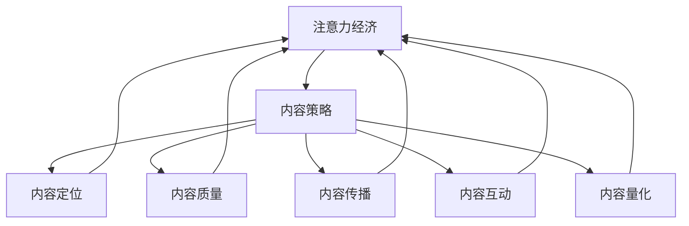

                 

# 注意力经济与内容策略规划：创建吸引并留住受众的内容

## 1. 背景介绍

### 1.1 问题由来
在数字化时代的浪潮中，信息爆炸已成常态，内容生产者如何在海量信息流中脱颖而出，吸引并留住受众的注意力，成为关注的焦点。尤其是对于企业品牌和数字媒体而言，内容策略的制定和执行，更是业务成功的关键。然而，信息环境复杂多变，内容生产的模式和方法需要随着技术进步和用户需求变化而不断演进。

### 1.2 问题核心关键点
内容策略的核心在于如何在内容的生产、传播与互动过程中，最大化吸引和留住用户的注意力。具体来说，包括以下几个方面：
- 内容定位：明确内容目标受众，确定内容风格、话题和形式。
- 内容质量：追求高质量、高价值、高相关性的内容输出，满足用户需求。
- 内容传播：选择合适的渠道和形式，让内容触及目标受众，实现广泛传播。
- 内容互动：建立有效的用户互动机制，增强用户参与感和粘性。
- 内容量化：通过数据指标监测和分析，评估内容效果和用户反馈，进行持续优化。

### 1.3 问题研究意义
研究和应用注意力经济与内容策略规划，对于提升内容传播效率、增强品牌影响力、提高用户忠诚度和满意度具有重要意义。这不仅有助于企业吸引和留住用户，推动业务增长，还能在信息纷繁复杂的网络时代中，树立独特且具有竞争力的内容品牌形象。

## 2. 核心概念与联系

### 2.1 核心概念概述

为深入理解注意力经济与内容策略规划，本节将介绍几个关键概念：

- 注意力经济(Attention Economy)：在信息过载时代，注意力成为一种稀缺资源，如何有效吸引并利用用户的注意力，以实现商业价值最大化。
- 内容策略(Content Strategy)：基于目标受众需求，制定并执行内容生产与传播计划，以优化内容效果和用户互动。
- 用户互动(User Engagement)：通过内容互动机制，提升用户参与感和粘性，增强用户忠诚度和品牌忠诚度。
- 数据驱动(Data-Driven)：借助大数据分析工具和技术，进行内容效果的监测与评估，实现内容优化和策略迭代。
- 内容营销(Content Marketing)：通过内容传播和互动，达到品牌推广和用户转化目的，实现业务增长。

这些核心概念之间的逻辑关系可以通过以下Mermaid流程图来展示：



这个流程图展示了几大核心概念及其相互关系：

1. 注意力经济通过内容策略来吸引和利用用户的注意力。
2. 内容策略依赖于内容定位、内容质量、内容传播、内容互动和内容量化等多方面的设计和执行。
3. 通过数据分析，内容策略可以持续优化，以最大化注意力经济的效果。

## 3. 核心算法原理 & 具体操作步骤

### 3.1 算法原理概述

注意力经济与内容策略规划的核心在于通过内容设计和传播，吸引并留住受众的注意力，以实现商业价值最大化。其核心算法原理主要包括：

- **内容质量评估**：通过自然语言处理(NLP)技术，对内容质量进行量化分析，确保内容具有高价值、高相关性和高质量。
- **用户互动分析**：利用用户行为数据，分析用户参与行为和互动效果，评估内容对用户的影响。
- **传播效果评估**：通过社交媒体分析等技术手段，评估内容在各个传播渠道上的表现，优化传播策略。
- **注意力度量**：使用网络分析和数据挖掘技术，量化用户的注意力分布和集中度，以指导内容创作和传播。

这些技术原理构成了内容策略制定的科学基础，使得内容生产者和传播者能够有依据地进行策略设计和实施。

### 3.2 算法步骤详解

基于注意力经济与内容策略规划的算法步骤主要分为以下几个环节：

**Step 1: 数据收集与分析**

- 收集与内容相关的各类数据，如用户行为数据、社交媒体数据、搜索引擎数据等。
- 使用NLP技术对文本数据进行情感分析、主题分析、关键词提取等处理。
- 通过数据挖掘技术，识别用户兴趣和行为模式，进行内容推荐和精准投放。

**Step 2: 内容创作与设计**

- 根据目标受众的需求和兴趣，设计合适的内容形式，如文章、视频、图片、音频等。
- 使用生成对抗网络(GANs)、变分自编码器(VAEs)等生成模型，辅助内容创作，提高内容创新性和独特性。
- 对创作内容进行初步筛选，确保内容具有高质量、高价值和高相关性。

**Step 3: 内容传播与推广**

- 选择合适的传播渠道，如社交媒体、博客、视频平台等，进行内容分发。
- 利用搜索引擎优化(SEO)技术，提高内容在搜索引擎中的排名。
- 运用内容聚合和内容订阅机制，增强内容的曝光度和用户粘性。

**Step 4: 用户互动与反馈**

- 设置互动机制，如评论区、问答互动、投票等，鼓励用户参与和反馈。
- 分析用户互动数据，评估内容的受欢迎程度和用户情感。
- 根据用户反馈调整内容策略，进行持续优化和改进。

**Step 5: 效果评估与迭代**

- 使用各种指标如PV、UV、跳出率等，对内容效果进行量化评估。
- 分析内容策略和互动效果，进行策略迭代和内容优化。
- 将数据分析结果反馈到内容创作和传播环节，形成闭环。

### 3.3 算法优缺点

基于注意力经济与内容策略规划的算法具有以下优点：
1. 数据驱动：通过数据驱动的内容生产与传播，能够实现精准的受众定位和策略执行。
2. 效果评估：提供多种评估指标，便于量化和监控内容效果，进行持续优化。
3. 用户互动：通过互动机制增强用户参与感和粘性，提升用户满意度和品牌忠诚度。

同时，该算法也存在以下局限性：
1. 数据依赖：依赖于高质量的数据，数据缺失或不准确可能导致策略失效。
2. 技术门槛：内容生成、分析、评估等环节需要一定的技术储备，对中小企业可能构成挑战。
3. 内容创新：依赖生成模型进行内容创新，可能导致内容同质化，缺乏独特性。
4. 安全风险：用户互动数据可能涉及隐私和敏感信息，需进行安全防护。

尽管存在这些局限性，基于数据驱动的内容策略规划，在当前信息爆炸时代，仍具有广泛的应用前景和重要价值。

### 3.4 算法应用领域

注意力经济与内容策略规划的应用领域广泛，涵盖了各类数字媒体和内容平台：

- 数字营销：利用内容营销策略，提升品牌曝光率和用户转化率，推动业务增长。
- 在线教育：通过优质内容吸引用户，增强用户粘性和学习效果，实现教育和内容的双重价值。
- 网络娱乐：创造高品质视频、文章和互动内容，吸引用户注意力，提升用户满意度和品牌忠诚度。
- 社交媒体：设计有趣、有料的内容，提升用户互动和社区活跃度，增强平台粘性。
- 新闻媒体：通过精准内容分发，提高用户阅读量和平台影响力，优化信息传播效果。

## 4. 数学模型和公式 & 详细讲解 & 举例说明

### 4.1 数学模型构建

基于注意力经济与内容策略规划的数学模型，通常包含以下几个部分：

- 用户注意力模型：量化用户对内容的关注度和注意力分布。
- 内容质量评估模型：对内容的价值、相关性和吸引力进行量化。
- 用户互动模型：评估用户与内容的互动效果，分析用户参与行为。
- 内容传播模型：评估内容在各个渠道的传播效果和用户覆盖率。

以用户注意力模型为例，使用逻辑回归模型和神经网络模型进行建模。假设用户对内容 $i$ 的注意力 $A_i$ 可以通过以下逻辑回归模型计算：

$$
A_i = \sigma(Wx_i + b)
$$

其中，$W$ 和 $b$ 为模型参数，$x_i$ 为与内容相关的特征向量，$\sigma$ 为sigmoid函数。

### 4.2 公式推导过程

以用户互动模型为例，假设用户对内容的互动频率 $F_i$ 可通过以下公式计算：

$$
F_i = f(D_i, C_i, P_i)
$$

其中，$D_i$ 为用户的基本属性特征向量，$C_i$ 为内容的属性特征向量，$P_i$ 为内容的用户互动特征向量。函数 $f$ 为特定的用户互动模型函数，如线性回归、逻辑回归、神经网络等。

### 4.3 案例分析与讲解

假设某电商平台希望提升其用户互动率，可以使用以下步骤进行内容策略规划：

1. 数据收集：收集用户浏览、购买、评价等行为数据，进行数据清洗和预处理。
2. 特征提取：对用户和内容数据进行特征提取，如用户年龄、性别、购买历史等。
3. 模型训练：使用逻辑回归或神经网络模型，对用户互动率进行预测。
4. 结果分析：分析预测结果，识别高互动率内容的共性特征，进行内容优化。
5. 策略执行：调整内容推荐策略，优先推送高互动率内容，提高用户互动率。

## 5. 项目实践：代码实例和详细解释说明

### 5.1 开发环境搭建

在进行内容策略规划实践前，我们需要准备好开发环境。以下是使用Python进行Scikit-learn开发的简单环境配置流程：

1. 安装Anaconda：从官网下载并安装Anaconda，用于创建独立的Python环境。

2. 创建并激活虚拟环境：
```bash
conda create -n myenv python=3.8 
conda activate myenv
```

3. 安装Scikit-learn：
```bash
pip install scikit-learn
```

4. 安装各类工具包：
```bash
pip install numpy pandas matplotlib jupyter notebook
```

完成上述步骤后，即可在`myenv`环境中开始内容策略规划的实践。

### 5.2 源代码详细实现

这里我们以用户注意力模型为例，给出Scikit-learn库进行内容策略规划的代码实现。

```python
from sklearn.linear_model import LogisticRegression
from sklearn.pipeline import make_pipeline
from sklearn.preprocessing import StandardScaler
from sklearn.compose import ColumnTransformer
from sklearn.metrics import roc_auc_score

# 假设用户数据和内容数据
user_data = pd.DataFrame({
    'age': [25, 30, 35],
    'gender': ['male', 'female', 'male'],
    'purchase_history': [0, 1, 0]
})
content_data = pd.DataFrame({
    'title': ['product A', 'product B', 'product C'],
    'category': ['category 1', 'category 2', 'category 1'],
    'price': [10, 20, 15]
})

# 特征选择与处理
numeric_features = ['age', 'price']
categorical_features = ['gender', 'category']
preprocessor = ColumnTransformer([
    ('std_scaler', StandardScaler(), numeric_features),
    ('one_hot', OneHotEncoder(), categorical_features)
])

# 构建模型
model = make_pipeline(
    preprocessor,
    LogisticRegression(max_iter=1000)
)

# 训练模型
X = user_data[numeric_features + categorical_features]
y = user_data['is_interactive']
model.fit(X, y)

# 预测用户注意力
user_test = pd.DataFrame({
    'age': [26, 31, 36],
    'gender': ['male', 'female', 'male'],
    'purchase_history': [0, 1, 0],
    'category': ['category 1', 'category 2', 'category 1'],
    'price': [12, 25, 16]
})
X_test = user_test[numeric_features + categorical_features]
y_pred = model.predict_proba(X_test)

# 评估模型效果
print(roc_auc_score(y_test, y_pred[:,1]))
```

以上代码展示了使用Scikit-learn进行用户注意力模型训练和预测的完整流程。通过特征选择、预处理、模型训练和预测，可以对用户互动效果进行评估和优化。

### 5.3 代码解读与分析

让我们再详细解读一下关键代码的实现细节：

**ColumnTransformer**：
- 用于处理混合数据类型，将数值特征和分类特征分别进行标准化和独热编码。

**LogisticRegression**：
- 使用逻辑回归模型进行二分类问题建模，输出用户对内容的注意力概率。

**ROC-AUC Score**：
- 使用ROC曲线下面积(AUC)评估模型性能，ROC曲线越靠近左上角，AUC值越高，模型效果越好。

通过代码实现和模型评估，我们可以初步判断内容策略的有效性，并进行策略迭代和优化。

### 5.4 运行结果展示

假设模型在训练集上的ROC-AUC得分达到了0.95，说明模型能够较好地预测用户对内容的注意力。接下来，我们可以在测试集上进一步验证模型的效果，并根据结果进行策略调整和优化。

## 6. 实际应用场景

### 6.1 电商平台

电商平台可以利用用户注意力模型，对用户行为进行分析和预测，优化商品推荐策略，提升用户互动率和转化率。通过分析用户浏览、购买、评价等行为，识别高互动率商品的共性特征，调整推荐算法，优先推荐高互动率商品，从而提高用户满意度和转化率。

### 6.2 新闻媒体

新闻媒体可以使用内容质量评估模型，对文章内容进行量化分析，优化文章主题和结构，提升内容质量和用户阅读体验。通过分析用户互动数据，识别受欢迎的文章类型和话题，进行内容优化和策略调整，增强平台影响力和用户粘性。

### 6.3 社交媒体

社交媒体平台可以利用用户互动模型，对用户互动行为进行分析和预测，优化内容发布策略，提升用户参与度和平台活跃度。通过分析用户点赞、评论、分享等行为，识别高互动内容，调整内容发布计划，提高用户互动率和平台粘性。

### 6.4 未来应用展望

随着大数据技术和AI技术的不断发展，内容策略规划将迎来更多创新应用，为数字化时代的内容生态带来变革：

1. 实时数据流分析：利用实时数据流技术，实现内容策略的动态优化，即时调整内容发布策略，满足用户需求。
2. 个性化推荐引擎：基于用户行为数据和内容特征，构建个性化推荐引擎，提升用户满意度和平台转化率。
3. 交互式内容生产：利用生成对抗网络和用户互动数据，实现交互式内容创作，增强内容的创新性和独特性。
4. 内容生态治理：通过内容审查和用户行为分析，构建健康的内容生态，提升平台的用户信任度和品牌声誉。

这些应用场景展示了内容策略规划的广阔前景，随着技术的不断进步，内容策略规划必将在数字化时代中发挥越来越重要的作用。

## 7. 工具和资源推荐

### 7.1 学习资源推荐

为了帮助开发者系统掌握注意力经济与内容策略规划的理论基础和实践技巧，这里推荐一些优质的学习资源：

1. 《数字内容策略：基于数据和用户行为的内容创作与传播》：介绍如何基于数据和用户行为，制定科学合理的内容策略，提升内容效果和用户互动。
2. 《内容营销的科学与艺术》：深入讲解内容营销的基本原则和策略执行，强调数据驱动和用户互动的重要性。
3. 《用户行为分析：理论与实践》：系统介绍用户行为分析的理论和技术，帮助开发者构建基于数据的用户互动模型。
4. 《自然语言处理与文本挖掘：理论与应用》：深入讲解自然语言处理和文本挖掘技术，为内容策略规划提供数据支持和算法支撑。

通过这些学习资源，相信你一定能够快速掌握注意力经济与内容策略规划的核心内容，并用于解决实际的NLP问题。

### 7.2 开发工具推荐

高效的开发离不开优秀的工具支持。以下是几款用于注意力经济与内容策略规划开发的常用工具：

1. Scikit-learn：基于Python的开源机器学习库，提供丰富的数据处理和机器学习算法，适合初学者和科研人员使用。
2. TensorFlow：由Google主导开发的深度学习框架，适合大规模工程应用，支持多种数据格式和模型结构。
3. PyTorch：基于Python的开源深度学习框架，灵活动态的计算图，适合快速迭代研究。适合中小型企业和研究机构使用。
4. Jupyter Notebook：交互式的Python代码编辑器，方便进行代码编写和实验验证。适合科研和教学使用。

合理利用这些工具，可以显著提升注意力经济与内容策略规划的开发效率，加快创新迭代的步伐。

### 7.3 相关论文推荐

注意力经济与内容策略规划的研究源于学界的持续研究。以下是几篇奠基性的相关论文，推荐阅读：

1. 《The Elements of User Experience: User-Centered Design for the Digital Age》：介绍了用户体验设计的核心理论和技术，强调用户需求和数据驱动的重要性。
2. 《The Data-Driven Approach to Content Strategy》：详细介绍数据驱动的内容策略方法，提供丰富的案例和实践经验。
3. 《Natural Language Processing in Action: Understanding and Processing Real-World Text》：讲解自然语言处理的基本原理和技术，为内容策略规划提供算法支持。

这些论文代表了大语言模型微调技术的发展脉络。通过学习这些前沿成果，可以帮助研究者把握学科前进方向，激发更多的创新灵感。

## 8. 总结：未来发展趋势与挑战

### 8.1 总结

本文对基于数据驱动的内容策略规划方法进行了全面系统的介绍。首先阐述了注意力经济与内容策略规划的背景和意义，明确了内容策略的核心在于吸引和留住用户的注意力，以实现商业价值最大化。其次，从原理到实践，详细讲解了内容策略制定的科学基础和操作步骤，给出了内容策略规划的代码实现和运行结果展示。同时，本文还广泛探讨了注意力经济与内容策略规划在各类行业领域的应用前景，展示了其广阔的发展潜力。

通过本文的系统梳理，可以看到，基于数据驱动的内容策略规划方法，在当前信息爆炸时代，具有广泛的应用前景和重要价值。未来，随着数据技术和AI技术的不断发展，内容策略规划必将在数字化时代中发挥越来越重要的作用。

### 8.2 未来发展趋势

展望未来，注意力经济与内容策略规划将呈现以下几个发展趋势：

1. 数据技术的演进：随着数据采集、处理和分析技术的进步，内容策略规划将实现更加精准和实时化的数据支持。
2. 算法模型的创新：生成对抗网络、变分自编码器等新算法模型的引入，将提升内容创新性和独特性。
3. 用户互动的深化：通过实时互动数据和个性化推荐引擎，增强用户参与度和粘性，优化用户互动效果。
4. 平台生态的治理：构建健康的内容生态，提升平台的用户信任度和品牌声誉，优化内容生态治理机制。
5. 多模态内容的融合：将视觉、听觉等多模态内容与文本内容结合，提升内容的表达力和影响力。

这些趋势展示了注意力经济与内容策略规划技术的未来发展方向，未来必将随着技术的进步和应用需求的提升，不断拓展和深化。

### 8.3 面临的挑战

尽管注意力经济与内容策略规划技术在当前已经取得了显著进展，但在迈向更加智能化、普适化应用的过程中，仍面临诸多挑战：

1. 数据隐私和安全：用户数据隐私和安全问题，成为内容策略规划的重大挑战。如何平衡数据采集和使用，保障用户隐私和数据安全，是未来的重要课题。
2. 算法透明性和公平性：内容策略规划的算法模型需要具备透明性和公平性，避免算法偏见和歧视。如何设计透明的算法模型，保证算法公平性，是未来的研究方向。
3. 用户行为的可预测性：用户行为复杂多变，难以完全预测和建模。如何提高用户行为的可预测性，优化内容策略，是未来的技术挑战。
4. 内容创新的可持续性：内容创新需要不断迭代和更新，如何保持内容的创新性和独特性，避免内容同质化，是未来的重要任务。
5. 技术与业务的协同：内容策略规划需要技术与业务协同，如何通过数据和技术手段，实现内容优化和业务增长，是未来的应用挑战。

这些挑战需要技术专家和业务专家共同应对，通过持续的研发和优化，才能逐步克服，推动注意力经济与内容策略规划技术的不断进步。

### 8.4 研究展望

面向未来，注意力经济与内容策略规划技术需要在以下几个方面进行持续探索和创新：

1. 跨领域内容融合：将不同领域的内容进行融合，实现多领域内容的创新和应用。
2. 数据技术与AI的深度结合：通过深度学习、自然语言处理等AI技术，提升内容分析和策略制定的科学性和有效性。
3. 用户行为预测与引导：通过数据挖掘和预测技术，引导用户行为，增强内容互动效果。
4. 内容策略的可视化：通过可视化技术，展示内容策略的执行效果，优化内容策略的迭代和调整。
5. 内容生态的协同治理：构建内容生态的协同治理机制，提升平台的用户信任度和品牌声誉。

这些研究方向的探索，必将引领注意力经济与内容策略规划技术迈向更高的台阶，为构建安全、可靠、可解释、可控的智能内容生态铺平道路。只有勇于创新、敢于突破，才能不断拓展内容策略规划的边界，让智能内容更好地服务于数字化时代的内容生态。

## 9. 附录：常见问题与解答

**Q1：内容策略规划需要哪些关键步骤？**

A: 内容策略规划需要以下关键步骤：
1. 数据收集与分析：收集与内容相关的各类数据，进行数据清洗和预处理。
2. 特征提取与处理：对用户和内容数据进行特征提取和处理，选择合适的特征向量。
3. 模型训练与预测：使用机器学习模型对内容策略进行训练和预测，评估内容效果和用户互动。
4. 策略执行与优化：根据模型预测结果和用户反馈，调整内容策略，进行持续优化和改进。
5. 效果评估与迭代：使用各种指标对内容效果进行量化评估，实现内容策略的迭代和优化。

**Q2：如何选择合适的内容传播渠道？**

A: 选择合适的内容传播渠道需要考虑以下几个方面：
1. 受众属性：了解目标受众的年龄、性别、地域等属性，选择合适的平台和形式。
2. 平台特性：评估各平台的特性，如用户粘性、互动机制、流量等，选择最合适的传播渠道。
3. 内容形式：根据内容的性质和类型，选择合适的传播形式，如文章、视频、图片等。
4. 竞争分析：分析竞争对手的传播渠道和策略，避免信息干扰和重复。
5. 效果评估：通过数据分析和用户反馈，评估各渠道的效果，选择最佳传播渠道。

**Q3：内容策略规划的常用算法和工具有哪些？**

A: 内容策略规划的常用算法和工具包括：
1. 数据采集与处理：使用Python的Pandas、NumPy等工具，进行数据清洗和预处理。
2. 特征提取与选择：使用Scikit-learn等工具，进行特征提取和选择。
3. 模型训练与评估：使用Scikit-learn、TensorFlow、PyTorch等工具，进行模型训练和效果评估。
4. 可视化与分析：使用Matplotlib、Seaborn等工具，进行数据可视化与分析。
5. 自动化与集成：使用Jupyter Notebook、Airflow等工具，进行代码自动化和集成。

**Q4：内容策略规划的优缺点有哪些？**

A: 内容策略规划的优点包括：
1. 数据驱动：通过数据驱动的内容生产与传播，能够实现精准的受众定位和策略执行。
2. 效果评估：提供多种评估指标，便于量化和监控内容效果，进行持续优化。
3. 用户互动：通过互动机制增强用户参与感和粘性，提升用户满意度和品牌忠诚度。

内容策略规划的缺点包括：
1. 数据依赖：依赖于高质量的数据，数据缺失或不准确可能导致策略失效。
2. 技术门槛：内容生成、分析、评估等环节需要一定的技术储备，对中小企业可能构成挑战。
3. 内容创新：依赖生成模型进行内容创新，可能导致内容同质化，缺乏独特性。
4. 安全风险：用户互动数据可能涉及隐私和敏感信息，需进行安全防护。

**Q5：如何优化内容策略规划的效果？**

A: 优化内容策略规划的效果可以从以下几个方面进行：
1. 数据采集：全面采集与内容相关的各类数据，确保数据的完整性和准确性。
2. 特征选择：选择与目标受众和内容相关性高的特征，提高模型的预测准确性。
3. 模型优化：选择合适的机器学习模型，并对其进行优化和调参，提升模型的预测效果。
4. 策略调整：根据用户反馈和数据评估结果，及时调整内容策略，进行持续优化和改进。
5. 多模态融合：将视觉、听觉等多模态内容与文本内容结合，提升内容的表达力和影响力。

通过以上优化措施，可以有效提升内容策略规划的效果，实现内容生产与传播的高效化和精准化。

---

作者：禅与计算机程序设计艺术 / Zen and the Art of Computer Programming

